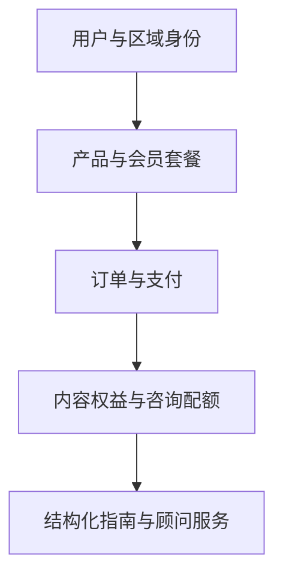
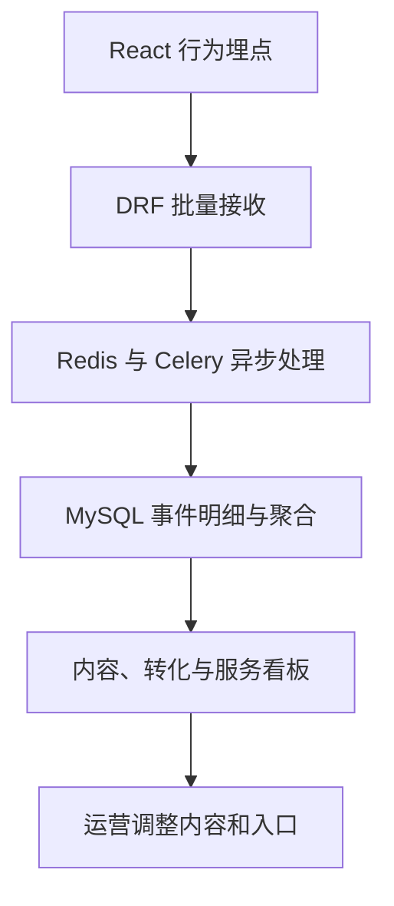
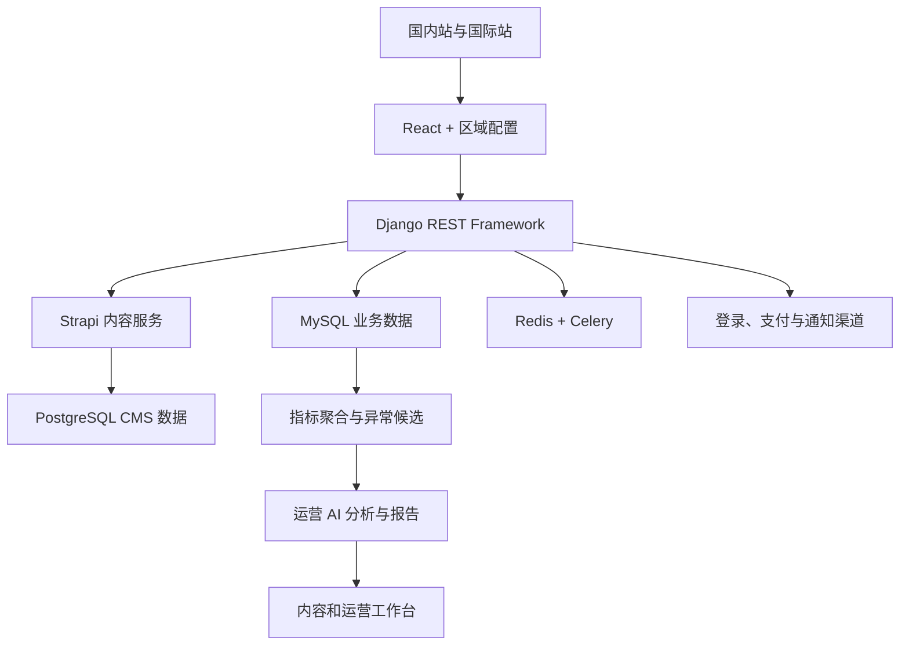

# Ovanta——跨区域签证、移民与海外身份自助申请平台

## 0. 文档说明

本文是 Ovanta 的企业产品与技术说明，用于统一产品定位、业务流程、内容治理、商业模式、区域化交付、数据运营和质量目标。

官网：

- 国内站：[ovanta.cn](https://www.ovanta.cn/)
- 国际站：[ovanta.net](https://www.ovanta.net/)

---

## 设计哲学与核心范式

Ovanta 不是普通的签证资讯网站，也不是传统中介的线上翻版。其技术架构围绕五个工程决策展开。

### 范式一：支付回调 Hook 链——Before Tool 阻断，失败语义与操作代价匹配

支付是 Ovanta 风险最高的链路。支付成功不等于业务链路完成——渠道返回成功后，平台还需要正确接收回调、推进订单状态并发放对应权益。任何环节异常，都可能表现为用户已付款却无法使用服务。

因此，Ovanta 的支付回调处理不是一段简单的 Controller，而是一套 **Before Tool Hook 链**，每一步都是阻断型校验：

```text
Webhook 到达
  → 验证渠道签名和回调来源（失败 → 阻断，返回 403）
  → 根据外部交易号和内部订单号定位订单（未找到 → 阻断，不创建幽灵订单）
  → 核对商户、金额、币种和产品（不匹配 → 阻断，记录异常回调）
  → 校验当前状态是否允许迁移（状态机约束，非法迁移 → 阻断）
  → 幂等键检查（重复 Webhook → 幂等返回成功，不重复发放权益）
  → 记录原始回调摘要和处理结果
  → 在确定性业务逻辑中发放权益
  → 对失败任务进行受控重试和人工补偿
```

核心原则直接引自已验证的行业实践：**失败语义必须与操作代价匹配。** 读侧降级（查询失败可以回退），写侧阻断（支付回调和权益发放失败必须拒绝继续）。这与腾讯 DECO 的 Hook 治理设计一脉相承——"低代价失败可以降级，高代价失败必须拒绝继续"。

### 范式二：运营 AI 的决策边界——候选 → 洞察 → 结论，AI 不直接修改生产配置

Ovanta 在用户申请路径中不引入 AI 顾问，但在埋点数据和后端业务事件之上引入了运营 AI 分析。借鉴"异常候选 ≠ 业务告警"的三层分离设计：

```text
第一层（异常候选）：指标偏离 → 系统计算"当前漏斗是否明显不同于历史正常范围"
第二层（运营洞察）：AI 将候选与内容背景关联 → 提出可能解释
第三层（正式结论）：运营人员结合活动、渠道、政策变化完成确认
```

关键约束：**AI 不直接修改 Strapi 内容、资格规则、价格、套餐、用户权益或支付配置。** 每条运营建议保存分析范围与数据版本、支持证据、替代解释、建议动作、负责人和审核结果，以及调整前后的验证窗口。历史运营结论不替代当前数据查询，且不能将时间相关性自动写成因果结论。

### 范式三：内容质量门禁——一票否决式的发布阻断

借鉴 BP Claw 的五维质量评分中"技术口径一票否决"的原则，Ovanta 对关键内容设置发布阻断规则：

- **来源完整度**：缺少官方来源的关键政策内容 → 阻断发布（不是降低评分）
- **时效性**：高风险政策内容最近核验日期超出 30 天 → 不能以"当前有效"状态展示
- **风险说明**：缺少例外、限制和不可承诺事项的指南 → 标记为"风险说明不完整"

内容质量评分不是为了打分，而是为了阻断不满足要求的发布和降级过期内容。这与 BP Claw 的设计思想一致：**"评分是'参照'而非'阻塞'——只在真正无法执行时才阻塞"。**

### 范式四：行为数据质量治理——前端埋点 ≠ 业务事实

Ovanta 的行为数据同时服务产品优化和运营 AI 分析。平台持续检查的数据质量维度：

- 事件 Schema 版本管理和向后兼容
- `event_id` 唯一约束，前端批量重发和 Celery 重试不产生重复统计
- 前端行为事件（浏览/搜索/评估/付费墙曝光）vs 后端权威业务事件（支付成功/权益发放/退款/咨询核销）严格分离
- 匿名用户登录后的身份合并（保留原始标识和关联记录，不简单重写）
- 支付、权益和退款指标只使用后端权威事件，不依赖前端埋点

### 范式五：E2E 回归覆盖业务不变式

借鉴 AI Native 交易核心系统的 BDD 模式（"Spec 里写的，就是后面测的"），Ovanta 将真实高频用户路径转化为可回放的 E2E 用例：

```text
匿名内容访问 → 注册或登录 → 资格评估 → 套餐查看
→ 创建订单 → 支付回调 → 权益发放 → 指南访问 → 咨询核销
```

测试覆盖国内外站点、不同身份提供方（微信/Google/邮箱）、支付渠道（微信/支付宝/HitPay/FomoPay）、币种（CNY/SGD/USD）、权益组合、重复 Webhook、退款、内容版本和权限边界。页面重构和区域配置变化后**自动验证业务结果，而不只检查页面是否可以打开**。

---

## 1. 项目概述

Ovanta 是面向中国大陆及国际用户的签证、移民与海外身份自助申请平台，覆盖香港签证与身份、新加坡永久居民与公民、海外银行开户等典型场景。

平台将分散、专业且持续变化的官方政策和申请经验，组织为可审核、可组合、可授权、可持续更新的结构化指南；再通过资格初筛、会员订阅、顾问答疑和全流程人工服务，为不同复杂度、不同服务预算的用户提供分层解决方案。

一句话定义：

> **Ovanta 通过结构化可信内容、区域化产品能力、会员权益与专业顾问服务，帮助用户从了解政策推进到准备并执行实际申请。**

它不是普通资讯网站，也不是完全依赖人工销售的传统移民中介，而是位于两者之间的数字化自助服务平台：

```text
公开政策信息
→ 路径判断与资格初筛
→ 结构化申请指南
→ 会员内容与顾问答疑
→ 全流程人工服务
```

产品面向真实用户提供付费订阅与顾问服务，并通过结构化内容、区域化账户、支付权益和运营数据形成持续交付闭环。

---

## 2. 业务背景

### 2.1 用户面对的不是信息缺失，而是信息难以执行

签证、移民、永久居民申请和海外银行开户等事务通常存在大量公开信息，但用户仍然难以自行完成申请，原因主要包括：

- 官方规则分散在不同页面、文件和表格中，表达专业且缺少完整操作顺序；
- 社交媒体和个人经验帖更新不及时，个案经验不一定适用于其他用户；
- 同一目的可能存在多条申请路径，用户难以判断自身条件与方案的匹配度；
- 申请过程涉及资格条件、时间节点、材料清单、表单字段和注意事项，容易遗漏；
- 政策会持续变化，已经整理的内容需要定期核验并保留版本记录；
- 传统中介服务成本较高、流程透明度有限，而部分用户只需要可靠指南或少量专业答疑；
- 完全自助与全程人工服务之间缺少价格和服务深度适中的产品层级。

因此，用户真正需要的不是更多文章，而是：

> **一条适合自己的路径、一套可以照着执行的申请方案，以及在关键问题上获得专业人员协助的能力。**

### 2.2 传统内容网站的局限

普通内容网站通常以文章为核心，适合传播信息，却难以支撑完整申请过程：

- 内容以长文章存在，条件、材料、步骤和表单说明无法复用；
- 同一政策在多个页面重复出现，更新时容易产生版本不一致；
- 免费内容、会员内容和顾问服务之间缺少统一的权益模型；
- 内容浏览与注册、购买、咨询之间无法形成完整转化链路；
- 国内外用户在登录、支付、币种、法律文本和服务入口上存在差异；
- 内容团队难以根据搜索无结果、阅读中断和付费转化情况持续优化内容。

### 2.3 传统中介模式的局限

传统中介通常从人工咨询开始，由顾问解释政策、判断方案并推进材料准备。这种模式适合复杂、高风险申请，但存在人工成本高、服务难以标准化、用户前期决策门槛高等问题。

Ovanta 将可标准化部分沉淀为数字内容与产品能力，将真正需要专业判断和人工把关的部分交给顾问，使服务形成分层：

| 服务层级 | 用户需求 | 产品交付 |
|---|---|---|
| 免费信息 | 了解政策和可选路径 | 公开指南、条件说明、方案比较 |
| 数字化自助 | 独立准备申请 | 完整流程、材料清单、字段说明、关键提示 |
| 轻咨询 | 在关键问题上确认判断 | 会员内顾问答疑配额 |
| 深度服务 | 希望专业人员全程协助 | 单独购买的顾问全流程服务 |

### 2.4 项目要解决的根本问题

Ovanta 解决的不是“如何发布更多移民文章”，而是：

> **如何把持续变化的复杂政策转化为可信、结构化、可执行的申请产品，并用一套系统同时支撑内容运营、付费订阅、顾问服务和国内外用户交付。**

---

## 3. 产品定位

### 3.1 产品定义

Ovanta 是一套面向个人用户的跨区域签证、移民与海外身份数字化服务平台。

它以结构化内容为核心供给，以会员订阅和顾问服务完成商业化，以区域化账户、支付和运营能力服务国内外用户。

平台向用户交付的不是一篇孤立文章，而是一套围绕具体申请目标组织的服务产品：

```text
申请目标
├── 路径概览与适用条件
├── 资格判断与方案比较
├── 完整申请步骤
├── 材料与表单说明
├── 风险提示与常见问题
├── 会员内容权益
└── 顾问答疑或全流程服务
```

### 3.2 目标用户

| 用户类型 | 典型需求 |
|---|---|
| 信息了解者 | 了解某类签证、移民或海外开户政策，判断是否值得继续研究 |
| 自助申请者 | 根据清晰步骤自行准备材料和填写表单，降低中介费用 |
| 轻咨询用户 | 已具备基本判断，但需要顾问回答少量关键问题 |
| 全流程服务用户 | 希望由专业顾问持续协助、审核材料并把关流程 |
| 内容运营人员 | 整理官方来源，维护结构化内容，完成审核、发布和版本更新 |
| 业务运营人员 | 配置产品与套餐，查看内容使用、搜索需求和购买转化 |
| 顾问 | 接收咨询或服务订单，记录服务进度并核销咨询次数 |
| 系统管理员 | 管理用户、订单、支付、权益、内容授权和异常处理 |

### 3.3 五层产品能力

| 产品层 | 核心职责 |
|---|---|
| 内容获客层 | 通过公开指南、搜索、问答和 SEO 帮助用户理解政策 |
| 路径判断层 | 通过资格初筛、适用条件和方案比较帮助用户选择路径 |
| 结构化交付层 | 将申请过程拆成条件、材料、步骤、表单、时间线等可执行模块 |
| 商业服务层 | 通过会员订阅、内容权益、咨询配额和顾问服务完成分层交付 |
| 区域运营层 | 按国内外区域适配语言、登录、币种、支付、主体和服务入口 |

### 3.4 产品明确不是什么

Ovanta 不是：

- 以新闻和经验帖为主的泛海外生活资讯站；
- 只有文章购买和阅读功能的内容商城；
- 由系统自动替用户作出法律或移民决策的 AI 顾问；
- 直接代表政府机构受理、审批申请的政务平台；
- 对签证、移民或开户结果作出保证的承诺型服务；
- 典型的企业级 SaaS。它本质上是面向个人用户的数字内容与专业服务平台。

### 3.5 核心产品主张

> **把“看懂政策”继续推进到“完成准备”，同时让用户可以在自助、轻咨询和全流程服务之间自由选择。**

---

## 4. 国内版与国际版

### 4.1 总体原则

国内版与国际版不是两套完全独立开发的产品，而是采用：

> **共享核心业务代码 + 构建期区域配置 + 登录、支付与运营渠道适配器。**

共享内容、账户、产品、套餐、订单、权益和埋点等核心模型；对语言、登录方式、支付渠道、币种、法律主体和客服入口进行区域化配置。

### 4.2 区域差异

| 维度 | 国内版 | 国际版 |
|---|---|---|
| 站点 | `ovanta.cn` | `ovanta.net` |
| 主要用户 | 中国大陆用户 | 新加坡、香港及其他国际用户 |
| 主要语言 | 中文 | 英文，可继续扩展其他语言 |
| 登录注册 | 微信、邮箱 | Google、邮箱 |
| 币种与定价 | CNY 与国内套餐 | SGD、USD 等区域化定价 |
| 支付渠道 | 微信、支付宝等国内渠道 | HitPay、FomoPay 等国际渠道 |
| 运营主体 | 成都启点拓界科技有限公司 | OVANTA PTE. LTD. |
| 客服入口 | 微信等国内渠道 | WhatsApp 等国际渠道 |
| 法律文本 | 国内用户协议与隐私政策 | 国际版服务条款与隐私政策 |
| 内容表达 | 面向中国用户解释海外规则 | 面向国际用户提供英文内容与本地化说明 |

### 4.3 共享与隔离

共享能力包括：

- 用户与外部身份模型；
- 结构化内容及内容版本；
- 产品、套餐与权益定义；
- 订单、支付与退款状态；
- 会员内容访问控制；
- 顾问咨询配额与服务订单；
- 行为事件与业务漏斗模型；
- 核心前端组件和后端 API。

需要隔离或配置的能力包括：

- 域名、品牌文案和默认语言；
- 身份提供方及回调地址；
- 支付商户、渠道参数和结算币种；
- 产品售价、套餐组合和营销活动；
- 运营主体、税务信息、法律文本和客服渠道；
- 内容可见区域与本地化版本；
- 区域运营统计和数据访问权限。

### 4.4 为什么不维护两套代码

如果国内外站点分别开发，内容模型、订单状态和权益规则很容易分叉，同一业务修复也需要重复实现。共享核心代码能够统一业务语义和工程质量，区域差异则通过配置和适配器隔离，避免在业务代码中散落大量区域判断。

区域配置只决定“使用哪个实现和展示什么内容”，不能改变订单、支付、权益等核心状态的含义。

---

## 5. 核心业务对象

| 对象 | 说明 |
|---|---|
| User | 平台用户主体，不与某一种登录方式绑定 |
| UserIdentity | 微信、Google、邮箱等外部身份，与统一用户关联 |
| Region | 国内或国际区域，决定站点、语言、渠道和运营配置 |
| ContentProduct | 香港永居、新加坡 PR、海外开户等面向用户的内容产品 |
| ContentEntry | 可组合的指南、步骤、材料、FAQ、表单说明等内容条目 |
| ContentVersion | 内容版本、适用时间、核验日期和更新说明 |
| Plan | 会员套餐及定价，不直接承载全部权限细节 |
| EntitlementDefinition | 内容访问、下载、咨询配额等权益定义 |
| UserEntitlement | 用户实际获得的权益、有效期、来源订单和使用状态 |
| ConsultationQuota | 顾问答疑次数及核销记录，例如会员包含 3 次答疑 |
| ServiceSKU | 顾问全流程服务等独立服务商品 |
| ServiceOrder | 人工服务订单、分配对象、服务状态和履约记录 |
| PaymentOrder | 支付金额、币种、渠道、外部交易号和支付状态 |
| BehaviorEvent | 浏览、搜索、资格评估、付费墙和购买点击等行为事件 |
| BusinessEvent | 注册、支付成功、权益发放、咨询核销、退款等后端权威事件 |

核心关系可以概括为：



---

## 6. 用户流程

### 6.1 内容发现与路径了解

用户通过搜索引擎、站内导航、分享链接或专题页面进入 Ovanta，阅读香港、新加坡或海外银行开户等公开内容。

公开页面需要回答三个问题：

1. 这条路径解决什么问题；
2. 哪些人可能适用；
3. 下一步应继续评估、购买指南还是咨询顾问。

基础流程为：

```text
搜索或外部入口
→ 公开指南
→ 相关路径与适用条件
→ 资格初筛或方案比较
→ 完整指南预览
→ 注册、订阅或咨询
```

### 6.2 资格初筛与方案比较

用户根据自身背景完成基础资格评估，系统依据已配置规则返回初步结果、可能适用的方案和下一步内容入口。

资格初筛只承担产品导览和信息辅助作用，不替代专业顾问判断，也不承诺最终审批结果。输入条件不足、规则无法覆盖或存在高风险情况时，应引导用户查看官方来源或咨询顾问，而不是给出确定性结论。

### 6.3 注册与跨区域登录

国内用户可以使用微信或邮箱登录，国际用户可以使用 Google 或邮箱登录。平台使用统一 `User` 表示用户，以 `UserIdentity` 保存不同身份提供方的标识。

这一设计避免将业务数据直接绑定到微信 OpenID、Google Subject 或邮箱。当用户补绑新的登录方式时，订单、会员和内容权益仍归属于同一用户。

### 6.4 查看套餐与创建订单

用户进入产品或会员页面后，系统根据区域展示对应语言、币种、价格、支付方式和服务条款。

创建订单时，后端重新读取商品和套餐配置，生成不可由前端篡改的订单快照，包括：

- 产品与套餐；
- 应付金额和币种；
- 区域和运营主体；
- 权益内容与有效期；
- 支付渠道；
- 活动或推荐码信息；
- 创建时间和过期时间。

前端提交的价格只能用于展示，最终金额必须由后端权威配置计算。

### 6.5 支付与权益发放

用户选择区域可用的支付渠道后，系统创建支付请求并跳转或拉起渠道收银台。支付渠道通过 Webhook 通知最终结果。

支付主状态为：

```text
CREATED
→ PENDING
→ PAID
→ ENTITLEMENT_GRANTED
```

异常和逆向状态包括：

```text
FAILED / CANCELLED / EXPIRED
REFUND_PENDING / REFUNDED
```

支付回调处理——**Before Tool Hook 链式阻断校验**：

支付回调不是一段简单的 Webhook Controller，而是一套链式校验，每一步失败都应阻断而非降级：

1. **验证渠道签名和回调来源**（失败 → 阻断，返回 403，不处理未签名请求）
2. **根据外部交易号和内部订单号定位订单**（未找到 → 阻断，不创建幽灵订单）
3. **核对商户、金额、币种和产品**（不匹配 → 阻断，记录异常回调供人工审计）
4. **校验当前状态是否允许迁移**（状态机约束：非法迁移 → 阻断，如 PAID → CANCELLED 不可直接跳跃）
5. **通过唯一约束和幂等键处理重复回调**（重复 Webhook → 幂等返回成功，不重复发放权益）
6. **记录原始回调摘要和处理结果**（无论成败，留痕）
7. **在确定性业务逻辑中发放权益**（支付与权益是两个状态；支付成功但权益发放失败 → 进入可观测、可补偿的异常状态，不静默丢失）
8. **对失败任务进行受控重试和人工补偿**（后台支持查询、重试和人工修复，保留操作审计）

核心原则：**失败语义与操作代价匹配。** 签名校验/金额核对/状态机约束任一步失败，权益发放直接阻断——因为涉及用户资金和会员权益，属于高代价失败，不能降级为"继续处理"。重复 Webhook 不得重复发放会员、咨询次数或服务订单；幂等键由外部交易号 + 内部订单号 + 事件类型共同组成。

### 6.6 会员内容使用

支付成功并发放权益后，用户可以访问对应结构化指南。

以香港永居会员为例，权益可以包含：

- 永久居民申请完整流程；
- 全字段填写说明；
- 关键材料准备指引；
- 后续内容更新；
- 3 次专业顾问一对一答疑。

访问内容时，后端根据用户、区域、产品、套餐、权益有效期和内容权限进行判断。前端隐藏付费内容只能改善体验，不能作为真正的授权机制。

### 6.7 顾问答疑与配额核销

会员附带的 3 次顾问答疑是一种可计量权益，而不是普通内容权限。

每次咨询需要形成独立记录，并保存：

- 用户和对应会员权益；
- 咨询创建时间；
- 顾问或服务渠道；
- 核销状态；
- 剩余次数；
- 必要的服务备注和审计信息。

核销需要使用事务或条件更新，避免并发请求导致次数变为负数或被重复扣减。取消或无效咨询是否返还次数，由明确的业务规则处理。

### 6.8 全流程顾问服务

专业顾问全流程服务是独立商品，示例价格为 `¥6000 CNY`，不属于普通会员权益。

用户单独下单后生成 `ServiceOrder`，用于管理服务分配与履约状态。数字内容订单与人工服务订单可以共用支付基础设施，但不能共用完全相同的履约模型。

服务流程可以概括为：

```text
服务商品查看
→ 下单与支付
→ 创建服务订单
→ 分配顾问
→ 材料沟通与人工把关
→ 服务完成
```

平台负责订单、状态、权益和服务过程记录；顾问负责专业判断和人工服务。

### 6.9 内容更新与用户持续访问

政策变化后，内容团队更新对应结构化模块，经过审核后发布新版本。已经购买且权益仍有效的用户，可以根据套餐规则访问更新后的内容。

页面需要展示最近核验日期、适用范围和必要的更新说明，避免用户把历史规则误认为当前政策。

---

## 7. 结构化内容系统

### 7.1 为什么使用 Headless CMS

签证和移民内容由专门的内容人员维护，开发人员不应成为每次内容修改的发布瓶颈。Strapi 负责编辑、审核和发布，前端通过 API 获取内容并按组件类型渲染。

核心链路为：

```text
内容运营在 Strapi 编辑
→ 草稿与审核
→ 发布结构化内容
→ Django 聚合业务权限与区域信息
→ React 按类型渲染
→ 用户阅读、订阅与使用
```

### 7.2 内容不只是文章

结构化内容可以拆成以下模块：

- 路径概览；
- 适用条件；
- 资格要求；
- 方案比较；
- 材料清单；
- 申请步骤；
- 时间线；
- 表单字段说明；
- 常见错误；
- FAQ；
- 官方来源；
- 风险提示；
- 下载资料；
- 资格评估；
- 关联内容与服务跳转卡片。

同一个“材料清单”组件可以在多个申请产品中复用，同一个政策来源也可以被多个内容模块引用。前端只需要维护有限的类型化组件，不必为每篇指南编写独立页面。

### 7.3 内容层级

```text
Content Product
└── Guide / Page
    └── Section
        └── Typed Component
            ├── Text
            ├── Requirement
            ├── Checklist
            ├── Step
            ├── Timeline
            ├── Form Field
            ├── FAQ
            └── Source / Warning
```

内容产品负责组织用户目标，页面负责组织主题，Section 负责排序与分组，类型化组件负责具体表达和交互。

### 7.4 内容可信度字段

关键内容需要保留：

- 适用国家或地区；
- 对应申请类型；
- 官方来源链接；
- 最近核验日期；
- 生效或适用时间范围；
- 编辑版本和更新说明；
- 草稿、审核、发布和归档状态；
- 内容负责人或审核人；
- 免费、会员或特定产品权限。

内容状态可以表示为：

```text
DRAFT → IN_REVIEW → PUBLISHED → ARCHIVED
```

更新已经发布的内容时，应创建新版本或保留修订记录，不能直接覆盖全部历史信息而失去可追溯性。

### 7.5 CMS 与业务系统的职责边界

Strapi 负责：

- 内容模型与组件；
- 编辑、审核和发布；
- 官方来源、核验日期与版本；
- 多语言及区域化内容；
- 内容之间的组织关系。

Django 业务系统负责：

- 用户和外部登录身份；
- 产品、套餐和价格；
- 订单、支付和退款；
- 会员、权益和咨询配额；
- 内容访问授权；
- 行为事件与运营聚合；
- 管理操作和审计。

CMS 中的内容权限标签是授权输入之一，最终访问判断仍由业务系统完成。

### 7.6 内容完整度与可信度评分

内容质量不能只依赖编辑人员的主观判断。平台对每个指南和关键模块计算结构化质量分，主要维度包括：

| 维度 | 检查内容 |
|---|---|
| 来源完整度 | 是否绑定官方来源、来源类型和原始链接 |
| 时效性 | 是否记录最近核验日期、生效时间和失效时间 |
| 适用范围 | 是否明确地区、申请类型、用户条件和排除条件 |
| 可执行性 | 是否包含步骤、材料、字段、时间线和注意事项 |
| 风险说明 | 是否说明例外、限制、不可承诺事项和顾问介入条件 |
| 产品关联 | 是否正确连接免费内容、会员权益、咨询和服务 |
| 版本一致性 | 多语言、多区域和关联页面是否使用兼容版本 |

质量分用于：

- 阻止缺少来源或适用范围的关键内容直接发布；
- 发现长期未核验和即将过期的政策页面；
- 排定内容团队的复核优先级；
- 比较不同产品、地区和语言的内容建设成熟度；
- 为运营分析提供内容质量背景。

评分不替代专业审核。来源权威性、政策解释和个案适用性仍由内容负责人或顾问确认。

### 7.7 政策更新与影响分析

官方政策变化时，内容团队先更新来源记录和结构化规则，再由系统识别受影响对象：

```text
官方来源变化
→ 更新 PolicySource 与适用版本
→ 查找引用该来源的内容组件
→ 识别受影响的指南、资格规则和表单说明
→ 生成修订任务
→ 专业审核
→ 发布新版本
→ 通知受影响用户
```

高风险政策、申请资格和费用类内容采用更短的复核周期；背景说明和稳定材料可以使用较长周期。过期或待确认内容不继续以“当前有效”状态展示。

---

## 8. 订阅、支付与混合权益

### 8.1 商业产品模型

Ovanta 同时交付数字内容和人工服务，不能用一个简单 JSON 同时表示所有业务。

推荐模型为：

```text
Product
├── Membership Plan
│   ├── Content Entitlement
│   ├── Download Entitlement
│   └── Consultation Quota
└── Consultant Service SKU
    └── Full-process Service Order
```

关系模型负责保存产品、套餐、权益和订单之间的稳定关系；JSON 只用于表达少量灵活规则，例如适用区域、访问范围、使用次数和有效期。

### 8.2 套餐快照

商品价格和权益可能变化，历史订单不能随当前配置一起改变。因此，创建订单时需要保存套餐快照：

- 商品名称和版本；
- 实付金额和币种；
- 区域与销售主体；
- 权益清单；
- 有效期和次数；
- 优惠、推荐码或订阅码；
- 服务条款版本。

退款、客服和审计应依据订单创建时的快照，而不是查询当前套餐配置。

### 8.3 统一支付适配层

不同支付渠道共享统一接口：

```text
create_payment()
verify_callback()
query_payment()
request_refund()
parse_status()
```

Factory 根据区域和渠道配置选择实现，Strategy 封装微信、支付宝、HitPay、FomoPay 等不同流程。渠道差异停留在适配层，订单和权益层只处理统一状态。

### 8.4 权益发放原则

支付成功与权益发放是两个有关联但不同的状态。系统必须识别：

- 支付未成功；
- 支付成功但权益尚未发放；
- 权益发放成功；
- 支付退款但权益尚未回收；
- 人工补发或回收。

如果支付成功后异步发放失败，订单不能重新回到“未支付”，而应进入可观测、可补偿的异常状态。后台需要支持查询、重试和人工修复，并保留操作审计。

### 8.5 退款与权益回收

退款不能只改变支付状态，还要根据履约情况处理：

- 内容权益是否立即失效；
- 已下载内容是否无法撤回；
- 已使用的咨询次数如何计算；
- 顾问服务是否已经开始；
- 部分退款是否允许；
- 回收失败如何补偿。

具体规则由业务确定，系统负责让规则显式、可追踪、可审计。

---

## 9. 用户行为数据与运营回流

### 9.1 建设目标

埋点不是为了单纯统计 PV，而是回答：

- 用户通过什么内容进入平台；
- 用户在哪一步完成或放弃资格评估；
- 哪些搜索没有结果；
- 哪些内容被阅读但没有推进到下一步；
- 哪类指南促成注册、订阅或顾问咨询；
- 用户购买后是否真正使用指南和咨询权益；
- 国内外版本的路径和渠道差异是什么。

### 9.2 数据链路



前端接口快速完成基础校验并返回，耗时较长的清洗、身份关联和聚合由 Celery 异步处理，避免分析链路影响页面交互。

### 9.3 前端行为事件

前端适合记录：

- 页面与指南浏览；
- 内容模块展开；
- 站内搜索与搜索无结果；
- 资格评估开始、步骤完成和中断；
- 方案或套餐查看；
- 付费墙曝光；
- 订阅按钮点击；
- 支付方式选择；
- 顾问服务入口点击。

这类事件反映用户行为，但不能作为订单、支付和权益指标的唯一依据。

### 9.4 后端权威业务事件

以下事件必须以后端实际状态为准：

- 注册和身份绑定；
- 订单创建；
- 支付成功或失败；
- 会员权益发放；
- 内容访问授权；
- 咨询次数核销；
- 全流程服务下单和状态变更；
- 退款与权益回收。

支付成功率、收入、权益发放成功率等指标不能依赖前端 `payment_success` 埋点计算。

### 9.5 事件模型

每条事件至少包含：

```text
event_id
event_name
anonymous_id / user_id
session_id
region / language
content_id / product_id / plan_id
utm_source
occurred_at / received_at
schema_version
properties
```

未登录用户使用 `anonymous_id`，登录后建立与 `user_id` 的关联，从而保留“公开内容浏览 → 注册 → 购买”的完整路径。身份合并不能简单重写原始事件，应保留原标识和关联记录。

### 9.6 可靠性与隐私

- `event_id` 建立唯一约束，防止前端重发或 Celery 重试造成重复；
- 事件名称、字段和属性使用 `schema_version` 管理；
- 页面关闭前的非关键事件可以批量发送，关键业务事件由后端记录；
- 过滤测试账号、内部员工和自动化流量；
- 不采集证件号码、材料内容、支付凭据和咨询正文等敏感信息；
- 国内外事件携带区域、语言和渠道信息；
- 接收失败需要监控，但埋点失败不应阻断用户主业务流程。

### 9.7 核心漏斗

```text
内容访问
→ 资格评估
→ 套餐查看
→ 订单创建
→ 支付成功
→ 指南使用
→ 顾问咨询
→ 全流程服务购买
```

重点运营分析包括：

- 搜索无结果词；
- 高退出内容模块；
- 资格评估中断步骤；
- 公开内容到注册的转化；
- 套餐页到订单和支付的转化；
- 购买后指南使用率；
- 咨询配额使用率；
- 国内外站点和渠道差异。

分析结论回流内容与运营团队，用于调整 Strapi 内容结构、补充缺失主题、优化页面入口和套餐表达，形成：

```text
用户行为
→ 数据采集
→ 漏斗与内容分析
→ 运营发现问题
→ 调整内容和产品入口
→ 新一轮行为验证
```

### 9.8 行为数据质量与指标口径

运营分析先保证数据可靠，再引入智能解释。平台持续检查：

- 事件 Schema 和必填字段完整率；
- 前端事件与后端业务事实的时间和身份关联；
- 匿名用户登录后的身份合并；
- 重复、乱序、延迟和异常流量；
- 测试账号、员工和机器人过滤；
- 支付、权益和退款指标是否只使用后端权威事件；
- 国内外站点是否采用兼容漏斗口径。

核心指标需要保存定义、分母、时间窗口、过滤条件和数据更新时间。事件缺失或延迟时，运营看板明确展示质量状态，不让 AI 对不完整数据生成确定结论。

### 9.9 运营 AI 分析

Ovanta 不在用户申请路径中强行增加 AI 顾问。AI 主要作用于埋点数据和后端业务事件之上的内部运营分析：

```text
行为事件与业务事件
→ 确定性漏斗、分群和趋势计算
→ 异常候选与内容缺口
→ AI 汇总变化、关联证据和优化假设
→ 内容或运营人员审核
→ 调整内容、入口、套餐或触达策略
→ 后续数据验证
```

运营 AI 可以完成：

- 聚合搜索无结果词，识别高频内容需求；
- 发现阅读中断集中在哪类内容组件；
- 分析资格评估在哪一步大量退出；
- 比较国内外站点、渠道和语言的转化差异；
- 识别购买后长期未使用指南或咨询权益的人群；
- 发现套餐查看、订单创建、支付成功之间的异常变化；
- 将内容质量分、核验日期与用户行为结合，确定内容更新优先级；
- 生成日度异常摘要、周度运营报告和月度内容复盘。

AI 只消费经过脱敏、聚合和权限控制的数据视图，不直接读取证件、材料、咨询正文和支付凭据。

### 9.10 异常候选与运营验证

系统将“指标偏离”“运营洞察”和“正式结论”分开：

- **异常候选**：当前漏斗或内容指标明显偏离历史正常范围；
- **运营洞察**：AI 根据多个指标和内容背景提出可能解释；
- **正式结论**：运营人员结合活动、渠道、政策和业务变化完成确认。

候选生成同时考虑历史同周期、绝对量级、持续时间、累计影响、数据完整性和多个指标的同步变化。单日低样本波动不直接升级为高优先级问题。

每条运营建议保存：

- 分析范围与数据版本；
- 关联指标和内容对象；
- 支持证据；
- 替代解释；
- 建议动作；
- 负责人和审核结果；
- 调整前后的验证窗口。

AI 不直接修改 Strapi 内容、资格规则、价格、套餐、用户权益或支付配置，也不把时间相关性自动写成因果结论。

---

## 10. 系统架构

### 10.1 技术栈

| 层级 | 技术 | 职责 |
|---|---|---|
| 用户端 | React 19、Vite | 国内外站点、内容渲染、资格评估、账户、购买和会员中心 |
| 业务 API | Django 4.2、Django REST Framework | 用户、产品、订单、支付、权益、服务、授权和运营接口 |
| 内容平台 | Strapi 5.12 | 结构化内容、组件、草稿审核、发布、版本和官方来源 |
| 业务数据库 | MySQL | 用户、商品、订单、支付、权益、服务和行为事件 |
| CMS 数据库 | PostgreSQL | Strapi 内容模型与内容数据 |
| 异步任务 | Redis、Celery | 埋点处理、Webhook 后续任务、通知、聚合和补偿任务 |
| 运营分析 | 指标服务、规则引擎与 LLM | 漏斗、分群、异常候选、运营解释和周期报告 |
| 部署与入口 | Docker Compose、Cloudflare | 服务编排、双域名访问、TLS、缓存与基础流量治理 |

### 10.2 逻辑架构



### 10.3 前端职责

- 根据构建期区域配置加载域名、语言、登录渠道、币种和支付方式；
- 根据 Strapi 组件类型执行模块化内容渲染；
- 展示免费内容、会员预览、付费墙和服务入口；
- 完成资格评估、注册登录、下单、支付结果和会员中心交互；
- 采集非权威用户行为事件；
- 不在客户端保存支付密钥或执行最终权益判断。

### 10.4 Django 业务层职责

- 对外提供统一 BFF/API；
- 聚合用户区域、内容数据与业务权益；
- 管理统一用户及微信、Google、邮箱身份；
- 管理产品、套餐、订单、支付、退款和权益；
- 校验内容访问权限和咨询配额；
- 处理渠道回调、幂等和状态迁移；
- 接收埋点、记录后端业务事件并生成运营聚合；
- 提供后台查询、补偿和审计能力。

### 10.5 Strapi 内容层职责

- 为内容团队提供可视化编辑后台；
- 维护内容产品、页面、Section 与类型化组件；
- 管理草稿、审核、发布、归档和多语言内容；
- 记录官方来源、核验日期、适用地区和内容版本；
- 通过 API 向业务层和前端提供已发布内容。

### 10.6 异步任务职责

Celery 适合处理：

- 行为事件清洗、身份关联和批量入库；
- 小时级、日级统计聚合；
- 支付成功后的非关键通知；
- Webhook 后续任务与受控重试；
- 权益发放异常补偿；
- 订阅到期、服务提醒和运营通知。

支付状态和权益发放等核心事实必须先可靠落库，再异步处理通知与统计，不能把不可丢失的业务状态完全交给无持久保证的异步消息。

### 10.7 运营分析层职责

- 维护内容、搜索、资格评估、订阅、支付、使用和咨询指标；
- 生成按区域、语言、渠道、产品和内容模块的漏斗与分群；
- 检查事件完整性、延迟、重复和指标口径；
- 使用规则和动态基线生成异常候选；
- 向 AI 提供聚合、脱敏且带版本的数据视图；
- 保存 AI 分析范围、证据、建议和人工审核结果；
- 对调整前后指标进行同口径验证；
- 生成日报、周报和月度内容运营复盘。

指标计算、异常数值和用户分群由确定性服务完成；模型负责组织解释、发现跨指标关系和生成可读报告。

---

## 11. 可靠性、安全与合规原则

### 11.1 内容可信

- 关键结论绑定官方来源；
- 展示最近核验日期和适用时间；
- 内容经过草稿、审核、发布流程；
- 更新保留版本和修订说明；
- 过期或待确认内容不得继续以当前规则展示；
- 产品明确说明信息服务边界，不保证申请结果。

### 11.2 支付可靠

- 服务端生成订单金额和币种；
- 验证 Webhook 签名、商户、订单、金额和币种；
- 外部交易号和幂等键建立唯一约束；
- 使用显式状态机约束状态迁移；
- 支付与权益状态分别记录；
- 提供对账、补发、回收和人工审计能力；
- 日志中不记录支付密钥、完整敏感数据或原始凭据。

### 11.3 权益一致性

- 权益只由可信业务事件发放；
- 重复回调不重复发放；
- 咨询次数通过原子操作核销；
- 退款与权益回收形成可追踪流程；
- 会员到期后按规则停止新访问；
- 人工修改必须记录操作者、原因和前后值。

### 11.4 账户安全

- 外部身份与内部用户解耦；
- OAuth/OIDC 回调校验 `state`、回调地址和一次性凭据；
- 邮箱验证、找回和绑定流程防止账户接管；
- 管理后台与用户端权限分离；
- 高风险管理操作需要更严格授权和审计。

### 11.5 隐私边界

- 只采集完成产品交付和运营分析所需数据；
- 埋点不采集证件、申请材料、支付凭据和咨询正文；
- 国内外站点展示对应主体的隐私政策和服务条款；
- 数据导出、删除和保存期限遵循明确规则；
- 第三方登录、支付和客服渠道只获得完成其职责所需的信息。

### 11.6 行为数据可靠性

- `event_id`、订单号、外部交易号和权益来源建立唯一约束；
- 事件 Schema 使用版本管理并支持向后兼容；
- 前端批量重发和 Celery 重试不产生重复统计；
- 事件接收失败不阻断页面浏览、下单和支付主链路；
- 支付、权益、退款和咨询核销只使用后端权威状态；
- 看板展示数据延迟、覆盖率和最近成功聚合时间；
- 数据不完整时暂停对应 AI 运营结论或降低可信度。

### 11.7 运营 AI 可靠性

- AI 只读取受治理的聚合视图，不直接读取原始敏感事件；
- 每条分析保存指标定义、时间范围、数据版本和关联内容；
- 数值、趋势和异常候选由确定性服务计算；
- AI 建议必须区分观察、假设和正式结论；
- 建议未经人工审核不能触发内容、价格、权益和支付变更；
- 历史运营结论不替代当前数据查询；
- Prompt、模型、指标和报告模板版本均可追溯；
- 用户修正进入评测集，不能直接变成自动执行规则。

### 11.8 行为驱动的端到端质量体系

平台将真实高频用户路径转化为可回放的 E2E 用例。借鉴 AI Native 交易核心系统的 BDD 驱动验收模式——**"Spec 里写的，就是后面测的"**——核心路径使用 Gherkin Given-When-Then 描述验收标准：

```text
匿名内容访问
→ 注册或登录（Given 未登录用户 / When 使用微信扫码登录 / Then 正确绑定 UserIdentity）
→ 资格评估（Given 已登录 / When 完成资格问卷 / Then 返回方案匹配结果）
→ 套餐查看（Given 国内站用户 / When 查看会员套餐 / Then 展示 CNY 定价和微信支付入口）
→ 创建订单（Given 选择套餐 / When 提交订单 / Then 服务端生成权威金额快照）
→ 支付回调（Given 模拟微信支付成功回调 / When 携带正确签名 / Then 状态迁移至 PAID）
→ 权益发放（Given 订单 PAID / When 异步任务完成 / Then 用户获得对应 Content Entitlement）
→ 指南访问（Given 已获权益 / When 访问会员指南 / Then 返回完整结构化内容）
→ 咨询核销（Given 已使用 2 次咨询 / When 发起第 3 次 / Then 成功核销并返回剩余 0 次）
```

测试覆盖国内外站点、不同身份提供方（微信/Google/邮箱）、支付渠道（微信/支付宝/HitPay/FomoPay）、币种（CNY/SGD/USD）、权益组合、重复 Webhook、退款边界和内容版本。核心路径进入持续回归，页面重构和区域配置变化后自动验证业务结果，而不只检查页面是否可以打开。

回归覆盖了三个关键业务不变式：
- **支付权益一致性**：2,000 次重复及乱序回调回放，重复发放 0 次
- **咨询配额原子性**：并发核销 500 次，配额出现负数为 0
- **跨区域身份隔离**：国内站和国际站的 UserIdentity 不能越界访问对方区域的套餐和权益

---

## 12. 系统边界

### 12.1 系统负责

- 组织和交付签证、移民与海外身份相关的结构化内容；
- 维护内容的官方来源、审核状态、版本和适用范围；
- 提供公开指南、资格初筛和方案比较；
- 管理国内外用户登录和统一账户；
- 管理商品、会员套餐、订单、支付和退款状态；
- 发放并校验内容权益、下载权益和咨询配额；
- 管理顾问全流程服务的商品和订单状态；
- 采集产品行为和后端业务事件，形成运营分析；
- 生成内容、搜索、资格评估、订阅和支付的异常候选；
- 基于受治理的聚合数据生成运营解释和周期报告；
- 支撑国内外站点共用核心业务能力并完成区域化适配。

### 12.2 系统不负责

- 代替政府部门受理或审批申请；
- 保证签证、移民、永久居民或开户结果；
- 在缺乏依据时自动作出专业法律判断；
- 替代顾问完成必须由人工判断和把关的工作；
- 自动从非权威来源生成并直接发布政策内容；
- 不让 AI 直接修改内容、资格规则、价格、套餐、权益和支付配置；
- 不把运营数据的相关性自动解释为确定因果关系；
- 通过前端展示状态代替服务端真实权限校验；
- 自行处理支付清算，资金仍由合规支付渠道完成；
- 不替代内容团队、运营人员和顾问完成最终业务判断。

### 12.3 角色边界

| 角色 | 主要职责 |
|---|---|
| 内容团队 | 研究政策、维护官方来源、编辑与审核内容 |
| 顾问团队 | 提供专业答疑、材料审核与全流程服务 |
| 运营团队 | 配置产品与套餐、分析漏斗、调整内容入口和活动 |
| 开发团队 | 建设内容交付、账户、订单、支付、权益、数据与管理能力 |
| 支付渠道 | 完成支付授权、清算、退款和渠道通知 |
| 政府或金融机构 | 制定规则并作出最终审批或开户决定 |

---

## 13. 产品规模与质量目标

### 13.1 规模基线

| 指标 | 设计基线 |
|---|---:|
| 区域站点 | 中国大陆、国际 2 个区域版本 |
| 内容与服务产品 | 11+ |
| 结构化内容模型 | 约 16 类 |
| 前端类型化组件 | 约 25 个 |
| 结构化内容页面 | 200+ |
| 身份方式 | 微信、Google、邮箱等 |
| 支付渠道适配 | 约 6 类 |
| 核心行为与业务事件 | 12～20 类 |
| 日均事件 | 约 3 万，活动期按 10 万/日设计 |

### 13.2 内容质量目标

| 指标 | 目标 |
|---|---:|
| 关键政策内容官方来源覆盖率 | 100% |
| 高风险内容最近核验日期覆盖率 | 100% |
| 已发布内容版本可追溯率 | 100% |
| 关键页面质量评分达标率 | ≥ 95% |
| 高风险政策复核周期 | ≤ 30 天 |
| 重大政策变更影响任务生成 | ≤ 24 小时 |
| 过期内容继续按当前规则展示 | 0 |

### 13.3 交易与数据可靠性目标

| 指标 | 目标 |
|---|---:|
| 埋点接收接口 P95 | ≤ 100ms |
| 运营事件可查询延迟 | ≤ 5 分钟 |
| 关键业务事件重复率 | < 0.1% |
| 支付 Webhook 幂等覆盖率 | 100% |
| 权益发放和回收可追踪率 | 100% |
| 咨询配额出现负数 | 0 |
| 订单金额由服务端权威计算 | 100% |
| 核心 E2E 路径回归通过率 | ≥ 98% |

### 13.4 运营 AI 质量目标

- 日报覆盖搜索、内容、资格评估、套餐、支付和权益使用；
- 周报覆盖完整七阶段运营漏斗；
- 所有 AI 洞察绑定指标、时间范围、数据版本和内容对象；
- 无数据、低样本和延迟数据必须明确降级；
- AI 建议人工审核覆盖率 100%；
- AI 自动修改内容、价格、权益和支付配置次数为 0；
- 运营调整保存前后验证窗口，能够判断建议是否真正产生效果；
- 用户和运营修正持续进入离线评测与报告回归集。

---

## 14. 项目价值

### 14.1 对用户

- 将分散政策转化为清晰申请路径；
- 降低自行准备材料和填写表单的难度；
- 在完全自助与高价中介之间提供会员和轻咨询选择；
- 按需购买人工服务，提升过程透明度；
- 在政策变化后继续获得经过核验的更新内容。

### 14.2 对内容团队

- 通过结构化组件复用条件、材料、步骤和来源；
- 通过草稿、审核、发布和版本机制治理内容；
- 通过内容质量分和来源影响分析确定复核优先级；
- 一次建模支撑多个产品、区域和前端页面；
- 依据搜索和阅读数据发现内容缺口。

### 14.3 对运营团队

- 统一管理免费内容、会员套餐、顾问答疑和全流程服务；
- 观察从内容访问到支付、使用和咨询的完整漏斗；
- 通过区域配置运营国内外版本；
- 使用 AI 汇总异常候选、跨指标关系和周期运营报告；
- 根据用户行为调整内容入口、套餐表达和服务组合。

### 14.4 对工程团队

- 一套核心代码支持多区域产品；
- 内容、交易和行为数据职责清晰；
- 通过状态机、幂等和审计提升交易可靠性；
- 通过类型化组件降低内容页面重复开发成本；
- 通过适配层控制登录和支付渠道差异；
- 通过事件语义、质量检查和行为回归保障运营分析可信。

---

## 15. 与相似产品的区别

| 产品形态 | 核心能力 | Ovanta 的区别 |
|---|---|---|
| 泛海外资讯网站 | 文章、新闻和经验分享 | Ovanta 围绕申请目标组织条件、材料、步骤和服务 |
| 单篇付费内容 | 购买后阅读文章 | Ovanta 提供产品化指南、持续更新和多类权益 |
| 传统移民中介 | 以人工咨询和全程代理为主 | Ovanta 先提供数字化自助和轻咨询，再按需升级人工服务 |
| 资格测试工具 | 输入条件后输出匹配结果 | Ovanta 将评估结果继续连接到指南、订阅和顾问服务 |
| 通用 CMS 网站 | 负责内容发布 | Ovanta 将 CMS 与账户、订单、支付、权益和行为回流连接 |

Ovanta 的核心差异不是某个单独页面，而是以下闭环：

```text
可信内容
→ 路径判断
→ 结构化执行指南
→ 分层付费权益
→ 顾问服务
→ 行为数据回流
→ 内容与产品持续优化
```

---

## 16. 最终项目定义

> **Ovanta 是面向中国及国际用户的签证、移民与海外身份自助申请平台。平台将持续变化的官方规则组织为可审核、可组合、可授权的结构化指南，通过国内外共享核心代码提供区域化登录、支付和内容交付，并以会员内容、顾问答疑和全流程服务覆盖从了解政策到执行申请的不同阶段。**

最终核心主张：

> **从信息到行动，从完全自助到专业协助。**
