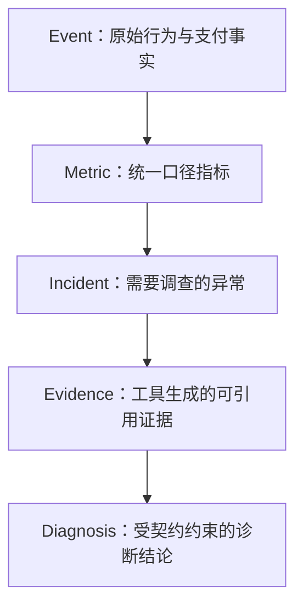
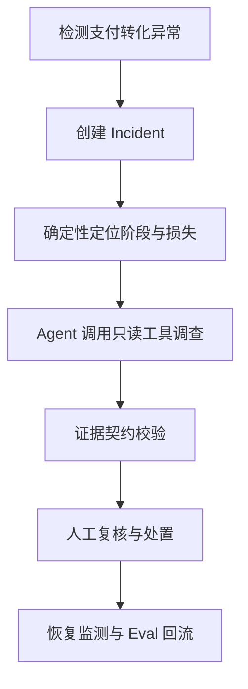
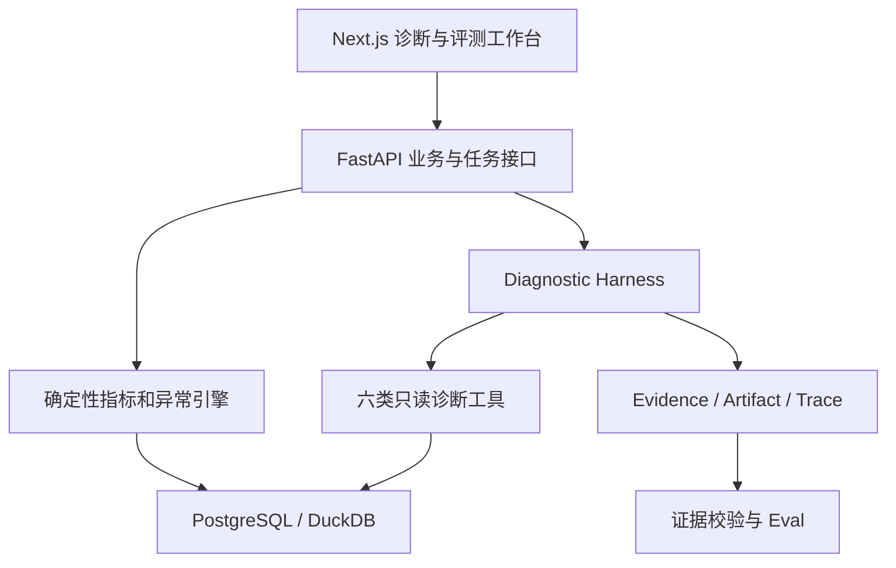
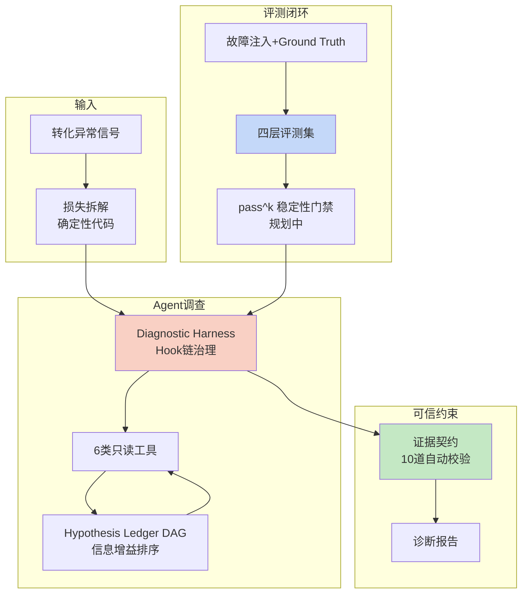

# PayTrace——证据驱动的支付转化异常归因与诊断 Agent

## 0. 文档说明

本文是 PayTrace 的企业产品与技术说明，用于统一产品范围、业务口径、系统设计、交付体验和质量目标。

项目采用可公开复现的产品形态，通过模拟数据、故障注入、诊断工作台和评测实验室展示完整闭环。

项目中的演示订单、支付事件、渠道异常和业务指标均为模拟数据。系统通过可配置故障注入生成带 Ground Truth 的黄金场景，用于稳定演示、自动评测和版本回归；不接入真实支付渠道，不使用银行卡号、支付凭据或真实用户隐私数据。

一句话定义：

> **PayTrace 面向支付产品、支付运营和技术支持团队，统一分析订单行为、支付事件、渠道状态与配置变更，通过确定性损失拆解和证据约束 Agent，诊断从订单确认到最终支付完成之间的多根因转化异常。**

项目最核心的技术主张是：

> **Agent 不负责自由猜测根因，而是在证据契约约束下组织调查、验证假设并暴露未知。**

---

## 设计哲学与核心范式

PayTrace 的设计不是从"选什么模型、用什么框架"开始，而是从三个第一性原理推导出来的。

### 范式一：确定性系统计算事实，模型负责组织调查

支付诊断的核心矛盾是：**损失数值必须精确可复算，但根因假设需要在不确定信息中逐步收敛。**

这决定了 PayTrace 的分工原则：

| 层次 | 承担者 | 职责 |
|---|---|---|
| 指标计算、异常检测、损失拆解、维度聚合、数据校验、证据绑定 | 确定性代码 | 计算出不可争议的事实 |
| 理解异常信号、提出根因假设、选择下钻工具、组织证据链、生成可读报告 | 模型（Agent） | 在受限能力包内进行调查和解释 |
| 校验每条 Claim 是否绑定真实 Evidence、损失是否重复计算、Ground Truth 是否泄漏 | 证据契约（代码） | 阻断无依据归因 |

这一分工遵循一个根本原则：

> **能用代码确定保证的事情，不交给模型自行判断。Prompt 适合表达意图，不适合充当安全边界。**

### 范式二：Agent 调查受 Hook 链治理，而非自由探索

PayTrace 的 Diagnostic Harness 本质上是一套 **Before Tool / After Tool Hook 链**：

```text
Before Tool：
  校验参数 Schema、Incident 范围、Capability Bundle、调用预算、数据权限
  → 通过则执行，失败则阻断

After Tool：
  登记 Evidence ID + Query Fingerprint + Result Hash
  → 大结果外置为 Artifact
  → 更新 Hypothesis Ledger 状态
  → 检查是否需要 Early-Exit
```

这套 Hook 链解决了三个 Agent 固有问题：

| 问题 | 根因 | Hook 解法 |
|---|---|---|
| **越权调用**：Agent 调用未授权工具或超出 Incident 范围 | 模型不理解操作的真实代价 | Before Tool 校验参数/范围/权限，失败直接阻断 |
| **上下文膨胀**：完整订单明细和事件时间线挤爆 Token 窗口 | Token 物理容量限制 | After Tool 将大结果外置为 Artifact，上下文只保留摘要+引用 |
| **过程失忆**：Agent 在多步调查中遗忘已验证假设和已排除解释 | 模型倾向于最短路径，不主动记录中间状态 | After Tool 更新 Hypothesis Ledger，下一步自动注入当前调查状态 |

这体现了 Agent 治理的核心原则：

> **读侧降级（Offload 失败时透传原文），写侧阻断（参数非法/权限不足时拒绝执行）。失败语义必须与操作代价匹配。**

### 范式三：证据契约——每条结论必须绑定可验证的系统事实

Agent 生成自然语言解释很容易，但"看起来合理"不等于"有证据支撑"。PayTrace 的证据契约将 Agent 的诊断结论约束为三层可验证结构：

1. **Claim**（诊断主张）：描述根因、影响范围、损失估算，必须绑定 `evidence_ids`
2. **Evidence**（证据）：由成功执行并通过数据校验的工具调用产生，绑定 `call_id` + `query_fingerprint` + `result_hash`
3. **自动校验**：Evidence 是否存在？是否属于当前 Incident？时间窗口和维度口径是否一致？多个 Claim 是否对同一购买意图重复计损？

结论支持状态分为三级：

```
SUPPORTED  — 多项一致证据支持根因、范围和损失口径
PARTIAL    — 存在相关证据，但仍有替代解释或数据缺口
UNKNOWN    — 当前证据不足，系统只能说明缺少什么和下一步如何验证
```

**UNKNOWN 不是失败输出**，而是防止 Agent 在证据不足时生成看似完整答案的必要能力。这与 Agent Room 的 DAG 任务账本一脉相承：讨论必须转化为可验证的任务状态，节点完成必须有执行证据，"没有 evidence 的 done 只能视为口头完成"。

### 范式四：评测闭环——隔离 Ground Truth，同时评测结果和过程

传统 ML 评测只关心最终答案是否正确。Agent 评测必须同时验证两组问题：

**Response Evaluation**（最终报告是否正确）：
- 阶段定位是否准确、根因识别是否完整、损失估算是否可信
- 是否明确替代解释和缺失数据
- UNKNOWN 是否正确触发而非被跳过

**Trajectory Evaluation**（调查过程是否可靠）：
- 工具选择是否匹配 Incident 范围
- 是否存在无效调用、循环或重复查询
- 工具失败后是否正确降级
- 是否在达到停止条件后及时结束

两条硬门禁：
- **Ground Truth 隔离**：评测器主动检查 Agent/Tool/Prompt 是否意外读取 Ground Truth。虚假高分比低分更危险。
- **pass^k 稳定性**：支付诊断关注连续可靠性，同一场景 k 次运行必须全部成功，不能用"至少一次成功"替代生产可靠性。

### 范式五：模拟数据的诚实边界

模拟数据能证明系统在已知场景下的诊断能力、证据校验的有效性、不同版本的相对表现和多根因/边界场景的稳定处理。

模拟数据**不能**证明在真实商户环境创造了业务收益、模拟分布等同于某家支付平台、离线评测提升必然转化为线上收益。

在项目文档和简历中显式声明这一边界，本身就是工程判断力的体现。

---

## 1. 项目来源与演进

### 1.1 来自真实经历的问题意识

PayTrace 主要源于两段实践经历。

在 Ovanta 国内版与国际版的开发中，项目需要统一处理账号、订单、区域定价、多类支付渠道、Webhook 回调和内容权益发放。支付成功并不等于业务链路已经完成：渠道返回成功后，平台还需要正确接收回调、推进订单状态并发放对应权益。任何环节异常，都可能表现为用户支付失败、订单长期停留或已付款却无法使用服务。

在深圳市慧泽致远人工智能科技有限公司接触出海电商业务时，也观察到一类共同需求：商户通常能看到支付成功率下降或收到零散错误码，却难以快速判断损失发生在哪个环节、哪些地区和支付方式受影响，以及问题来自用户决策、渠道技术故障、配置变化还是统计数据本身。

这两类经历形成了 PayTrace 的原始问题：

> **支付监控能发现“结果变差”，日志系统能展示“发生了什么”，但业务团队仍缺少一条从转化损失到可验证根因的统一诊断链路。**

### 1.2 Oceanpayment 赛题带来的外部对照

2026 年 7 月，项目曾结合 AI 先锋未来人才大赛中钱海网络 Oceanpayment 的赛题，扩展为 PayPilot——跨境商户成功运营助手，覆盖支付方式推荐、商户上线、异常诊断、工单协作、知识沉淀和运营看板。

这一方案没有入围，但复盘具有明确价值。入围方案体现了三种方向：

| 方向 | PayTrace 吸收的部分 | PayTrace 不继续扩张的部分 |
|---|---|---|
| 数字员工体系 | 诊断结论需要能够支持后续人工处置 | 不建设覆盖客服、销售、财务和技术的完整平台 |
| A2A 多智能体 | 明确能力与职责边界 | 不为展示架构而虚构多个岗位 Agent |
| 证据契约 | 把证据约束做成系统级核心机制 | 不只停留在概念和方案描述 |

PayPilot 证明了产品可以向企业支付运营平台扩展，也暴露了平台范围过宽、真实接入和组织协作成本较高的问题。因此，PayTrace 最终回到一条更窄但可以做深的主线：

```text
支付转化异常
→ 确定性损失拆解
→ 证据约束调查
→ 多根因诊断
→ 人工复核
→ Ground Truth 评测回归
```

### 1.3 当前项目定位

PayTrace 不是竞赛方案的缩小演示，也不是对某家支付公司的内部系统复刻。它是一个独立开源项目，通过模拟支付链路和可复现评测，验证一套可以迁移到电商平台、支付服务商和订阅产品的诊断方法。

项目持续维护的重点不是不断增加业务模块，而是提升三项能力：

1. 支付损失拆解是否准确且不重复计算；
2. Agent 的每条结论能否被证据验证；
3. 新版本是否能通过固定评测集证明改进而没有引入回归。

---

## 2. 业务背景

### 2.1 “支付失败”不是一个单一问题

从订单确认到最终完成支付，用户需要经过收银台展示、支付方式选择、支付发起、身份认证、渠道处理、结果回调和订单状态更新等多个环节。

最终支付订单下降，可能同时由多种原因造成：

- 优惠未正确展示，用户发现其他方式更便宜后取消订单；
- 3DS、风控或授权认证失败；
- 支付渠道超时、不可用或路由配置错误；
- 币种、地区或支付方式配置不匹配；
- Webhook 丢失、签名校验失败或事件乱序；
- 用户余额不足、卡片过期或主动放弃；
- 埋点缺失、数据延迟或统计窗口错误；
- 同一购买意图取消后重新下单，被错误统计为一次流失加一次新增。

这些原因可能发生在同一个 Incident 中。只看单个错误码、单张趋势图或某条日志，无法完整解释业务损失。

### 2.2 现有工具之间存在断层

| 工具 | 能回答的问题 | 难以回答的问题 |
|---|---|---|
| BI 与支付看板 | 哪个指标下降、哪些维度异常 | 为什么下降、证据是否足够 |
| 日志与 APM | 某次请求发生了什么技术错误 | 影响了多少购买意图和最终成交 |
| 规则告警 | 是否超过预设阈值 | 多个根因如何联合解释异常 |
| 客服与工单 | 用户或商户反馈了什么 | 反馈与支付事件、配置变化如何关联 |
| 通用 LLM 助手 | 能总结已有文本和提出排查建议 | 是否引用了正确数据、是否把相关性写成因果 |

真正缺失的是连接业务指标与技术证据的诊断层：

```text
支付指标异常
↕
订单与购买意图损失
↕
行为、支付事件、渠道与配置证据
↕
可验证的根因与处置建议
```

### 2.3 项目要解决的根本问题

PayTrace 解决的不是“让 AI 解释错误码”，而是：

> **当支付转化异常时，如何在统一口径下定位损失阶段、量化影响范围、验证多个根因，并明确区分已证实结论、部分支持假设和暂时未知部分。**

---

## 3. 产品定位

### 3.1 目标用户

| 用户 | 核心诉求 |
|---|---|
| 支付产品人员 | 判断转化损失发生在哪一环，产品或优惠配置是否产生摩擦 |
| 支付运营人员 | 量化受影响订单、地区、币种、支付方式和渠道 |
| 技术支持与研发 | 根据支付事件、回调和配置证据缩小排查范围 |
| 支付服务商商户成功团队 | 将商户问题组织为可复核的影响与证据包 |
| AI 应用开发者 | 研究证据约束 Agent、工具调用和自动评测方法 |

适用场景包括电商、订阅服务、内容平台、本地生活、票务、酒店航旅，以及同时接入多类支付方式或支付渠道的互联网产品。

### 3.2 产品负责回答的问题

当最终支付订单数或支付完成率异常时，PayTrace 需要回答：

1. 损失主要发生在哪个支付阶段？
2. 相比正常基线少完成了多少订单或购买意图？
3. 哪些地区、币种、支付方式、渠道、版本或配置贡献最大？
4. 技术失败和支付决策摩擦分别获得了哪些证据支持？
5. 多个根因的影响是否重复计算？
6. 哪些损失仍无法解释，还需要补充什么数据？
7. 下一步应该排查、修复、监测还是设计实验验证？

### 3.3 产品明确不是什么

PayTrace 不是：

- 直接执行支付或保存银行卡信息的支付系统；
- 自动修改路由、风控、优惠和渠道配置的自治 Agent；
- 面向消费者的支付客服机器人；
- 覆盖接入、推荐、工单、结算和争议处理的商户成功操作系统；
- 通过多个角色 Agent 模拟企业组织的多智能体平台；
- 只用自然语言总结日志的通用 Copilot；
- 使用模拟数据却宣称获得真实商户业务收益的展示项目。

### 3.4 核心差异化

PayTrace 的差异不在于接入更多模型，而在于把确定性分析、Agent 调查和评测三者分开：

| 层次 | 负责内容 |
|---|---|
| 确定性分析 | 指标计算、异常检测、损失拆解、维度聚合和数据校验 |
| Agent 调查 | 选择工具、提出假设、继续下钻、组织证据和解释结果 |
| 证据契约 | 校验结论是否被证据支持，阻断越界归因 |
| 人工复核 | 确认最终根因、处置动作和恢复结果 |
| Eval | 使用隔离的 Ground Truth 判断系统是否真正改进 |

---

## 4. 支付漏斗与核心业务口径

### 4.1 九阶段支付链路

```text
订单确认
→ 进入收银台
→ 支付选项与优惠曝光
→ 选择支付方式
→ 发起支付
→ 身份认证或授权
→ 支付渠道处理
→ 支付结果回写
→ 订单支付完成
```

取消和重下单不是孤立订单状态，而是支付方式选择后的分支：

```text
用户取消订单
→ 是否在限定时间内重新下单
→ 是否更换支付方式或优惠
→ 是否最终完成支付
```

### 4.2 Purchase Intent

`purchase_intent_id` 表示一次真实购买意图。同一用户在限定时间内对基本相同的商品组合取消并重新下单，可以归并到同一购买意图。

这一模型用于区分：

- 订单取消后彻底流失；
- 取消后更换支付方式并完成购买；
- 同一次购买被多个订单记录重复统计；
- 支付重试和真正的新购买行为。

如果只按 `order_id` 计算，取消重下单会同时放大确认订单数和流失订单数，错误评估支付方式或优惠规则的影响。

### 4.3 核心指标

| 指标 | 口径 |
|---|---|
| 订单支付完成率 | 完成支付订单数 / 确认订单数 |
| 购买意图完成率 | 完成支付的购买意图数 / 有效购买意图数 |
| 支付发起率 | 发起支付订单数 / 到达收银台订单数 |
| 支付受理成功率 | 支付成功尝试数 / 支付发起尝试数 |
| 取消后重下单率 | 重新下单数 / 支付阶段取消订单数 |
| 重下单恢复率 | 重下单后完成支付数 / 重下单数 |

### 4.4 Benefit Gap

```text
Benefit Gap
= 实际选择支付方式的最终应付金额
− 当前用户可用支付方式中的最低应付金额
```

Benefit Gap 只能证明用户实际选择与最优可用优惠之间存在差额。只有再结合支付选项曝光、取消行为、重下单、支付方式切换和最终恢复等证据，才能将其作为支付决策摩擦的根因候选。

它不能单独证明用户“因为优惠少而放弃支付”。

---

## 5. 核心领域模型

PayTrace 使用五层诊断架构：



### 5.1 Event

Event 保存系统实际观察到的事实，包括：

- 订单确认、取消、重下单和支付完成；
- 收银台进入与退出；
- 支付选项和优惠曝光；
- 支付发起、认证、授权和渠道结果；
- Webhook 接收、校验和订单状态更新；
- 路由、风控、优惠、接口和版本配置变更。

### 5.2 Metric

Metric 将原始事件转换为统一口径的漏斗、成功率、购买意图恢复率和维度聚合结果。

所有数值计算由确定性代码完成。模型不直接在自然语言上下文中自行统计订单，也不负责决定指标是否触发异常。

### 5.3 Incident

Incident 是一次有明确范围的诊断任务，保存：

- 观察时间窗口和对比基线；
- 异常指标与严重程度；
- 受影响商户、地区、币种或渠道范围；
- 调查状态、诊断版本和负责人；
- 人工最终结论、处置动作与恢复结果。

状态流转为：

```text
DETECTED
→ INVESTIGATING
→ ACTION_REQUIRED
→ MONITORING
→ RESOLVED
```

无法完成调查时可进入 `PARTIAL` 或 `FAILED`，不得用表面成功状态隐藏工具错误和数据不足。

### 5.4 Evidence

Evidence 是工具对某个 Incident、时间窗口和维度范围生成的结构化事实。它包含唯一 `evidence_id`、查询参数、数据版本、计算口径、结果摘要和原始 Artifact 引用。

Evidence 不是模型自行编写的一段理由。只有成功执行、通过数据校验并被系统登记的工具结果，才能成为正式证据。

### 5.5 Diagnosis

Diagnosis 由一个或多个 Claim 组成。每个 Claim 描述根因候选、影响范围、损失估算、证据、替代解释、缺失数据和支持状态。

同一次 Incident 可以包含多个根因，也必须允许保留 `UNKNOWN`，不要求强行解释全部损失。

---

## 6. 损失账本

### 6.1 总观察损失

系统先用历史基线或对照窗口计算总观察损失：

```text
总观察损失
= 基线预期完成的有效购买意图
− 实际完成的有效购买意图
```

订单数和金额可以作为辅助口径，但首要口径是最终完成的有效购买意图，避免取消重下单重复计数。

### 6.2 损失分类

```text
总观察损失
= 已获充分证据支持的技术失败
+ 已获证据支持的支付决策摩擦
+ 数据质量影响
+ 暂无法解释部分
```

这不是让 Agent 随意给每类损失分配比例。每个已归因损失必须来自确定性工具计算，并采用统一损失单位、观察窗口和去重规则。

### 6.3 防止重复归因

同一购买意图可能先经历认证失败，再在回调阶段留下异常记录。系统需要：

- 以购买意图或明确订单集合记录归因对象；
- 保存每个 Claim 覆盖的对象集合或可验证集合摘要；
- 检查不同 Claim 的影响是否交叉；
- 对跨阶段传播的同一失败只计一次最终损失；
- 保证归因损失不超过总观察损失；
- 将无法可靠拆分的重叠部分保留为部分支持或未知。

漏斗各阶段的自然流失不能直接相加后当作根因损失。系统必须先统一到最终购买意图损失口径，再进行归因。

---

## 7. 完整诊断流程



### 7.1 异常发现

确定性引擎计算支付漏斗和核心指标，并根据历史基线、对比窗口或模拟场景配置检测异常。

触发异常时，系统固定 Incident 的时间范围、指标口径、对比基线和初始影响范围，避免后续工具使用不同窗口得出不可比较的结论。

### 7.2 初始损失拆解

系统先回答“损失发生在哪里”：

- 哪个漏斗阶段变化最大；
- 哪些地区、币种、支付方式、渠道或版本贡献最大；
- 订单损失与购买意图损失是否一致；
- 是否存在取消后重下单和成交恢复；
- 数据完整性是否足以继续诊断。

### 7.3 Agent 调查

Agent 根据初始证据提出根因假设，选择只读工具继续下钻。每次工具调用都受到 Incident 范围、参数 Schema、调用预算、超时和数据权限约束。

大规模结果保存为 Artifact；模型上下文只包含摘要、关键统计和引用，防止完整订单明细挤占上下文。

### 7.4 证据契约校验

Agent 生成结构化 Claim 后，系统校验 Evidence 是否真实存在、是否属于当前 Incident、时间和维度口径是否一致，以及损失是否重复计算。

不通过校验的 Claim 不能进入正式报告，只能被降级为部分支持、未知或要求补充数据。

### 7.5 人工复核与处置（**未实现**）

> **诚实标注**：截至目前，人工复核闭环**完全没有实现**——没有 accept/reject/modify 根因的能力，
> 没有处置动作记录表，没有恢复监测。系统只发布诊断报告，报告之后的事情目前不在代码里。
> 这是「完整诊断闭环」口号与实际实现之间最大的缺口，演示与被追问时都必须直说。

设计意图（尚未落地）：用户可以接受、拒绝或修改根因，补充证据，并记录排查、修复、实验和监测动作。
首期系统只提供建议，不自动修改支付渠道、路由、风控或优惠配置。

### 7.6 恢复监测与回流

处置后系统继续观察同口径指标，判断异常是否恢复。人工最终根因、有效动作和恢复结果进入评测与案例数据，但首期不宣称模型会自动训练或自动学习。

---

## 8. Diagnostic Harness——Hook 链治理下的受控调查

### 8.1 Harness 的职责：为什么 Agent 不能自由探索

Harness 是 PayTrace 的核心 Agent 运行层。它不只是一段编排代码，而是一套 **Before Tool / After Tool Hook 链**，解决 Agent 的三类固有问题：

| 问题 | 根因 | Hook 解法 |
|---|---|---|
| **越权调用**：Agent 调用未授权工具或超出 Incident 范围 | 模型不理解操作的真实代价，Prompt 中的"不要越权"是软约束 | Before Tool 校验参数 Schema/Incident 范围/Capability Bundle/数据权限，失败直接阻断 |
| **上下文膨胀**：完整订单明细和事件时间线挤爆 Token 窗口 | Token 物理容量限制，模型可能截断或略写关键数据 | After Tool 将大结果外置为 Artifact，上下文只保留口径摘要+关键统计+evidence_id |
| **过程失忆**：Agent 在多步调查中遗忘已验证假设和已排除解释 | 模型倾向最短路径，不主动记录和复用中间状态 | After Tool 更新 Hypothesis Ledger，下一步自动注入当前调查状态和已排除假设 |

这套 Hook 链的具体职责：

- Before Tool：校验参数、Incident 范围、Capability Bundle、调用预算、数据权限；通过则执行，失败则阻断
- After Tool：登记 Evidence ID + Query Fingerprint + Result Hash；大结果外置为 Artifact；更新 Hypothesis Ledger；检查是否触发 Early-Exit
- 控制最大步数、超时、重试、Token 和成本预算
- 对结构化报告进行 Schema 和证据契约校验
- 保存完整 Trace、模型版本、Prompt 版本、工具版本和数据版本

这套机制借鉴了 Agent 治理的核心原则：**Prompt 定意图，Hook 定边界。能由代码确定性保证的事情，不交给模型自行决定。** 失败语义与操作代价匹配——读侧降级（Artifact 落盘失败时透传原文），写侧阻断（参数非法或权限不足时拒绝执行）。

### 8.2 六类只读工具

实现为 6 个工具；维度下钻不是独立工具，而是 `breakdown_conversion_loss` 的 `dimension` 参数（白名单校验）。

| 工具 | 职责 |
|---|---|
| `get_payment_funnel` | 查询各阶段订单、购买意图和转化率；无异常时产出「各阶段均未退化」的负向证据 |
| `breakdown_conversion_loss` | 按指定维度（支付方式/渠道/地区/币种/版本）拆解转化损失 |
| `analyze_benefit_gap` | 分析支付选项曝光、优惠与最终应付金额差异 |
| `trace_cancel_and_reorder` | 追踪取消、重下单、方式切换和最终恢复 |
| `inspect_payment_events` | 检查认证、渠道、回调和状态事件 |
| `get_config_changes` | 查询活动、风控、路由、接口和版本变更 |

工具的参数以显式 JSON Schema 暴露给模型；`dataset_ref` **不在 Schema 内**，由 harness 注入并从模型提供的参数中剔除，模型无法把工具指向其他 incident 的数据。

工具负责查询与计算，模型负责选择调查路径和组织解释。模型不能绕过工具直接声称某类订单损失了多少。

### 8.3 调查状态

Agent State 至少保存：

```text
incident_scope
observed_loss
localized_stages
hypotheses
validated_evidence
rejected_hypotheses
alternative_explanations
missing_data
remaining_budget
```

这使多步调查可以暂停、恢复和回放，也避免模型在后续步骤遗忘已经排除的解释。

### 8.4 Artifact 与上下文控制

订单集合、维度明细和事件时间线可能很大。PayTrace 将完整结果保存为 Artifact，并在模型上下文中只保留：

- 口径和查询参数；
- 聚合摘要与关键样例；
- 数据质量状态；
- `evidence_id` 与 Artifact 引用。

这样可以同时保证上下文精炼和事后可审计性。

### 8.5 Hypothesis Ledger——将调查假设 DAG 化

诊断过程不能只保存最终报告。借鉴 Agent Room 的 DAG 任务账本思想——"群聊负责生成判断，DAG 负责管理依赖和状态"——PayTrace 将每个根因假设建模为有向无环图中的节点：

```text
Hypothesis DAG Node
├── hypothesis_id
├── root_cause_type
├── proposed_scope
├── supporting_evidence      ← 入边：哪些证据支持该假设
├── conflicting_evidence     ← 阻断边：哪些证据否定该假设
├── alternative_explanations ← 竞争节点：还有哪些假设解释同一损失
├── required_next_tool       ← 出边：需要哪个工具提供下一份证据
├── status                   ← 节点状态
└── estimated_loss_range     ← 该根因覆盖的损失范围
```

节点状态流转：

```text
PROPOSED → INVESTIGATING → SUPPORTED / PARTIAL / REJECTED / NEEDS_DATA
```

关键约束：
- 每次工具调用必须服务于某个待验证假设、替代解释或数据完整性问题
- 已被证据否定的假设进入 `REJECTED`，后续步骤不得在没有新证据的情况下重复调查
- 依赖未满足的假设（如前置工具尚未执行）不能进入 INVESTIGATING
- 多假设交叉覆盖同一损失时，必须去重或标记为 PARTIAL

Hypothesis Ledger 使系统能够回答：
- 当前正在验证什么、为什么调用这个工具
- 哪些解释已经被排除、哪些损失仍未被解释
- 下一项证据能否真正改变诊断结论

### 8.6 Capability Routing 与 Early-Exit

Harness 根据 Incident 阶段、数据质量和已有证据生成受限 Capability Bundle，而不是把全部工具同时交给模型。

典型路由包括：

| 初始信号 | 优先能力 | 可提前结束条件 |
|---|---|---|
| 数据完整性异常 | 漏斗完整性、事件延迟和重复检查 | 已证明核心指标不可信，转为数据修复 |
| 认证失败集中 | 认证事件、版本和地区维度 | 根因、范围和损失均有一致证据 |
| 渠道超时 | 渠道、地区、币种和时间窗口下钻 | 单一渠道贡献覆盖主要损失且无冲突证据 |
| Webhook 异常 | 回调接收、签名、乱序和状态回写 | 回调失败集合与未完成订单集合完成绑定 |
| 支付决策摩擦 | 优惠曝光、Benefit Gap、取消重下单 | 行为链与成交恢复证据达到支持门槛 |

Early-Exit 不是为了让 Agent 尽快输出，而是避免在已经足以支持结论、已经证明数据不可用或剩余预算无法改变结论时继续消耗工具和模型调用。

任务预算按阶段管理：

- 最大 LLM 调用次数；
- 最大工具调用次数；
- 单工具超时和重试；
- 单假设调查预算；
- 必须保留的最终报告预算；
- 证据不足时的停止和人工接管条件。

---

## 9. 证据契约——用证据门禁替代语言门禁

### 9.0 第一性原理：为什么 Prompt 不能替代证据校验

Agent 生成"根据数据显示，认证失败是主要原因"这样的自然语言结论很容易。但以下情况无法仅靠 Prompt 区分：

- **结果正确但过程危险**：Agent 跳过了必要的订单状态校验，却恰好答对了根因（假阳性）
- **引用不存在的证据**：Agent 声称"数据显示……"，但对应的工具调用实际失败了
- **损失重复计算**：同一批购买意图被两个 Claim 重复归因

因此，借鉴 Agent Room 的核心原则——**"不能因为 Agent 说'已完成'就认为完成，每个关键节点应配置证据要求"**——PayTrace 将证据契约实现为代码层的硬校验，而非 Prompt 层的软约束。

### 9.1 Claim 结构

每条诊断主张必须包含：

```text
Claim
├── claim_id
├── root_cause_type
├── affected_scope
├── observed_window_and_baseline
├── loss_estimate_and_unit
├── evidence_ids
├── alternative_explanations
├── missing_data
└── SUPPORTED / PARTIAL / UNKNOWN
```

### 9.2 Evidence Provenance

Evidence 不只保存一段结果摘要，还必须绑定完整来源：

```text
evidence_id
incident_id
tool_call_id
normalized_parameters
query_fingerprint
result_hash
data_snapshot_version
generator_and_tool_version
observed_window_and_baseline
affected_object_set_or_digest
row_count / complete / truncated
quality_status
artifact_id
created_at
```

这样能够保证：

- 报告中的数值可以定位到具体工具调用；
- 相同证据可以复算而不是只读模型描述；
- 数据更新后可以判断旧证据是否失效；
- 大规模购买意图集合可以用稳定摘要检查交叉和重复；
- 截断、采样和部分失败不会被误认为完整结果。

正式 Claim 的 `evidence_ids` 必须全部属于当前 Incident，并且其查询范围、数据快照和损失单位相互兼容。

### 9.3 自动校验规则

实现为 `ReportValidator` 的 R1–R15 规则集。**下面是实际实现的规则，与早先的「十道门禁」列表不同**——以代码为准。

**结构与引用完整性**

| 规则 | 内容 |
|---|---|
| R1 | Incident / Run ID 与上下文一致 |
| R2 | 引用的 evidence code 都在本轮证据中 |
| R4 | 根因标签来自 Ontology 枚举，模型不能自造 |
| R12 | validator 版本匹配（不匹配即阻断发布） |
| R13 | 单条主张内无重复 evidence code |

**损失守恒**

| 规则 | 内容 |
|---|---|
| R5 | 损失数值非负 |
| R6 | explained + unexplained ≈ total（允许舍入） |
| R7 | 单条根因损失不超过总损失 |
| R15 | **UNKNOWN 状态的主张不得计入 explained 损失** |

**证据契约（核心）**

| 规则 | 内容 |
|---|---|
| R3 | 主张必须至少有一个有效 evidence code |
| R8 | 证据类型必须能支撑该标签（负向证据不能支撑正向故障标签） |
| R14 | 主张的支持状态必须由证据决定；不满足即降级为 UNKNOWN |
| R10 | 没有正向证据时不得声称 HIGH confidence；`NORMAL_PAYMENT_FAILURE` 不得为 HIGH |
| R9 | NEEDS_DATA 必须列出具体缺失数据 |
| R11 | Benefit Gap 不得作为唯一致因证据 |

`R14` 由 orchestrator **实际执行**而非仅仅告警：不通过的主张被重新发布为 `UNKNOWN`，
其损失从 `explained` 移入 `unexplained`，降级动作以 `R14_UNSUPPORTED_STATUS` 记入 trace。
`UNKNOWN` 是合法发布结果，不是失败输出（§ 9.4）。

`classify_support` 是证据契约的唯一实现，validator 用它检测、orchestrator 用它降级，
因此 R8 与 R14 不可能对同一组证据给出矛盾判断。

**尚未实现**：Ground Truth 泄漏的运行时检测、以及「结果正确但过程危险」假阳性的自动识别。
当前 GT 隔离是模块约定（只有 `app/evaluation/` 与 `app/harness/scenarios/ground_truth.py` 导入
`GroundTruthLoader`），没有任何运行时守卫，加一行 import 就会静默失效。

### 9.4 三种支持状态

| 状态 | 含义 |
|---|---|
| `SUPPORTED` | 多项一致证据支持根因、范围和损失口径 |
| `PARTIAL` | 存在相关证据，但仍有替代解释、数据缺口或影响无法完全拆分 |
| `UNKNOWN` | 当前证据不足，系统只能说明缺少什么和下一步如何验证 |

“未知”不是失败输出，而是防止 Agent 在证据不足时生成看似完整答案的必要能力。

### 9.5 证据与因果边界

配置变更、Benefit Gap、错误率上升和时间相关性都可以成为根因证据，但不能单独等同于因果证明。

正式报告需要同时说明：

- 观察到的变化；
- 支持该解释的证据；
- 仍可能成立的替代解释；
- 能进一步验证的日志、数据或实验；
- 当前结论适用的时间和范围。

---

## 10. 模拟数据、故障注入与黄金场景

### 10.1 为什么使用模拟数据

支付数据通常包含商业机密、账户信息和合规敏感字段，公开演示与评测环境无法也不应复制真实生产数据。单纯手写几张静态表又无法支持多根因、边界条件和自动评测。

因此，PayTrace 将模拟数据视为项目基础设施，而不是临时演示数据。

### 10.2 场景生成

数据生成器模拟：

- 用户、购物车、订单和购买意图；
- 支付方式、渠道、币种和地区；
- 优惠资格、展示位置和最终应付金额；
- 支付发起、认证、授权、渠道结果和回调；
- 取消、重下单、支付方式切换与最终恢复；
- 配置版本和变更记录；
- 数据缺失、延迟、重复和乱序。

每个场景由固定随机种子、数据生成器版本和故障配置共同确定，保证同一 Incident 可以复现和回放。

### 10.3 故障注入

黄金场景覆盖：

- 优惠展示或支付方式选择摩擦；
- 3DS、风控或授权认证失败；
- 支付渠道超时或不可用；
- Webhook 丢失、签名失败和事件乱序；
- 地区、币种、路由或接口配置错误；
- 数据不足和统计口径异常；
- 单根因、多根因、无异常和干扰变更。

默认黄金演示采用多根因 Incident，使系统同时面对支付决策摩擦、认证失败和 Webhook 异常，并要求保留无法解释的剩余损失。

### 10.4 Ground Truth 隔离

Ground Truth 保存真实注入故障、影响对象和预期损失，只提供给评测器使用。

Agent 运行时只能看到正常业务中可能观察到的订单、事件、配置和指标，不能读取：

- 注入了什么故障；
- 哪些订单被故障直接影响；
- 预设的正确根因标签；
- 预期评测答案。

系统需要记录并检查数据访问路径，防止 Ground Truth 泄漏导致虚假的高分。

### 10.5 模拟数据的诚实边界

模拟数据是 PayTrace 的基础设施，不是临时演示数据。但其证明力有明确边界。

模拟数据可以证明：
- 系统能否在已知场景下定位阶段和识别根因
- 证据校验能否阻断无依据结论
- 不同 Agent 版本在同一评测集上的相对表现
- 多根因、未知和边界场景是否稳定处理
- 评测基础设施（Ground Truth 隔离、轨迹评测）是否可靠（**pass^k 稳定性尚未实现**）

模拟数据不能证明：
- 已经在真实商户生产环境创造业务收益
- 模拟分布完全等同于某家支付平台
- 真实渠道的字段、延迟和异常都已覆盖
- 离线评测提升必然转化为线上收益

**在项目文档和简历中显式声明这一边界，本身就是工程判断力的体现。** 这比宣称"模拟数据可以替代真实数据"更符合面试官和企业对 AI 应用工程师的期望——知道系统能做什么，更知道系统不能做什么。

---

## 11. Eval 与优化闭环

### 11.1 评测版本

| 版本 | 状态 | 作用 |
|---|---|---|
| B0：固定流水线 + 规则适配器 | **已实现** | 确定性基线 |
| B1：固定流水线 + One-shot LLM | **已实现**（模型不可达时回退） | 一次性提供完整上下文的上限与幻觉问题 |
| B2：Diagnostic Harness 受治理调查 | **已实现**（模型不可达时回退到确定性策略） | 多步调查相对固定流水线的增益 |
| B3：案例记忆 / Case Memory | 规划中 | 只有离线 A/B 证明有效后才考虑进入主链路 |

B0 与 B2 **共用同一套报告生成与校验步骤**，因此对比隔离出的变量恰好是「证据是怎么收集的」。
每次运行记录实际使用的策略，以及是否发生了回退——回退不等于模型调用成功。

### 11.2 数据集分层

| 数据集 | 用途 |
|---|---|
| Development Set | 日常开发和 Prompt 调试 |
| Regression Set | 每次变更后的持续回归 |
| Holdout Set | 不参与调试的模板和维度组合 |
| Adversarial Set | 冲突证据、无关变更、数据缺失和误导线索 |

评测必须防止针对固定样例人工调参后只在 Development Set 上获得高分。

### 11.3 核心指标

| 指标 | 说明 |
|---|---|
| Stage Localization Accuracy | 是否定位正确流失阶段 |
| Root Cause Multi-label F1 | 是否识别全部真实根因并控制误报 |
| Loss Attribution MAE | 各根因损失估算与 Ground Truth 的误差 |
| Evidence Precision / Recall | 证据是否正确且覆盖关键结论 |
| Unsupported Claim Rate | 无有效证据结论占全部结论的比例 |
| Unknown Calibration | 数据不足时是否正确保留未知 |
| Tool Success Rate | 工具调用成功率 |
| Tool Efficiency | 平均调用步数和无效调用比例 |
| P95 Latency | 单次诊断尾延迟 |
| Token Cost | 单次诊断模型成本 |

### 11.4 优化流程

```text
固定评测集与版本
→ 运行基线和候选版本
→ 按失败类型归因
→ 修改 Prompt、工具或 Harness
→ 重跑 Regression 与 Holdout
→ 比较准确性、可靠性、延迟和成本
→ 达到准入条件后进入主分支
```

优化对象可以是 Prompt、工具描述、工具参数、上下文结构、调查预算和证据校验规则，但每次变更都需要记录版本并保留可回放 Trace。

只出现分数提升还不够。如果 Unsupported Claim Rate、延迟或成本明显恶化，候选版本仍可能不应发布。

### 11.5 Response Evaluation 与 Trajectory Evaluation

最终报告正确不代表调查过程可靠——这是 Agent 评测区别于传统 ML 评测的核心。借鉴美团 VitaBench 的关键发现（"Pass@4 达 60%，但 Pass^4 趋近 0%——模型行为极不稳定"），PayTrace 同时评测两个维度：

**Response Evaluation**（最终报告是否正确）：
- 是否定位正确阶段和根因
- 损失、范围和支持状态是否准确
- 是否明确替代解释和缺失数据
- 报告是否便于支付产品、运营和技术人员采取行动

**Trajectory Evaluation**（调查过程是否可靠）：
- 是否选择了符合 Incident 范围的工具
- 是否遵守关键业务前置条件
- 是否出现无意义调用、循环或重复查询
- 工具失败后是否正确降级
- 是否使用 Evidence 形成 Claim
- 是否在达到停止条件后及时结束
- 是否存在"结果正确但过程危险"的假阳性（如跳过必要校验但恰好答对）

评测只约束真正的业务不变量，不机械要求唯一工具顺序。多条路径如果都能得到完整、可复算且不越权的证据，可以同时视为有效轨迹。

### 11.6 稳定性、评分器与发布门禁（部分未实现）

> 诚实标注：本节的 `pass@k` / `pass^k` 重复运行统计**未实现**，当前每个配置每个 seed 只跑一次；
> LLM-as-Judge 与人工评分器也未接入。已实现的是确定性评分器与发布硬门禁中的证据类检查。
> 以下是设计意图。

同一评测用例需要重复运行，分别记录：

- `pass@k`：k 次运行中**至少一次**成功，衡量能力上限，适合探索性测试
- `pass^k`：k 次运行**全部**成功，衡量生产可靠性

支付诊断更关注 `pass^k`。用户不会接受"多试几次总有一次能诊断正确"——能用偶尔成功替代稳定可靠。

评分器采用三层组合：

1. **确定性评分器**：阶段、损失、Evidence、权限、Schema 和 Ground Truth 隔离——适合全部样本，快且可重复
2. **Rubric 评分器（LLM-as-Judge）**：任务完成度、解释清晰度、替代解释和建议质量——适合语义判断，但需定期人工校准
3. **人工评分器**：校准 Judge、审查高风险失败和确认新的黄金案例——覆盖规则/Judge 冲突和低置信度样本

Judge 校准原则：**与人工一致率 ≥ 85% 后才进入日常自动化**，否则改为人工抽检。

以下问题属于发布硬门禁（P0 不达标不能发布）：
- Ground Truth 泄漏（虚假高分比低分更危险）
- 无证据根因进入正式报告
- 归因损失超过总观察损失
- 多个 Claim 对相同购买意图重复计损
- 数据不足时仍输出确定性结论
- 读取未授权数据或执行写操作
- 报告无法绑定真实 Evidence
- 已毕业回归能力发生退化（P0 不通过平均分豁免）

---

## 12. 诊断报告与工作台

### 12.1 Incident 列表

展示异常时间、核心指标、购买意图损失、严重程度、状态和当前根因摘要。

### 12.2 诊断工作台

统一展示：

- 支付漏斗与损失拆解；
- 趋势和关键维度下钻；
- 优惠差额与支付选项曝光；
- 取消、重下单、支付方式切换和最终恢复；
- 认证、渠道、回调与状态事件；
- 配置变化和版本关联；
- Agent Tool Trace、Evidence 和 Artifact；
- 结构化诊断报告及证据支持状态。

### 12.3 Incident 复盘（**未实现**）

> 诚实标注：UI 上没有复盘页面。当前可查看的是「AI 初始诊断」本身（报告、证据、假设账本、工具 trace），
> 人工最终根因、处置动作、处理前后指标与恢复状态都没有记录载体。

设计意图（尚未落地）：记录 AI 初始诊断、人工最终根因、处置动作、处理前后指标、是否恢复和仍未解决的问题。

### 12.4 Eval Lab

展示不同版本在同一场景集上的准确性、证据质量、未知识别、工具调用、延迟和成本，并支持查看单个失败场景的完整 Trace。

### 12.5 报告结构

正式报告包含：

```text
Incident 摘要
→ 总观察损失与主要流失阶段
→ 受影响范围和贡献维度
→ 根因 Claim 与 Evidence
→ 已解释、部分支持和未知损失
→ 替代解释与缺失数据
→ 技术排查、产品优化或实验建议
→ 人工确认和恢复监测状态
```

---

## 13. 系统架构

### 13.1 技术栈

| 层次 | 技术与职责 |
|---|---|
| 前端工作台 | Next.js、React、TypeScript、Shadcn UI、ECharts |
| API 与业务服务 | Python、FastAPI、Pydantic、SQLAlchemy |
| 应用数据 | PostgreSQL 保存场景、Incident、Evidence、Trace、反馈与评测记录 |
| 分析执行 | DuckDB 执行事件明细的聚合、下钻和离线评测查询 |
| Agent 运行时 | 自研 Diagnostic Harness（与框架无关；模型侧通过 OpenAI 兼容 SDK 做 tool calling），无 Agent 编排框架依赖 |
| 实时进度 | 任务状态机与 SSE 推送长耗时诊断状态 |
| 工程验证 | pytest、Docker Compose、GitHub Actions |

### 13.2 逻辑架构



### 13.3 数据职责

PostgreSQL 负责业务状态和可审计记录，包括场景、Incident、Evidence、诊断报告、人工反馈和评测任务。

DuckDB 负责针对模拟事件和订单明细执行高效离线分析，使分析查询与在线事务状态解耦。项目规模较小时也可以由 PostgreSQL 完成基础聚合，但接口与领域模型保持一致。

### 13.4 长耗时任务

诊断任务通过状态机保存执行进度，SSE 向前端推送：

- 当前调查阶段；
- 已执行工具和结果状态；
- 当前证据数量；
- 剩余预算；
- 诊断完成、部分完成或失败原因。

前端断开不应导致任务状态丢失；重新连接后应从持久化状态继续展示。

---

## 14. 可靠性、安全与审计

### 14.1 默认只读

全部 Agent 工具默认只读。涉及支付路由、优惠、风控、渠道开关和订单状态的修改，只能作为建议交由人工执行。

### 14.2 失败必须显式暴露

- 工具参数非法时立即失败；
- 数据不完整时返回数据质量状态；
- 部分工具失败时标记 `PARTIAL`，不伪装成完整成功；
- 证据不足时返回 `UNKNOWN` 或 `NEEDS_DATA`；
- 结构化输出不符合 Schema 时阻断报告发布；
- 业务层不吞掉底层查询和校验异常。

### 14.3 重试与幂等

只读查询可以在明确错误类型下有限重试。创建 Incident、登记 Evidence、保存报告和提交人工反馈等写操作需要幂等键，避免任务重试生成重复记录。

模型调用超时不代表工具和任务没有执行。系统必须依据持久化任务状态、Trace ID 和业务记录判断恢复位置。

### 14.4 全链路版本与审计

每次诊断和评测记录：

- 场景与数据生成器版本；
- 随机种子与故障配置版本；
- 模型、Prompt 和上下文模板版本；
- 工具定义与代码版本；
- 每次工具参数、返回状态和 Evidence ID；
- 诊断报告、校验结果和人工修改；
- 延迟、Token 和失败原因。

这些信息用于复现、回放、对比和审计，不依赖模型上下文作为唯一记录。

### 14.5 数据安全

开源演示不保存真实卡号、CVV、支付令牌、账户凭据、真实姓名、联系方式或商户秘密。

即使后续接入企业试点，也应坚持最小字段、脱敏、租户隔离、角色权限、审计日志和只读优先，并让 Ground Truth、评测数据与诊断运行环境隔离。

### 14.6 部分失败与降级矩阵

支付诊断允许在部分信息缺失时继续推进，但结论强度不能超过证据强度：

| 失败 | 处理方式 |
|---|---|
| 单个维度查询超时 | 使用已有证据继续，标记未验证维度 |
| 事件明细被截断 | 允许趋势判断，不允许输出精确损失集合 |
| 数据延迟或完整性不足 | 停止根因归因，转为数据质量 Incident |
| 配置变更服务不可用 | 保留替代解释，不将时间相关性写成因果 |
| LLM 超时 | 根据持久化状态恢复，不重复已完成工具调用 |
| Evidence 校验失败 | 阻断对应 Claim，其他合法 Claim 可继续发布 |
| Ground Truth 隔离异常 | 整次评测作废并触发安全审计 |

系统不追求“永不失败”，而是保证失败可识别、影响可隔离、状态可恢复、结果可解释。

### 14.7 企业数据适配与凭据边界

企业接入时，PayTrace 通过只读适配器连接订单、行为事件、支付渠道状态、配置中心和监控数据。适配器负责将企业字段转换为标准 Event 与 Metric，不要求 Agent 理解每家公司的原始表结构。

连接凭据不进入模型、Prompt、工具参数或诊断沙箱。后端按照企业、数据源、能力和请求范围持有并使用凭据，Agent 只能发起受治理的业务查询。

企业数据接入需要满足：

- 最小字段和脱敏；
- 商户、区域和角色隔离；
- 查询范围与 Incident 绑定；
- 默认拒绝任意网络和任意 SQL；
- 每次数据访问可审计；
- 原始支付凭据和卡数据永不进入诊断链；
- 企业事实数据、案例库和评测 Ground Truth 物理或逻辑隔离。

---

## 15. 系统边界

### 15.1 当前负责

- 订单确认到最终支付完成的统一漏斗；
- Purchase Intent、取消重下单和成交恢复；
- 技术故障与支付决策摩擦的联合诊断；
- 确定性异常检测、损失量化和维度下钻；
- Incident、Evidence、Artifact、Trace 和诊断报告；
- 证据契约、未知保留和损失一致性校验；
- 人工复核、处置记录和恢复监测（**尚未实现**）；
- 模拟数据、故障注入、Ground Truth 和自动评测；
- 开源演示、场景回放和版本对比。

### 15.2 当前不负责

- 真实支付收单、资金处理和卡数据存储；
- 支付方式推荐和商户接入；
- 自动修改支付路由、风控和优惠；
- 退款、拒付、对账、清分和结算；
- 完整工单中心和跨部门组织流程；
- 多租户商业 SaaS 的全部权限与计费能力；
- 多 Agent 岗位模拟；
- 模型微调和重型实时流处理；
- 用模拟评测结果替代真实生产验证。

### 15.3 可扩展但不进入当前主线

后续可以扩展真实脱敏数据适配器、Case Memory、商户级多租户、工单联动和更多支付场景，但必须满足两个条件：

1. 不破坏当前证据契约和可评测闭环；
2. 有明确用户需求或评测证据，而不是为了扩大功能清单。

---

## 16. 与相似方案的区别

| 方案 | 核心目标 | PayTrace 的区别 |
|---|---|---|
| 支付监控看板 | 发现指标和趋势变化 | 继续追踪损失、证据和多根因解释 |
| 日志与 APM | 定位单次技术请求问题 | 将技术错误映射为购买意图和业务损失 |
| 规则诊断系统 | 按固定条件输出结论 | Agent 可进行多步下钻，但仍受证据契约约束 |
| 通用 LLM Copilot | 总结数据并给建议 | 数值由工具计算，结论必须绑定 Evidence |
| AI 客服 | 回答消费者或商户问题 | 面向内部支付诊断，不以对话首响为核心 |
| 多 Agent 平台 | 模拟岗位和跨角色协作 | 首期只保留一个受控诊断 Agent 和明确工具职责 |
| PayPilot 竞赛方案 | 覆盖商户接入、运营和协作全链路 | PayTrace 聚焦可完成、可评测的支付异常诊断闭环 |

---

## 17. 产品价值

### 17.1 对支付产品与运营

将“支付成功率下降”转化为阶段、范围、损失和证据，使产品优化和运营判断不只依赖经验。

### 17.2 对技术支持与研发

把订单、认证、渠道、回调和配置变化放入统一调查范围，减少只根据单个错误码来回猜测。

### 17.3 对 AI 应用工程

项目展示了 Agent 在企业诊断场景中的正确分工：确定性系统计算事实，模型组织调查，契约校验输出，人工确认高风险判断。

### 17.4 对产品治理与评测

模拟故障、隔离 Ground Truth 和固定评测集使外部开发者无需真实支付数据，也可以复现问题、比较方案和检查改动是否真正有效。

---

## 18. 产品规模与质量目标

### 18.1 规模（实测）

| 指标 | 设计基线 | 当前实测 |
|---|---:|---:|
| 支付漏斗 | 9 个阶段 | 9 个阶段 |
| 诊断领域模型 | Event、Metric、Incident、Evidence、Diagnosis 5 层 | 5 层 |
| 核心诊断工具 | 7 类 | **6 类**（维度下钻为参数而非独立工具） |
| 单场景购买意图 | 约 10 万 | **500**（已在 500/2000/5000 上验证精度随规模变化） |
| 黄金评测场景 | 80～120 个 | **7 个** |
| Agent 单次最大工具调用 | 8～12 次 | 预算 8 次；B2 实测均值 **2.17 次** |

规模是本项目最大的缺口，必须如实说明而不是模糊带过：

- 7 类场景（`normal`、`benefit_friction`、`channel_timeout`、`mixed_failure`、`data_gap` 与两个对抗场景）覆盖了单根因、多根因、无异常、数据质量与干扰变更，但**没有覆盖认证失败、回调异常、权限越界等类别**——这些根因标签存在，但没有对应的注入场景。
- 7 类场景每类在规则适配器里都有一条专属规则，因此 `root_cause_f1 = 1.0` **不构成质量证据**，只说明规则匹配了生成器的故障签名。
- 单场景 10 万购买意图、80～120 个黄金场景仍是规划目标。

### 18.2 诊断质量（3 seeds × 7 场景 × 500 intents 实测）

| 指标 | 目标 | B0 实测 | B2 实测 |
|---|---:|---:|---:|
| Stage Localization Accuracy | ≥ 90% | 100% | 100% |
| Root Cause Multi-label F1 | ≥ 0.85 | 1.0000 ⚠️ | 1.0000 ⚠️ |
| Loss Attribution MAPE | ≤ 10% | 6.53% | 6.53% |
| Evidence Binding Coverage | 100% | 100% | 100% |
| Unsupported Claim Rate | < 3% | 0.00% | 0.00% |
| Badcase 数 | — | 0 | 0 |
| 重复归因导致的损失超额 | 0 | 0 | 0 |

⚠️ **F1 = 1.0 不可作为成绩**：见 §18.1 的说明。损失归因精度随规模变化——500 intents 时 MAPE 约 10%，5000 时约 4%，引用时必须同时给出意图数。

**修正口径前的实测值**（同一命令、同一 seed）：`unsupported_claim_rate` 均值 **0.5000**（`normal` 与两个对抗场景为 1.0——系统在发布零证据支撑的根因）；`loss_attribution_mae` 恒为 **0**（该指标与报告自身比较，任何格式正确的报告都满足）；`stage_localization_exact_rate` **0.6667**。这三个数字是修正的起点，记录在此以备审计。

### 18.3 性能与稳定性（实测）

| 指标 | 目标 | 实测 |
|---|---:|---:|
| 常用确定性查询 P95 | ≤ 5 秒 | 单场景诊断均值 110 ms（B2，无模型配置）/ 164 ms（B0） |
| 完整诊断 P95 | ≤ 2 分钟 | 远低于上限 |
| 工具调用成功率 | ≥ 99% | 100%（预算 8 次，无工具失败） |
| Incident、Evidence 和 Trace 可追踪率 | 100% | 100% |
| 核心场景 `pass^3` | ≥ 90% | **未实现**，规划中 |
| 前端任务断线恢复（SSE） | 100% | 已实现，未做压力验证 |

**延迟的重要说明**：B2 在**未配置模型**时是 110 ms；若配置了模型但端点不可达，每个场景会先付一次失败的 HTTP 往返，同一轮评测变为 5.6 秒并记录 `fallback_count = 7`。这是配置成本，不是架构成本，但它才是配置错误时真实会看到的数字。

**`pass^k` 稳定性门禁未实现**。当前每个配置每个 seed 只跑一次，重复运行稳定性未测量。

### 18.4 产品运营指标

- Incident 从发现到首份诊断的时间；
- 人工接受、修改和拒绝 Claim 的比例；
- UNKNOWN 后成功补齐数据的比例；
- 已确认 Case Memory 的复用率；
- 无效工具调用和重复查询比例；
- 单次诊断 Token、延迟和费用；
- 处置后同口径指标恢复率；
- Bad Case 从发现到进入回归集的时间。

---

## 19. 最终项目定义

### 正式版

> **PayTrace 是面向支付产品、支付运营和技术支持团队的证据驱动支付转化异常归因与诊断 Agent。系统统一建模订单行为、支付事件、渠道状态和配置变化，通过 Purchase Intent 与确定性损失账本定位从订单确认到最终支付完成之间的业务损失，再由 Diagnostic Harness 编排只读工具完成多步调查，并以证据契约约束每条根因、影响范围和损失估算。项目使用隔离 Ground Truth 的故障注入数据构建可复现演示与自动评测闭环。**

### 精简版

> **PayTrace 用确定性代码计算支付损失，用 Agent 调查原因，用证据契约阻止无依据归因，并通过故障注入 Ground Truth 持续评测。**

### 核心产品主张

> **发现异常只是起点；能够说明损失、验证根因并诚实保留未知，才是一份可信的支付诊断。**

---

## 20. 业务场景案例

### 20.1 案例：为什么「下单到支付成功」掉了 8 个百分点

**角色**：支付产品经理小魏、数据运营、技术支持。本周转化率异常下滑，KPI 承压。

**背景**：小魏在后台看到支付转化率比上周低了 8 个百分点，但不知道是「结算页卡了」「某个支付渠道挂了」「优惠券活动引发的重复订单」还是「单纯的用户放弃」。以前要拉一堆表手工核对，常常半天一天。PayTrace 用一个对话/一次触发完成诊断。

**完整流程**：

```text
发现异常：支付转化率周环比 -8% → 创建 Incident
→ 初始损失拆解：确定性代码按九阶段漏斗拆出「支付处理中」阶段损失最大
→ Agent 调查：Hypothesis Ledger 建假设（渠道故障/超时/跳转失败/重复订单干扰）
   → 按信息增益依次调用工具：渠道状态检查 → 支付事件检查 → 超时分布 → 取消重下单追踪
→ 证据契约校验：每条根因必须绑定 call_id + query_fingerprint + result_hash
→ 结论：某第三方渠道 6 月 10 日 14:00-15:00 回调超时率飙升至 60%，导致约 ¥x 损失
→ 报告：损失归因 MAPE 6.5%，未解释损失为 0（两条根因各自认领其阶段的损失），数据不足的部分诚实标注 UNKNOWN
→ 人工复核处置 → 恢复监测
```

**关键点**：根因、影响范围和损失估算都受证据约束，不能凭空归因；未覆盖的部分标 UNKNOWN/NEEDS_DATA，不假装知道；用模拟故障注入的 Ground Truth 评测，保证 Agent 每次改动都有量化回退。

### 20.2 案例：如何区分「真实流失」和「尝试迁移」

用户在支付页失败后，可能重新下单或用另一张卡支付成功——这不是流失，是迁移。PayTrace 用 Purchase Intent 把「取消订单/重新下单/支付方式切换/最终成交」关联起来，把这类意图从「流失损失」里剔除，损失账本更接近业务真实。

实测的同源问题是**跨阶段重复计损**：原先每个漏斗阶段用自身的 overall rate 独立估算损失，导致在摩擦阶段掉队的 intent 会在渠道阶段被再计一次，双根因场景因此高估约 38%。改为按阶段转移的 step rate 做边际计损后，在 500 intents 上 MAPE 为 6.5%，5000 intents 上为 4.4%。

---

## 21. 面试表达卡

### 21.1 三句话讲清项目

1. 我做了个支付转化异常诊断 Agent，用确定性代码算损失、用受治理的 Agent 调查根因、用证据契约阻止无依据结论。
2. 三个核心点：Diagnostic Harness 用 Hook 链 + 能力路由 + 假设账本治理 6 类只读工具，在结论一致的前提下把平均工具调用从 6.0 降到 2.17；三级证据状态（SUPPORTED/PARTIAL/UNKNOWN）配合自动降级，把无证据根因发布率从 **50% 降到 0**；隔离 Ground Truth 的多 seed 评测让每次改动可量化回归。
3. 最终价值是，一个支付团队能把异常归因从「拉表猜」变成「有证据、可复算、未知被诚实标注」，并且每一轮改动都有量化回退。

### 21.2 STAR 面试故事骨架

| 环节 | 内容 |
|---|---|
| **S 情境** | 支付转化异常难归因，现有工具零散，根因经常靠猜、损失无法量化 |
| **T 任务** | 做一个能定位异常阶段、量化损失、验证根因且结论可信的诊断 Agent |
| **A 行动** | Hook 链治理 Harness；证据契约；Purchase Intent 去重；四层评测+Ground Truth 隔离；Hypothesis Ledger 信息增益 |
| **R 结果** | 无证据根因发布率 50%→0；损失归因 MAPE 修正后实测 6.5%（500 intents）/ 4.4%（5000）；同一结论下平均工具调用 6.0→2.17；修口径过程中暴露并修复了跨阶段重复计损、benefit 故障对漏斗不可见、GT 损失口径过宽等真实缺陷 |

### 21.3 高频追问与应答要点

| 面试官可能追问 | 应答要点 |
|---|---|
| 「这个项目是真实数据还是模拟的？」 | 模拟数据 + 故障注入，Ground Truth 仅对评测器可见，**不暗示接入真实生产支付**。当前是 7 类场景、每场景 500 意图；80~120 场景 / 10 万意图是规划目标，不是现状 |
| 「场景为什么只有 7 个？」 | 覆盖单根因、多根因、无异常、数据质量、干扰变更；**未覆盖认证失败、回调异常、权限越界**——标签存在但没有注入场景。这是当前最大的规模缺口 |
| 「证据契约的校验是什么？」 | R1–R15 共十余条规则；核心是 R3（主张必须有有效证据）、R8（证据类型必须能支撑标签）、R14（支持状态由证据决定，否则降级 UNKNOWN）、R15（UNKNOWN 不得计入已解释损失）。`classify_support` 是唯一实现，R8 与 R14 不可能矛盾 |
| 「Hook 链怎么防止 Agent 乱跑？」 | Before 阻断（能力包外工具、越界数据集、参数 schema 非法、超预算、重复调查已否决假设），After 降级（证据登记、假设结算、artifact 落盘失败透传摘要、Early-Exit 判定）；`dataset_ref` 由 harness 注入并从模型参数中剔除 |
| 「证据契约真的拦住了什么？」 | 修正口径前，`normal` 与两个对抗场景在发布**零证据支撑的根因**（无证据主张率 1.0）。原因是 `R3_NO_EVIDENCE` 构造为 retryable，而 orchestrator 只阻断非 retryable 的规则，这条门禁从未生效。修正后为 0 |
| 「根因 F1 是多少？」 | 1.0，但**这不是成绩**：7 类场景每类在规则适配器里都有一条专属规则。它只说明规则匹配了生成器的故障签名 |
| 「损失精度怎么算？」 | 修正后是 MAPE = abs(预测损失 − GT 反事实损失) / max(GT 损失, 1)。500 intents 时 6.5%，5000 时 4.4%——**必须同时报出意图数**，精度随规模变化。修正前该指标与报告自身比较，恒为 0，是个假指标 |
| 「为什么用确定性代码算损失而不是让模型算？」 | 钱和损失需要守恒和可复现，模型适合组织调查和解释，不适合做财务运算 |

### 21.4 目标岗位能力映射

| 投递岗位能力要求 | 本项目对应证据 |
|---|---|
| **Agent 平台/框架**（字节 AI Agent、美团平台） | Hook 链治理、Capability Routing、Early-Exit、状态外置、评测门禁 |
| **大模型应用/垂直落地**（阿里淘天、得物） | 垂直业务诊断 Agent、证据约束、未知诚实标注 |
| **AI 评测与工程化** | 隔离 Ground Truth 的多 seed 评测、评测口径修正（识别并替换了一个恒为 0 的假指标）、响应评测；轨迹评测与 pass^k 门禁**尚未实现** |
| **后端工程** | 只读工具封装、Artifact 外置、幂等、审计、降级矩阵 |

### 21.5 架构总览图


