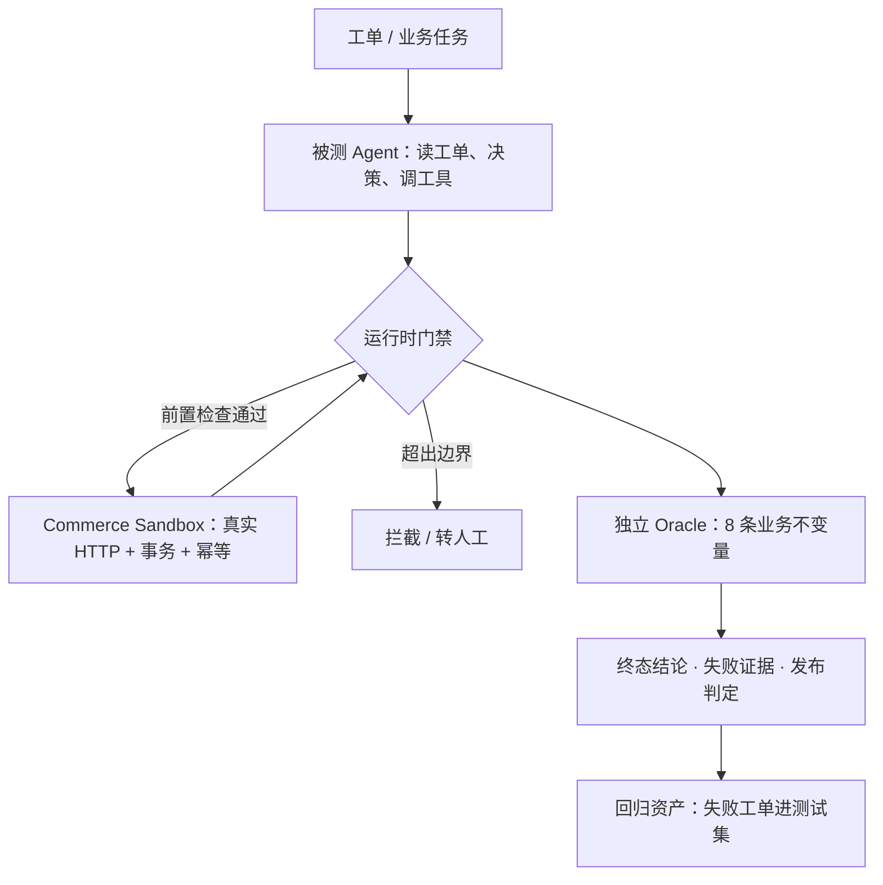

# RuleArena 项目说明 v0.3

状态：**定位已转向「业务 Agent 上线前的执行门禁」**（2026-09-14）；Refund Agent 与运行时门禁**已实现并实测**（见 §7.4），剩余「设计中」只有对外 CI 形态  
文档用途：统一产品叙事、用户与使用方式、架构主线、评测口径与面试表达  
事实基线：仓库 `E:\code\my\RuleArena`（分支 `feat/agent-gateway`）的 README、`benchmarks/README.md`、`docs/benchmark-results.md` 与 `docs/agent-gateway-spec.md` §8（执行结果）

> **本版说明与 v0.2 的关系**：v0.2 的主线是「搜索规则组合漏洞」。v0.3 把被测对象从「规则与实现」前移为「**决策并调用工具的 Agent**」，并把裁决从**离线**推进到**运行时**。核心机制（Commerce Sandbox / Oracle / 幂等 / 评测框架 / 冻结 Demo）**不变且已实现**；新增的是 Refund Agent、运行时门禁与工单任务集。
>
> 任何「已完成、已部署、达到某指标」的表述，必须由代码、测试、BenchmarkRun 或运行证据支持。

---

## 0. 一句话定义

> **RuleArena 是业务 Agent 上线前的执行门禁：Agent 负责做事，系统负责证明它没做错。**

它要解决的根本矛盾是：

> **Agent 调了工具，却无法确定业务上到底成功没有——工具返回 ACK 不等于业务成功，Agent 说自己成功了没人能验。**

所以信任必须由 Agent 之外的机制给出。三层缺一不可：

```text
① 工具契约      只能做被批准的动作，不能自由发挥
② 运行时门禁    调用前拦、重试幂等、返回后重读权威状态，不信 ACK
③ 独立 Oracle   按业务不变量做确定性裁决，不采信 Agent 自述
```

最小价值单位不是「一份漂亮的分析报告」，而是：

> **一条被独立验证过的终态结论：Agent 做对了什么、做错了什么、损失多少、能不能上线。**

---

## 0.5 实测现状（golden-v4，2026-09，deepseek-v4.1-flash）

> 面试口径第一优先级：**先讲实测结果，再讲机制**。所有数字可在仓库复现（`uv run rulearena benchmark ...`、`benchmark verify --latest`）。

当前评测版本 **golden-v4**（development 21 = 14 缺陷 + 7 正常；hidden 17 = 14 缺陷 + 3 正常；temperature 0、seed 20260831）：

| Baseline | 套件 | 重复 | 结果 | 误报 | 稳定重放 |
| --- | --- | --- | --- | --- | --- |
| Random | dev | 1 | 0/14 | 0/7 | — |
| BFS | dev | 1 | 2/14 | 0/7 | 6/6 |
| Single Agent | dev | 1 | 4/14 | 0/7 | 12/12 |
| Multi-strategy | dev | 1 | 5/14 | 0/7 | 15/15 |
| Multi-strategy | hidden | 3 | `pass@3 = 8/14`，**`pass^3 = 1/14`** | 0/3 | 42/42 |

**诚实结论（成对陈述，只报一半等于造假）：**

1. **搜索层已追上并超过确定性基线，但不可复现。** dev 上 Multi 5/14（36%）高于 BFS 2/14（14%）——上限比历史上任何一版都好；但 hidden 三次重复暴露 **`pass^3 = 1/14（7%）`**：8 个被找到的 case 里只有 1 个三次都找到。**「发现率 57%」和「稳定发现 7%」是两个完全不同的产品承诺**，单次运行会把这两者掩盖成一个数字。
2. **机制层全部达标。** 误报 0、Ground Truth 泄漏 0、稳定重放 42/42、历史 P0 回归 100%、无未解释的失败。
3. **发布门禁如实拒绝。** `benchmark verify --latest` 9 项检查过 8 项，唯一未过的是 `hidden_discovery_at_least_75_percent`（8/14 = 57% < 75%）。
4. **「拒绝」本身就是产品价值。** 门禁如果会因为没有好消息就变绿，它就不是门禁。**而搜索层不可复现这件事，恰好是「为什么需要独立门禁」的最强论据**——不能指望搜索本身保证覆盖，必须由门禁在运行时兜住。

> **⚠️ 别把「确认精度」说成「确认率」。** `候选确认` 是「被确认的候选 ÷ 总候选」（hidden 为 14/944），目标区间 30%～60% 且**不是越高越好**；达标的是**确认精度**（被确认的没有一个是假阳性）。两个词混用会被追问击穿。

---

## 1. 业务场景：谁在什么情况下遇到这个问题

### 1.1 目标用户

| 用户 | 需要完成的任务 |
| --- | --- |
| **Agent 应用开发者（主）** | 让手上的售后/退款/营销 Agent 上线前知道自己会不会做错、错在哪、损失多大 |
| Agent 平台/SRE | 给多个业务 Agent 一个统一的上线前执行门禁与回归资产库 |
| 测试/风控 | 用可复现的失败用例替代手工用例，把「测过了」变成「证明过」 |

**核心 Job to Be Done：**

> **当一个 Agent 要获得「动钱、动权益、改状态」的工具权限时，在不触碰生产的前提下，证明它的行为符合业务不变量，并给出可复现的失败证据与发布判定。**

### 1.2 问题从哪里来

**一句话说清根因**（2026-07 已有论文把它形式化为「非原子工具调用」）：

> **Agent 看到的是「响应通道」，事情实际发生在「效果通道」——两个通道是分开的。**

**响应通道**是 Agent 收到的回执：成功、失败、超时、空响应。
**效果通道**是服务端真正发生的事：钱扣了没有、券发了没有、账本记了没有。
两者不同步时，Agent 的判断就建立在错误事实上。由此产生的行为：

- 工具**超时**了——是失败，还是成功了只是响应丢了？Agent 往往当成失败**重试**，于是**重复退款**；
- 工具**返回 ACK** 了——Agent 当作业务成功继续推进，但业务上可能根本没入账；
- Agent 在**多轮对话/多日任务**中丢失上下文，对同一张工单**再次处理**；
- 义务性动作被漏掉——钱退了，但**积分没撤、权益没收回**；
- 单步合法、**顺序**非法——部分退款累计超过实付；
- Agent **自述成功**，而权威状态显示失败。

**注意最后一条的性质**：Agent 可能**最终把事做对了，但走了一条不安全的路径**（比如重复退款后又被人工追回）。只看「任务是否成功」会漏掉这类失败——这是本项目把**意外资损笔数**单独设为指标的原因，也是评测设计上最容易犯的错。

### 1.3 已有做法为什么不够

| 已有做法 | 覆盖了什么 | 缺什么 |
| --- | --- | --- |
| 人工工单用例 | 想到的路径 | **受想象力限制**，长尾与异常顺序覆盖不到；写用例跟不上迭代 |
| LLM 审 PRD / 代码 | 风险提示 | **只是推测**，不能证明真实系统里走得通，进不了发布决策 |
| 单元测试 / API 测试 | 实现是否符合预期 | 测的是「**已知的**预期」，不是「**未知的**组合」 |
| 故障注入 / 混沌工程 | 系统在故障下**崩不崩** | 面向**可用性**，不算业务守恒，不判断「多退了一笔钱」 |
| 上线后对账 | 事后发现资损 | **已经亏了**；且定位靠人，回归靠运气 |

**共同缺口：没有任何一环能给出「这个 Agent 在动钱之前，被证明没做错」的结论。**

### 1.4 设计哲学

> **让 LLM 去搜人想不到的路径，让确定性程序去证明路径是不是真的有问题。**

- 模型负责**提议、探索、生成**；
- 代码负责**边界、执行、裁决**；
- 二者之间是**硬边界**，不是提示词约束。

### 1.5 六条设计原则

1. **契约先行**：业务规则必须编译为可校验、可版本化、人工确认过的不可变契约；未确认的规则不进入执行。
2. **信任必须在 Agent 之外**：被测 Agent 不能生成自己的考卷，不能裁决自己，不能决定自己的终态。
3. **确定性负责边界与事实**：执行、幂等、状态、不变量裁决全部由确定性代码完成，模型不参与资金裁决。
4. **完成必须由外部证据证明**：工具 ACK、模型自述都不算数；只认 Receipt、权威状态、业务事件与 Oracle 结果。
5. **门禁 fail closed**：不确定时拦下或转人工，不默认放行；「没发现问题」不等于「没问题」。
6. **多 Agent 只有产生边际收益才值得保留**：隔离策略的价值由消融数据决定，数据不支持就降级叙事。

### 1.6 行业位置：这个方向已经有论文和产品，**但我们的位置没有被占**

> **本节用于应对「这不就是业界早有的东西吗」这类追问。答案是：对的，而且这正是设计成立的证据——但要分清谁在哪一层。**

**① 问题已被正式提出（2026-07，arXiv:2608.02645）**

> 《Verified Tool Calls Improve LLM Agent Reliability Under Non-Atomic Failures》把「工具调用非原子」形式化为独立的可靠性问题，并给出一个至今最精确的说法：

> **Agent 看到的是「响应通道」，事情实际发生在「效果通道」——两个通道是分开的。** 由此产生四类失败模式（超时但已生效、延迟可见、部分状态更新、陈旧读），导致重复动作、错误完成和连锁故障。

**② 解法已被验证有效（同一篇论文的实测）**

| 方法 | 重复副作用发生率（跨两个任务、三档故障强度） |
| --- | --- |
| 只重试（Retry Only） | **20% → 76%**（故障越重越高） |
| 重试前先验证（Verify-Before-Retry） | **0% → 20%** |

论文最重要的消融结论：**收益来自「验证」而不是「重试」——重试本身会制造新的重复机会。** 这与本项目「不信 ACK、先查权威状态」的设计同源。

**③ 该问题还有第二个学术议程（2026-06，arXiv:2606.08790）**

RAILS 提出「agentic clearing」：结算之前必须先裁决 Agent 是否履行了义务，其核心不变量是**任何有资金后果的结算都不得由低于义务门槛的证据支撑**。这是**结算层**的形式化协议设计（含可靠性评分与清算决策），与我们的**上线前行为验证**不在同一层。

**④ 工程侧也已形成共识**：运行时护栏已是独立品类（Arthur、Galileo 等做输入/输出侧拦截），框架层 Hook 能在工具执行前做强业务规则校验（如 Strands Agents 的钩子），「AI Agent 幂等工具调用」已有成型的工程写法。

**那我们做什么？——三处差异，都不在这些工作的射程内：**

| | 学术界 / 工程界现状 | RuleArena |
| --- | --- | --- |
| **方向** | 关注「**怎么让 Agent 别重复做事**」（wrapper / hook / 协议不变量） | 关注「**怎么证明它做错了、并据此决定能不能上线**」——**发布门禁** |
| **裁决依据** | 后置条件验证器的**布尔通过**、可靠性评分 | **业务不变量**（资金守恒、权益生命周期、幂等）——算得出金额 |
| **产物** | 通过护栏的请求、结算指令、可靠性评分 | **可复现的失败证据 + 回归资产 + 发布判定** |
| **方法** | 形式化证明 / 工程 pattern | **可跑的评测**：双评测集、四基线、`pass@k` 与 `pass^k` 分开报 |

**一句话定位**：**已有的工作证明了「验证必须先于重试」，本项目把它落成一个能改变发布决策的门禁，并且用可复现的评测证明它有用。**

> **面试怎么用这一段**（不要背成「我很新」，要背成「我知道我在哪」）：
>
> 「这个方向不是我发明的——2026 年有论文把『工具调用非原子』形式化了，实测也证明重试前验证能把重复副作用从最高 76% 压到 20% 以内。我的不同不在机制层，在**它外面**：他们做的是让 Agent 别重复做事，我做的是**证明它做错了、并且据此拦住发布**；裁决依据不是置信度分数，是能算出来的业务不变量。所以我的项目不是抢跑，是**在已经成立的共识上往前接了一段**。」

---

## 2. 黄金场景：超时重试导致的重复退款

### 2.1 设置的业务世界

- 新用户获得 50 元优惠券；
- 订单原价 150 元，用券后实付 100 元；
- 实付满 100 元发 100 积分；
- 全额退款恢复原优惠券，**并应撤销积分**；
- 100 积分可兑换 20 元券。

### 2.2 被测对象

**Refund Agent**：读售后工单 → 查订单状态 → 决策 → 调用沙箱工具（退款、发券、查状态）→ 输出处理结论。
它**只能调被批准的工具**，工具就是那几个业务原语。

### 2.3 主场景：同一张工单，用户三次投诉

| | 发生什么 |
| --- | --- |
| **裸 Agent**（只有工具） | 第一次调退款工具**超时** → Agent 判断失败 → **重试** → 第二笔退款真的发生（沙箱经故障注入：超时但实际已入账）→ **用户多拿 100 元**，且 Agent 认为一切正常 |
| **同一份 Agent + RuleArena 门禁** | 第二次退款在**执行前**被拦（累计退款 > 实付）→ 门禁通过幂等键与快照查询发现**第一笔其实成功了** → 返回「已退款，无需重试」→ Agent 正确回应 |

**关键**：两组跑的是**同一份 Agent 代码**，差别只有中间有没有门禁。这不是「好 Agent 打坏 Agent」，是**同一件事，有没有人守住**。

### 2.4 第二条主线：退款了，义务没做完

Agent 退款成功，但**没撤积分 / 没收回已消费权益** → 用户白得积分或权益残留。由 `POINTS_VALUE_CONSERVATION` 与 `ENTITLEMENT_REFUND_CONSISTENCY` 裁决。

这条线的价值：**门禁不是只拦「重复动作」，它同样能发现「没做的动作」。**

### 2.5 为什么这个案例适合当主线

- 非技术用户立刻能懂「退了两笔钱」；
- 它是**真实的 Agent 失败模式**（工具不可靠），不是构造出来的刁难；
- 同时覆盖工具契约、幂等恢复、权威状态、独立裁决、评测与门禁；
- 演示上是完整的对照组故事：**同一张工单，有没有门禁，结果差一笔钱**。

---

## 3. 系统架构



### 3.1 四层职责

| 层 | 负责 | 不负责 |
| --- | --- | --- |
| **工单任务集** | 定义输入诉求、订单现状、期望终态与允许动作集 | 不预设 Agent 的实现方式 |
| **被测 Agent** | 理解诉求、选择动作、调用工具、形成结论 | 不能裁决自己、不能决定 Outcome、不能写权威状态 |
| **运行时门禁** | 前置条件检查、重试幂等、Receipt 查询、终态校验 | 不做语义判断、不替代 Agent 决策、不修改业务逻辑 |
| **Oracle** | 按不变量裁决权威状态，产出可重算的证据 | 不看 Agent 的自述，不做自然语言判断 |

### 3.2 运行时门禁：三段拦截（本版新增的核心）

| 时机 | 门禁做什么 | 对应能力 |
| --- | --- | --- |
| **调用前** | 前置条件与边界检查：累计退款会不会超实付、当前状态允不允许这个动作 | 工具副作用控制 |
| **重试时** | 用同一个幂等键 + Receipt 查询判断「上一次到底成功没有」，而不是再执行一次 | 幂等与恢复 |
| **返回后** | **不信 ACK**：重读权威快照与事件，确认这步动作在业务上真的成立了 | 环境后置验证 |

**三条都失败时**：标记为不确定 → 拒绝继续或转人工，**fail closed**。

### 3.3 工具契约

被测 Agent 能做的事是一个**闭集**：查订单状态、创建退款、发优惠券、查积分、兑换积分、查权益。每个动作都有类型化 schema（`extra=forbid`），越界即拒绝。

**Agent 只能提议动作，不能直接写数据库**——权威状态由 Sandbox 的事务与账本维护。

### 3.4 Commerce Sandbox

不是内存 Mock，而是独立 FastAPI 服务 + PostgreSQL：

- 每个写动作有幂等键与 ActionReceipt；
- 只追加的业务事件流；
- 每个 Run 独立数据空间；
- **可注入缺陷轴**（用于复现真实失败模式）；
- HTTP 超时后的 Receipt 查询与 `ACTION_UNKNOWN` 语义。

**它对外的接口是有限的六个语义操作**：创建场景、执行动作、查回执、查快照、查事件、重置清理。

---

## 4. 独立 Oracle：8 条业务不变量

`NET_PAID_NON_NEGATIVE` · `REFUND_NOT_EXCEED_PAID` · `COUPON_SINGLE_CONSUMPTION` · `POINTS_VALUE_CONSERVATION` · `ORDER_TERMINAL_MONOTONICITY` · `ENTITLEMENT_NON_NEGATIVE` · `ENTITLEMENT_REFUND_CONSISTENCY` · `IDEMPOTENT_EFFECT`

**裁决方式**：每步动作后重新读取权威状态与账本，**从快照 + 账本 + 事件重算业务事实**，不信任被测系统返回的文本。

**不变量从哪来**：来自业务语义的先验（价值守恒、状态生命周期、幂等），并**以冻结的规则契约为裁决基准**——若人工确认的规则本身规定「退款不回收积分」，Oracle 以该契约为准，不按通用先验误报。

**Oracle 与 Sandbox 是相互独立的部署单元**：被测实现自身的缺陷不能反过来定义裁决标准。

---

## 5. 规则引擎的安置：自动出题器

原有能力（按冻结规则搜索违反不变量的动作序列）**不删、不降级价值，而是改换位置**：

> **门禁需要考卷。规则引擎现在负责自动出题。**

它从业务规则出发，自动派生对抗工单与压力用例——**人工写工单越写越慢，让它生成，测试集才能持续增长**。

**支撑数据（golden-v4，就是 `pass@3 = 8/14` / `pass^3 = 1/14` 那一组）**：出题器本身不稳定，这件事被如实记录、没有拿单次运行的数字骗门禁。**这既是对出题能力的诚实标注，也反向证明了门禁的必要性：不能指望搜索保证覆盖，必须由运行时门禁兜住。**

**两层共用同一个 Oracle 内核**——这是它们能拼成一个系统的原因，也是「一套裁决标准，两种用法」的由来：

| | 规则引擎（离线） | 运行时门禁（在线） |
| --- | --- | --- |
| 时机 | 上线前批量搜索 | 运行中逐次拦截 |
| 用途 | 生成对抗工单 | 拦住错误与重复 |
| 共用 | 同一套业务不变量 | 同一套业务不变量 |

---

## 6. 评测与结果

### 6.1 对照口径（核心交付指标）

固定工单任务集（含正常工单与故障轴），**同一份 Agent 代码跑两次**：

| 指标 | 含义 |
| --- | --- |
| 终态正确率 / n | 处理完以后业务状态对不对 |
| **意外资损笔数与金额** | 多退/多给的钱——**最直白的指标** |
| **自述成功但实际失败** | Agent 谎报率：它说做完了，权威状态说没有 |
| 必要转人工率 | 该升级给人的有没有升级 |
| 单任务步数与成本 | 门禁带来的开销 |

> **为什么不能只看「任务是否成功」**（这条是被论文验证过的评测陷阱）：Agent 可能**最终把事做对了，却走了一条不安全的路径**——例如重复退款后靠人工或对账追回。只统计终态成功率，会把这种失败**全部漏掉**。所以「意外资损笔数」必须独立成指标，且与成功率并列报。

### 6.2 必须报诚实区间

沿用仓库已有的统计口径：**`pass@k`（跑 k 次至少成一次）与 `pass^k`（跑 k 次次次都成）分开报**，并在样本量不足时给出置信区间而不是单点数字。**「发现率 57%」和「稳定 7%」是两个不同的产品承诺。**

### 6.3 门禁与阈值

| 指标 | 口径 |
| --- | --- |
| 正常工单误拦 | 0（拦错和放过一样是故障） |
| 确认的资损结论 | 同版本独立重放 3/3 |
| Ground Truth 泄漏 | 0 |
| 阈值类目标（如发现率 ≥ 75%） | **是阈值不是成绩**，未达标就如实拒绝 |

---

## 7. 交付物与验证路径

> **这一节专治「做得挺深，但不知道交付到了哪一步」。**

### 7.1 用户拿到什么

| 判定 | 交付物 |
| --- | --- |
| **拒绝** | 一条可重放的失败证据：工单输入 + Agent 动作序列 + 工具回执 + 业务事件 + 权威状态 Diff + 违反的不变量 + 损失金额，绑定版本号，任何人可复现 |
| **通过** | 结论 + **预算内未发现**的诚实声明（不是「绝对安全」） |

### 7.2 三种使用形态

1. **冻结 Demo**：浏览器打开即可浏览真实持久化 Run（无需模型），含对照组与状态 Diff；
2. **Benchmark CLI**：`uv run rulearena benchmark --suite development --baselines ...`——对一套工单跑完整评测；
3. **复核命令**：`uv run rulearena benchmark verify --latest`——任何人可核对门禁判定的版本、预算、seed 与结果，**防指标作弊**。

### 7.3 理想形态（诚实说「设计目标」）

CI 门禁：Agent 或规则变更提 PR → 自动跑该 Agent 映射的回归工单 + 对抗工单 → 门禁报告与失败证据挂到 PR → 未通过则阻断合并。

### 7.4 完成度边界（**面试必须主动说**）

| 已实现（有代码与实测） | 设计中 |
| --- | --- |
| Commerce Sandbox：11 类业务原语、幂等、事件、快照、缺陷轴注入（8 个轴，含传输轴 `REFUND_ACK_LOST`） | 对外 CI 形态（PR 自动跑回归工单并阻断合并，见 §7.3） |
| 独立 Oracle：8 条不变量（违规判定只来自它，门禁不决定终态） | |
| 评测框架：双集隔离、四基线、`pass@k`/`pass^k`、门禁、复核命令 | |
| 规则引擎与离线搜索闭环、冻结 Demo、Live Run | |
| **Refund Agent（被测对象）**：确定性策略 + `ToolGateway`，15 张工单 | |
| **运行时门禁三段拦截**：写前预算 / 超时查回执 / 写后确认生效，只做确定性算术 | |
| **工单任务集与对照评测**：`refund-bench`（裸跑 vs 加门禁）/ `refund-verify` | |

**实测（2026-09-14，真实 Sandbox HTTP，BARE/GATED 各 45 次运行 = 15 张工单 × 3 次重复）**：

| 指标 | BARE（裸跑） | GATED（加门禁） |
| --- | --- | --- |
| 终态正确率 | 9/15（60%） | 15/15（100%） |
| 意外资损笔数 / 金额 | 6 笔 / ¥640（跨 45 次运行 ¥1920） | 0 笔 / ¥0 |
| 正常工单误拦 | —（无门禁） | 0 |
| 工具调用 / 门禁检查 / 平均耗时 | 120 / 0 / 5.78s | 90 / 207 / 5.48s |

> **执行正本**：`E:\code\my\RuleArena\docs\agent-gateway-spec.md`（D1–D5 交付物、四条不变量、里程碑与验收命令；§8 记录逐项验收结果与实测数字）。
> **口径纪律**：右侧「设计中」只剩对外 CI 形态——它是形态而不是代码，本版不做。上表右侧的
> 三项已按 D5 的要求、**在 `refund-bench` 跑出真实数字之后**才移入左侧；执行中发现并修正了
> 一处真实缺陷（工具层把沙箱"业务拒绝"的 200 读成成功），修正后两组数字均已重跑。

---

## 8. 系统边界与诚实口径

### 8.1 负责

固定业务原语与工具契约 · 业务不变量裁决 · 运行时门禁三段拦截 · 幂等与恢复语义 · 失败证据与最小化 · 评测与发布门禁 · 冻结 Demo 与复核命令。

### 8.2 不负责

真实资金与生产支付 · 直接接入企业生产系统 · 复杂并发与分布式竞态证明 · 任意行业自由建模 · 让 Agent 自动修改发布业务代码 · 形式化证明系统安全 · 用 LLM Judge 替代确定性业务裁决。

### 8.3 只能声明 / 不能声明

**能说**：在给定的契约版本、环境版本、Oracle 版本、seed 与预算内，发现或未发现违规。

**不能说**：系统已经证明某个 Agent 绝对安全。

### 8.4 真实性分层（别把替身说成客户系统）

| 层次 | 实现 |
| --- | --- |
| 业务真实性 | 真实电商售后与营销的规则类型和状态问题 |
| 执行真实性 | 独立服务的 HTTP API、事务与数据库状态 |
| 失败真实性 | 可解释、可重放的缺陷注入 |
| 验证真实性 | 独立 Oracle 从账本、快照、事件判定 |
| 运行真实性 | 部署、队列、Trace、恢复、评测与门禁都真实运行 |

> **被测环境是真实业务系统的替身，不是任何客户的系统，也不是客户的 API。** 它替代客户系统，是为了让「验证」这件事**成立**，同时把危险动作关在笼子里。
>
> 若未来接入外部系统，走适配层接**测试/staging 环境**，接入前要过可验证性门槛：动作空间可枚举、权威状态可重算（有账本流水而不是只有总数）、不变量自洽。**不满足的系统接进来也裁决不了。**

---

## 9. 面试表达

### 20 秒

> 我做了一个业务 Agent 上线前的执行门禁。起因是我写了个客服退款 Agent，测试时发现它工具超时重试之后**多退了一笔钱**，而且它**认为自己是对的**。所以重点是：怎么在 Agent 动钱之前拦住错误，动完之后独立证明它没做错。机制层实测零误报、零泄漏、同版本重放 42/42；搜索层我如实说——三次重复下稳定发现只有 7%，门禁因此拒绝放行。

### 90 秒主线

> 做 Agent 应用的人都会遇到一个问题：Agent 调了工具，但它不知道业务上到底成功没有。工具返回超时不代表失败，回 ACK 也不代表成功；而 Agent 自己说做完了，没人能验。我的项目就是解决这个。
> 一条工单进来，Agent 读诉求、查订单、调工具处理；中间有一道运行时门禁：调用前做边界检查，重试时用幂等键和回执查询判断上次到底成没成，返回后重读权威状态而不信 ACK。最后独立 Oracle 从账本、快照、事件重算业务不变量——退款不能超过实付、积分要守恒、权益不能残留。评测是同一份 Agent 跑两次，一次裸跑、一次加门禁，比的是终态正确率和意外资损笔数。
> 演示场景很简单：用户三次投诉要退款，第一次退款工具超时了但其实成功——裸跑会重试出一笔重复退款，加门禁就拦住了。搜索能力那边我用 21 个开发集和 17 个隐藏集做了消融，历史上限超过确定性基线，但三次重复暴露 `pass^3 = 1/14`，所以门禁如实拒绝放行。我宁愿要一个诚实会拒绝的门禁，不要一个会因为没有好消息就变绿的门禁。

### 开场第一句（决定后面二十分钟）

> 「我做了一个客服退款 Agent。测试的时候发现，它在工具超时重试之后**多退了一次钱**——而且它**认为自己是对的**。从那之后我的重点就不是『让 Agent 更聪明』，而是『怎么证明它没做错，以及怎么在它做错之前拦住』。」

### 高频追问与应答要点

| 面试官可能追问 | 应答要点 |
| --- | --- |
| 「这不就是「重试前先验证」吗？论文和产品都有了」 | 对，而且我应该知道这件事——2026 年就有论文把「非原子工具调用」形式化了，实测证明重试前验证能把重复副作用从最高 **76% 压到 20% 以内**，结论是**收益来自验证而不是重试**。我的位置不在这层：他们做的是「让 Agent 别重复做事」，我做的是「**证明它做错了、并据此拦住发布**」——裁决依据是能算出来金额的业务不变量，产物是可复现的失败证据和回归资产。**不是发明机制，是把机制接上了发布决策** |
| 「Agent 自己也能生成测试用例，为什么要你？」 | **让 Agent 自己出考卷自己判分，等于没有评测。** 验证必须在 Agent 外面，不能是它的工具——我连它的工具列表里都没有「裁决」这一项 |
| 「用 LLM 当裁判不行吗？」 | 资金守恒、幂等、状态单调这些都是**能算的**；能算的就不该让模型判。LLM 适合判表达质量，不适合判钱 |
| 「门禁会不会把 Agent 管死/误伤正常工单？」 | 误拦是明确指标，正常工单误拦目标为 **0**；门禁只做确定性算术，不做语义判断，语义判断留给 Agent 和转人工 |
| 「这不就是把电商规则那套换个说法？」 | 不是。**规则那套是离线搜索，门禁是实时拦截**；被测对象从「规则实现」变成了「会自己重试、自己判断成败的 Agent」，这是新的失败面 |
| 「AI 会写测试代码了，你固定动作空间干什么？」 | 可枚举才可裁决：固定动作才能去重、比较、最小化，目标系统没这个能力时能干净地报 UNSUPPORTED，**而不是没测过却绿着放行** |
| 「90 秒改 300 秒，是不是调参凑结果？」 | 只改时间一个变量，依据是实测 p95 延迟（v1 下 Agent 平均 75.8s / 13.75 步即被截断、从未提交候选，是结构性截断）；Case 内容、期望答案、其他预算与阈值全不变；并声明旧结果作废全部重跑。**调参凑结果是放宽阈值，我校准的是测量条件，方向相反** |
| 「结果对自己不利，为什么还写进仓库？」 | 门禁的意义就在这：**它会不会因为没有好消息就变绿。** `benchmark verify --latest` 允许任何人复核——这套诚实机制本身就是我最想让面试官看到的东西 |
| 「和你的实习项目什么关系？」 | 金山那套把 **604 台电表 15 分钟一次**的采集做成幂等和补数——同一个问题的另一面：**采集窗口重试不能产生第二条数据，工具重试不能产生第二笔退款**。数驭穹图那边是查询安全与评测集，对应这里的工具边界与考卷。三者都指向同一件事：**让不确定的系统变得可信、可验证** |

### 三个可深讲难题

1. 为什么裁决必须独立于被测对象，怎么避免「自己验证自己」；
2. 写动作超时后，怎么用幂等键 + Receipt + 权威查询 + `ACTION_UNKNOWN` 防止重复副作用；
3. 为什么「同版本独立重放 3/3」和「`pass^3`」比单次发现率更能说明系统可信。

### 外部信源与行业校验（2026-09 联网核对）

| 信源 | 它说了什么 | 对本项目的意义 |
| --- | --- | --- |
| **arXiv:2608.02645**（2026-07）Verified Tool Calls Improve LLM Agent Reliability Under Non-Atomic Failures | 形式化「非原子工具调用」，提出响应通道 / 效果通道分离；实测重试前验证把重复副作用从 20–76% 压到 0–20%，**收益来自验证而非重试** | **验证了核心机制**：正确性依据是外部状态，不是执行信号；本项目同源 |
| **arXiv:2606.08790**（2026-06）RAILS: Verification-Native Clearing for Agentic Commerce | 提出结算前的义务裁决协议，不变量是「有资金后果的结算不得由低于门槛的证据支撑」；属**结算层形式化** | **划清了边界**：它在结算层做形式化协议，我们在上线前做行为验证与门禁 |
| 运行时护栏品类（Arthur / Galileo 等）、框架层 Hook（如 Strands Agents）、AI Agent 幂等工程写法 | 工具执行前后拦截、业务规则强校验、幂等键已成为标准做法 | **证明共识已成形**；差异化在「给不给发布判定、有没有可复现失败证据」 |
| OpenAI Agents API（2026-09-10） | 托管 harness + 可选沙箱 + 工具契约的分层结构 | **结构同源**：本项目的 Harness 映射与之同构，说明抽象已被行业确认 |

**用法**：面试时**主动提**这一节。一个「知道自己工作在哪个坐标、引用得出具体论文和产品」的候选人，比一个声称自己发明了机制的候选人可信得多。**不要声称首创。**

### 事实安全口径（E1/E2/E3）

> **等级口径统一到 `output/主张-证据账本-刘宇广.md` 第 5 节。**
>
> - 本文所有 Benchmark 数字 = **E2**（固定回放/离线评测，可由命令复现），**不是线上**；
> - 门禁阈值（如 hidden 发现率 ≥ 75%）= **E3**（目标值，不写入简历）；
> - 引用 golden-v4 时必须**成对陈述**：搜索层不可复现（`pass^3 = 1/14`）与机制层达标（误报 0 / 泄漏 0 / 重放 42/42）——只报一半等同选择性陈述；
> - 「真实业务」指真实业务规则与执行机制，**不冒充真实企业客户或生产流量**。

---

## 10. MVP 完成定义

以下闭环全部有实际证据时，才可宣布完成：

```text
工单输入
→ 工具契约约束下的 Agent 处理
→ 运行时门禁三段拦截
→ 独立 Oracle 终态裁决
→ 对照组评测（资损笔数）
→ 失败工单进回归集
→ 发布判定
```

任何阶段门禁未通过，可以发布「技术预览」，但必须公开当前限制，**不得用 UI 文案、删 Case 或手填数字制造完成感**。
