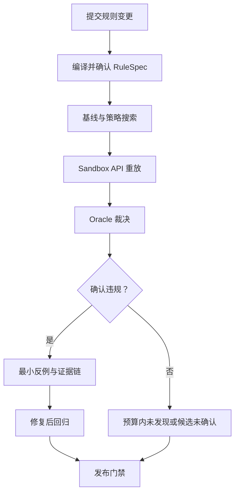
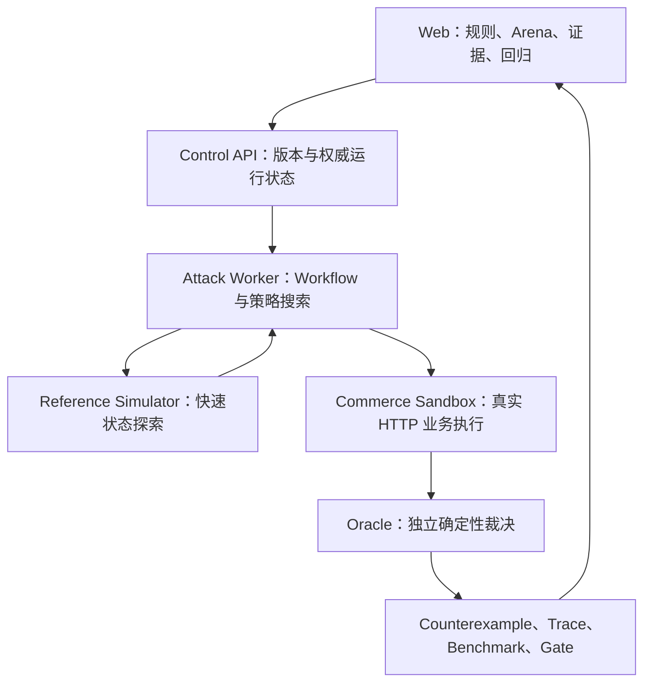

# RuleArena 项目说明 v0.2

状态：产品全貌已确认；golden-v2 四基线实测已完成（2026-09，真实模型 deepseek-v3.2）  
文档用途：统一产品叙事、业务边界、架构主线、演示方式与面试口径  
事实基线：以 `01-product-requirements.md`、`02-domain-model.md`、`03-technical-spec.md`、阶段 Review 结论与仓库 README 评测表为准（E:\code\my\RuleArena，feat/discovery-optimization）

> 本文描述的是已经确认的产品设计，不自动代表所有能力都已实现。任何“已完成、已部署、达到某指标”的表述，必须由代码、测试、BenchmarkRun 或线上运行证据支持。

---

## 0. 一句话定义

> **RuleArena 是面向电商促销、退款、积分和会员权益规则变更的 AI 对抗验证与发布门禁平台：把自然语言规则转换为经人工确认的可执行契约，由受控 Agent 搜索高风险动作序列，通过真实 HTTP API 重放，并由确定性 Oracle 裁决和沉淀回归反例。**

最小价值单位不是一份“可能存在风险”的分析报告，而是：

> **一条经过真实 API 重放、确定性验证、可以稳定复现并长期回归的业务反例。**

产品主张：

> **Agent 负责寻找人没有想到的路径，确定性程序负责证明路径是否真的有问题。**

---

## 0.5 实测现状（2026-09，golden-v2，真实模型 deepseek-v3.2）

> 本节是面试口径的第一优先级：**先讲实测结果，再讲机制**。所有数字可在仓库复现（`uv run rulearena benchmark ...`、`benchmark verify --latest`）。

### 测量驱动的预算校准（golden-v1 → golden-v2）

- golden-v1 用真实模型实测发现：90s 时间预算**结构性截断** Agent（平均 75.8s / 13.75 步即被截断，从未提交候选），而 Random/BFS 不受影响，对比不公平。
- golden-v2 **只改 `max_time_seconds` 90 → 300 这一个变量**（依据实测 p95 延迟校准），Case 内容、期望答案、其他预算与门禁阈值不变；并声明 golden-v1 旧结果不可复用于 v2 门禁。
- 这是「先测量、再改一个变量、旧结论作废」的完整闭环，面试可当评测方法论案例讲。

### 四基线实测结果（dev 16 = 9 缺陷 + 7 正常；hidden 8 = 5 缺陷 + 3 正常）

| Baseline | dev 发现率 | hidden 发现率 | 误报 | 候选确认 |
| --- | --- | --- | --- | --- |
| Random | 0/9 | 0/5 | 0 | — |
| BFS | 2/9 | 1/5 | 0 | 3/70 (dev)，重放稳定 9/9 |
| Single Agent | 0/9 | 0/5 | 0 | 预算内未提交候选 |
| Multi-strategy | 0/9 | 1/5 | 0 | hidden 1/1，重放稳定 3/3 |

全程无 INFRA_FAILED、正常场景误报 0、Ground Truth 泄漏 0。

### 诚实结论（背下来，这是项目最大差异化点）

1. **机制层全部达标**：真实 HTTP 重放、确定性 Oracle 裁决、**确认层零误报（被确认的候选没有一个是假阳性）**、同版本独立重放 3/3、零泄漏。
   **⚠️ 别把这句说成「候选确认 100%」**——`Candidate 确认率` 是另一个指标，指「被确认的候选 ÷ 总候选」，实测 BFS 是 `3/70`（见上表），`08-容量与事实` 的目标区间是 **30%～60% 且明确写了「不是越高越好到 100%」**。**达标的是「确认精度」（无假阳性），不是「确认率」。两个词混用会被追问击穿。**
2. **搜索层尚未达标**：LLM 策略发现率（0–20%）**还没有超过确定性 BFS（20–22%）**，Single Agent 在 300s 预算内仍未提交候选——当前已知的主要短板，见第 12 节 P1.5 主攻。
3. **按口径如实降级**：Multi-strategy 的价值主张已按 Spec 降级；Release Gate 因 hidden 发现率 < 75% **如实拒绝发布**。
4. **「拒绝」本身就是产品价值**：门禁如果会因为没有好消息就变绿，它就不是门禁。项目当前状态（机制可信、门禁拒绝）正是它被设计出来要给出的那种诚实答案。

---

## 1. 为什么需要 RuleArena

### 1.1 真实业务问题

电商中的订单、优惠券、积分、退款和会员权益通常由不同模块、规则和团队维护。单条规则往往并不复杂，真正的风险来自规则组合：

- 支付时发放积分，退款时是否完整撤销；
- 优惠券恢复后能否再次产生价值；
- 多次部分退款的累计金额是否超过实付；
- 已消费会员权益后能否继续全额退款；
- 相同请求在超时重试后是否产生两次业务效果；
- 合法的单步动作按特殊顺序组合后，是否到达非法状态。

传统测试主要覆盖研发和测试人员已经想到的路径。LLM 阅读 PRD 可以补充风险提示，但它给出的只是推测，不能证明真实系统可以复现，更不能直接成为发布结论。

RuleArena 解决的根本问题是：

> **如何在规则上线前，用有界成本主动搜索跨模块、跨状态和异常顺序组合，并把可疑路径转化为可重放、可裁决、可回归的工程证据。**

### 1.2 目标用户

| 用户 | 需要完成的任务 |
| --- | --- |
| 产品经理 | 在发布前发现规则歧义、冲突和缺失条件 |
| 测试工程师 | 补充人工用例难以枚举的长尾路径并沉淀回归资产 |
| 后端开发 | 获得包含请求、Receipt、事件、状态 Diff 的复现证据 |
| 交易风控 | 搜索重复退款、权益残留和价值套利路径 |
| 营销/会员运营 | 验证活动叠加和权益生命周期是否符合业务预期 |

核心 Job to Be Done：

> 当一组电商规则准备上线或发生变更时，在不修改生产数据的前提下，自动搜索并确认可能造成资金或权益异常的操作路径，并用修复回归结果支持发布决策。

---

## 2. 第一性原理与设计哲学

### 原则一：规则必须成为可确认的业务契约

自然语言规则天然存在省略和歧义。直接让 Agent 按原文执行，会把模型猜测混入业务事实。

因此先经过：

```text
自然语言 + 内置模板
→ 候选 RuleSpec
→ Schema 与确定性校验
→ 歧义列表
→ 人工确认
→ 不可变 RuleVersion
```

未确认的规则不能进入攻击运行。RuleSpec 只允许优惠、退款、积分和会员领域的固定原语，不允许动态 Python、SQL、表达式求值或动态 import。

### 原则二：候选风险不等于确认漏洞

Agent 可以产生错误推理，参考模拟器也可能与真实实现不同。因此结果必须分层：

```text
Agent 提议路径
→ Reference Simulator 快速搜索
→ 干净 Commerce Sandbox 真实 API 重放
→ Oracle 检查快照、账本、事件和 Receipt
→ Confirmed Counterexample
```

只有 Sandbox 重放成功且 Oracle 检测到不变量违规，才能标记为 `CONFIRMED_VIOLATION`。

### 原则三：LLM 负责未知搜索，代码负责边界与事实

模型适合处理：

- 理解规则的潜在风险方向；
- 在合法动作空间中提出下一步动作；
- 从价值流、生命周期和边界条件三个角度探索未知组合。

确定性代码负责：

- RuleSpec 校验和版本冻结；
- 动作前置条件、状态转换和预算；
- HTTP 执行、事务、幂等和权威状态；
- 不变量裁决、反例最小化和发布门禁；
- 指标计算、版本绑定和 Ground Truth 隔离。

### 原则四：完成必须由外部证据证明

模型声称“已经退款”“发现漏洞”或“修复有效”都不能作为完成事实。系统只信任：

- Sandbox 返回的 ActionReceipt；
- PostgreSQL 中的权威状态和不可变账本；
- BusinessEvent；
- OracleResult；
- 同版本下的独立 Replay；
- 从原始 Run 重算得到的评测指标。

**Oracle 的自证边界**：Oracle 的不变量语义来自业务域先验，并**以冻结的 RuleSpec 为裁决基准**——若人工确认的规则本身规定「退款不回收积分」，Oracle 以该 RuleSpec 为准，不按通用先验误报；先验只在 RuleSpec 未明确处兜底。Oracle 核对的是权威状态下可重算的业务事实，每步动作后重新读取 Sandbox 的权威状态与账本，而不信任被测系统返回的 Receipt 文本；对「缺陷发生在事件/账本写入层、一次效果被记为两条合法事件」这类情况，由事件级幂等与守恒不变量兜底检出。Oracle 与被测 Sandbox 是相互独立的部署单元，被测实现自身的缺陷不能反过来定义裁决标准（对应原则二、四）。

### 原则五：多 Agent 只有产生边际收益才值得强调

RuleArena 使用一个确定性 Orchestrator 和三个隔离策略，而不是让多个 Agent 自由讨论：

- `VALUE_FLOW`：资金、退款、优惠、积分和权益价值守恒；
- `LIFECYCLE`：订单、优惠券、会员和权益状态转换；
- `BOUNDARY`：重复请求、部分退款、取消后重试和异常顺序。

必须与 Random、BFS、Single Agent 在相同 Case 和归一化预算下做消融。如果三策略没有带来发现率或单位成本优势，产品和简历中降低 Multi-Agent 权重。

### 原则六：AI 界面应展示任务、证据和恢复，而不是聊天记录

用户关心的是规则是否能发布、问题怎样复现、修复是否有效，而不是 Agent 之间说了什么。因此主要界面是：

- 规则与歧义确认；
- 策略运行和预算；
- 动作序列和状态 Diff；
- Receipt、事件和 Oracle 证据；
- Vulnerable/Fixed 回归对比；
- 失败、取消、超时和恢复状态。

---

## 3. 核心业务闭环



完整过程：

1. 用户选择优惠/退款积分/会员权益模板。
2. 用户用自然语言修改规则。
3. Rule Compiler 输出严格 RuleSpec 和歧义。
4. 用户确认后冻结 RuleVersion。
5. 确定性规则检查和 BFS 先建立基线。
6. 三个策略在隔离 Context 和预算中提出结构化动作。
7. Reference Simulator 快速执行、去重和剪枝。
8. 可疑路径从干净 Sandbox 开始，通过真实 HTTP API 重放。
9. Oracle 检查金额、积分、优惠券、权益、状态和幂等不变量。
10. 确认路径通过删除式 Delta Debugging 得到 1-minimal 反例。
11. 修复版本重新执行旧反例和正常 Case。
12. Trace、Counterexample 和 Benchmark 形成发布证据。

运行完成与业务结果严格分离。`COMPLETED` 只表示任务结束，Outcome 可能是确认违规、候选未确认、预算内未发现、规则歧义、基础设施失败或取消。

**Simulator 与 Sandbox 的分工**：Reference Simulator 是 Sandbox 语义的确定性近似实现，与 Sandbox 共享同一份 RuleSpec 和状态模型，在预算内对候选做快速执行、去重与剪枝，**不产出确认结论**；只有晋升到干净 Commerce Sandbox 的真实 HTTP 重放才可能被 Oracle 确认为违规（原则二）。晋升依据是确定性启发而非模型 confidence——候选按「在 Simulator 上触发的疑似不变量违背次数、动作序列新颖度与覆盖度」排序，受单 Run 预算上限约束。Simulator 与 Sandbox 的保真度通过抽样对照检验：若 Simulator 建议集中的误报/漏报偏离超过阈值，则减少对 Simulator 的依赖、回退为更多直接 Sandbox 探测。策略 Agent 在预算内还可选做自省（reflection）以减少重复探索，但自省产出只是新的候选，是否成立仍由 Oracle 裁决。

---

## 4. 黄金业务案例

### 4.1 规则

- 新用户获得一张 50 元优惠券；
- 订单原价 150 元，使用优惠券后实付 100 元；
- 实付满 100 元发放 100 积分；
- 全额退款恢复原优惠券；
- 100 积分可以兑换一张 20 元券。

### 4.2 Vulnerable v1

退款实现恢复了原优惠券，但没有撤销订单产生的积分：

```text
创建用户
→ 发放 50 元券
→ 创建 150 元订单
→ 使用优惠券
→ 支付 100 元并获得 100 积分
→ 全额退款 100 元并恢复优惠券
→ 使用 100 积分兑换 20 元券
```

最终用户已取回全部实付金额，却仍持有恢复的 50 元券或额外兑换权益。Oracle 可根据 `INV-02 Reward Conservation` 和相应优惠券价值约束生成证据。

### 4.3 Fixed v2

修复版本在退款事务中撤销订单积分，并按照冻结 RuleVersion 处理优惠券恢复。旧路径不再触发相同不变量，同时正常支付、退款和优惠券流程仍应通过。

### 4.4 为什么这个案例适合作为演示主线

- 非技术用户能迅速理解“退款后仍保留额外权益”；
- 动作均为真实电商业务动作，不依赖抽象算法解释；
- 同时覆盖规则编译、状态机、账本、真实 API、Oracle、最小化和回归；
- 可以清晰展示“模型猜测”与“确定性证明”的区别；
- 修复前后形成完整的发布验收故事。

增强案例只保留两个：

1. 重复/部分退款导致累计退款超过实付；
2. 会员退款后未消费权益没有撤销，或已消费权益仍允许全额退款。

---

## 5. 可执行业务世界

RuleArena 不要求接入真实企业生产系统。MVP 通过 Commerce Sandbox 建立一个可独立运行、可通过 API 操作、可查询权威状态的测试业务服务。

它不是几个内存函数组成的玩具 Mock，而应具备：

- 独立 FastAPI 服务；
- PostgreSQL 事务和数据隔离；
- 订单、优惠券、退款、积分账本、会员和权益聚合；
- 每个写动作的幂等键和 ActionReceipt；
- 只追加的业务事件；
- Vulnerable 与 Fixed Sandbox Profile；
- 每个 Run 独立数据空间；
- HTTP 超时后的 Receipt 查询和 `ACTION_UNKNOWN` 语义。

真实性需要诚实分层：

| 层次 | RuleArena 的实现 |
| --- | --- |
| 业务真实性 | 使用电商售后与营销中的真实规则类型和状态问题 |
| 执行真实性 | 通过独立服务的 HTTP API、事务和数据库状态执行 |
| 缺陷真实性 | 使用可解释、可重放的实现缺陷 Profile |
| 验证真实性 | Oracle 从账本、快照、事件和 Receipt 判定 |
| 运行真实性 | 部署、队列、Trace、恢复、评测和门禁均真实运行 |

安全表述：

> 项目验证的是真实电商业务问题和完整工程机制，但 MVP 被测对象是独立测试服务，不冒充企业生产流量或真实客户系统。

---

## 6. 系统架构



### 6.1 组件职责

| 组件 | 负责 | 不负责 |
| --- | --- | --- |
| Web | 规则确认、运行进度、状态 Diff、证据、回归 | 不计算权威指标，不裁决漏洞 |
| Control API | Policy、Run、Counterexample、Benchmark、SSE | 不直接执行 Sandbox 业务动作 |
| Attack Worker | 基线、三策略、Checkpoint、重放和最小化 | 不直接写 Sandbox 数据库 |
| Reference Simulator | 快速、纯函数式状态搜索 | 不作为真实漏洞成立依据 |
| Commerce Sandbox | HTTP 动作、事务、幂等、事件和快照 | 不访问 Ground Truth，不给 Agent 泄漏实现 Profile |
| Oracle | 检查独立业务不变量 | 不相信 Agent confidence，不执行自然语言判断 |
| Evaluation | Case、Baseline、指标、消融和门禁 | 不把隐藏答案暴露给 Runtime |

### 6.2 Harness 映射

```text
Harness = Context + Tools + Constraints + Verification + Recovery
Agent System = Agent + State + Authority + Observability
```

| Harness 能力 | RuleArena 对应实现 |
| --- | --- |
| Context | RuleVersion、当前规范化状态、有限历史、策略目标和预算 |
| Tools | 固定 Action Schema 和只读状态检查，不提供 Shell/SQL/文件工具 |
| Constraints | 状态前置条件、Pydantic 校验、预算、权限、限流和 fail closed |
| Verification | Sandbox Replay、Receipt、事件、快照和 Oracle |
| Recovery | Checkpoint、幂等键、Receipt 查询、取消和 ACTION_UNKNOWN |
| State | PostgreSQL 权威状态，Redis 只承担队列和短期进度 |
| Authority | Agent 只能提议动作，不能直接写数据库或决定 Outcome |
| Observability | Run/Strategy/Step/Replay/Oracle 层级 Trace 和 Benchmark |

---

## 7. 为什么不是一段 Prompt 或 Skill

Prompt/Skill 可以完成：

- 从规则文本中列举风险；
- 生成测试思路；
- 推荐可能的边界条件；
- 输出一份审查报告。

但无法独立完成 RuleArena 的关键保证：

| 能力 | Prompt/Skill | RuleArena |
| --- | ---: | ---: |
| 规则歧义冻结和版本绑定 | 弱 | 类型化 RuleVersion |
| 执行真实业务动作 | 无 | Sandbox HTTP API |
| 判断最终权威状态 | 无 | 快照、账本、事件、Receipt |
| 控制副作用与重复执行 | 无 | 幂等、条件更新、Checkpoint |
| 独立判断业务违规 | 不稳定 | 确定性 Oracle |
| 证明问题可复现 | 无 | 干净环境连续 Replay |
| 缩减为最小复现路径 | 弱 | Delta Debugging + 重放 |
| 修复后长期回归 | 无 | Counterexample Regression |
| 比较 Agent 是否有价值 | 无 | Baseline、Holdout、消融和成本 |

RuleArena 的壁垒不是 Prompt 更长，而是：

> **拥有一个可执行世界、受控 Runtime、独立裁决、版本化证据和回归闭环。**

### 与同类方法的定位区别

RuleArena 的方法内核是「用 LLM 指导搜索的业务不变量模糊测试」，但它和四类相近方法都不同：

| 相近方法 | 它们做什么 | RuleArena 的区别 |
| --- | --- | --- |
| 模糊测试 / Property-Based Testing（Hypothesis、AFL） | 随机或生成式构造输入，验证程序属性 | 它们搜输入空间，RuleArena 搜**跨模块业务动作序列**；不变量是资金/权益业务语义，不是代码属性 |
| LLM 红队工具（Garak、越狱评测） | 攻击模型本身的安全边界 | 它们攻「模型说的话」，RuleArena 攻「Agent 做的事」对业务状态的后果 |
| Eval 平台（LangSmith、Braintrust） | 评估 Agent 对话质量和任务成功率 | 它们评「回答得好不好」，RuleArena 证明「业务行为是否造成资金/权益违规」，产出是可回归反例不是评分 |
| 传统测试与 LLM 文档审查 | 覆盖已想到的路径 / 给风险提示 | 前者受想象力限制，后者不能证明可复现；RuleArena 把推测变成重放证据 |

放在市场坐标里（2026-09 联网核对）：Agent 从 demo 走向生产后，最缺的不是更强的模型，而是「怎么证明 Agent 不会把业务执行错」。周边赛道都已拥挤，但都不做这件事：

| 相邻赛道 | 代表 | 它们回答的问题 | 与 RuleArena 的边界 |
| --- | --- | --- | --- |
| 评测框架 | DeepEval、promptfoo（已被 OpenAI 收购）、Langfuse | 「回答/轨迹好不好」，提示词与 RAG 回归 | 评对话质量，不重放真实业务动作、不裁资金不变量 |
| 模型层红队 | garak、PyRIT、AgentDojo | 「模型会不会被注入/越狱」 | 攻模型说的话，不攻业务行为的资金后果 |
| Agent 能力基准 | τ-bench（pass^k 正成为上线门槛）、SWE-bench | 「模型能力上限在哪」 | 通用 benchmark，不是某套业务规则的发布门禁 |
| 假服务/故障注入 | mockworld（假 Stripe/Gmail）、ChaosPlugin | 「怎么安全地随便试」 | 提供靶场或注入故障，不提供「资金守恒」级裁决 |

**空位是真实的**：没有任何主流开源项目做「业务规则上线前的资损对抗验证 + 发布门禁」。且行业信号支持这个方向：τ-bench 的 pass^k（同任务独立重跑 k 次全对）正在成为上线门槛——RuleArena 的「同版本独立重放 3/3」是同一思想；Mastra Factory 公开踩坑「上游 Agent 判断错误 → 围绕错误前提连续生成 PR」，被迫强调逐阶段人审——这就是「验证与门禁」缺位的活证据。RuleArena 做的是这把铲子里最靠近资金安全的那把。

---

## 8. 从优秀产品与思想中吸收什么

RuleArena 不复制通用 Agent 平台，只吸收与业务闭环直接相关的原则。

| 参考方向 | 吸收的原则 | RuleArena 落点 |
| --- | --- | --- |
| Vercel SRE Agent | 假设必须通过工具取证，结论绑定来源 | 风险假设 → Replay → Oracle Evidence |
| MineAI | 动作 ACK 不等于业务成功，需要环境后置验证 | Receipt 后重新读取快照和事件 |
| AgentDock | 工具应有输入、权限、副作用、重试和后置条件 | 类型化 Action Contract |
| Orkas | 用户需要可使用的产物，不需要多 Agent 对话 | 反例、pytest 回归、报告和 Diff |
| Perplexity | 结论旁直接展示来源 | Finding 绑定规则、Step、Receipt、Event、Invariant |
| Cua | 轨迹、快照、回放和 Eval；有 API 时优先 API | Sandbox API Replay，不做 GUI 自动化 |
| Flow Brief | 用状态变化讲清业务，标记证据类型 | 黄金旅程、状态 Diff、事实/目标标签 |
| AgentHub | 类型化工具注册、运行事件和流式进度 | Tool Registry、SSE、可恢复执行 |
| Agent 生产实践 | Workflow、Trace、Bad Case、门禁和人审 | 固定状态机、Counterexample 回流、Release Gate |

不吸收当前没有业务必要性的能力：通用 DAG、Agent 群聊、长期记忆、RAG、动态插件、桌面 Computer Use、30+ CLI 工具、Kubernetes 和通用沙箱平台。

---

## 9. 关键技术与架构取舍

| 决策 | 选择 | 原因 | 替代方案与代价 |
| --- | --- | --- | --- |
| 规则表示 | 严格 RuleSpec + 人工确认 | 可校验、版本化、可复现 | 直接 Prompt 灵活但不可确定 |
| 主流程 | 显式 Workflow/FSM | 生命周期有限，状态和失败语义清晰 | LangGraph 可缩短搭建但隐藏关键机制 |
| 搜索 | BFS 基线 + 有界策略 Agent | 同时具备确定性基线和未知路径探索 | 纯 Agent 成本不稳；纯 BFS 状态爆炸 |
| 执行 | Simulator + 独立 Sandbox | 快速探索和真实验证兼顾 | 只用 Simulator 容易自证；全走 HTTP 太慢 |
| 裁决 | 确定性 Oracle | 资金和状态不变量可稳定计算 | LLM Judge 适合表达质量，不适合资金裁决 |
| 多 Agent | 三个隔离策略 | 可归因、可并行、避免自由讨论 | Peer Team 冲突、重复和 Token 成本高 |
| 状态 | PostgreSQL 权威、Redis 队列 | 支持事务、恢复和审计 | Redis 作为事实源会丢失或漂移 |
| 前端推送 | SSE + 权威 Run API | 单向进度足够，刷新可恢复 | WebSocket 增加双向状态复杂度 |
| 最小化 | 删除式 Delta Debugging | 结果可解释，可经 Replay 验证 | 仅让模型总结不能保证仍可复现 |

---

## 10. 评测与质量门禁

固定 24 个 Golden Case：

- development 16：用于调试和回归；
- hidden 8：Runtime 不可读取，由 Evaluation 最终裁决；
- 覆盖优惠/退款积分/会员权益、正常/缺陷、顺序/幂等/边界场景。

Case 来源与防过拟合：Case 从真实电商售后与营销规则类型中抽象（退优惠券与积分撤销、重复退款、权益生命周期），配合人工设计的缺陷 Profile 构造，不由 Agent 生成再自测；hidden set 由 Evaluation 侧维护并与开发集场景错开，Runtime 全程不可读取——防止「针对考纲训练」。

比较：

1. Random；
2. BFS；
3. Single Agent；
4. Multi-strategy。

MVP 目标门禁：

| 指标 | 目标 |
| --- | ---: |
| Golden Set | 24 Case |
| 正常场景 Confirmed 误报 | 0 |
| Confirmed Counterexample | 同版本连续重放 3/3 |
| 隐藏漏洞发现率 | ≥ 75% |
| 历史 P0 反例回归 | 100% |
| Ground Truth 泄漏 | 0 |
| 公共 Live Run | 默认 ≤ 90 秒 |
| 单 Run 成本（Token 费用） | 有预算上限并在 Benchmark 中报告 |
| 单位确认反例成本 | 消融必报指标：确认一个反例的平均成本，Multi-strategy 必须在此项证明优势 |

评测数据本身是持续增长的资产：每次 Run 的 Trace、确认反例和失败分析都沉淀下来——新反例进入回归集（P0 反例回归 100%），失败搜索的轨迹进入下一轮策略优化的分析材料。这就是 Agent 数据飞轮在验证领域的形态：**用得越多，反例库越厚，门禁越可信。**

2026-09 更新：golden-v2 四基线已实测（结果见第 0.5 节与仓库 README 评测表）——机制类指标（误报 0、泄漏 0、重放 3/3）为 MEASURED 达标；发现率类指标为 MEASURED 未达标（低于 75% 门禁，Gate 拒绝）。README、网站和简历只能引用实际 BenchmarkRun 的结果。

**从平台基准到单条规则的发布结论**：24-Case 平台基准（含 hidden 发现率）证明的是搜索与裁决机制的**可信度**，不直接外推到任意新规则。某一条具体规则要放行，其发布结论由针对该规则的三部分证据组合而成：①该规则经 RuleSpec 语义映射到所属域的回归 Case 集 + 通用不变量 Run；②该规则特定边界（顺序、幂等、边界条件）的 Sandbox 重放结果；③预算内未发现的诚实声明（口径见第 14 节）。平台指标与单规则证据分层呈现——不把「机制整体有多好」混同于「这一条规则安全」，也不把「预算内未发现」说成「规则安全」。

---

## 11. 在线 Demo

首屏一句话：

> AI 搜索电商规则的异常操作组合，真实 API 重放，确定性 Oracle 裁决。

三分钟黄金旅程：

1. 进入默认优惠/退款/积分案例；
2. 对比自然语言规则和 RuleSpec，确认一处歧义；
3. 运行或查看一条已完成真实 Run；
4. 观察三策略与基线的有界搜索进度；
5. 打开最小动作序列和每步状态 Diff；
6. 查看 Receipt、Event、Oracle invariant 和重放 3/3；
7. 切换 Fixed v2；
8. 旧反例消失，正常退款仍通过。

公开 Demo 同时支持：

- Frozen Run：由真实完成 Run 持久化，不依赖现场模型；
- 限额 Live Run：展示实际运行，失败时如实显示状态；
- 技术模式：展开版本元组、工具调用、Hash、延迟、Token 和成本。

---

## 12. 扩展方向

### P1.5 当前主攻：LLM 策略搜索能力（< 5h/周 的预算排序第一位）

实测已定位的短板：Single Agent 在 300s 预算内仍未提交候选，LLM 发现率（0–20%）未超 BFS。换靶场解决不了这个问题，当前主攻是**失败分析 → 迭代**：

1. **propose 失败分类**：把每次未提交候选的 Run 拆开——模型输出不合法？循环自我修正耗尽步数？预算耗尽前停在低价值分支？给每类一个计数。
2. **预算消耗分布**：步数 × token 在「探索 vs 重复」上的分布，确认是否在 Simulator 里空转。
3. **Simulator 晋升启发**：候选按「疑似不变量违背次数、新颖度、覆盖度」排序是否把真候选压下去了？对照 hidden 上 Multi 确认的那 1 例反推。
4. **目标**：哪怕把 LLM 发现率提到稳定超过 BFS 一点，都是「我怎么让系统变好」的活证据——面试最想看的迭代能力，比任何新功能都值钱。

### P2：增强发布门禁

- RuleSpec 版本 Diff；
- Counterexample 导出 pytest（已有）；
- Benchmark 趋势；
- 候选修复规则，必须人工确认；
- OpenTelemetry 导出。

### P3（考后再说）：接入外部被测系统

> 2026-09-10 决策：Medusa/Saleor 真实靶场**降级为考后可选**。理由：当前短板是搜索层不是靶场真实性；< 5h/周 扛不住部署+适配；两层靶场叙事（Sandbox 给确定性 ground truth，真实系统检验没过拟合）等搜索层达标后再做才有意义。

通过 `TargetAdapter` 接入开源电商系统（优先 Medusa：REST、Promotion/Refund 模型完整）或企业 Staging。适配器负责：

- 将统一 Action Contract 映射为目标 API；
- 创建/清理隔离测试租户或场景；
- 读取规范化快照和事件；
- 提供幂等与最终状态查询；
- 声明目标系统不支持的动作和不变量。

外部适配不能阻塞 MVP，也不能让 Oracle 依赖目标实现内部逻辑。

### P4：验证售后退款 Agent

后续可增加受控 Refund Agent 作为被测对象：

- 理解售后诉求并选择退款动作；
- 遵守金额、时效和订单状态限制；
- 重试不造成重复退款；
- 工具 ACK 后检查最终业务状态；
- 结果未知或高风险时转人工。

RuleArena 负责回放和裁决 Refund Agent 的行为。二者关系是：

> **Refund Agent 执行业务，RuleArena 证明它没有把业务执行错。**

### 跨领域迁移

只有当新领域同时具备“有限动作、明确状态、可执行环境、确定性不变量”时才适合迁移，例如：

- SaaS 套餐、退款和额度权益；
- 游戏付费、道具、活动奖励和回滚；
- 审批、额度和权限流转；
- 支付路由、补偿和重复入账。

不扩展为任意 PRD、商业模式或 UX 审查平台。

---

## 13. 系统边界

### MVP 负责

- 固定电商规则模板和 RuleSpec；
- 规则歧义确认与版本冻结；
- 优惠、退款积分和次数型会员权益；
- Random/BFS/Single/Multi 搜索；
- Sandbox API、事务、幂等、账本和事件；
- 独立 Oracle、最小反例、回归和 Trace；
- 24 Case 评测、消融和在线 Demo。

### MVP 不负责

- 真实支付、库存、物流和商家结算；
- 直接访问生产电商系统；
- 复杂真实并发和分布式事务证明；
- 任意行业自由建模；
- Agent 自动修改和发布业务代码；
- 形式化证明系统安全；
- 自动海量生成规则和用例；
- 用 LLM Judge 替代确定性业务裁决。

只能声明：

> **在给定 RuleVersion、ScenarioVersion、SandboxVersion、OracleVersion、seed 和预算内发现或未发现违规。**

不能声明：

> **系统已经证明规则绝对安全。**

---

## 14. 对 HR、技术面试官和项目学习的表达

### 20 秒

> 我做了一个 Agent 的发布门禁：规则上线之前，让受控 Agent 搜索会导致资损的操作组合，真实 API 重放、确定性 Oracle 按资金守恒和幂等不变量裁决，反例沉淀成回归资产。实测结果我直接说：机制层全部达标——零误报、零泄漏、同版本重放 3/3；但 LLM 策略发现率还没跑赢 BFS 基线，所以按评测口径我如实降级了多策略卖点，Release Gate 拒绝发布。会因为没有好消息就变绿的门禁，不是门禁。

### 90 秒主线

> 电商里很多问题不是单条规则错误，而是订单、优惠券、积分和退款在特殊顺序下组合出错。单元测试只能覆盖想到的路径，LLM 审文档又只能给风险提示，都不能证明真实系统里这条路径走得通，所以我做了 RuleArena。系统先把自然语言规则编译成严格 RuleSpec，歧义必须人工确认冻结；再用 BFS 和三个隔离策略搜索动作序列，先在参考模拟器里快速探索，晋升到独立 Commerce Sandbox 用真实 HTTP API 重放。模型只能提议动作，漏洞是否成立由 Oracle 按资金守恒、生命周期和幂等不变量判断，确认问题压成 1-minimal 反例进回归。
> 评测上我用 24 个开发/隐藏 Case 跑了四基线消融，用真实模型实测过两轮：第一轮发现 90 秒预算结构性截断 Agent，按实测延迟只改时间一个变量校准成 300 秒，旧结果作废重跑。第二轮结果如实写进了 README：LLM 策略发现率 0–20%，还没超过确定性 BFS 的 20–22%，所以多策略卖点按口径降级，发布门禁如实拒绝。机制层——真实重放、确定性裁决、零误报、零泄漏、重放 3/3——全部达标。这个项目现在给出的答案不是「我能发现所有问题」，而是「我知道自己几斤几两，并且门禁不会被好消息收买」。

### 用户怎么用（集成形态——二面 B4 没答好的那串问题，逐问备好）

**现存三种使用形态（都是真的，可演示）：**

1. **在线 Demo**：浏览器打开即可浏览「冻结黄金案例」——来自真实持久化 Run（真实 Sandbox HTTP 重放 + Oracle 导出，`provenance.honesty` 如实声明驱动方式），无需模型；另有限额 Live Run（12 步 / 12k tokens / $1.5 / 90s，IP 限流 10 次/5 分钟），失败显示真实状态。
2. **Benchmark CLI**：`uv run rulearena benchmark --suite development --baselines random,bfs` ——本地对一套规则跑门禁评测，这是给「Agent/规则开发者」的核心形态。
3. **复核命令**：`benchmark verify --latest` ——任何人可复核最近一次门禁判定的版本、预算、seed 与结果，防「指标作弊」。

**理想形态（诚实说「设计目标」）**：CI 门禁——规则变更提 PR → 自动跑该规则映射的回归 Case + 通用不变量 Run → 门禁报告与反例 pytest 挂到 PR；未通过则阻断合并。

**B4 逐问应答表（面试官原话 → 一句话答案）：**

| 面试官问 | 答案 |
| --- | --- |
| 对外提供的是什么？ | 一个 Web Demo + 一个 benchmark CLI；核心交付物是「门禁判定 + 可回归的反例（pytest）」，不是聊天报告 |
| 别人怎么用？ | 规则开发者把规则变更通过 Web/API 提交 → 确认歧义冻结 → 跑门禁 → 拿判定和反例；现在唯一的稳定用户是我自己 |
| 需要上报吗？ | 规则变更经 Control API 提交，歧义必须人工确认后才冻结进 Run，这就是「上报」环节 |
| 提供 SDK 吗？ | 不提供，刻意只留 HTTP API + CLI：被测系统只要暴露业务 HTTP API 和权威状态查询，保持黑盒 |
| Agent 需要知道部署信息吗？ | 不需要。Agent 只见类型化 Action Schema 和规范化状态，不知道 Sandbox 内部实现，更触达不到缺陷 Profile |
| 数据表自己发现吗？ | 不做任意 API/表发现——动作空间是固定业务原语（优惠/退款/积分/会员），这是「可枚举才可裁决」的取舍 |
| 涉及读别人代码吗？ | 不读。黑盒重放 + Oracle 按业务不变量裁决；被测实现细节不参与裁决标准（防自证三角之一） |
| 损失指什么？需要埋点吗？ | 用户多得的优惠/积分/权益 = 平台多付的成本；Oracle 从快照 + 账本 + 事件重算资金/价值守恒，**不需要对方埋点** |
| 调用参数是代码里的吗？ | 不是。动作参数是 RuleSpec 冻结的类型化契约字段，不是从被测代码里抽的 |

### 三个可深讲难题

1. 为什么要分离 Reference Simulator、Commerce Sandbox 和 Oracle，怎样避免自己验证自己；
2. 写动作超时后怎样用幂等键、Receipt、权威查询和 `ACTION_UNKNOWN` 防止重复副作用；
3. 怎样构建无 Ground Truth 泄漏、预算公平、指标可重算的 Agent Benchmark。

### 高频追问与应答要点

| 面试官可能追问 | 应答要点 |
| --- | --- |
| 「24 个 Case 会不会过拟合？」 | development/hidden 双集隔离，hidden 由 Evaluation 维护、Runtime 不可读；Case 源自真实电商规则类型抽象+人工设计缺陷 Profile，不是 Agent 生成再自测；指标看 hidden 发现率而不是 development 成绩 |
| 「发现率 ≥75%，剩下 25% 怎么办？」 | 门禁提供的是下界证据不是完备性证明——未发现违规只能声明「预算内未发现」，不能声明「规则安全」（见 13 节口径）。提升发现率靠策略消融和反例库复用，而不是把阈值吹到 100% |
| 「Oracle 不变量哪来的？会不会自证？」 | 不变量是领域通用先验（价值守恒、状态生命周期、幂等），从业务语义推导而不是从被测实现读代码；Oracle 是独立服务，不接触 Sandbox 实现细节，Agent 也不接触缺陷 Profile——三角分离保证不自证 |
| 「为什么不加 RAG、长期记忆、MCP、多 Agent 群聊这些热门组件？」 | 有意不加（见第 8 节不吸收清单）。被测动作空间有限且类型化，RAG 无检索需求；群聊类多 Agent 有边际收益才保留（原则五），消融不支持就降级。每个组件进来都要回答「没有它出什么问题、有它省多少成本」 |
| 「多 Agent 到底用没用？群聊式要不要？」 | 用的是"一个确定性 Orchestrator + 三个隔离策略"，不是群聊：隔离上下文与预算、结果按覆盖去重、必要时结果路由，避免自由讨论的冲突/重复/Token 浪费。是否保留多策略由消融数据决定（原则五）——克制地决定"要不要多 Agent"本身比堆 Agent 更接近生产判断 |
| 「被测系统如果走 MCP / A2A 协议暴露呢？」 | 那是接入细节，不是裁决依据：TargetAdapter（P3）只做"外部协议 → 统一 Action Contract"的映射层，裁决仍走确定性 Oracle、执行仍隔离在 Sandbox——换协议不改变"结果可被证明"的机制 |
| 「为什么用 Sandbox 不接真实系统？说服力够吗？」 | 规则组合风险的资金后果在 Sandbox 上同样成立，且只有隔离环境才能安全重放破坏性动作（重复退款、权益残留）。接入真实系统是 P2 的 TargetAdapter，但验证机制本身不依赖它。诚实分层比假装接了生产更有说服力 |
| 「这个项目和你的实习项目是什么关系？」 | EnergyOps 证明我在业务落地层做 Agent 治理（Hook、风险分级、质量门禁），数驭穹图证明数据侧基建（语义层、湖仓、查询路由），RuleArena 证明评测与验证的底层方法论（不变量、Oracle、消融、门禁）。三者都指向同一个判断：Agent 生产化的瓶颈在可靠性工程，不在模型 |
| 「LLM 策略为什么没跑赢 BFS？这项目不是失败了吗？」 | 实测定位的短板是搜索层：Single Agent 300s 预算内仍未提交候选。我的分解是 propose 失败分类（输出不合法/自我修正循环/低价值分支耗尽预算）+ 预算消耗分布 + Simulator 晋升启发对照。但「发现率低于基线时门禁拒绝」恰恰说明门禁在工作——项目的价值主张是「可证明的门禁」，不是「我的 Agent 很强」；如果我要的是好看数字，把 BFS 的结果包装成 Agent 的就行了，但那是在骗门禁 |
| 「90 秒改 300 秒，是不是在调参数凑结果？」 | 只改时间这一个变量，依据是实测 p95 延迟（v1 下 Agent 平均 75.8s/13.75 步即被截断、从未提交候选——是结构性截断不是能力问题）；Case 内容、期望答案、其他预算与阈值全部不变；并且声明 v1 旧结果不可复用、全部重跑。调参凑结果是放宽阈值，我校准的是测量条件，方向相反 |
| 「结果对自己不利，为什么还写进 README/简历？」 | 门禁的意义就在这：它会不会因为没有好消息就变绿。我按口径把多策略卖点降级、Gate 拒绝发布、`benchmark verify --latest` 允许任何人复核——这套诚实机制本身是我最想让面试官看到的东西 |
| 「多 Agent 值得吗？消融数据不支持你还在坚持什么？」 | 不坚持。消融数据说明 LLM 策略当前不产生边际收益，按原则五就该降级讲——我简历里已经这么做了。保留三策略的理由是隔离上下文可归因（失败能定位到策略级），不是为了「多 Agent」这个词 |

### 趋势定位

面试收尾可以把项目放进行业坐标：Agent 正从 demo 期走向生产期，可靠性、可观测、Eval、成本控制是当前真正的稀缺能力；RuleArena 踩的正是「验证与门禁」这个细分——它不追模型能力上限，追的是**让 Agent 的业务行为可被证明**。这个位置随 Agent 渗透率上升而增值，且不会随下一代模型发布而失效。

### 目标岗位能力映射

| JD 高频能力要求 | 本项目对应证据 |
| --- | --- |
| Agent Loop / 运行时 | 显式 Workflow/FSM、重试预算、停止条件、Checkpoint 恢复 |
| Tool/MCP 副作用控制 | 幂等键、ActionReceipt、`ACTION_UNKNOWN`、条件更新、Agent 只提议不写库 |
| 分层 Eval + 回归门禁 | 24 Case 双集（hidden 隔离）、Random/BFS/Single/Multi 消融、发布门禁、P0 反例 100% 回归 |
| Trace / Replay | Run/Strategy/Step/Replay/Oracle 五级 Trace，同版本独立重放 3/3 |
| 长任务 checkpoint/恢复 | Checkpoint、取消、超时与恢复状态、SSE 进度恢复 |
| 成本/限流/SLO | 归一化预算消融、单 Run 成本上限、单位确认反例成本、Live Run 时长门禁 |
| 定向：腾讯 Agent / 小红书 T&S | Reflection 作为预算内策略自省（不碰裁决确定性）、多 Agent 的隔离克制用法、A2A/MCP 仅作接入映射层、产品判断（为什么不是一段 Prompt/Skill，见第 7 节） |

### 事实安全口径

> **等级口径已统一到 `output/主张-证据账本-刘宇广.md` 第 5 节**（E1 线上证据 / E2 固定回放·离线 / E3 设计目标）。
> 本项目对应关系：**`MEASURED` = E2**（本文所有数字均可由 `uv run rulearena benchmark` 复现，属固定回放/离线评测，不是线上）；
> **`TARGET` = E3**（如 hidden 发现率 ≥75%，是门禁阈值不是成绩）。**引用时按 E 级说，别再自造第三套词。**

- “设计为”“目标是”用于尚未实现或未测量的能力（＝E3）；
- “测试中得到”“BenchmarkRun 显示”必须绑定命令、版本和原始 Run（＝E2）；
- **引用 golden-v2 实测结果时必须成对陈述**：机制层达标（误报 0/泄漏 0/重放 3/3）与搜索层未达标（LLM 未超 BFS、Gate 拒绝）——只报一半就是选择性陈述，等同造假；
- “在线 Demo”必须存在可访问 URL 和 smoke test；
- “真实业务”指真实业务规则和执行机制，不冒充真实企业客户或生产流量；
- Mock、容量估算和故障演练必须显式标注，不能包装为线上事故。

---

## 15. MVP 完成定义

只有以下闭环全部有实际证据时，MVP 才能宣布完成：

```text
自然语言规则
→ 可确认 RuleSpec
→ Agent/基线发现候选
→ Sandbox API 黑盒重放
→ Oracle 确认
→ 1-minimal 反例
→ Fixed 回归
→ 24 Case 与消融
→ 在线证据型 Demo
```

任何阶段如果门禁未通过，可以发布“技术预览”，但必须公开当前限制，不得用 UI 文案、删 Case 或手填数字制造完成感。
