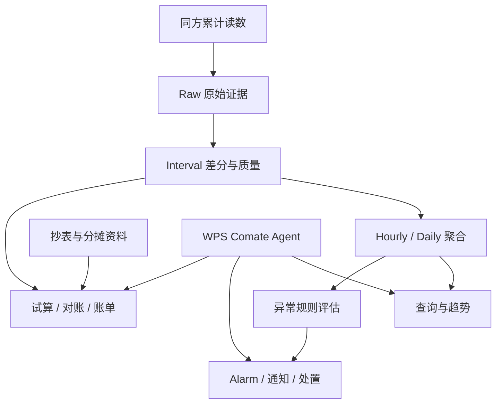
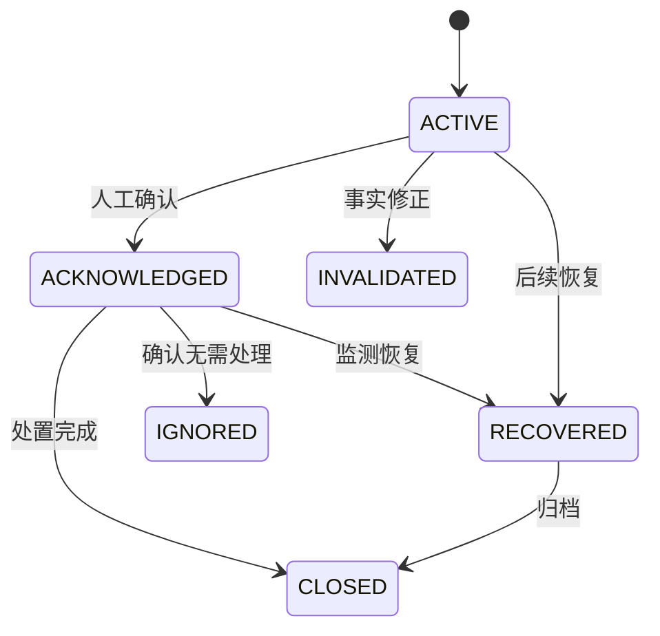

# EnergyOps 快速学习掌握与面试实战

> 目标：在较短时间内，把“看过但讲不出来”的项目知识压缩成可复述、可追问、可迁移的面试能力。

这是一份主手册，不是逐章百科。内容按四种证据口径书写：

- **项目事实**：现有材料、实现说明或测试产物已经明确；
- **回放/测试证据**：固定样本、测试或黄金数据验证过，但不扩大为长期线上结果；
- **Mock 口径**：为面试容量推演给出的合理估算，必须带上假设；
- **演进方案**：当前规模不一定需要，但达到明确条件后可以采用。

最快使用方法：先学第 1～9 节建立主干，再用第 13～14 节补设计和工程细节，用第 15～16 节进行半开卷题目迁移，最后用第 17 节完成一天突击。

## 0. 断点诊断

当前不是从零开始。你已经能讲清用户、业务痛点、主要输入输出和总体链路，说明**功能层主线基本存在**。真正的断点是：

1. 四层数据模型、质量状态、晚到重算等内容有印象，但不能主动恢复；
2. 能说“系统用了什么”，还不能稳定说清“为什么这样设计、为什么不选其他方案”；
3. 调度重叠、慢查询、外部状态未知、部分成功等工程问题缺少统一回答框架；
4. Agent、告警和结算是分散知识，尚未压成三个能够深讲的真实难题。

因此本轮不再逐模块重学，而是建立：

> 一条项目主线 + 三个真实难题 + 六张选型卡 + 六个故障闭环 + 三版项目表达。

---

## 1. 项目主线

### 1.1 一句话定位

> EnergyOps 面向园区行政、运维和财务人员，将同方平台的智能表累计读数转化为可信用能事实，在此基础上完成查询分析、异常告警、月度结算和年度看板，并通过 WPS Comate 中的 Agent 提供受控的自然语言操作入口。

### 1.2 业务痛点

同方平台主要提供智能表累计读数和基础统计，不能直接满足园区自己的设备归属、数据质量、异常处置和费用分摊需求。月末还需要人工抄表、匹配未入住名单、应用分摊规则并整理财务表，过程重复、容易出错，也难以复算。

EnergyOps 解决的不是“把数据展示出来”，而是建立三本可信业务账：

| 业务账 | 核心对象 | 回答的问题 |
|---|---|---|
| 用能账 | Raw、Interval、Hourly、Daily、质量状态 | 在什么时间、什么范围用了多少，结果是否完整 |
| 事件账 | Rule、Evaluation、Alarm、Notification、Action | 为什么告警、是否通知、谁处理、是否恢复 |
| 结算账 | 抄表快照、归属、分摊规则、SettlementBatch | 费用属于谁、怎样计算、能否复算和对账 |

Agent 是三本账的统一操作入口，不是新的事实源。

### 1.3 完整链路



### 1.4 系统边界

- 同方平台负责设备接入和累计读数来源；EnergyOps 不替代底层采集平台。
- 确定性程序负责用量、质量、告警状态和结算金额；模型不能自行计算业务事实。
- Agent 负责理解意图、澄清参数和编排工具；权限、状态机、幂等、确认和审计由后端完成。
- 查询可以显示带质量标签的部分事实；财务结算不能把未知部分当成零。

---

## 2. 三版项目表达

### 2.1 20 秒版本

> EnergyOps 是园区能耗智能运营平台。系统接入智能水电表累计读数，通过 Raw、Interval、Hourly、Daily 四层模型生成带质量和覆盖率的可信用能数据，再用于查询、异常告警和月度结算。Agent 接入 WPS Comate，通过受控工具让行政和运维人员用自然语言完成业务操作。

### 2.2 90 秒版本

> 原来的能耗数据主要在同方平台中，提供的是智能表累计读数和基础统计，园区缺少自己的实时查询、异常处置和费用分摊能力，月末还要人工抄表和整理账单。我的工作是把这些数据转成可查询、可处置、可结算的业务事实。
>
> 数据链路先保留 Raw 原始证据，再对相邻累计读数做差分，结合倍率和七类质量状态形成 Interval。可信区间进入 Hourly 和 Daily 聚合，同时记录覆盖率和 partial，避免把缺失数据当成零。聚合结果用于趋势查询和异常规则评估，异常再进入 Alarm、通知和人工处置闭环。月末则以权威抄表、设备归属、未入住名单和分摊规则形成输入快照，通过完整性、守恒和人工确认后生成账单与年度看板。
>
> 在此基础上，我们将能力封装为约 25 个 MCP 工具和 6 类业务闭环，接入 WPS Comate。Agent 只负责理解、澄清和编排，高风险写操作通过 R0/R1/R2 分级、影响预览、二次确认、幂等和审计进行控制。

### 2.3 5 分钟版本骨架

1. 背景：累计读数不能直接等于区间用量，月末结算依赖大量人工资料；
2. 数据：Raw 保留证据，Interval 差分并分类，Hourly/Daily 聚合并传播质量；
3. 运营：数据充分性判断、异常评估、Alarm、Notification、人工处置；
4. 财务：权威抄表、规则快照、试算、质量门、财务版导出；
5. Agent：意图澄清、能力路由、风险分级、Tool、Workflow、审计；
6. 工程：晚到重算、任务幂等、停机补偿、Outbox、慢查询治理；
7. 取舍：当前规模使用 PostgreSQL + APScheduler，达到升级条件才引入消息队列和流处理。

---

## 3. 主战难题：累计读数如何变成可信用能事实

### 3.1 第一性原理

业务真正需要的是“某段时间用了多少”，累计读数只说明某一时刻表走到了哪里：

```text
区间用量 = (当前累计读数 - 上一累计读数) × 有效倍率
```

这个公式只有在设备一致、时间有序、读数没有重置、倍率边界明确且增量合理时才可信。因此差分和质量判断必须是同一个业务动作。

### 3.2 四层数据模型

| 层 | 粒度 | 职责 | 为什么不能省 |
|---|---|---|---|
| Raw | 设备某时刻的一条累计读数 | 保存来源、接收时间、原值和修正版本 | 没有原始证据就无法审计和重算 |
| Interval | 两个相邻读数之间 | 差分、倍率、质量状态和来源版本 | 直接查 Raw 临时差分会重复实现质量逻辑 |
| Hourly | 设备每小时 | 查询、小时规则、覆盖率和 partial | 直接扫描 Interval 查询成本高，长区间分布也不一定精确 |
| Daily | 设备每天 | 日趋势、同比和年度汇总 | 降低长时间范围聚合成本 |

设计代价是写放大、存储增加、晚到数据需要级联重算。但它换来统一口径、快速查询、可重算和可追溯，适合持续运营系统。

### 3.3 七类质量状态

| 状态 | 含义 | 下游处理 |
|---|---|---|
| `normal` | 时间、差分、倍率正常 | 进入可信聚合 |
| `no_change` | 差分为 0 | 作为有效零用量进入；连续不变另做冻结检测 |
| `long_gap` | 读数间隔超过阈值 | 保留总增量，但不伪造小时分布；父窗口标记 partial |
| `reset_or_negative` | 新读数小于旧读数 | 可能换表、清零或回退；阻断并核查 |
| `unit_changed` | 区间内倍率或单位边界不明 | 没有边界读数就不猜测，阻断 |
| `suspected_abnormal` | 正增量超出合理范围 | 先作为数据质量问题，不能直接制造高用量告警 |
| `invalid` | 字段、设备、格式或配置无效 | Raw 保留，阻断可信区间 |

首次读数没有前驱读数，不能单独形成 Interval。它作为该设备的基线保留，等下一条合法读数到达后再计算区间；如果能从权威历史源取得上一读数，则可以补齐边界后计算。

### 3.4 晚到数据

已有：

```text
10:00 1000
10:30 1040
```

后来收到：

```text
10:15 1012
```

正确处理：

1. 识别 10:15 是合法补数还是同业务键冲突；
2. 失效原 10:00—10:30 Interval；
3. 新建 10:00—10:15 和 10:15—10:30；
4. 重新执行质量分类；
5. 重算受影响的 Hourly、Daily 和异常评估；
6. 若倍率稳定，检查 `12 + 28 = 40` 的用量守恒；
7. 已产生的告警根据新事实进入保留、恢复或 `INVALIDATED`，不能静默删除。

只重算该设备和受影响窗口，不全量重跑历史。

### 3.5 倍率变化

倍率作用于对应时间段的差值，不是分别乘两个累计总量。如果切换点有权威边界读数，可以分段计算；如果只知道倍率在区间内变化，却不知道具体边界，就标记 `unit_changed` 并阻断，确认后再重算。

### 3.6 幂等、并发与恢复

- Raw 使用 `device_id + reading_timestamp + source` 作为业务唯一键；相同内容是重复，相同键不同值是冲突或修正。
- Aggregate 使用 `device_id + granularity + window_start` 作为窗口业务键，并加数据库唯一约束。
- Worker 先条件抢占任务，再在事务内计算和写入；重复执行得到同一结果，而不是重复累加。
- 服务启动后扫描最近窗口的缺口和 `RUNNING` 超时任务，补回停机期间未完成的窗口。
- Checkpoint 记录做到哪一步；幂等键保证同一业务动作只产生一次效果；唯一约束守住数据库最终边界，三者不能互相替代。

### 3.7 查询性能

查询先确定设备范围和数据粒度：近几小时使用 Hourly，需要分钟级证据再查 Interval/Raw；长期趋势优先 Daily。

索引一般遵循“等值列在前、范围列在后”：

```text
(device_id, energy_type, window_start)
```

慢查询排查顺序：

1. 用 Trace 分开数据库、应用处理、序列化和网络耗时；
2. 使用 `EXPLAIN ANALYZE` 检查扫描行数、索引、排序和聚合落盘；
3. 检查 JOIN 前后行数是否符合声明的数据粒度和基数；
4. 排查 N+1 和重复归属记录；
5. 先修 SQL、数据模型和索引，再决定是否缓存。

Redis 不能掩盖错误 SQL，否则首次查询、缓存失效和冷数据仍会很慢，并引入失效一致性问题。

---

## 4. 增强难题一：异常、告警和通知为什么要拆开

### 4.1 三个对象

| 对象 | 回答的问题 |
|---|---|
| Evaluation | 指定规则版本在指定窗口上是否命中，数据是否足以判断 |
| Alarm | 是否形成一个需要人工处理的业务事件，目前是什么状态 |
| Notification | 通过什么渠道向谁发送，外部系统的执行状态是什么 |

拆开后可以做到：同一个 Alarm 多次评估但不重复建事件；一次 Alarm 可以有多次或多渠道通知；通知失败不改变异常事实；晚到数据修正后可以作废评估或告警并保留审计。

### 4.2 Partial 的风险分级

- 查询：可以展示已知值，但必须显示覆盖率和 partial；
- 高阈值告警：如果已知下界已经超过阈值，可以告警并标注证据不完整；依赖完整分布或同比的规则应返回 UNKNOWN；
- 月度结算：必须失败关闭，未知部分不能按零计费。

风险越高，完整性要求越严格。

### 4.3 Outbox 与外部状态未知

创建 Alarm 和 Notification Outbox 放在同一数据库事务中，保证“有告警必有待通知任务”。Worker 提交事务后再调用短信服务。

若短信已发送、本地落成功前宕机，状态是 `RESULT_UNKNOWN`。恢复时先使用供应商消息 ID 或业务幂等键查询权威状态：已发送则补记成功；未发送才重试；无法查询则进入人工核查或谨慎重试，不能盲目发送。

---

## 5. 增强难题二：月度结算如何做到可核验

### 5.1 为什么不能直接使用在线聚合

Hourly/Daily 主要用于监控和分析，可能存在 partial、晚到和归属修正。财务结算需要权威抄表、实际入住情况、设备归属、价格和分摊规则，并冻结输入版本。两套数据责任不同：在线聚合用于交叉核验，权威月度资料决定正式账单。

### 5.2 输入与流程

```text
抄表数据 + 设备/主体映射 + 未入住名单 + 单价 + 分摊规则
→ 规范化与分类
→ 直连费用和公共费用计算
→ 尾差分配
→ 试算
→ 黄金数据对账
→ 说明版 / 财务分发版
```

### 5.3 三道质量门

1. **事实源门**：月份、来源、主体、抄表和名单是否权威完整；
2. **预演门**：是否存在重复、未映射、不可解析、口径外或守恒不成立；
3. **责任门**：行政/财务是否确认规则版本和试算结果，才允许正式分发。

### 5.4 对账差异分类

出现差异时不直接修改结果，而是按以下顺序分类：

1. 输入缺失或重复；
2. 设备与主体映射错误；
3. 月份、入住状态或统计范围不同；
4. 分摊规则或人数口径不同；
5. 单价和精度规则不同；
6. 尾差分配；
7. 展示明细是否计入合计。

金额使用 Decimal，统一舍入时点。0.01 元尾差按固定、可解释的规则分给指定主体或最大金额项，并保存调整记录，不能随机消失。

---

## 6. 增强难题三：Agent 如何安全操作真实系统

### 6.1 职责边界

> Agent 负责理解、澄清和编排；Tool 负责权限、业务规则、状态机、幂等和审计。

不能向模型暴露万能 `execute_sql`。工具应表达确定业务动作，例如查询用量、预演规则、更新规则、确认告警和导出账单。

### 6.2 Tool、Bundle 与 Workflow

- Tool：一个边界明确、可校验的业务能力；
- Bundle：同一业务域的一组工具目录；
- Workflow：根据用户目标按顺序组合多个工具。

约 25 个工具不需要逐个背，记住 6 类闭环：健康检查、能耗查询导出、设备维护、异常规则、告警处置、普通抄表/结算。

### 6.3 风险分级

- R0：只读查询、预览和健康检查；
- R1：影响范围小、可恢复的单对象操作；
- R2：批量修改、规则生效、通知或财务正式动作，需要影响预览和二次确认。

确认令牌必须绑定：用户、租户、目标 ID 集合、参数摘要、资源版本、风险等级和有效期。确认后不能重新查询并扩大操作范围。

### 6.4 组合操作示例

用户说：“把 T6 高用电阈值改成 120，然后关闭今天所有 T6 告警。”

正确流程：

1. R0 查询规则、版本和活动告警精确 ID；
2. 展示阈值变化、告警数量和目标 ID；
3. R2 确认完整计划；
4. 使用 `expected_version` 和幂等键更新规则；
5. 条件更新确认时展示的告警 ID；
6. 返回每一步结果和审计记录。

两个独立 Tool 顺序调用无法天然保证原子性。同一数据库且业务要求全成全败时，后端应提供边界明确的组合命令，在一个事务中完成规则版本、Alarm 条件更新、审计和 Outbox。跨库只能使用 Saga；补偿也失败时进入人工修复，不能简单标记失败结束。

---

## 7. 六张架构选型卡

### 7.1 四层数据模型 vs 查询时临时计算

- 当前选择：Raw/Interval/Hourly/Daily；
- 原因：统一质量口径、查询快、支持晚到重算和审计；
- 代价：写放大、存储和级联重算；
- 小规模替代：只存 Raw，查询时差分；
- 升级条件：数据量和实时性显著提高后，引入增量流式聚合，但仍保留事实与版本边界。

### 7.2 APScheduler vs Celery/Kafka/Flink

- 当前选择：APScheduler + PostgreSQL 任务状态；
- 原因：园区表计规模有限、分钟级采集和小时级聚合，不需要毫秒级流处理；
- 代价：多实例协调和任务积压需要自行治理；
- 升级条件：表计达到万级、分钟写入持续高峰、补数大量堆积、单机无法在窗口内完成，再引入队列或流处理。

### 7.3 数据库唯一约束 vs 只用分布式锁

- 当前选择：业务唯一键 + 条件更新 + 事务，锁只做减少竞争；
- 原因：锁可能过期、网络分区或进程崩溃，数据库约束才是最终正确性边界；
- 代价：需要处理唯一键冲突和版本冲突；
- 升级条件：跨分区或跨库后引入分片幂等键和消息去重，仍不能放弃落库约束。

### 7.4 Outbox vs 事务中直接发短信

- 当前选择：业务事务写 Outbox，提交后异步发送；
- 原因：外部网络调用不能参与数据库原子事务；
- 代价：最终一致、需要 Worker、重试和状态查询；
- 替代优势：直接调用实现简单，但会导致事务长时间占锁和“短信成功、事务失败”等不一致。

### 7.5 业务 Tool vs 万能 SQL Tool

- 当前选择：小粒度、业务语义明确的工具；
- 原因：可做权限、参数、状态机、影响预览、幂等和审计；
- 代价：工具数量更多，需要版本治理；
- 适用替代：隔离环境中的只读探索可以提供受限查询，但不能成为生产写入口。

### 7.6 权威快照结算 vs 实时数据直接结算

- 当前选择：抄表和规则输入快照；
- 原因：财务结果需要冻结、复算和责任确认；
- 代价：需要导入、映射、人工确认；
- 升级条件：当设备质量和自动对账长期稳定后，可以提高自动化比例，但正式发布仍需要版本和审计。

---

## 8. 六个线上故障闭环

统一回答模板：

> 发现 → 止血 → 定位 → 修复 → 验证 → 预防。

### 8.1 T6 日用量突然翻倍并产生告警风暴

- 发现：用量同比突变、告警量激增、Interval 质量分布异常；
- 止血：暂停该设备新通知或将规则降为只记录，不能删除证据；
- 定位：核对 Raw 相邻读数、重复键、倍率版本、Interval 来源和聚合版本；检查任务是否重复累加；
- 修复：修正冲突读数/倍率或聚合逻辑，失效受影响窗口并定向重算；
- 验证：检查区间守恒、Hourly/Daily 一致、告警重新评估结果；
- 预防：业务唯一键、倍率有效期、增量合理性检测、告警突增监控和黄金回放用例。

### 8.2 两个 Worker 同时聚合同一小时

- 发现：同一窗口有重复版本、金额翻倍或唯一键冲突；
- 止血：暂停重复实例或关闭该窗口重试；
- 定位：检查任务租约、窗口业务键、写入是覆盖还是累加；
- 修复：条件抢占任务，事务内按来源重新计算并 UPSERT，禁止在旧总量上重复加；
- 验证：并发执行多次最终只有一个逻辑结果；
- 预防：唯一约束、版本号、租约 fencing 和并发测试。

### 8.3 30 天趋势查询由毫秒级变成数秒

- 发现：API P95 和数据库慢查询同时升高；
- 止血：限制超大时间范围、暂时使用 Daily 或异步导出；
- 定位：Trace 拆耗时，`EXPLAIN ANALYZE` 检查扫描量、排序、JOIN 行数和临时文件；
- 修复：选择正确粒度、补联合索引、预先缩小设备范围、消除 N+1 和重复归属；
- 验证：固定查询集在相同数据量和并发下对比 P50/P95；
- 预防：查询预算、慢 SQL 告警、索引回归和数据粒度契约。

### 8.4 短信已发送但本地仍 pending

- 发现：Outbox 长时间 pending，但供应商可能已有消息记录；
- 止血：停止盲目重发；
- 定位：用供应商消息 ID/业务幂等键查询外部权威状态；
- 修复：已发送则补记成功，未发送才重试，未知则人工核查；
- 验证：同一业务通知效果只有一次；
- 预防：幂等键、状态查询、重试上限、死信和 pending 年龄监控。

### 8.5 月度账单与财务 Excel 不一致

- 发现：总额、主体小计或逐单元格黄金对账失败；
- 止血：阻止正式分发，保留试算版本；
- 定位：依次检查输入、映射、范围、规则、精度和是否计入合计；
- 修复：修正输入快照或规则版本，重新试算，禁止手工直接改最终金额；
- 验证：主体守恒、总额守恒、逐行/逐单元格差异为 0；
- 预防：三道质量门、黄金数据回归、规则版本和差异分类报告。

### 8.6 Agent 修改规则成功但关闭告警失败

- 发现：Workflow 返回部分成功，规则版本已变化但 Alarm 未更新；
- 止血：禁止从头盲目重试，锁定本次计划和目标 ID；
- 定位：读取每个 Step 的权威业务状态，而不是只看 Checkpoint；
- 修复：同库强原子需求改为组合事务命令；跨库从失败步骤续跑或执行补偿；
- 验证：重复请求不会产生第二次副作用，最终状态与审计一致；
- 预防：步骤幂等键、期望版本、部分成功状态、补偿策略和人工修复队列。

---

## 9. 可记忆的容量估算口径

### 9.0 已确认的项目证据

这些属于现有项目材料中的真实实现或测试结果，可以与后面的容量估算区分表达：

| 证据 | 已确认口径 |
|---|---|
| Agent 能力 | 约 25 个 MCP 工具，组织为 6 类业务闭环 |
| 后端验证 | 92 个单元测试、30 个回归测试通过 |
| 月度数据输入 | 识别 8 个抄表 Sheet、1112 条记录、16 个财务板块 |
| 电费规则 | 66 条规则逐行核对一致 |
| 账单验证 | 黄金对账 `row_diff = 0`，并进行了逐单元格导出比较 |
| 金额精度 | 尾差控制到 0.01 元并保留调整依据 |

面试中不要把“测试通过”扩大成“长期线上可用率”，也不要把单月黄金对账扩大成所有月份都零差异。

以下不是长期生产监控结果，而是用于架构讨论和面试追问的 **Mock 容量估算**。记忆时必须同时记住假设。

### 9.1 假设

- 项目设备盘点口径约 604 台水电表；
- 默认每 15 分钟采集一次，每天约 `604 × 96 ≈ 5.8 万` 条 Raw；
- 5 分钟是可配置的容量上界，每天约 `604 × 288 ≈ 17.4 万` 条、每月约 520 万条 Raw；
- 默认 15 分钟口径每年约 2117 万条 Raw；
- 内部用户同时在线约 20 人，业务接口峰值约 30 QPS；
- 单实例 FastAPI 采用 2C4G，PostgreSQL 独立部署；
- 不是互联网高并发，主要压力来自墙钟任务集中、批量聚合和历史查询。

### 9.2 建议记忆值

| 指标 | 建议值 | 合理范围 |
|---|---:|---:|
| 单次采集批次 | 604 条 | 300～800 条 |
| 采集批次入库耗时 | 3 秒 | 1～8 秒 |
| 30 天 Hourly 趋势 P95 | 600 ms | 300～900 ms |
| Summary 查询 P95 | 250 ms | 150～500 ms |
| Agent R0 查询端到端 P95 | 4 秒 | 2.5～6 秒 |
| 小时聚合批次 | 45 秒 | 20～90 秒 |
| 日聚合批次 | 90 秒 | 45～180 秒 |
| 停机 3 小时补偿 | 8 分钟内 | 5～15 分钟 |
| 调度任务成功率 | 99.5% | 99.0%～99.8% |
| 补采后数据完整率 | 98.5% | 97%～99.5% |
| 内部 API 峰值 | 30 QPS | 10～50 QPS |

安全表达：

> 项目当时没有接入完整的长期 APM，这些不是线上统计结论，而是按约 604 台表、默认 15 分钟采集和内部并发场景形成的容量估算；5 分钟口径用于压力上界。核心目标是采集和小时聚合必须在下一个调度窗口前完成，常用查询 P95 目标不超过 3 秒，优化后的高频查询争取控制在 1 秒内；如果规模继续增长，我会通过固定查询集、并发压测和任务积压指标重新校准。

### 9.3 最重要的监控指标

1. 采集成功率、第三方延迟和连续失败次数；
2. 每种质量状态占比、数据覆盖率和 partial 窗口数；
3. 任务延迟、运行耗时、积压窗口数和租约超时；
4. 查询 P50/P95/P99、扫描行数和慢 SQL；
5. 告警创建量、通知成功率、pending 年龄和重复率；
6. 结算阻断项、未映射数、守恒差异和黄金对账结果；
7. Agent 工具成功率、风险拦截率、部分成功率和最终任务成功率。

---

## 10. 最高频面试题与短答

### Q1：项目最难的三个问题是什么？

> 第一是把脏累计读数转成可信区间；第二是让晚到、并发和停机后的聚合仍可恢复；第三是让 Agent 能够操作真实业务，又不越权、不重复产生副作用。

### Q2：为什么不直接使用同方平台？

> 同方解决设备接入和累计读数来源，园区仍需要自己的设备归属、质量状态、告警处置和分摊口径。如果第三方已经完整覆盖这些能力，就应优先复用，而不是重复建设。

### Q3：为什么要四层模型？

> 因为原始证据、区间事实和查询聚合承担不同责任。分层会增加写入和重算成本，但能统一质量口径、加速查询，并让晚到修正可追溯。

### Q4：`no_change` 为什么可以进入聚合？

> 单个零增量可能是真实没有使用，删除会把有效零变成缺失。连续不变才交给冻结检测判断设备异常。

### Q5：`long_gap` 为什么不能平均分摊？

> 长间隔只知道总增量，不知道用量发生在哪个小时。平均分配会制造不存在的小时事实，因此保留区间证据并把小时窗口标成 partial。

### Q6：为什么不用 Kafka/Flink？

> 当前是数百台表、分钟级采集和小时级聚合，PostgreSQL 加 APScheduler 能在窗口内完成，维护成本更低。达到万级表计、持续高峰或单机无法及时消化补数时才值得升级。

### Q7：数据库唯一约束和幂等键有什么区别？

> 幂等键识别同一业务请求，唯一约束守住最终落库边界；前者是业务语义，后者是数据库最后防线。

### Q8：为什么告警和通知要拆开？

> 告警是业务事件，通知是外部交付。拆开后通知失败不会改变异常事实，也能支持多渠道、重试、状态查询和审计。

### Q9：Agent 为什么不能直接操作数据库？

> 直接操作数据库难以稳定执行权限、状态机、参数校验、确认、幂等和审计，模型还可能把错误结果包装成可信结论。

### Q10：Checkpoint 为什么不能防止重复副作用？

> Checkpoint 只表示本地执行到哪一步，不能证明外部短信或业务操作是否成功。恢复时必须查询业务权威状态，并结合业务幂等键决定是否继续。

### Q11：为什么账单不用实时聚合直接算？

> 实时聚合允许 partial 和后续修正，财务结算要求权威输入、规则冻结、金额守恒和责任确认，因此使用月度快照，聚合只做核验。

### Q12：接口返回 200 为什么仍可能是错的？

> 可能使用旧缓存、错误归属、隐藏 partial、重复 JOIN、通知状态未知或错误规则版本。验收必须检查业务不变量和最终产物，不能只看技术状态码。

---

## 11. 最短恢复脚本

### 项目主线

> 累计读数 → 质量区间 → 分层聚合 → 查询告警 → 月度结算 → 受控 Agent → 恢复审计。

### 可信数据

> Raw 证据、相邻差分、倍率、七类质量、覆盖率、晚到重算、守恒。

### 工程可靠性

> 业务键、唯一约束、事务、条件抢占、Checkpoint、权威状态、Outbox。

### 架构选型

> 目标、规模、约束、候选、选择、代价、验证、升级条件。

### 故障排查

> 发现、止血、证据、根因、修复、回放、预防。

---

## 12. 一天学习与后续复习

### 今天

1. 通读第 1～2 节，复述一次 90 秒项目介绍；
2. 精读第 3 节，能够用 3～5 分钟讲可信数据链路；
3. 阅读第 4～6 节，理解告警、结算和 Agent 三条边界；
4. 朗读六张选型卡和六个故障案例，不要求第一次闭卷；
5. 最后随机回答第 10 节十二题，只记录三个最严重断点。

### 第 1、3、7 天

- 第 1 天：只看恢复脚本，复述 90 秒主线；
- 第 3 天：随机讲一个设计取舍和一个故障；
- 第 7 天：进行一次完整项目模拟面试；
- 每次真实面试后：只补本次暴露的三个断点，不重新通读全部材料。

### 12.1 学习定位判断

EnergyOps 的真实工程价值不在“海量互联网流量”，而在：

- 上游累计读数不可靠，却要形成可追溯事实；
- 定时任务、晚到数据和重算必须保持一致；
- 告警通知涉及外部副作用和状态未知；
- 月度账单涉及权威输入、守恒和责任边界；
- Agent 必须在真实业务系统上受控执行。

面试时围绕这些真实约束讲决策链，比堆叠框架名或虚构高并发更有说服力。

---

## 13. 完整知识底座：对象、状态、时序和不变量

这一节解决“知道流程，但追问到表、状态、边界就散掉”的问题。不要背所有字段，重点记住每个对象的权威事实、业务键和失败语义。

### 13.1 技术栈与职责边界

| 层次 | 项目材料中的主要技术 | 负责什么 | 不负责什么 |
|---|---|---|---|
| 接入/API | Python、FastAPI、Pydantic v2 | 参数契约、接口、Tool 入口 | 不替代数据库约束 |
| 业务/ORM | SQLAlchemy | 领域服务、事务、版本和状态机 | 不让 ORM 隐藏查询粒度 |
| 数据 | PostgreSQL、Alembic | 权威业务状态、唯一约束、聚合和审计 | 不参与外部短信原子事务 |
| 缓存 | Redis | 热点结果、短期状态和削峰 | 不作为任务或账单权威事实 |
| 调度 | APScheduler | 当前规模下的采集、聚合和规则任务 | 不天然保证多实例只执行一次 |
| 文件 | MinIO/对象存储 | 导出、结算表和大结果 Artifact | 不把文件句柄当成结果已可用 |
| Agent | WPS Comate、MCP Tool、Hook | 意图理解、澄清、能力路由和编排 | 不直接算用量、金额或绕过权限 |
| 交付 | Vue、SSE、Docker、Nginx | 页面、任务进度、部署入口 | SSE 断线不代表任务失败 |
| 验证 | pytest、固定数据、黄金对账 | 规则、并发、回归和结果证据 | 测试通过不等于长期线上 SLA |

架构主张：PostgreSQL 是三本业务账和任务状态的权威事实；Redis、内存和模型上下文都只是加速或交互层。

### 13.2 核心领域对象

| 对象 | 关键输入 | 权威输出/状态 | 业务键或版本 |
|---|---|---|---|
| `Meter` | 设备、能源类型、单位 | 当前档案 | `meter_id` |
| `MeterConfigVersion` | 倍率、单位、生效时间 | 指定时刻有效配置 | `meter_id + valid_from` |
| `OwnershipVersion` | 楼栋、部门、费用主体、生效时间 | 历史归属 | `meter_id + valid_from` |
| `RawReading` | 来源、设备、事件时间、累计值 | 不可覆盖证据、校验/冲突版本 | `device + event_time + source` |
| `UsageInterval` | 相邻 Raw、配置版本 | 区间用量、质量、原因 | 起止 Raw 版本 |
| `UsageAggregate` | Interval 集合、窗口 | usage、coverage、partial、source_version | `device + grain + window_start` |
| `AggregationTask` | 窗口、原因、优先级 | pending/running/succeeded/failed | `device + grain + window_start + calc_version` |
| `AnomalyRuleVersion` | 范围、窗口、操作符、阈值 | 草稿/启用/停用、回放结果 | `rule_id + version` |
| `Evaluation` | 规则版本、事实版本、窗口 | hit/not_hit/unknown、证据 | `rule_version + target + window` |
| `Alarm` | 命中的 Evaluation | 活动事件和状态机 | `dedup_key`/告警指纹 |
| `NotificationOutbox` | Alarm、渠道、收件人 | 待发、已发、失败、未知 | 业务幂等键/供应商消息 ID |
| `SettlementBatch` | 月份、输入快照、规则版本 | 试算、确认、发布 | `month + input_hash + rule_version` |
| `SettlementLine` | 主体、用量、单价、分摊 | 金额、调整和解释 | `batch + subject + charge_type` |
| `AgentTask` | 用户目标、可信身份、确认范围 | Step、Tool、Artifact、最终状态 | `task_id`/业务幂等键 |
| `Artifact` | 大查询或导出结果 | URI、Hash、大小、状态 | `artifact_id + content_hash` |

### 13.3 四类状态机

#### 告警状态



- `ACKNOWLEDGED`：有人看到了，不代表异常消失；
- `RECOVERED`：后续可信窗口满足恢复条件；
- `INVALIDATED`：晚到/修正数据证明原告警依据不成立；
- `IGNORED`：依据仍成立，但业务确认无需处置；
- `CLOSED`：处置或归档完成，不能和恢复混为一谈。

#### 聚合任务状态

```text
PENDING → RUNNING → SUCCEEDED
                   ↘ FAILED_RETRYABLE → PENDING
                   ↘ FAILED_FINAL / MANUAL_REPAIR
```

`RUNNING` 必须带 `worker_id`、租约到期时间和 `lease_version`。旧 Worker 即使恢复，也必须因 fencing 版本过期而失去写入资格。

#### 结算批次状态

```text
DRAFT → CALCULATED → CONFIRMED → PUBLISHED
          ↘ BLOCKED/FAILED
```

正式发布后不得原地覆盖；规则或输入修正应创建新版本或冲正批次，保留旧版审计。

#### Agent/Workflow 状态

```text
PENDING → RUNNING → WAITING_CONFIRMATION → RUNNING
                         ↘ CANCELLED
RUNNING → COMPLETED / PARTIAL_SUCCESS / RESULT_UNKNOWN / MANUAL_REPAIR / FAILED
```

`PARTIAL_SUCCESS` 表示真实副作用已部分发生；`RESULT_UNKNOWN` 表示外部结果尚未确认；两者都不能被普通 `FAILED` 吞掉。

### 13.4 八条业务不变量

面试追问“怎么证明正确”时，优先回答不变量，而不是“接口返回成功”。

1. **Raw 不可静默覆盖**：修正必须有版本、来源和操作者；
2. **相邻区间唯一**：同一组起止 Raw 版本只对应一个当前有效 Interval；
3. **稳定倍率下用量守恒**：补数前后的总区间用量一致；
4. **聚合不伪造完整性**：缺失或长间隔必须传播 coverage/partial/reason；
5. **聚合重跑不重复累加**：相同输入版本重复执行收敛到同一结果；
6. **告警事实与通知交付分离**：通知失败不能删除或改变异常事实；
7. **结算守恒且可复算**：来源总量、分配总量、尾差和每行原因可解释；
8. **高风险操作不扩大范围**：执行目标必须等于用户确认时展示的对象、参数和版本。

### 13.5 时间语义：事件时间、接收时间和处理时间

- **事件时间**：表计实际读数时刻，决定相邻关系、Interval 和业务窗口；
- **接收时间**：EnergyOps 收到数据的时刻，用于判断延迟、补数和源端问题；
- **处理时间**：Worker 计算的时刻，用于任务观测，不能代替事件时间。

晚到数据的核心不是“消息晚了”，而是事件时间插入了已有相邻关系，改变了过去事实，因此必须建立影响范围并定向重算。

### 13.6 调度与依赖

项目材料中的采集周期可配置为 5/15/30/60 分钟，默认按 15 分钟理解；小时和日任务通过错峰减少上游未完成概率。可记忆的调度口径：

| 任务 | 建议/材料口径 | 必须防的工程问题 |
|---|---|---|
| 读数采集 | 默认 15 分钟；容量上界按 5 分钟 | 重复批次、第三方超时、部分页成功 |
| Hourly 聚合 | 小时结束后约 10 分钟 | 采集晚到、两个实例重复执行 |
| Daily 聚合 | 次日 00:20/00:40 分阶段 | 跨日时区、Hourly 未完成 |
| 异常评估 | Hourly 后、Daily 后 | 不能只靠相同 cron 时间假定顺序 |
| 启动回补 | 最近有限窗口，当前口径七天 | 与实时任务抢资源、告警重复触发 |

如果 Hourly 聚合和异常评估都在 `:10`，设计上不能相信调度器注册顺序。应让评估依赖聚合版本/完成事件，或者在评估前检查目标窗口状态；未完成返回 `DATA_NOT_READY` 并延迟重试。

### 13.7 查询契约

每个查询结果至少返回：

```text
scope              设备/楼栋/主体范围
time_range         事件时间范围与时区
grain              interval/hour/day/month
usage              已知可信用量
coverage           覆盖率
quality_summary    质量状态分布和缺口
data_version       聚合/归属版本
updated_at         数据更新时间
```

查询的正确性顺序是：范围正确 → 粒度正确 → 事实版本正确 → 质量透明 → 性能达标。先快后准是错误优化。

### 13.8 Partial 决策矩阵

| 使用场景 | partial 能否继续 | 处理方式 |
|---|---|---|
| 页面/查询 | 可以 | 返回已知值、覆盖率和缺口，禁止冒充完整总量 |
| 高阈值告警 | 条件允许 | 已知下界已超阈值可触发，并标注证据不完整 |
| 低阈值/同比/趋势 | 通常不可以 | 关键分母或分布不完整时返回 `UNKNOWN` |
| 月度试算 | 只可生成待核查结果 | 列出阻断项，不生成正式版 |
| 正式结算 | 不可以 | 失败关闭，必须补齐或由权威资料裁决 |
| Agent 摘要 | 可以解释 | 不允许模型把未知补成确定结论 |

### 13.9 月度结算的具体证据卡

以下是已有材料/固定测试中的项目证据，不应扩大为每月线上结果：

- 识别 8 个抄表 Sheet、1112 条记录和 16 个财务板块；
- 66 条电费规则完成逐行一致性核对；
- 黄金对账达到 `row_diff = 0`，并进行了财务 Excel 单元格级比较；
- 金额使用 Decimal，尾差控制到 0.01 元并保存调整依据；
- 公寓 2-11 的物理用量为 2，账单因业务调整计为 26，`+24` 必须作为显式调整保留；
- 2-8/2-10 的未入住记录需要去重，不能重复扣减或分摊；
- 充电桩行 151 的 2785 kWh 进入指定口径，行 153 的 1314.72 只保留明细、不计入对应合计；
- `unmapped` 不能只报一个总数：材料中 504 条进一步分成 11 条真正未解决、127 条层级映射问题和 366 条财务范围外记录；
- 月度结算专项固定测试为 33 个；它与后端 92 个单元测试、30 个回归测试是不同测试集合，面试时不要相加冒充覆盖率。

这张卡的价值不是背数字，而是证明你知道“对账差异必须分类，调整必须显式，明细是否计入合计也是业务规则”。

### 13.10 安全与上线前硬门禁

项目材料/审计中暴露过四类高风险点，适合作为诚实的工程改进回答：

1. API 若缺少完整认证授权，Agent 接入会放大攻击面；首轮应只开放 R0 只读能力；
2. 业务异常若被捕获后仍返回 200，会制造“技术成功、业务失败”；应统一错误码与任务状态；
3. 相同时间戳不同值若一律当重复，会丢掉合法修正；应区分重复、冲突和修正版本；
4. 通知 pending 积压若重启后无脑重发，会造成重复短信；必须查供应商权威状态并设置死信/人工核查。

上线顺序建议：鉴权与审计 → R0 查询 → R1 可撤销操作 → R2 小范围灰度 → 批量和财务动作。这里体现“不过度设计”：先守住高风险边界，再增加复杂能力。

---

## 14. 设计层与工程层：完整决策链

面试官问“为什么这么设计”时，固定使用：

> 业务目标 → 事实与约束 → 候选方案 → 当前选择 → 代价 → 验证 → 升级条件。

### 14.1 十二个关键选型

| 决策 | 当前选择 | 最强替代方案及优势 | 为什么当前更合适 | 代价/升级条件 |
|---|---|---|---|---|
| 原始数据 | Raw 追加与修正版本 | 覆盖错误值更简单 | 告警和结算必须可追溯、可重算 | 存储增加；需版本查询 |
| 区间用量 | 持久化 Interval | 查询时相邻差分，写入少 | 质量逻辑只实现一次，支持补数重建 | 写放大；口径变化需重算 |
| 查询聚合 | Hourly/Daily 物化 | 每次扫描 Interval 更灵活 | 高频趋势稳定、可携带 coverage | 增加存储；需要失效机制 |
| 数据库 | PostgreSQL | 时序库/OLAP 对大规模聚合更强 | 数百设备、关系归属、事务和结算更重要 | 到万级表、长周期分析瓶颈再引入时序/OLAP |
| 调度 | APScheduler + DB 任务表 | Celery/队列提供分布式消费 | 当前任务量可控、维护成本低 | 多实例协调自建；积压持续超窗口再升级 |
| 并发正确性 | 唯一键+事务+条件更新 | Redis 锁实现直观 | 数据库是最终落点，能防锁过期和进程崩溃 | 跨资源临界区才补分布式锁 |
| 晚到处理 | 定向重算影响窗口 | 全量重算最简单可靠 | 减少资源竞争和下游重复动作 | 维护影响范围；全局口径变更时做受控全量回放 |
| 缓存 | 先修 SQL，必要时 Cache Aside/版本键 | 全面缓存见效快 | 避免用缓存掩盖范围、JOIN 和索引错误 | 要做失效；高读低写热点才值得引入 |
| 通知一致性 | Transactional Outbox | 事务内同步发短信编码简单 | 外部服务不能加入本地 ACID，Outbox 可恢复 | 最终一致；需 Worker、状态查询、死信 |
| Agent 工具 | 有业务语义的 Tool + Bundle | 万能 SQL/万能 Tool 开发快 | 能固化权限、状态机、确认、幂等和审计 | Tool 治理成本；只读沙箱探索可有限开放查询 |
| 长任务交付 | DB 状态 + SSE + Artifact | WebSocket 双向通信更强 | 主要是服务端进度推送，断线不影响任务 | 需要事件游标；强实时双向协作时再评估 WebSocket |
| 财务结算 | 输入快照 + 三道门 | 实时聚合直接结算自动化高 | 财务需要冻结、复算、守恒和责任确认 | 增加人工确认；数据长期稳定后提高自动化比例 |

### 14.2 规则方案 vs 自适应模型

最强的规则方案优点是确定、易解释、易审计；最强的自适应模型能发现未配置规则的新型异常。当前最稳妥的分工是：

- 明确业务底线用 threshold/range/day_over_day/trend 等显式规则；
- 自适应方法只生成候选和证据，不自动等同正式告警；
- 数据质量不足时返回不可判定，不把缺失当正常；
- 人工确认后的原因和处置可以进入案例库，模型建议不能直接沉淀为事实。

边际决策：在规则闭环、数据质量和告警状态机都未稳定前，不优先投入复杂异常模型。否则模型只会放大脏数据和无效通知。

### 14.3 MCP vs 普通 API

MCP 不会自动带来权限、幂等或事务。它的价值是把能力以模型可发现、结构化的工具契约暴露出来。真正的业务保证仍在后端服务：

```text
MCP Tool Schema：模型如何调用
业务 API/Service：权限、参数、状态机和事务
数据库约束：最终一致性边界
审计/Trace：谁在何时做了什么
```

面试标准回答：不是为了“用了 MCP”而重写业务系统，而是复用已有领域服务，在外层增加适合 Agent 的工具契约和治理 Hook。

### 14.4 Hook 为什么不能只写在 Prompt

Prompt 能提醒模型，但不能成为确定性安全边界，因为模型可能遗漏、误解或被提示注入影响。Hook/服务端必须确定性完成：

- 身份与租户由服务端上下文注入；
- Tool 参数做 Schema 与业务校验；
- 风险级别由服务端配置，不信任模型传入；
- R2 检查确认令牌、目标集合和 `expected_version`；
- After Tool 验证实际产物、记录 Evidence/Artifact/审计；
- 大结果 Offload，写入前 Onload 做路径白名单、Hash 和完整性检查。

### 14.5 不过度设计的判断法

每次引入新中间件前回答四个问题：

1. 当前哪条可量化约束已经被突破？
2. 现有数据库、批处理和限流能否解决？
3. 新组件解决的是正确性、容量还是团队协作问题？
4. 新组件引入后的观测、恢复和值班成本谁承担？

EnergyOps 的合理演进触发器：

| 现象 | 优先动作 | 满足什么条件再升级 |
|---|---|---|
| 单个慢查询 | 粒度、SQL、索引、JOIN | PostgreSQL 优化后仍无法满足固定查询集 |
| 调度偶发重叠 | 唯一键、条件抢占、错峰 | 多实例任务持续积压、单机不能在窗口内完成 |
| 补数偶发 | 定向重算 | 持续大量乱序、实时性要求变成秒级 |
| 通知峰值 | Outbox、限速、批量 | 单表轮询成为瓶颈再引入队列 |
| 大结果 | Artifact/异步导出 | 对象数和并发使单节点导出队列持续超 SLA |
| Agent 工具增多 | Bundle 路由和契约版本 | 跨团队/跨系统后再引入复杂能力注册中心 |

### 14.6 Mock 容量口径统一版

请直接记这一套，不再混用：

- 设备盘点口径：约 604 台水电表；
- 默认采集：15 分钟一次，约 `604 × 96 ≈ 5.8 万` Raw/天；
- 配置上界：5 分钟一次，约 `604 × 288 ≈ 17.4 万` Raw/天、约 520 万/月；
- 内部并发：约 20 个同时在线用户，业务峰值约 30 QPS；
- FastAPI 应用：Mock 为单实例 2C4G，PostgreSQL 独立部署；
- 常用统计：目标 P95 ≤ 3 秒；优化后的常用 Summary 可按 250～500ms、30 天趋势 300～900ms 进行压测讨论；
- R0 Agent 查询端到端：Mock P95 约 4 秒，合理范围 2.5～6 秒；
- 聚合任务成功率目标：99.5%；高风险确认覆盖率、正式结算守恒率目标 100%。

安全但不软弱的表达：

> 我们按约 604 台表设计，默认 15 分钟采集时每天约 5.8 万条，5 分钟配置上界约 17.4 万条。项目没有完整长期 APM，所以 P95 和 QPS 是容量设计与压测目标，不是我虚构的线上统计。我用固定查询集、相同数据量和并发对比执行计划与 P50/P95；真正上线后再用 APM 校准。

这比直接声称“扛过百万 QPS”更像工程人员：有规模、有推导、有验证方案，也知道证据边界。

---

## 15. 完整高频问题库

第 10 节是最短 12 题；本节从 Q13 继续，覆盖细节与一至三层追问。学习时只看问题和粗体关键词，卡住立即看答案，第二次能讲顺即可。

### 15.1 数据事实与质量

#### Q13：Raw 为什么不能直接更新错误值？

> 告警、聚合和账单都可能引用旧读数，直接覆盖会丢失“当时为什么算出这个结果”的证据。正确做法是保留原记录，新增修正版本、原因、操作者和生效关系，再重算影响范围。代价是版本查询更复杂，但这是可审计系统必须承担的成本。

#### Q14：相同设备、相同时间戳收到两条数据怎么办？

> 先按业务键判断：值和来源完全相同是幂等重复；同键不同值是冲突或修正，不能静默覆盖。需要比较来源可信级、接收顺序和修正标记，由确定性规则选出当前有效版本，并把旧版保留。

#### Q15：首次读数怎样计算用量？

> 单个累计读数没有前驱，不能形成区间用量，只能作为基线。下一条合法读数到达后再计算；如果可以从权威历史源取得上一读数，也必须先补齐边界和来源证据，不能默认从零开始。

#### Q16：`no_change` 和设备冻结有什么区别？

> 单个零差分可能是真实零用量，所以 `no_change` 是有效事实。设备冻结需要跨多个连续窗口、结合设备类型、正常营业时段和通信状态判断；不能把一个零值直接当故障，也不能把长时间冻结当正常零用量。

#### Q17：为什么 `suspected_abnormal` 不直接生成高用量告警？

> 它首先表示“读数本身可能不可信”，可能由倍率、重置、重复或源端错误造成。先通过 Raw、配置和相邻区间确认数据事实，确认真实后才让业务规则评估；否则一条坏数据会同时污染统计和告警。

#### Q18：长间隔有总增量，为什么仍是 partial？

> 起止累计值能证明整个长区间的总增量，却不能证明增量分布在哪些小时。日级总量可能作为带风险的已知事实，但小时级分布未知，不能平均摊成伪事实；因此父窗口必须携带 partial 和原因。

#### Q19：倍率应该怎样参与计算？

> 倍率属于时间有效配置，作用于它生效区间内的读数差。若倍率切换点有边界读数，分段计算；若只知道区间内发生过变化但没有边界，标记 `unit_changed` 并阻断，不能分别给两个累计总值乘倍率后相减。

#### Q20：晚到数据为什么要重评估告警？

> 它可能改变 Interval、覆盖率和聚合值，原规则证据就不再是当前事实。重算后原告警可能继续有效、后续恢复，或因原依据不存在而 `INVALIDATED`；无论哪种都保留历史，不静默删除。

### 15.2 聚合、调度和恢复

#### Q21：覆盖率怎样计算？

> 理论覆盖来自该设备在窗口内有效的采样配置，不能固定假设每小时四条。实际覆盖按可信区间覆盖的时间或期望片段计算，同时返回缺失数和质量原因；如果配置中途变化，要按时间分段计算理论期望。

#### Q22：调度延迟十分钟为什么不能保证完整？

> 延迟只能降低普通晚到概率，不能覆盖长时间网络故障、第三方补写和人工修正。系统仍需要 watermark/cutoff、partial、补数触发和定向重算；把 cron 延迟当完整性保证只是经验假设。

#### Q23：任务唯一键应该怎样设计？

> 聚合任务至少包含设备、粒度、窗口起点和计算版本；规则评估还要包含规则版本和目标。唯一键解决“同一逻辑任务只能有一个当前结果”，但任务领取仍需条件更新，本地多步仍需事务。

#### Q24：为什么“先查 pending，再更新 running”有竞态？

> 两个 Worker 可以同时读到 pending。应执行 `UPDATE ... WHERE status='pending'` 并检查受影响行数，只有成功更新一行的 Worker 获得执行权；最终结果表还要有业务唯一约束。

#### Q25：APScheduler 多实例怎样避免重复执行？

> 不把调度器本身当正确性边界。每个实例可以尝试创建/领取同一业务窗口，但数据库唯一键、条件抢占和幂等 upsert 保证最终只有一个逻辑结果；需要时让单独 scheduler 只负责产生任务，Worker 负责消费。

#### Q26：启动回补为什么只扫描有限历史？

> 全历史重跑会和实时采集争用数据库、重复触发缓存和告警，还可能无法在启动窗口内完成。当前可扫描最近七天的理论窗口差集，低优先级、分批执行；真正全局口径变化再启动受控的全量回放任务。

#### Q27：Checkpoint、唯一约束和幂等键分别解决什么？

> Checkpoint 解决“恢复从哪继续”；业务幂等键识别“是不是同一个动作”；唯一约束守住“最终不能出现两个结果”。Checkpoint 不能证明外部副作用成功，唯一约束也不能替代事务和状态查询。

#### Q28：缓存删除为什么不能和 PostgreSQL 更新放进同一个普通事务？

> Redis 不受 PostgreSQL 本地事务控制，数据库提交后删除缓存仍可能失败。可在同一数据库事务中写失效 Outbox，提交后重试删除；或把数据版本放入缓存键，让旧缓存自然不再命中。

### 15.3 查询、归属和性能

#### Q29：怎样选择 Raw、Interval、Hourly、Daily？

> 先看业务需要的最细粒度。设备原始证据和质量定位查 Raw/Interval；小时规则和短期趋势查 Hourly；月度/年度趋势优先 Daily 或月聚合。用过细粒度会浪费资源，用过粗粒度会丢失证据。

#### Q30：设备归属变化后，历史数据属于谁？

> 按业务发生时间匹配当时有效的 `OwnershipVersion`，不能读取设备当前归属覆盖历史。归属有效期应防重叠；JOIN 后若一条事实匹配多条归属，必须阻断或明确选版，不能让结果翻倍。

#### Q31：为什么联合索引通常等值列在前、范围列在后？

> 查询往往先按设备/能源类型等值过滤，再按时间范围扫描。B-Tree 在遇到范围条件后，后续列可用于进一步定位的能力下降；最终仍以真实 SQL 和 `EXPLAIN ANALYZE` 为准，不能机械背规则。

#### Q32：JOIN 膨胀怎样发现？

> 先声明每张表的粒度和关系基数，再比较 JOIN 前后行数。执行计划中若实际行数远高于预期，检查归属有效期重叠、规则多版本、明细与聚合混连；用 `DISTINCT` 掩盖只会隐藏数据模型问题。

#### Q33：怎样验证性能优化没有改错结果？

> 用固定查询集、固定数据快照、相同并发比较优化前后 P50/P95 和执行计划，同时做逐设备、逐日和总量对账。性能通过但结果或 coverage 不一致，优化就不成立。

#### Q34：什么时候值得加 Redis？

> 先确认是高读低写、查询结果可稳定定义且有明确失效边界。设备列表、短期热点摘要可缓存；强版本、刚重算或财务发布结果应优先查权威库。若根因是错误 JOIN 或缺索引，Redis 只会延后故障。

### 15.4 异常、告警与通知

#### Q35：Evaluation、Alarm、Incident、Notification 有什么区别？

> Evaluation 是“某规则版本在某窗口上的判断”；Alarm 是需要运营人员关注的活动事件；复杂情况下 Incident 可以归并多条相关 Alarm，承载调查和处置；Notification 是把事件交付给某个渠道和收件人。拆开后才能支持重评估、告警收敛、多次通知和独立重试。

#### Q36：告警怎样去重，又不丢失连续证据？

> 使用稳定 `dedup_key` 将同设备、同异常类型和同活动过程收敛为一个活动 Alarm，每次窗口命中仍保存独立 Evaluation。告警对象更新持续时长、峰值、累计超额和最新证据，而不是每小时新建一条，也不是丢掉中间命中记录。

#### Q37：冷却时间和告警去重有什么不同？

> 去重定义“是不是同一个业务事件”，冷却限制“多久再次打扰一次”。项目口径可记 120 分钟冷却，但恢复或忽略后应清理活动 `dedup_key`，否则未来真正的新事件会被旧事件错误吞掉。

#### Q38：`notification_enabled=false` 是否还建 Alarm？

> 应该建。规则命中和业务事件是事实，通知只是交付策略；关闭通知只能阻止外发，不能让异常事实消失。否则事后无法解释为什么没有事件记录，也无法在页面研判。

#### Q39：通知为什么要有状态查询，而不是只做重试？

> 超时不等于失败，可能是供应商已受理但响应丢失。盲目重试会重复发送；应带业务幂等键和供应商消息 ID，先查外部权威状态，确认未发送才重试，无法确认则进入 `RESULT_UNKNOWN` 或人工核查。

#### Q40：告警量下降是否一定是优化成功？

> 不一定，可能是漏报、规则被关闭或数据缺失。需要同时看重复率、有效告警率、覆盖率、人工确认结果、恢复时间和重要异常召回；任何“下降 43%”都要说明分子、分母、窗口和是否影响召回。

### 15.5 月度结算与财务边界

#### Q41：在线用能账和月度结算账为什么不能强行合一？

> 在线用能账追求及时、允许 partial 和后续修正；结算账追求权威输入、冻结版本、金额守恒和责任确认。二者可以交叉核验，但正式账单以月度抄表与规则快照为准，不能让在线晚到数据静默改掉已发布财务结果。

#### Q42：分摊规则怎样保证可复算？

> 每个批次冻结抄表、设备归属、入住名单、单价和规则版本，计算引擎只读快照并输出每行公式、输入、调整和舍入结果。相同输入 Hash 和规则版本重复运行必须得到同一结果。

#### Q43：为什么金额必须用 Decimal？

> 二进制浮点不能精确表示许多十进制金额，连续分摊会产生不可解释的微小误差。Decimal 还不够，必须统一精度、舍入模式和舍入时点；尾差作为显式调整行保存。

#### Q44：怎样处理未映射记录？

> 先分类而不是全部阻断：真正缺少主体映射、层级映射可推导、财务统计范围外、不可解析和明确排除。正式发布只阻断影响当前结算范围且无法解释的记录；每类都给数量、用量和原因，避免“504 条未映射”这种误导性总数。

#### Q45：已发布账单发现错误怎么办？

> 不原地覆盖。冻结旧批次，创建修订/冲正版本，说明差异来源、影响主体和审批人，再重新生成正式产物；如果已进入财务系统，还需要按其流程冲正，EnergyOps 不能假装回滚外部账务。

#### Q46：Agent 能否自动发布财务版？

> 可以编排导入、试算、差异说明和确认流程，但正式发布属于 R2，必须通过事实源门、预演门和责任门，并绑定具体批次、输入 Hash、规则版本和审批人。模型的“看起来没问题”不能代替确定性守恒和人工责任确认。

### 15.6 Agent、MCP 与受控写入

#### Q47：25 个 Tool 为什么不全部平铺给模型？

> 工具过多会增加上下文、误选和参数混淆。先根据用户身份与意图路由到六类 Capability Bundle，只暴露当前任务需要的工具；后端权限仍逐次校验，路由不是授权。

#### Q48：Tool、Bundle、Workflow、Agent 分别是什么？

> Tool 是边界明确的单个业务能力；Bundle 是同一业务域的能力目录；Workflow 是为一个目标按业务顺序组合多个 Tool；Agent 负责理解目标、澄清和选择 Workflow。把四者混在一个万能 Tool 中，会失去权限、事务和失败边界。

#### Q49：用户说“把 T6 阈值调高一点”为什么不能直接执行？

> “调高一点”缺少目标值、生效时间和规则对象。先用 R0 查询当前阈值、规则版本和最近命中影响，再让用户确认具体值；任何模型自行猜测都可能扩大生产影响。

#### Q50：确认令牌为什么要绑定参数 Hash 和版本？

> 防止用户确认 120，执行时被替换成 1200；也防止确认后规则已被别人修改。令牌应绑定用户、租户、工具、目标 ID、前后值、规范化参数 Hash、`expected_version`、风险级别、幂等键、有效期和 nonce，任一不匹配都拒绝。

#### Q51：R0/R1/R2 是模型判断还是服务端判断？

> 是服务端策略。模型可以给出意图，但不能通过传入 `risk=R0` 或 `confirmed=true` 降低风险；服务端按工具、目标数量、状态和实际影响重新计算风险并鉴权。

#### Q52：同一数据库中的两个 Tool 怎样满足全成全败？

> 两次独立 MCP 调用之间无法共享普通数据库事务。若业务不变量要求强原子，应提供边界明确的组合领域命令，在一个后端事务内校验版本、更新规则、更新指定 Alarm、写审计和 Outbox；这不是万能工具，而是一个明确原子业务动作。

#### Q53：跨数据库为什么不能承诺严格原子性？

> 普通本地事务不能覆盖两个独立数据库/服务。可用 Saga 保存每步权威状态和补偿动作，接受最终一致；如果某步不可补偿或补偿失败，就必须进入人工修复并限制后续冲突操作，不能口头承诺“全部回滚”。

#### Q54：MCP ToolCallID 能否作为业务幂等键？

> 不能。ToolCallID 主要关联模型调用与 Tool Result，同一业务意图在重试、恢复或重新规划时可能产生新的调用 ID。业务幂等键应由规范化业务动作生成，例如租户、函数、目标、参数摘要和资源版本。

### 15.7 任务、可观测、测试和安全

#### Q55：SSE 断线后要不要重新执行任务？

> 不要。SSE 只是事件传输，任务状态在数据库；客户端使用 `Last-Event-ID` 续读事件，若事件已过期则先读取任务当前快照。把连接状态等同任务状态会造成重复副作用。

#### Q56：Worker 租约过期是否证明 Worker 已死？

> 不能，可能是 GC、网络抖动或长任务。新 Worker 可接管，但写入必须带新的 `lease_version`；旧 Worker 恢复后因 fencing 版本不匹配而不能提交。租约解决活性，幂等和业务约束解决副作用唯一性。

#### Q57：任务显示 COMPLETED，为什么还要校验 Artifact？

> 任务状态可能先写成功，但对象存储上传、Hash 或权限配置失败。完成条件应包括 Artifact 存在、大小/Hash 正确、可授权访问和必要元数据落库；否则应标记交付失败或重新生成，而不是给用户一个坏链接。

#### Q58：怎样设计一条全链路 Trace？

> 使用 `Session → AgentTask → Step → ToolCall → DB/External → Artifact` 关联，记录用户、能力包、参数摘要、版本、耗时、重试、确认和最终业务结果。用户界面只展示业务进度，内部 Trace 不暴露凭据、敏感字段或模型隐藏推理。

#### Q59：测试应该覆盖哪些层？

> 单元测试验证差分、质量、分摊和状态机；集成测试验证数据库约束、事务、Outbox 和对象存储；并发/故障注入验证重复领取、宕机和外部未知；回归集保存晚到、倍率、告警、结算黄金样本；端到端验证页面/Agent 最终产物。高风险安全项是硬门禁，不被平均分掩盖。

#### Q60：如果系统没有完整鉴权，怎样上线 Agent？

> 不开放生产写操作。先补服务端可信身份、租户隔离、角色权限、审计和密钥管理，再只读灰度 R0；R1/R2 必须在确认、幂等、状态机和回滚/补偿演练通过后逐步开放。Prompt 声明“不要越权”不算安全措施。

---

## 16. 进阶场景题库

第 8 节已有 6 个完整故障闭环；本节新增 S7～S26。回答任何场景都先确定权威事实，再走：

> 影响范围 → 止血 → 证据定位 → 修复/恢复 → 业务验证 → 长期预防。

### 16.1 数据与聚合场景

#### S7：同一设备 10:15 收到两条累计值 1012 和 1018，怎么办？

**判定**：这是同业务键不同内容，不能当普通重复，也不能按后到覆盖。

**标准处理**：保留两条来源版本并标记 conflict；比较来源、修正标识、供应商序列号和相邻物理约束；没有权威依据时阻断受影响 Interval；确认当前有效版本后，失效旧区间并定向重算 Hourly/Daily/告警。验证相邻关系唯一、用量守恒、冲突有审计。

#### S8：某设备第一次上报 5000，业务要求显示今天用量，怎么处理？

**判定**：5000 是累计基线，不是今天用量。

**标准处理**：先查同方平台或权威抄表是否有时间边界内的上一读数；有则形成带来源的 Interval，无则返回“尚无可计算区间”并显示基线，不默认从 0 差分。下一条读数到达后再生成区间。

#### S9：10:00=1000、10:30=1040，10:15=1012 晚到，系统已经发过告警，怎么做？

**标准处理**：识别合法补数；失效 10:00—10:30；生成 10:00—10:15 和 10:15—10:30；检查 `12+28=40`；重算相关 Hourly/Daily 和 Evaluation；如果新事实证明原告警不成立，转 `INVALIDATED`，若仍命中则更新证据，不静默删除。

#### S10：累计值从 10000 变成 120，怎样区分设备重置和真实负用量？

**判定**：能源累计表通常不存在真实负消耗，优先视为回退、换表、重置或源端错误。

**标准处理**：阻断当前 Interval；核对设备序列号、换表记录、倍率/单位版本和源端原始数据；若确认换表，以新表首读建立新基线并保存换表关系；若为源端修正，版本化修正后重算。禁止用绝对值或强行加表最大量“修正”。

#### S11：倍率从 1 改为 10，但只知道当天生效，不知道具体时刻，月用量怎样算？

**判定**：边界不明确，无法可靠分段。

**标准处理**：标记受影响区间 `unit_changed`，阻断正式聚合/结算；查配置审批时间、设备更换记录和边界抄表；取得权威切换点后按段重算。若业务必须人工裁决，保存裁决人、依据和调整行，不能让代码猜测。

#### S12：同方分页拉取 10 页，第 7 页失败，前 6 页已写入，批次算成功吗？

**判定**：是部分成功，不是完整采集成功。

**标准处理**：Raw 写入本身幂等；批次记录页游标、成功页和失败原因；重试从第 7 页继续或按供应商游标恢复；只有所有期望页完成且数量/时间边界检查通过才标记成功。下游窗口在此之前保持 partial，避免吞异常后返回 200 success。

#### S13：Hourly 聚合和小时异常检测都配置在 `:10`，如何保证先后？

**判定**：相同 cron 时间没有可靠依赖保证，多实例更不可靠。

**标准处理**：将异常评估绑定到明确的聚合版本或完成事件；评估前校验窗口状态和 coverage，未就绪返回 `DATA_NOT_READY` 并延迟重试；任务业务键包含规则版本和事实版本。验证时故意延迟聚合，确认规则不会读取旧版本。

#### S14：服务停机三小时，恢复后实时采集与七天回补同时涌入，怎么兜住？

**标准处理**：先保证实时任务优先；回补按时间窗口生成低优先级任务，限制并发和每批大小；共享唯一键与条件抢占；监控 backlog age、数据库连接、锁等待和下一个窗口完成时间。若预计无法在窗口内消化，暂停低价值导出/回放，而不是无限开并发压垮数据库。

### 16.2 查询、告警和通知场景

#### S15：按楼栋汇总后数值恰好翻倍，但 Raw 没重复，怎么排查？

**判定**：优先怀疑 JOIN 基数，不先怀疑缓存。

**标准处理**：固定设备和日期，逐层比较 Interval、Hourly、设备汇总和楼栋汇总；检查归属版本是否重叠、一台设备是否匹配两条 `isMain=Y` 记录；查看 JOIN 前后行数和执行计划。修复有效期约束/查询条件并补唯一或排斥约束；用逐设备求和与楼栋总量做回归。

#### S16：晚到重算后数据库正确，但页面仍显示旧值，怎么办？

**判定**：是数据库与缓存/前端版本不同步。

**标准处理**：先让高风险查询绕过缓存或返回数据版本；检查重算事务是否写出失效 Outbox、消费者是否积压、缓存键是否含归属/聚合版本；补发失效事件或升级版本键。验证旧版本不再命中，不能靠手工清空 Redis 作为长期修复。

#### S17：一条坏倍率导致 T6 告警数暴增，第一分钟做什么？

**标准处理**：暂停该范围的外部通知或降级为只记录，保留 Alarm/Evaluation；固定影响的设备、规则版本和时间范围；对比质量状态、倍率版本和用量增幅；修正配置并定向重算；将错误告警 `INVALIDATED` 并通知运营人员原因。预防用倍率有效期、变更 dry-run 和告警量突增监控。

#### S18：9 点高用量告警，10 点恢复正常；行政已经 ACK，状态怎么走？

**判定**：ACK 表示已查看，恢复由后续事实决定。

**标准处理**：10 点可信完整窗口满足恢复条件时转 `RECOVERED`，保留 ACK 人和处置记录；是否自动 CLOSED 取决于业务策略，通常仍由人员归档。若 9 点事实后来被修正为不成立，应是 `INVALIDATED`，不是 `RECOVERED`。

#### S19：短信供应商没有状态查询接口，超时后怎么办？

**判定**：无法消除“可能已发送”的不确定性，不能声称 exactly-once。

**标准处理**：优先使用供应商支持的幂等请求号；若仍无法查询，按通知风险决定谨慎重试、转人工或换渠道，并在文案/渠道层容忍偶发重复。长期应推动供应商提供查询/回执，或选择具备幂等与状态查询的服务。

#### S20：规则阈值从 100 改到 120，历史告警要不要全部改？

**判定**：规则版本不应反向篡改历史事实。

**标准处理**：新窗口使用 v2=120，旧 Evaluation/Alarm 保留 v1=100；若业务需要历史回放，创建独立回放任务和结果集，明确“按新规则重算”而非覆盖原记录。当前活动告警是否关闭由业务动作决定，不能因改阈值自动消失。

### 16.3 结算与 Agent 场景

#### S21：账单总额只差 0.03 元，可以直接改最后一行吗？

**判定**：可以分配尾差，但不能无记录地改数。

**标准处理**：先确认差异来自统一舍入而不是输入/规则错误；按固定规则将 0.03 分配给指定主体或最大金额项；生成 adjustment line，记录前后值、规则和原因；验证来源总额=分配总额+明确调整。

#### S22：未入住名单里 2-8 和 2-10 重复出现，如何避免重复影响分摊？

**标准处理**：名单先按 `month + apartment` 建业务唯一键；相同内容幂等去重，同键冲突进入阻断；结算只读取确认后的 OccupancySnapshot。导入报告同时给原始条数、去重条数和冲突条数，避免静默清洗。

#### S23：用户说“把 T6 高阈值改成 120，然后把今天所有告警处理掉”，Agent 怎么做？

**标准处理**：先 R0 查询唯一规则、当前值/版本以及今天活动 Alarm 的精确 ID；澄清“处理掉”是 ACK、忽略还是关闭；展示 `100→120`、生效时间、告警数量和 ID；R2 确认绑定完整计划；按确认集合执行并返回逐步结果。执行阶段不得重新查询并把新产生的告警一起关闭。

#### S24：用户确认 120，执行时参数变成 1200，系统靠什么拦住？

**标准处理**：服务端重新规范化执行参数并计算 Hash，与确认令牌中的用户、工具、目标、前后值、`expected_version`、Hash、有效期和 nonce 比较；任何不匹配都拒绝并要求重新预览。不能信任模型传来的 `confirmed=true`。

#### S25：规则在库 A，告警在库 B；关闭告警失败，恢复旧规则的补偿也失败，怎么办？

**判定**：系统已处于不一致且补偿失败，不能简单标记 FAILED 结束。

**标准处理**：记录每步真实状态和补偿失败原因，进入 `MANUAL_REPAIR`；阻止同一规则/告警上的冲突操作；告警值班人员；提供幂等补偿重试和人工操作手册；修复后再次读取两个权威库验证。需求若不接受该结果，就必须重画事务边界，而不是把 Saga 描述成强原子事务。

#### S26：导出任务显示完成，但用户下载文件 404，怎么排查？

**标准处理**：先把任务状态纠正为交付失败或重新生成，避免持续给坏链接；检查对象存储上传结果、事务顺序、生命周期清理、权限签名、Artifact Hash 和本地记录；完成条件改为对象可验证后再提交 COMPLETED。若签名 URL 过期，只重签授权，不重复生成整个文件。

---

## 17. 一天突击执行稿与面试成品

### 17.1 优先级：先达到面试官标准

#### P0：今天必须能讲

1. 90 秒完整项目主线和系统边界；
2. Raw→Interval→Hourly→Daily、七类状态、partial；
3. T6 晚到补数的失效、拆分、守恒、重算；
4. 调度重叠、任务幂等、停机回补；
5. 慢查询的范围、粒度、执行计划、JOIN 基数；
6. Evaluation→Alarm→Notification 与 Outbox；
7. 月度快照、三道质量门、Decimal、守恒；
8. Agent 的 Tool/Bundle/Workflow、R0/R1/R2、确认令牌；
9. 同库复合事务、跨库 Saga、补偿失败人工修复；
10. 实际测试证据与 Mock 容量口径的边界。

#### P1：能回答追问

- 归属版本、倍率边界、首次读数、连续冻结；
- 缓存失效、租约 fencing、SSE 续传、Artifact 验证；
- 告警恢复/作废、规则版本和历史回放；
- 未映射分类、尾差、已发布账单修订；
- 鉴权缺口、异常吞掉、pending 重发等上线风险。

#### P2：后续博客和真实面试再深化

- 自适应异常模型和案例检索；
- Kafka/Flink、OLAP、复杂分布式调度；
- 多 Agent、复杂 RAG、自动根因判断；
- 跨机房容灾、正式 SRE SLA 和成本模型。

降低优先级不是不会，而是当前边际收益低。面试官追到 P2 时，讲清升级条件和取舍即可。

### 17.2 一天时间表：约 8 小时

| 时间 | 学习内容 | 唯一输出 |
|---|---|---|
| 09:00–10:00 | 第 1～2 节 | 20 秒、90 秒项目介绍各讲 2 次 |
| 10:00–11:40 | 第 3、13.2～13.6 节 | 闭眼画四层模型；讲 T6 晚到案例 3 分钟 |
| 11:40–12:10 | 第 10 节 Q1～Q12 | 半开卷快速回答，只标 3 个断点 |
| 14:00–15:10 | 第 4～5 节 | 分别讲告警、结算各 2 分钟 |
| 15:10–16:10 | 第 6、13.3、13.10 节 | 讲 T6 R2 操作和上线门禁 |
| 16:20–17:20 | 第 7、14 节 | 随机讲 4 张选型卡 |
| 19:00–20:00 | 第 8、16 节 | 随机讲 4 个故障/场景 |
| 20:00–20:40 | 第 9、13.9、14.6 节 | 区分真实证据、测试证据、Mock 指标 |
| 20:40–21:20 | 第 15 节 | 随机 12 题，每题 30～60 秒 |
| 21:20–21:40 | 全文 | 完成一次 5 分钟项目陈述，只修 3 个最大断点 |

规则：允许看关键词，不要求第一次闭卷；卡住 10 秒立即看答案；第二次讲顺就前进。一天结束的标准不是“全文背完”，而是主线稳定、四个深题能讲、陌生场景会套工程框架。

### 17.3 四个必须形成的面试成品

#### 成品一：我的核心贡献

> 我主要围绕数据可信、运营闭环和 Agent 接入三部分推进。数据侧把累计读数整理为 Raw、Interval、Hourly、Daily 四层模型，处理乱序、长间隔、回退、倍率和 partial；运营侧完善异常规则、Alarm、通知和月度分摊的确定性流程；Agent 侧把约 25 个能力封装成六类业务闭环，通过风险分级、确认、幂等和审计接入 WPS Comate。我的重点不是只把接口接通，而是让查询、告警和结算使用一致、可追溯的业务事实。

如果面试官追问个人边界，按真实情况说明负责/参与/设计，不把团队产出全部改成“我独立完成”。

#### 成品二：最难问题——可信数据

> 最难的不是做一个统计接口，而是累计值在乱序、回退、倍率变化和晚到情况下怎样仍形成可信区间。我先把 Raw 作为不可覆盖证据，再按事件时间构建相邻 Interval，差分时同时匹配倍率和七类质量状态。可信区间进入 Hourly/Daily，不完整窗口保留已知值但标记 coverage 和 partial。晚到读数会失效原区间、拆分新区间、检查守恒并定向重算聚合和告警。这样页面可以透明展示不完整数据，财务结算则失败关闭，不会把未知当零。

#### 成品三：架构取舍

> 当前规模是约 604 台表，默认 15 分钟采集，核心压力是墙钟任务和历史查询，不是互联网瞬时高并发。所以我优先使用 PostgreSQL 的业务唯一键、事务和条件更新，加 APScheduler 与持久化任务表，而没有一开始就上 Kafka/Flink。这个方案维护成本低且能在调度窗口内完成，代价是多实例协调和回补限流需要自己治理。若扩展到万级表、持续积压或秒级延迟，再引入消息队列、流式处理或 OLAP，而不是为了技术名词提前复杂化。

#### 成品四：线上问题兜底

> 我处理线上问题会先明确业务影响并止血，再沿权威事实定位。例如 T6 用量翻倍并触发告警风暴，我先暂停该范围的外部通知但保留事件证据，然后逐层核对 Raw、倍率版本、Interval 和聚合任务，确认是读数、配置还是重复累加。修复后只重算受影响窗口，检查区间守恒、Hourly/Daily 一致和告警重评估；最后增加配置有效期校验、任务唯一键、告警突增监控和黄金回放，避免同类问题复发。

### 17.4 面试中如何讲指标

分三层说：

1. **真实实现/测试**：25 个 Tool、6 类闭环、92 个单元测试、30 个回归测试、月度 33 个专项测试、8 个 Sheet/1112 条记录/16 板块、66 条规则、`row_diff=0`；
2. **设计规模**：约 604 台表，默认 15 分钟约 5.8 万 Raw/日，5 分钟上界约 17.4 万/日；
3. **Mock 性能目标**：内部 20 并发、30 QPS、常用查询 P95≤3 秒、R0 Agent P95 约 4 秒。

推荐话术：

> 前两类有项目材料或固定测试证据；性能数值是按设备规模做的 Mock 容量目标，因为当时没有完整长期 APM。我可以讲清计算假设、压测方法和监控指标，但不会把它说成已经长期线上验证。

### 17.5 陌生场景迁移检查表

听完场景后按顺序问自己：

1. 用户真正要的结果和风险级别是什么？
2. 哪个数据库对象或外部系统是权威事实？
3. 是否已经产生副作用，结果是失败还是未知？
4. 影响哪些设备、时间窗口、规则、告警或账单？
5. 当前第一步是止血、拒绝、查询还是补偿？
6. 哪些操作必须幂等，业务键是什么？
7. 同库能否事务，跨库是否只能 Saga？
8. 用什么不变量、日志、回放和对账证明修好了？
9. 怎样通过约束、观测和测试防止复发？
10. 当前规模是否真的值得引入更复杂组件？

只要能回答这十问，即使遇到手册没有出现的场景，也能像真正做过工程一样组织答案。

### 17.6 第 1、3、7 天复训

- 第 1 天：90 秒主线 + 可信数据深题 + 2 个随机场景；
- 第 3 天：随机 12 道 Q13～Q60 + 4 张选型卡；
- 第 7 天：完整模拟面试，包含项目介绍、深挖、架构取舍、线上故障和反问；
- 每次真实面试：记录最严重的 3 个断点，补进对应章节或题目，不重新整理整本手册。

### 17.7 最终通过标准

你不需要逐字背诵。达到以下结果即可开始广泛投递：

- 90 秒讲清业务、主线、边界和价值；
- 5 分钟讲清可信数据难题，能回答两层追问；
- 随机讲 4 个设计取舍，包含替代方案、代价和升级条件；
- 随机处理 4 个故障，包含止血、证据、验证和预防；
- 对 Agent、告警、结算各能讲一个 2～3 分钟完整案例；
- 所有数字能区分项目事实、测试证据和 Mock 估算。

完成这一步后，最佳策略就是你已经确定的：定期复习、大厂工程博客深化、广泛投递，在真实面试中只修最关键断点。
