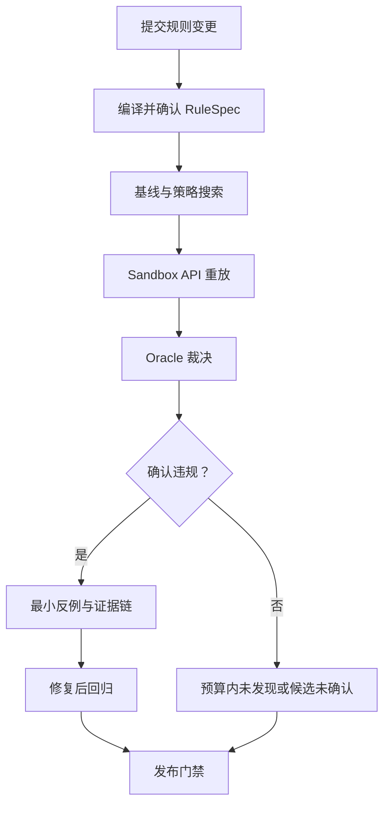
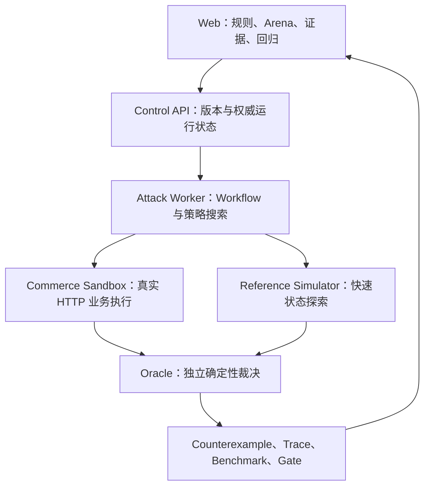

# RuleArena 项目说明 v0.1

状态：产品全貌已确认  
文档用途：统一产品叙事、业务边界、架构主线、演示方式与面试口径  
事实基线：以 `01-product-requirements.md`、`02-domain-model.md`、`03-technical-spec.md` 和阶段 Review 结论为准

> 本文描述的是已经确认的产品设计，不自动代表所有能力都已实现。任何“已完成、已部署、达到某指标”的表述，必须由代码、测试、BenchmarkRun 或线上运行证据支持。

---

## 0. 一句话定义

> **RuleArena 是面向电商促销、退款、积分和会员权益规则变更的 AI 对抗验证与发布门禁平台：把自然语言规则转换为经人工确认的可执行契约，由受控 Agent 搜索高风险动作序列，通过真实 HTTP API 重放，并由确定性 Oracle 裁决和沉淀回归反例。**

最小价值单位不是一份“可能存在风险”的分析报告，而是：

> **一条经过真实 API 重放、确定性验证、可以稳定复现并长期回归的业务反例。**

产品主张：

> **Agent 负责寻找人没有想到的路径，确定性程序负责证明路径是否真的有问题。**

---

## 1. 为什么需要 RuleArena

### 1.1 真实业务问题

电商中的订单、优惠券、积分、退款和会员权益通常由不同模块、规则和团队维护。单条规则往往并不复杂，真正的风险来自规则组合：

- 支付时发放积分，退款时是否完整撤销；
- 优惠券恢复后能否再次产生价值；
- 多次部分退款的累计金额是否超过实付；
- 已消费会员权益后能否继续全额退款；
- 相同请求在超时重试后是否产生两次业务效果；
- 合法的单步动作按特殊顺序组合后，是否到达非法状态。

传统测试主要覆盖研发和测试人员已经想到的路径。LLM 阅读 PRD 可以补充风险提示，但它给出的只是推测，不能证明真实系统可以复现，更不能直接成为发布结论。

RuleArena 解决的根本问题是：

> **如何在规则上线前，用有界成本主动搜索跨模块、跨状态和异常顺序组合，并把可疑路径转化为可重放、可裁决、可回归的工程证据。**

### 1.2 目标用户

| 用户 | 需要完成的任务 |
| --- | --- |
| 产品经理 | 在发布前发现规则歧义、冲突和缺失条件 |
| 测试工程师 | 补充人工用例难以枚举的长尾路径并沉淀回归资产 |
| 后端开发 | 获得包含请求、Receipt、事件、状态 Diff 的复现证据 |
| 交易风控 | 搜索重复退款、权益残留和价值套利路径 |
| 营销/会员运营 | 验证活动叠加和权益生命周期是否符合业务预期 |

核心 Job to Be Done：

> 当一组电商规则准备上线或发生变更时，在不修改生产数据的前提下，自动搜索并确认可能造成资金或权益异常的操作路径，并用修复回归结果支持发布决策。

---

## 2. 第一性原理与设计哲学

### 原则一：规则必须成为可确认的业务契约

自然语言规则天然存在省略和歧义。直接让 Agent 按原文执行，会把模型猜测混入业务事实。

因此先经过：

```text
自然语言 + 内置模板
→ 候选 RuleSpec
→ Schema 与确定性校验
→ 歧义列表
→ 人工确认
→ 不可变 RuleVersion
```

未确认的规则不能进入攻击运行。RuleSpec 只允许优惠、退款、积分和会员领域的固定原语，不允许动态 Python、SQL、表达式求值或动态 import。

### 原则二：候选风险不等于确认漏洞

Agent 可以产生错误推理，参考模拟器也可能与真实实现不同。因此结果必须分层：

```text
Agent 提议路径
→ Reference Simulator 快速搜索
→ 干净 Commerce Sandbox 真实 API 重放
→ Oracle 检查快照、账本、事件和 Receipt
→ Confirmed Counterexample
```

只有 Sandbox 重放成功且 Oracle 检测到不变量违规，才能标记为 `CONFIRMED_VIOLATION`。

### 原则三：LLM 负责未知搜索，代码负责边界与事实

模型适合处理：

- 理解规则的潜在风险方向；
- 在合法动作空间中提出下一步动作；
- 从价值流、生命周期和边界条件三个角度探索未知组合。

确定性代码负责：

- RuleSpec 校验和版本冻结；
- 动作前置条件、状态转换和预算；
- HTTP 执行、事务、幂等和权威状态；
- 不变量裁决、反例最小化和发布门禁；
- 指标计算、版本绑定和 Ground Truth 隔离。

### 原则四：完成必须由外部证据证明

模型声称“已经退款”“发现漏洞”或“修复有效”都不能作为完成事实。系统只信任：

- Sandbox 返回的 ActionReceipt；
- PostgreSQL 中的权威状态和不可变账本；
- BusinessEvent；
- OracleResult；
- 同版本下的独立 Replay；
- 从原始 Run 重算得到的评测指标。

### 原则五：多 Agent 只有产生边际收益才值得强调

RuleArena 使用一个确定性 Orchestrator 和三个隔离策略，而不是让多个 Agent 自由讨论：

- `VALUE_FLOW`：资金、退款、优惠、积分和权益价值守恒；
- `LIFECYCLE`：订单、优惠券、会员和权益状态转换；
- `BOUNDARY`：重复请求、部分退款、取消后重试和异常顺序。

必须与 Random、BFS、Single Agent 在相同 Case 和归一化预算下做消融。如果三策略没有带来发现率或单位成本优势，产品和简历中降低 Multi-Agent 权重。

### 原则六：AI 界面应展示任务、证据和恢复，而不是聊天记录

用户关心的是规则是否能发布、问题怎样复现、修复是否有效，而不是 Agent 之间说了什么。因此主要界面是：

- 规则与歧义确认；
- 策略运行和预算；
- 动作序列和状态 Diff；
- Receipt、事件和 Oracle 证据；
- Vulnerable/Fixed 回归对比；
- 失败、取消、超时和恢复状态。

---

## 3. 核心业务闭环



完整过程：

1. 用户选择优惠/退款积分/会员权益模板。
2. 用户用自然语言修改规则。
3. Rule Compiler 输出严格 RuleSpec 和歧义。
4. 用户确认后冻结 RuleVersion。
5. 确定性规则检查和 BFS 先建立基线。
6. 三个策略在隔离 Context 和预算中提出结构化动作。
7. Reference Simulator 快速执行、去重和剪枝。
8. 可疑路径从干净 Sandbox 开始，通过真实 HTTP API 重放。
9. Oracle 检查金额、积分、优惠券、权益、状态和幂等不变量。
10. 确认路径通过删除式 Delta Debugging 得到 1-minimal 反例。
11. 修复版本重新执行旧反例和正常 Case。
12. Trace、Counterexample 和 Benchmark 形成发布证据。

运行完成与业务结果严格分离。`COMPLETED` 只表示任务结束，Outcome 可能是确认违规、候选未确认、预算内未发现、规则歧义、基础设施失败或取消。

---

## 4. 黄金业务案例

### 4.1 规则

- 新用户获得一张 50 元优惠券；
- 订单原价 150 元，使用优惠券后实付 100 元；
- 实付满 100 元发放 100 积分；
- 全额退款恢复原优惠券；
- 100 积分可以兑换一张 20 元券。

### 4.2 Vulnerable v1

退款实现恢复了原优惠券，但没有撤销订单产生的积分：

```text
创建用户
→ 发放 50 元券
→ 创建 150 元订单
→ 使用优惠券
→ 支付 100 元并获得 100 积分
→ 全额退款 100 元并恢复优惠券
→ 使用 100 积分兑换 20 元券
```

最终用户已取回全部实付金额，却仍持有恢复的 50 元券或额外兑换权益。Oracle 可根据 `INV-02 Reward Conservation` 和相应优惠券价值约束生成证据。

### 4.3 Fixed v2

修复版本在退款事务中撤销订单积分，并按照冻结 RuleVersion 处理优惠券恢复。旧路径不再触发相同不变量，同时正常支付、退款和优惠券流程仍应通过。

### 4.4 为什么这个案例适合作为演示主线

- 非技术用户能迅速理解“退款后仍保留额外权益”；
- 动作均为真实电商业务动作，不依赖抽象算法解释；
- 同时覆盖规则编译、状态机、账本、真实 API、Oracle、最小化和回归；
- 可以清晰展示“模型猜测”与“确定性证明”的区别；
- 修复前后形成完整的发布验收故事。

增强案例只保留两个：

1. 重复/部分退款导致累计退款超过实付；
2. 会员退款后未消费权益没有撤销，或已消费权益仍允许全额退款。

---

## 5. 可执行业务世界

RuleArena 不要求接入真实企业生产系统。MVP 通过 Commerce Sandbox 建立一个可独立运行、可通过 API 操作、可查询权威状态的测试业务服务。

它不是几个内存函数组成的玩具 Mock，而应具备：

- 独立 FastAPI 服务；
- PostgreSQL 事务和数据隔离；
- 订单、优惠券、退款、积分账本、会员和权益聚合；
- 每个写动作的幂等键和 ActionReceipt；
- 只追加的业务事件；
- Vulnerable 与 Fixed Sandbox Profile；
- 每个 Run 独立数据空间；
- HTTP 超时后的 Receipt 查询和 `ACTION_UNKNOWN` 语义。

真实性需要诚实分层：

| 层次 | RuleArena 的实现 |
| --- | --- |
| 业务真实性 | 使用电商售后与营销中的真实规则类型和状态问题 |
| 执行真实性 | 通过独立服务的 HTTP API、事务和数据库状态执行 |
| 缺陷真实性 | 使用可解释、可重放的实现缺陷 Profile |
| 验证真实性 | Oracle 从账本、快照、事件和 Receipt 判定 |
| 运行真实性 | 部署、队列、Trace、恢复、评测和门禁均真实运行 |

安全表述：

> 项目验证的是真实电商业务问题和完整工程机制，但 MVP 被测对象是独立测试服务，不冒充企业生产流量或真实客户系统。

---

## 6. 系统架构



### 6.1 组件职责

| 组件 | 负责 | 不负责 |
| --- | --- | --- |
| Web | 规则确认、运行进度、状态 Diff、证据、回归 | 不计算权威指标，不裁决漏洞 |
| Control API | Policy、Run、Counterexample、Benchmark、SSE | 不直接执行 Sandbox 业务动作 |
| Attack Worker | 基线、三策略、Checkpoint、重放和最小化 | 不直接写 Sandbox 数据库 |
| Reference Simulator | 快速、纯函数式状态搜索 | 不作为真实漏洞成立依据 |
| Commerce Sandbox | HTTP 动作、事务、幂等、事件和快照 | 不访问 Ground Truth，不给 Agent 泄漏实现 Profile |
| Oracle | 检查独立业务不变量 | 不相信 Agent confidence，不执行自然语言判断 |
| Evaluation | Case、Baseline、指标、消融和门禁 | 不把隐藏答案暴露给 Runtime |

### 6.2 Harness 映射

```text
Harness = Context + Tools + Constraints + Verification + Recovery
Agent System = Agent + State + Authority + Observability
```

| Harness 能力 | RuleArena 对应实现 |
| --- | --- |
| Context | RuleVersion、当前规范化状态、有限历史、策略目标和预算 |
| Tools | 固定 Action Schema 和只读状态检查，不提供 Shell/SQL/文件工具 |
| Constraints | 状态前置条件、Pydantic 校验、预算、权限、限流和 fail closed |
| Verification | Sandbox Replay、Receipt、事件、快照和 Oracle |
| Recovery | Checkpoint、幂等键、Receipt 查询、取消和 ACTION_UNKNOWN |
| State | PostgreSQL 权威状态，Redis 只承担队列和短期进度 |
| Authority | Agent 只能提议动作，不能直接写数据库或决定 Outcome |
| Observability | Run/Strategy/Step/Replay/Oracle 层级 Trace 和 Benchmark |

---

## 7. 为什么不是一段 Prompt 或 Skill

Prompt/Skill 可以完成：

- 从规则文本中列举风险；
- 生成测试思路；
- 推荐可能的边界条件；
- 输出一份审查报告。

但无法独立完成 RuleArena 的关键保证：

| 能力 | Prompt/Skill | RuleArena |
| --- | ---: | ---: |
| 规则歧义冻结和版本绑定 | 弱 | 类型化 RuleVersion |
| 执行真实业务动作 | 无 | Sandbox HTTP API |
| 判断最终权威状态 | 无 | 快照、账本、事件、Receipt |
| 控制副作用与重复执行 | 无 | 幂等、条件更新、Checkpoint |
| 独立判断业务违规 | 不稳定 | 确定性 Oracle |
| 证明问题可复现 | 无 | 干净环境连续 Replay |
| 缩减为最小复现路径 | 弱 | Delta Debugging + 重放 |
| 修复后长期回归 | 无 | Counterexample Regression |
| 比较 Agent 是否有价值 | 无 | Baseline、Holdout、消融和成本 |

RuleArena 的壁垒不是 Prompt 更长，而是：

> **拥有一个可执行世界、受控 Runtime、独立裁决、版本化证据和回归闭环。**

---

## 8. 从优秀产品与思想中吸收什么

RuleArena 不复制通用 Agent 平台，只吸收与业务闭环直接相关的原则。

| 参考方向 | 吸收的原则 | RuleArena 落点 |
| --- | --- | --- |
| Vercel SRE Agent | 假设必须通过工具取证，结论绑定来源 | 风险假设 → Replay → Oracle Evidence |
| MineAI | 动作 ACK 不等于业务成功，需要环境后置验证 | Receipt 后重新读取快照和事件 |
| AgentDock | 工具应有输入、权限、副作用、重试和后置条件 | 类型化 Action Contract |
| Orkas | 用户需要可使用的产物，不需要多 Agent 对话 | 反例、pytest 回归、报告和 Diff |
| Perplexity | 结论旁直接展示来源 | Finding 绑定规则、Step、Receipt、Event、Invariant |
| Cua | 轨迹、快照、回放和 Eval；有 API 时优先 API | Sandbox API Replay，不做 GUI 自动化 |
| Flow Brief | 用状态变化讲清业务，标记证据类型 | 黄金旅程、状态 Diff、事实/目标标签 |
| AgentHub | 类型化工具注册、运行事件和流式进度 | Tool Registry、SSE、可恢复执行 |
| Agent 生产实践 | Workflow、Trace、Bad Case、门禁和人审 | 固定状态机、Counterexample 回流、Release Gate |

不吸收当前没有业务必要性的能力：通用 DAG、Agent 群聊、长期记忆、RAG、动态插件、桌面 Computer Use、30+ CLI 工具、Kubernetes 和通用沙箱平台。

---

## 9. 关键技术与架构取舍

| 决策 | 选择 | 原因 | 替代方案与代价 |
| --- | --- | --- | --- |
| 规则表示 | 严格 RuleSpec + 人工确认 | 可校验、版本化、可复现 | 直接 Prompt 灵活但不可确定 |
| 主流程 | 显式 Workflow/FSM | 生命周期有限，状态和失败语义清晰 | LangGraph 可缩短搭建但隐藏关键机制 |
| 搜索 | BFS 基线 + 有界策略 Agent | 同时具备确定性基线和未知路径探索 | 纯 Agent 成本不稳；纯 BFS 状态爆炸 |
| 执行 | Simulator + 独立 Sandbox | 快速探索和真实验证兼顾 | 只用 Simulator 容易自证；全走 HTTP 太慢 |
| 裁决 | 确定性 Oracle | 资金和状态不变量可稳定计算 | LLM Judge 适合表达质量，不适合资金裁决 |
| 多 Agent | 三个隔离策略 | 可归因、可并行、避免自由讨论 | Peer Team 冲突、重复和 Token 成本高 |
| 状态 | PostgreSQL 权威、Redis 队列 | 支持事务、恢复和审计 | Redis 作为事实源会丢失或漂移 |
| 前端推送 | SSE + 权威 Run API | 单向进度足够，刷新可恢复 | WebSocket 增加双向状态复杂度 |
| 最小化 | 删除式 Delta Debugging | 结果可解释，可经 Replay 验证 | 仅让模型总结不能保证仍可复现 |

---

## 10. 评测与质量门禁

固定 24 个 Golden Case：

- development 16：用于调试和回归；
- hidden 8：Runtime 不可读取，由 Evaluation 最终裁决；
- 覆盖优惠/退款积分/会员权益、正常/缺陷、顺序/幂等/边界场景。

比较：

1. Random；
2. BFS；
3. Single Agent；
4. Multi-strategy。

MVP 目标门禁：

| 指标 | 目标 |
| --- | ---: |
| Golden Set | 24 Case |
| 正常场景 Confirmed 误报 | 0 |
| Confirmed Counterexample | 同版本连续重放 3/3 |
| 隐藏漏洞发现率 | ≥ 75% |
| 历史 P0 反例回归 | 100% |
| Ground Truth 泄漏 | 0 |
| 公共 Live Run | 默认 ≤ 90 秒 |

这些都是验收目标，不是天然已达成的事实。README、网站和简历只能引用实际 BenchmarkRun 的结果。

---

## 11. 在线 Demo

首屏一句话：

> AI 搜索电商规则的异常操作组合，真实 API 重放，确定性 Oracle 裁决。

三分钟黄金旅程：

1. 进入默认优惠/退款/积分案例；
2. 对比自然语言规则和 RuleSpec，确认一处歧义；
3. 运行或查看一条已完成真实 Run；
4. 观察三策略与基线的有界搜索进度；
5. 打开最小动作序列和每步状态 Diff；
6. 查看 Receipt、Event、Oracle invariant 和重放 3/3；
7. 切换 Fixed v2；
8. 旧反例消失，正常退款仍通过。

公开 Demo 同时支持：

- Frozen Run：由真实完成 Run 持久化，不依赖现场模型；
- 限额 Live Run：展示实际运行，失败时如实显示状态；
- 技术模式：展开版本元组、工具调用、Hash、延迟、Token 和成本。

---

## 12. 扩展方向

### P1：增强发布门禁

- RuleSpec 版本 Diff；
- Counterexample 导出 pytest；
- Benchmark 趋势；
- 候选修复规则，必须人工确认；
- OpenTelemetry 导出。

### P2：接入外部被测系统

通过 `TargetAdapter` 接入开源电商系统或企业 Staging。适配器负责：

- 将统一 Action Contract 映射为目标 API；
- 创建/清理隔离测试租户或场景；
- 读取规范化快照和事件；
- 提供幂等与最终状态查询；
- 声明目标系统不支持的动作和不变量。

外部适配不能阻塞 MVP，也不能让 Oracle 依赖目标实现内部逻辑。

### P2：验证售后退款 Agent

后续可增加受控 Refund Agent 作为被测对象：

- 理解售后诉求并选择退款动作；
- 遵守金额、时效和订单状态限制；
- 重试不造成重复退款；
- 工具 ACK 后检查最终业务状态；
- 结果未知或高风险时转人工。

RuleArena 负责回放和裁决 Refund Agent 的行为。二者关系是：

> **Refund Agent 执行业务，RuleArena 证明它没有把业务执行错。**

### 跨领域迁移

只有当新领域同时具备“有限动作、明确状态、可执行环境、确定性不变量”时才适合迁移，例如：

- SaaS 套餐、退款和额度权益；
- 游戏付费、道具、活动奖励和回滚；
- 审批、额度和权限流转；
- 支付路由、补偿和重复入账。

不扩展为任意 PRD、商业模式或 UX 审查平台。

---

## 13. 系统边界

### MVP 负责

- 固定电商规则模板和 RuleSpec；
- 规则歧义确认与版本冻结；
- 优惠、退款积分和次数型会员权益；
- Random/BFS/Single/Multi 搜索；
- Sandbox API、事务、幂等、账本和事件；
- 独立 Oracle、最小反例、回归和 Trace；
- 24 Case 评测、消融和在线 Demo。

### MVP 不负责

- 真实支付、库存、物流和商家结算；
- 直接访问生产电商系统；
- 复杂真实并发和分布式事务证明；
- 任意行业自由建模；
- Agent 自动修改和发布业务代码；
- 形式化证明系统安全；
- 自动海量生成规则和用例；
- 用 LLM Judge 替代确定性业务裁决。

只能声明：

> **在给定 RuleVersion、ScenarioVersion、SandboxVersion、OracleVersion、seed 和预算内发现或未发现违规。**

不能声明：

> **系统已经证明规则绝对安全。**

---

## 14. 对 HR、技术面试官和项目学习的表达

### 20 秒

> 我做了一个电商规则对抗验证平台。它把退款、优惠和积分规则转成可确认的 RuleSpec，让 Agent 搜索异常操作组合，再通过真实 API 重放和确定性 Oracle 判断是否真的造成资金或权益异常，最后把问题沉淀成可回归的最小反例。

### 90 秒主线

> 电商里很多问题不是单条规则错误，而是订单、优惠券、积分和退款在特殊顺序下组合出错。单元测试只能覆盖想到的路径，LLM 审文档又只能给风险提示，所以我做了 RuleArena。系统先把自然语言规则编译成严格 RuleSpec，歧义必须人工确认；然后用 BFS 和三个隔离策略搜索动作序列，先在参考模拟器中快速探索，再从干净环境调用独立 Commerce Sandbox 的真实 HTTP API 重放。模型只能提出动作，漏洞是否成立由 Oracle 根据退款、积分、优惠券、权益和幂等不变量判断。确认问题会被压缩为 1-minimal 反例，修复后继续回归。项目还用 24 个开发/隐藏 Case 比较 Random、BFS、Single Agent 和 Multi-strategy，避免把多 Agent 当成没有证据的卖点。

### 三个可深讲难题

1. 为什么要分离 Reference Simulator、Commerce Sandbox 和 Oracle，怎样避免自己验证自己；
2. 写动作超时后怎样用幂等键、Receipt、权威查询和 `ACTION_UNKNOWN` 防止重复副作用；
3. 怎样构建无 Ground Truth 泄漏、预算公平、指标可重算的 Agent Benchmark。

### 事实安全口径

- “设计为”“目标是”用于尚未实现或未测量的能力；
- “测试中得到”“BenchmarkRun 显示”必须绑定命令、版本和原始 Run；
- “在线 Demo”必须存在可访问 URL 和 smoke test；
- “真实业务”指真实业务规则和执行机制，不冒充真实企业客户或生产流量；
- Mock、容量估算和故障演练必须显式标注，不能包装为线上事故。

---

## 15. MVP 完成定义

只有以下闭环全部有实际证据时，MVP 才能宣布完成：

```text
自然语言规则
→ 可确认 RuleSpec
→ Agent/基线发现候选
→ Sandbox API 黑盒重放
→ Oracle 确认
→ 1-minimal 反例
→ Fixed 回归
→ 24 Case 与消融
→ 在线证据型 Demo
```

任何阶段如果门禁未通过，可以发布“技术预览”，但必须公开当前限制，不得用 UI 文案、删 Case 或手填数字制造完成感。
