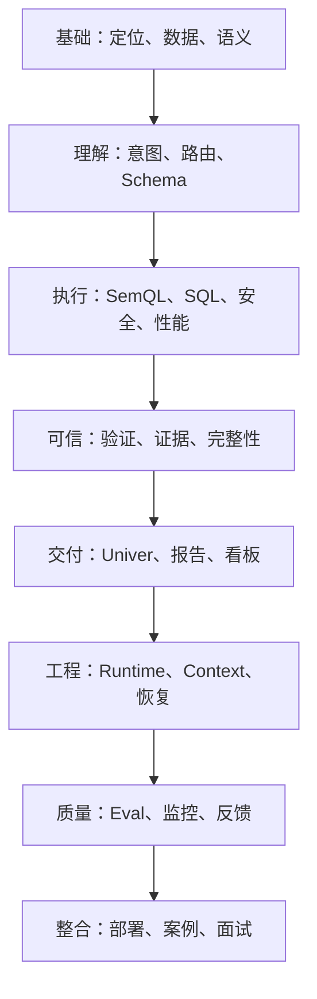

# 数驭穹图学习地图与使用说明

## 学习目标

这套手册服务于 AI 应用开发、Python 后端和 Agent 工程岗位面试。目标不是逐字背诵，而是达到三层能力：

1. 能用 20 秒定义项目；
2. 能用 90 秒讲清完整业务闭环；
3. 面试官沿任一节点追问时，能说明问题、方案、取舍和验证方法。

项目主线只有一条：

> 多源数据接入 → 语义确权 → 可信问数 → 结果证明 → Univer 协作 → 持续数据资产



## 文档目录

| 阶段 | 文档 | 作用 |
|---|---|---|
| 全貌 | [01-项目全貌与产品定位](01-项目全貌与产品定位.md) | 讲清用户、痛点、闭环和边界 |
| 数据 | [02-数据接入与轻量湖仓](02-数据接入与轻量湖仓.md) | 解释快照、实时只读和同步可靠性 |
| 语义 | [03-数据目录与语义资产](03-数据目录与语义资产.md) | 解释为什么 Schema 不等于业务知识 |
| 理解 | [04-意图识别与歧义澄清](04-意图识别与歧义澄清.md) | 把自然语言变成明确需求 |
| 检索 | [05-领域路由与Schema-Linking](05-领域路由与Schema-Linking.md) | 选对业务域、表、字段和 JOIN |
| 生成 | [06-NL2SemQL2SQL](06-NL2SemQL2SQL.md) | 将业务问题分阶段转换成 SQL |
| 安全 | [07-权限安全与生产隔离](07-权限安全与生产隔离.md) | 防止越权、危险查询和源库影响 |
| 性能 | [08-查询性能与成本控制](08-查询性能与成本控制.md) | 控制 JOIN、扫描量、并发和延迟 |
| 可信 | [09-结果验证与证据绑定](09-结果验证与证据绑定.md) | 证明结果和图表来自真实查询 |
| 协作 | [10-Univer在线表格与协作闭环](10-Univer在线表格与协作闭环.md) | 让结果进入协作并成为新数据源 |
| 编排 | [11-Workflow-Agent与Tool契约](11-Workflow-Agent与Tool契约.md) | 划分模型和确定性代码职责 |
| 上下文 | [12-多轮上下文与任务恢复](12-多轮上下文与任务恢复.md) | 管理会话、证据、Artifact 和恢复 |
| 质量 | [13-Eval可观测性与持续优化](13-Eval可观测性与持续优化.md) | 建立可归因评测和反馈闭环 |
| 部署 | [14-系统架构部署与故障处理](14-系统架构部署与故障处理.md) | 回答组件、部署和依赖故障问题 |
| 案例 | [15-门店与盈利率黄金案例](15-门店与盈利率黄金案例.md) | 用真实问题贯穿全链路 |
| 表达 | [16-项目表达与面试题库](16-项目表达与面试题库.md) | 项目介绍、连续追问和陌生迁移 |
| 证据 | [17-量化指标与证据口径](17-量化指标与证据口径.md) | 管理简历数字、实验边界和证据等级 |

## 快速建立全貌

第一遍用 60～90 分钟通读，不停下来深挖。每篇只记住：

- 它位于主线哪里；
- 它解决什么风险；
- 它的三个关键词。

第二遍闭卷完成三种输出：

```text
20 秒：项目是什么
90 秒：用户、数据、流程、结果、价值
5 分钟：画图讲端到端架构
```

第三遍直接模拟面试。每轮只记录三个最大断点，回到对应文档专项补齐，不重新通读全部内容。

## 间隔复训

| 时间 | 训练 |
|---|---|
| 当天 | 90 秒介绍＋黄金案例 |
| 第 1 天 | 5 道随机追问 |
| 第 3 天 | 画图讲链路＋故障追问 |
| 第 7 天 | 完整项目模拟面试 |

阅读熟悉不等于掌握。只有闭卷能讲、能承受追问、能迁移到陌生业务，才算 `integrated`。

## 通用回答骨架

普通设计题：

> 业务目标 → 正常流程 → 主要风险 → 解决机制 → 设计取舍 → 验证方法

事故处理题：

> 发现 → 止血 → 定位 → 修复 → 验证 → 预防

突然卡住时，从五个字恢复：

> 散、义、问、证、产

- 散：数据分散；
- 义：语义确权；
- 问：受控问数；
- 证：结果证据；
- 产：沉淀资产。

