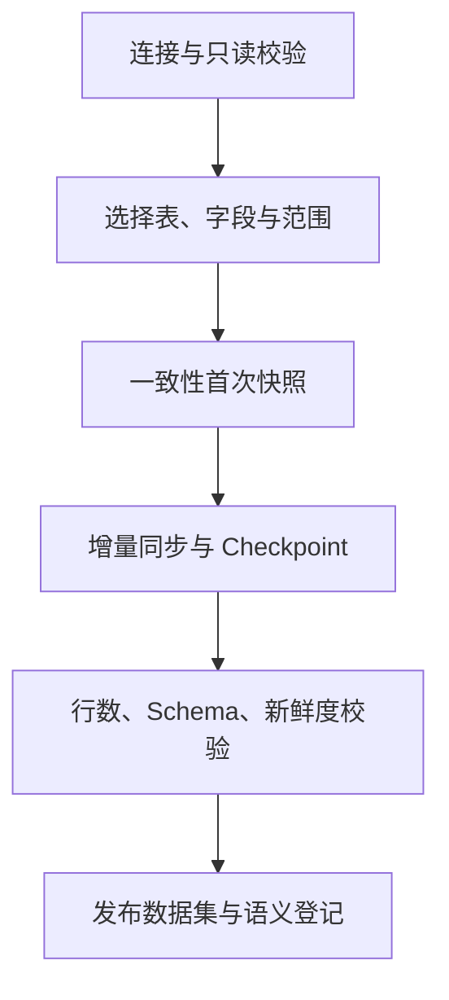

# 数据接入与轻量湖仓

## 模块定位

本模块解释客户数据如何进入系统，以及如何在新鲜度、生产安全、存储成本和跨源分析之间取舍。

## 一句话结论

> 数据集按需选择 `SNAPSHOT` 或 `LIVE_READ`：默认把授权分析数据同步到租户隔离的轻量湖仓，实时场景通过受控连接器查询只读副本或分析库。

## 第一性原理

分析需要真实数据，但不能把未知 SQL 的风险直接转嫁给客户生产库。数据接入至少满足：

- 数据最小化：只接入必要表、字段和范围；
- 生产隔离：临时分析不竞争核心业务资源；
- 可重复：能够定位数据版本和同步状态；
- 可更新：源数据变化后可增量同步；
- 可校验：不能把半份数据发布成完整数据集。

## 两种访问模式

| 模式 | 执行位置 | 优势 | 代价 |
|---|---|---|---|
| `SNAPSHOT` | 轻量湖仓 | 隔离生产、跨源 JOIN、可复现 | 同步延迟、存储和维护成本 |
| `LIVE_READ` | 客户只读副本或分析库 | 数据更新及时、少复制 | 依赖源端性能、跨源能力弱 |

数据分析师按数据集选择，而不是整个企业只能使用一种模式。

## 快照主线

记忆词：

> 接、选、快、增、验、发

### 连接与选择

接入服务验证网络、数据库版本和只读权限；凭据加密保存，不进入模型上下文。数据管理员选择表、字段、过滤范围、主键、更新时间字段、刷新频率和访问权限。

### 首次快照

首次同步需要一个一致性起点。优先读只读副本，并采用分片分页、限速、低峰执行和 Checkpoint。失败后从断点恢复，不能重新无界扫描。

### 增量更新

- MySQL 优先使用 Binlog；
- PostgreSQL 优先使用逻辑复制/WAL；
- 不支持 CDC 时按 `updated_at` 或递增主键轮询；
- 删除需要 tombstone、变更日志或周期性全量核对。

相同源事件重复到达时，以数据集、主键、源版本或日志位点实现幂等合并。

### 轻量湖仓

- PostgreSQL 保存租户、目录、Schema、同步任务和文件索引；
- 对象存储保存按租户、数据集和分区组织的 Parquet；
- DuckDB 读取 Parquet 完成分析查询；
- 查询结果和大文件外置为 Artifact。

这不是复制客户整库，而是同步经过授权的分析数据集。

### 校验与发布

发布前检查行数、主键重复、字段类型、分区完整性、Schema 漂移、同步位点和新鲜度。关键校验失败时状态保持 `INVALID` 或 `STALE`，不得进入正式问数。

## 实时只读路径

`LIVE_READ` 使用后端受控执行器，优先连接只读副本或分析库。必须有只读事务、允许表清单、超时、扫描量、并发、行数和取消能力。若客户只有生产主库，默认不开放复杂即席查询。

## 失败与处理

| 问题 | 发现 | 处理 |
|---|---|---|
| 首次同步中断 | Checkpoint 停滞 | 从已确认分片恢复 |
| 重复增量 | 主键/版本冲突 | 幂等 upsert |
| 删除未同步 | 周期对账不一致 | tombstone 或重建分区 |
| Schema 漂移 | DDL diff | 暂停相关数据集并生成治理任务 |
| 数据过期 | freshness 超阈值 | fail closed 或明确标记过期 |
| 源库压力升高 | 连接、延迟、CPU 告警 | 降速、暂停、切只读副本 |

## 钢人比较

完全直连无需同步、数据最新，适合已经有成熟分析库的企业；全量复制查询自由，但成本和合规压力大。选定数据集＋双模式在中小企业场景中更平衡。

## 逆向检查

即使同步任务显示成功，还要问：是否漏了删除？是否只同步半个分区？是否读取到变化中的快照？Schema 是否已变化？下游是否误用旧版本？

## 边际决策

第一版优先支持 MySQL、PostgreSQL、CSV/Excel、飞书和 Univer。先实现可恢复快照和 `updated_at` 增量，再根据客户规模引入完整 CDC，避免一开始建设通用数据集成平台。

## 面试标准回答

### 20 秒

> 每个数据集由数据管理员选择快照或实时只读。默认把授权数据通过一致性快照和增量同步保存为租户隔离的 Parquet，校验后发布；实时场景通过受控连接器查询只读副本。

### 60 秒

> 数据接入先验证网络和只读权限，再由数据管理员选择表、字段、范围、主键和更新策略。快照模式先进行分片、限速、可断点恢复的一致性全量同步，再通过 Binlog、WAL 或更新时间游标增量更新。实际分析数据保存为对象存储中的 Parquet，PostgreSQL只保存目录、Schema、同步状态和版本，DuckDB负责分析执行。每轮同步后检查行数、主键、Schema、分区和新鲜度，通过后才发布为正式数据集。实时性要求高时走客户只读副本或分析库，并实施超时、扫描量和并发限制。

## 高频追问

### 为什么不是把整个数据库搬过来？

遵循数据最小化，只同步已授权且有分析价值的数据集，降低存储、合规和维护成本。

### 同步是否完全不影响生产？

不会声称零影响。快照和 CDC 仍有源端开销，因此使用副本、限速、分片、低峰和可暂停机制控制。

### 没有 `updated_at` 怎么增量？

优先使用数据库日志；都不可用时只能周期全量或业务提供变更标识，并明确成本和新鲜度限制。

## 恢复脚本

> 只读连接 → 选定数据 → 一致快照 → 增量位点 → 完整校验 → 发布查询

## 闭卷自测

1. Snapshot 与 Live Read 各适合什么场景？
2. 首次快照为什么需要一致性起点？
3. 删除数据怎样同步？
4. PostgreSQL、对象存储、DuckDB 各负责什么？
5. 为什么同步成功不等于数据集可发布？

