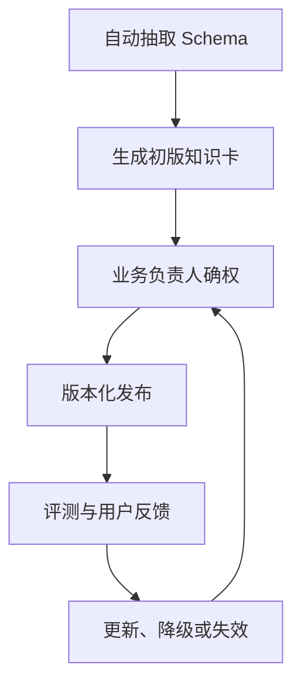

# 数据目录与语义资产

## 模块定位

本模块位于数据接入和自然语言问数之间，负责把“有表可查”升级为“知道这些表在业务上怎样正确使用”。

## 一句话结论

> Schema 只描述技术结构，语义资产进一步定义指标、维度、粒度、关联、适用场景和正式口径，是 NL2BI 准确率的主要上限。

## 第一性原理

模型看到 `pay_amount` 并不知道它是下单金额、实付金额还是退款后净额。企业分析中的大多数错误不是 SQL 语法错误，而是业务定义错误。因此，业务事实必须由数据管理员和业务负责人确权，模型只能映射和使用，不能自行创造。

## 三层知识

| 层 | 内容 | 更新方式 |
|---|---|---|
| 技术元数据 | 表、字段、类型、主键、分区、更新时间 | 自动抽取和 DDL diff |
| 业务语义 | 指标、维度、同义词、口径、关联、场景 | 人工确权、版本化 |
| 公共规则 | 日期、权限、单位、查询限制 | 平台统一维护 |

## 六节知识卡片

每个核心表或数据集使用统一卡片：

1. 元数据：来源、粒度、分区、更新频率、负责人；
2. 字段语义：主键、维度、指标、单位和限制；
3. 场景映射：适合和不适合回答的问题；
4. 关联约束：合法 JOIN、基数和一对多风险；
5. 指标口径：公式、过滤、去重、退款和时间定义；
6. 高质量查询：已确认的 SemQL、SQL 和边界案例。

## 语义资产健康度

关注字段覆盖率、核心指标口径完整度、JOIN 标注率、示例覆盖率、最近核验时间和回归通过率。核心指标缺少正式定义时，应暂停该指标的自动问数，而不是让模型猜测。

## 权威状态

语义资产必须有 `DRAFT → REVIEWED → PUBLISHED → DEPRECATED` 状态和版本。查询只使用已发布且健康的数据集版本，并把语义版本写入查询 Provenance。

## 失败与处理

| 问题 | 结果 | 机制 |
|---|---|---|
| 同名指标跨域 | 选错口径 | 领域路由＋限定选项澄清 |
| 字段被删除 | SQL 失败 | DDL 一致性监控 |
| JOIN 基数未知 | 金额膨胀 | 关联卡片＋执行后互核 |
| 口径长期未核验 | 旧规则冒充当前 | 健康度降级和失效 |
| 示例污染 | 错误 SQL 被反复召回 | 审核、版本和回归测试 |

## 钢人比较

只使用 DDL 和模型推理接入快、维护少，适合结构简单的 Demo；完整语义层建设成本高。数驭穹图采用“自动生成技术部分＋人工确认高价值业务部分”，不追求所有字段一次性治理。

## 逆向检查

即使知识卡结构完整，还要问：指标由谁确认？适用时间是否变化？示例 SQL 是否基于旧表？两个部门是否对同一术语有冲突定义？

## 边际决策

优先治理高频指标、结果层表和高风险 JOIN。与其覆盖一千张低质量表，不如先把二十张核心表做到可解释、可评测、可失效。

## 面试标准回答

### 20 秒

> Schema 只告诉模型表和字段长什么样，语义资产还要定义指标公式、粒度、合法 JOIN 和适用场景。关键口径由业务负责人确权，模型不能自行编造。

### 60 秒

> 数据接入后，系统自动抽取表、字段、类型、分区和更新状态，再生成六节知识卡片初稿。数据管理员和业务负责人补充指标口径、关联基数、适用场景和高质量查询，然后审核发布。技术元数据通过 DDL diff 自动发现漂移，业务语义按版本和健康度管理。查询只使用已发布、未过期的语义版本，并把版本写入证据。这样能够把选表错误、口径错误和 Schema 漂移分别定位，而不是把全部责任交给模型。

## 高频追问

### 为什么不把全部 Schema 放进 Prompt？

上下文噪声大、权限面扩大、同名字段容易冲突，也无法补足业务口径。应先路由，再按需加载少量高信号知识。

### 语义层由 AI 自动生成可以吗？

技术元数据可以自动生成初稿；销售额、有效客户等正式定义必须由领域人员确认。

### 指标变化怎么办？

创建新版本，保留适用时间和变更原因；旧查询保留原版本证据，新查询使用当前发布版本。

## 恢复脚本

> 技术 Schema → 业务口径 → JOIN 约束 → 人工确权 → 版本健康 → 评测失效

## 闭卷自测

1. Schema 为什么不能代表业务语义？
2. 六节知识卡分别解决什么问题？
3. 指标由谁确权？
4. 如何发现知识库与真实表结构不一致？
5. 为什么语义资产必须可失效？

