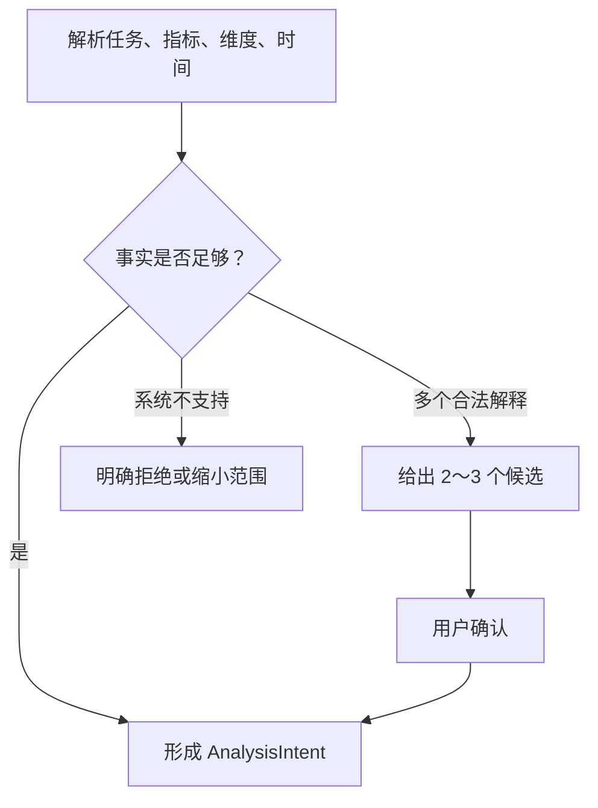

# 意图识别与歧义澄清

## 模块定位

本模块把用户口语问题转换为可执行需求，位于权限检查之后、选域和选表之前。

## 一句话结论

> 意图识别不是给问题贴一个标签，而是确认任务类型、指标、维度、时间、过滤和输出要求；存在多种合法解释时，必须用有限选项澄清。

## 第一性原理

系统不能正确执行一个尚未被明确定义的问题。“今年平均盈利率”至少隐藏：

- 今年是自然年还是近 12 个月；
- 是否截止当前已完成日；
- 盈利率是利润/收入还是其他公式；
- 是各门店简单平均，还是总利润/总收入；
- 关闭、试营业和新开门店是否计入。

模型擅长识别语言候选，但无权替企业决定正式口径。

## AnalysisIntent

意图识别输出结构化契约，而不是一个 `QUERY` 标签：

```json
{
  "task_type": "AGGREGATE_COMPARE",
  "business_domain": "store_operation",
  "metrics": ["store_count", "profit_margin"],
  "dimensions": ["store"],
  "time_range": "current_year_to_last_complete_day",
  "filters": ["store_status=active"],
  "ambiguities": ["profit_margin_aggregation"],
  "output": ["table", "chart"],
  "risk_level": "READ_ONLY"
}
```

它连接自然语言、语义资产、权限、Capability Bundle 和后续 SemQL。

## 正常流程



澄清问题要具体，例如：

> 你希望盈利率按哪种方式计算？A. 总利润÷总收入；B. 各门店盈利率的简单平均。

不要问“请补充更多信息”这类开放问题。

## 歧义分类

| 类型 | 示例 | 处理 |
|---|---|---|
| 指标歧义 | 销售额是下单还是实付 | 展示已发布口径候选 |
| 时间歧义 | 本月、今年、最近 | 映射日历并确认截止点 |
| 实体歧义 | 武汉店、武汉总部店 | 主数据候选消歧 |
| 维度歧义 | 按区域还是门店 | 给出层级选项 |
| 聚合歧义 | 平均盈利率 | 简单平均或加权口径 |
| 能力不足 | 要求预测因果 | 说明边界并提供可支持分析 |

## 失败与处理

- 不该问却频繁澄清：降低体验，使用已确认语义和默认规则；
- 应该问却直接执行：产生业务错误，评测必须覆盖“该问/不该问”双侧；
- 多轮确认丢失：将确认项写入当前 AnalysisIntent，而不是只依赖聊天文本；
- 模型自行选择候选：代码检查 `ambiguities` 未清零时禁止执行。

## 钢人比较

让模型直接推断默认值交互最快，适合低风险个人分析。企业正式指标中错误代价更高，应该对高价值歧义进行确定性门禁；已发布的唯一默认口径则无需重复询问。

## 逆向检查

即使用户回答了澄清问题，还要确认答案是否只对本轮有效、是否与其权限兼容、是否与其他指标粒度冲突。

## 边际决策

第一版只确定性识别会改变执行路径的高价值意图：明细、聚合、趋势、对比、跨域和图表；不要一开始建设数百类意图分类器。

## 面试标准回答

### 20 秒

> 意图识别会抽取任务、指标、维度、时间和过滤，形成 AnalysisIntent。遇到多个合法业务口径时给出有限候选，未消歧前禁止生成正式查询。

### 60 秒

> 我们不把意图识别做成单标签分类，而是生成结构化 AnalysisIntent，包含任务类型、业务域、指标、维度、时间、过滤、输出要求、权限和歧义。系统先利用语义资产判断是否有唯一已发布口径；如果“平均盈利率”可能是简单平均或加权口径，就给用户两个明确选项。用户确认后写入意图对象，Validator 检查歧义清零、指标维度兼容和权限成立，才进入路由和 SemQL。这样可以把业务理解错误阻断在 SQL 生成之前。

## 高频追问

### 每次都澄清会不会很烦？

只对会改变结果且没有唯一默认值的歧义澄清；已确认的租户口径和本轮约束直接复用。

### 多轮中的“那华南呢”怎么理解？

继承上一轮任务和指标语义，将区域过滤替换为华南，但当前数据必须重新查询。

### 用户问题系统不支持怎么办？

明确说明缺少的指标、数据或能力，并给出可执行的缩小方案，不能编造近似答案。

## 恢复脚本

> 抽取六要素 → 检查候选 → 有歧义先问 → 写入 Intent → 校验后执行

## 闭卷自测

1. 意图识别为什么不是普通分类？
2. 什么问题必须澄清？
3. 如何降低不必要澄清率？
4. 多轮约束和当前事实有什么区别？
5. 为什么歧义未清零不能继续？

