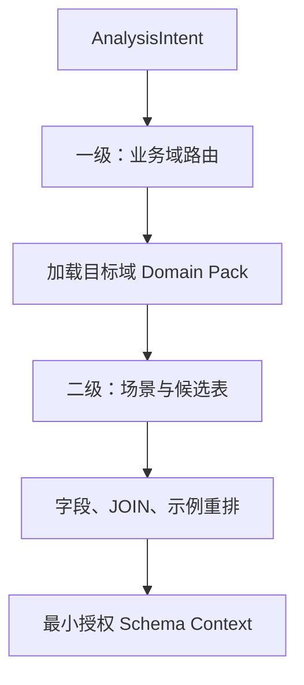

# 领域路由与 Schema Linking

## 模块定位

本模块在明确用户意图后，为查询找到正确的业务域、数据集、表、字段和关联关系。

## 一句话结论

> 先用确定性规则完成跨域消歧，再在目标域内通过精确匹配、知识卡、混合检索和重排选择少量授权 Schema，避免全量 Schema 污染上下文。

## 第一性原理

自然语言到 SQL 的最大风险往往不是语法，而是选错数据。企业中“收入”“客户”“门店”等词可能跨域同名，向量相似不代表业务含义相同；另一方面，中小企业 Schema 不标准，纯规则又难覆盖长尾。因此需要分层、混合且可追踪的路由。

## 两级路由

### 一级：领域路由

根据指标关注点、用户选择、数据集和消歧规则判断销售、财务、客户、库存等业务域。跨域同名时主动澄清。域数量有限，规则可枚举，优先保持确定性和可解释性。

### 二级：域内 Schema Linking

组合以下信号：

1. 指标编码、表名、字段名的精确匹配；
2. Domain Pack 中“问题类型→推荐表”映射；
3. 关键词/BM25 与元数据过滤；
4. 向量召回处理长尾表述；
5. 根据场景适用性、粒度、更新时间和权限重排；
6. 加载合法 JOIN、指标口径和 SQL 示例。

## 选表原则

优先使用已治理的结果层或派生数据集；标准指标不直接扫描明细表。只有非标维度、明细排查或结果层无法回答时才降级到更细粒度数据。

候选必须满足：

- 当前用户有权访问；
- 更新时间覆盖请求时间；
- 粒度能够支持指标和维度；
- JOIN 路径已确权；
- 指标口径与 AnalysisIntent 一致。

## 失败归因

| 错误 | 症状 | 优化位置 |
|---|---|---|
| 域路由错误 | 加载完全无关的知识 | 域规则和澄清样例 |
| 表选择错误 | SQL 合法但数据口径错 | Domain Pack 场景映射 |
| 字段选择错误 | 指标或过滤含义错 | 字段语义和同义词 |
| JOIN 错误 | 重复、漏数、方向错 | 关联卡和基数约束 |
| 召回缺失 | 正确表未进入候选 | 元数据、关键词、向量召回 |
| 重排错误 | 正确表有但未选中 | 场景、粒度、质量特征 |

## 钢人比较

纯确定性路由可调试，适合业务域和表可枚举的成熟数仓；纯 RAG 接入快，适合开放长尾 Schema。数驭穹图使用“域级确定性＋域内混合检索”，兼顾中小企业差异和可解释性。

## 逆向检查

即使召回了正确表，也可能同时加载了更相似但错误的表，或忽略权限和数据新鲜度。Top-K 召回率高不等于最终选表正确，必须分别评测。

## 边际决策

表规模较小时，优先知识卡和规则映射；当单域增长到规则维护困难时再增加向量召回。复杂度应由评测中的召回缺口驱动，而不是为了使用 RAG。

## 面试标准回答

### 20 秒

> 我们先确定性判断业务域，再在域内组合精确匹配、知识卡、关键词和向量召回，按权限、粒度、场景和新鲜度重排，只把少量相关 Schema 交给后续生成。

### 60 秒

> 领域路由先解决跨域同名问题，例如“收入”可能属于销售或财务。域数量有限，所以优先使用可解释规则和澄清。进入目标域后，Schema Linking 先做指标编码、表字段精确匹配和 Domain Pack 场景映射，再使用关键词与向量检索补长尾，最后按权限、数据粒度、更新时间、场景适用性和合法 JOIN 重排。查询只加载候选表的知识卡，不把所有 Schema 塞进上下文。评测将域路由、表召回、字段选择和 JOIN 分开归因。

## 高频追问

### 为什么不用纯向量检索？

业务同名词 embedding 很接近，但口径可能完全不同；高风险域路由需要确定性消歧。

### 如果正确表没有召回怎么办？

记录失败类型，补充同义词、场景映射或字段描述；不能让模型凭空构造表名。

### 表很多会不会上下文过长？

按域和表逐级加载，只发送当前查询需要的字段、口径、JOIN 和少量示例。

## 恢复脚本

> 先定域 → 再找表 → 选字段 → 验粒度 → 查 JOIN → 最小加载

## 闭卷自测

1. 为什么域路由优先确定性？
2. 域内为什么仍需要混合检索？
3. Top-K Schema 召回率不等于什么？
4. 如何定位选错字段问题？
5. 什么情况下才值得引入向量召回？

