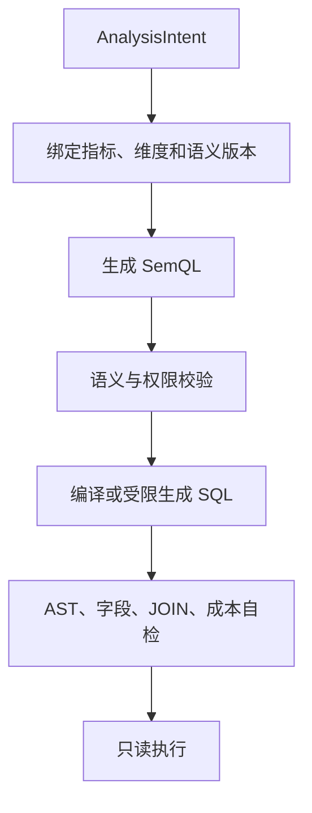

# NL2SemQL2SQL

## 模块定位

本模块把已经澄清并完成 Schema Linking 的业务问题转换为可验证、可执行的查询。

## 一句话结论

> 不让自然语言直接跳到 SQL，而是先形成 AnalysisIntent 和 SemQL，验证业务含义后再编译或受限生成 SQL，把语义错误与技术错误分开。

## 第一性原理

自然语言表达业务意图，SQL 表达物理执行。两者变化频率和验证方法不同：业务人员关心指标、维度和时间；数据库关心表、字段、JOIN 和方言。稳定中间表示能降低耦合、支持多数据源并提高可归因性。

## 三层表示

| 层 | 关注点 | 示例 |
|---|---|---|
| AnalysisIntent | 用户想做什么 | 对比今年各门店盈利率 |
| SemQL | 用哪些已确权指标维度 | metric=profit_margin, dimension=store |
| SQL | 怎样在物理数据上执行 | JOIN、GROUP BY、方言和分区 |

## 正常流程

SemQL 应描述：数据集、指标、维度、时间范围、过滤、排序、TopN、聚合方式和输出粒度，不直接出现未经授权的物理表名。

## SQL 生成策略

1. 高频标准指标：优先确定性模板或语义编译；
2. 已治理但组合变化的查询：模型在授权 Schema 和约束中生成候选 SQL；
3. 未确权指标、非法 JOIN 或无数据支持：停止并澄清，不允许“尽力猜测”。

## 有限纠错

允许自动修复：SQL 方言、字段拼写、类型转换和语法错误。修复前重新加载当前 Schema，并限制次数。

不得自动绕过：权限拒绝、指标口径歧义、缺少合法 JOIN、数据过期和扫描成本超限。

## 错误归因

| 现象 | 归因 |
|---|---|
| 用户需求理解错 | Intent/澄清 |
| 指标映射错 | SemQL/语义资产 |
| 选错表字段 | Schema Linking |
| SQL 无法运行 | SQL 生成/方言 |
| SQL 运行但值错 | JOIN、粒度、结果验证 |

## 钢人比较

直接 NL2SQL 链路短、延迟低，适合单库和简单 Schema。中间表示增加一次生成与维护成本，但换来可校验、多方言、权限收口和错误归因，适合企业问数。

## 逆向检查

即使 SemQL 合法，也可能绑定错误语义版本；即使 SQL 与 SemQL 一致，也可能因底层数据质量或 JOIN 基数得到错误结果。中间表示降低风险，不替代执行后验证。

## 边际决策

SemQL 第一版只覆盖常用查询：明细、过滤、聚合、趋势、对比、排序和 TopN。复杂窗口分析、任意嵌套和预测能力根据真实需求扩展。

## 面试标准回答

### 20 秒

> AnalysisIntent 记录用户需求，SemQL 绑定已确权指标和维度，最后再转换成物理 SQL。这样业务错误、Schema 错误和 SQL 错误能够分别校验和归因。

### 60 秒

> 用户问题先被解析为 AnalysisIntent，再结合语义资产和 Schema Linking 生成 SemQL。SemQL 描述数据集、指标、维度、时间、过滤、聚合和输出粒度，先验证口径、权限和组合是否合法。高频标准查询通过模板或编译器生成 SQL，长尾组合允许模型在授权 Schema 内生成候选 SQL。执行前还会做 AST、字段、JOIN、分区和成本校验。语法或方言错误可以有限重试，但权限、口径和非法 JOIN 不能通过改写 SQL 绕过。

## 高频追问

### SemQL 与 AnalysisIntent 有什么区别？

Intent 偏用户任务和歧义；SemQL 是已绑定语义资产、能够转换为查询的逻辑计划。

### 为什么不全用 SQL 模板？

模板稳定但覆盖长尾组合成本高；对已治理指标采用模板，对开放组合采用受限生成更平衡。

### SQL 修复为什么要限次？

避免 Agent 在错误 Schema 或错误方向上无限重试，放大延迟、成本和源端负载。

## 恢复脚本

> 用户意图 → 语义计划 → 权限校验 → 物理 SQL → 有限纠错 → 只读执行

## 闭卷自测

1. 为什么需要 SemQL？
2. 哪些查询适合模板编译？
3. 哪些错误允许自动修复？
4. 中间表示能否保证最终结果正确？
5. 如何区分业务错误和 SQL 错误？

