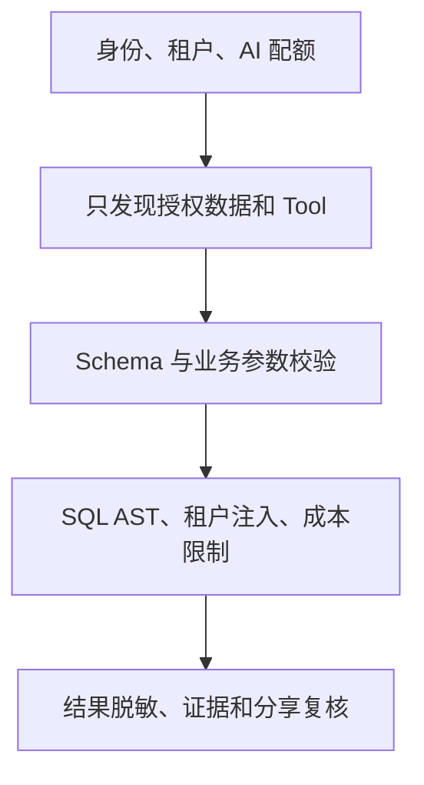

# 权限安全与生产隔离

## 模块定位

本模块保证自然语言入口不会扩大用户原有的数据权限，也不会让不确定模型直接控制生产数据库。

## 一句话结论

> 权限必须贯穿身份、数据发现、计划、SQL、结果和分享；模型只提出受限能力调用，凭据、租户注入、SQL 审查和执行由确定性后端完成。

## 第一性原理

自然语言更方便，但不能成为权限旁路。Tool Call 和模型输出都是不可信输入；无法确认权限时必须 fail closed。安全不是在 SQL 执行前加一次正则，而是端到端边界。

## 五层安全边界

### 1. 模型调用前

验证 JWT、租户、成员状态、AI 能力开关和配额。无权请求不消耗模型和查询资源。

### 2. 数据与能力发现

领域路由和 Schema Linking 只能看到用户有权访问的数据集、字段和 Capability Bundle。不要先把全部 Schema 给模型再期待它自觉忽略。

### 3. Tool 参数

Tool 使用严格 Schema、枚举和 Validator。`tenant_id`、用户和权限上下文由服务端注入，不允许模型填写；未声明字段和非法组合直接拒绝。

### 4. SQL 与执行

- 只允许 `SELECT`、只读事务和受限函数；
- AST 检查表、字段、系统表和子查询；
- 强制注入租户/行级条件；
- 限制超时、行数、扫描量、并发和成本；
- 凭据只存在连接器和密钥系统中；
- 支持取消和审计。

### 5. 结果与分享

敏感字段脱敏，ChartSpec 禁止 SQL、JWT、租户密钥等内容。保存、分享、回写和看板刷新时重新校验源数据权限，不能因结果资产而扩大权限。

## 生产隔离

默认分析快照在轻量湖仓执行。Live Read 优先连接客户只读副本或分析库；客户只有生产主库时，只开放小范围、低成本、可取消的查询。

## 失败语义

| 状态 | 含义 |
|---|---|
| `PERMISSION_DENIED` | 无权访问资源或字段 |
| `INVALID_PLAN` | 指标、维度或参数组合非法 |
| `QUERY_REJECTED` | AST、成本或扫描限制未通过 |
| `SENSITIVE_OUTPUT` | 输出包含禁止披露信息 |
| `FAILED_CLOSED` | 权限依赖不可用，默认拒绝 |

权限问题不得通过换表、删条件或重写 SQL 自动修复。

## 钢人比较

完全封闭的业务 API/Tool 安全性最高、可验证性强，但长尾分析能力弱；任意 SQL 最灵活但风险大。数驭穹图以 SemQL、受控 Schema 和查询网关形成中间路线。

## 逆向检查

即使 SQL 是 `SELECT`，仍可能通过大扫描拖垮数据库、读取敏感列、利用函数外传数据或绕过租户条件。只读不等于安全。

## 边际决策

第一版必须先实现租户隔离、授权 Schema、只读 AST、超时、行数限制和审计；复杂列脱敏策略和细粒度 ABAC 根据真实客户需求扩展。

## 面试标准回答

### 20 秒

> 模型不持有数据库凭据，只能看到当前用户授权的数据和 Tool。后端负责租户注入、严格参数校验、只读 AST、超时扫描限制、结果脱敏和审计，权限不确定时失败关闭。

### 60 秒

> 安全贯穿完整链路。模型调用前验证身份、租户和 AI 权限；Schema Linking 只检索授权数据；Tool Call 使用严格 Schema，租户和用户由服务端注入；SQL 执行前通过 AST 检查语句、表、字段和函数，再施加只读事务、超时、扫描量、并发和行数限制。默认查询轻量湖仓，实时模式优先只读副本。最终结果还要脱敏，分享、回写和刷新时重新校验权限。任何无法确认的权限状态都 fail closed。

## 高频追问

### 只读账号是否已经足够？

不够。只读 SQL 仍可能全表扫描、读取敏感字段、耗尽连接或越过租户边界。

### 租户条件由模型写可以吗？

不可以。必须由认证上下文和查询层强制注入，模型不能删除或替换。

### 为什么不让模型直接连接客户数据库？

模型是非确定性组件，无法可靠承担凭据、权限、成本和业务事实边界；应通过受控查询层执行。

## 恢复脚本

> 先鉴权 → 只见授权 → 参数不可信 → SQL 强校验 → 结果再过滤 → 全程审计

## 闭卷自测

1. 为什么只读不等于安全？
2. tenant_id 为什么不能由模型传入？
3. 权限系统不可用时怎么办？
4. 分享聚合结果为什么还要复核权限？
5. Snapshot 如何降低生产风险？

