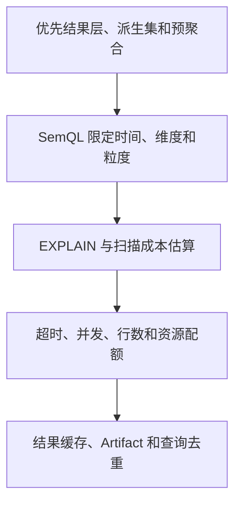

# 查询性能与成本控制

## 模块定位

本模块解决嘉为面试中的核心追问：多表 JOIN、慢 SQL 和中小企业数据库能力较弱时，如何避免影响正常业务。

## 一句话结论

> 性能控制不是 SQL 生成后的补救，而是从选表、预聚合、SemQL、成本预估到运行时配额的完整查询预算体系。

## 第一性原理

一次查询的业务价值有限，不能无限消耗扫描、连接、内存和模型成本。系统应先回答：能否使用更高层结果表？是否真的需要明细？查询代价是否与用户目标匹配？

## 查询成本从哪里来

- 选错明细表，扫描远大于所需；
- 缺少分区或时间过滤；
- 多个一对多 JOIN 造成数据膨胀；
- 跨源数据无法下推，产生大量搬运；
- 模型重复执行相同查询；
- 大结果全部进入模型上下文；
- 多轮 Agent 重试放大数据库和 Token 成本。

## 分层控制

### 查询前

- 按结果层 > 汇总层 > 明细层选择；
- 强制时间范围和分区条件；
- 检查 JOIN 键、基数和过滤下推；
- 对高成本计划执行 EXPLAIN；
- 超预算时拒绝、缩小范围或转异步。

### 查询中

- 设置执行超时、内存、扫描量和结果行数；
- 按租户限制并发和队列；
- 支持取消；
- 无依赖子查询可以并发，但写回顺序确定；
- Snapshot 在独立 DuckDB worker 中执行，Live Read 使用更严格预算。

### 查询后

- 同一回合相同规范参数去重；
- 对稳定数据使用带版本的结果缓存；
- 大结果外置为 Artifact，只向模型提供聚合和少量样例；
- 记录数据库、Tool、模型和端到端各段耗时。

## 多表 JOIN

执行前必须知道：

- 每张表的粒度；
- JOIN 键是否唯一；
- 一对一、一对多还是多对多；
- 过滤应在 JOIN 前还是后；
- 聚合应在 JOIN 前还是后。

门店收入表和成本明细表如果都包含一对多记录，直接 JOIN 后再求和会产生笛卡尔式放大。正确做法通常是各自先聚合到门店＋时间粒度，再进行关联。

## 慢查询处置

> 发现 → 取消/限流 → 查看计划和指标 → 定位扫描、JOIN、锁或资源 → 改表/索引/预聚合 → 回放验证 → 加入成本规则

不能把“加索引”当作万能回答；湖仓中的 Parquet 更关注分区裁剪、列裁剪、文件大小和预聚合，源库才可能涉及索引。

## 钢人比较

完全开放即席查询最灵活，适合专业分析师和独立分析集群；强白名单聚合性能最可控，但长尾弱。项目对高频指标使用派生集/预聚合，对长尾 SemQL 使用成本门禁。

## 逆向检查

即使 EXPLAIN 估算不高，运行时也可能因数据倾斜、并发、缓存失效和统计信息过期变慢，因此必须有硬超时、取消和租户配额。

## 边际决策

优先优化选表、分区、JOIN 粒度和重复查询，再考虑替换数据库或建设复杂分布式引擎。存储选型只有在真实数据量和并发成为瓶颈时才升级。

## 面试标准回答

### 20 秒

> 我们通过结果层优先、强制分区、JOIN 基数校验、EXPLAIN 成本门禁、超时扫描并发限制和查询去重控制性能；默认分析在轻量湖仓执行，不让慢 SQL 直接打生产库。

### 60 秒

> 性能从生成前控制。Schema Linking 优先选择已经聚合的数据集，SemQL明确时间、维度和粒度，SQL 生成后检查分区、JOIN 键和基数，对复杂查询执行 EXPLAIN，超过预算就缩小范围或异步执行。运行时限制超时、扫描量、内存、返回行数和租户并发，并支持取消。同一回合的相同查询去重，大结果外置为 Artifact。多表关联时先把各表聚合到共同粒度再 JOIN，避免一对多膨胀。默认在湖仓执行，实时只读路径使用更严格预算。

## 高频追问

### 慢 SQL 会不会影响写入？

打到生产主库时可能占用 CPU、IO、连接和锁资源。因此默认湖仓或只读副本，并设置资源预算和取消能力。

### 多表 JOIN 一定慢吗？

不一定，关键是扫描规模、过滤下推、JOIN 基数、数据分布和执行引擎；更危险的是算得快但数据被放大。

### 为什么不用缓存解决？

缓存只能减少重复查询，不能修复错误口径和低效首次查询；还必须绑定数据版本和权限。

## 恢复脚本

> 先选对层 → 限定范围 → 验 JOIN → 估成本 → 硬预算 → 去重外置

## 闭卷自测

1. 多表 JOIN 为什么会把金额放大？
2. EXPLAIN 之后为什么仍需要硬超时？
3. 湖仓查询与源库查询分别怎样优化？
4. 结果缓存必须绑定什么？
5. 什么时候才需要升级分布式引擎？

