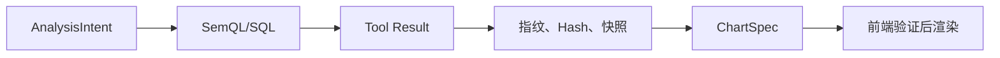

# 结果验证与证据绑定

## 模块定位

本模块位于查询执行之后、图表交付之前，回答“怎样证明结果不仅能显示，而且值得相信”。

## 一句话结论

> SQL 成功、JSON 合法都不代表结果可信；系统必须验证粒度、JOIN、单位、完整性，并把最终图表绑定到本轮真实查询及数据版本。

## 第一性原理

LLM 可以正确调用 Tool 后抄错数字，也可以把上一轮结果混入本轮图表。结构化输出只能保证形状，不能保证值的来源。可信 BI 需要从问题、计划、查询、结果到展示的 Provenance。

## 执行后验证

| 检查 | 目的 |
|---|---|
| 返回列与计划一致 | 防止答非所问 |
| 粒度与维度一致 | 防止重复或缺失 |
| JOIN 基数与行数变化 | 发现膨胀 |
| 汇总与分组互核 | 发现漏组或重复 |
| 单位、币种、比例 | 防止量纲错误 |
| 完整性与截断 | 不把部分结果说成全量 |
| 数据版本与新鲜度 | 不把旧数据说成当前 |
| 异常值范围 | 发现明显数据质量问题 |

## Provenance

每次成功查询产生：

- `call_id`：本轮具体调用；
- `normalized_arguments`：规范参数；
- `query_fingerprint`：稳定查询指纹；
- `result_hash`：结果内容身份；
- `dataset_snapshot`：数据版本；
- `semantic_version`：指标口径版本；
- `complete/truncated`：完整性；
- `row_count/group_count`：结果规模。



## Evidence Binding

ChartSpec 只允许最小业务字段：图表类型、标题、维度、指标、单位、数据行和 Evidence。前端验证：

```text
ChartSpec.call_id == 已完成 Tool Call.call_id
ChartSpec.query_fingerprint == Tool Call.query_fingerprint
ChartSpec.result_hash == Tool Result.result_hash
```

绑定失败时只降级对应图表块为表格或错误提示，不把它当作可信图表；正文中的确定性结果仍可保留。

## 失败语义

| 状态 | 处理 |
|---|---|
| 空结果 | 区分真实为空、过滤过严和数据缺失 |
| 部分结果 | 标记 `PARTIAL_RESULT`，禁止全量断言 |
| 数据过期 | `STALE_DATA`，拒绝当前结论 |
| 验证不一致 | `RESULT_VALIDATION_FAILED` |
| 证据绑定失败 | 降级图表，不伪造修复 |

## 钢人比较

只让 LLM 根据 Tool Result 生成图表实现简单，很多场景也能工作；Evidence Binding 增加协议、Hash 和前端校验成本。对于经营指标和可分享看板，这一成本换来了审计、回放和防数字幻觉能力。

## 逆向检查

即使 Hash 匹配，也只能证明图表绑定了某次查询，不能证明查询口径本身正确。因此 Evidence 必须与语义版本、权限和结果验证一起使用。

## 边际决策

第一版先对正式图表、报告和看板强制绑定；普通探索性文本至少显示来源、口径、时间和完整性。不要为所有聊天片段建立同等重型证据。

## 面试标准回答

### 20 秒

> 查询后先检查粒度、JOIN、单位、完整性和快照，再用 call_id、查询指纹和结果 Hash 把图表绑定到本轮真实结果；绑定失败就降级，不让模型补数字。

### 60 秒

> SQL 执行成功后，我们会验证返回列是否符合 AnalysisIntent、聚合粒度是否正确、JOIN 是否膨胀、汇总和分组是否互核、单位币种是否一致，以及结果是否完整和新鲜。每次查询生成 call_id、规范参数、查询指纹、结果 Hash、数据快照和语义版本。模型生成的 ChartSpec 必须携带这些 Evidence，前端与本轮 Tool Result 比对后才能渲染。这样能够防止模型抄错数字、混用历史结果或基于截断数据做全量结论。

## 高频追问

### 结果 Hash 能证明业务答案正确吗？

不能。它证明展示绑定了查询结果；业务正确性仍依赖语义、查询路径和结果校验。

### 图表绑定失败为何不重试让模型修？

可以有限修复结构错误，但不能让模型在缺少可信证据时猜数据；安全降级优先。

### 什么是完整性证据？

是否全量、是否截断、源数据范围、行/分组数、刷新时间和失败数据源等元信息。

## 恢复脚本

> 执行成功不够 → 验粒度与完整 → 生成指纹和 Hash → 图表绑定 → 失败降级

## 闭卷自测

1. JSON Schema 能保证什么，不能保证什么？
2. Result Hash 的边界是什么？
3. 部分结果为何不能生成最高/最低结论？
4. 图表绑定失败如何处理？
5. 语义版本为什么属于 Provenance？

