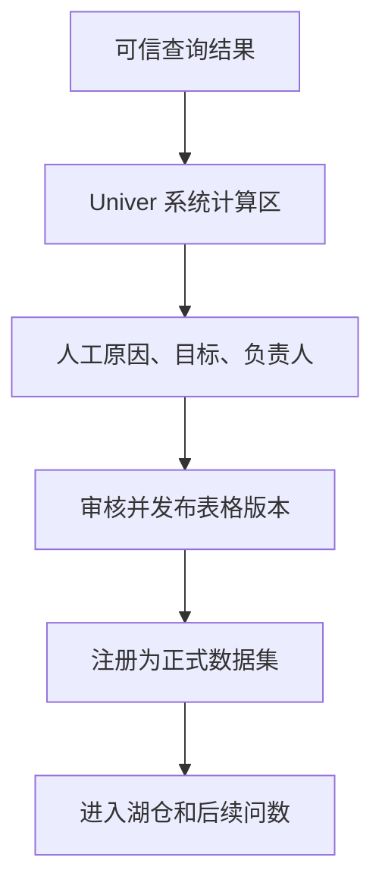

# Univer 在线表格与协作闭环

## 模块定位

本模块解释项目的产品差异化：问数结果怎样进入团队工作，并再次成为可分析的数据资产。

## 一句话结论

> Univer 是在线表格交互层；查询结果进入只读系统区，用户在人工区补充业务判断，而自建表格经过 Schema、主键、权限和版本发布后可以注册为正式数据源。

## 第一性原理

业务决策既需要系统计算，也需要人提供原因、目标、负责人和判断。若把两者混在同一可随意编辑区域，查询事实会被污染；若分析结果只能看不能协作，又会回到截图和 Excel 断链。

## 双向闭环



### 作为结果载体

- 系统计算区保存查询列，默认只读；
- 人工协作区允许填写备注、原因、目标和负责人；
- 使用稳定业务主键关联，而不是按行号覆盖；
- 刷新只更新系统区，保留人工区；
- 保存查询定义、快照、语义版本、创建者和刷新状态。

### 作为数据源

Univer 本身是前端表格能力，不是数据库。表格数据由后端持久化，只有完成以下步骤才成为正式数据源：

```text
草稿编辑
→ 字段名和类型校验
→ 主键、必填、唯一约束
→ 权限和负责人确认
→ 发布不可变版本
→ 转换为结构化数据集/Parquet
→ 注册目录和语义资产
```

预算、销售目标、活动计划和人工分类适合走这条路径。

## 版本与刷新

表格状态为 `DRAFT → VALIDATING → PUBLISHED → SUPERSEDED`。正式分析绑定发布版本；新编辑不会静默改变历史报告。刷新失败保留上一成功版本，同时明确标记过期和失败原因。

## 冲突与回写

- 以稳定主键做 upsert；
- 版本号执行乐观并发控制；
- 系统区和人工区采用列级所有权；
- 删除、字段改名和类型变化触发治理任务；
- 相同查询回写使用幂等键，避免重复创建行。

## 钢人比较

直接导出 Excel 最简单、用户熟悉；传统 BI 看板刷新稳定。Univer 增加协作和版本复杂度，但让人工知识和系统结果处于同一可追溯工作区，并能再次参与分析。

## 逆向检查

即使表格成功保存，也可能字段混合类型、主键重复、公式结果未固化、权限过宽或人工改坏系统列。因此“能编辑”与“可作为可信数据源”必须分开。

## 边际决策

第一版只做结构化表格、系统区/人工区、版本发布和稳定主键回写，不扩张为完整 Office、项目管理或复杂审批平台。

## 面试标准回答

### 20 秒

> Univer 一方面承载查询结果，系统计算区只读、人工区补充业务判断；另一方面，自建表格在校验字段、主键、权限和版本后，可以发布为正式数据源并进入湖仓。

### 60 秒

> 问数结果可以回写到 Univer，但系统计算列和人工协作列分开管理。刷新时系统按照稳定业务主键更新计算区，人工填写的原因、目标和负责人不会被覆盖。用户也可以直接创建预算、计划等表格，但普通草稿不能马上参与正式分析，必须通过字段类型、主键、约束和权限校验，生成发布版本，再转换为结构化数据集并登记语义资产。这样形成“查询—协作—发布—再查询”的闭环，同时避免人工修改污染查询事实。

## 高频追问

### 为什么不允许用户直接修改查询结果？

修改后结果不再等于源数据查询，会破坏 Provenance；人工信息应进入独立协作列。

### 刷新时如何保留人工备注？

按稳定业务主键匹配，系统只更新自己拥有的列，人工列独立版本化。

### Univer 为什么不能直接算数据库？

它提供表格编辑和渲染；可信查询需要后端持久化、Schema、版本、权限和查询引擎。

## 恢复脚本

> 结果进系统区 → 人工填协作区 → 主键安全刷新 → 审核发布版本 → 再成数据源

## 闭卷自测

1. 系统区与人工区为何分离？
2. 表格怎样成为正式数据源？
3. 刷新为什么不能按行号覆盖？
4. 表格发布版本解决什么问题？
5. 项目为什么不做完整办公套件？

