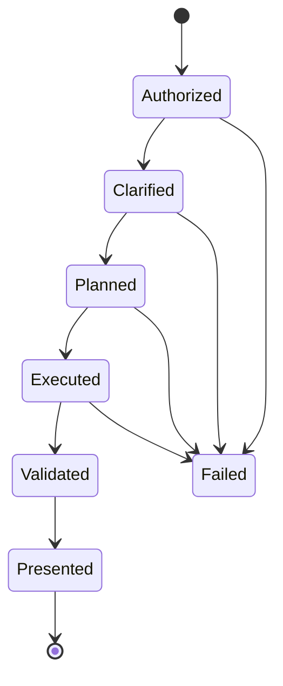

# Workflow、Agent 与 Tool 契约

## 模块定位

本模块定义哪些步骤由代码固定控制，哪些局部决策交给模型，以及 Tool 如何连接非确定性 Agent 与确定性业务系统。

## 一句话结论

> 主链路使用 Workflow 和状态机守住权限、语义、预算和停止条件；模型只处理语言理解、候选选择和结果表达，Tool 是经过校验的业务契约。

## 第一性原理

如果流程可以画成有限状态机，就不应让模型每次重新发明流程；如果输入语言和长尾组合无法穷举，又不应全部写死。可靠方案是确定性骨架＋受限 Agent 决策。

## 职责划分

| 确定性代码 | 模型 |
|---|---|
| 身份、租户、权限 | 理解自然语言 |
| 数据集和语义版本 | 抽取候选指标实体 |
| Capability Bundle | 在授权候选中局部选择 |
| 前置条件和状态转移 | 生成用户可理解的解释 |
| 查询、校验、证据 | 选择展示意图 |
| 重试预算和停止条件 | 处理非固定表达 |

## 混合 Runtime

每个状态定义允许 Tool、必须证据、最大重试和失败语义。未完成前置条件不能跳到最终回答。

## Tool 契约

一个生产 Tool 必须明确：

1. 它解决什么业务任务；
2. 哪些参数和组合合法；
3. 返回哪些事实与完整性元数据；
4. 空结果、歧义、拒绝和失败如何区分。

`tenant_id` 等程序已知参数由服务端注入。Tool Call 经过 Schema、枚举和 Validator 后才能执行。工具不应只是把所有内部 API 原样暴露给模型。

## Capability Bundle

根据 AnalysisIntent 固定本轮可用、禁用和必需的能力。例如聚合图表只能使用受治理聚合能力，不能拉一页明细让模型自己计算。Bundle 版本和 Tool Schema Hash 写入轨迹，便于缓存、审计和评测。

## 重试与停止

- 模型未选必需 Tool：最多一次明确纠偏；
- 工具参数格式错误：Validator 返回可修复错误；
- 权限、口径、数据过期：直接停止；
- 同参数重复调用：回合内去重；
- 达到 LLM、Tool 或时间预算：返回明确部分状态。

## 钢人比较

固定 Pipeline 最稳定、延迟低，但难处理开放语言；自由 Agent 灵活，但路径、成本和边界不稳定。混合 Runtime 的代价是状态和规则设计复杂，收益是可验证与可调试。

## 逆向检查

即使工具都是只读，Agent 仍可能反复调用、选择错误能力、用明细代替全量聚合或在缺证据时提前结束，因此还需要状态机和预算。

## 边际决策

工具少且边界清楚时保持直接调用；只有工具面明显增大、Schema 挤占上下文或误选上升时，才引入 Tool Search 和延迟加载。

## 面试标准回答

### 20 秒

> 我们采用 Workflow＋Agent 的混合 Runtime。代码控制权限、状态、能力包、预算和证据，模型处理语言理解和局部选择；Tool Call 始终作为不可信输入校验。

### 60 秒

> 问数流程能够表示成有限状态机，所以权限、澄清、计划、执行、验证和展示由 Workflow 控制，每个状态定义允许的 Tool、前置条件、停止条件和重试预算。模型负责理解自然语言、抽取指标实体、在当前 Capability Bundle 内选择局部工具并组织回答。Tool 不是任意数据库代理，而是明确业务任务、参数边界、返回事实和失败语义的契约。服务端注入租户等上下文，Schema 和 Validator 校验模型参数。这样既保留自然语言灵活性，也避免完全自主 Agent 的路径和成本失控。

## 高频追问

### 为什么不直接用多 Agent？

当前任务是一条有明确状态和共享事实的问数链，多 Agent 会增加通信、状态一致性和评测成本，没有足够边际收益。

### Tool 越细越好吗？

过细会增加路由和往返，过粗会降低权限、审计和重试粒度；按稳定业务能力划分，并用评测调节。

### MCP 解决了什么？

它统一 Agent 与工具服务的上下文交换，但不自动解决权限、状态、幂等、语义和评测，这些仍由应用负责。

## 恢复脚本

> Workflow 守主线 → Agent 解语言 → Bundle 限能力 → Tool 是契约 → Validator 执行 → 预算停止

## 闭卷自测

1. 哪些步骤必须由代码控制？
2. Tool Call 为什么不可信？
3. Capability Bundle 有什么作用？
4. 为什么当前不需要多 Agent？
5. MCP 没有解决哪些问题？

