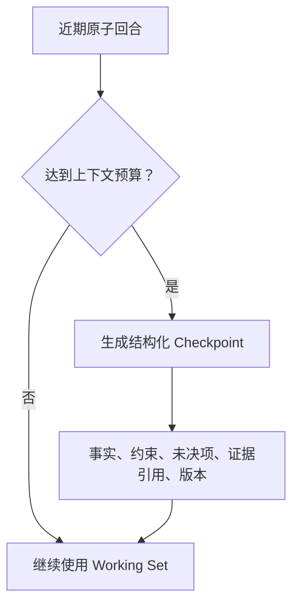

# 多轮上下文与任务恢复

## 模块定位

本模块解释多轮问数时怎样保留语义连续性，又避免历史数据冒充当前事实，并在断线或上下文过长后恢复任务。

## 一句话结论

> 历史上下文负责记住“刚才在讨论什么”，当前事实必须重新查询；会话、执行轨迹、大结果和证据分别管理，不能混成一个无限增长的 messages 数组。

## 第一性原理

用户下一轮说“那华南呢”，系统需要继承上一轮的指标、时间和分析方式；但上一轮查询出的销售额可能已经更新。语义可以复用，带“当前”含义的业务事实不能无条件复用。

## 五层状态

| 状态 | 作用 |
|---|---|
| Visible Memory | 用户看到的问题和最终结果 |
| Trajectory | 模型、Tool、重试、错误和事件 |
| Working Context | 本轮真正提供给模型的高信号内容 |
| Evidence Memory | 历史结论对应的查询和版本引用 |
| Current Business Truth | 本轮重新查询获得的事实 |

## Session Ledger

每个会话以原子回合记录：

```text
User Message
→ AnalysisIntent
→ Tool Call
→ Tool Result
→ Validation/Evidence
→ Assistant Final
→ Turn Committed
```

Tool Call 没有 Tool Result 时不能作为完整历史重放。页面断线只影响展示，服务端任务继续，重连根据 Ledger 查询状态和事件游标。

## Artifact

大规模明细、文件和 Tool Result 不直接反复进入模型上下文，而是保存为 Artifact。上下文只保留：参数、口径、聚合事实、完整性、少量样例、`artifact_id` 和 Hash。需要再次分析时通过受控工具按权限读取。

## Compaction 与 Checkpoint



Checkpoint 类似“较早状态快照＋最近增量”，不能只生成一段模糊聊天摘要。压缩优先保证关键约束和证据召回，再去除旧 Tool Result。

## 多轮策略

- “只看华南”：继承指标和时间，替换区域过滤，重新查询；
- “改成按月”：修改维度，重新生成 SemQL；
- “为什么和刚才不同”：比较数据快照、语义版本和参数；
- “把上一张图加入报告”：验证 Evidence 引用仍完整，不必重新编造图表；
- 当前数据源已更新：重新查询，旧结果仅作历史证据。

## 失败与恢复

| 故障 | 恢复 |
|---|---|
| SSE/页面断开 | 根据 session/turn/event cursor 重放 |
| 服务重启 | 从已提交 Ledger 和任务状态恢复 |
| Tool 已执行但结果未保存 | 查询权威状态或按查询指纹安全重放 |
| 上下文过长 | Checkpoint＋近期 Turn＋按需 Artifact |
| 旧数据被复用 | Current Truth 强制重新查询 |

## 钢人比较

完整重放实现简单、语义信息多，适合短对话；滑动窗口成本低但容易遗忘长期约束。分层上下文复杂度更高，但能分离用户体验、任务恢复、证据审计和事实新鲜度。

## 逆向检查

即使 Checkpoint 保存成功，也可能压掉未决问题、使用旧 Schema 版本或留下孤立 Tool Call。压缩必须通过恢复测试和长对话 Eval，而不是只看摘要是否流畅。

## 边际决策

第一版先实现原子回合、近期窗口和大结果外置；只有真实长对话达到预算时再引入复杂 Token-aware 召回和自动 Compaction。

## 面试标准回答

### 20 秒

> 多轮中复用指标、实体和用户约束，但当前业务数据重新查询。我们用 Session Ledger 保存原子回合，大结果外置为 Artifact，上下文超限后用结构化 Checkpoint 恢复。

### 60 秒

> 我们把可见会话、执行轨迹、模型 Working Context、历史 Evidence 和当前业务事实分开。用户说“那华南呢”时，系统继承上一轮指标和时间，只替换区域过滤，但销售额等当前事实必须重新查询。每个回合以 User、Intent、Tool Call、Tool Result、Evidence 和 Final 原子提交。大结果外置为 Artifact，只把口径、聚合和引用送入模型。上下文接近预算时生成包含约束、未决项、证据和版本的 Checkpoint，再保留最近完整回合。断线后根据 Ledger 和事件游标恢复。

## 高频追问

### 为什么不能直接复用上一轮 Tool Result？

它可能已经过期，只能作为理解和历史证据；当前结论应重新读取权威数据。

### Checkpoint 与聊天摘要有什么区别？

Checkpoint 是结构化恢复状态，保存约束、未决项、证据和版本，而不只是自然语言概括。

### Tool 执行两次怎么办？

查询本身只读，但仍通过查询指纹去重；有副作用的回写还必须使用业务幂等键和权威状态查询。

## 恢复脚本

> 语义可继承 → 当前数重查 → 回合原子记账 → 大结果外置 → 超限做 Checkpoint

## 闭卷自测

1. 多轮语义和当前事实为什么要分开？
2. Atomic Turn 包含什么？
3. Artifact 解决什么问题？
4. Checkpoint 必须保留哪些信息？
5. 页面断线如何恢复？

