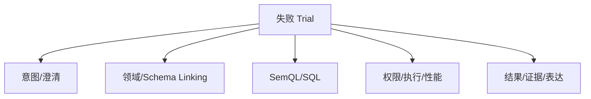

# Eval、可观测性与持续优化

## 模块定位

本模块回答“Text-to-SQL 准确率不高怎样优化”以及“改了模型、Prompt、路由或知识库后，怎样证明系统真的变好”。

## 一句话结论

> 最终答案正确不等于 Agent 正确；评测必须分开验证意图、路由、语义计划、SQL、结果、证据、权限和运行成本，并用失败归因驱动单点优化。

## 第一性原理

同一个正确数字可能来自正确查询、错误路径碰巧相同、部分数据、历史记忆或模型猜测。只让 LLM Judge 看最终文本无法区分这些情况，因此必须同时评价过程证据和环境结果。

## 五层评测

| 层 | 验证内容 | 适合的 Grader |
|---|---|---|
| Tool Contract | 能力、参数、前置条件和禁用路径 | 确定性规则 |
| Oracle | 行、数值、聚合、完整性和快照 | 数据库/代码 |
| Presentation & Evidence | 图表和文字是否绑定真实结果 | 规则＋局部 Judge |
| Rubric | 是否理解任务、表达清楚、妥善澄清 | LLM Judge＋人工校准 |
| Cost & Stability | Tool、Token、延迟、重试、pass^k | 指标系统 |

## 数据集设计

从真实业务和失败记录建立：

- Capability：探索当前能力上限；
- Regression：已稳定能力，接近满分；
- Holdout：防止针对已知题过拟合；
- Adversarial：权限、Prompt Injection、危险 SQL 和敏感数据；
- “应澄清/不应澄清”成对用例；
- 多轮、空结果、部分结果、Schema 漂移和超时用例。

## 错误分类



按错误类型修改对应层，避免用更长 Prompt 掩盖所有问题。

## 可观测性

一次请求应形成统一 Trace：

```text
HTTP Request
→ Auth
→ LLM Operation
→ Tool/MCP
→ Query Engine
→ Validation
→ Presentation
```

记录每次真实模型调用的 provider、model、context hash、Tool Bundle、输入/输出/缓存 Token、TTFT、总耗时和错误；数据库记录排队、执行、扫描量和返回规模。这样才能区分模型慢、工具慢和数据库慢。

## 持续优化闭环

> 线上失败/用户修正 → 归因 → 转为评测用例 → 单变量改动 → Regression＋Holdout → 灰度 → 线上监控

P0 权限和证据用例一项失败即阻断发布，不能用平均分抵消。

## 钢人比较

只看 SQL 执行率成本低、反馈快；完整 Agent Eval 建设成本高。项目分层投入：先覆盖权限、核心口径和黄金问题，再扩展语言质量和成本评测。

## 逆向检查

评测集本身可能错误、泄漏到 Prompt、只覆盖正例或被反复调参过拟合。需要 Preflight、Holdout、人工抽查和真实轨迹阅读。

## 边际决策

不等待几百条样本才开始。先用 20～50 个高价值任务覆盖主链路和边界，随着线上 Bad Case 增长。优先改善最大错误来源，而非同时更换模型、Prompt 和检索策略。

## 面试标准回答

### 20 秒

> 我们不只看 SQL 执行率，而是分层评测 Tool 路径、Oracle 结果、证据展示、语义质量和运行成本，再按意图、选表、SQL、执行和结果错误归因优化。

### 60 秒

> 每个评测任务包含输入、权限和数据快照、期望业务结果、允许的能力路径和评分规则。确定性 Grader 检查 Tool Contract、参数、SQL 结果、完整性和 Evidence；LLM Judge 只评估表达、解释和交互体验，并用人工样本校准。同时记录 Tool 数、Token、延迟和多次运行 pass^k。失败按意图澄清、领域路由、Schema Linking、SemQL、SQL、权限执行、结果证据分类。修复后跑 Regression 和未参与调参的 Holdout，再灰度上线。

## 高频追问

### SQL 字符串不同怎么判断都正确？

优先比较规范化逻辑计划和在固定快照上的执行结果，而不是要求字符串完全相同。

### LLM Judge 可靠吗？

只用于难以确定性断言的语义质量，并通过明确 Rubric、重复采样和人工评分校准。

### pass@k 与 pass^k 有何区别？

pass@k 关注多次中至少一次成功，pass^k 关注连续多次全部成功；面向用户的生产稳定性更应关注后者。

## 恢复脚本

> 任务有标准 → 过程和结果分评 → 错误能归因 → 单变量修复 → 回归再上线

## 闭卷自测

1. 为什么最终数字正确仍可能评测失败？
2. 五层 Eval 分别验证什么？
3. 什么内容不应交给 LLM Judge？
4. 如何防止评测过拟合？
5. 怎样决定下一步优化什么？

