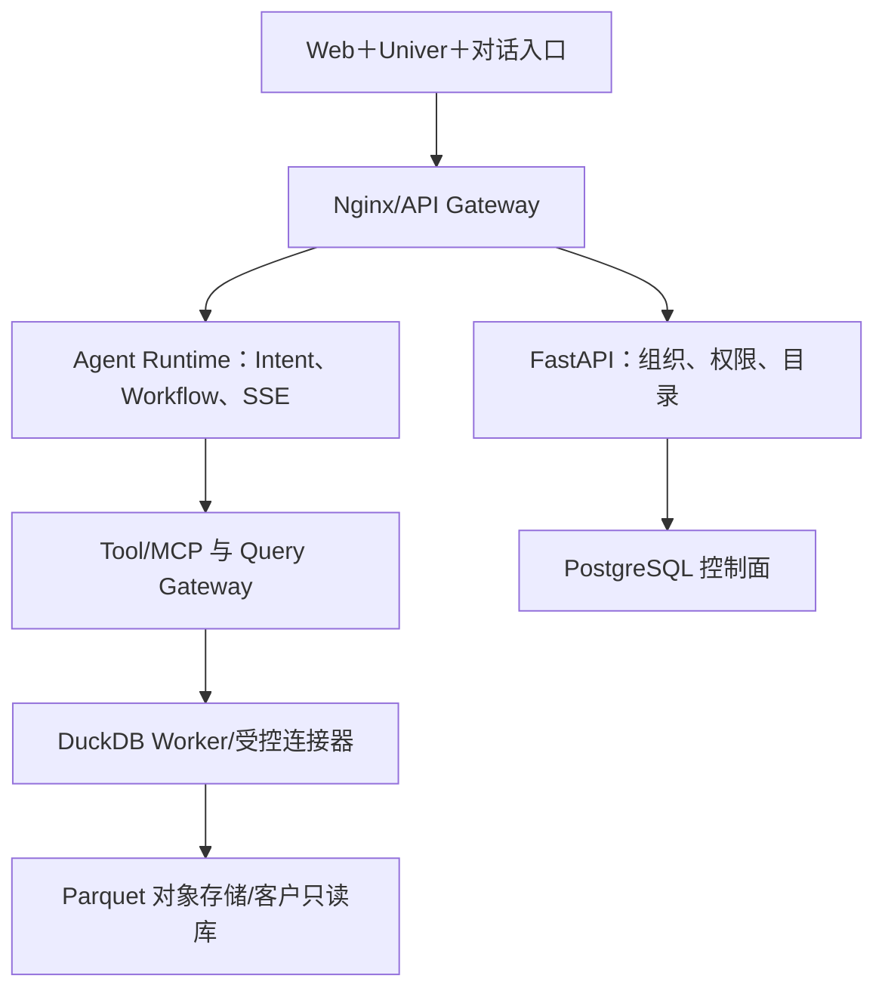

# 系统架构、部署与故障处理

## 模块定位

本模块把逻辑链路映射为实际组件和部署单元，回答前端、FastAPI、PostgreSQL、对象存储、DuckDB、Worker 和 Agent 如何协作。

## 一句话结论

> 系统采用控制面与数据面分离：PostgreSQL 管理租户、权限、目录和任务，Parquet/对象存储保存分析数据，DuckDB Worker 执行查询，Agent Runtime 只通过受控 Tool 调用这些能力。

## 总体架构

## 组件职责

| 组件 | 职责 |
|---|---|
| Web＋Univer | 会话、表格、图表、进度和协作 |
| Nginx/Gateway | TLS、统一入口、请求 ID、静态资源 |
| FastAPI | 企业、成员、权限、数据目录、语义资产、报告 |
| Agent Runtime | Context、AnalysisIntent、状态机、Tool Loop、SSE |
| Connector Worker | 快照、增量同步、Schema 抽取、重试 |
| Query Worker | DuckDB 查询、AST/成本校验、结果 Artifact |
| PostgreSQL | 控制面状态、任务、版本、审计和索引 |
| 对象存储 | Parquet、上传文件、大结果和版本快照 |
| Redis/队列（可选） | 短缓存、限流、任务分发和事件通知 |

## 部署路线

第一版面向中小企业可使用 Docker Compose：Web、API、Agent、Worker、PostgreSQL、对象存储和网关分容器部署。DuckDB 是进程内分析引擎，应由隔离 Worker 执行，并限制 CPU、内存和临时磁盘。

规模扩大后再迁移到 Kubernetes：API/Agent 无状态扩容，Connector 和 Query Worker 按队列扩容，PostgreSQL 与对象存储使用托管或独立高可用服务。

## 一次请求

1. 网关生成 request_id；
2. FastAPI 验证身份、租户和权限；
3. Agent Runtime 构造 Working Context 与 Capability Bundle；
4. Tool Server 校验参数并调用 Query Gateway；
5. Query Worker 读取 Parquet 或客户只读库；
6. 结果写入 Artifact，摘要返回 Runtime；
7. Evidence 校验后通过 SSE 发送文本和图表；
8. Ledger、Trace 和指标提交。

## 故障处理

| 故障 | 用户语义 | 处理 |
|---|---|---|
| 模型超时 | 暂时无法理解/生成 | 有界重试或切备用 Provider，不重复查询副作用 |
| Tool Server 不可用 | 查询能力暂不可用 | 熔断、错误可见、禁止模型猜答案 |
| DuckDB OOM | 查询超预算 | 取消、资源回收、缩小范围或异步 |
| 对象存储不可用 | 数据/Artifact 不可读 | 查询失败关闭，不使用不完整缓存 |
| PostgreSQL 不可用 | 权限与状态不可确认 | 全链路 fail closed |
| SSE 断开 | 前端失联 | 服务端继续，按事件游标恢复 |
| 同步 Worker 失败 | 数据过期 | 重试/断点恢复，数据集标记 stale |

## 一致性原则

- 权限、任务状态和幂等记录以 PostgreSQL 为权威；
- 数据快照通过版本化目录原子发布，不能让查询看到半份分区；
- Worker 先写临时版本，通过校验后更新 current pointer；
- Trace 和日志失败不能影响业务事实提交，但必须告警；
- 关键状态更新使用条件更新，防止多个 Worker 同时完成同一任务。

## 钢人比较

模块化单体＋Compose 交付快、调试简单，适合初期；微服务和 Kubernetes 隔离与扩展更强，但运维成本高。项目先按职责分模块、按必要边界分进程，不为“微服务”提前拆分。

## 逆向检查

所有容器健康不代表业务健康：语义资产可能过期、同步位点可能停滞、查询结果可能部分、模型 Provider 可能降质。因此健康检查要覆盖业务状态而非只看端口。

## 边际决策

先保证任务可恢复、查询资源隔离、数据版本原子发布和端到端 Trace，再考虑跨地域多活和复杂服务网格。

## 面试标准回答

### 20 秒

> Web、FastAPI、Agent Runtime、Connector/Query Worker 分工；PostgreSQL 管控制状态，对象存储存 Parquet 和 Artifact，DuckDB Worker 做隔离分析，通过 Docker 容器部署并由网关统一入口。

### 60 秒

> 系统分控制面和数据面。FastAPI 与 PostgreSQL管理企业、权限、目录、语义、任务和审计；Connector Worker 负责快照和增量；对象存储保存租户隔离的 Parquet；DuckDB Query Worker 在资源限制下执行分析；Agent Runtime 负责 Intent、Workflow、Tool Loop 和 SSE，但只能通过受控 Tool 调用查询层。初期用 Docker Compose 降低运维复杂度，规模增大后再把无状态 API、Agent 和 Worker 迁移到 Kubernetes。权限或控制状态不可确认时 fail closed，数据快照校验后原子发布，页面断线通过 Ledger 和事件游标恢复。

## 高频追问

### 哪些组件容器化？

Web、API、Agent、Tool、Worker、网关均可容器化；PostgreSQL和对象存储可本地容器或生产独立托管。

### DuckDB 如何支持并发？

不让一个进程无限共享，而是通过任务队列和隔离 Worker 控制并发、内存和临时文件；更大规模再替换分布式引擎。

### PostgreSQL 挂了为什么不能继续只读？

租户、权限、语义版本和任务状态无法确认，继续回答可能越权或使用错误版本，所以失败关闭。

## 恢复脚本

> 网关入口 → 控制面鉴权 → Runtime 编排 → Worker 执行 → 对象存储数据 → Ledger/Trace 收口

## 闭卷自测

1. 控制面和数据面分别是什么？
2. DuckDB 为什么放在隔离 Worker？
3. 数据快照如何原子发布？
4. SSE 断开怎样恢复？
5. 什么时候才值得迁移 Kubernetes？

