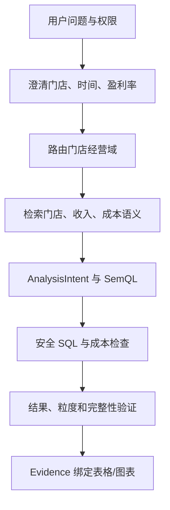

# 门店数与平均盈利率黄金案例

## 面试题

> 连锁企业负责人问：“我有多少家门店？这些门店今年的平均盈利率是多少？”请从用户发送问题开始，讲到系统安全返回可信结果；再选择两个最可能出错的节点，说明如何发现、处理和预防。

## 一句话结论

> 这不是一句话转 SQL，而是权限、口径、Schema、查询、安全、验证和证据共同组成的受控分析链。

## 第一步：先明确业务语义

必须确认或读取已发布定义：

- 门店范围：营业、试营业、暂停、关闭是否计入；
- 时间：自然年、截至当前时刻还是最后完整业务日；
- 利润：收入减哪些成本、税费和退款；
- 盈利率：`利润/收入`；
- “平均”：各门店简单平均，还是 `总利润/总收入`；
- 权限：负责人能够查看哪些区域和门店。

如果企业没有唯一默认口径，系统给出有限候选。经营总盘通常更适合加权口径：

```text
整体盈利率 = SUM(利润) / SUM(收入)
```

简单平均会让小门店和大门店拥有相同权重，只有用户明确需要“典型门店平均表现”时才使用。

## 端到端主线



## 数据与计划

可能使用：

- 门店主数据：门店 ID、状态、区域、开闭店时间；
- 收入事实：支付金额、退款、时间、门店 ID；
- 成本事实：商品成本、运营费用或已确权利润事实；
- 日历维度：自然年和最后完整业务日。

SemQL 示例：

```json
{
  "dataset": "store_operation",
  "metrics": ["active_store_count", "weighted_profit_margin"],
  "dimensions": [],
  "time_range": "current_year_to_last_complete_day",
  "filters": ["store_status=active"],
  "output": ["summary", "store_breakdown"]
}
```

物理查询应先将收入和成本分别聚合到门店＋时间粒度，再关联门店主数据，避免多对多明细 JOIN 放大金额。

## 安全与性能

- 只查询当前用户授权门店；
- 默认在轻量湖仓执行；
- 强制时间和租户过滤；
- 检查 JOIN 基数、扫描量和超时；
- 明细列表与汇总分开，避免无界返回；
- Live Read 只走只读副本或分析库。

## 结果验证

1. 有效门店数量与门店主数据按同口径互核；
2. 每个门店收入、利润和盈利率单位一致；
3. `SUM(门店利润)/SUM(门店收入)` 与整体结果一致；
4. 检查 JOIN 前后门店数和金额变化；
5. 标记数据截止时间、缺失成本门店和部分结果；
6. 表格/图表绑定 call_id、指纹、Hash、快照和语义版本。

## 两个高风险节点

### 风险一：平均盈利率口径错误

- 症状：简单平均与加权结果差异明显；
- 发现：AnalysisIntent 中聚合方式为空或与语义资产不一致；
- 止血：不执行，给用户两个候选；
- 修复：绑定已发布公式和适用场景；
- 验证：加入大店/小店规模悬殊的黄金用例；
- 预防：指标卡片明确禁止模型自行选择聚合方式。

### 风险二：多表 JOIN 导致利润翻倍

- 症状：JOIN 后金额显著大于各源表汇总；
- 发现：执行后行数、基数和汇总互核失败；
- 止血：阻断结果，不生成图表；
- 修复：收入和成本先聚合到同一门店粒度再 JOIN；
- 验证：对比 JOIN 前后总额和门店数；
- 预防：知识卡记录关联基数，SQL Validator 检查危险路径。

## 90 秒面试标答

> 用户发送问题后，系统先验证身份、租户和门店数据权限。接着把问题解析为门店经营域的聚合任务，但不会立即生成 SQL，因为“门店”“今年”和“平均盈利率”都有业务歧义。系统优先读取企业已发布口径；如果盈利率既可能是各门店简单平均，也可能是总利润除以总收入，就给用户有限选项确认。确认后形成 AnalysisIntent 和 SemQL，绑定有效门店、收入、成本、时间和聚合口径。Schema Linking 只加载授权的门店主数据、收入和成本知识卡。SQL 生成时先把收入和成本分别聚合到门店粒度，再 JOIN，经过只读 AST、租户注入、分区、JOIN 基数、EXPLAIN、超时和扫描量校验后在轻量湖仓执行。执行后互核有效门店数、收入、利润、分组和整体盈利率，检查数据完整性和截止时间。最后用 call_id、查询指纹、结果 Hash、数据快照和语义版本绑定表格或图表，再安全返回。最危险的两个节点是盈利率口径选错和多表 JOIN 膨胀，前者靠澄清和指标卡阻断，后者靠共同粒度预聚合与执行后互核发现。

## 连续追问

### 如果用户说“就是平均”，怎么办？

仍然不足，需要展示简单平均和加权口径的业务含义，要求明确选择。

### 某些门店缺少成本数据怎么办？

结果标记不完整，分别报告可计算门店数和缺失门店；不能把缺失成本当作零。

### 数据当天还没同步完怎么办？

使用最后完整业务日或返回 stale/partial 状态，明确截止时间，不宣称实时完整结果。

### 一条 SQL JOIN 很多表会影响生产吗？

默认湖仓执行；实时路径先预算成本，优先只读副本，并限制扫描、超时和并发。

### 结果如何保存到 Univer？

门店计算结果进入系统区，用户在人工区填写原因和负责人；按门店 ID 刷新，查询定义和 Evidence 随表保存。

## 恢复脚本

> 先问口径 → 再找语义 → 生成计划 → 同粒度 JOIN → 安全执行 → 互核证据 → 协作沉淀

## 闭卷自测

1. 平均盈利率为何至少有两种定义？
2. 收入和成本为什么先分别聚合？
3. 缺成本门店如何处理？
4. 什么证据允许图表渲染？
5. 请在两分钟内完整模拟这条链路。

