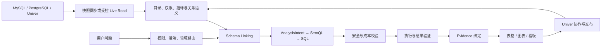

# 项目表达与面试题库

## 模块定位

这份文档把前十五个模块压缩成可在面试中调用的表达。目标不是背固定台词，而是用一条主线稳定回答，再按面试官关注点下钻。

## 一句话结论

> 数驭穹图不是“让大模型直接查数据库”，而是面向中小企业业务团队，把分散数据、业务语义、受控查询、结果证据和在线协作连接成可信分析闭环。

## 三层项目介绍

### 20 秒版本

> 数驭穹图是一套面向中小企业业务团队的可信问数与协作分析平台。系统将企业选定数据同步到轻量湖仓，也支持受控查询只读副本；再通过意图澄清、语义检索、SemQL、SQL 安全执行和结果验证，把自然语言问题转成带证据的表格、图表和协作数据资产。

### 90 秒版本

> 中小企业的数据常分散在 MySQL、PostgreSQL 和在线表格中，业务人员获取指标依赖分析师，沟通慢，而且口径、权限和结果难以沉淀。数驭穹图默认把用户选定的分析数据增量同步到独立的轻量湖仓；实时性要求高时，才通过受控连接器查询只读副本或分析库，从数据面隔离生产负载。用户提问后，系统先做权限检查和歧义澄清，再进行领域路由与 Schema、指标语义检索，把需求固化成 AnalysisIntent 和 SemQL，之后生成 SQL。SQL 必须经过只读 AST、租户过滤、JOIN 基数、扫描量、超时和成本检查才能执行。结果返回后，还要做粒度、总分、完整性和业务规则验证，并绑定查询指纹、数据快照和语义版本。最终表格或图表进入 Univer：系统区保存可刷新结果，人工区承接业务标注；发布后的协作表还能成为新的可信数据源。核心价值不是替代一条 SQL，而是降低业务与分析师之间的沟通成本，同时让查询安全、口径和结果都可追溯。

### 5 分钟画图版本



讲图时只抓五段：

1. 数据如何安全接入；
2. 业务语言如何变成明确意图；
3. 意图如何变成受控查询；
4. 结果如何被验证和证明；
5. 分析结果如何沉淀并持续更新。

## 第一性原理：为什么需要完整链路

问数产品必须同时回答四个问题：

- **问的是什么**：口径和范围是否明确；
- **查的是什么**：表、字段和关联是否正确；
- **能不能查**：权限、成本和数据源是否允许；
- **为什么可信**：结果能否回溯到查询、快照和语义版本。

普通 Text-to-SQL 主要解决第二个问题，生产系统必须同时解决四个问题。

## 高频问题与回答主线

### 1. 为什么不让大模型直连客户生产库？

> 因为它同时放大安全、权限、负载和错误查询风险。默认把选定分析数据同步到独立湖仓；必须实时查询时只连接只读副本或分析库，并在执行前做权限、AST、扫描量、超时和并发控制。

### 2. 湖仓是只存元数据，还是存业务数据？

> 快照模式会存用户授权同步的业务数据，不只是数据字典；同时登记表、字段、血缘、更新时间和质量等元数据。用户不需要全库搬迁，只选择分析所需的数据集和字段，并通过增量同步维持更新。

### 3. 为什么要有语义层？

> 数据库 Schema 只描述物理结构，不知道“有效订单”“今年”“平均盈利率”等企业口径。语义层把指标公式、维度、时间、过滤条件、表关系、权限和版本绑定起来，防止模型根据字段名猜业务。

### 4. 为什么不是自然语言直接生成 SQL？

> 业务理解错误和 SQL 实现错误混在一起时，很难定位。先形成 AnalysisIntent，再转为与物理表解耦的 SemQL，最后编译 SQL，可以分别验证需求、业务口径和物理实现。

### 5. Schema 很大时如何选择表和字段？

> 先按租户、权限和业务域缩小范围，再用关键词、向量、别名、关系图和历史成功案例混合召回，最后重排。不是把全库 DDL 塞进上下文，而是只给模型当前任务所需的最小语义包。

### 6. 怎么防止生成危险 SQL？

> 不依赖提示词。SQL 进入确定性安全链：解析 AST、只允许查询语句、校验数据集和列权限、强制租户与时间过滤、检查 JOIN 和扫描成本、设置超时与返回上限，并在隔离执行环境中运行。

### 7. 怎么保证结果正确？

> 不能仅以 SQL 成功执行为准。还要验证结果 Schema、空值和单位、聚合粒度、总分一致性、JOIN 前后基数、业务规则和数据新鲜度；只有通过验证的结果才能绑定 Evidence 并生成图表。

### 8. Evidence 包含什么？

> 至少包括问题与澄清、AnalysisIntent、SemQL、规范化 SQL 指纹、执行 call_id、数据快照、语义版本、结果 Hash、校验状态和数据截止时间。这样可以证明图表来自哪次受控执行。

### 9. Univer 为什么不只是结果导出？

> 它既能作为经过字段、权限和版本发布的数据源，也能承载分析结果。系统计算区保持可刷新和不可随意改写，人工协作区记录原因、负责人和处置；发布后又可成为下一轮分析的正式数据集。

### 10. Agent 在这里做什么？

> 模型负责理解、澄清、规划和解释；Workflow 与 Tool 负责权限、检索、编译、执行、校验和持久化。Agent 不能绕过工具直接访问数据库，也不能把“看起来合理”当成验证通过。

### 11. 如何处理多轮追问？

> 保存结构化任务状态，而不是只拼接聊天记录。后续问题引用前一轮的指标、筛选、时间和证据；任何口径变化都生成新的 AnalysisIntent 和查询版本，避免隐式改写。

### 12. 系统失败后如何恢复？

> 每个阶段持久化状态并使用幂等 call_id。可安全重试的检索和查询允许有限重试；有副作用的发布操作必须去重。恢复时从最近有效阶段继续，而不是让模型凭对话猜测状态。

### 13. 如何评测？

> 不能只看 SQL 执行率。按链路分别评测意图和澄清、领域路由、Schema 召回、SemQL、SQL、安全、结果正确性、证据完整性以及最终业务任务成功率，并通过回放把失败归因到具体节点。

### 14. 最大的技术难点是什么？

> 第一是把企业口径变成可版本化语义资产；第二是在大 Schema 下准确找到最小相关集合；第三是让生成式模型处于确定性的权限、安全、校验和证据链控制之中。

### 15. 它和 BI、Text-to-SQL 有什么区别？

> BI 擅长预定义报表，普通 Text-to-SQL 擅长一次性生成查询；数驭穹图把开放式问数、企业语义、安全执行、结果证明、在线协作和可刷新资产连成闭环。它补充分析师，而不是声称消灭所有专业分析工作。

## 钢人、逆向与边际思维

### 钢人化反方

最强反对意见是：中小企业数据质量和语义基础薄弱，建设完整平台成本可能高于直接找分析师。

合理回应：

> 产品不要求先完成全公司数据治理，而从高频业务域和少量权威指标开始；低频、复杂、因果型分析继续交给分析师。系统优先自动化重复问数和结果刷新，不把所有分析都强行 Agent 化。

### 逆向检查

如果要让项目失败，最可能的做法是：

- 全库接入、没有选择和权限边界；
- 让模型猜指标口径；
- 只以 SQL 可执行判断正确；
- 查询生产主库且没有成本预算；
- 图表与查询证据分离；
- 把人工编辑覆盖到系统计算结果。

所以设计必须逐项反过来建立控制点。

### 边际投入

优先投入能同时降低多类风险的能力：

1. 指标与数据集语义卡；
2. 权限前置和确定性 SQL Validator；
3. 黄金用例与节点级回放；
4. Evidence 和版本追踪；
5. 高频数据域的增量同步。

不要一开始追求全库覆盖、任意复杂查询或多 Agent 数量。

## 陌生场景迁移：为什么本月销售额下降？

回答边界：

> 系统可以把销售额按门店、地区、品类、渠道、客单价和订单量分解，找到与下降同时出现的结构变化；但相关分解不等于因果证明。若要断言促销或价格导致下降，需要实验、准实验或更强的因果设计。

这道题用于证明你能区分“描述性分析、诊断性分析和因果结论”。

## 连续模拟面试路线

```text
项目是什么？
→ 为什么不直连生产库？
→ 快照同步具体同步什么？
→ 指标口径怎么建立？
→ 大 Schema 怎么检索？
→ 为什么需要 SemQL？
→ SQL 怎么做安全与成本控制？
→ 结果怎么证明可信？
→ Univer 如何支持刷新与人工修改？
→ 某个依赖超时如何恢复？
→ 评测指标和失败归因是什么？
```

## 避免的危险表述

| 不要这样说 | 应改为 |
|---|---|
| 大模型直接查客户数据库 | Agent 只能通过受控 Tool 访问湖仓或只读分析源 |
| 把客户全库搬到我们这里 | 同步用户授权选择的分析数据集，并保留增量更新 |
| RAG 找表后生成 SQL | 领域路由、混合检索、关系约束、重排后形成最小语义包 |
| SQL 跑通就说明正确 | 执行成功只是必要条件，还需业务与结果验证 |
| 系统能分析销售下降原因 | 系统能做结构分解和候选诊断，因果结论需要额外证据 |
| Agent 自己决定权限和重试 | 权限、执行、重试与副作用由确定性机制控制 |

## 卡住时的恢复脚本

> 数据从哪来 → 业务是什么意思 → 如何生成查询 → 如何安全执行 → 如何验证证明 → 如何协作沉淀

## 闭卷自测

1. 20 秒和 90 秒分别介绍项目。
2. 画出从数据接入到 Univer 发布的完整链路。
3. 连续回答“为什么湖仓、为什么语义层、为什么 SemQL、为什么 Evidence”。
4. 选择一个安全事故，按发现、止血、定位、修复、验证、预防回答。
5. 用“销售额下降”解释相关分析与因果结论的边界。

