# 数驭穹图 · 可视化复习图谱

> 版本：v1.0（基于《数驭穹图-项目学习与面试手册》00–17，以及“定位、数据和语义”专项补充）  
> 用途：建立项目全貌、闭卷画图、专项复习、模拟面试、追加新知识。  
> 项目主线：**多源数据接入 → 语义确权 → 可信问数 → 结果证明 → Univer 协作 → 持续数据资产。**

## 0. 怎么使用这套图

### 三种复习模式

| 时间 | 看哪些图 | 训练目标 |
|---|---|---|
| 2 分钟 | 图 01、图 24、图 26 | 恢复项目定义、黄金案例和面试顺序 |
| 15 分钟 | 图 01、05、07、11、15、16、18、24 | 恢复数据、语义、问数、安全、可信和案例 |
| 45 分钟 | 按图 01～22 顺序闭卷重画 | 承受连续技术追问并完成故障迁移 |

### 新知识如何加入

新增知识先判断它属于哪一类，再放入对应图，而不是继续堆成长文：

```text
新知识
├─ 业务对象/边界      → 图 02～04
├─ 数据状态/同步      → 图 05～10
├─ 指标/Schema/JOIN   → 图 11、12
├─ Intent/SemQL/SQL   → 图 13～15
├─ 权限/性能/证据     → 图 16～18
├─ 协作/Agent/Context → 图 19～21
├─ Eval/部署/故障     → 图 22、23
└─ 面试追问/案例      → 图 24～26
```

每次新增都标记证据等级：

- `E1`：已有代码、测试、日志、真实交付或生产记录；
- `E2`：固定数据集回放、离线评测、压测或模拟结果；
- `E3`：设计方案或待实现目标，不能说成已上线成果。

---

# 第一层：一眼恢复项目全貌

## 图 01｜端到端业务闭环

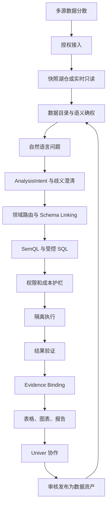
```mermaid
flowchart TD
    A["多源数据分散"] --> B["授权接入"]
    B --> C["快照湖仓或实时只读"]
    C --> D["数据目录与语义确权"]
    D --> E["自然语言问题"]
    E --> F["AnalysisIntent 与歧义澄清"]
    F --> G["领域路由与 Schema Linking"]
    G --> H["SemQL 与受控 SQL"]
    H --> I["权限和成本护栏"]
    I --> J["隔离执行"]
    J --> K["结果验证"]
    K --> L["Evidence Binding"]
    L --> M["表格、图表、报告"]
    M --> N["Univer 协作"]
    N --> O["审核发布为数据资产"]
    O --> D
```

讲图只抓六段：

> 数据从哪来 → 业务是什么意思 → 怎样找到正确数据 → 怎样安全执行 → 为什么结果可信 → 怎样沉淀复用。

最短恢复词：

> **散、义、问、证、产**

## 图 02｜项目知识点总地图

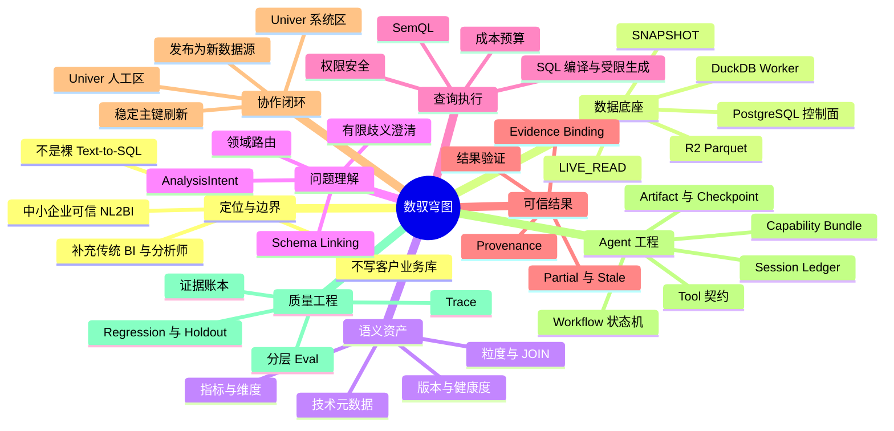
```mermaid
mindmap
  root((数驭穹图))
    定位与边界
      中小企业可信 NL2BI
      补充传统 BI 与分析师
      不是裸 Text-to-SQL
      不写客户业务库
    数据底座
      SNAPSHOT
      LIVE_READ
      PostgreSQL 控制面
      R2 Parquet
      DuckDB Worker
    语义资产
      技术元数据
      指标与维度
      粒度与 JOIN
      版本与健康度
    问题理解
      AnalysisIntent
      有限歧义澄清
      领域路由
      Schema Linking
    查询执行
      SemQL
      SQL 编译与受限生成
      权限安全
      成本预算
    可信结果
      结果验证
      Provenance
      Evidence Binding
      Partial 与 Stale
    协作闭环
      Univer 系统区
      Univer 人工区
      稳定主键刷新
      发布为新数据源
    Agent 工程
      Workflow 状态机
      Capability Bundle
      Tool 契约
      Session Ledger
      Artifact 与 Checkpoint
    质量工程
      Trace
      分层 Eval
      Regression 与 Holdout
      证据账本
```

## 图 03｜项目定位与明确边界

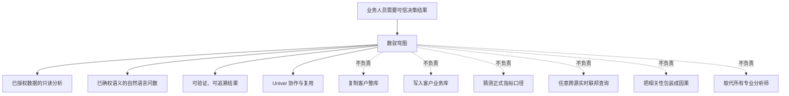
```mermaid
flowchart TD
    A["业务人员需要可信决策结果"] --> B["数驭穹图"]
    B --> C["已授权数据的只读分析"]
    B --> D["已确权语义的自然语言问数"]
    B --> E["可验证、可追溯结果"]
    B --> F["Univer 协作与复用"]

    B -.不负责.-> G["复制客户整库"]
    B -.不负责.-> H["写入客户业务库"]
    B -.不负责.-> I["猜测正式指标口径"]
    B -.不负责.-> J["任意跨源实时联邦查询"]
    B -.不负责.-> K["把相关性包装成因果"]
    B -.不负责.-> L["取代所有专业分析师"]
```

### 钢人化比较

| 方案 | 最强优势 | 主要局限 | 数驭穹图的关系 |
|---|---|---|---|
| 数据分析师 | 复杂建模、未知问题、正式分析 | 重复取数沟通成本高 | 治理一次，高频复用 |
| 传统 BI | 固定指标和稳定看板成熟 | 临时问题响应慢 | 补充开放式问数 |
| 裸 Text-to-SQL | 原型短、自由度高 | 口径、权限、结果难证明 | 加语义、护栏、证据和协作 |
| 全量数仓 | 治理强、规模能力成熟 | 中小企业建设成本高 | 只治理高价值数据集 |

---

# 第二层：系统对象与总体架构

## 图 04｜核心业务对象关系图

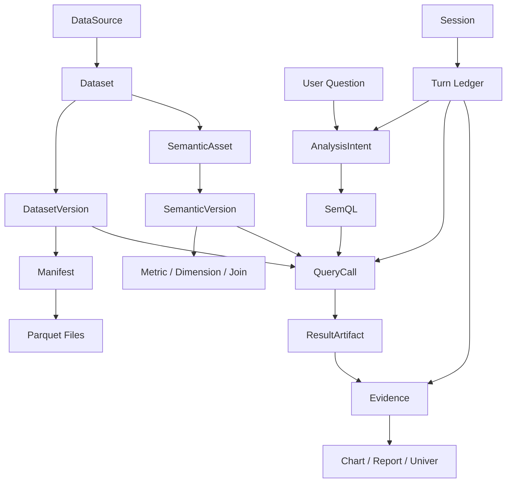
```mermaid
flowchart TD
    A["DataSource"] --> B["Dataset"]
    B --> C["DatasetVersion"]
    C --> D["Manifest"]
    D --> E["Parquet Files"]

    B --> F["SemanticAsset"]
    F --> G["SemanticVersion"]
    G --> H["Metric / Dimension / Join"]

    I["User Question"] --> J["AnalysisIntent"]
    J --> K["SemQL"]
    K --> L["QueryCall"]
    L --> M["ResultArtifact"]
    M --> N["Evidence"]
    N --> O["Chart / Report / Univer"]

    C --> L
    G --> L
    P["Session"] --> Q["Turn Ledger"]
    Q --> J
    Q --> L
    Q --> N
```

必须分清的权威状态：

| 对象 | 权威事实 |
|---|---|
| 数据集当前版本 | PostgreSQL 中已发布的 Manifest 指针 |
| 数据内容 | Manifest 指向的 Parquet 文件 |
| 指标含义 | 已发布 SemanticVersion |
| 本轮查询事实 | QueryCall 与 ResultArtifact |
| 图表来源 | Evidence 中的 call_id、fingerprint、result_hash |
| 会话恢复 | 已提交 Turn Ledger 和 Checkpoint |

## 图 05｜系统模块与组件架构

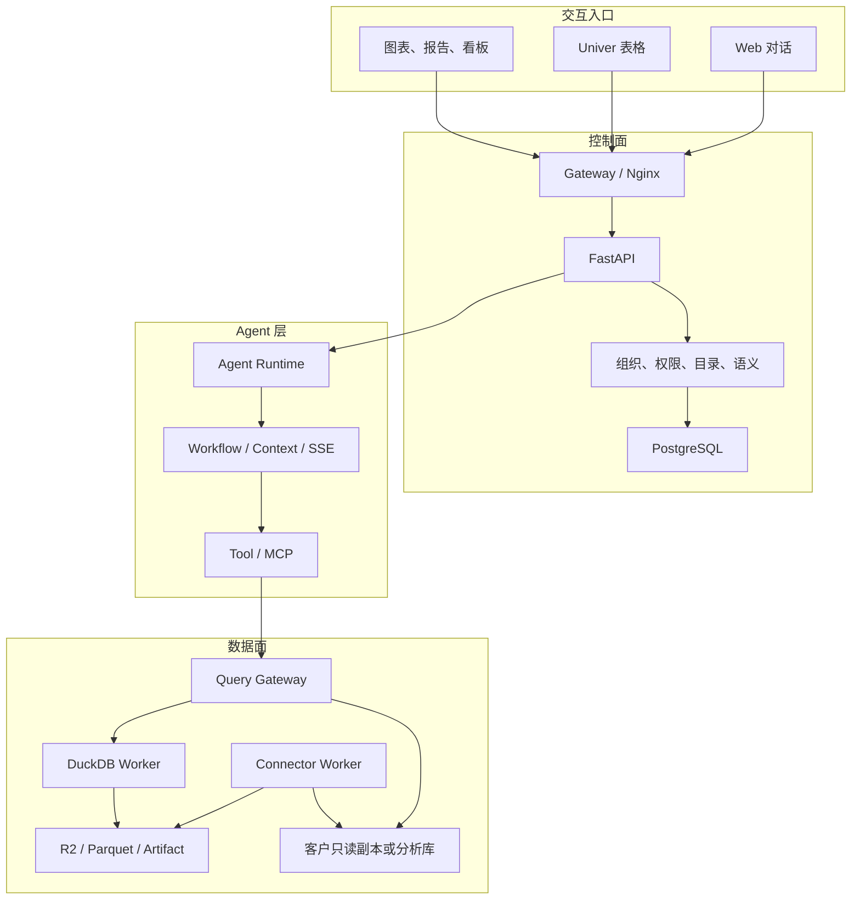
```mermaid
flowchart TD
    subgraph Entry["交互入口"]
      A["Web 对话"]
      B["Univer 表格"]
      C["图表、报告、看板"]
    end

    subgraph Control["控制面"]
      D["Gateway / Nginx"]
      E["FastAPI"]
      F["组织、权限、目录、语义"]
      G["PostgreSQL"]
    end

    subgraph Agent["Agent 层"]
      H["Agent Runtime"]
      I["Workflow / Context / SSE"]
      J["Tool / MCP"]
    end

    subgraph Data["数据面"]
      K["Connector Worker"]
      L["Query Gateway"]
      M["DuckDB Worker"]
      N["R2 / Parquet / Artifact"]
      O["客户只读副本或分析库"]
    end

    A --> D
    B --> D
    C --> D
    D --> E
    E --> F
    F --> G
    E --> H
    H --> I
    I --> J
    J --> L
    K --> N
    L --> M
    M --> N
    L --> O
    K --> O
```

一句话解释控制面与数据面：

> PostgreSQL 和 FastAPI 决定谁能用什么数据与版本；Connector、R2/Parquet、DuckDB 和只读连接器负责真正搬运与计算数据。

---

# 第三层：数据接入、同步与轻量湖仓

## 图 06｜SNAPSHOT 与 LIVE_READ 决策树

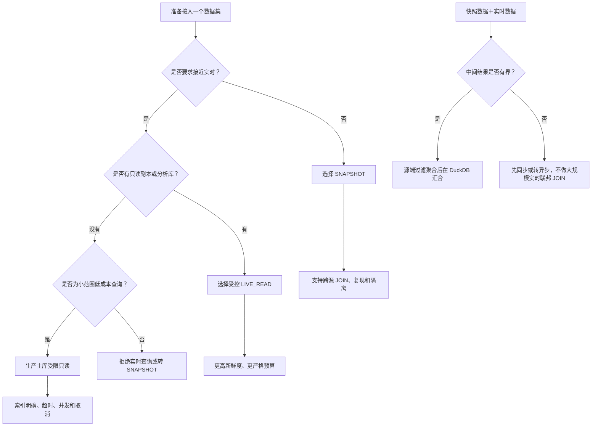
```mermaid
flowchart TD
    A["准备接入一个数据集"] --> B{"是否要求接近实时？"}
    B -->|否| C["选择 SNAPSHOT"]
    B -->|是| D{"是否有只读副本或分析库？"}
    D -->|有| E["选择受控 LIVE_READ"]
    D -->|没有| F{"是否为小范围低成本查询？"}
    F -->|是| G["生产主库受限只读"]
    F -->|否| H["拒绝实时查询或转 SNAPSHOT"]

    C --> I["支持跨源 JOIN、复现和隔离"]
    E --> J["更高新鲜度、更严格预算"]
    G --> K["索引明确、超时、并发和取消"]

    L["快照数据＋实时数据"] --> M{"中间结果是否有界？"}
    M -->|是| N["源端过滤聚合后在 DuckDB 汇合"]
    M -->|否| O["先同步或转异步，不做大规模实时联邦 JOIN"]
```

核心取舍：

| 模式 | 得到什么 | 付出什么 |
|---|---|---|
| SNAPSHOT | 生产隔离、跨源分析、版本复现 | 同步延迟、存储和维护 |
| LIVE_READ | 数据更新及时、少复制 | 依赖源端性能、跨源能力弱 |

## 图 07｜首次快照、CDC 与发布主线

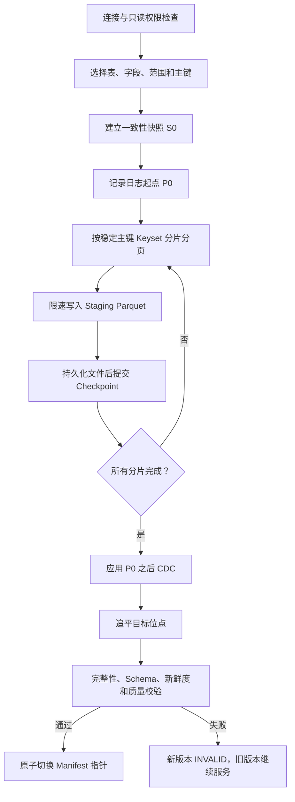
```mermaid
flowchart TD
    A["连接与只读权限检查"] --> B["选择表、字段、范围和主键"]
    B --> C["建立一致性快照 S0"]
    C --> D["记录日志起点 P0"]
    D --> E["按稳定主键 Keyset 分片分页"]
    E --> F["限速写入 Staging Parquet"]
    F --> G["持久化文件后提交 Checkpoint"]
    G --> H{"所有分片完成？"}
    H -->|否| E
    H -->|是| I["应用 P0 之后 CDC"]
    I --> J["追平目标位点"]
    J --> K["完整性、Schema、新鲜度和质量校验"]
    K -->|通过| L["原子切换 Manifest 指针"]
    K -->|失败| M["新版本 INVALID，旧版本继续服务"]
```

为什么需要 `S0 + P0`：

```text
S0 保证全量分页看到同一个数据库状态；
P0 保证快照期间发生的变化随后能够连续补上；
两者共同避免“全量结束、增量开始”之间出现不可解释的数据空洞。
```

## 图 08｜增量事件的“至少一次输入、效果一次”

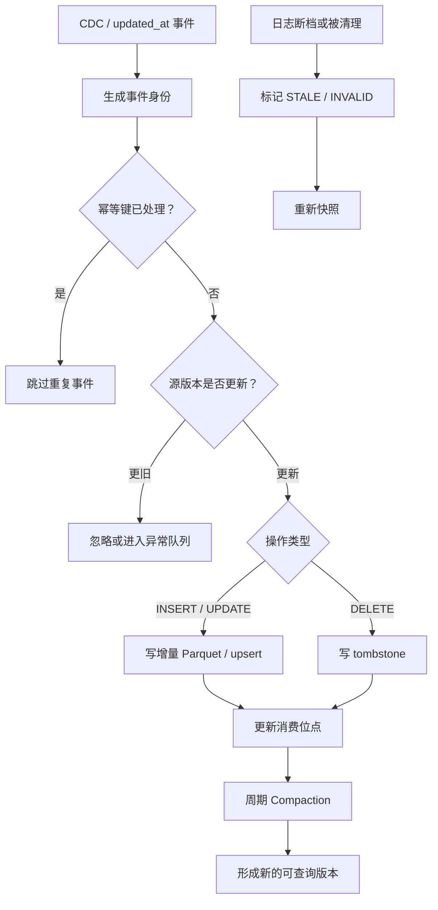
```mermaid
flowchart TD
    A["CDC / updated_at 事件"] --> B["生成事件身份"]
    B --> C{"幂等键已处理？"}
    C -->|是| D["跳过重复事件"]
    C -->|否| E{"源版本是否更新？"}
    E -->|更旧| F["忽略或进入异常队列"]
    E -->|更新| G{"操作类型"}
    G -->|INSERT / UPDATE| H["写增量 Parquet / upsert"]
    G -->|DELETE| I["写 tombstone"]
    H --> J["更新消费位点"]
    I --> J
    J --> K["周期 Compaction"]
    K --> L["形成新的可查询版本"]

    M["日志断档或被清理"] --> N["标记 STALE / INVALID"]
    N --> O["重新快照"]
```

事件身份不能只使用业务主键：同一订单可以发生多次合法更新。更合理的是：

```text
source_id + log_partition + log_position + event_index
```

## 图 09｜轻量湖仓式分析层

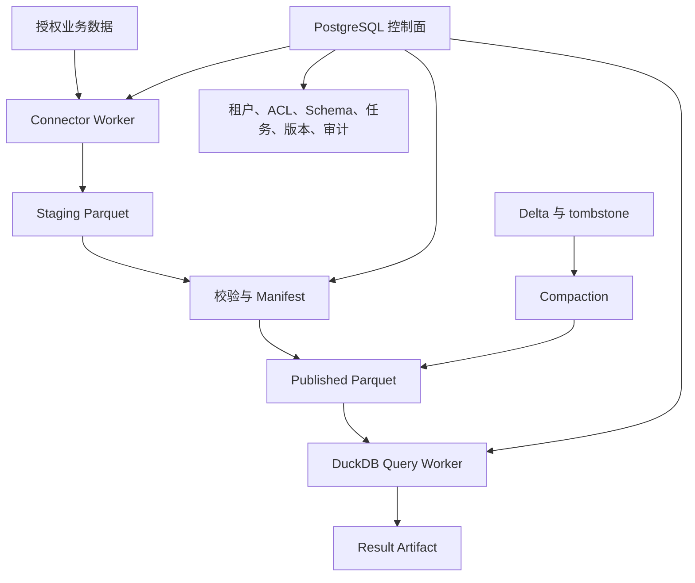
```mermaid
flowchart TD
    A["授权业务数据"] --> B["Connector Worker"]
    B --> C["Staging Parquet"]
    C --> D["校验与 Manifest"]
    D --> E["Published Parquet"]
    E --> F["DuckDB Query Worker"]
    F --> G["Result Artifact"]

    H["PostgreSQL 控制面"] --> B
    H --> D
    H --> F
    H --> I["租户、ACL、Schema、任务、版本、审计"]

    J["Delta 与 tombstone"] --> K["Compaction"]
    K --> E
```

组件职责：

| 组件 | 做什么 | 不做什么 |
|---|---|---|
| PostgreSQL | 元数据、权限、任务、版本、语义、审计 | 不保存大规模分析事实 |
| R2/Parquet | 列式数据、版本文件、Artifact | 不负责业务权限判断 |
| DuckDB Worker | 读取授权文件执行 OLAP | 不作为完整多租户安全边界 |
| Manifest | 定义某一已发布版本的文件集合 | 不替代数据质量验证 |

严格表述：当前是“轻量湖仓式分析层”，没有声称具备 Iceberg/Delta 的完整表级 ACID、Schema Evolution 和 Time Travel。

## 图 10｜数据集状态机

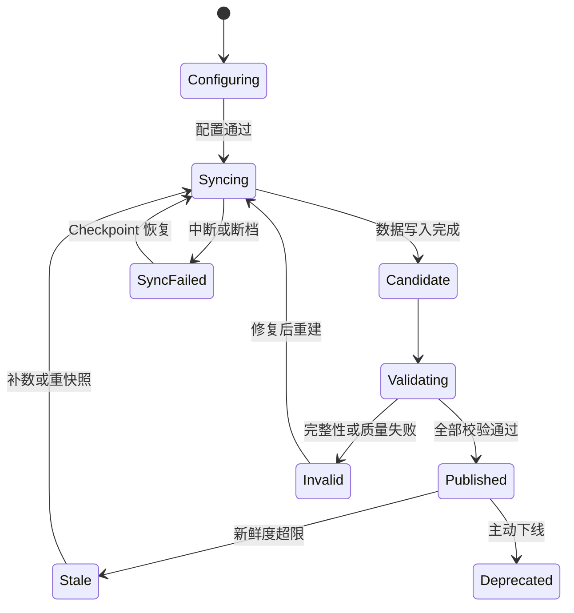
```mermaid
stateDiagram-v2
    [*] --> Configuring
    Configuring --> Syncing: 配置通过
    Syncing --> Candidate: 数据写入完成
    Syncing --> SyncFailed: 中断或断档
    SyncFailed --> Syncing: Checkpoint 恢复
    Candidate --> Validating
    Validating --> Published: 全部校验通过
    Validating --> Invalid: 完整性或质量失败
    Published --> Stale: 新鲜度超限
    Published --> Deprecated: 主动下线
    Stale --> Syncing: 补数或重快照
    Invalid --> Syncing: 修复后重建
```

必须记住：

> `SYNC SUCCESS` 只证明搬运任务完成；`PUBLISHED` 才证明这个版本经过完整性、Schema、新鲜度、权限和业务质量门禁，可以进入正式问数。

---

# 第四层：数据目录与语义资产

## 图 11｜三层知识与六节知识卡

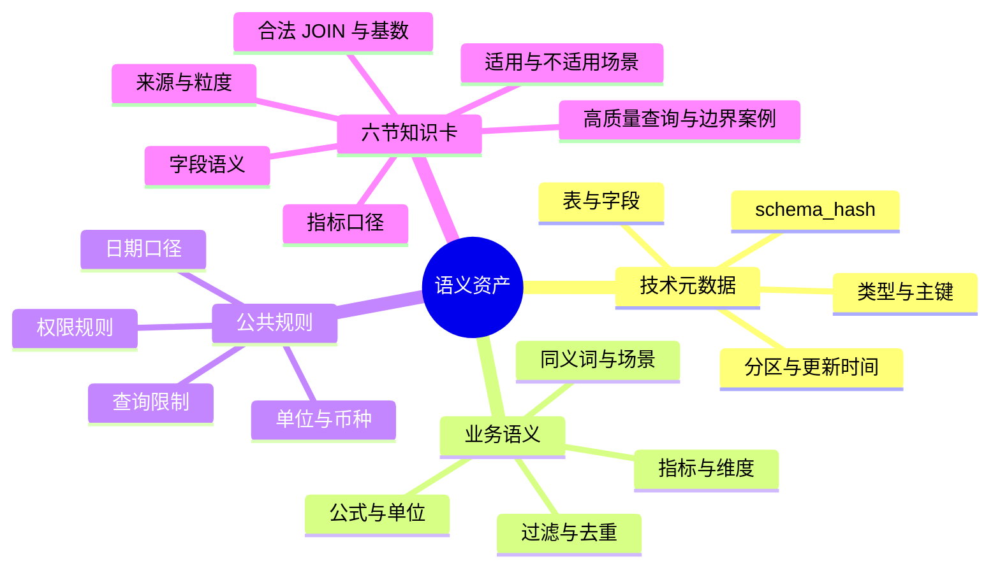
```mermaid
mindmap
  root((语义资产))
    技术元数据
      表与字段
      类型与主键
      分区与更新时间
      schema_hash
    业务语义
      指标与维度
      公式与单位
      过滤与去重
      同义词与场景
    公共规则
      日期口径
      权限规则
      查询限制
      单位与币种
    六节知识卡
      来源与粒度
      字段语义
      适用与不适用场景
      合法 JOIN 与基数
      指标口径
      高质量查询与边界案例
```

维护原则：

```text
全部物理表 → 自动抽取技术元数据
发布数据集 → 自动生成知识卡初稿
核心指标和高风险 JOIN → 人工确权
低频原始表 → 不进入默认自动问数
```

## 图 12｜语义资产生命周期与 Schema 漂移

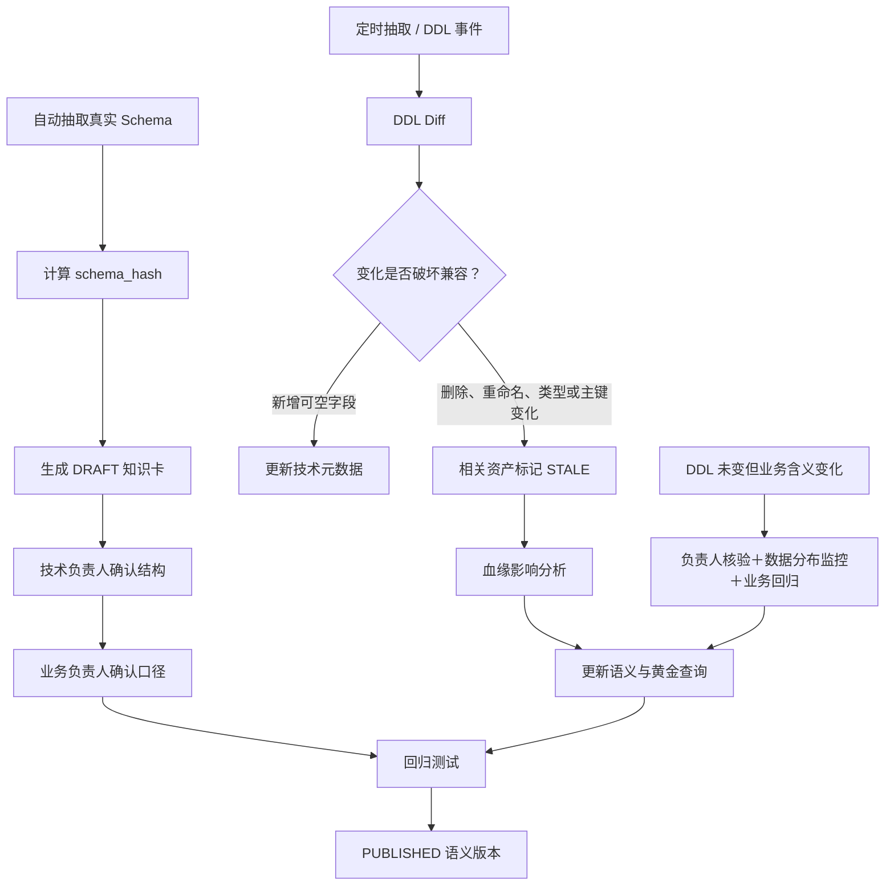
```mermaid
flowchart TD
    A["自动抽取真实 Schema"] --> B["计算 schema_hash"]
    B --> C["生成 DRAFT 知识卡"]
    C --> D["技术负责人确认结构"]
    D --> E["业务负责人确认口径"]
    E --> F["回归测试"]
    F --> G["PUBLISHED 语义版本"]

    H["定时抽取 / DDL 事件"] --> I["DDL Diff"]
    I --> J{"变化是否破坏兼容？"}
    J -->|新增可空字段| K["更新技术元数据"]
    J -->|删除、重命名、类型或主键变化| L["相关资产标记 STALE"]
    L --> M["血缘影响分析"]
    M --> N["更新语义与黄金查询"]
    N --> F

    O["DDL 未变但业务含义变化"] --> P["负责人核验＋数据分布监控＋业务回归"]
    P --> N
```

语义状态：

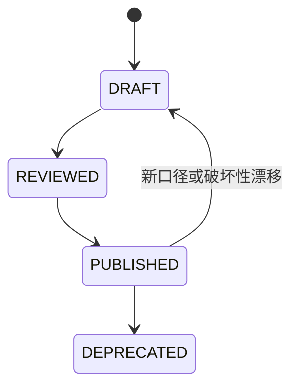
```mermaid
stateDiagram-v2
    [*] --> DRAFT
    DRAFT --> REVIEWED
    REVIEWED --> PUBLISHED
    PUBLISHED --> DEPRECATED
    PUBLISHED --> DRAFT: 新口径或破坏性漂移
```

---

# 第五层：从自然语言到受控 SQL

## 图 13｜AnalysisIntent 与有限歧义澄清

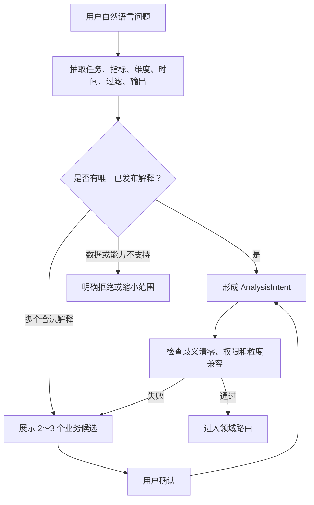
```mermaid
flowchart TD
    A["用户自然语言问题"] --> B["抽取任务、指标、维度、时间、过滤、输出"]
    B --> C{"是否有唯一已发布解释？"}
    C -->|是| D["形成 AnalysisIntent"]
    C -->|多个合法解释| E["展示 2～3 个业务候选"]
    E --> F["用户确认"]
    F --> D
    C -->|数据或能力不支持| G["明确拒绝或缩小范围"]
    D --> H["检查歧义清零、权限和粒度兼容"]
    H -->|通过| I["进入领域路由"]
    H -->|失败| E
```

“平均盈利率”至少隐藏：

| 歧义 | 典型候选 |
|---|---|
| 平均方式 | 各门店简单平均 / 总利润÷总收入 |
| 门店范围 | 营业 / 含试营业 / 含已关闭 |
| 时间范围 | 自然年至今 / 最近 12 个月 / 最后完整业务日 |
| 利润定义 | 收入减商品成本 / 再含费用税费退款 |

## 图 14｜领域路由与 Schema Linking 漏斗

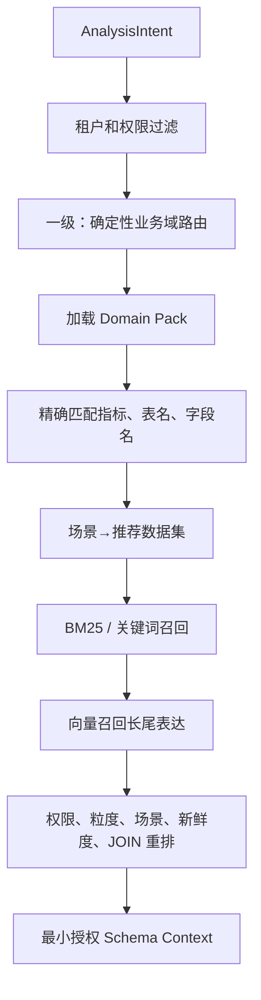
```mermaid
flowchart TD
    A["AnalysisIntent"] --> B["租户和权限过滤"]
    B --> C["一级：确定性业务域路由"]
    C --> D["加载 Domain Pack"]
    D --> E["精确匹配指标、表名、字段名"]
    E --> F["场景→推荐数据集"]
    F --> G["BM25 / 关键词召回"]
    G --> H["向量召回长尾表达"]
    H --> I["权限、粒度、场景、新鲜度、JOIN 重排"]
    I --> J["最小授权 Schema Context"]
```

错误必须分开归因：

```text
域路由错   ≠ 表没召回
表选择错   ≠ 字段选择错
召回缺失   ≠ 重排错误
正确表进入 Top-K ≠ 最终查询一定选对
```

## 图 15｜NL2SemQL2SQL 与错误归因

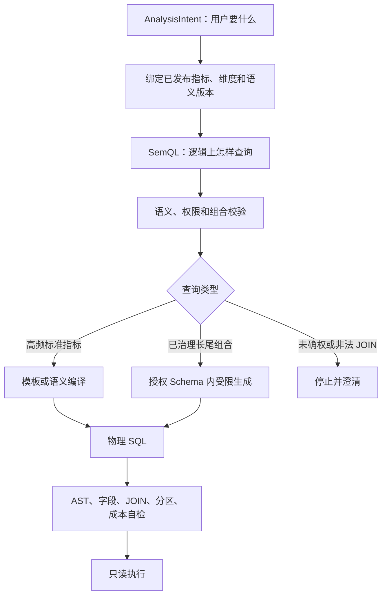
```mermaid
flowchart TD
    A["AnalysisIntent：用户要什么"] --> B["绑定已发布指标、维度和语义版本"]
    B --> C["SemQL：逻辑上怎样查询"]
    C --> D["语义、权限和组合校验"]
    D --> E{"查询类型"}
    E -->|高频标准指标| F["模板或语义编译"]
    E -->|已治理长尾组合| G["授权 Schema 内受限生成"]
    E -->|未确权或非法 JOIN| H["停止并澄清"]
    F --> I["物理 SQL"]
    G --> I
    I --> J["AST、字段、JOIN、分区、成本自检"]
    J --> K["只读执行"]
```

| 现象 | 优先定位 |
|---|---|
| 问题理解错 | AnalysisIntent / 澄清 |
| 指标公式错 | 语义资产 / SemQL |
| 表字段选错 | Schema Linking |
| SQL 不能运行 | 方言 / 生成 / 当前 Schema |
| SQL 能运行但数值错 | JOIN、粒度、数据质量、结果验证 |

允许有限修复：方言、拼写、类型转换、语法。  
禁止绕过：权限拒绝、口径歧义、非法 JOIN、过期数据、成本超限。

---

# 第六层：权限、安全、性能与可信结果

## 图 16｜五层安全边界

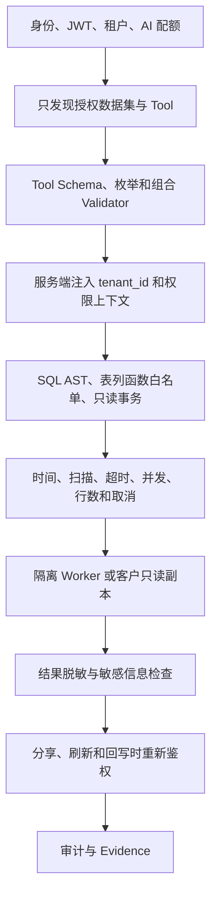
```mermaid
flowchart TD
    A["身份、JWT、租户、AI 配额"] --> B["只发现授权数据集与 Tool"]
    B --> C["Tool Schema、枚举和组合 Validator"]
    C --> D["服务端注入 tenant_id 和权限上下文"]
    D --> E["SQL AST、表列函数白名单、只读事务"]
    E --> F["时间、扫描、超时、并发、行数和取消"]
    F --> G["隔离 Worker 或客户只读副本"]
    G --> H["结果脱敏与敏感信息检查"]
    H --> I["分享、刷新和回写时重新鉴权"]
    I --> J["审计与 Evidence"]
```

关键原则：

- Tool Call 和模型输出都是不可信输入；
- 模型不能填写或删除 `tenant_id`；
- 权限依赖不可用时 `FAILED_CLOSED`；
- 只读不等于安全，慢 `SELECT` 仍可能抢占 CPU、IO、连接和内存。

## 图 17｜查询预算与多表 JOIN 控制

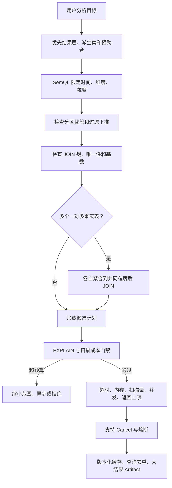
```mermaid
flowchart TD
    A["用户分析目标"] --> B["优先结果层、派生集和预聚合"]
    B --> C["SemQL 限定时间、维度、粒度"]
    C --> D["检查分区裁剪和过滤下推"]
    D --> E["检查 JOIN 键、唯一性和基数"]
    E --> F{"多个一对多事实表？"}
    F -->|是| G["各自聚合到共同粒度后 JOIN"]
    F -->|否| H["形成候选计划"]
    G --> H
    H --> I["EXPLAIN 与扫描成本门禁"]
    I -->|超预算| J["缩小范围、异步或拒绝"]
    I -->|通过| K["超时、内存、扫描量、并发、返回上限"]
    K --> L["支持 Cancel 与熔断"]
    L --> M["版本化缓存、查询去重、大结果 Artifact"]
```

为什么 `LIMIT` 不够：JOIN 和聚合可能已经扫描、排序或连接了大量数据，最后才只返回少量行。

## 图 18｜结果验证与 Evidence Binding

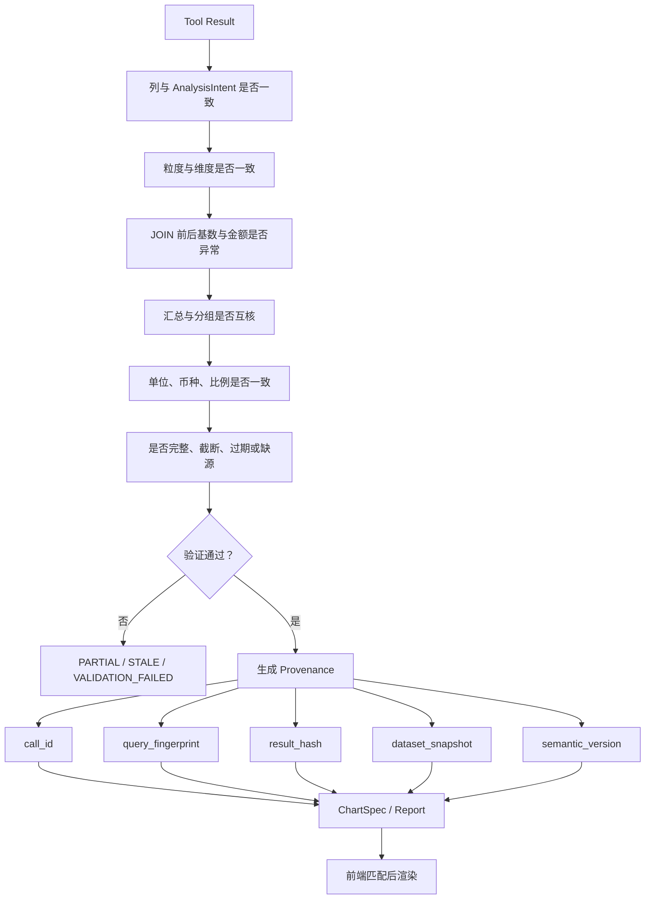
```mermaid
flowchart TD
    A["Tool Result"] --> B["列与 AnalysisIntent 是否一致"]
    B --> C["粒度与维度是否一致"]
    C --> D["JOIN 前后基数与金额是否异常"]
    D --> E["汇总与分组是否互核"]
    E --> F["单位、币种、比例是否一致"]
    F --> G["是否完整、截断、过期或缺源"]
    G --> H{"验证通过？"}
    H -->|否| I["PARTIAL / STALE / VALIDATION_FAILED"]
    H -->|是| J["生成 Provenance"]
    J --> K["call_id"]
    J --> L["query_fingerprint"]
    J --> M["result_hash"]
    J --> N["dataset_snapshot"]
    J --> O["semantic_version"]
    K --> P["ChartSpec / Report"]
    L --> P
    M --> P
    N --> P
    O --> P
    P --> Q["前端匹配后渲染"]
```

证据边界：

> `result_hash` 只能证明图表绑定了某次查询结果，不能单独证明查询口径正确；业务正确性仍依赖语义版本、查询计划和执行后验证。

---

# 第七层：Univer、Agent Runtime 与上下文

## 图 19｜Univer 的双向资产闭环

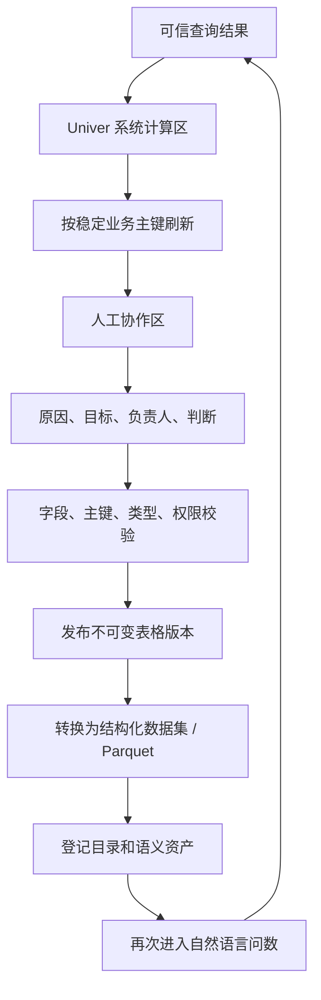
```mermaid
flowchart TD
    A["可信查询结果"] --> B["Univer 系统计算区"]
    B --> C["按稳定业务主键刷新"]
    C --> D["人工协作区"]
    D --> E["原因、目标、负责人、判断"]
    E --> F["字段、主键、类型、权限校验"]
    F --> G["发布不可变表格版本"]
    G --> H["转换为结构化数据集 / Parquet"]
    H --> I["登记目录和语义资产"]
    I --> J["再次进入自然语言问数"]
    J --> A
```

必须分开的两类列：

| 系统计算区 | 人工协作区 |
|---|---|
| 查询事实、指标、时间、Evidence | 原因、负责人、目标、备注 |
| 系统拥有，刷新时更新 | 用户拥有，刷新时保留 |
| 不允许任意修改 | 可编辑但需版本与权限 |

## 图 20｜Workflow、Agent 与 Tool 契约

```mermaid
stateDiagram-v2
    [*] --> Authorized
    state "授权完成" as Authorized
    state "歧义已澄清" as Clarified
    state "计划已验证" as Planned
    state "查询已执行" as Executed
    state "结果已验证" as Validated
    state "证据化展示" as Presented
    state "明确失败" as Failed

    Authorized --> Clarified
    Clarified --> Planned
    Planned --> Executed
    Executed --> Validated
    Validated --> Presented
    Presented --> [*]
    Authorized --> Failed
    Clarified --> Failed
    Planned --> Failed
    Executed --> Failed
```

```mermaid
flowchart TD
    A["确定性代码"] --> B["身份、租户、权限"]
    A --> C["版本、状态、预算、证据"]
    A --> D["Tool Schema 与 Validator"]

    E["模型"] --> F["理解自然语言"]
    E --> G["抽取候选与局部选择"]
    E --> H["解释结果与展示意图"]

    I["Capability Bundle"] --> E
    D --> J["受控 Tool"]
    E --> J
    J --> K["确定性业务结果或失败语义"]
```

Tool 契约必须说明：业务任务、合法参数、返回事实、完整性、空结果、拒绝和失败。MCP 只统一交换协议，不自动解决权限、状态、幂等、语义和评测。

## 图 21｜多轮上下文、Artifact 与恢复

```mermaid
flowchart TD
    A["Visible Memory"] --> F["Working Context"]
    B["Trajectory"] --> F
    C["Evidence Memory"] --> F
    D["近期完整 Turn"] --> F
    E["结构化 Checkpoint"] --> F
    F --> G["本轮 Agent"]
    G --> H["重新查询 Current Business Truth"]
    H --> I["Tool Result / Artifact"]
    I --> J["Validation / Evidence"]
    J --> K["Assistant Final"]
    K --> L["Turn Committed"]
    L --> A
    L --> B
    L --> C
```

```text
“那华南呢”
→ 继承指标、时间和分析方式
→ 替换区域过滤
→ 重新生成 SemQL
→ 当前数据重新查询
→ 旧结果只作为历史 Evidence
```

断线恢复：页面断开不等于任务取消；根据 `session_id / turn_id / event_cursor` 重放已提交事件。  
上下文超限：Checkpoint 保存事实、约束、未决项、证据引用和版本，不只是流畅摘要。

---

# 第八层：Eval、部署与故障

## 图 22｜Eval、Trace 与持续优化闭环

```mermaid
flowchart TD
    A["线上失败 / 用户修正"] --> B["统一 Trace 回放"]
    B --> C{"失败节点"}
    C --> D["意图与澄清"]
    C --> E["领域与 Schema Linking"]
    C --> F["SemQL 与 SQL"]
    C --> G["权限、执行与性能"]
    C --> H["结果、证据与表达"]
    D --> I["转成评测用例"]
    E --> I
    F --> I
    G --> I
    H --> I
    I --> J["单变量修改"]
    J --> K["Regression"]
    K --> L["Holdout / Adversarial"]
    L --> M{"P0 权限和证据通过？"}
    M -->|否| J
    M -->|是| N["灰度上线"]
    N --> O["线上监控"]
    O --> A
```

五层评测：

| 层 | 核心问题 |
|---|---|
| Tool Contract | 是否走了允许的能力和参数路径 |
| Oracle | 查询结果、完整性和快照是否正确 |
| Presentation & Evidence | 图表文字是否绑定真实结果 |
| Rubric | 是否理解问题、澄清得当、表达清楚 |
| Cost & Stability | Token、Tool、延迟、重试和连续稳定性 |

## 图 23｜部署单元与关键失败语义

```mermaid
flowchart TD
    A["Gateway"] --> B["FastAPI 控制面"]
    A --> C["Agent Runtime"]
    C --> D["Tool / Query Gateway"]
    D --> E["Connector Worker"]
    D --> F["DuckDB Query Worker"]
    B --> G["PostgreSQL"]
    E --> H["对象存储 / 客户数据源"]
    F --> H

    G -.不可用.-> I["权限与状态不确定：全链路失败关闭"]
    F -.OOM / 超时.-> J["取消、回收、缩小范围或异步"]
    H -.不可用.-> K["不返回不完整缓存或猜测结果"]
    E -.同步失败.-> L["Checkpoint 恢复，数据集标记 STALE"]
    C -.SSE 断开.-> M["服务端继续，按事件游标恢复"]
```

部署边际：

```text
第一版：模块化单体＋Docker Compose＋职责隔离 Worker
规模增长：无状态 API/Agent 横向扩容，Worker 按队列扩容
真实并发和数据量形成瓶颈后：再评估 Kubernetes 或分布式查询引擎
```

---

# 第九层：黄金案例与模拟面试

## 图 24｜“门店数＋平均盈利率”端到端案例

```mermaid
flowchart TD
    A["负责人：有多少门店？今年平均盈利率？"] --> B["鉴权：可查看哪些区域和门店"]
    B --> C["澄清门店、今年、利润、平均方式"]
    C --> D["路由门店经营域"]
    D --> E["加载门店、收入、成本、日历语义"]
    E --> F["AnalysisIntent"]
    F --> G["SemQL：active_store_count＋weighted_profit_margin"]
    G --> H["收入先聚合到门店＋时间"]
    G --> I["成本先聚合到门店＋时间"]
    H --> J["同粒度 JOIN 门店主数据"]
    I --> J
    J --> K["AST、租户、分区、JOIN、EXPLAIN、预算"]
    K --> L["DuckDB 隔离执行"]
    L --> M["门店数、总分、单位、完整性互核"]
    M --> N["绑定 call_id、hash、快照、语义版本"]
    N --> O["表格 / 图表"]
    O --> P["Univer 系统区＋人工区"]
```

关键公式：

```text
经营总盘口径：整体盈利率 = SUM(利润) / SUM(收入)
典型门店口径：简单平均 = AVG(各门店利润 / 各门店收入)
```

两个最高风险：

| 风险 | 发现 | 止血 | 修复与预防 |
|---|---|---|---|
| 平均盈利率口径错误 | Intent 聚合方式为空或冲突 | 不执行，有限澄清 | 指标卡固化公式和适用场景；加入大小店悬殊用例 |
| 收入、成本明细直接 JOIN 放大 | JOIN 前后行数与总额异常 | 阻断结果和图表 | 两边先聚合到共同粒度；知识卡记录基数 |

其他边界：

- 某门店缺成本：报告可计算门店数和缺失门店，不能把缺失成本当零；
- 当天同步未完成：使用最后完整业务日或明确 `STALE/PARTIAL`；
- Live Read 成本过高：缩小范围、转快照或异步，不把复杂 SQL 打到主库。

## 图 25｜连续面试追问导航

```mermaid
flowchart TD
    A["项目是什么？"] --> B["为什么不是普通 Text-to-SQL？"]
    B --> C["数据从哪里来？"]
    C --> D["Snapshot 与 Live Read 如何选？"]
    D --> E["语义层和知识卡怎样维护？"]
    E --> F["大 Schema 怎样选表字段？"]
    F --> G["为什么需要 AnalysisIntent 与 SemQL？"]
    G --> H["权限、慢 SQL 和 JOIN 怎样控制？"]
    H --> I["SQL 跑通后怎么证明结果正确？"]
    I --> J["Evidence 能证明什么？"]
    J --> K["Univer 怎样刷新且不覆盖人工备注？"]
    K --> L["Agent、Workflow、Tool 如何分工？"]
    L --> M["多轮和断线如何恢复？"]
    M --> N["怎样评测和持续优化？"]
    N --> O["选择一个故障完整处理"]
    O --> P["哪些能力已实现，证据是什么？"]
```

问题卡住时，不从术语回忆，而从六问恢复：

```text
1. 业务目标是什么？
2. 权威事实在哪里？
3. 正常链路怎样运行？
4. 最危险的失败是什么？
5. 哪个确定性机制阻断它？
6. 用什么测试、日志、数据或 Evidence 证明？
```

## 图 26｜面试回答框架

```mermaid
flowchart TD
    A["普通设计题"] --> B["业务目标"]
    B --> C["正常流程"]
    C --> D["主要风险"]
    D --> E["解决机制"]
    E --> F["设计取舍"]
    F --> G["验证方法"]

    H["故障处理题"] --> I["发现"]
    I --> J["止血"]
    J --> K["定位"]
    K --> L["修复"]
    L --> M["验证"]
    M --> N["预防"]
```

### 20 秒项目定义

> 数驭穹图是面向中小企业的可信 NL2BI 数据分析与协作平台，把多源数据、指标口径和权限组织成可查询资产，让业务人员通过自然语言获得可验证结果，并在 Univer、报告和看板中持续协作和复用。

### 90 秒恢复顺序

```text
用户痛点
→ 授权数据快照/实时只读
→ 语义确权
→ Intent 与澄清
→ Schema Linking
→ SemQL/SQL
→ 权限和成本
→ 结果验证与 Evidence
→ Univer 协作和再发布
```

### 5 分钟画图顺序

```text
入口
→ 控制面
→ Agent Runtime
→ Tool / Query Gateway
→ Connector / DuckDB Worker
→ PostgreSQL / R2 Parquet / 只读源
→ Evidence / Artifact
→ Univer
→ Trace / Eval
```

---

# 第十层：复习检查表与后续维护

## P0 闭卷检查

- [ ] 20 秒说清项目定位和明确边界；
- [ ] 画出端到端闭环，不遗漏语义、权限、验证和协作；
- [ ] 解释 Snapshot、LIVE_READ、S0、P0、Checkpoint、Manifest；
- [ ] 解释为什么同步成功不等于发布成功；
- [ ] 解释三层知识、六节卡片和 Schema 漂移；
- [ ] 解释 AnalysisIntent、SemQL、SQL 的区别；
- [ ] 解释为什么只读仍可能影响生产；
- [ ] 解释多表 JOIN 的数据放大和共同粒度预聚合；
- [ ] 解释 Result Hash 能证明什么、不能证明什么；
- [ ] 用门店案例完成 90 秒和 5 分钟回答。

## P1 工程深度检查

- [ ] 解释 Workflow 与 Agent 的职责边界；
- [ ] 解释 Capability Bundle 和 Tool 契约；
- [ ] 解释 Session Ledger、Artifact、Checkpoint；
- [ ] 解释页面断线、服务重启、Tool 已执行但结果未保存的恢复；
- [ ] 解释分层 Eval、Trace、Regression、Holdout 和 P0 门禁；
- [ ] 区分 E1、E2、E3，所有简历数字能还原证据账本。

## 新知识追加模板

```markdown
### YYYY-MM-DD｜模块名｜E1/E2/E3

- 新结论：
- 它修改了哪张图、哪个节点：
- 解决的业务问题：
- 新增的失败边界：
- 取舍与代价：
- 验证证据：
- 是否需要加入黄金案例或 Eval：
```

## 最终总恢复脚本

> **散：** 数据分散，通过授权快照或受控实时只读进入系统。  
> **义：** Schema 不等于业务，指标、粒度和 JOIN 必须人工确权并版本化。  
> **问：** 问题经 Intent、澄清、路由、Linking、SemQL 变成受控 SQL。  
> **证：** 权限、预算、结果验证和 Evidence 共同证明答案可信。  
> **产：** 结果进入 Univer 协作，审核后再次成为可刷新数据资产。
