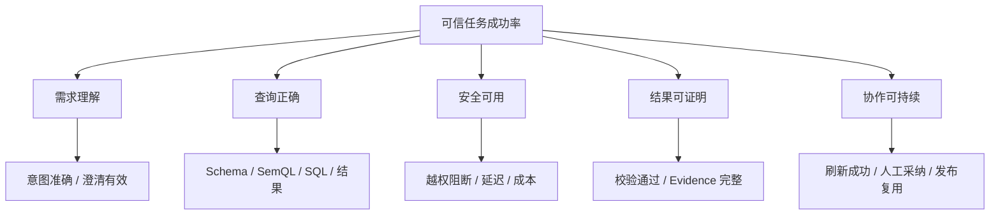

# 量化指标与证据口径

## 模块定位

这份文档用于管理简历数字、实验结果和项目边界。原则是：先定义分母和证据，再讨论提升；无法证明的数字不写成已完成结果。

## 一句话结论

> 一个可信数字必须同时说明测量对象、样本、基线、改动、环境、时间、证据和限制，否则它只是容易被追问击穿的口号。

## 第一性原理：为什么数字需要证据账本

面试官追问一个数字，本质上在检查三件事：

1. 你是否真的做过；
2. 你是否知道数字如何产生；
3. 改动是否真的导致结果变化。

因此，简历数字必须能够还原为：

```text
同一任务集 + 同一环境 + 明确基线 + 单一或可解释改动 + 可复查输出
```

## 证据等级

> **2026-09-13 起，跨项目统一口径以 `output/主张-证据账本-刘宇广.md` 第 5 节为准**
> （本文件是这套 E1/E2/E3 的原产地；账本第 5 节把它推广到三个简历项目并逐数字定级）。
> 本项目的简历数字在该处一律定为 **E2**（150 条评测集 / 300 条对抗集，均为固定离线评测）。
> **下面这张定义表保持不动**，两个文件不要各改各的——改等级定义时先改账本，再同步这里。

| 等级 | 含义 | 面试中如何表达 |
|---|---|---|
| E1 | 有代码、测试、日志、真实交付或生产记录 | “这是我实际实现并通过这些证据验证的” |
| E2 | 固定回放、离线评测、压测或模拟场景 | “这是在固定数据集/回放环境得到的离线结果” |
| E3 | 完整设计、目标或下一阶段方案 | “这是设计方案，尚不能表述为已上线收益” |

外部优秀案例只能帮助设计方案和指标，不能成为本项目的 E1 或 E2 数字。

## 指标证据账本模板

每个准备写进简历或面试的数字都填写：

| 字段 | 必须回答的问题 |
|---|---|
| 结论 | 想证明什么能力或改动？ |
| 指标定义 | 分子、分母和排除项是什么？ |
| 数据集 | 样本来自哪里，规模和难度如何？ |
| 时间范围 | 哪一段时间或哪个版本？ |
| 基线 | 改动前是什么方案？ |
| 改动 | 具体改变了哪个链路节点？ |
| 环境 | 模型、参数、数据库、并发和机器是否一致？ |
| 结果 | 均值、分位数、置信区间或失败分布是什么？ |
| 证据 | 测试代码、日志、报表或回放记录在哪里？ |
| 限制 | 结果不能外推到什么场景？ |
| 等级 | E1、E2 或 E3？ |

## 项目指标树

最终目标是“用户获得可信且可行动的业务结果”，不能只优化 SQL。



## 建议测量的核心指标

### 1. 端到端指标

**可信任务成功率**

```text
通过权限、语义、执行、结果校验和 Evidence 完整性要求的任务数
÷ 全部有效评测任务数
```

它最接近业务价值，但必须搭配节点指标才能归因。

### 2. 理解与检索

- 意图解析正确率；
- 必要澄清召回率；
- 不必要澄清率；
- 领域路由准确率；
- Schema Top-K 召回率；
- 关系路径命中率；
- 最终语义包噪声率。

### 3. SemQL、SQL 与结果

- AnalysisIntent 字段完整率；
- SemQL 语义正确率；
- SQL 执行成功率；
- 结果正确率，而非只看 SQL 字符串一致；
- JOIN 放大检出率；
- 聚合粒度错误率；
- 空结果正确处理率。

### 4. 安全与可靠性

- 越权和危险 SQL 阻断率；
- 合法查询误拦截率；
- 租户过滤覆盖率；
- 快照同步成功率与数据新鲜度；
- 阶段恢复成功率；
- 重复发布和重复执行防护通过率。

### 5. 性能与成本

- 端到端 P50/P95/P99 延迟；
- Schema 检索、模型生成、数据库执行各阶段耗时；
- 单任务扫描量、模型 Token 和 Tool 调用数；
- 并发下超时率与排队时间；
- 缓存命中率及其正确性。

### 6. 证据与协作

- Evidence 字段完整率；
- 图表到查询证据的可追溯率；
- Univer 刷新成功率；
- 人工修订率和修订原因；
- 发布数据集复用率；
- 用户接受、追问或退回比例。

## 评测集如何构建

按“业务能力 × 风险类型”分层采样：

| 维度 | 示例 |
|---|---|
| 问题类型 | 单表、聚合、多表、同比环比、Top-N、诊断分解 |
| 语义难度 | 同义词、模糊时间、指标歧义、隐含过滤 |
| Schema 难度 | 相似表名、跨域、长关系路径、多租户 |
| 数据情况 | 空数据、延迟、缺失、重复、异常值 |
| 安全风险 | 越权字段、无界查询、危险函数、提示注入 |
| 协作状态 | 首次发布、刷新、人工修订、版本回退 |

每个用例至少保存：问题、允许权限、期望 AnalysisIntent、关键 Schema、期望结果或校验器、安全预期和失败归因标签。

## 如何做可归因实验

例如验证“领域路由＋混合检索”是否改善 Schema Linking：

1. 固定模型、提示词、评测集和 Top-K；
2. 基线只使用单一检索方法；
3. 实验组增加领域路由、混合召回和重排；
4. 对比 Top-K 召回、噪声率、下游结果正确率和延迟；
5. 逐类查看失败，而不只报告总体平均；
6. 记录额外 Token、检索时间和维护成本。

只有当下游任务也改善，才说明检索优化产生了实际价值。

## 三类常见错误数字

### 只报“准确率提升”

问题：不知道是意图、Schema、SQL 还是结果准确率，也不知道分母。

正确做法：明确链路节点、样本、判定规则和下游影响。

### 只报“延迟下降”

问题：可能更换模型、减少校验、使用缓存或缩小数据，无法归因。

正确做法：固定环境，分解各阶段耗时，并同时检查正确率和安全性是否下降。

### 把模拟数据说成生产收益

问题：回放、压测与真实业务流量的分布不同。

正确做法：明确称为 E2 离线或回放结果，并说明外推限制。

## 钢人、逆向与边际思维

### 钢人化反方

最强反对意见是：固定评测集会被反复优化，成绩提升不代表真实泛化。

回应方式：

> 保留冻结测试集和新鲜线上样本，按业务域与难度分层报告；同时跟踪人工退回和未知问题，不用单一离线分数替代真实使用反馈。

### 逆向检查

如果想制造一个漂亮但虚假的数字，常见方法是：

- 只选容易样本；
- 改动模型和数据后仍称为同一实验；
- 排除失败请求但不说明；
- 用执行成功代替结果正确；
- 用均值掩盖长尾；
- 把外部案例或模拟回放写成生产成果。

证据账本必须逐项阻断这些做法。

### 边际投入

优先建立少量高价值证据：

1. 黄金业务用例的端到端回放；
2. 权限与危险 SQL 对抗集；
3. Schema Linking 分层评测；
4. 延迟与成本的阶段拆解；
5. 失败案例和人工修订原因。

不要为了数字数量建立大量低质量指标。

## 面试问答

### 你说准确率提升，准确率具体是什么？

> 我会先说明链路节点。比如 Schema Top-K 召回率的分母是固定评测集中需要特定 Schema 的有效问题，分子是目标表和关键字段都进入 Top-K 的问题。为了避免只优化中间指标，我还会看下游 SemQL 和结果正确率是否同步改善。

### 为什么不用 SQL 执行成功率作为核心指标？

> 错表、错口径或少过滤条件的 SQL 也能成功执行。执行成功只能证明语法和运行环境可用，不能证明业务结果正确。

### P95 延迟如何测？

> 固定版本、模型、并发和数据规模，对完整任务计时，同时记录检索、生成、校验和数据库执行的阶段耗时。报告样本量、缓存状态、失败请求是否计入，并说明是本地、测试还是生产环境。

### 如果还没有真实数字，简历怎么写？

> 写已实现的机制和验证方法，不编数字。例如“建立覆盖意图、Schema、SQL、安全和结果校验的分层评测链路”，等完成固定回放后再补充 E2 结果。

### 线上指标变差如何定位？

> 先按版本、租户、业务域和问题类型切片，再沿意图、检索、生成、安全、执行、验证逐节点查看失败标签和耗时。先止血回退异常版本，再用相同请求回放定位。

## 面试数字口径模板

> 在【测试/回放/生产】环境，我们使用【样本规模与构成】作为分母，以【明确判定规则】测量【指标】。基线是【方案 A】，改动是【方案 B】；其余模型、参数、数据和并发保持一致。结果为【待填真实结果】，证据来自【测试/日志/报表】。该结论只适用于【边界】，证据等级为【E1/E2/E3】。

在真实实验完成前，保留“待填真实结果”，不要凭外部案例补数。

## 卡住时的恢复脚本

> 指标是什么 → 分子分母是什么 → 样本和环境是什么 → 改了什么 → 证据在哪里 → 边界是什么

## 闭卷自测

1. E1、E2、E3 有什么区别？
2. 为什么 SQL 执行成功不等于结果正确？
3. 如何验证 Schema Linking 优化真正有效？
4. 如何测 P95 并保证实验可比？
5. 选择一个准备写入简历的数字，完整填写证据账本。

