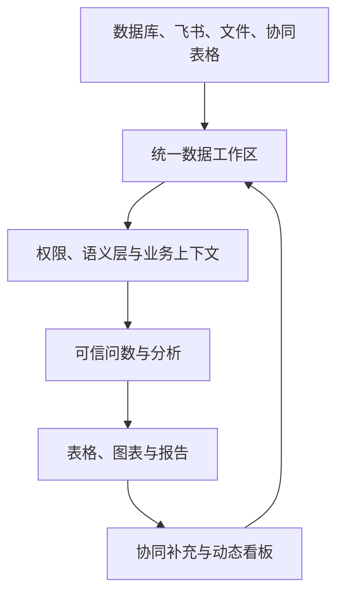
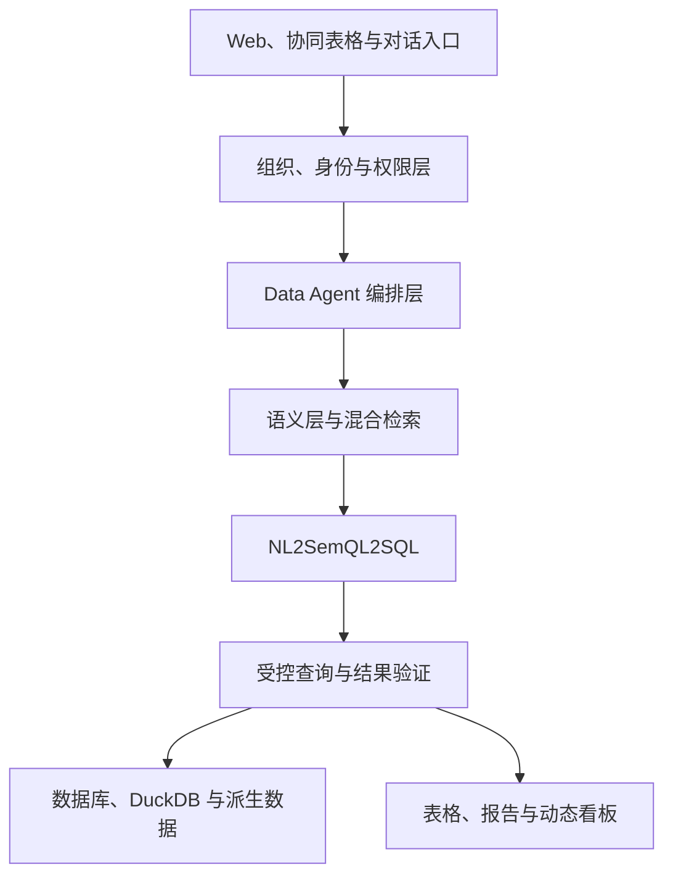
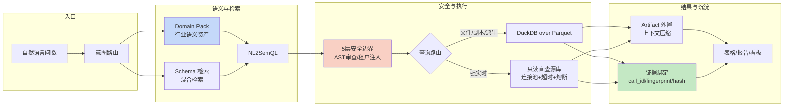

# 数驭穹图——企业 AI 数据分析与协作平台

---
> **文档用途**：面试口述与设计决策底稿（非简历文案）。
> **事实标注**：正文机制多为产品设计与方案；凡声称「已实现、已达某指标」的表述，须由代码、测试或线上运行证据支持。
> **我的角色与交付边界（面试开场定位）**：本项目为我于**深圳市慧泽致远人工智能科技有限公司**实习期间（2025.10–2026.03，远程）参与的 AI 数据分析产品。我主责并深讲：**语义层与领域路由（Domain Pack）、SDD 契约先行下的六阶段链路（NL2SemQL2SQL）、五层安全与信任分级、证据绑定与端到端血缘**；支撑模块：**轻量湖仓（副本/查询路由/生产库保护）**；延伸方向：评测闭环、可编辑协同。每个主责模块都以可被追问的工程实现对待（会持续补代码与评测证据），涉及产品与团队协作的部分不冒充独立完成。

## 0. 项目概述

> ### 最小价值单位
>
> **一次「有来源、有口径、可验证」的分析结果——而且它还能继续被人编辑、共享、随源更新。**
>
> 不是「一段 SQL」，也不是「一个回答」——是**能继续往下用的资产**：结果带着知识出处和证据绑定，
> 用户可以在上面继续筛选、补充业务信息、共享给团队，并让它演化为周期报告和看板。
> 判断一次问数有没有价值，就看它能不能被交出去、被追问、被复用。
>
> （本节原话见 §0「核心主张」、§2.1「用户最终需要的不是一段 SQL」与范式五「证据绑定」；
> 此处只是把它提到最前面——**面试时先讲这个，再讲机制**。）

数驭穹图是一套面向企业业务团队的 AI 数据分析与协作平台。平台统一接入数据库、飞书、结构化文件和在线协同表格，通过企业语义层、轻量湖仓、混合知识检索与 NL2SemQL2SQL 实现可信问数，并将查询结果继续沉淀为可协作、可复用、随源数据更新的表格、图表、报告和企业看板。

项目的核心主张不是“让大模型替业务人员写 SQL”，而是：

> **让企业分散的数据进入统一、受权限控制的工作区，让业务人员用自然语言获得有来源、有口径、可验证的分析结果，再让结果进入团队协作和持续经营分析。**

一句话概括：

> **数驭穹图以多源数据和协同表格为入口，通过可信问数连接数据、分析与协作，使每一次临时问题都能够逐步沉淀为持续更新的企业数据资产。**

---

## 0.5 实测结果与口径（**面试第一优先级：先讲数字，再讲机制**）

> 本节是全部数字的**定位入口**——每个数都标了证据等级。等级定义见 `output/主张-证据账本-刘宇广.md` 第 5 节（**E1 线上记录 / E2 固定评测集或回放 / E3 设计目标**），那里是唯一权威源，本节只做引用。
>
> **起手句（本项目数字全是 E2）**：「这是在**固定评测集**上得到的离线结果，不是线上监控数字。」

| 数字 | 口径 | 等级 |
| --- | --- | --- |
| 查询成功率 **78% → 91%** | 150 条问题中「SQL 可执行**且结果口径正确**」的占比，117 → 约 137 条；**判定含人工复核，非全量 golden SQL 对齐** | **E2** |
| Top-K **Schema** 召回 **81% → 95%** | 150 条问题中正确表/字段是否出现在 Top-K Schema，约 122 → 143 条 | **E2** |
| 危险语句拦截 **100%** / 正常查询误拦 **2.7%** | 300 条对抗集 + 150 条正常查询（4 条误拦）；**构造用例集，不是线上流量** | **E2** |
| 单次分析 Token **18.4K → 3.6K**（−80.4%） | 同一批分析任务的平均输入 Token | **E2** |
| Bad Case 定位 **30 → 8 min** | 从发现失败到确定属于哪个环节的平均耗时 | **E2** |
| 抽检复现一致率 **100%** | 100 条抽检，三重证据绑定（call_id + query_fingerprint + result_hash） | **E2** |
| 百万行查询 P95 **12.6s → 2.7s** | 100 万行 Parquet 上固定 20 组筛选/分组/时间聚合 | **E2** |
| 周报 **40 → 12 min** | 从取数到形成可协作表格的平均操作时长 | **E2** |

**三条口径纪律**：

1. **两条最容易说错的**：① 「查询成功率」在简历上写成「**可执行且口径正确的查询占比**」，**不用「准确率」**——判定含人工复核；② 「81→95%」必须带 **「Schema」** 两个字，它是「该找的表/字段有没有进候选」，**不是文档块召回，也不是幻觉率**。
2. **150 条的分辨率约 ±3%**，它只能抓大幅回退，分辨不出 2–3 个点的改进——**这个限制要主动说出来**，别说成能证明小改进。
3. **E3 不进简历**——未实测的目标只说「设计目标」。

### 0.6 执行中打出来的真实缺陷（**待填 · 面试最想听的部分**）

> **这一节比上面的数字值钱。** 模板要求：「我怎么发现自己做错了」比「我设计得多对」可信得多——
> 因为**设计是推演，缺陷是事实**。RuleArena 那一节就是在真实运行里打出来的四个缺陷
> （工具层把业务拒绝读成成功 / 504 没走恢复路径 / 同幂等键重放被当成新写入 / 门禁理由码泄给 Agent），
> 它现在是那条主线最有说服力的部分。
>
> **本站为什么空着**：材料里只有设计取舍记录，没有「出过什么事」的记录——**这段只能由本人回忆填写，不能编。**

**填写要求**（每条 200–400 字，控制在一屏内）：

| 要素 | 要写什么 |
| --- | --- |
| **现象** | 具体哪里不对——最好带一个可复现的动作或一句报错 |
| **怎么发现的** | 是评测集跑出来的、用户反馈的、还是自己盯监控盯到的？（**发现的路径本身是加分项**） |
| **为什么会漏掉** | 为什么设计的时候没想到 / 为什么测试没拦住 ——**这一条最关键，它证明你真的想过** |
| **怎么修的** | 改在哪一层（数据/规则/工具/权限/流程），**不要写成"加强了检查"这种空话** |
| **补了什么防复发** | 加了哪条回归用例 / 哪个告警 / 哪条口径 |

**候选回忆方向**（挑最像"只有真跑过才知道"的）：

- 有没有过**上线后才发现**的口径问题？（两个地方算出同一个指标却是两个数）
- 有没有过**告警误报/漏报**，事后发现是规则或阈值的问题？
- 有没有过**重跑/回补**导致数据不一致，或者发现某处不幂等？
- 有没有过**权限或边界**被绕过的场景？（哪怕是自己测出来的）
- 有没有过**性能优化之后结果变了**（快了但算错了）？

---

---

## 设计哲学与核心范式

数驭穹图的设计不是从"选哪个 LLM、用哪个框架"开始，而是从五个第一性原理推导出来的。

### 范式一：业务事实层必须先于 Agent——Agent 不得成为第二套事实链

传统企业系统已经拥有业务数据 → 应用服务 → 审批治理 → 当前态查询的完整链路。如果 Agent 从底表重新拼装数据，就会产生第二套事实链：后台页面看到一套数据，AI 助手回答另一套数据。

数驭穹图的核心约束是：**AI 查询必须读取与后台系统、API 和评测系统一致的当前态数据。Agent 只读取，不重新定义业务事实。** 数据过期时采用 fail closed 策略——无法证明数据是当前的，就拒绝生成当前结论，返回明确的失败原因，而不是静默展示旧结果。

### 范式二：SQL 能执行 ≠ 业务答案正确——从 Text-to-SQL 升级为可信问数

普通 Text-to-SQL 只完成"自然语言 → SQL → 查询结果"。但 SQL 解决的是表达转换，不解决业务解释与事实治理。数驭穹图在此基础上增加五层保障：

1. **语义层**：指标口径（"销售额"到底是下单金额还是支付金额）、维度映射、表关联关系在多套数据源间统一
2. **权限贯穿**：企业→工作区→数据源→表→字段→查询→结果→协同表格→报告，权限不因 Agent 入口而扩大
3. **只读安全执行**：SQL AST 校验 + 租户注入 + 超时/行数/扫描量限制 + 禁止访问系统表和敏感字段
4. **结果验证**：返回列的粒度/JOIN 膨胀/金额数量单位一致性/汇总与分组可互核
5. **证据绑定**：每张图表必须绑定 call_id + query_fingerprint + result_hash，不满足绑定关系降级展示

这体现了一个根本原则：**能用代码强制的规则，不要只写在 Prompt 中。能由数据库计算的内容，不要让模型在上下文中自行计算。**

### 范式三：Workflow 管主流程，Agent 处理局部决策——混合 Runtime

数驭穹图不采用完全固定 Pipeline（无法应对自然语言的变化），也不采用完全自主 Agent Loop（工具路径不稳定、成本和延迟不可控、业务前置条件容易被绕过）。

判断标准直接引自已验证的行业实践：

> **如果业务可以画成有限状态机，就应该优先使用 Workflow；如果更像"给定目标后让 AI 自己想办法"，才更适合使用 Agent。**

在数驭穹图中：
- **代码控制**：权限、数据集边界、语义资产版本、Capability Bundle、跨域前置条件、状态转移、重试预算、停止条件
- **模型处理**：自然语言理解、指标和维度候选抽取、在受限能力包内选择局部工具、生成用户可理解的解释

### 范式四：Tool 是业务契约，不是数据库能力的简单代理

模型看到的不是数据库表，而是有限的业务能力。借鉴 Hermes Agent 的能力模块设计和 NL2SQL 可靠图表的受治理 Tool 架构，每个生产 Tool 必须回答四个问题：
1. 它解决什么明确的业务任务？
2. 哪些参数合法，哪些组合非法？
3. 它返回哪些事实和元数据？
4. 空结果、歧义、权限拒绝和系统失败如何区分？

`tenant_id` 等认证上下文参数由服务端注入，不由模型传入。Tool Call 始终视为不可信输入，必须经过 Schema 和业务 Validator 校验。

### 范式五：可信结果不仅要正确，还要能证明它为什么正确

ChartSpec 不是一段任意的 JSON，而是"数据 + 证据"的最小业务协议。合法 JSON ≠ 可信图表——结构化输出只能保证字段存在且类型正确，不能保证数值来自真实查询、数据没有被模型补写、查询结果完整、图表类型适合数据结构。

因此，数驭穹图的图表渲染受**证据绑定验证**约束：只有当 `ChartSpec.call_id = 本轮已完成 Tool Call.call_id` 且 `ChartSpec.query_fingerprint = Tool Call.query_fingerprint` 且 `ChartSpec.result_hash = Tool Result.result_hash` 时，图表才能作为可信结果渲染。绑定失败时降级图表块而非阻断整条回答。

这一设计核心可压缩为五句话：
1. **业务系统先于 Agent，Agent 不得成为第二套事实链**
2. **模型负责理解和表达，代码负责边界和事实**
3. **Tool 是业务契约，不是数据库能力的简单代理**
4. **当前数据必须重新查询，历史上下文不能冒充当前事实**
5. **可信结果不仅要正确，还要能够证明它为什么正确、来自哪里以及是否完整**

---

## 1. 业务背景

### 1.1 企业有数据，但业务人员难以直接使用

中小企业的数据通常分散在多个系统和载体中：

- MySQL、PostgreSQL、MongoDB、SQLite 等业务数据库；
- 飞书表格、Excel、CSV 等办公文件；
- 运营、销售、财务等部门独立维护的业务台账；
- 员工在线共同填写的预算、目标、活动计划和人工分类；
- 不同部门分别制作、口径不完全一致的报表和看板。

运营、财务、销售和管理者真正关心的，往往是“本月销售额为什么下降”“哪个区域增长最快”“各渠道费用占比如何”“销售增长但退货率同时升高的地区有哪些”。但在传统流程中，一次业务分析通常需要经历：

```text
业务人员提出问题
→ 数据或技术人员确认需求
→ 寻找数据源并编写 SQL
→ 导出、清洗和关联数据
→ 制作表格与图表
→ 通过截图或文件交付结果
→ 问题变化后重新执行整套流程
```

这不仅增加了数据团队的临时取数负担，也让业务决策受制于排期、沟通误差和重复劳动。

### 1.2 传统数据分析存在五类核心问题

#### 数据分散

数据库、文件、飞书和人工台账彼此割裂，业务人员很难在一个入口中完成跨源查询与关联分析。同一个指标也可能在多个文件和看板中存在不同版本。

#### 分析门槛高

业务人员熟悉业务，却不一定掌握 SQL、数据建模和传统 BI 配置；数据人员理解技术，但未必完全理解每个部门的业务口径。一次简单取数经常需要多轮沟通。

#### 指标口径不统一

“销售额”“活跃用户”“有效订单”等业务概念可能存在多种定义。仅向大模型提供 Schema，即使生成的 SQL 可以执行，也可能得到业务含义错误的结果。

#### AI 问数缺乏可信性

普通 Text-to-SQL 容易选错表、用错字段、遗漏租户条件、产生错误关联或放大数据。SQL 执行成功并不代表回答正确，更不能代表结果满足企业权限和审计要求。

#### 结果无法沉淀

普通 ChatBI 往往回答完一个问题就结束。结果难以继续编辑、补充业务信息、共享给团队，也无法自然演化为周期报告和长期看板。

### 1.3 项目要解决的根本问题

数驭穹图解决的不是单点 SQL 生成问题，而是：

> **如何把企业分散的数据组织成受权限控制、具备业务语义、可持续使用的数据资产，让非技术人员通过自然语言完成从取数、分析到结果交付和团队协作的完整闭环。**

---

## 2. 产品定位

### 2.1 产品定义

数驭穹图是一套服务真实企业客户的 AI Native 数据分析与协作工作区。

平台不以“聊天框”替代全部数据工作，也不是在传统 BI 旁边简单增加自然语言入口，而是将企业数据入口、数据资产管理、可信问数、协同表格、报告和动态看板组织为一个连续产品流程。

NL2SQL 是平台实现自然语言取数的重要技术，但只是内部能力之一。用户最终需要的不是一段 SQL，而是：

- 一个符合权限和业务口径的真实结果；
- 一份能够继续筛选、编辑和共享的结构化数据；
- 一张可以持续刷新的图表或企业看板；
- 一条可以回溯数据来源、查询条件和生成过程的分析链路。

### 2.2 目标用户

| 用户角色 | 核心需求 |
|---|---|
| 企业管理员 | 创建企业工作区，管理成员、角色、数据源和资源权限 |
| 数据管理员 | 接入数据源，维护元数据、业务语义、指标口径和数据集 |
| 运营、销售、财务等业务人员 | 用自然语言问数，生成图表和报告，维护协同表格 |
| 管理者 | 查看持续更新的企业看板和经营报告，对结果继续追问 |
| 数据或技术人员 | 处理复杂查询、治理高质量 SQL 示例、分析失败案例和维护系统稳定性 |

### 2.3 五层产品能力

| 产品层 | 核心职责 |
|---|---|
| 企业数据入口 | 接入数据库、飞书、结构化文件和在线协同表格 |
| 数据资产层 | 管理 Schema、元数据、业务域、指标、维度、关联关系和资源归属 |
| AI 分析层 | 理解业务问题，生成分析计划，通过 NL2SQL 执行可信查询并解释结果 |
| 协作交付层 | 将结果沉淀为协同表格、派生数据集、图表、报告和企业看板 |
| 组织治理层 | 管理企业、工作区、成员、角色、行列权限、审计和资源隔离 |

### 2.4 核心业务对象

平台围绕六类对象组织产品能力：

| 核心对象 | 说明 |
|---|---|
| 数据源 | 企业数据库、飞书、文件、协同表格等原始数据入口 |
| 数据集 | 经过授权、整理和描述后可供分析的数据范围 |
| 语义资产 | 指标、维度、业务术语、计算公式、关联关系和高质量 SQL 示例 |
| 分析 | 用户问题、分析计划、查询、结构化结果、图表和解释 |
| 协作资产 | 可由系统计算和人工共同维护的在线表格与派生数据集 |
| 交付资产 | 周期报告、企业看板及其刷新策略、权限和版本 |

### 2.5 产品闭环



平台形成两条相互连接的循环：

第一条是数据分析循环：

```text
业务问题 → 查询与验证 → 结构化结果 → 图表与解释 → 后续追问
```

第二条是业务协作循环：

```text
业务录入 → AI 分析 → 结果回写 → 人工补充 → 再次分析 → 持续看板
```

### 2.6 核心差异化

#### 从 Text-to-SQL 升级为完整 Data Agent

普通 Text-to-SQL 通常只完成“自然语言 → SQL → 查询结果”。数驭穹图进一步覆盖数据发现、口径理解、权限校验、查询执行、结果验证、可视化、协作回写和持续刷新。

SQL 只是获取数据的中间表示，不是最终产品。

#### 协同表格既是工作界面，也是正式数据源

预算、销售目标、活动计划、人工分类等信息通常不存在于业务数据库中。业务人员可以直接通过协同表格创建和共同维护这些数据，保存后将其作为正式数据源参与 SQL 查询、多表关联、图表分析和看板生成。

分析结果也可以回写协同表格，由团队补充原因、目标、备注和判断，再进入下一轮分析。这使平台具备普通 ChatBI 缺少的业务协作闭环。

#### AI 认知与确定性执行分离

大模型负责理解问题、识别指标和维度、选择工具、组织解释与报告；后端系统负责权限、查询、计算、存储、校验、版本和审计。

> **让模型负责理解和编排，让数据库与查询引擎负责事实。**

#### 临时问题可以沉淀为长期资产

一次自然语言问数可以逐步演化为：

```text
临时问题
→ 可验证查询
→ 可复用数据集
→ 协同表格
→ 动态图表
→ 周期报告
→ 持续更新的企业看板
```

#### 轻量数据底座适配中小企业

平台通过 PostgreSQL 管理业务数据、权限和数据目录，通过对象存储保存文件及 Parquet 数据，使用 DuckDB 对结构化文件执行 SQL 查询和聚合，并通过 MCP 将受控的数据目录、查询和派生数据能力提供给 Agent。

关键设计是**查询路由与数据副本**：上传文件、协同表格和历史同步数据以 Parquet 副本进入湖仓，由 DuckDB 就地计算；只有必须读当前态的查询才走客户生产库的只读受限连接——分析负载与客户业务负载在物理上隔离（详见 4.11）。

它不复制大型企业复杂的数仓平台，而是在成本和工程复杂度可控的前提下，把文件、数据库、表格与 AI 分析统一起来。

---

## 3. 用户流程

### 3.1 企业工作区初始化

企业管理员创建组织和工作区，邀请成员并分配管理员、数据管理员、业务成员或只读成员等角色。

随后配置不同成员对数据源、数据集、字段、协同表格、分析结果、报告和看板的访问权限。用户进入自然语言入口后，只能发现和调用自己有权访问的数据资源，不能因为使用 Agent 绕过原有权限边界。

### 3.2 数据源接入与数据资产登记

数据管理员接入 MySQL、PostgreSQL、MongoDB、SQLite、飞书等数据源，或上传 Excel、CSV 等结构化文件。业务人员也可以直接创建协同表格，录入企业尚未系统化的数据。

平台完成：

```text
连接与凭据校验
→ 读取 Schema 和字段信息
→ 登记数据源、表和文件
→ 识别字段类型与基础统计信息
→ 配置资源归属和访问权限
→ 形成可供分析的数据目录
```

结构化文件可以转换为适合查询和复用的列式数据格式；数据库数据仍由受控连接读取，不向模型暴露数据库凭据。

### 3.3 语义层建设与业务确权

数据管理员和业务负责人共同维护企业语义资产，包括：

- 业务域及其适用数据集；
- 指标名称、业务定义和计算公式；
- 维度、层级和时间口径；
- 表之间经过确认的关联关系；
- 业务同义词、字段说明和常用筛选条件；
- 历史高质量 SQL、用户确认过的问题与查询；
- 行级、列级和敏感字段访问规则。

例如，“销售额”必须明确是下单金额、支付金额还是确认收入。存在多个合法口径时，平台要求用户选择或澄清，而不是由模型自行猜测。

### 3.4 自然语言问数

业务人员进入对话分析页面，可以指定数据集，也可以直接提出问题：

> 对比本季度各地区的销售额和退货率，找出销售增长但退货率明显升高的地区。

系统按以下链路处理：

```text
识别用户、企业和权限
→ 判断业务域与分析意图
→ 检索指标、维度、Schema、关联关系和 SQL 示例
→ 解析指标、维度、时间范围、筛选和排序
→ 信息不足或口径冲突时向用户澄清
→ 生成结构化分析计划
→ 转换为对应数据源的 SQL
→ 安全校验并执行查询
→ 验证结果
→ 生成表格、图表和文字说明
```

在自然语言进入 SQL 生成前，系统先形成结构化 `AnalysisIntent`：

```json
{
  "task_type": "COMPARE_AND_DIAGNOSE",
  "business_domain": "sales",
  "metrics": ["paid_amount", "refund_rate"],
  "dimensions": ["region", "month"],
  "time_range": ["2026-04-01", "2026-06-30"],
  "filters": [],
  "ambiguities": [],
  "required_capabilities": ["governed_aggregate", "chart"],
  "risk_level": "READ_ONLY"
}
```

`AnalysisIntent` 不是简单的意图标签，而是连接自然语言、语义资产、权限和执行能力的产品契约。它需要明确：

- 当前是查明细、看趋势、做对比、解释变化还是生成报告；
- 使用哪个业务域、指标和维度；
- 当前时间、筛选、排序和 TopN 范围；
- 哪些字段仍有歧义；
- 允许使用哪些 Capability Bundle；
- 是否涉及跨域、敏感字段或高成本查询。

链路中，`AnalysisIntent` 是连接语义与执行两端的**契约草稿**：其指标、维度与口径字段经澄清确认并通过授权校验后，才固化为结构化分析计划（SemQL，见第 4.3 节），再据此生成 SQL——同一意图的两级产物，不重复建模。

当“销售额”“客户数”“本月”等表达存在多个合法定义时，系统优先提供有限选项供用户确认，而不是提出宽泛的开放问题或由模型自行猜测。

澄清选项不是模型随手生成，而是由 Domain Pack 中的指标口径定义、术语别名与数据集关联约束**枚举**（数据管理员维护、版本化，见第 4.2 节），并按当前工作区权限过滤；歧义由确定性匹配判定——同一表达命中多个口径或业务域即进入澄清，用户选定后冻结进 `AnalysisIntent`，模型不自行决定口径。

用户可以在多轮对话中继续提出：

- “只看华南地区”；
- “改成按月展示”；
- “把销售额换成毛利额”；
- “排除内部测试订单”；
- “生成柱状图”；
- “把这部分加入月度经营报告”。

系统继承已确认的分析上下文，但每次执行仍重新进行权限和参数校验。

### 3.5 查询验证与有限纠错

SQL 执行成功不等于答案正确。平台在执行前后分别进行校验。

执行前检查包括：

- 只允许只读查询和经过授权的工具；
- 基于 SQL AST 校验语句类型、表、字段和函数；
- 注入租户、行级和列级权限；
- 限制时间范围、返回行数、执行超时和最大扫描量；
- 禁止访问系统表、未授权 Schema 和敏感字段；
- 对高成本查询执行 EXPLAIN 或成本预估。

执行后检查包括：

- 返回列、维度和指标是否符合分析计划；
- 聚合粒度是否正确；
- JOIN 是否造成重复或数据膨胀；
- 金额、数量、比例和单位是否一致；
- 结果是否为空、越界或明显异常；
- 汇总值与分组值是否可以相互核对；
- 图表类型是否适合当前结果结构。

语法、字段名、数据库方言和类型错误可以在重新加载元数据后有限重试；指标口径、业务含义和数据范围存在歧义时必须停止并询问用户；权限不足时直接拒绝，不能通过改写 SQL 绕过。

**选错表、选错字段怎么办**——这是问数准确率的主要威胁，平台用四道防线处理：

1. **事前收窄**：确定性领域路由 + 域内混合检索，模型只看到本域 Top-K 相关表和字段，而不是全库 Schema——候选集越小，选错的概率越低；
2. **事中结构化**：AnalysisIntent / 分析计划先于 SQL 生成，指标、维度、表和关联在计划层完成授权与语义校验，选错表在生成 SQL 之前就被拦截，或显式暴露为澄清问题；
3. **事后校验**：JOIN 膨胀、聚合粒度异常、单位不一致、汇总与分组不可互核等启发式检查，能捕获大多数错表错字段的典型症状；
4. **失败回流**：用户纠正和评测失败按六阶段归因分类——路由错、检索错、计划错（含口径歧义与澄清环节）、SQL 错、执行错、解释错（见 3.8），与第 4.3 节六阶段链路一一对应；修正后的正确查询进入高质量示例库、错误模式进入回归集——每一次选错都变成语义资产的修正输入。

最终结果同时展示数据来源、指标口径、时间范围、筛选条件、最后更新时间和必要的质量提示。

### 3.6 结果回写与协同分析

用户可以将问数结果：

- 创建为新的协同表格；
- 写入已有表格的指定工作表；
- 保存为平台内部派生数据集；
- 继续补充原因、目标、分类、负责人和业务判断；
- 再次参与 NL2SQL 和多表关联分析；
- 添加到报告和企业看板。

为了防止源数据刷新覆盖人工内容，协同表格区分：

| 区域 | 处理方式 |
|---|---|
| 系统计算区域 | 由查询结果生成和刷新，默认只读 |
| 人工协作区域 | 允许业务人员填写原因、目标、备注和判断 |
| 关联主键 | 使用稳定业务主键匹配和更新数据，不按行号覆盖 |

每次回写保存查询定义、数据来源、生成时间、创建人、关联主键和版本信息，使分析结果保持可追溯。

可编辑性是协作的入口：同一份结果既能继续在表格中编辑（填写原因/目标/判断），又能作为派生数据源被后续查询引用——结果不是终点，而是会随源更新的活数据。

### 3.7 报告和动态看板

业务人员可以把多个分析结果组合成经营报告，或将图表加入企业看板。看板保存的不是一次查询产生的静态截图，而是：

- 指标、维度与分析计划；
- 关联数据集与查询定义；
- 筛选条件和图表配置；
- 刷新策略与数据权限；
- 最近成功版本和最后更新时间。

不同数据源采用不同刷新方式：

| 数据源 | 更新方式 |
|---|---|
| 企业数据库 | 定时刷新、手动刷新或业务事件触发 |
| 飞书和协同表格 | 保存后触发刷新或定时同步 |
| 上传文件 | 新版本上传后重新计算 |
| Parquet 派生数据 | 增量或全量重建后刷新 |
| 外部接口 | 根据调用频率、限额和缓存策略更新 |

刷新失败时保留上一个成功版本，同时明确标记数据已过期和失败原因，不能静默展示旧结果。

### 3.8 反馈回流与持续优化

用户可以对回答进行确认、修正或反馈。系统将高质量结果沉淀为可复用的业务术语、查询示例和评测样本，将失败案例按六阶段归因分类：路由错、检索错、计划错（含口径歧义与澄清）、SQL 错、执行错、解释错——与第 4.3 节六阶段链路、第 3.5 节纠错策略是同一套口径。

新模型、新提示词、语义资产或查询策略上线前，使用企业级评测集进行离线回归，避免修复一个问题后破坏已有业务场景。

---

## 4. 系统架构与核心机制

### 4.1 总体架构



> 图为顶层控制流简图：数据源接入见第 3.2 节/第 4.11 节，反馈回流见第 3.8 节/第 8.4 节，权限贯穿见第 4.5 节/第 6.1 节——图内未逐节点展开。

平台以 PostgreSQL 管理企业、成员、权限、数据目录、语义资产和分析记录；使用对象存储保存上传文件与列式数据；使用 DuckDB 查询文件和 Parquet 数据；通过数据库连接器访问授权业务数据；使用 Univer 提供在线协同表格界面；通过 MCP 将受控的数据发现、查询和派生数据能力暴露给 Agent。

### 4.2 确定性领域路由与域内检索

系统先根据用户选择、业务术语、指标和数据集判断问题属于销售、财务、客户、库存等哪个业务域。明确领域后，只在该领域内检索 Schema、指标、维度、关联关系、业务术语和 SQL 示例，减少无关上下文和跨域同名指标的干扰。

业务域不是目录名，而是可安装的 **Domain Pack**：每个域是一个版本化的语义资产包——指标定义与计算口径、业务术语与同义词、数据集清单与合法关联、高质量 SQL 示例、典型边界场景和企业评测题。平台预置行业包（电商、医美、教育等），企业在其上增删改形成自己的域。域由数据管理员确权维护（分域规则见 4.11），路由与域内检索都以域为边界。

检索综合使用关键词匹配、元数据过滤、向量召回和相关性重排；明确的指标编码、表名和字段名优先采用确定性匹配。多个业务域均可能成立时向用户澄清。

### 4.3 Data Agent 六阶段链路与 NL2SemQL2SQL

Data Agent 的核心链路拆为六个阶段，每个阶段有独立的输入、输出和失败归因：

```text
① 意图理解与领域路由   输入自然语言 → AnalysisIntent 草稿 + 业务域判定
② 域内语义检索         指标、维度、Schema、关联、SQL 示例（Top-K）
③ 分析计划确认         口径歧义澄清 → 结构化分析计划（SemQL）
④ SQL 生成与静态校验   方言转换 → AST 审查 → 权限注入 → 成本预估
⑤ 受控执行与结果验证   路由执行 → 粒度/膨胀/单位校验 → 有限纠错重试
⑥ 解释生成与证据绑定   图表/说明生成 → call_id/fingerprint/hash 绑定
```

六阶段拆分的价值在**归因**：一次失败可以精确定位在哪个阶段——路由错、检索错、计划错、SQL 错、执行错还是解释错——这正是 3.5 纠错策略和 3.8 回流分类的骨架。阶段 ①②⑥ 允许模型自主处理，③④⑤ 由确定性代码主导，与 4.10 的混合 Runtime 一致。

**工程口径即契约先行（SDD）**：Agent 可调用的每一种能力先注册 Schema 契约（Tool Contract），结构化中间产物（AnalysisIntent、SemQL）先定义字段与校验规则，SQL 与输出先过 AST/字段 Schema——先有契约，再有生成与校验。这让每个环节的失败都能归因到「违反了哪条契约」而不是模型的随机性；能力或契约的增改以版本为界，上线前在评测集上回测（见第 4.6 节/第 8.4 节）。

系统不让大模型从自然语言直接跳到最终 SQL，而是先生成结构化分析计划，例如：

```json
{
  "metric": "paid_amount",
  "dimensions": ["region", "month"],
  "time_range": ["2026-01-01", "2026-06-30"],
  "filters": [
    {"field": "order_status", "operator": "=", "value": "paid"}
  ],
  "sort": [
    {"field": "paid_amount", "direction": "desc"}
  ]
}
```

平台先验证计划中的指标、维度、时间和筛选是否被授权、是否符合语义层定义，再将其转换为 MySQL、PostgreSQL、DuckDB 等不同数据源方言的 SQL。

这种设计把“业务问题理解是否正确”和“SQL 实现是否正确”拆成两个可独立验证的阶段，也为跨数据源执行和错误定位提供稳定中间表示。

### 4.4 只读安全执行

模型不持有数据库凭据，也不具备任意数据库写权限。查询由后端使用受限账号或受控执行器完成，统一实施：

- 企业和用户权限校验；
- 表、字段、行和敏感数据范围控制；
- 只读 SQL AST 校验；
- 查询超时、扫描量、并发和结果行数限制；
- 成本预估、取消和资源配额；
- 请求、分析计划、SQL、结果摘要和错误审计。

Agent 只能调用后端定义的受控工具，不能自行构造连接绕过权限和审计。

### 4.5 多租户与权限贯穿

权限不是单纯控制页面可见，而是贯穿完整链路：

```text
企业 → 工作区 → 数据源 → 表与字段 → 数据集 → 查询 → 结果 → 协同表格 → 报告与看板
```

保存或分享分析资产时不扩大原始数据权限。接收者只有在具备对应数据权限时才能重新执行查询或查看明细；对于允许分享的聚合结果，系统按照企业策略决定是否固化快照以及是否隐藏来源字段。

### 4.6 可观测、审计与评测

系统记录每次分析的用户、企业、业务域、检索上下文、分析计划、SQL、执行耗时、数据版本、结果摘要、重试过程和用户反馈。

线上监控关注查询成功率、澄清率、SQL 执行错误、权限拒绝、查询耗时、看板刷新失败和用户修正等指标；离线评测同时验证业务理解、SQL 正确性、执行结果、权限边界和最终回答，而不只比较 SQL 字符串是否一致。

### 4.7 语义资产卡与知识治理——记忆分层 + 可失效

语义层不是一份巨型 Prompt，而是一组可以独立维护、校验和版本化的企业知识资产。借鉴得物 Hermes Agent 的规则资产化思想——“临时信息留在本轮任务，复用做法沉淀为规则包”——数驭穹图的语义资产按变更频率和治理方式分为三层：

| 层次 | 内容 | 治理方式 | 过期处理 |
|---|---|---|---|
| **技术元数据层** | Schema、字段、类型、分区和更新状态 | 自动同步 | DDL 差异检测 → 生成差异任务 → 健康度降级 |
| **业务规则层** | 指标、术语、关联、场景和口径 | 数据管理员与业务负责人共同确权 | 长期未核验 → 降低可信度 → 暂停自动问数 |
| **公共规则层** | 日期、权限、查询限制和公共维度 | 平台统一维护 | 版本化管理，变更后全局生效 |

每个核心数据表或数据集使用统一知识卡片描述：
1. **元数据**：数据源、粒度、分区、更新时间和负责人
2. **字段语义**：主键、维度、指标、类型、单位和使用限制
3. **场景映射**：适用于什么问题、不适用于什么问题
4. **关联约束**：合法 JOIN、基数关系、一对多风险和跨域前置条件
5. **指标口径**：公式、过滤、去重、退款、时间和统计粒度
6. **高质量查询**：经过确认的 SQL、分析计划和典型边界场景

**语义资产健康度评分**借鉴 BP Claw 的 PRD 质量五维评分思路，从六个维度量化：
- 字段覆盖率：已标注语义的字段占全部可分析字段的比例
- 口径完整度：核心指标的业务定义、计算公式和适用范围是否完整
- 关联标注率：表间合法 JOIN 关系是否已标注基数和跨域前置条件
- 示例覆盖率：高质量查询示例覆盖的场景类型
- 最近核验时间：关键指标口径的上次人工确认距今时间
- 回归通过率：该资产在评测集中的表现

关键约束：**指标口径一票否决**。如果”销售额””活跃用户”等核心指标缺少明确业务定义（类似 BP Claw 中”技术口径 < 15/25 分 → 不可执行”），暂停该资产所在域的问数能力。

平台定期对比线上 Schema 与语义资产。字段删除、类型变化、分区调整和数据源失效会生成差异任务，在完成更新前降低相关资产健康度或暂停自动问数——**过期语义规则不能冒充当前口径**。

### 4.8 查询 Provenance 与可信图表——合法 JSON ≠ 可信图表

SQL 能执行、JSON 能解析，都不能证明结果可信。结构化输出只能保证字段存在且类型正确，不能保证数值来自真实查询、数据没有被模型补写、查询结果完整。

因此，数驭穹图要求每次受控查询形成完整 Provenance，并将图表渲染受**证据绑定验证**约束：只有当 `ChartSpec.call_id`、`query_fingerprint`、`result_hash` 与本轮真实 Tool Call 及其结果三重一致时，图表才允许渲染，绑定失败降级为占位块并说明原因。

每次查询保存的 Provenance 包括：数据源与数据版本、语义资产版本、分析计划、最终 SQL（含改写历史）、执行耗时、返回行数与扫描量、结果来源（实时直查 / 湖仓副本 / 缓存）。看板和报告的每次刷新继承同一套 Provenance，使任何历史图表都能回答「这个数字当时是怎么算出来的」。

**端到端血缘**：Provenance 回答的是「单次查询为什么可信」；系统在此基础上，对「源数据 → 湖仓副本/派生数据 → 协同表格 → 报告与看板 → 业务结论」维护**端到端血缘图**。血缘随版本传播：派生数据与看板记录所依赖的源与语义版本，源或口径更新后，下游在刷新前被标记「待重建/已过期」，避免旧结论挂着新数据的假象；点开任一结论可回看整条依赖链。

### 4.9 Context、Session Ledger 与 Artifact

平台区分五类状态：

| 状态 | 作用 |
|---|---|
| Visible Memory | 用户可见的对话与结果 |
| Trajectory | Agent 实际调用过的模型、工具和重试 |
| Working Context | 当前模型真正看到的精选上下文 |
| Evidence Memory | 历史结论所引用的查询和证据 |
| Current Business Truth | 本轮重新查询得到的当前业务事实 |

历史语义、用户已确认的分析偏好和未解决问题可以进入 Working Context；价格、库存、销售额等当前业务事实必须重新查询，不能由历史回答替代。

每个会话使用 Session Ledger 保存用户消息、AnalysisIntent、Tool Call、Tool Result、Artifact、Checkpoint 和最终结果。一个回合按照 Atomic Turn 提交，不能只保存工具调用而丢失返回结果。

大规模明细和文件结果超过阈值时外置为 Artifact，主上下文只保留：

- 口径和参数；
- 聚合事实；
- 完整性状态；
- 关键样例；
- `artifact_id`、`call_id` 和 Hash。

上下文达到预算后生成结构化 Checkpoint，保留事实、决策、未解决问题、证据引用、数据快照和语义版本，而不是简单截断历史聊天。

### 4.10 Workflow 与 Agent 的混合 Runtime——确定性代码守住业务不变量

平台不采用完全固定 Pipeline（无法应对自然语言的变化），也不允许 Agent 自由决定所有路径（工具路径不稳定、成本延迟不可控、业务前置条件容易被绕过）。

这里借鉴了得物社区活动搭建的核心判断和 Hermes Agent 的能力模块设计——**”如果业务可以画成有限状态机，就应该优先使用 Workflow；如果更像'给定目标后让 AI 自己想办法'，才更适合使用 Agent”**。数驭穹图的自然语言问数是典型的前者，因此采用混合 Runtime：

**由代码控制**（确定性护栏）：
- 身份、租户和权限
- 数据集和敏感字段边界
- 语义资产版本和数据新鲜度
- Capability Bundle（可用/禁用/必需 Tool 三态）
- 跨域前置条件
- 状态转移、重试预算和停止条件
- 查询执行、结果校验和证据绑定

**由模型处理**（语言和推理的不确定性）：
- 自然语言和多轮上下文理解
- 实体和指标候选抽取
- 在受限能力包内选择局部工具
- 生成用户可理解的解释和展示意图

跨域分析使用有限状态机建模。例如”销售增长但退货率同步升高的地区”需要依次满足：销售指标已确认 → 退货口径已确认 → 地区维度兼容 → 时间范围一致 → 查询结果完整 → 允许最终比较。每个状态定义：允许调用什么、禁止调用什么、必须拥有的证据、失败如何处理、什么条件下可以结束。**任一前置条件失败都不能进入最终比较**——这与 Hermes Agent 的”三道门”设计一脉相承：Agent 的可靠性取决于状态机是否能表达”什么时候允许进入下一步，什么时候必须停止”。

---

### 4.11 轻量湖仓——数据副本、查询路由与生产库保护

湖仓要解决的核心问题：**分析负载绝不能伤害客户生产库**。中小企业客户的数据库往往和应用共用实例，性能和可用性余量很小；一条失控的多表关联慢 SQL 打进生产库，可能拖垮客户正常业务的写入和插入。

**存储与计算分层**：

```text
PostgreSQL      平台自身业务数据、组织权限、数据目录、语义资产（平台私有，与客户数据分离）
对象存储        上传文件、协同表格快照、历史同步数据统一转为 Parquet 列式副本
DuckDB          对 Parquet 嵌入式执行 SQL，多表关联和聚合在平台侧本地完成，无网络往返
受控连接器      只读受限账号访问客户业务库，仅服务必须读当前态的查询
MCP             把数据目录、受控查询、派生数据能力注册为 Agent 可调用的受控工具
```

**能力即插即用（动态注册）**：接入新数据源时，连接器完成元数据发现与能力探测后，自动注册数据目录、受控查询工具与语义建议（见 5.2），无需为每种源新增代码分支——这是「新数据源接入从 2 天降到 2 小时」的实现基础。

**查询路由规则**（由代码决定，不由模型选择）：

| 数据类型 | 查询路径 | 原因 |
|---|---|---|
| 上传文件、协同表格 | DuckDB over Parquet | 平台自有副本，对外部零影响 |
| 派生数据集、历史分析快照 | DuckDB over Parquet | 生成时已固化 |
| 配置了定时同步的数据源 | 优先湖仓副本，用户可主动选择「实时直查」 | 用副本新鲜度换生产库安全 |
| 强实时数据（今日库存、当前订单状态等） | 受控只读直查源库 | 当前态必须重查（范式一） |

**生产库保护机制**（即使直查也全部生效）：

- 只读受限账号 + 连接池上限 + 单连接 statement timeout，AI 查询与客户业务的连接资源物理隔离；
- 查询前 EXPLAIN / 成本预估，超过扫描量或耗时阈值直接拒绝，并建议用户改用副本数据或收窄时间范围；
- 慢查询熔断：超预算查询被取消并标记，同一数据源连续触发熔断时，临时降级为「仅副本数据可查」并明确告知数据新鲜度；
- 分析查询走独立并发配额，避免 AI 流量挤占业务高峰期的正常连接；
- 上传文件解析、格式转换与公式/宏类载荷（如 CSV 公式注入、解析炸弹）在一次性隔离容器中执行，清洗后才进入湖仓副本；平台分析引擎本身内嵌于平台侧（DuckDB），与客户生产库天然隔离，不引入重型沙盒集群。

**与 Ontology 的关系**：4.7 的语义资产卡本质上是一套**面向 AI 的轻量 Ontology**——数据对象（数据集/表）、术语（指标/维度/同义词）、关系（合法 JOIN 与基数约束）、判断逻辑（口径公式、适用场景、跨域前置条件）。它和 Palantir Ontology、dbt 语义层要解决的是同一个问题——让原本杂乱的结构化与非结构化数据，变得可被 AI 理解、检索、计算乃至支撑决策——但实现路径不同：不建重型本体平台，语义作为资产卡随数据目录分发，AI 检索语义卡即获得「这张表是什么、能和什么关联、口径是什么」的完整上下文。

**引擎选型**：不引入 OceanBase、ClickHouse 这类独立分析引擎。湖仓的价值在分层和路由，不在引擎规模；对中小企业客户，独立大数据集群意味着额外的部署、运维和成本负担，与产品定位矛盾。

**多源数据分域**：分域以数据管理员手动确权为主——接入数据源后，管理员将表和数据集划入业务域，平台基于字段名、术语命中和已有 Domain Pack 给出建议归属，人工确认后生效。两个关键边界处理：

- **一表多域 / 公共关联表**：日期、地区、客户、商品等公共维表注册为**共享资产**，不归属任何单一域，各域通过引用使用；跨域 JOIN 必须经过共享资产或已声明的跨域前置条件（4.10 状态机），不允许隐式跨域连接。业务表确需多域可见时，采用主域归属 + 其他域只读引用，权限和健康度仍按主域治理；
- **湖仓数据与直查数据的授权区分**：进入湖仓的 Parquet 副本继承**同步时刻的权限版本快照**——权限变更后必须重新同步才会更新，保证湖仓里的数据不会比权限更宽；只读直查则实时经过完整权限贯穿链路。两条路径授权机制不同，但都收敛到同一套行列权限模型。
- **权限撤销与就地过滤**：权限变更即时对**下一次查询**生效；副本与已分享出去的历史快照携带同步时刻的权限版本，访问时先按当前有效权限校验，失效则拒绝展示并提示重新生成，不追溯改写历史文件。行列权限在 DuckDB 就地查询上的落地口径是「按需读取 + 平台侧最终裁剪」——DuckDB 为平台内嵌引擎、数据已在平台侧，先在本地执行，返回用户前再按当前用户的行列范围做最终投影与过滤；只有直查路径才把行列条件随 SQL 注入源库。两条路径用户最终看到的行列集合一致。

---

## 5. 产品功能模块

### 5.1 企业与工作区

- 企业、工作区、成员、角色和邀请；
- 数据源、数据集、字段、协作资产和报告权限；
- 资源分享、聚合快照和敏感字段策略；
- 企业级模型、配额和审计设置。

### 5.2 数据接入与目录

- MySQL、PostgreSQL、MongoDB、SQLite 等数据库连接；
- CSV、Excel、Parquet 等结构化文件；
- 飞书和在线协同表格；
- Schema 抽取、基础画像、样例预览和数据新鲜度；
- 同步型数据源的湖仓副本配置（同步频率、新鲜度标记、熔断降级状态）；
- 对象存储、文件版本和派生数据集。

### 5.3 语义资产中心

- 业务域、术语和同义词；
- 指标、维度、层级和时间口径；
- 关联关系和跨域前置条件；
- 高质量 SQL 与分析计划；
- 资产确权、版本、健康度和 DDL 差异任务。

### 5.4 AI 分析工作台

- 自然语言问数和多轮追问；
- AnalysisIntent 预览和有限澄清；
- Tool 执行进度、结果、证据和错误说明；
- 表格、图表、文字分析和报告草稿；
- 历史分析、复用、分享和继续追问。

### 5.5 协同表格与派生数据

- 在线编辑、多人协同和单元格权限；
- 查询结果按稳定主键回写；
- 系统计算区域与人工区域隔离；
- 协同表格注册为正式数据源；
- 版本、刷新、冲突和审计管理。

### 5.6 报告与企业看板

- 多个分析结果组合为报告；
- 动态图表、筛选和钻取；
- 数据源级刷新策略；
- 最近成功版本、过期标记和失败原因；
- 数据来源、指标口径和快照说明。

### 5.7 Eval 与运营中心

- 企业黄金问题集和能力集；
- Regression、Holdout 和 Adversarial 用例；
- Tool、Oracle、Presentation、Rubric 和成本评分；
- Trace 回放、失败聚类和版本比较；
- 用户修正、Bad Case 和语义资产优化任务。

---

## 6. 可靠性、安全与失败处理

### 6.1 多层安全边界

执行侧安全边界共五层，与 13.3 面试卡口径一致：

1. **入口层**：模型调用前验证身份、企业、权限和 AI 配额；
2. **能力层**：只注册当前用户和数据集允许使用的受治理能力，Capability Bundle 三态控制（可用/禁用/必需）；
3. **调用层**：将模型生成的 Tool Call 视为不可信输入，执行 Schema 和业务 Validator 校验，`tenant_id` 等认证上下文由服务端注入；
4. **执行层**：查询使用受限账号、只读事务、SQL AST 审查、超时、行数、扫描量和连接数限制；
5. **输出层**：检查敏感字段、完整性和证据绑定，字段级脱敏后输出。

**执行与数据信任分级**（与第 4.11 节同套定义）：平台对自有副本/派生数据（平台内）开放最高可操作度，对客户生产库只开放受控只读直查；工具与数据源按信任域分级注册，Agent 只能触达当前任务被授予的信任级。权限模型、连接器、湖仓路由与安全边界共享同一套信任分级，避免「安全边界是一套、路由是另一套」。

此外，分享、回写和刷新时重新校验原始数据权限——权限不因资产形态变化而扩大。

### 6.2 失败语义

- `AMBIGUOUS`：业务口径存在多个合法解释，需要用户确认；
- `PERMISSION_DENIED`：资源、字段或数据范围无权访问；
- `STALE_DATA`：当前数据或语义资产已经过期；
- `INVALID_PLAN`：分析计划使用了非法指标、维度或组合；
- `QUERY_REJECTED`：SQL 安全、成本或扫描量检查未通过；
- `PARTIAL_RESULT`：结果被截断或部分数据源失败；
- `EVIDENCE_BINDING_FAILED`：图表、报告或回写无法绑定真实查询；
- `FAILED`：关键业务不变量无法满足；
- `COMPLETED`：查询、结果和必要证据均通过验证。

### 6.3 查询和刷新可靠性

- 语法、字段和方言错误允许在重新加载元数据后有限重试；
- 权限、口径和业务歧义不得通过重写 SQL 绕过；
- 相同回合、相同参数的查询去重；
- 直查客户生产库的连接数、并发和 statement timeout 走独立配额，分析负载与业务负载隔离；
- 慢查询熔断后可自动降级到湖仓副本，并在结果中明确标注数据新鲜度；
- 无依赖查询可以并发执行，但结果写回顺序保持确定；
- 看板刷新失败时保留上一成功版本，并标记过期和失败原因；
- 协同表格回写使用稳定主键、版本和幂等键；
- 长任务保存状态，前端断开不影响服务端执行。

### 6.4 隐私与凭据

- 模型不持有企业数据库、对象存储和第三方服务凭据；
- 连接凭据加密保存并由后端连接器按请求使用；
- 样例数据、查询结果和 Trace 采用字段级脱敏；
- Prompt、Tool Result 和评测数据遵循企业保存期限；
- 管理员可以关闭特定字段进入模型上下文；
- 完整内部轨迹不直接展示给终端用户。

---

## 7. 系统边界

### 7.1 系统负责

- 创建并管理企业、工作区、成员、角色和资源权限；
- 接入 MySQL、PostgreSQL、MongoDB、SQLite、飞书、结构化文件和协同表格；
- 抽取和管理 Schema、字段、基础元数据及资源归属；
- 管理业务域、指标、维度、关联关系、业务术语和高质量 SQL 示例；
- 通过确定性领域路由、混合检索与 NL2SemQL2SQL 完成自然语言问数；
- 在只读、限时、限量和受权限控制的环境中执行查询；
- 对查询结果进行结构、粒度、关联、单位和异常检查；
- 基于真实查询结果生成表格、图表、分析说明和报告；
- 提供在线协同表格的创建、编辑、共享、回写和版本管理；
- 将协同表格作为正式数据源参与后续分析；
- 将分析结果保存为派生数据集、报告和持续更新的企业看板；
- 记录数据来源、业务口径、查询过程、刷新状态和操作审计；
- 收集用户反馈和失败样例，支持评测回归与持续优化；
- 通过 MCP 向 Agent 提供受控的数据目录、查询和派生数据工具。

### 7.2 系统不负责

- 不替代 ERP、CRM、电商平台和财务系统承担业务交易；
- 不替代企业建设完整的离线数仓、实时数仓或大型数据治理平台；
- 不自动修复企业源系统中缺失、错误或长期未更新的数据；
- 不允许大模型绕过权限访问全部数据库、系统表或敏感字段；
- 不向模型提供生产数据库任意写入能力；
- 不允许模型直接修改企业源数据库中的业务事实；
- 不保证仅依赖 Schema 就能正确理解所有企业指标口径；
- 不由 AI 单方面决定销售额、有效用户、利润等正式业务定义；
- 不把模型生成的解释自动视为经过证明的因果结论；
- 不替代业务负责人完成数据确权、口径审批和经营决策；
- 不在数据质量差、语义缺失或权限不足时强行生成确定答案；
- 不扩展为通用 OA、项目管理、流程审批或完整办公套件。

平台必须长期坚持三条边界：

> **自然语言入口不能突破企业原有权限。**

> **SQL 能够执行，不等于业务答案正确。**

> **平台可以降低数据使用门槛，但不能凭空修复企业混乱的数据和指标口径。**

### 7.3 只能声明什么 / 不能声明什么

> 这一节专治被追问时的口径滑坡。**说错边界的代价，比少说一条数据大得多。**

**能说**：

- 「这是在**固定评测集**上得到的离线结果」（E2 的数字一律带这句）；
- 「这是**构造的对抗集**上的拦截率」（不是线上流量）；
- 「我负责的是**这条链的一段**」——语义层、链路、安全、评测模块；责任档位见 `output/主张-证据账本-刘宇广.md` 第 1 节。

**不能说**：

| 不能说 | 为什么 |
| --- | --- |
| 「查询成功率 91%」说成「**准确率** 91%」 | 口径是「**SQL 可执行且结果口径正确**的占比」，且**判定含人工复核**，非全量 golden SQL 对齐 |
| 「召回 81→95%」不带「**Schema**」 | 那是「该找的表/字段有没有进候选」，**不是文档块召回，更不是幻觉率**——两个是不同层的东西 |
| 「150 条评测集能证明改进了 2 个点」 | 150 条、p≈0.78 时标准误约 **3.4%**，**只抓得住大幅回退**；要证明小改进需要千条量级 |
| 「拦截 100% 说明**生产环境**零越权」 | 300 条**构造**对抗集上的拦截率；而且「防住注入」不等于「安全」（§6） |
| 「方案是我独立主导的」 | 初创团队协作：创始人定业务、CTO 把关技术——**用「核心开发 / 负责模块」**，别用「主导项目」 |
| 「已接入客户生产库做实时分析」 | 生产库是**只读受限直查 + 熔断降级**；主分析负载走副本（§4） |

---

## 8. 产品规模与质量目标

### 8.1 规模基线

| 指标 | 设计基线 |
|---|---:|
| 数据入口 | 数据库、文件、飞书、协同表格等 6+ 类 |
| 单企业数据源 | 5～20 个 |
| 单企业数据资产 | 100～1000 个表、文件或协同数据集 |
| 结构化文件 | 百万行级查询与聚合 |
| 企业黄金问题集 | 150～300 条起步 |
| 协作资产 | 表格、派生数据集、报告和看板四类 |

### 8.2 性能与可用性目标

| 指标 | 目标 |
|---|---:|
| 常用单域查询 P95 | ≤ 3 秒 |
| 复杂跨源分析 | ≤ 30 秒，异步展示进度 |
| 端到端有效查询成功率 | ≥ 90% |
| Tool Call 可追踪率 | 100% |
| 查询来源和语义版本记录率 | 100% |
| 图表证据绑定率 | 100% |
| 权限越界 | 0 |
| 看板刷新失败可见率 | 100% |
| 大结果外置后的典型上下文降低 | 70%～80% |

### 8.3 语义和 Agent 质量指标

- 领域路由准确率；
- 指标、维度和时间口径识别准确率；
- 主动澄清准确率与不必要澄清率；
- SQL 执行成功率和结果正确率；
- JOIN 膨胀、粒度和单位校验通过率；
- Unsupported Answer Rate；
- 多次执行的 `pass^k`；
- 单次任务 Tool、Token、延迟和重试成本；
- 用户接受率、修改率和继续追问率。

### 8.4 评测闭环——最终答案正确 ≠ Agent 正确

数驭穹图的评测不只看最终文本是否正确，而是从 Tool Contract 到运行成本的全链路验证。借鉴 Agent 评测体系中"规则评分负责正确性、LLM 评分负责质量、人工复核负责争议"的三层分工，评测分为五层：

1. **Tool Contract**：是否使用允许的能力、参数和业务前置条件（确定性规则评分——快、稳定、可重复）
2. **Oracle**：查询结果、完整性、快照和聚合是否与确定性结果一致（确定性规则评分）
3. **Presentation & Evidence**：图表、表格和解释是否绑定真实结果；证据绑定失败是否被正确降级（规则 + LLM Judge）
4. **Rubric**：是否理解任务、说明清楚并妥善处理缺失数据（LLM-as-Judge——评估语义质量，但定期人工校准）
5. **Cost & Stability**：Tool 数、Token、延迟、重试和多次执行 pass^k 稳定性

关键洞察来自行业实践：**同一个正确数字可能来自正确 Tool、错误路径但巧合相同、不完整数据但结果碰巧一致、历史记忆或模型猜测。** 因此评测必须覆盖完整轨迹，而不只是最终文本。

能力用例用于探索新场景，已经稳定通过的能力进入回归集。Prompt、模型、语义资产、工具或查询策略变更后，必须重新执行 Regression 和 Holdout 集；涉及权限、敏感字段和证据绑定的 P0 用例**不能通过平均分豁免**——一项 P0 失败即阻断发布。这与美团 VitaBench 的核心发现一致：Pass@k 衡量能力上限，pass^k 衡量生产可靠性。

### 8.5 部署形态

| 形态 | 适用场景 | 组成 |
|---|---|---|
| SaaS 多租户 | 中小企业标准场景 | 平台统一运营，客户数据通过只读连接器接入或文件上传 |
| 私有化部署 | 数据不出域的客户 | 同一套镜像输出：PostgreSQL + 对象存储（或本地磁盘）+ 应用与 Agent Runtime，DuckDB 内嵌无独立集群 |

湖仓组件全部是嵌入式或单进程形态（PostgreSQL、DuckDB、对象存储），没有独立大数据集群，一台 8C16G 起步的宿主机即可运行完整平台——这是「轻量数据底座」在部署侧的落点。客户生产库永远只以只读连接器的形式被访问，平台侧故障不反向影响客户业务。

---

## 9. 产品价值

### 对业务人员

通过自然语言完成原本依赖 SQL 和 BI 配置的临时分析，并把结果继续保存、编辑、共享和复用。

### 对数据和技术人员

减少重复取数和简单报表需求，把工作重点转向数据质量、指标治理、复杂分析和平台能力建设。

### 对管理者

在统一口径和权限下查看持续更新的经营结果，并能够从看板继续追问到明细和分析依据。

### 对企业

把散落在数据库、文件和人工台账中的数据逐步沉淀为具备权限、语义、来源和版本的可复用资产，缩短从业务问题到可信结果的链路。

---

## 10. 与同类产品的定位区别

| 类型 | 主要能力 | 数驭穹图的区别 |
|---|---|---|
| Text-to-SQL 工具 | 自然语言生成 SQL | 增加语义层、权限、安全执行、结果验证与协作交付 |
| ChatBI | 对话问数和图表 | 查询结果可回写协同表格，并继续成为正式数据源 |
| 传统 BI | 数据建模、报表和看板 | 降低临时分析门槛，支持多轮自然语言分析和结果沉淀 |
| 在线表格 | 人工录入和协作 | 表格数据可以进入统一查询链路，AI 结果也可以按主键安全回写 |
| 大型数据平台 | 全量数仓与数据治理 | 以轻量架构服务中小企业，聚焦问数、协作和经营分析闭环 |
| 语义层 / Ontology 平台（Palantir、dbt 语义层） | 重型本体建模，服务大型企业数据团队 | 以语义资产卡实现「面向 AI 的轻量 Ontology」，语义随数据目录分发，数据管理员而非专业数据工程团队即可维护 |

数驭穹图最值得强调的不是某一个模型或框架，而是把四种原本分散的能力真正连接起来：

> **多源数据接入 + 可信自然语言问数 + 在线数据协作 + 持续分析交付。**

放在当下的市场坐标里：海外 Snowflake Cortex Analyst、Databricks Genie 验证了「语义层 + LLM 问数」是企业级方向，但它们绑定自有数仓、面向大客户；国内各类 ChatBI 多数停在对话出图。数驭穹图的差异化恰好在这两者的空档——**不绑定特定数仓的轻量湖仓 + 协作沉淀闭环**，这正是中小企业被忽略的位置。

---

## 11. 最终项目定义

### 正式版

> **数驭穹图是面向企业业务团队的 AI 数据分析与协作平台，统一接入数据库、文件、飞书和协同表格，通过组织权限、企业语义层、轻量湖仓、混合知识检索与 NL2SemQL2SQL 实现可信问数，并将分析结果持续沉淀为可协作、可复用、随源数据更新的表格、报告和企业看板。**

### 精简版

> **让企业业务人员通过自然语言获得可信数据结果，并把每一次问数沉淀为可以协作和持续更新的数据资产。**

### 核心产品主张

> **问数不是终点，可信结果的沉淀、协作和复用才是闭环。**

---

## 12. 业务场景案例

### 12.1 案例：一个电商运营问「本月销售额为什么下降」

**角色**：某出海电商公司运营小陈（没有专职数据团队）、老板林总。

**背景**：小陈想搞清楚「7 月销售额比 6 月降了 12%，是流量问题、客单价问题还是退款变多」。以前她要走「找数据同学 → 写 SQL → 等排期 → 拿到 Excel → 自己透视」的流程，常常要两三天。数驭穹图让她直接用自然语言问。

**完整流程**：

```text
小陈：7 月销售额比 6 月降了多少？为什么降？
→ 意图路由：识别为「同环比归因」问题
→ Domain Schema 检索：命中电商 Domain Pack（销售额口径=支付金额）
→ NL2SemQL→SQL：生成只读查询，自动注入租户/权限边界
→ 5 层安全校验通过 → 执行查询
→ 拆解：流量(-8%) × 转化(-3%) × 客单价(-1.5%)，退款率上升贡献 4%
→ 输出图表：绑定 call_id + query_fingerprint + result_hash
→ 沉淀为可协作表格 → 老板/运营同事可继续追问
```

**关键点**：小陈不需要知道「销售额」的口径是下单还是支付（语义层已统一）；每一次问数的结果都带证据绑定，可以追溯到具体 SQL 和数据快照；沉淀下来的表格可以继续被团队复用，而不是每次从头查。

**口径注**：报表口径的销售额 = 支付成功金额（未扣后续退款）；而小陈的「为什么下降」想解释的是**净回款**的变化。因此归因拆成两个正交盒子——支付侧的量×转化×客单价只解释支付金额自身的增减；退款率单独作为折损项，解释从支付金额到净回款的进一步缩减，两轴相加即净回款变化。口径侧不把退款折回支付金额，拆解侧不把退款重复算进转化或客单价，不存在「净额又拆出一份退款项」——这恰是平台要防的归因口径错误。

### 12.2 案例：3 套行业 Domain Pack 解决「同名异义」

同一个「销售额」，在电商（支付金额）、医美（成交金额）、教育（实收金额）里口径完全不同。数驭穹图为三个行业分别维护指标定义、同义词、示例和可用数据集，通过领域路由把问题导向正确的域，Top-K Schema 召回率从 81% 提升到 95%。这正是「SQL 能执行 ≠ 业务答案正确」的落地——先统一业务口径，再谈查询。

---

## 13. 面试表达卡

### 13.1 三句话讲清项目

1. 我主导做了一个面向中小企业的 AI 数据分析平台，让业务人员用自然语言问数，而不是依赖数据团队写 SQL。
2. 我做了三件事：把 Data Agent 拆成 6 阶段可归因链路，**查询成功率（口径见下：SQL 可执行且结果口径正确）**从 78% 提到 91%；建 5 层安全边界，300 条对抗请求危险语句拦截 100%；为 3 个行业沉淀 Domain Pack 语义资产，Schema 召回率从 81% 提到 95%，单次分析 Token 成本降 80%。
3. 最终的业务价值是，一个不懂 SQL 的运营可以把「周报 40 分钟」变成「12 分钟」，并且结果有口径、有来源、可追溯。

### 13.2 STAR 面试故事骨架

| 环节 | 内容 |
|---|---|
| **S 情境** | 中小企业业务人员想用数据，但被「找数据同学+写 SQL+等排期」卡住 |
| **T 任务** | 让业务人员用自然语言获得可信、有口径、可验证的分析结果，并沉淀为可复用资产 |
| **A 行动** | 6 阶段链路拆分；5 层安全边界；Domain Pack 语义资产+混合检索；Artifact 上下文压缩；证据绑定；轻量湖仓（Parquet 副本+查询路由+生产库保护） |
| **R 结果** | 查询成功率 78→91%（口径：SQL 可执行且结果口径正确，150 条评测集 117→137）、危险语句拦截 100%、Token -80.4%、Top-K Schema 召回率 81→95%、周报 40→12min、分析负载与客户生产库隔离 |

### 13.3 高频追问与应答要点

| 面试官可能追问 | 应答要点 |
|---|---|
| 「查询成功率 78→91% 的口径？」 | 150 条跨行业评测集（电商/医美/教育），最终 SQL 可执行且结果口径正确，117→137 条。**⚠️ 这是 SQL 层口径，不是「端到端成功率」**——`17-量化指标` 里另有一个「可信任务成功率」，要求**权限、语义、执行、结果校验、Evidence 完整性五项全过**才算通过。**两个别混说**：把 78→91% 讲成端到端，等于把没测过的环节也算进分母了。被追问「端到端是多少」时，如实说是另一条口径、需要单独跑。 |
| 「五层安全具体是哪五层？」 | JWT+租户权限 → 仅注册 Tool → Schema+Validator → SQL AST 审查 → 字段脱敏 |
| 「危险语句拦截 100% 会不会太绝对？」 | 这是 300 条构造对抗用例上的结果；同时正常查询误拦率 2.7%，有针对性优化 |
| 「Token 怎么省 80% 的？」 | 大结果外置 Artifact（Hot/Warm/Cold），模型只收口径摘要和聚合统计 |
| 「为什么叫可信问数而不是 Text-to-SQL？」 | 因为 SQL 能执行 ≠ 答案正确，还要语义层统一口径、权限贯穿、结果验证、证据绑定 |
| 「数据源 6 类是什么？」 | MySQL、PostgreSQL、飞书、CSV、结构化文件、在线协同表格 |
| 「Domain Pack 里是什么？」 | 65 个核心指标定义 + 120 个术语别名 + 指标口径 + 表关联约束 |
| 「直查客户生产库，一条慢 SQL 拖垮客户业务怎么办？」 | 三层防护：路由层优先走 Parquet 副本，DuckDB 平台侧本地算；直查走只读受限账号+连接池上限+statement timeout；EXPLAIN 成本预估超阈值直接拒绝。连续慢查询触发熔断，该数据源降级为仅副本可查。分析再慢也不占用业务写入的连接——这是 JD 里「限流/降级/SLO」的实际落点 |
| 「数据分域是管理员手动做吗？一表多域怎么办？」 | 管理员手动确权为主，平台按字段名和术语命中给建议归属。公共维表（日期/地区/客户）注册为共享资产供各域引用；业务表多域需求用「主域归属+他域只读引用」解决；跨域 JOIN 必须走共享资产或已声明前置条件，不允许隐式跨域 |
| 「湖仓副本的权限会不会比源库宽？」 | 副本继承同步时刻的权限版本快照，权限变更后须重新同步才更新；实时直查走完整权限贯穿链路。两条路径、同一套行列权限模型 |
| 「为什么不用 OceanBase/ClickHouse？」 | 湖仓的价值在分层和路由（副本隔离生产库、DuckDB 本地算 Parquet），不在引擎规模。目标客户是中小企业，独立分析引擎带来部署运维成本，与产品定位矛盾。语义资产卡就是面向 AI 的轻量 Ontology，对标 Palantir/dbt 语义层要解决的问题 |
| 「DuckDB 撑得住多大的文件？内存爆了怎么办？」 | 百万行级是设计基线（8.1）。DuckDB 列存+谓词下推+分区裁剪只读必要数据，超出内存自动 spill 到磁盘；查询本身还有行数、扫描量和超时上限兜底。真到十亿行级就该换引擎了——但那不是中小企业场景 |
| 「平台元数据都在 PostgreSQL，扩展性担心吗？」 | PG 只存平台自己的数据：权限、目录、语义资产、分析记录，单企业量级是千表百指标，不是客户业务数据。客户数据在对象存储/客户库，PG 不是瓶颈。真到平台层瓶颈，PG 读写分离即可 |
| 「范式二的五层保障和五层安全边界是一回事吗？」 | 不是。五层安全是执行侧（入口→能力→调用→执行→输出），防越权和危险 SQL；五层可信保障是结果侧（语义层→权限贯穿→只读执行→结果验证→证据绑定），防「SQL 对了但答案错了」。两组防的是不同类型的失败 |

### 13.4 目标岗位能力映射

| 投递岗位能力要求 | 本项目对应证据 |
|---|---|
| **大模型应用/LLM 落地**（阿里淘天、得物、美团） | NL2SQL、RAG/Schema 检索、Prompt 工程、结构化输出、可信问数 |
| **Agent 工程化**（字节 AI Agent） | 6 阶段链路编排、受控 Tool 封装、限次自愈、证据绑定 |
| **安全与治理** | 5 层安全边界、租户注入、SQL AST 审查、字段脱敏、审计 |
| **数据工程** | 语义层、指标口径治理、多源接入、轻量湖仓（Parquet 副本+DuckDB+查询路由）、生产库保护、结果缓存 |
| **定向：得物（可信执行/数据）** | SDD 契约先行、Tool 动态注册、执行与数据信任分级、端到端血缘、输入沙箱化 |
| **定向：阿里（Data Agent）、美团（数据）** | NL2SemQL2SQL、Domain Pack 口径治理、澄清与有限纠错、六阶段归因、可归因链路 |
| **定向：小红书（可编辑/产品）** | 结果即活数据（可编辑、可回读为新数据源）、协同沉淀为持续更新资产 |

### 13.5 架构总览图


