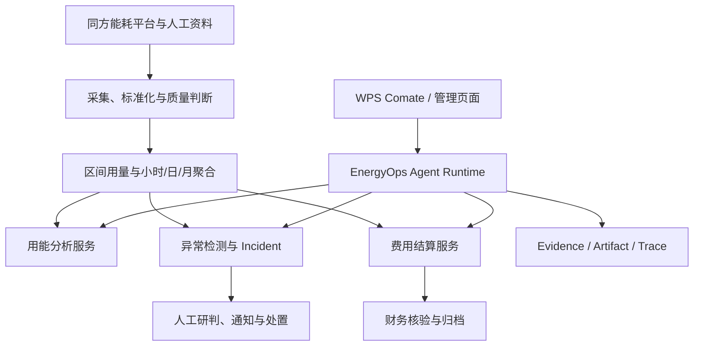

# EnergyOps Agent——园区能耗智能运营平台

## 0. 项目概述

EnergyOps Agent 是面向园区行政、财务和设备运营人员的内部能耗智能运营平台。平台接入同方能耗系统产生的智能水电表累计读数，围绕数据质量、区间用量、统计分析、异常发现、告警诊断和月度费用分摊，形成可查询、可处置、可结算、可追溯的完整运营链路。

项目最核心的产品思想是：

> **从存在质量问题的表计读数出发，形成可信的用能账、完整的异常事件账和可核验的财务结算账，再通过 Agent 将三条链路统一起来。**

这一思想可以概括为：

> **三账一体，可信运营。**

EnergyOps 不只是能耗看板，也不是在接口外增加一个聊天框。它同时包含可信数据底座、用能分析中心、异常运营中心、费用结算中心和受控 Agent 操作入口，使普通行政人员不需要理解数据库、接口和复杂后台，也能完成日常能源运营。

---

## 设计哲学与核心范式

EnergyOps 的架构不是从"给能耗平台加个聊天框"出发，而是从四个第一性原理推导出来的。

### 范式一：Hook 链治理——Prompt 定意图，Hook 定边界

Agent 天然存在三类固有问题：**输出受 Token 预算约束**（长结果可能被截断）、**不理解操作的真实代价**（对模型而言，查询和发布只是不同的工具名）、**倾向于最短路径完成任务**（额外的检查和验证意味着更多 Token 消耗）。

因此 EnergyOps 采用 **Before Tool / After Tool Hook 链** 实现分层治理：

| Hook 切面 | 触发时机 | 在 EnergyOps 中的作用 |
|---|---|---|
| Before Tool | 工具执行前 | 校验参数 Schema、设备是否存在、时间范围和数据完整度；危险操作（R2 级）检查人工确认状态；未授权 → 阻断 |
| After Tool | 工具执行后 | 登记 Evidence + Artifact；大结果外置（读数明细不进入模型上下文，只返回聚合摘要+artifact_id）；更新任务状态 |
| Before Model | 下一轮调用前 | 注入上一次工具调用的副作用（风险分析、数据缺口）、当前任务预算和未解决问题 |

R0/R1/R2 三级风险分级是 Hook 链的参数配置，不是独立的治理机制：

```text
R0（查询）→ After Tool 收集结果，但不需要 Before Tool 阻断
R1（草稿/备注）→ Before Tool 校验预览，失败阻断执行
R2（启停/归属/结算发布）→ Before Tool 校验二次确认+影响说明+幂等键+审计，任一失败阻断
```

核心原则直接引自已验证的行业实践：**能由代码确定性保证的事情，不交给模型自行决定。Prompt 适合表达意图，不适合充当安全边界。**

### 范式二：异常候选 ≠ 业务告警——发现、解释、通知三层分离

传统监控将"数据偏离"直接等同于"发送告警"，导致大量低价值通知。EnergyOps 借鉴"自适应基线 → 异常候选 → 业务通知"三层分离设计：

```text
第一层（自适应基线）：回答"当前是否不像平时"
  → 学习多日历史形态 → 动态边界 → 异常过程聚合（非单点判断）
  → 证据不足时标记为"不可判定"，不将信息缺失解释为正常

第二层（异常候选）：回答"为什么认为可疑"
  → 综合持续时长、累计超额、复发次数、历史样本可信度、影响范围
  → 候选生成不等于通知发送

第三层（业务通知）：回答"是否值得打扰业务人员"
  → 结合订阅规则、静默窗口、活动期上下文
  → 模型负责组织证据，人工确认关键判断
```

告警指纹和案例复用处于第二层与第三层之间——历史上被人工确认并关闭的案例可以进入案例库供召回参考，但相似表象仍可能对应不同根因。

### 范式三：三道质量门——AI 不能替代责任人的业务口径裁决

结算涉及真金白银。借鉴 Hermes Agent 的"事实源门 → 预演门 → 责任门"设计，EnergyOps 的月度水电费结算必须通过三道质量门才能生成正式分发版：

| 质量门 | 核心问题 | 失败处理 |
|---|---|---|
| **事实源门** | 抄表、单价、设备和主体是否完整且来自正确月份？ | 阻断结算，不进行无依据估算 |
| **预演门** | 分摊是否守恒？是否存在重复、缺失和异常差异？ | 生成试算结果供人工核查，但标记为"待确认" |
| **责任门** | 行政是否确认说明版？财务是否完成核验？ | 正式分发版仅在两道人工确认后生成 |

这三道门的本质是：**自动化程度不能只看技术能力，还要看风险距离。** 越接近生产写入，自动化越要转向可验证和可审计。

### 范式四：Offload/Onload——长内容不应经过模型传输

能耗查询可能返回数万条读数明细、规则回放可能命中数百条告警。如果这些数据直接进入模型上下文，会产生三个问题：

1. Token 物理容量限制导致截断或略写
2. 模型可能根据不完整数据生成看似合理但实际错误的结论
3. 上下文被大量原始数据挤占，关键业务判断被稀释

EnergyOps 的解决方式：

```text
读侧（Offload）：
  工具返回大结果 → After Tool Hook 检测长字段 → 写入 Artifact
  → 向模型返回引用句柄（口径摘要+关键样例+artifact_id）
  → 落盘失败时降级透传，不阻断（因为此时尚未产生生产副作用）

写侧（Onload）：
  模型传 filePath → Before Tool Hook 校验路径白名单 → 读取文件全文
  → 覆盖对应参数 → 提交下游
  → 路径不在白名单/文件不存在/为空 → 阻断（因为即将写入生产）
```

**失败语义与操作代价匹配**——读侧降级，写侧阻断。这是 Agent 工程中最重要的设计原则之一。

---

## 1. 业务背景

### 1.1 园区已经有读数，但没有自己的运营系统

金山武汉总部园区部署了约 604 台智能水电表。同方能耗平台持续产生设备累计读数，解决了“设备是否上报”的问题，但园区行政和财务仍然缺少自己的数据治理、统计分析、异常处置和费用结算系统。

按照 5 分钟一次的采集频率，平台每天需要处理约：

```text
604 台设备 × 288 个时间点 ≈ 17.4 万条读数
```

每月原始读数规模约 520 万条。设备、网络和人工配置的任何变化，都可能影响后续统计和结算。

### 1.2 累计读数不能直接等同于真实用量

智能表上报的是某一时刻的累计读数，业务真正需要的是两个有效读数之间的区间用量。实际数据会出现：

- 首次读数没有前值；
- 设备离线导致长时间缺失；
- 新读数小于旧读数；
- 设备更换或重置造成累计值归零；
- 单位、倍率或设备配置变化；
- 延迟补写和乱序上报；
- 短时间内出现不符合物理规律的跳变；
- 同一设备被错误归属到多个区域或部门。

如果系统直接执行“本次读数减上次读数”，就会把数据错误转化为虚假的用量、异常和费用。

### 1.3 传统能耗平台在业务链路上存在断层

行政和财务真正需要回答的是：

- 某栋楼、楼层、部门或设备在某个时间段实际使用了多少水电；
- 当前结果包含哪些异常区间，数据是否完整；
- 页面、报表、导出和月度账单是否使用同一口径；
- 哪些设备或区域存在异常，影响范围有多大；
- 告警是数据问题、设备问题还是真实用能变化；
- 异常由谁确认、跟进和关闭；
- 每月如何结合智能表、人工抄表、设备归属和分摊规则生成费用；
- 财务收到的结果能否追溯到读数、规则和计算过程。

这些问题横跨数据、设备、运营和财务，无法由单一看板或单条告警解决。

### 1.4 项目要解决的根本问题

EnergyOps 要解决的是：

> **如何把分散且不稳定的表计读数，转化为可信、可追溯、可处置、可结算的园区能源运营结果。**

原始读数只是物理事实。只有经过质量判断、用量计算、层级归属、异常研判和费用规则处理，才能成为行政可以使用的运营数据和财务可以核验的结算数据。

---

## 2. 产品定位

### 2.1 产品定义

EnergyOps 是一套面向园区行政和财务场景的内部能耗智能运营平台：

> **以可信能耗数据为底座，打通表计接入、用能统计、异常发现、告警处置和月度费用分摊，并通过 WPS Comate 中的 EnergyOps Agent 提供统一的业务操作入口。**

模型负责理解意图、选择能力、组织上下文和解释结果；确定性系统负责数据计算、权限、状态迁移、费用规则、幂等和审计。

### 2.2 目标用户

| 用户 | 核心需求 |
|---|---|
| 园区行政人员 | 查询用能、维护设备归属、配置规则、研判告警、导出数据 |
| 能源运营人员 | 发现异常设备和区域，分析趋势，跟踪处置结果 |
| 财务人员 | 接收月度费用分摊结果，核对计算过程和差异 |
| 系统管理员 | 管理设备、权限、规则、任务和 Agent 工具 |
| 维修或物业协作人员 | 接收线下维修通知并反馈处理结果，不直接操作核心数据 |

### 2.3 五层产品能力

| 产品层 | 核心职责 |
|---|---|
| 可信数据底座 | 接入累计读数，处理缺失、回退、乱序、长间隔、倍率变化和异常跳变 |
| 用能分析中心 | 按设备、楼栋、区域、部门和时间统计小时、日、月用量及覆盖率 |
| 异常运营中心 | 管理显式规则、自适应异常候选、告警、证据、通知和处置 |
| 费用结算中心 | 接收人工抄表、归属关系和分摊规则，生成说明版与财务分发版 |
| EnergyOps Agent | 理解业务意图，编排查询、分析和受控操作，返回结果、风险和审计信息 |

### 2.4 三本业务账

- **用能账**：每台设备、每个区域实际使用了多少水电，数据质量如何；
- **事件账**：发生了什么异常，引用了哪些证据，谁确认、如何处理、结果是什么；
- **结算账**：费用归属于谁，采用什么规则计算，能否与财务数据核对。

三本账通过稳定的设备、区域、时间窗口和业务主体关联。任何告警、结算结果和 Agent 回答都必须能够回溯到底层数据与规则。

### 2.5 产品差异化

1. **质量优先，而不是先做看板**

   不把异常数据静默清洗成正常结果，而是保留质量状态、计算依据和受影响范围。

2. **从监测延伸到运营和结算**

   同一套底层数据同时服务查询、告警、处置和月度账单，减少“看板一个数、导出一个数、财务另一个数”。

3. **规则监控与自适应发现并行**

   显式规则守住明确业务底线，自适应基线发现尚未配置规则但明显偏离历史形态的异常候选。

4. **Agent 是正式操作入口**

   Agent 调用受治理的业务能力，而不是直接访问数据库或自由修改业务状态。

5. **生成式能力与业务决策分离**

   AI 可以总结、组织证据和提出建议，但用量、告警状态、费用和高风险写入由确定性系统控制。

---

## 3. 核心领域模型与业务口径

### 3.1 领域对象

| 对象 | 说明 |
|---|---|
| Meter | 智能水表、电表或人工表计 |
| Reading | 某台设备在某个时间点的累计读数 |
| UsageInterval | 两个有效读数之间计算得到的区间用量 |
| UsageAggregate | 小时、日、月等粒度的用量聚合 |
| DataQualityIssue | 缺失、回退、跳变、倍率变化等质量问题 |
| AnomalyRule | 阈值、区间、同比、趋势等显式规则 |
| AnomalyCandidate | 基于规则或动态基线产生、尚待业务裁决的异常候选 |
| Incident | 需要调查、处置和跟踪的一次异常事件 |
| Evidence | 查询、趋势、设备状态和历史案例形成的结构化证据 |
| ActionRecord | 通知、确认、维修、忽略、关闭等处置记录 |
| SettlementBatch | 某个月份的一次结算任务 |
| AllocationRule | 直连计费、公共费用、人员或面积分摊规则 |
| SettlementLine | 面向部门、主体或费用中心的结算明细 |
| AgentTask | Agent 发起的一次查询、分析或受控操作任务 |

### 3.2 从读数到用量

```text
原始累计读数
→ 标准化时间、单位和设备身份
→ 排序、去重和质量判断
→ 计算区间用量
→ 小时聚合
→ 日聚合
→ 月度统计
```

区间用量只有在前后读数均满足质量要求时才能进入可信聚合。不可确认的区间保留原始事实和质量原因，不进行无依据估算。

### 3.3 七类数据质量状态

平台统一管理以下质量状态：

1. `FIRST_READING`：首次读数，没有可比较前值；
2. `VALID`：前后读数、间隔和配置均满足计算要求；
3. `MISSING_INTERVAL`：区间内存在缺失或采集不完整；
4. `LONG_GAP`：相邻有效读数间隔超过允许范围；
5. `ROLLBACK_OR_RESET`：累计读数回退、归零或设备重置；
6. `MULTIPLIER_OR_UNIT_CHANGED`：倍率、单位或计算配置变化；
7. `ABNORMAL_JUMP`：区间增量明显超出设备或历史合理范围。

质量状态既影响聚合，也进入查询、告警和结算的结果说明。

### 3.4 设备与组织归属

一台表计可以关联楼栋、楼层、区域、部门、费用主体和有效时间范围。归属关系采用版本化管理，防止设备调拨后历史统计被新归属覆盖。

聚合与结算均按照业务发生时间匹配当时有效的归属版本，而不是只读取设备当前状态。

### 3.5 异常与通知分离

平台区分三个概念：

```text
数据偏离 → 异常候选 → 正式告警/通知
```

- 数据偏离只表示当前观测超出规则或历史范围；
- 异常候选需要结合持续性、影响量、数据质量和业务上下文；
- 是否生成正式通知，还需要考虑订阅、静默、重复告警和运营优先级。

这避免把每个单点越界都转化为对行政人员的打扰。

---

## 4. 端到端用户流程

### 4.1 日常数据运营

同方平台持续产生累计读数，EnergyOps 自动拉取、标准化并计算区间用量。行政人员可以通过页面或 Agent 查询：

- 某栋楼昨天的水电使用情况；
- 两个区域最近一周的趋势差异；
- 今天没有正常上报的设备；
- 某个月的用水明细和数据覆盖率；
- 某个统计值包含哪些异常区间。

每次回答同时展示：

- 设备与区域范围；
- 时间范围和统计粒度；
- 可信用量；
- 数据覆盖率；
- 缺失和异常设备数；
- 数据更新时间和必要的质量提示。

### 4.2 显式异常规则配置

行政可以通过阈值、区间、同比或趋势描述明确风险。规则在启用前必须进行 dry-run：

```text
填写规则
→ 参数和设备范围校验
→ 基于历史数据试算
→ 返回命中次数、设备、样例和影响
→ 人工确认
→ 正式启用
```

规则变更保留版本、创建人、适用范围、试算结果和启停记录。

### 4.3 自适应异常候选发现

对于尚未配置显式规则的设备和区域，系统基于多日历史学习正常形态：

```text
固定时间粒度
→ 识别日内和周期形态
→ 建立指标画像
→ 时间前推回放选择基线
→ 生成动态边界
→ 合并异常过程
→ 输出候选及证据
```

候选生成不只判断是否越界，还综合：

- 历史样本量和日期类型；
- 数据是否存在延迟补写；
- 偏离幅度和绝对增量；
- 连续命中时间和复发次数；
- 累计超额用量；
- 影响设备、区域和费用范围；
- 多个指标是否在同一窗口同步变化。

证据不足时标记为“不可判定”，不将信息缺失解释为正常。

### 4.4 告警研判与处置

规则或候选升级为 Incident 后，系统生成事件 ID 和告警指纹，并补充：

- 设备、区域和组织归属；
- 最近读数和趋势；
- 数据质量状态；
- 同期和历史基线；
- 相关规则与配置变化；
- 相似历史告警及人工确认结果。

Agent 按“假设—证据—验证”循环调用只读工具：

```text
发现异常
→ 固定 Incident 范围
→ 提出数据、设备或真实用能假设
→ 查询趋势、质量、配置和历史事件
→ 交叉验证
→ 输出支持程度和缺失证据
→ 人工确认
→ 通知、维修、忽略或持续观察
→ 记录结果并关闭
```

结论分为：

- `SUPPORTED`：多项证据一致支持；
- `PARTIAL`：存在相关证据，但仍有替代解释；
- `UNKNOWN`：关键数据不足，无法可靠判断。

如果涉及物理维修，平台负责记录通知、负责人和反馈，不承担实际维修调度。

### 4.5 月度水电费结算

每月由行政上传人工抄表、分摊规则和财务模板。系统执行：

```text
导入月度资料
→ 校验月份、表计、主体和重复数据
→ 匹配设备归属版本
→ 计算直连计费和公共费用分摊
→ 检查缺失、冲突和未确认数据
→ 生成说明版
→ 执行差异对账
→ 生成财务分发版
→ 财务核验并归档
```

说明版用于展示读数、用量、单价、规则、分摊过程和差异；财务分发版按照财务模板输出最终结果。

任何缺失设备、重复主体、分摊不守恒或未确认异常都必须阻断正式分发版生成。

### 4.6 年度运营复盘

年度运营层累计每月水电用量、费用、同比、异常和处置结果，分别形成用电、用水和费用看板。

系统可以组织数据证据和可能关联信息，但正式原因和改进措施由行政确认后填写，避免将相关性自动写成因果结论。

---

## 5. 产品功能模块

### 5.1 表计与数据质量中心

- 表计档案、类型、倍率和单位；
- 楼栋、区域、部门和费用主体归属；
- 原始读数查询和异常标记；
- 缺失、回退、长间隔和跳变分析；
- 数据回补、重算和影响范围预览；
- 质量规则和可信状态白名单。

### 5.2 用能分析中心

- 园区、楼栋、区域和设备多级钻取；
- 小时、日、月用量和同比环比；
- 覆盖率、异常区间和未分配用量；
- 多对象趋势对比；
- 明细、汇总和财务口径导出；
- 数据来源、更新时间和质量说明。

### 5.3 异常运营中心

- 规则模板和自定义规则；
- dry-run、历史回放和影响预览；
- 自适应异常候选；
- 告警收敛、去重、静默和升级；
- Incident 诊断工作台；
- Evidence、处置记录和恢复监测；
- 历史案例和相似事件检索。

### 5.4 费用结算中心

- 月度抄表和模板导入；
- 设备与费用主体映射；
- 单价和分摊规则版本；
- 直连费用和公共费用分摊；
- 守恒、重复、缺失和边界检查；
- 说明版、差异报告和财务分发版；
- 月度批次归档和历史复算。

### 5.5 Agent 任务中心

- 自然语言查询和分析；
- 工具调用进度；
- 写操作预览与确认；
- 长任务暂停、恢复和失败重试；
- 结果、Artifact 和审计记录；
- 用户反馈和任务复盘。

---

## 6. 系统架构与核心机制

### 6.1 总体架构



### 6.2 数据分层

```text
Raw Reading
→ Standardized Reading
→ Usage Interval
→ Hourly Aggregate
→ Daily Aggregate
→ Monthly Aggregate
→ Settlement Snapshot
```

原始读数不可覆盖；重算产生新的处理版本。所有统计和账单保存数据版本、规则版本和生成时间。

### 6.3 Agent Capability Bundle

约 25 个业务工具按照用户意图组织为六类能力包：

| 能力包 | 典型能力 |
|---|---|
| 用能查询 | 统计、趋势、对比、覆盖率和导出 |
| 设备维护 | 查询设备、调整归属、检查数据质量 |
| 规则管理 | 创建草稿、dry-run、启停和历史回放 |
| 告警诊断 | 查询 Incident、趋势、证据、案例和处置状态 |
| 费用结算 | 导入、试算、对账、生成说明版和分发版 |
| 系统运营 | 健康检查、任务状态、失败恢复和审计查询 |

模型只能选择已注册能力，不能直接构造数据库连接或绕过后端权限。

### 6.4 Agent 运行状态与 Hook 链治理

EnergyOps Agent 的核心运行层不是一段固定的编排脚本，而是一套 **Before Tool / After Tool Hook 链**。Hook 在模型调用和工具执行的关键生命周期节点插入基础设施逻辑，解决 Agent 的三类固有问题：

| 问题 | 根因 | Hook 解法 |
|---|---|---|
| **上下文膨胀**：完整读数明细和规则命中明细挤爆 Token 窗口 | Token 物理容量限制 | After Tool 将大结果外置为 Artifact，上下文只保留口径摘要+关键样例+artifact_id |
| **越权操作**：模型可能尝试未经确认的高风险写入 | 模型不理解操作的真实代价 | Before Tool 校验 R0/R1/R2 风险等级，R2 操作检查人工确认状态，未授权直接阻断 |
| **过程失忆**：模型在多步操作后遗忘已查询的数据、已确认的口径和待处理的风险 | 模型倾向最短路径，不主动记录中间状态 | After Tool 更新任务状态和 evidence_refs，下一轮 Before Model 自动注入 |

每次任务保存的完整状态：
```text
task_goal
user_and_permission
capability_bundle       ← 当前任务允许使用的能力包
confirmed_scope         ← 已确认的设备/区域/时间范围
current_step            ← 当前执行步骤
tool_results            ← 已执行工具的结果（含 evidence_refs）
pending_confirmation    ← 等待人工确认的操作
remaining_budget        ← 剩余 Token/调用次数
error_and_retry         ← 失败和重试记录
final_outcome           ← 最终结果
```

任务状态外置到系统，不依赖模型记住全部过程。长耗时导出、规则回放和结算任务可以在页面关闭后继续执行，并在用户返回后恢复进度。借鉴 AG-UI 的流式交互模式，用户侧只展示"正在查询用能""正在回放规则"等业务进度，通过 SSE 推送任务状态，不暴露数据库字段、凭据和模型推理文本。

### 6.5 Artifact 与上下文控制——Offload/Onload 长文本治理

大规模读数、导出文件、规则命中明细和结算表不直接进入模型上下文。EnergyOps 区分两段处理：

**读侧 Offload（After Tool）**：
- 工具返回后检测是否存在长字段（如读数明细、导出 CSV）
- 将完整内容写入沙箱/对象存储
- 模型只接收引用句柄：口径摘要 + 关键样例 + 数据质量 + artifact_id + 校验信息
- 落盘失败时降级透传原文（尚未产生生产副作用，不阻断任务）

**写侧 Onload（Before Tool）**：
- 模型传 filePath → Hook 校验路径白名单 + 文件存在性 + 完整性
- 通过 → 读取文件全文 → 覆盖对应参数 → 提交下游
- 失败 → 阻断工具调用（因为即将写入生产）

这样可以减少上下文噪声，同时保留继续下钻和审计的能力。

### 6.6 告警指纹和案例复用

系统根据能源类型、设备或区域、异常类型、规则和趋势特征生成告警指纹，用于检索历史相似事件。

历史案例只有在人工确认并关闭后才能进入案例库。案例召回用于提供排查方向，不能替代当前数据查询；相似表象仍可能对应不同根因。

### 6.7 确定性反馈与语义反馈

平台优先使用确定性检查：

- 参数和枚举；
- 设备是否存在；
- 时间范围和数据完整性；
- 规则是否能够执行；
- 费用是否守恒；
- 写操作是否符合状态机；
- Artifact 是否真实生成。

只有原因解释、建议质量和文本表达等开放问题交给模型判断。

---

## 7. 可靠性、安全与失败处理

### 7.1 数据可靠性

- 原始读数不可修改，只能追加修正版本；
- 使用事件时间和接收时间处理乱序与延迟；
- 聚合任务支持幂等、断点续跑和指定窗口重算；
- 回补前先预览受影响设备、时间和下游结果；
- 页面、API、导出和账单复用同一统计服务；
- 旧聚合失效时明确标记，不静默展示过期结果。

### 7.2 规则可靠性

- 新规则默认处于草稿状态；
- 启用前必须完成参数校验和历史 dry-run；
- 规则变更保存版本和影响范围；
- 告警支持去重、静默和频率限制；
- 大量异常命中时优先聚合为区域或过程事件。

### 7.3 Agent 操作风险分级

| 级别 | 类型 | 处理方式 |
|---|---|---|
| R0 | 查询、趋势、覆盖率、任务状态 | 校验权限后直接执行 |
| R1 | 可撤销备注、草稿、临时配置 | 展示预览后确认执行 |
| R2 | 规则启停、归属变更、结算发布、批量操作 | 二次确认、影响说明、幂等和完整审计 |

模型输出的参数始终视为不可信输入，需要经过 Schema、业务 Validator 和权限检查。

### 7.4 结算三道质量门

1. **事实源门**：抄表、单价、设备和主体是否完整且来自正确月份；
2. **预演门**：分摊是否守恒，是否存在重复、缺失和异常差异；
3. **责任门**：行政是否确认说明版，财务是否完成核验。

任何一道门失败，正式分发版都不能生成。

### 7.5 失败语义

- `INVALID_INPUT`：参数非法，不进行模型重试；
- `PERMISSION_DENIED`：权限不足，直接拒绝；
- `DATA_INCOMPLETE`：数据不完整，返回范围和缺口；
- `TOOL_TIMEOUT`：单工具超时，保留已有证据并降级；
- `PARTIAL`：部分能力成功，明确未完成部分；
- `NEEDS_CONFIRMATION`：等待人工确认；
- `FAILED`：关键业务不变量无法满足；
- `COMPLETED`：结果和必要产物均通过验证。

### 7.6 安全与审计

- Agent 不持有同方平台和数据库真实凭据；
- 凭据由后端连接器管理，执行环境只获得受限业务能力；
- 设备、组织和结算数据按用户角色授权；
- 审计记录用户、工具、参数、结果、确认人、前后状态和失败原因；
- 日志不记录密码、Token 和不必要的人员信息。

---

## 8. 可观测、评测与运营反馈

### 8.1 全链路观测——区分用户视图与内部 Trace

借鉴阿里/蚂蚁 GenAI SemConv 的语义规范（”Entry Span → Step Span → Token 级推理可观测”），EnergyOps 将每次 Agent 请求的观测按照统一的语义层级记录：

```text
Session
  └── Agent Task（task_goal + capability_bundle）
        └── Step 1..N（每个步骤 = 一次模型调用 + 后续工具调用）
              ├── Before Tool Hook：参数校验、权限检查、风险等级
              ├── Tool Call：工具名、参数、耗时、返回状态
              ├── After Tool Hook：Evidence 登记、Artifact 外置、状态更新
              └── Token 级：输入/输出/推理 Token、缓存命中、重试
```

每次请求记录的完整字段：
- Session 和 Agent Task
- 意图和能力包
- 每个 Step 的模型、Prompt 和工具版本
- Tool 参数、耗时和返回状态
- Evidence 与 Artifact（artifact_id + hash）
- Token、缓存、重试和总延迟
- 人工确认、修改和最终业务结果

关键设计：**用户视图与内部 Trace 分离**。借鉴 NL2SQL 可靠图表的可观测原则——“可观测性不等于把实现细节全部暴露给用户”——前端只展示”正在查询用能””正在回放规则”等业务进度和简化后的工具活动描述。内部保留完整 Trace 用于审计、回放、复盘和评测，但不暴露数据库字段、凭据、完整 JSON 和模型推理文本。

### 8.2 评测分层——最终结果正确 ≠ 过程可靠

借鉴 Agent 评测体系中”规则评分负责正确性、LLM 评分负责语义质量、人工复核负责争议和校准”的三层分工，EnergyOps 的评测覆盖六层：

| 层次 | 重点 | 评分方式 |
|---|---|---|
| 数据层 | 读数质量、区间计算、聚合和回补是否正确 | 确定性规则评分 |
| Tool Contract | 工具选择、参数、权限和状态迁移是否正确 | 确定性规则评分 |
| 任务结果 | 查询、告警、导出和结算产物是否可用 | 确定性 + LLM Judge |
| 过程质量 | 是否遗漏关键证据、无效重试或绕过确认 | LLM Judge + 人工抽检 |
| 风险安全 | 是否越权、泄露数据或执行未确认写操作 | 确定性规则评分（P0 硬门禁） |
| 效率体验 | Token、调用次数、P50/P95 延迟和用户修改率 | 确定性指标统计 |

P0 硬门禁（不通过平均分豁免）：权限越界、高风险操作未经人工确认即执行、结算不守恒、Agent 输出包含敏感字段。

### 8.3 评测数据集

评测集覆盖：

- 正常读数和正常用能；
- 首次读数、缺失、回退、长间隔和异常跳变；
- 显式规则和动态异常候选；
- 单设备、区域级和多指标同步异常；
- 工具失败、空数据、超时和权限不足；
- 设备归属变化和历史统计；
- 月度结算缺失、重复、守恒和差异场景；
- Agent 查询、预览确认和高风险写入。

已稳定通过的场景进入回归集，用户纠正和线上失败形成新的 Bad Case。

### 8.4 运营反馈闭环

```text
数据与 Agent 运行
→ 发现失败或用户修正
→ 按数据、工具、规则、上下文、权限分类
→ 修复对应模块
→ 回归评测
→ 发布
→ 继续观测
```

人工确认的异常原因和有效处置动作可以进入案例库；未经确认的模型建议不自动沉淀为正式知识。

---

## 9. 产品规模与质量目标

### 9.1 规模基线

| 指标 | 设计基线 |
|---|---:|
| 智能水电设备 | 约 604 台 |
| 采集频率 | 5 分钟/次 |
| 原始读数 | 约 17.4 万条/日、520 万条/月 |
| 数据质量状态 | 7 类 |
| 显式异常规则 | 4 类 |
| Agent 工具 | 约 25 个 |
| 核心业务流程 | 查询、设备、规则、告警、导出、结算 6 类 |

### 9.2 性能与可用性目标

| 指标 | 目标 |
|---|---:|
| 常用小时/日/月统计 P95 | ≤ 3 秒 |
| 大范围导出任务创建响应 | ≤ 1 秒 |
| 告警生成到可研判状态 | ≤ 5 分钟 |
| 聚合任务成功率 | ≥ 99.5% |
| 可信聚合数据完整率 | ≥ 99.9% |
| 高风险操作确认覆盖率 | 100% |
| Agent 工具调用可追踪率 | 100% |
| 月度结算差异检查覆盖率 | 100% |
| 正式账单分摊守恒率 | 100% |

### 9.3 产品效果指标

- 行政查询和导出自助完成率；
- 无效告警率和重复告警率；
- Incident 平均确认时间和关闭时间；
- 相似历史案例复用率；
- 月度结算人工调整行数；
- 财务核验差异数量；
- Agent 查询一次完成率和人工修改率；
- 每类数据质量问题的趋势和恢复时间。

---

## 10. 系统边界

### 10.1 系统负责

- 对接同方能耗平台并保存园区自己的读数和统计数据；
- 管理智能表、人工表计及楼栋、区域、部门和费用归属；
- 处理读数质量问题并计算区间、小时、日和月度用量；
- 提供用能查询、趋势、对比、覆盖率和数据导出；
- 配置、预览和执行显式异常规则；
- 生成自适应异常候选并提供历史基线证据；
- 完成告警通知、研判、备注、解决和忽略闭环；
- 根据抄表数据、归属和分摊规则生成月度水电费；
- 通过 WPS Comate 提供自然语言操作入口；
- 对写操作进行参数校验、风险分级、确认、幂等和审计；
- 保存 Agent Trace、Evidence、Artifact 和评测数据。

### 10.2 系统不负责

- 不替代同方平台完成物理设备采集和底层协议接入；
- 不直接控制空调、照明、冷站等设施；
- 不负责实际设备维修和人员派工；
- 不替代财务系统完成记账、付款、开票或总账管理；
- 不开展正式碳核算、ESG 披露或 ISO 50001 认证；
- 不把异常候选自动等同于正式业务事故；
- 不允许模型直接修改原始读数、决定费用或绕过业务规则；
- 不让 AI 自动认定正式异常原因和改进措施；
- 不扩展为完整智慧园区的门禁、消防、资产和物业管理平台。

---

## 11. 产品价值

### 对行政人员

把分散的查询、导出、设备维护、规则和告警操作统一为可理解、可追踪的能源运营流程。

### 对财务人员

获得带计算说明、规则版本和差异检查的月度费用结果，减少人工表格反复核对。

### 对园区管理者

在统一口径下观察用量、费用、异常和处置结果，区分真实用能变化与数据质量问题。

### 对工程团队

建立从读数、质量、统计、异常、Agent 到结算的一体化领域模型，使业务规则、失败语义和质量验证可以持续演进。

---

## 12. 最终项目定义

### 正式版

> **EnergyOps Agent 是面向园区行政和财务场景的能耗智能运营平台，以约 604 台水电表的可信用能数据为底座，打通用能分析、异常候选、告警诊断和月度费用结算，并通过 WPS Comate 提供受权限、状态机、人工确认和审计约束的自然语言操作入口。**

### 精简版

> **把不稳定的表计读数转化为可信用能账、异常事件账和财务结算账。**

### 核心产品主张

> **数据可信是起点，异常闭环和财务可核验才是能源运营的终点。**
