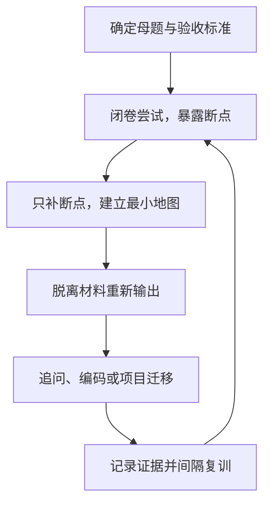

结论：对你目前最合适的，不是再找一种更聪明的笔记法，而是固定使用一套——

# 母题驱动的证据闭环学习法

至少连续执行 8 周，中途只调整内容优先级和训练量，不更换核心方法；如果有效，就一直沿用到秋招结束。

它的目标不是“看完、理解、记住”，而是：

> 面对一个问题，能够脱离材料独立讲清、回答追问、完成操作，并迁移到真实项目。

你以前更像“地图收藏者”：读文章、记术语、整理笔记。面试和开发需要的却是“领路能力”——地图合上之后，你还能不能找到路。

## 一、这套方法为什么最适合你

你当前的真正瓶颈不是资料不足，而是：

* Pi、Claude Code、算法、八股、项目同时推进，输入过多。
* 笔记主要按照文章来源堆积，知识之间缺少连接。
* 阅读时感觉理解，合上材料后无法重建。
* AI 容易直接讲答案、顺着你说，进一步制造熟悉感。
* 秋招要求的不只是记忆，还包括口述、追问、编码和项目迁移。

研究综述也认为，反复阅读和画重点的整体效用较低，而主动测试与间隔练习具有更广泛、稳定的效果；主动提取即使当下感觉更困难，长期保持通常优于继续重读。[Dunlosky 等人的学习技术综述](https://pubmed.ncbi.nlm.nih.gov/26173288/)、[Roediger 与 Karpicke 的提取练习研究](https://psychnet.wustl.edu/memory/wp-content/uploads/2018/04/Roediger-Karpicke-2006_PPS.pdf)

## 二、它怎样融合几种经典方法

| 来源      | 保留的核心            | 在你的系统中如何落地                       |
| ------- | ---------------- | -------------------------------- |
| 《心态制胜》  | 减少自我评判，让错误成为观察对象 | 不写“我怎么又忘了”，只记录“在哪一步断了、看到什么提示后恢复” |
| 《系统之美》  | 找到目标、反馈回路和高杠杆点   | 把“闭卷输出结果”作为反馈，而不是用阅读时长衡量学习       |
| 《精准努力》  | 有限精力投向高价值任务      | 只优先训练高频面试母题、项目关键问题和算法母题          |
| 费曼学习法   | 用简单语言重建因果        | 一句话解释、三分钟讲解、回答“为什么这样设计”          |
| 提取与间隔练习 | 通过回忆强化调用路径       | 先闭卷，再查漏；按 1、3、7、14、30 天复训        |

《系统之美》对你的重要启示是：继续增加资料和笔记，只是在增加系统“库存”；真正的杠杆点是改变目标和反馈回路。[Donella Meadows：系统杠杆点](https://donellameadows.org/archives/leverage-points-places-to-intervene-in-a-system/)

## 三、唯一的学习闭环

以后无论学 Pi、Claude Code、八股还是算法，都走同一条路径：



### 1. 确定母题

最小学习单位不再是“一篇文章”或“一章”，而是一个需要解决的问题。

例如：

* Pi：为什么要区分 Agent State、Session 和 Model Context？
* 算法：看到什么信号应该想到滑动窗口？
* 八股：Redis 分布式锁为什么不能只用 `SETNX`？
* PayTrace：工具调用超时后，为什么不能直接重试？

每次只推进一个母题。

### 2. 先闭卷尝试

给自己 3～5 分钟，在不看材料的情况下：

* 讲出目前知道的内容；
* 画出主线；
* 写代码或伪代码；
* 标记具体卡点。

不要写“这部分不会”，而要写：

> 能说出 Session 保存历史，但说不清它为什么不能被 Model Context 替代。

这就是《心态制胜》式的非评判观察：记录事实，不攻击自己。

### 3. 只补断点

回看对应段落、源码或题解，不重新阅读全部材料。

第一次接触新领域时，可以先让 AI 用“一个 Fabel 故事＋一张主线图”建立直觉，但这一阶段最多占学习时间的 30%。故事只负责入门，最终必须切回准确术语。

### 4. 费曼式重建

关闭材料后完成三层输出：

* 20 秒：一句话结论；
* 关键词：5～7 个恢复入口；
* 3 分钟：问题、机制、流程、取舍、案例。

固定回答骨架：

> 场景 → 核心问题 → 设计机制 → 运行过程 → 取舍 → 项目迁移

这样即使忘记具体类名，也能依靠因果关系恢复答案。

### 5. 证据验收

“感觉理解”不算完成，必须留下对应证据。

| 类型            | 通过标准                     |
| ------------- | ------------------------ |
| Agent、八股、系统设计 | 闭卷讲 3 分钟＋回答两层追问＋给出一个项目案例 |
| 算法            | 识别题型＋说出不变量＋独立编码通过＋解释边界条件 |
| 项目开发          | 代码、测试或日志可复现＋能解释两个设计取舍    |
| 技术文章          | 能转化为母题并通过以上验收；只摘录不算完成    |
| 博客            | 是已掌握知识的包装产物，不再作为独立学习任务   |

以后不要说“今天读完了 Pi 第二篇”，而要说：

> 今天通过了“Session 与 Context 区别”母题的面试验收。

### 6. 间隔复训

高频母题按照：

> 第 1、3、7、14、30 天闭卷复述

中等优先级只在第 3、14、30 天复习；低优先级不进入固定复训池，需要时再查。

每周再做一次“全量快速召回”：用空白纸画出本周知识树，防止你担心只复习重点会遗漏其他内容；随后只深练暴露出的红色断点。

## 四、你的每日结构：1＋1＋1

离职后全面准备秋招，也不要每天分别学习七八条线路。每天只保留：

* 一个项目交付：主要围绕 PayTrace 或实习项目复盘；
* 一个算法母题；
* 一个面试知识母题：Pi、Claude Code、八股、系统设计轮换；
* 额外 15～20 分钟处理到期复训。

技术博客阅读不单独占一条主线，只能作为当前母题的定向输入。个人博客也等母题通过验收后再整理，避免“边学边写长文”吞掉大量时间。

一次知识训练控制在 50 分钟：

* 5 分钟：闭卷尝试；
* 15 分钟：定向补缺；
* 15 分钟：重新讲解或画图；
* 10 分钟：追问、迁移或编码；
* 5 分钟：记录母题卡和下次复习时间。

## 五、一张母题卡只保留这些内容

```text
母题：
为什么它重要：

一句话结论：
恢复关键词：

主线 / 核心不变量：
完整回答骨架：

两个递进追问：
项目迁移案例：

本次断点：
通过证据：
下次复训：
```

不要再按每篇文章建立一套庞大的笔记。不同来源讲到同一个问题，都进入同一张母题卡，避免知识库不断重复膨胀。

## 六、AI 必须从“讲师”改成“严格教练”

以后学习时优先使用这个指令：

```text
进入严格教练模式，不要先给我答案。

围绕母题「___」：
1. 先让我闭卷回答；
2. 根据我的回答连续追问两层；
3. 按准确性、结构、因果、取舍、迁移能力评分；
4. 只讲我暴露出的知识断点；
5. 讲解后要求我重新回答；
6. 未通过前不要用鼓励性语言模糊评价。
```

AI 可以负责解释、出题、追问和纠错，但第一次答案必须由你自己生成。

## 七、锁定方法，不再频繁更换

从现在开始，锁定这套“母题—提取—证据—迁移—复训”内核。未来看到新的学习方法，只放进“方法停车场”，不要当天采用。

连续执行 8 周后再评估，平时只允许调整：

* 哪些母题优先；
* 每天训练多少个；
* 复习间隔是否过密；
* 哪类证据最接近面试。

只有在“认真执行率达到 80%，但连续两周闭卷通过率和模拟面试表现仍无改善”时，才修改一个环节。一次只改一个变量，不整体推翻。

你真正要长期坚持的可以浓缩成一句话：

> 以高价值母题组织知识，先闭卷暴露断点，只补不会的部分，再用面试、编码和项目证据完成验收，通过间隔复训获得稳定调用能力。

这套系统可以一直用。以后改变的是学习内容和训练强度，不再改变学习内核。
