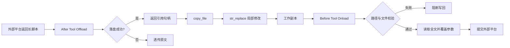
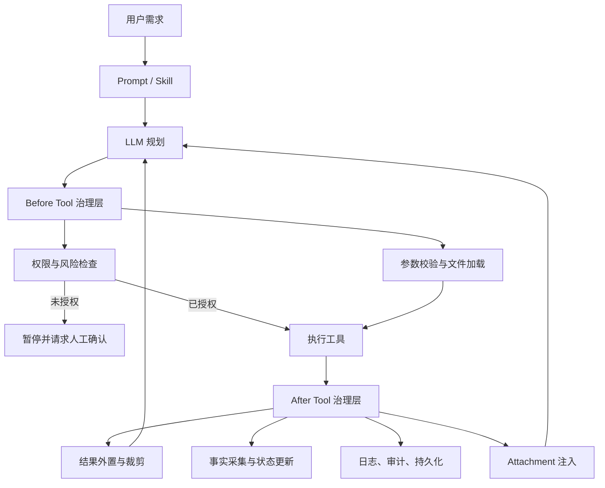

### **结论：这篇文章的核心不是“如何写更多 Prompt”，而是把 Agent 的不可靠行为，转化为框架层可拦截、可验证、可追踪的工程约束。**

其总体方法是：

> **Prompt 定意图，Skill 定流程，Hook 定边界；能由代码确定性保证的事情，不交给模型自行决定。**

文章围绕三类问题展开：

1. **偷懒**：长 SQL 或长脚本被截断、略写、残缺输出。
2. **越权**：模型未经确认直接发布、回刷或修改生产环境。
3. **失忆**：模型完成操作后，没有主动检查影响、发现产物或刷新上下文。

解决方案统一建立在：

> **Hook 链 + 文件 Offload + HITL 门禁 + State/Attachment 上下文闭环**

之上。

---

## 一、问题的第一性原理

### 1.1 Agent 的本质约束

Agent 并不是一个稳定执行程序，而是一个根据上下文生成下一步动作的概率系统。它至少存在三类天然缺陷：

#### 缺陷一：输出受 Token 预算约束

长 SQL、Python、DDL 等内容超过模型上下文或输出预算时，模型可能：

- 截断；
- 用“其余字段略”代替原文；
- 跳过中间步骤；
- 重写长文本时耗尽 Token；
- 生成语法完整但语义残缺的脚本。

这不是简单的提示词问题，而是**物理容量问题**。

#### 缺陷二：模型不理解操作的真实代价

对模型而言，查询、修改、发布、回刷都只是工具调用。它无法天然稳定地区分：

- 可逆操作与不可逆操作；
- 查询操作与生产写入；
- 讨论方案与正式提交；
- 普通变更与高风险变更。

因此，单纯在 Prompt 中要求“发布前确认”属于软约束。

#### 缺陷三：模型倾向于最短路径完成任务

额外的检查意味着额外的工具调用、Token 消耗和推理步骤。模型容易跳过：

- 下游影响分析；
- 产物文件发现；
- 元数据刷新；
- 结果汇报；
- 操作后的验证。

这是一种**最短路径偏好**。

---

## 二、核心抽象：把不可靠行为分层治理

文章实际上建立了四层职责边界。

| 层次 | 主要职责 | 不应承担的职责 |
|---|---|---|
| Prompt | 表达目标和意图 | 充当安全边界 |
| Skill | 规定任务流程与步骤 | 保证每个步骤一定执行 |
| Agent 模型 | 进行规划、推理、工具选择 | 独立决定高风险权限 |
| Framework Hook | 强制执行、拦截、补齐、记录 | 承担复杂业务推理 |

其中最关键的原则是：

> **模型负责“想做什么”，框架负责“什么能做、必须怎么做、做完还要补什么”。**

---

# 三、Hook 链：为什么它是治理的核心

## 3.1 Hook 的定义

Hook 是 Agent 框架在关键生命周期节点暴露出的回调切面。它不改变 Agent 的主要推理循环，而是在模型调用、工具调用前后插入基础设施逻辑。

主要切面包括：

| Hook | 触发时机 | 典型用途 |
|---|---|---|
| Before Model | 调用模型前 | 修改请求、注入上下文 |
| After Model | 模型返回后 | 处理响应、记录状态 |
| Before Tool | 工具执行前 | 修改参数、拦截危险调用 |
| After Tool | 工具执行后 | 处理结果、提取事实 |
| Before Agent | Agent 开始前 | 初始化状态 |
| After Agent | Agent 结束后 | 持久化、清理、汇总 |

## 3.2 为什么使用 Hook，而不是修改每个工具

如果把治理逻辑写进每个工具，会产生：

- 重复实现；
- 工具代码与框架能力耦合；
- 新增工具时容易遗漏；
- 安全策略难以统一升级；
- 业务代码被大量横切逻辑污染。

Hook 的优势是：

1. **统一拦截**：所有工具调用先经过相同治理链。
2. **与业务解耦**：工具不必知道 offload、确认框、审计逻辑。
3. **可组合**：一个切面可以挂多个 Hook。
4. **可扩展**：新增治理能力不必修改 Agent 主循环。
5. **可确定执行**：模型是否“记得”不影响 Hook 是否运行。

## 3.3 Hook 的基本执行模型

可以抽象为：

```text
模型决定调用工具
        ↓
Before Tool Hook 链
        ↓
允许、修改或拦截
        ↓
工具真正执行
        ↓
After Tool Hook 链
        ↓
处理结果、记录事实、注入后续上下文
```

这使工具调用从：

```text
模型 → 工具
```

变成：

```text
模型 → 治理层 → 工具 → 治理层 → 模型
```

---

# 四、长文本护栏：解决“偷懒”和截断

## 4.1 问题的真正来源

长脚本通常经历两个方向：

```text
外部平台 → Agent
Agent → 外部平台
```

分别对应：

- **拉取侧**：长内容进入模型上下文；
- **写回侧**：长内容作为工具参数回传。

两侧的问题不同。

### 拉取侧问题

- 长 SQL 原样进入上下文；
- 模型需要重复阅读、复制和重写；
- 工具返回可能超过上下文容量；
- 模型为了节省 Token 使用占位符或截断。

### 写回侧问题

- 模型把完整 SQL 拼接进 JSON 参数；
- 输出在中途耗尽 Token；
- 参数字符串本身已经残缺；
- 下游平台可能没有足够校验，直接接受错误脚本。

因此，单纯压缩 Prompt 或提醒“不要省略”并不能根治问题。

---

## 4.2 第一性原理：长内容不应经过模型传输

如果模型的任务只是局部修改，就不应该让模型：

1. 阅读全部脚本；
2. 重写全部脚本；
3. 把全部脚本重新输出；
4. 再将全部脚本作为参数提交。

正确的抽象是：

> **长内容由文件系统保存，模型只操作引用和局部变更。**

于是数据流变为：

```text
外部平台
   ↓
沙箱只读快照
   ↓
模型获得文件引用
   ↓
copy_file
   ↓
str_replace 局部修改
   ↓
沙箱工作副本
   ↓
框架加载全文
   ↓
外部平台写回
```

模型不再负责搬运长文本，只负责：

- 识别修改位置；
- 生成局部替换；
- 指定文件路径；
- 触发工具。

---

## 4.3 拉取侧 Offload：After Tool

### What：做什么

工具返回长内容后，After Tool Hook：

1. 检测返回结果中是否存在长字段，例如 `scriptContent`；
2. 将完整内容写入沙箱；
3. 用引用句柄替换原始内容；
4. 将句柄返回给模型。

模型看到的不是完整 SQL，而是：

```text
<offloaded to /sandbox/order_detail.remote.etl
read-only snapshot, length=37814 chars.
To start editing, run copy_file(...) first,
then str_replace.>
```

### Why：为什么这样设计

它解决四个问题：

- 避免长内容占满上下文；
- 防止模型复印式重写；
- 强制采用局部修改；
- 让原始快照保持只读，防止误改。

### How：如何实现

核心逻辑可以抽象为：

```text
if result contains long scriptContent:
    path = save_to_read_only_snapshot(content)
    return reference(path, length)
else:
    return original_result
```

### 失败策略

拉取侧落盘失败时，文章采用**降级而不是阻断**：

```text
落盘成功 → 返回引用句柄
落盘失败 → 透传原始内容
```

原因是：

- 读取失败不会立即修改生产；
- 透传至少让模型仍可继续工作；
- 可以允许重试；
- 不应因为中转设施故障阻断所有任务。

但这会承担模型截断风险，因此属于有意识的风险取舍。

---

## 4.4 编辑侧：只读快照与工作副本分离

不能让模型直接编辑远程快照，而应分成两类文件：

| 文件类型 | 作用 | 权限 |
|---|---|---|
| Remote Snapshot | 保存平台原始内容 | 只读 |
| Working Copy | 模型实际修改 | 可编辑 |

模型必须先执行：

```text
copy_file(remote_snapshot, working_copy)
```

再执行：

```text
str_replace(working_copy, old_text, new_text)
```

这样做的原因是：

- 保留原始版本；
- 防止未授权修改原始快照；
- 支持失败回滚；
- 形成明确的编辑起点；
- 强迫模型采用增量编辑而不是全文重写。

---

## 4.5 写回侧 Onload：Before Tool

### What：做什么

写回工具执行前，Before Tool Hook：

1. 检查是否传入 `scriptFilePath`；
2. 校验路径是否在允许的沙箱目录；
3. 校验文件是否存在；
4. 校验身份和权限；
5. 读取文件全文；
6. 用全文覆盖 `scriptContent`；
7. 删除仅供框架使用的 `scriptFilePath`；
8. 再把标准参数转发给下游工具。

### Why：为什么必须在写回前处理

模型输出的长字符串不可靠，而框架读取本地文件是确定性的。这样：

```text
模型只传路径
框架读取全文
下游收到完整 scriptContent
```

避免了：

- 长字符串被模型截断；
- JSON 参数不完整；
- 下游接收路径但不会处理；
- 工具协议被业务逻辑污染。

### How：数据流

```text
模型：
{
  "scriptFilePath": "/sandbox/order_detail.work.etl"
}

Before Tool Hook：
{
  "scriptContent": "完整脚本全文"
}

下游工具：
只接收标准 scriptContent
```

`scriptFilePath` 是框架协议，不是下游业务协议。它在 Hook 层被消费并剥离。

---

## 4.6 为什么读侧降级、写侧阻断

这是文章中一个重要的设计原则：

> **失败语义必须与操作代价匹配。**

| 阶段 | 失败后果 | 策略 |
|---|---|---|
| 读侧 Offload 失败 | 模型可能看到长文本，但还未写生产 | 降级透传 |
| 写侧 Onload 失败 | 可能向生产提交残缺内容 | 阻断工具调用 |

写侧遇到以下情况应直接抛异常：

- 路径不在白名单；
- 文件不存在；
- 文件为空；
- 身份缺失；
- 文件读取失败；
- 文件格式或版本不符合要求。

这体现了风险工程中的基本原则：

> **低代价失败可以降级，高代价失败必须拒绝继续。**

---

## 4.7 长文本护栏的完整闭环



---

# 五、HITL 门禁：解决“越权操作”

## 5.1 问题定义

发布、回刷、终止、冻结、数据源变更等操作有共同特征：

- 会改变生产状态；
- 可能影响大量下游任务；
- 可能不可逆；
- 错误成本高；
- 需要业务授权。

这些动作不能只依赖模型自行判断。

---

## 5.2 第一性原理：权限必须绑定真实用户行为

一个高风险动作要成立，至少需要两个条件：

```text
模型提出调用
+
用户明确授权
```

因此工具执行条件应是：

```text
CanExecute = AgentIntent AND UserApproval
```

只有模型意图，没有用户确认，工具不能执行。

---

## 5.3 HITL 的位置：Before Tool

HITL 本质上是一个 Before Tool Hook：

```text
模型请求危险工具
        ↓
DangerousToolGuard
        ↓
检查是否存在授权状态
        ↓
无授权 → 阻断并发起确认
有授权 → 放行工具
```

它必须放在工具真正执行之前，因为：

- 工具内部再确认可能已经执行了一部分逻辑；
- Prompt 层无法阻止模型继续调用；
- Before Tool 是最后一个确定可控的拦截点。

---

## 5.4 配置驱动，而不是工具硬编码

文章采用配置驱动的危险工具清单：

```yaml
dangerous-tools:
  - name: packCommit
    required-state: confirm_pack
    confirmation:
      title: 请确认发布方式
      options:
        - id: direct
          label: 直接发布
        - id: approval
          label: 提交审批
          hasInput: true
        - id: draft
          label: 保存草稿
        - id: edit_more
          label: 继续修改
```

配置包含：

- 危险工具名称；
- 所需授权状态；
- 确认框标题；
- 可选动作；
- 是否需要用户输入；
- 输入类型和占位说明。

### 为什么采用配置驱动

因为不同环境可能具有不同的：

- 危险工具；
- 授权规则；
- 发布方式；
- 审批参数；
- 租户策略。

硬编码会导致：

- 修改策略必须改工具代码；
- 工具与业务授权强耦合；
- 难以按环境配置；
- 安全规则不可审计。

---

## 5.5 确认流程

完整流程如下：

```text
1. Agent 请求危险工具
2. Before Tool Guard 拦截
3. 框架推送确认事件
4. 前端展示确认框
5. 用户选择发布方式或填写参数
6. 结果写入 session.state
7. Agent 发起续跑
8. Agent 再次请求原工具
9. Guard 检查授权状态
10. 授权有效，工具放行
```

授权状态可以是：

```text
confirm_pack = direct
confirm_deploy = approval
confirm_upsert_datasource = approved
```

关键是：用户确认不是模型生成的文本，而是前端真实交互产生的状态。

---

## 5.6 为什么不能只做 Yes/No

生产操作往往不是二元选择。例如发布前可能需要选择：

- 直接发布；
- 提交审批；
- 保存草稿；
- 继续修改；
- 指定审批人；
- 指定回刷日期；
- 选择目标环境。

所以实际确认机制应支持：

```text
确认结果 = 操作类型 + 结构化参数
```

而不是：

```text
确认结果 = true / false
```

---

## 5.7 HITL 的边界

HITL 解决的是：

- 是否允许执行；
- 谁授权；
- 采用哪种执行方式；
- 授权附带哪些参数。

HITL 不负责：

- 分析 SQL 是否正确；
- 识别所有业务风险；
- 替模型完成方案设计；
- 自动修复脚本；
- 替代审批流程本身。

因此，HITL 是**权限门禁**，不是完整的质量保障机制。

---

# 六、上下文联动闭环：解决“失忆”和“不作为”

## 6.1 问题的本质

模型完成一个动作后，通常只知道：

```text
工具调用成功
```

但它不一定知道：

- 这个动作影响了哪些对象；
- 是否产生了新文件；
- 是否需要刷新元数据；
- 是否需要向用户展示产物；
- 是否存在下游风险。

这里存在两种情况：

### 情况一：模型知道需要查，但不愿意查

例如：

- 改表后检查下游影响；
- 执行后重新查看状态；
- 变更后刷新字段信息。

### 情况二：模型根本不知道有东西需要查

例如 Python 脚本生成了图片，但工具标准输出没有告诉模型文件名。

这不是单纯的“记忆力问题”，而是：

> **框架掌握了事实，模型却没有自动得到事实。**

---

## 6.2 第一性原理：工具副作用必须由框架采集

模型不应负责发现所有副作用。因为副作用是工具执行的事实，可以由框架确定性地观察。

基本模式为：

```text
工具执行
   ↓
After Tool Hook 采集事实
   ↓
写入 session.state
   ↓
下一轮通过 Attachment 注入模型上下文
```

这可以抽象为：

> **Hook 管发生了什么，Attachment 管下一轮告诉模型什么。**

---

## 6.3 为什么不直接追加一轮模型调用

有三种方案：

| 方案 | 可靠性 | 问题 |
|---|---|---|
| Prompt 提醒模型主动检查 | 低 | 模型可能跳过 |
| 额外调用一轮模型分析 | 中 | 增加 Token 和调度成本 |
| Hook 采集并自动注入 | 高 | 事实采集不依赖模型 |

Hook 方案的关键优势是：

- 工具成功后必然触发；
- 不需要模型判断是否检查；
- 不需要额外发起专门检查任务；
- 结果可积累、可复用；
- 下一轮自然进入模型上下文。

---

## 6.4 RiskAnalysisHook：自动分析表变更风险

### 触发条件

不是看到工具名就触发，而是判断工具语义。

例如：

```text
工具名 = upsertTable
并且入参包含 tableId
→ 表示修改已有表
```

如果没有 `tableId`，可能是新建表，不触发下游变更分析。

### 处理流程

```text
upsertTable 执行成功
        ↓
RiskAnalysisHook 判断是否为修改已有表
        ↓
查询下游依赖
        ↓
计算影响等级
        ↓
写入 session.state
        ↓
下一轮 Attachment 注入模型
```

注入结果可以表现为：

```text
风险提示：
刚刚修改了 dws_order_detail。
发现下游影响：
- dws_channel_report：HIGH
- ads_daily_summary：MEDIUM
建议检查相关 ETL。
```

### 设计要点

- 使用入参语义而不是工具名；
- 只对真正的变更触发；
- 多次变更结果累积；
- 下一轮统一汇总；
- 风险分析属于事后影响评估，不等同于事前发布拦截。

---

## 6.5 PythonImageHook：自动发现生成图片

### 问题

Python 执行工具可能只返回：

```text
执行成功
```

但实际生成了：

```text
chart.png
trend.svg
distribution.jpg
```

模型不知道这些文件存在，也就无法向用户展示。

### 解决流程

```text
Before Tool：
记录执行前文件快照

Python 工具执行

After Tool：
记录执行后文件快照
        ↓
计算新增文件
        ↓
筛选图片格式
        ↓
生成预签名 URL
        ↓
写入 Attachment
        ↓
前端直接渲染图片
```

### 为什么要做前后快照

相比让模型执行：

```text
ls
find
bash 查询文件
```

文件快照具有：

- 确定性；
- 更低 Token 消耗；
- 更少工具调用；
- 不依赖模型记忆；
- 能准确识别本次执行产生的文件。

### 为什么只关注图片

如果将所有新增文件都注入上下文，会导致：

- 状态膨胀；
- 注入无关文件；
- 增加模型负担；
- 前端展示混乱。

所以应根据用户价值筛选产物类型，例如只关注：

```text
.png
.jpg
.jpeg
.svg
.webp
```

---

## 6.6 Attachment 的作用

Attachment 不是普通对话文本，而是一种结构化上下文补充机制。它可以承载：

- 风险分析；
- 图片预览；
- 文件链接；
- 阶段产物；
- 业务状态；
- 工具副作用。

其本质是把：

```text
state 中的事实
```

转换成：

```text
下一轮模型和前端都能理解的上下文
```

---

# 七、三类问题的统一治理模型

| 问题 | 根因 | 最佳拦截点 | 解决机制 |
|---|---|---|---|
| 长文本偷懒 | Token 与输出容量有限 | 工具前后 | Offload、Onload、文件引用 |
| 危险操作越权 | 模型不理解权限和不可逆性 | Before Tool | HITL Guard |
| 上下文失忆 | 模型不会主动检查或不知道副作用 | After Tool → 下一轮 | State + Attachment |

可以进一步抽象为：

```text
输入过长 → 外置
动作危险 → 拦截
事实遗漏 → 采集并注入
```

这三种机制分别对应：

- **容量治理**
- **权限治理**
- **信息治理**

---

# 八、失败处理：不是所有错误都采用同一种策略

文章的重要设计思想是：错误处理不能统一采用“继续”或“失败”，而应根据后果分类。

## 8.1 降级

适用于：

- 失败后尚未产生生产副作用；
- 可以安全重试；
- 主流程仍有一定可用性；
- 用户可以承受结果不完美。

例如：

```text
读侧 Offload 失败 → 透传原内容
```

## 8.2 阻断

适用于：

- 即将产生生产写入；
- 内容可能不完整；
- 权限不明确；
- 文件来源不可信；
- 操作不可逆。

例如：

```text
写侧 Onload 失败 → 阻断写回
HITL 未授权 → 阻断危险工具
```

## 8.3 注入

适用于：

- 操作已经完成；
- 框架能确定采集事实；
- 模型需要知道后续影响；
- 不应依赖模型主动查询。

例如：

```text
改表完成 → 注入风险分析
Python 完成 → 注入图片产物
```

---

# 九、为什么“只加强 Prompt”不够

## 9.1 Prompt 对物理限制无能为力

如果长 SQL 超过输出预算，即使 Prompt 写：

```text
禁止截断，必须完整输出
```

模型仍可能无法在有限 Token 内输出完整内容。

真正的解决方法是改变数据路径，而不是继续增加提醒。

---

## 9.2 Prompt 不能提供真实权限

模型可以生成：

```text
我已经获得用户确认
```

但这不等于用户真的点击了确认按钮。

真实授权必须来自：

- 前端交互；
- 会话状态；
- 权限系统；
- 可审计事件。

---

## 9.3 Prompt 不能创造模型不知道的信息

如果 Python 工具没有返回生成文件列表，模型就无法凭空知道 `chart.png` 存在。

必须由框架：

1. 观察文件系统；
2. 发现新增文件；
3. 生成结构化事实；
4. 注入上下文。

---

## 9.4 Prompt 适合表达意图，不适合承担边界

Prompt 的适用范围：

- 告诉模型任务目标；
- 规定业务流程；
- 解释工具用途；
- 指导输出风格；
- 提供判断标准。

Prompt 不适合承担：

- 权限控制；
- 文件完整性保障；
- 生产写入保护；
- 事实采集；
- 必须执行的校验；
- 不可绕过的审批。

---

# 十、行业方案与自研边界

文章对 ADK、LangGraph、Claude Code 等方案的比较，主要是在说明：

> 现成框架通常解决通用能力，但业务场景的完整闭环仍可能需要自研。

## 10.1 长文本 Offload

现有框架通常较擅长：

- 工具结果过大时自动落盘；
- 压缩历史；
- 用引用替代长返回。

但通常不足以覆盖：

- 写侧自动 Onload；
- 文件路径与业务参数的交换协议；
- 只读快照与工作副本；
- 表字段级 Offload；
- 根据风险决定降级或阻断；
- 业务平台的特殊注释块处理。

因此，DECO 自研的重点不在“首次实现 Offload”，而在于：

```text
读侧 Offload
+
编辑工作副本
+
写侧 Onload
+
生产写入校验
+
业务协议适配
```

## 10.2 HITL

现成框架一般可以提供：

- Yes/No 确认；
- 工具暂停与恢复；
- approve / reject；
- 配置化拦截。

但复杂业务可能还需要：

- 多选项；
- 结构化表单；
- 审批人输入；
- 回刷日期输入；
- 发布前变更预览；
- SSE 事件；
- 自定义前端交互；
- 与业务状态和发布流程联动。

因此，自研的必要性不在于“框架没有 HITL”，而在于：

> **通用 HITL 无法直接覆盖业务化确认流程。**

---

# 十一、Hook 全景：横切能力如何组合

文章列举的 Hook 并不只用于三类核心问题，还覆盖了完整 Agent 基础设施。

| 类别 | 典型 Hook | 作用 |
|---|---|---|
| 长文本治理 | TaskScriptOffload / Onload | ETL 脚本读写治理 |
| 表结构治理 | TableColumnsOffload / DdlColumnsOnload | 宽表字段治理 |
| 危险操作 | DangerousToolGuard | 权限确认 |
| 返回处理 | ToolResponseTruncator | 大结果裁剪与重排 |
| 格式处理 | ToolResponseFormatter | 统一结果结构 |
| 可观测 | ToolCallLogHook | 记录入参、出参、耗时 |
| 持久化 | ConversationPersistenceHook | 保存会话与工具记录 |
| 前端刷新 | CopyFileHook、SqlExecuteHook | 推送文件树变化 |
| 业务事件 | ReleaseItemCollectorHook | 推送任务计划事件 |
| 文档产物 | DocumentSaveHook | 保存阶段产物 |
| 上下文联动 | RiskAnalysisHook | 注入风险分析 |
| 产物发现 | PythonImageHook | 注入图片预览 |
| 环境恢复 | EnvVarCaptureHook | 保存并恢复环境变量 |

这些 Hook 共同体现一个架构原则：

> **业务循环保持稳定，变化的基础设施能力挂在生命周期切面上。**

---

# 十二、从第一性原理提炼出的设计方法

## 方法一：先区分“模型判断”和“系统事实”

应由模型负责：

- 解释需求；
- 选择策略；
- 规划步骤；
- 生成局部变更。

应由系统负责：

- 判断文件是否存在；
- 判断路径是否合法；
- 判断用户是否确认；
- 记录工具是否执行；
- 发现文件副作用；
- 读取完整脚本；
- 记录审计日志。

判断标准是：

> **如果某件事可以由系统直接观察或验证，就不要让模型猜。**

---

## 方法二：根据风险位置选择 Hook

| 风险类型 | 适合位置 |
|---|---|
| 工具参数不可信 | Before Tool |
| 工具返回过大 | After Tool |
| 操作需要授权 | Before Tool |
| 工具产生副作用 | After Tool |
| 下一轮需要知道结果 | Attachment / Before Model |
| 会话需要保存 | Before / After Agent |

---

## 方法三：根据错误代价设计失败语义

不要简单地规定“所有错误都重试”或“所有错误都阻断”，而应先问：

1. 错误发生时是否已经改动生产？
2. 是否可以回滚？
3. 是否会导致错误数据落库？
4. 用户能否接受降级结果？
5. 是否需要留下审计记录？

然后选择：

```text
透传、重试、降级、阻断、暂停、人工确认
```

---

## 方法四：对长内容采用“引用优先”

只要内容具有以下特征，就应优先外置：

- 长；
- 需要完整保存；
- 只需局部修改；
- 不适合重复传输；
- 需要回写外部系统；
- 需要版本管理。

推荐模式：

```text
原始文件 → 只读快照
修改文件 → 工作副本
模型操作 → 局部编辑
写回动作 → 框架加载全文
```

---

## 方法五：对危险动作采用“默认拒绝”

危险工具的默认状态应是：

```text
无授权 = 不执行
```

而不是：

```text
模型没有说错 = 可以执行
```

授权应具备：

- 明确来源；
- 结构化内容；
- 会话绑定；
- 一次性或范围受限；
- 可审计；
- 不能由模型自行伪造。

---

## 方法六：对副作用采用“自动采集、主动注入”

不要要求模型：

```text
做完之后记得检查……
```

而应设计为：

```text
工具完成
→ Hook 自动检查
→ state 保存事实
→ Attachment 自动注入
```

这样可以把“模型自觉”转换成“框架行为”。

---

# 十三、边界条件与可能问题

## 13.1 Offload 不是上下文压缩的万能方案

如果模型需要理解整个 SQL 的语义，单纯给路径可能不够。此时需要补充：

- 结构摘要；
- 相关片段；
- 函数和表依赖；
- 定位工具；
- 按行读取；
- 语义搜索；
- 差异预览。

因此，合理模式不是“模型永远不看全文”，而是：

> **默认不加载全文，只有在确实需要时按需读取局部内容。**

---

## 13.2 `str_replace` 需要唯一性和校验

局部替换也有风险：

- 目标文本不唯一；
- 替换位置错误；
- 新旧文本语义不一致；
- 文件版本已变化；
- 替换次数不符合预期。

因此应增加：

```text
匹配次数校验
版本校验
语法校验
差异预览
变更范围检查
```

---

## 13.3 HITL 不能替代自动验证

用户确认“我要发布”，不等于内容正确。发布前仍应进行：

- 语法检查；
- 依赖检查；
- 影响分析；
- 权限检查；
- 变更预览；
- 环境校验；
- 幂等性校验。

HITL 只解决：

```text
用户是否允许执行
```

不解决：

```text
执行内容是否正确
```

---

## 13.4 State 需要控制生命周期

如果风险、文件和事件无限累积，可能导致：

- 状态膨胀；
- 上下文污染；
- 重复注入；
- 旧信息影响新决策；
- 隐私和权限问题。

因此需要：

- 作用域；
- 过期时间；
- 去重；
- 版本；
- 清理策略；
- 权限控制；
- 只注入当前任务相关事实。

---

## 13.5 Hook 顺序必须明确

多个 Hook 同时作用于一个结果时，顺序会影响行为。例如：

```text
先格式化，再截断
```

和：

```text
先截断，再格式化
```

结果可能不同。

应明确：

- Hook 执行顺序；
- 是否可修改前一个 Hook 的结果；
- 异常是否短路；
- 失败是否继续；
- Hook 是否幂等；
- 是否允许并行。

---

# 十四、可复用的 Agent 治理架构

可以将文章总结为一套通用架构：



其中：

- `Before Tool` 负责**防止错误动作发生**；
- `After Tool` 负责**处理已发生的结果**；
- `State` 负责**保存事实**；
- `Attachment` 负责**把事实重新送回模型和前端**；
- 文件系统负责**承载长内容**；
- HITL 负责**绑定真实用户授权**。

---

# 十五、最终归纳

这篇文章提出的不是若干零散技巧，而是一种 Agent 工程化思想：

## What：它解决什么

解决 Agent 的三类不可靠性：

- 长文本处理不完整；
- 高风险操作越权；
- 工具副作用和上下文信息断裂。

## Why：为什么需要框架治理

因为这些问题分别来自：

- Token 和上下文的物理限制；
- 模型对权限和操作代价缺乏可靠理解；
- 模型追求最短路径且无法天然知道所有副作用。

Prompt 无法提供确定性保障。

## How：如何解决

通过四类机制：

1. **Offload**：长内容离开模型上下文，进入文件系统。
2. **Onload**：写回前由框架从文件加载完整内容。
3. **HITL**：危险工具执行前必须获得真实用户确认。
4. **Hook → State → Attachment**：框架自动采集事实，并注入下一轮上下文。

## Boundary：边界在哪里

- 模型负责意图、规划和局部推理；
- Skill 负责流程和方法；
- Hook 负责确定性约束；
- 文件系统负责长产物；
- 用户负责高风险授权；
- 自动校验负责质量保障；
- 日志和 State 负责审计与上下文连续性。

## 最值得复用的原则

> **不要要求模型记住系统应该知道的事实，不要要求模型输出系统可以直接读取的长内容，不要要求模型自行决定它是否拥有生产权限。**

进一步压缩为一句工程规则：

> **能外置的内容外置，能拦截的动作拦截，能观测的事实自动采集，能确定的约束交给代码。**