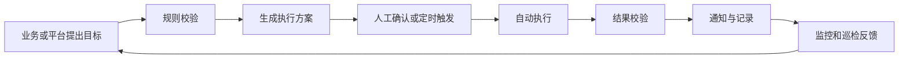
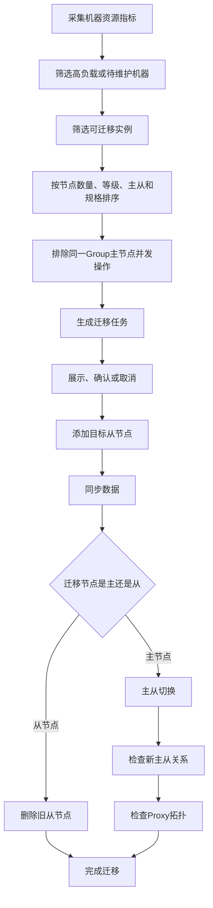
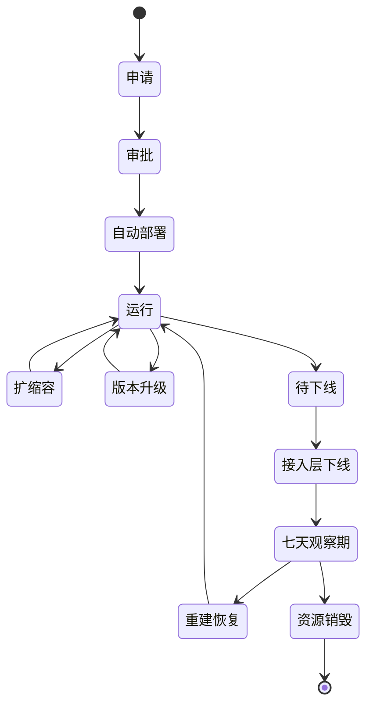
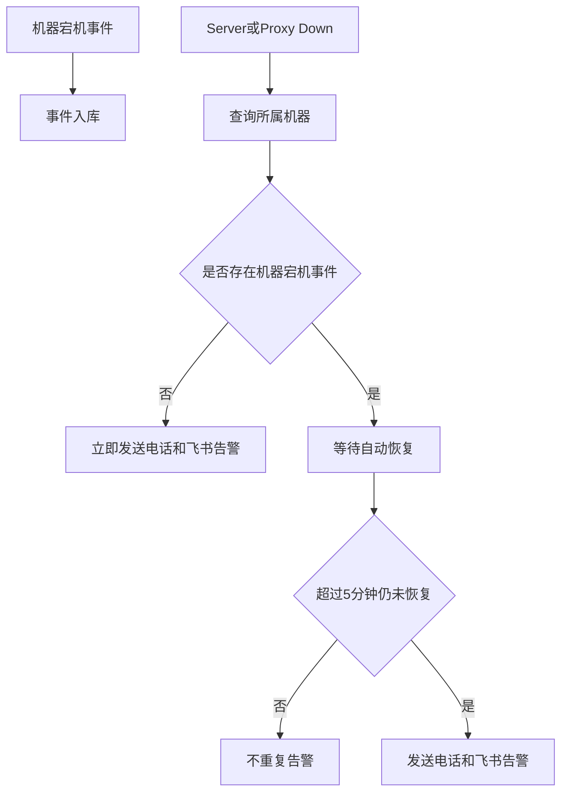
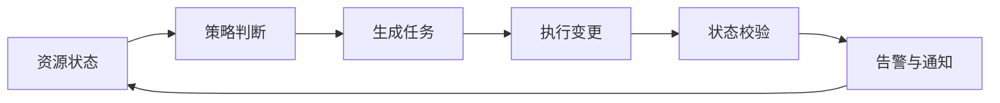
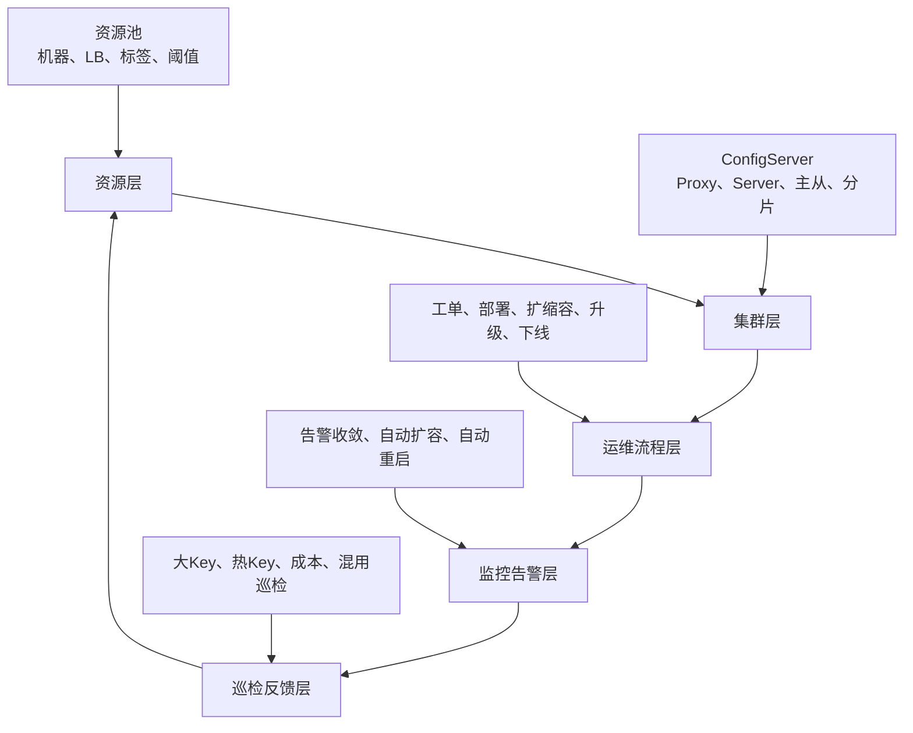

### **结论：这篇文章的核心不是“给 Redis 增加若干自动化功能”，而是把 Redis 运维从人工响应式操作，重构为以资源、生命周期、工单、告警和巡检为闭环的自动化控制系统。**

其底层目标可以概括为：

> **以标准化流程约束操作，以平台化能力执行操作，以监控和反馈验证结果，以自动化策略持续降低资源浪费、故障风险和人工成本。**

---

### **一、问题定义：为什么需要自动化运维**

#### **1. 业务规模带来的基本矛盾**

该平台的 Redis 规模达到百 TB 级存储、数十万数据节点，并采用：

- ECS 部署；
- 单机多实例；
- 主从混合部署；
- Proxy 与数据节点混合部署；
- 一主一从、双可用区架构。

规模扩大后，系统面临三类根本矛盾：

| 矛盾 | 表现 | 传统人工方式的问题 |
|---|---|---|
| 资源规模增长与利用率不足 | 部分机器 CPU、内存或分配率过高，部分资源闲置 | 依赖人工判断，调度不及时 |
| 服务数量增长与运维能力有限 | 节点、Proxy、集群和工单数量大量增加 | 人工操作容易遗漏、误操作 |
| 业务连续性要求与故障处理速度之间的矛盾 | 宕机、容量增长、版本升级等事件需要快速响应 | 夜间或大规模场景下人工恢复慢 |

因此，自动化并非单纯为了“减少操作步骤”，而是为了让运维能力能够匹配系统规模。

#### **2. 运维问题的本质**

文章中的问题可以抽象为四个控制问题：

1. **资源如何合理分配？**
2. **集群如何安全地创建、变更和销毁？**
3. **异常如何被识别、分类并自动处置？**
4. **运维结果如何被验证、追踪和反馈？**

这四个问题分别对应：

- 资源池自动调度；
- 生命周期自动管理；
- 告警自动化处理；
- 工单、巡检和结果通知。

![[Pasted image 20260808165412.png]]

---

### **二、系统基础：Redis 平台的组成和职责**

#### **1. ConfigServer：控制面**

ConfigServer 负责集群的配置和拓扑管理，包括：

- Proxy 的添加与删除；
- Redis Group 的创建与删除；
- Redis Server 实例的添加与删除；
- 主从切换；
- 水平扩容；
- 数据迁移；
- 故障检测和自动故障转移。

它本质上是 Redis 平台的**控制中心**，负责决定“系统应该是什么状态”。

采用跨可用区多节点部署，并通过 Raft 保证高可用，原因是：

- 控制面本身不能成为单点故障；
- 拓扑变更必须保持一致；
- 主从切换、扩缩容等操作不能出现多个控制节点各自做出不同决策。

#### **2. Redis-Proxy：访问抽象层**

Proxy 接收客户端请求，并将命令转发到后端 Redis Server。

它解决了两个问题：

- 对业务屏蔽后端分片、主从和迁移细节；
- 允许平台在后端迁移节点时，尽量保持业务访问方式不变。

因此，Proxy 是业务访问平面与数据存储平面之间的隔离层。

#### **3. Redis-Server / Redis-Group：数据面**

Redis Server 负责实际数据存储和请求处理，支持：

- String、Hash、List、Set、ZSet；
- AOF；
- 主从复制；
- Lua；
- Slot 同步迁移和异步迁移。

一个 Group 默认采用一主一从，也支持多从。主从结构的核心价值是：

- 提供故障切换能力；
- 支持在迁移或维护时优先操作从节点；
- 降低对业务的影响。

---

### **三、总体设计思想：从“人工操作”转向“状态控制”**

这套系统可以用一个通用闭环描述：

其中最关键的设计思想有五个：

#### **1. 先判断，再执行**

自动化不是无条件执行，而是先经过：

- 资源条件判断；
- 集群状态判断；
- 业务开关判断；
- 风险阈值判断；
- 最近操作次数判断；
- 容量和资源余量判断。

#### **2. 先生成方案，再执行方案**

例如资源迁移并不是发现机器高负载后立即迁移，而是：

1. 采集资源指标；
2. 根据规则选择节点；
3. 生成迁移任务；
4. 前端展示任务；
5. 支持确认或取消；
6. 在指定窗口执行；
7. 验证执行结果。

这使自动化具备可审计、可干预和可回滚的特点。

#### **3. 优先低风险操作**

例如：

- 优先迁移从节点；
- 优先处理非 P0 实例；
- 尽量避免同一个 Group 同时操作主节点；
- 在凌晨低峰期执行；
- 每台机器每天限制迁移数量；
- 对自动扩容设置最大容量和频率限制。

#### **4. 每个动作都必须有后置校验**

执行完成后，系统需要检查：

- 新主从关系是否正确；
- Proxy 拓扑是否更新；
- 数据是否同步完成；
- 扩容是否真正生效；
- 节点是否恢复；
- 业务连接和 QPS 是否归零。

#### **5. 自动化必须具备边界**

自动化并不意味着所有情况都自动执行。无法确定、风险过高或超过阈值时，应转为：

- 告警；
- 人工审批；
- 任务暂停；
- 失败重试；
- 进入异常队列。

---

## **四、资源池自动化均衡调度**

### **1. What：解决什么问题**

资源池调度解决的是：

> 如何将 Redis Server 和 Proxy 合理分散到机器上，避免部分机器过载，同时提高整体资源利用率。

调度对象包括：

- Redis Server；
- Redis 主节点；
- Redis 从节点；
- Redis Proxy；
- 需要维护或下线的机器上的实例。

调度触发条件包括：

- 内存容量使用率过高；
- 内存分配率过高；
- CPU 使用率过高；
- 机器需要维护；
- 机器需要下线或迁移优化。

### **2. Why：为什么要调度**

资源调度的原因不仅是降低当前负载，还包括：

- 避免单机资源成为故障点；
- 减少资源超卖导致的扩容失败；
- 让同一集群的节点尽量分散；
- 为机器维护和下线提前清空节点；
- 降低资源池整体运维频率。

### **3. How：Server 迁移流程**

核心流程是：

#### **4. 节点选择原则及其设计原因**

**优先节点数量多的实例。**  
这样可以优先缓解节点密集机器的压力，也能让同一集群的节点更加分散，降低单机故障的影响范围。

**优先非 P0 实例。**  
高优先级业务的迁移风险更高，应尽量保守处理。

**优先从节点。**  
迁移从节点一般不需要改变业务主路径，对业务影响较小。

**优先中等规格节点。**  
中等规模实例更容易迁移，迁移收益和风险之间更平衡。

**避免同一 Group 的主节点同时被处理。**  
防止同一组主从关系同时受到影响，避免扩大故障面。

**优先处理待维护机器。**  
迁移不只是资源均衡，也是机器生命周期管理的一部分。

### **5. Proxy 迁移流程**

Proxy 的迁移逻辑与 Server 不同，因为 Proxy 主要受 CPU 和流量影响。

流程是：

1. 采集 Proxy 24 小时 CPU 峰值；
2. 按峰值排序；
3. 优先选择高峰值 Proxy；
4. 每台机器每天最多迁移一个；
5. 新部署 Proxy；
6. 新 Proxy 绑定负载均衡；
7. 旧 Proxy 根据接入方式处理：
   - SDK Proxy：禁用旧 Proxy；
   - SLB 下 Proxy：调整旧 Proxy 权重。

#### **为什么使用 24 小时峰值**

仅看瞬时 CPU 容易受到短时间抖动影响。使用 24 小时峰值可以识别持续存在的高负载，同时避免因为一次偶发峰值频繁迁移。

#### **为什么限制每台机器每天迁移一个 Proxy**

这是典型的风险限流设计，目的是：

- 防止一次迁移过多接入节点；
- 保留故障回退空间；
- 避免迁移动作自身造成流量波动；
- 将变更分散到多个维护窗口。

---

## **五、资源池分级维护和管理**

### **1. What：资源隔离**

平台对 ECS 和 LB 资源打标签，并根据标签建立不同资源池，实现：

- 重保集群隔离；
- 不同业务等级隔离；
- 灰度测试环境隔离；
- 维护窗口和资源阈值差异化。

### **2. Why：为什么不能统一调度**

不同业务对稳定性、成本和变更风险的要求不同。

例如：

- 重保集群更关注稳定性，不能频繁迁移；
- 普通集群可以接受更积极的资源调度；
- 灰度资源需要限制影响范围；
- 测试集群可以承担新策略验证。

如果所有集群使用同一套资源阈值和调度策略，就会出现：

- 高优先级业务被过度操作；
- 普通业务资源利用率不高；
- 灰度变更影响生产；
- 不同业务的风险偏好无法体现。

### **3. How：标签化资源池**

资源可按以下维度筛选和管理：

- 资源标签；
- CPU；
- 可用区；
- 是否重保；
- 节点部署情况；
- 监控指标。

这相当于给资源增加了“属性”，再依据属性执行不同策略。

本质上是：

> **资源池 = 资源集合 + 资源标签 + 调度规则 + 风险阈值。**

---

## **六、集群生命周期自动化管理**

生命周期管理覆盖集群从创建到销毁的全过程。

### **1. 自动化部署**

#### What

业务提交申请并审批后，平台自动：

1. 判断是否适合使用自建 Redis；
2. 选择资源；
3. 部署 Redis 集群；
4. 校验集群可用性；
5. 交付集群信息；
6. 发送成功或失败通知。

#### Why

人工部署存在：

- 操作步骤多；
- 配置容易不一致；
- 交付周期长；
- 部署结果依赖个人经验；
- 失败后排查成本高。

自动部署将交付时间缩短至分钟级，并使配置更加标准化。

#### How

关键不是“自动安装软件”，而是形成：

> **申请 → 审批 → 资源选择 → 部署 → 校验 → 交付 → 通知**

的完整链路。

### **2. 垂直扩缩容**

垂直扩缩容调整单个节点的资源规格，适用于：

- 单个分片容量不足；
- 单节点负载升高；
- Proxy 资源不足；
- 业务负载发生结构性变化。

平台在业务提单时预先给出扩缩容方案并执行校验，避免业务只提出“扩容”而没有明确实施方案。

### **3. 水平扩缩容**

水平扩容通过增加 Server 分片来提升整体容量和请求承载能力。

适用场景是：

- 单节点规格已接近上限；
- 集群整体请求量持续增长；
- 需要扩大容量或降低单分片负载。

垂直扩容解决的是“单节点不够大”，水平扩容解决的是“节点数量不够多”。

### **4. 集群下线、回收和重建**

下线采用“接入层先断开、数据层延迟销毁”的方式：

1. 工单审批通过；
2. 检查 ECS-Proxy 和 Docker-Proxy 的连接数、QPS；
3. 确认无访问后调整权重；
4. 下线接入层；
5. 保留七天观察期；
6. 七天内有问题则重建恢复；
7. 七天后销毁全部资源和数据。

#### 设计原因

这是一种降低误删除风险的延迟回收机制：

- 先阻断访问，而不是立即删除数据；
- 用实际连接和 QPS 判断业务是否仍在使用；
- 用七天窗口覆盖业务遗漏变更或延迟发现问题；
- 观察期结束后再释放资源。

### **5. 大 Key 删除可回滚**

大 Key 删除被产品化为任务，支持：

- 立即执行；
- 定时执行；
- 任务管理；
- 历史记录；
- 回滚。

设计原因是，大 Key 删除可能带来：

- 数据误删；
- 突发 CPU 和网络开销；
- 业务逻辑异常；
- 误操作后的恢复困难。

因此，删除动作必须具备任务化、可追踪和可恢复能力。

### **6. 版本升级自动化**

升级支持：

- 指定集群；
- 指定时间；
- 指定版本；
- 滚动升级；
- 任务修改；
- 进度查看；
- 取消任务；
- 升级记录。

#### 为什么使用滚动升级

滚动升级的基本思想是分批变更，避免整个集群同时重启，从而：

- 降低业务中断风险；
- 保持主从冗余；
- 便于发现问题后暂停；
- 控制变更影响面。

---

## **七、工单自动化：把运维动作变成标准流程**

### **1. What**

除需求描述型云 Redis 需求外，平台已将主要运维场景工单化，包括：

- Biz 申请；
- 创建实例；
- 密码申请；
- 权限申请；
- 实例升降配；
- 架构升级；
- Server 版本升级；
- Server 水平扩容；
- Key 删除；
- 实例下线。

### **2. Why**

工单化解决的是运维活动的治理问题：

- 谁提出了操作；
- 谁审批了操作；
- 操作对象是什么；
- 什么时候执行；
- 执行结果如何；
- 是否可以追溯。

没有工单的直接操作容易导致：

- 权限边界不清；
- 操作缺乏审计；
- 变更内容不明确；
- 失败责任难以定位。

### **3. How**

标准流程为：

工单的价值不只是审批，而是将**意图、约束、执行和结果**绑定在同一条记录中。

---

## **八、查询自动化：降低定位问题的成本**

控制台支持：

- Redis 命令查询；
- Key 模糊查询；
- Key 随机采样；
- JSON 格式化；
- 结果复制；
- 查询历史；
- 查询耗时记录。

其本质是把原本依赖命令行、脚本和人工经验的排查过程平台化。

### **设计原因**

Redis 查询存在两个风险：

1. 查询本身可能影响线上性能；
2. 查询结果需要结合历史和耗时判断问题。

因此，平台不仅提供“能查”，还记录：

- 查询内容；
- 查询时间；
- 查询耗时；
- 查询结果；
- 历史查询记录。

这使查询行为具备可控性和可追溯性。

---

## **九、告警自动化处理**

告警系统的核心不是增加告警数量，而是：

> **把大量底层事件转换成少量、准确、可执行的业务级事件。**

### **1. 告警收敛**

#### 处理逻辑

1. 告警按集群维度入库；
2. 判断是否处于静默状态；
3. 判断是否重复或超频；
4. 根据集群所属业务域发送通知。

#### 为什么要收敛

在分片集群中，同一问题可能同时触发多个节点告警。如果每个分片分别报警，会导致：

- 告警数量爆炸；
- 相同问题重复通知；
- 业务人员难以识别根因；
- 真正重要的告警被噪音淹没。

因此，告警应该从“节点事件”提升为“集群事件”。

### **2. 告警静默**

不是所有达到阈值的指标都需要立即处理。

例如某些集群配置了淘汰策略，内存写满后可以通过淘汰旧数据继续运行。这类告警可以被静默。

这说明告警策略不能只基于固定阈值，还必须结合：

- 集群配置；
- 业务容忍度；
- 数据淘汰策略；
- 是否需要扩容；
- 是否处于维护阶段。

### **3. 业务域路由**

同一个 Redis 集群可能由多个业务共同使用。平台按照业务域发送告警，目的是：

- 让真正负责业务的人收到告警；
- 减少人工寻找相关人员；
- 提高告警的业务感知能力；
- 避免所有告警都进入同一个运维群。

---

## **十、Server 内存告警自动扩容**

### **1. 自动扩容的触发条件**

当节点内存使用率超过 80% 时，平台会判断是否自动扩容。

但触发阈值只是第一步，还需要经过多个安全检查：

1. 集群是否开启自动扩容；
2. 节点是否确实超过扩容阈值；
3. 最近 24 小时扩容次数是否超过 3 次；
4. 扩容后容量是否超过单节点最大值 8G；
5. 扩容后是否超过机器可用内存；
6. 执行扩容；
7. 持久化配置；
8. 记录扩容结果。

### **2. 为什么不能只要超过 80% 就扩容**

如果只依据单一指标自动扩容，可能造成：

- 监控抖动导致频繁扩容；
- 异常增长被扩容掩盖；
- 机器资源不足；
- 单节点无限膨胀；
- 自动扩容形成成本失控。

因此，该方案使用多重边界控制：

| 控制项 | 解决的问题 |
|---|---|
| 业务开关 | 尊重业务是否允许自动变更 |
| 80% 阈值 | 提前留出缓冲空间 |
| 24 小时最多 3 次 | 防止异常增长导致频繁扩容 |
| 单节点最大 8G | 控制单节点维护复杂度 |
| 机器内存检查 | 防止扩容后资源超配 |
| 结果持久化 | 防止运行状态与配置状态不一致 |

### **3. 扩容策略的本质**

自动扩容不是简单地“加资源”，而是：

> **在风险尚未转化为故障之前，使用受边界约束的自动变更进行缓解。**

---

## **十一、宕机告警收敛和自动恢复**

### **1. 问题**

机器宕机后，通常会同时产生：

- 机器宕机事件；
- Redis Server Down；
- Redis Proxy Down；
- 主从异常；
- 业务连接异常。

如果每个事件都独立告警，会产生大量重复通知。

### **2. 收敛逻辑**

### **3. 为什么等待 5 分钟**

机器宕机后，节点可能自动拉起。如果立即发送所有下游节点告警，会产生大量短暂噪音。

等待 5 分钟的逻辑是：

- 给自动恢复机制留出时间；
- 将短暂故障与持续故障区分开；
- 只有恢复失败或持续异常才升级通知。

### **4. 节点自动重启**

自动重启流程包括：

1. 订阅机器宕机事件；
2. 周期性查询事件；
3. 加入事件队列；
4. 判断是否重复；
5. 尝试重启节点；
6. 失败后最多重试三次；
7. 发送重启结果通知。

该设计包含三个典型的可靠性机制：

- **事件队列**：避免同步处理阻塞；
- **幂等判断**：避免重复处理同一事件；
- **有限重试**：避免无限重试造成系统负载或故障扩大。

---

## **十二、自动化巡检推送**

### **1. 巡检对象**

平台重点巡检：

- 大 Key；
- 热 Key；
- 集群混用；
- 集群成本；
- 特殊场景 Key。

### **2. 黑名单机制**

黑名单可以按以下粒度配置：

- 集群维度；
- Key 维度；
- Key 前缀维度。

#### 为什么需要黑名单

并非所有大 Key 或热 Key 都是异常：

- 有些属于已知业务特征；
- 有些是刻意设计；
- 有些已经经过业务评估；
- 有些属于特殊场景。

如果没有黑名单，巡检系统会重复报告已知问题，导致巡检噪音增加。

### **3. 大 Key 日报**

每日按业务域推送：

- 集群大 Key 情况；
- 实例信息；
- Key 分析详情；
- 具体问题定位入口。

### **4. 热 Key 实时巡检**

热 Key 需要实时发现，因为它可能迅速导致：

- 单分片负载集中；
- CPU 飙高；
- 请求延迟升高；
- 数据访问热点扩大。

因此，大 Key 更适合周期性日报，热 Key 更适合实时推送。

---

## **十三、改进原因的统一归纳**

文章中的各项改进可以还原为以下几个第一性原理。

### **1. 规模原理：人工处理能力不会随资源线性增长**

当节点规模达到数十万时，依赖人工逐项操作不可持续。因此必须：

- 批量化；
- 规则化；
- 任务化；
- 自动校验。

### **2. 风险原理：变更影响面必须被限制**

主要手段包括：

- 优先迁移从节点；
- 低峰期执行；
- 分批滚动升级；
- 单机每天限制迁移量；
- 同一 Group 避免并发操作；
- 自动扩容限制频率和上限；
- 下线保留观察期。

### **3. 资源原理：资源利用率与稳定性需要同时优化**

资源利用率过低会浪费成本，过高会增加故障风险。因此不能只追求“尽量填满”，而应基于不同资源池设置不同阈值。

### **4. 信息原理：告警必须接近业务语义**

底层节点事件数量很多，但业务真正关心的是：

- 哪个集群受影响；
- 是否需要扩容；
- 是否已经自动恢复；
- 是否需要人工介入。

因此告警需要完成：

> **去重 → 收敛 → 分类 → 路由 → 执行或升级**

### **5. 控制原理：自动化系统必须形成反馈闭环**

任何自动操作都不能只关注“发起动作”，还必须关注：

- 是否执行成功；
- 系统状态是否达到预期；
- 是否产生副作用；
- 是否需要重试；
- 是否需要通知人工。

---

## **十四、方法论框架：定义、机理、边界、方法**

| 维度 | 文章中的体现 |
|---|---|
| 定义 | Redis 运维平台覆盖资源、集群、工单、告警和巡检 |
| 机理 | 通过控制面管理状态，通过任务执行变更，通过监控验证结果 |
| 边界 | 阈值、频率、容量上限、业务开关、低峰窗口、人工确认 |
| 方法 | 资源调度、生命周期编排、告警收敛、自动扩容、自动恢复、巡检推送 |

进一步抽象：

这说明该平台并不是许多独立工具的集合，而是一个持续感知和调整 Redis 状态的运维控制系统。

---

## **十五、证据闭环：从问题到方案再到收益**

### **母题一：如何提高资源利用率**

- **问题证据**：机器内存、分配率或 CPU 负载不均。
- **方案证据**：资源池调度、Server 迁移、Proxy 迁移、资源标签。
- **安全证据**：优先从节点、低峰期执行、限制迁移数量。
- **结果证据**：提升 CPU 与内存利用率，降低超卖和扩容失败风险。

### **母题二：如何降低运维人工成本**

- **问题证据**：集群部署、扩缩容、升级和下线操作复杂。
- **方案证据**：工单自动化、生命周期自动化、自动部署和自动升级。
- **控制证据**：审批、参数校验、结果校验、通知。
- **结果证据**：交付达到分钟级，减少人工介入。

### **母题三：如何降低告警噪音**

- **问题证据**：分片多、节点多，同类故障会产生大量重复告警。
- **方案证据**：集群维度收敛、告警静默、超频判断、业务域路由。
- **控制证据**：机器宕机事件与节点 Down 告警关联，延迟五分钟升级。
- **结果证据**：告警噪音降低 90% 以上。

### **母题四：如何提升故障恢复能力**

- **问题证据**：夜间机器宕机和节点异常需要人工介入。
- **方案证据**：自动重启、事件队列、三次重试。
- **边界证据**：重复事件不重复处理，持续五分钟才升级告警。
- **结果证据**：提高夜间主备恢复效率，降低夜间运维成本。

### **母题五：如何防止错误操作造成不可逆损失**

- **问题证据**：集群下线、大 Key 删除、版本升级均存在高风险。
- **方案证据**：七天观察期、回收重建、删除回滚、滚动升级。
- **边界证据**：审批、访问检测、定时任务、任务取消和结果记录。
- **结果证据**：降低误删、误升级和业务中断风险。

---

## **十六、方案的边界与潜在不足**

文章重点介绍了能力建设和收益，但从工程完整性看，还存在一些需要进一步关注的边界。

### **1. 自动迁移的性能影响**

数据同步和主从切换本身会消耗：

- 网络带宽；
- CPU；
- 磁盘和复制资源；
- 主从同步窗口。

因此，实际系统还需要控制：

- 同时迁移任务数量；
- 单任务数据量；
- 复制延迟；
- 迁移超时；
- 目标机器容量预留。

### **2. 自动扩容不能解决异常增长根因**

自动扩容只能延缓容量风险。如果扩容次数频繁，可能说明：

- 业务流量异常；
- Key 生命周期失控；
- 数据结构设计不合理；
- 存在内存泄漏式增长；
- 热点数据持续积累。

因此，超过扩容次数上限后必须转为人工诊断，而不是继续扩容。

### **3. 告警收敛可能隐藏局部异常**

告警收敛可以降低噪音，但如果聚合维度过高，可能隐藏：

- 单个分片持续异常；
- 单个可用区异常；
- 单个节点反复抖动；
- 主从关系局部不一致。

因此需要同时保留：

- 集群级告警；
- 分片级明细；
- 节点级诊断信息。

### **4. 自动恢复需要防止故障扩大**

自动重启适合处理明确、可重复的故障，但如果根因是：

- 配置错误；
- 数据损坏；
- 资源不足；
- 版本缺陷；
- 依赖组件异常，

盲目重启可能造成故障循环。因此必须设置：

- 最大重试次数；
- 熔断机制；
- 异常状态保留；
- 人工接管入口。

### **5. 回滚能力必须区分数据回滚和配置回滚**

版本升级、Proxy 变更、Key 删除和集群重建的“回滚”含义并不相同：

- 配置变更可以恢复旧配置；
- Proxy 接入可以恢复旧权重；
- 节点迁移可以重新建立主从；
- Key 删除通常无法真正恢复原始数据；
- 集群销毁后的重建依赖备份和持久化数据。

因此，后续设计应明确每类操作的恢复对象和恢复条件。

---

## **十七、最终抽象**

这篇文章可以压缩为一个完整的工程模型：

其核心方法可以归纳为：

> **用资源池解决资源分配问题，用控制面解决状态管理问题，用工单解决流程治理问题，用告警解决异常响应问题，用巡检解决持续发现问题，用阈值、限流、审批和回滚控制自动化风险。**

因此，这套 Redis 自动化运维体系的真正价值，不在于某一个迁移算法、扩容开关或告警规则，而在于它完成了运维范式的转变：

> **从“人发现问题后执行操作”，转变为“系统持续感知状态，按照策略自动调整，并通过反馈验证结果”。**