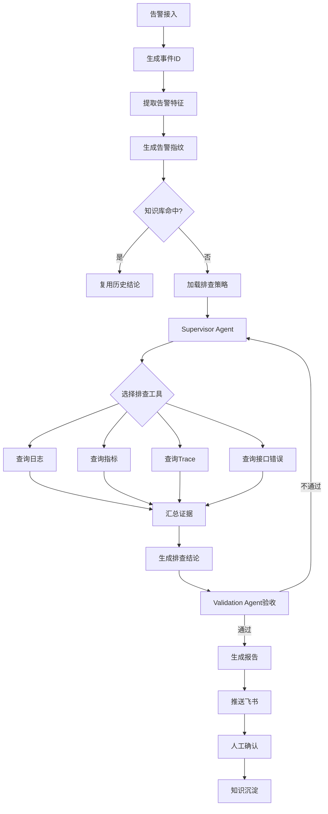

### **结论：这篇文章的核心，是把“告警排查”从依赖个人经验的人工串联系统，重构为一个由 LLM Agent 驱动、工具提供证据、规则与人工共同兜底的半自动决策系统。**

其本质不是“让大模型回答告警问题”，而是建立一条完整的证据闭环：

> 告警接入 → 特征归一化 → 历史知识匹配 → 自动采集证据 → Agent 推理 → 独立验收 → 报告推送 → 人工确认 → 知识沉淀

上线后，排查耗时中位数由约 20 分钟降至 4.4 分钟，覆盖 11 个服务和 10 多种告警类型。

![[Pasted image 20260808151159.png]]

---

## 一、问题本质：告警排查为什么低效

### 1. 定义：告警排查是什么

告警排查是根据异常信号，回答四个问题：

1. 哪里出了问题？
2. 为什么会出问题？
3. 影响范围有多大？
4. 应该如何处理？

它需要综合三类信息：

- **日志**：发生了什么错误；
- **指标**：异常是否普遍、何时开始、影响多大；
- **链路**：请求在哪个服务或调用环节变慢、失败。

### 2. 原有流程的结构性问题

人工排查通常是：

```text
收到告警
→ 登录日志平台
→ 搜索关键词
→ 切到监控平台
→ 查看指标曲线
→ 切到链路平台
→ 查看 Trace
→ 人工拼接结论
```

问题不在于某个步骤特别复杂，而在于系统存在四类摩擦：

| 问题 | 根因 | 直接后果 |
|---|---|---|
| 数据分散 | 日志、指标、链路分别存储 | 频繁切换平台 |
| 信息不完整 | 告警本身通常只有异常摘要 | 需要人工补充证据 |
| 经验依赖 | 排查顺序依赖资深工程师 | 新人效率和质量不稳定 |
| 过程不可复现 | 依赖个人操作与判断 | 难审计、难沉淀、难复盘 |

### 3. 第一性原理抽象

任何告警排查都可以拆成三个基本动作：

```text
提出假设
→ 获取证据
→ 验证或否定假设
```

因此，自动化系统的核心不是生成自然语言，而是：

> 根据告警上下文，选择合适的证据工具，逐步缩小根因空间。

这决定了系统必须具备：

- 工具调用能力；
- 动态排查策略；
- 多源证据交叉验证；
- 失败与超时隔离；
- 输出质量验收；
- 全过程可观测。

---

## 二、系统目标：从“信息检索”升级为“证据驱动诊断”

### 1. What：系统要完成什么

Troubleshooter 负责四件事：

1. 自动采集日志、指标和链路数据；
2. 根据告警类型选择排查路径；
3. 形成带证据的根因分析与处置建议；
4. 将人工确认后的结论沉淀为知识。

它不是单纯的问答机器人，而是一个受约束的诊断系统。

### 2. Why：为什么采用 Agent

传统固定流程适合稳定、单一的故障类型，但真实告警具有差异：

- OOM 需要重点查看内存和 GC；
- RT 突增需要查看延迟、QPS 和下游依赖；
- 有 Trace ID 时应优先定位调用链；
- 没有 Trace ID 但有接口路径时，应从接口错误日志反推 Trace。

因此，系统需要根据当前证据动态决定下一步，而不是固定执行所有查询。

### 3. How：系统如何完成

系统采用分层架构：

```text
告警接入层
    ↓
事件处理与调度层
    ↓
知识匹配层
    ↓
Supervisor Agent
    ↓
日志、指标、链路等只读工具
    ↓
Validation Agent
    ↓
报告与知识沉淀
```

关键原则是：

> 告警接收与排查执行解耦。

告警接入层只负责接收和持久化，排查由独立调度器异步触发。这样可以避免外部告警系统被排查过程阻塞，也方便重试、限流和故障隔离。

---

## 三、核心数据模型：先把告警变成可检索、可决策的事件

### 1. 事件 ID

每条告警首先生成唯一事件 ID，用于：

- 关联所有排查日志；
- 跟踪实时进度；
- 生成排查目录；
- 区分同一服务的多次告警；
- 支持审计和复盘。

### 2. 告警指纹

系统从告警中提取五类特征：

```text
服务名
告警类型
错误模式
指标名
错误摘要
```

然后生成 32 位 MD5 指纹。

#### Why：为什么需要指纹

相同类型的告警往往反复出现。若每次都重新调用 Agent，会造成：

- 重复查询；
- 增加 LLM 成本；
- 延长响应时间；
- 浪费已经验证过的知识。

指纹可以将当前事件与历史问题关联起来，实现：

```text
相同模式 → 复用历史结论
```

### 3. 指纹的边界

指纹匹配适合：

- 错误模式稳定；
- 服务和告警类型明确；
- 历史结论已经人工确认。

它不适合直接处理：

- 错误摘要变化较大的问题；
- 根因依赖实时指标的问题；
- 跨服务级联故障；
- 相似表象但不同根因的问题。

因此，知识匹配只能作为快速路径，不能完全替代实时排查。

---

## 四、排查主流程：一条证据闭环

![[Pasted image 20260808151240.png]]

### 1. 完整流程



### 2. 每一步的设计原因

#### 告警接入

接收告警并持久化，确保后续系统异常时不会丢失事件。

#### 指纹生成

将非结构化告警转化为可匹配的标准特征。

#### 知识匹配

对已知问题走快速通道，降低延迟和模型调用量。

#### 策略加载

根据服务名和告警类型加载针对性排查逻辑。

#### Agent 排查

让模型根据当前上下文选择工具，而不是盲目查询全部数据。

#### 结论验收

把“模型生成了文本”与“结论可以交付”区分开。

#### 报告推送

将结果送入运维人员已有的协作入口，减少额外系统切换。

#### 知识沉淀

只有人工确认后的结果才进入知识库，避免错误结论循环传播。

---

## 五、Agent 设计：不是 Prompt，而是受控的推理循环

### 1. ReAct 机理

系统使用 ReAct 模式：

```text
思考
→ 选择工具
→ 执行工具
→ 观察结果
→ 继续思考
→ 输出结论
```

其本质是把排查过程拆成多个“假设—证据”循环。

例如：

```text
告警：接口 RT 突增
↓
假设：可能是下游依赖变慢
↓
查询 Trace
↓
发现某下游 Span 延迟升高
↓
查询指标确认下游 RT 是否同时升高
↓
交叉验证根因
```

### 2. Supervisor Agent 的职责

Supervisor Agent 不是直接分析全部数据，而是负责：

- 理解告警上下文；
- 读取排查策略；
- 决定调用哪些工具；
- 控制工具调用顺序；
- 汇总工具结果；
- 形成结构化结论。

它承担的是“排查流程编排”职责。

### 3. 为什么不能只依赖 Prompt

大模型无法凭空知道：

- 当前 QPS；
- 错误日志内容；
- 调用链结构；
- 指标变化时间；
- 真实环境名称。

这些信息必须通过工具获取。因此：

> LLM 负责推理，工具负责事实。

这是系统可靠性的基本边界。

---

## 六、四类排查工具：工具即证据入口

## 1. `queryLogs`：日志查询与分析

### What

连接日志平台，分批查询并分析日志。

### 查询优先级

```text
Trace ID
→ 异常名称
→ 接口路径
→ 关键词
```

### Why：为什么设置优先级

查询条件的区分度不同：

- Trace ID 最精确；
- 异常名称可以定位错误类别；
- 接口路径可以缩小服务范围；
- 关键词适合补充搜索，但噪声最大。

### 关键设计

#### 分批查询

避免一次性加载大量日志，导致：

- 上下文窗口被占满；
- 重要日志被淹没；
- 单次查询超时。

#### 异步分析

每批日志独立分析，再进行结论汇总，提高吞吐量。

#### 日志去重

通过 `LogDeduplicator` 去除同一请求产生的重复日志，避免重复证据占用分析空间。

---

## 2. `queryMetrics`：监控指标查询

### 支持指标

```text
QPS
RT
错误率
容器 CPU
容器内存
分位数 RT
GC 次数
GC 耗时
QPS Top 10
RT Top 10
```

### Why：为什么由 Agent 选择指标

不同告警需要不同指标组合：

| 告警类型 | 重点指标 | 目的 |
|---|---|---|
| OOM | 内存、GC、QPS、RT、CPU | 判断内存压力和 GC 状态 |
| 接口 RT 突增 | RT、分位数 RT、QPS、RT Top 10 | 判断延迟范围与热点接口 |
| 错误率升高 | 错误率、日志、接口错误 | 判断错误是否集中于某类请求 |
| 下游超时 | Trace、RT、依赖指标 | 定位具体慢调用 |

由 Agent 按告警上下文动态选择指标，可以减少无意义查询。

### 环境适配

不同环境的 APM 查询参数不同，例如生产、测试环境使用不同代理编码。因此，系统通过 `MetricService` 为各环境提供可插拔实现。

这体现了一个重要原则：

> 环境差异应由系统配置和适配层处理，不应交给 LLM 自由推断。

---

## 3. `queryTrace`：分布式链路追踪

### What

根据 Trace ID 获取 Span 树，并转化为适合模型分析的结构化文本。

### Why

链路可以回答：

- 哪个服务调用变慢；
- 哪个 Span 抛出异常；
- 延迟集中在哪一段；
- 是否存在下游依赖问题。

### 适用条件

最适合告警中已经包含 Trace ID 的场景。

### 边界

若没有 Trace ID，就不能强行使用该工具，需要通过日志或接口错误工具反向获取。

---

## 4. `queryEndpointErrors`：接口错误排查

### What

当没有 Trace ID、但存在明确接口路径时：

```text
查询接口错误日志
→ 提取 Trace ID
→ 逐个分析链路
```

### Why

它提供了一条从“接口级异常”反向定位“请求级链路”的路径。

### 安全边界

当接口路径是根路径 `/` 时拒绝执行。

#### 原因

根路径通常匹配大量请求：

- 查询结果噪声极大；
- 会消耗大量日志和模型资源；
- 很难形成有效定位。

这是典型的“工具参数边界保护”。

---

## 七、动态策略：让排查逻辑可配置，而不是写死

### 1. 策略模型

系统根据以下维度匹配策略：

```text
(service_name, alert_type)
```

匹配不到时使用内置兜底策略。

最终指令由三部分组成：

```text
角色定义
+ 服务与告警类型对应的排查策略
+ 输出格式要求
```

### 2. Why：为什么要动态策略

不同服务的故障特征不同：

- 核心网关关注下游依赖和流量；
- 数据处理服务关注任务堆积和资源使用；
- 消息服务关注消费延迟和积压；
- 数据库相关服务关注连接池和慢查询。

如果把这些规则全部写入代码，会产生：

- 修改成本高；
- 发布周期长；
- 运维人员无法自主调整；
- 策略与程序强耦合。

### 3. How：如何改进

策略放入数据库，并提供前端在线编辑能力，实现：

```text
策略变化 → 修改配置
而不是
策略变化 → 修改代码 → 测试 → 发布
```

这使系统从“固定程序”变成“可运营的诊断平台”。

---

## 八、可靠性设计：工具失败不能拖垮全流程

### 1. 外部依赖是不可靠的

日志平台、APM、链路系统都可能出现：

- 网络延迟；
- 查询超时；
- 服务不可用；
- 返回数据为空；
- 返回格式异常。

如果没有隔离机制，一个工具失败就可能导致整条排查链路失败。

### 2. 工具超时隔离

每个工具通过独立线程池和 `Future.get(timeout)` 执行。

```text
工具调用
→ 独立线程池
→ 超时控制
→ 成功则返回结果
→ 超时则返回降级消息
```

超时消息示例：

```text
指标查询超时，继续使用已有信息进行排查。
```

### 3. Why：为什么采用降级而不是直接失败

故障排查具有“部分信息也有价值”的特点。

例如：

- 指标查询失败，但日志显示明确异常；
- Trace 查询失败，但接口错误集中出现；
- 某一批日志超时，但其他时间段仍有有效证据。

因此，正确策略是：

> 将工具失败转化为证据缺失，而不是流程终止。

### 4. 边界

降级不能无限进行。如果关键证据缺失，系统应：

- 降低结论置信度；
- 明确标记未验证项；
- 要求人工确认；
- 避免输出确定性过强的根因。

---

## 九、权限安全：Agent 只能观察，不能直接改变系统

### 1. 权限模型

Agent 仅拥有只读权限：

- 可以查日志；
- 可以查指标；
- 可以查 Trace；
- 可以生成分析报告。

Agent 不允许：

- 修改配置；
- 重启服务；
- 回滚代码；
- 写入数据库；
- 调用变更接口；
- 修改运行中系统状态。

### 2. Why：为什么不直接自动处置

自动处置的风险远高于自动分析：

```text
分析错误 → 产生错误建议
处置错误 → 直接扩大事故影响
```

因此，当前系统将职责限制为：

```text
AI：采集、分析、建议
人：确认、决策、执行
```

这是一个典型的“低权限、可审计、人工确认”设计。

---

## 十、幻觉控制：从“语言正确”转向“证据正确”

LLM 落地的最大风险不是不会生成文字，而是生成看似合理但缺乏证据的结论。

系统采用四层控制。

## 1. 规则格式校验

第一轮不调用 LLM，直接检查：

- 必要章节是否齐全；
- 指标表格是否规范；
- 输出结构是否完整；
- 必填字段是否存在。

### Why

格式问题不需要模型判断。用规则处理可以：

- 响应更快；
- 结果更稳定；
- 节省模型调用；
- 不占用重试配额。

## 2. 独立 Validation Agent

由独立验收 Agent 审查：

- 根因是否明确；
- 核心判定是否合理；
- 根因是否有工具证据；
- 建议是否可执行；
- 紧急程度是否合理；
- 置信度是否匹配证据强度。

### Why：为什么不能让同一个 Agent 自检

同一个模型可能重复自身偏差。独立验收可以形成角色分离：

```text
Supervisor：负责生成结论
Validator：负责质疑结论
```

## 3. 多源交叉验证

只有不同工具结果相互印证，才能提高结论可信度。

典型交叉关系：

```text
日志 + Trace
日志 + 指标
Trace + 指标
时间线 + 各类证据
```

例如：

```text
日志显示下游超时
+ Trace 显示对应 Span 延迟升高
+ 指标显示该下游 RT 同期上升
= 根因可信度较高
```

### 证据闭环原则

结论强度不能超过证据强度：

```text
无证据：只能描述现象
单一证据：提出可能原因
多源一致证据：形成高置信度根因
```

## 4. 重试机制

文章中的策略是：

- 格式问题：不消耗重试配额；
- 内容问题：最多重试 2 次；
- 验收 Agent 异常：宽容通过。

### Why

不同失败类型需要不同处理：

| 失败类型 | 处理方式 |
|---|---|
| 缺字段、格式错误 | 直接修正 |
| 根因证据不足 | 重新排查或补充工具调用 |
| 验收服务异常 | 避免因辅助组件故障阻塞主流程 |

但“宽容通过”应同时配合降低置信度或增加人工审核，否则可能削弱质量控制。

---

## 十一、可观测性：Agent 不能是黑盒

### 1. 文件系统日志

每个事件创建独立目录：

```text
logs/evt-20260514153012345-001/
```

记录内容包括：

- LLM 输入；
- LLM 输出；
- 工具调用参数；
- 工具返回结果；
- 各阶段状态；
- 验收过程；
- 重试过程。

### Why

用于：

- 故障复盘；
- 提示词优化；
- 工具质量分析；
- 模型行为审计；
- 结果争议追踪。

### 2. 内存进度追踪

`EventProgressTracker` 保存每个事件的：

- 当前阶段；
- 当前策略；
- 当前工具；
- 当前状态。

前端每 3 秒轮询一次，展示实时进度。

### Why

用户不能只看到“处理中”，还需要知道：

```text
正在查什么
已经完成什么
当前是否超时
下一步是什么
```

可观测性本身也是信任机制。

---

## 十二、真实案例：效率网关超时

### 1. 事件

告警对象为效率网关，问题类型是网关超时。

### 2. 排查过程

Agent 在约 4 分钟内完成：

- 3 次工具调用；
- 1 轮验收修正；
- 1 次最终通过。

第一次验收失败的原因是缺失必填字段，之后 Agent 补齐结构化内容。

### 3. 输出特征

最终结论包含：

- 根因判断；
- 证据说明；
- 紧急程度；
- 置信度；
- 处置建议。

案例体现了一个关键事实：

> Agent 的价值不仅在于“自动查数据”，还在于把零散查询过程整理成可交付的工程结论。

### 4. 性能结果

工具调用总计约 88 秒，加上模型推理与验收，总耗时约 4 分钟。

人工流程通常需要：

```text
登录 APM
→ 查链路
→ 看监控
→ 翻日志
→ 人工汇总
```

保守估计需要 10～20 分钟。

---

## 十三、工程难点：真正复杂的不是模型，而是系统边界

## 1. 环境名称统一映射

告警中的环境名称可能有多种写法，例如：

```text
生产
prd
xxprd
xxprd-proxy
```

但日志平台和 APM 平台使用的环境编码又不同。

### 错误做法

让 LLM 自行将环境名“翻译”为系统参数。

### 原因

模型可能：

- 误判环境；
- 混淆生产与测试；
- 生成不存在的编码；
- 在不同轮次使用不同映射。

### 正确做法

由 `EnvironmentProperties` 集中维护环境映射，支持：

- 精确匹配；
- 包含匹配；
- 多环境别名；
- 平台间参数转换。

工具直接读取告警中的标准环境字段，不让模型参与关键参数映射。

## 2. 多 Key Round-Robin

### 问题

LLM 网关对单个 API Key 有频率限制。并发告警增多后，单 Key 容易被限流。

### 方案

使用多个 API Key，按事件 ID 哈希取模进行固定分配：

```text
事件 ID
→ 哈希
→ 选择 Key
```

### Why：为什么需要固定分配

同一排查过程的多次 LLM 调用使用同一个 Key，可以：

- 避免上下文或限流策略切换；
- 保持调用路径稳定；
- 便于问题追踪；
- 实现负载均衡。

---

## 十四、效果数据如何理解

文章给出的关键结果包括：

- 中位数排查耗时：约 20 分钟降至 4.4 分钟；
- 覆盖：11 个服务；
- 告警类型：10 多种；
- 验收首次通过率：约 60%；
- 验收二次通过率：约 38%；
- 验收耗尽兜底率：约 2%。

### 1. 首次通过率不等于系统失败率

约 60% 首次通过，说明仍有较多结论需要修正，但二次通过率约 38%，表明验收机制能够有效纠正部分问题。

### 2. 兜底率较低

约 2% 的验收耗尽兜底率说明绝大多数事件能够在限定重试次数内完成验收或形成可交付结果。

### 3. 仍需关注的质量问题

文章没有进一步展开以下指标，实际落地时还应测量：

- 根因准确率；
- 建议采纳率；
- 人工修改比例；
- 误报和漏报率；
- 不同告警类型的成功率；
- 单次排查成本；
- 工具超时率；
- 知识复用命中率。

耗时下降只能说明效率提升，不能单独证明诊断质量提升。

---

## 十五、方案的关键取舍

### 1. 选择 Agent，而不是固定工作流

#### 优点

- 能适应不同告警；
- 能动态选择工具；
- 能根据证据调整下一步；
- 新增告警类型时扩展成本较低。

#### 代价

- 输出不稳定；
- 调试难度更高；
- 需要验收、重试和可观测性；
- 调用成本可能波动。

### 2. 选择只读 Agent，而不是自动修复

#### 优点

- 风险低；
- 易于上线；
- 便于人工审核；
- 事故影响可控。

#### 代价

- 仍需要人工执行处置；
- 无法实现完全闭环；
- 处置速度受人工确认影响。

### 3. 选择规则加 LLM 的混合方案

#### 规则适合

- 参数校验；
- 格式校验；
- 环境映射；
- 权限控制；
- 超时处理；
- 根路径拦截。

#### LLM 适合

- 选择排查路径；
- 理解自然语言告警；
- 综合多源证据；
- 生成解释性结论。

基本原则是：

> 确定性问题交给代码，不确定性问题交给模型。

---

## 十六、按照“定义—机理—边界—方法”重新归纳

| 模块 | 定义 | 机理 | 边界 | 方法 |
|---|---|---|---|---|
| 告警指纹 | 告警的结构化特征摘要 | 相似特征映射历史知识 | 不能替代实时证据 | 五维特征加 MD5 |
| Supervisor Agent | 排查流程编排器 | ReAct 循环选择工具 | 不应直接创造事实 | 动态策略加工具调用 |
| 排查工具 | 获取事实证据的接口 | 查询外部系统并返回结果 | 外部系统可能失败 | 独立线程池和超时隔离 |
| 动态策略 | 服务与告警类型对应的排查规则 | 调整模型的搜索方向 | 策略质量决定结果上限 | 数据库存储、前端编辑 |
| Validation Agent | 独立结论验收器 | 检查完整性与证据关系 | 不能替代事实查询 | 规则校验加模型验收 |
| 知识库 | 已确认问题的经验资产 | 相似事件快速复用 | 错误结论会污染知识 | 人工确认后沉淀 |
| 可观测性 | 对 Agent 行为的过程记录 | 记录输入、工具、输出和状态 | 日志可能包含敏感数据 | 文件日志加内存进度 |
| 权限控制 | 限制 Agent 能做什么 | 只读权限隔离风险 | 不能直接自动处置 | 只开放查询接口 |

---

## 十七、母题驱动的证据闭环

这篇文章可以围绕五个母题理解。

### 母题一：如何降低排查时间

证据链：

```text
人工多平台切换
→ 数据访问成本高
→ 统一工具入口
→ Agent 自动编排查询
→ 排查耗时下降
```

### 母题二：如何避免 LLM 胡编

证据链：

```text
模型无法直接观察真实系统
→ 必须通过工具获取事实
→ 多源证据交叉验证
→ 独立 Agent 验收
→ 限制结论无依据扩张
```

### 母题三：如何让系统适应不同故障

证据链：

```text
故障类型差异大
→ 固定流程不够灵活
→ 按服务和告警类型加载策略
→ Agent 动态选择工具
→ 提高场景覆盖率
```

### 母题四：如何控制自动化风险

证据链：

```text
错误处置的代价高
→ Agent 只读
→ 建议不直接执行
→ 人工确认后处置
→ 限制事故扩散
```

### 母题五：如何让 Agent 可运营

证据链：

```text
Agent 行为不透明
→ 记录每轮输入输出与工具调用
→ 实时展示执行进度
→ 支持审计、复盘和调优
→ 从实验系统变成生产系统
```

---

## 十八、可进一步改进的方向

文章已经列出五个后续方向，其背后的改进逻辑如下。

### 1. 多 Agent 并行排查

当前日志、指标可能串行查询。可以并行执行：

```text
日志 Agent
指标 Agent
Trace Agent
```

最后由汇总 Agent 整合结果。

#### 改进收益

- 缩短总耗时；
- 降低单链路阻塞；
- 提高资源利用率。

#### 新问题

- 需要处理并发限流；
- 需要统一时间窗口；
- 需要解决证据到达顺序不同的问题。

### 2. 指纹知识库

将已确认问题进行结构化存储，优先进行秒级匹配。

#### 改进收益

- 已知问题无需重新排查；
- 降低模型成本；
- 提升稳定性。

### 3. 跨服务关联分析

当前主要围绕单个服务排查。进一步需要建立：

```text
服务调用图
+ 告警时间线
+ 依赖关系
+ 多服务指标
```

从而识别级联故障和共同根因。

### 4. 自动处置

从：

```text
排查 + 建议
```

升级为：

```text
排查 + 人工确认 + 自动执行
```

但必须增加：

- 操作白名单；
- 风险分级；
- 二次确认；
- 回滚机制；
- 操作审计；
- 熔断和限次。

### 5. 向量语义检索

MD5 指纹适合精确匹配，但对语义相似、表述不同的问题不够敏感。

向量检索可以发现：

```text
“接口响应变慢”
与
“网关 RT 持续升高”
```

可能属于相同故障模式。

但向量相似不代表根因相同，因此仍需实时证据验证。

---

## 十九、最重要的可迁移经验

这套方案可以抽象为一套通用的企业 Agent 落地方法：

```text
1. 先将业务问题拆成“假设—证据—验证”
2. 让代码负责确定性约束
3. 让模型负责不确定性推理
4. 为模型提供受限、可解释的工具
5. 允许部分工具失败并继续推进
6. 用独立验收器检查输出
7. 用多源证据限制幻觉
8. 保留完整过程日志
9. 先只读分析，再考虑自动执行
10. 将人工确认结果沉淀为知识
```

最核心的设计思想可以浓缩为一句话：

> 不要让 LLM 直接“猜答案”，而要让它在受控权限、明确策略和真实工具的约束下，逐步构建并验证答案。