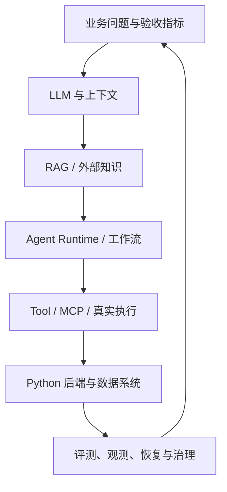
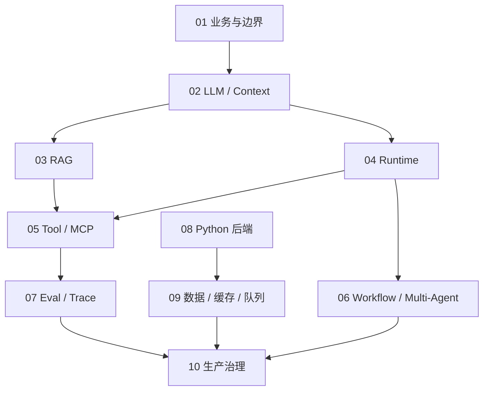
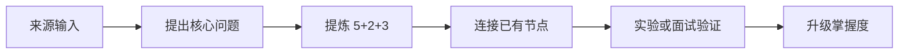

# AI 应用开发 × Agent × Python 后端：学习总导航

> 目标：面向 2027 届 AI 应用开发 / Agent 后端岗位，把阿里、得物、美团、腾讯、字节、小红书、快手 JD 的共同要求，生长成可解释、可实现、可验证的能力树。  
> 使用方式：建议在飞书知识库中把本目录作为一个主题空间；每篇是一个知识节点，不要把全文抄进一张笔记。
> 外部资料已封库：各节点的必读清单与 raw/ 挂载表见 [14-权威资料库与学习路线](14-权威资料库与学习路线.md)（2026-09-07 起，执行期不再新增搜索）。

> **⚠️ 2026-09-25 起本目录降为「素材底库」，不再是学习入口。**
> 学习入口是 `wiki/topics/{模块}/` 的**模块卡与主线页**（`site/modules/{模块}-NN-*.html`），推进单位是**一条主线**、复述用的是主线页第一节的**「本主线骨架」**。
> 下面这张 01→10 的学习树**只说明素材当初是怎么组织的，不要再按它推进**；哪条主线需要素材，直接来这里查对应节点即可。
> 本目录 13 份课程正文在并入母题卡之后将移入 `archive/`——**秋招结束后执行**（现在移动会断 100 处站内引用，冲刺期不划算）。

---

## 0. 一句话总纲

AI 应用工程不是“把模型接进接口”，而是：

> **围绕真实业务目标，把概率模型放进受约束、可执行、可评测、可恢复的后端系统。**

可以把生产价值写成一个约束优化问题：

\[
\max \; \text{Business Value} \times \text{Task Success Rate}
\]

同时满足：

\[
\text{Latency} \le L,\quad \text{Cost} \le C,\quad
\text{Risk} \le R,\quad \text{Reliability} \ge S
\]

所以岗位共同能力链不是多个框架的并集，而是一条闭环：



---

## 1. 学习树：先掌握什么，后扩展什么

| 顺序 | 知识节点 | 它回答的核心问题 | 面试最低线 | 项目证据 |
| --- | --- | --- | --- | --- |
| 01 | [第一性原理与业务 AI 化](01-第一性原理与业务AI化.md) | 为什么用 AI，价值和边界是什么？ | 能定义用户、任务、基线、指标、风险 | 四个项目均可 |
| 02 | [LLM 与 Context Engineering](02-LLM与Context-Engineering.md) | 模型为什么不稳定，怎样给它正确上下文？ | 能解释 Token、上下文、结构化输出、压缩 | RuleArena |
| 03 | [RAG 与企业知识系统](03-RAG与企业知识系统.md) | 怎样让回答基于最新、受权、可引用的知识？ | 能设计生产管线和分层评测 | 数驭穹图 |
| 04 | [Agent Runtime 与 Harness](04-Agent-Runtime与Harness.md) | 怎样让模型在循环中规划、执行、验证、恢复？ | 能手写最小 Loop 和状态模型 | RuleArena |
| 05 | [Tool、MCP、Skill 与可信执行](05-Tool-MCP-Skill与可信执行.md) | 怎样让 Agent 安全地改变真实世界？ | 能设计契约、权限、幂等、审计 | EnergyOps |
| 06 | [Workflow、多 Agent 与长任务](06-Workflow-多Agent与长任务.md) | 怎样拆解复杂任务，何时才需要多 Agent？ | 会做模式选择和失败恢复 | RuleArena |
| 07 | [Eval、Trace 与 Observability](07-Eval-Trace与Observability.md) | 怎样证明系统真的变好，并定位为什么失败？ | 能建评测集、轨迹、Replay、CI 门禁 | RuleArena |
| 08 | [Python 异步与 AI 后端](08-Python异步与AI后端.md) | 怎样承载流式、并发、慢模型和长任务？ | asyncio、SSE、背压、取消、队列 | EnergyOps |
| 09 | [数据、缓存、队列与一致性](09-数据缓存队列与一致性.md) | 怎样维护权威状态并抵抗重复和故障？ | 事务、缓存、消息语义、幂等 | EnergyOps/Ovanta |
| 10 | [生产治理、安全、性能与成本](10-生产治理安全性能与成本.md) | 怎样把 Demo 变成可上线、可运营的系统？ | SLO、限流、降级、灰度、安全、成本 | EnergyOps |
| 11 | [[面试回答与复习验收手册]] | 怎样把知识变成稳定口述和工程证据？ | 60 秒回答 + 追问 + 证据 | 全部 |

### JD → 学习节点映射

| JD 共同要求 | 主节点 | 联动节点 | 最佳证据 |
| --- | --- | --- | --- |
| 业务理解、产品意识、从 0 到 1 | 01 | 07、10 | AI 功能卡 + 业务指标 |
| LLM、Prompt、结构化输出 | 02 | 07 | Context 消融 + Schema 测试 |
| RAG、知识库、GraphRAG、NL2SQL | 03 | 02、07、09 | 数驭穹图 Retrieval/Answer Eval |
| Planning、Memory、Agent Harness | 04 | 02、06、07 | RuleArena Runtime/Checkpoint |
| Tool Use、MCP、Skill、沙盒 | 05 | 04、10 | EnergyOps Tool Catalog |
| Workflow、多 Agent、长任务 | 06 | 04、08、09 | 单/多 Agent 消融 + 恢复实验 |
| Agent Eval、Trace、Replay、AgentOps | 07 | 全部 | CI Eval + Trace Dashboard |
| Python、FastAPI、asyncio、高并发 | 08 | 09、10 | 压测、取消、背压、流式 |
| PostgreSQL、Redis、MQ、分布式一致性 | 09 | 08、10 | Outbox/幂等/故障注入 |
| 稳定性、安全、成本、灰度、AI Coding | 10 | 07、08、09 | SLO、红队、灰度回滚 |

### 补充节点（不占主干顺序）

- 12–20：面经融合、背诵版、算法母题、场景题库、冲刺路线等，**2026-09-10 已迁出**至 `wiki/interview/` 与 `wiki/topics/`，本目录只保留课程本体。
- **MySQL｜[[MySQL模块深挖卡]]**：岗位栈（MySQL / InnoDB）与项目栈（PostgreSQL）的对照与八股闭环，用 [[模块深挖卡模板]]，一次一个模块、闭环才换下一个。

### 七家公司最后 20% 的定向开关

| 公司 | 在共同主线之外重点加深 | 对应节点 |
| --- | --- | --- |
| 快手 | 业务 Agent、RAG、后端工程、效果闭环 | 01、03、07、08 |
| 阿里巴巴 | AI Native 商业系统、AI Coding、业务 ROI | 01、04、07、10 |
| 得物 | 标准化 I/O、SDD、数据 Agent、信任分级与沙盒 | 03、05、10 |
| 美团 | 本地生活复杂状态、AI 全栈、流式和模型服务化 | 06、08、09 |
| 腾讯 | Planning/Memory/Reflection、多 Agent、产品责任 | 02、04、06 |
| 字节跳动 | Harness、长任务、AgentOps、版本、成本与高并发 | 04、07、08、10 |
| 小红书 | Product Engineer、多模态/内容安全、Serverless 体验 | 01、05、08、10 |

### 推荐依赖关系



不要等 01 学完才碰 02。正确方法是先用每篇的“60 秒答案”建立全图，再按项目缺口向下钻。

---

## 2. 飞书个人知识生长系统：节点不是收藏夹

### 2.1 三个维度

每个知识条目必须同时标注：

| 维度 | 可选值 | 含义 |
| --- | --- | --- |
| 层级 | 事实 / 原理 / 决策 | 是知道术语、理解机制，还是能做取舍 |
| 状态 | 已掌握 / 待验证 / 缺口 | 不用“看过”冒充掌握 |
| 优先级 | P0 / P1 / P2 / P3 | 共同门槛 / 差异化 / JD 命中 / 当前忽略 |

推荐飞书多维表字段：

| 字段 | 示例 |
| --- | --- |
| 能力 ID | AGENT-STATE-01 |
| 核心问题 | Context、State、Memory 为什么不能混在一起？ |
| 主题 | Agent Runtime |
| 层级 | 决策 |
| 优先级 | P0 |
| 掌握度 | M2 |
| 证据链接 | RuleArena PR / 测试 / Trace 截图 |
| 最后验证 | 2026-09-01 |
| 下次复习 | 间隔复习日期 |
| Bad Case | 恢复后重复执行写操作 |
| 来源 | 官方文档链接 |

### 2.2 一次输入如何变成知识 Patch

阅读文章、看课程或做项目后，不写流水账。只产出一个 Patch：

```markdown
# Patch：<能回答的问题>

- 来源：
- 问题陈述：
- 结论：
- 证据/机制：
- 与已有节点：一致 / 补充 / 冲突 / 替换
- 5 个关键点：
- 2 个反例：
- 3 个迁移：对项目、面试、其他场景有什么用
- 行动：复习 / 实验 / 修改项目 / 更新面试话术
- 掌握度变化：M? → M?
```

知识生长流程：



### 2.3 每篇资料的固定读法

1. **主线**：先读“关键词、一句话、60 秒回答”，形成地图。
2. **机制**：顺着架构图追问数据、状态和控制如何流动。
3. **洞见**：重点记“边界、失败、取舍”，这才是面试区分度。
4. **迁移**：当日必须将一个点迁移到项目或面试话术。
5. **验收**：没有代码、测试、指标或口述验证，不升级掌握度。

---

## 3. 掌握度：只有 M3 才能写“熟悉”

| 等级 | 定义 | 证据 |
| --- | --- | --- |
| M0 | 未接触 | 说不出核心问题 |
| M1 | 能识别 | 一句话解释，不会独立用 |
| M2 | 能复现 | 看文档能完成标准例子 |
| M3 | 能独立解决 | 能实现、选型、调试并回答边界 |
| M4 | 有工程证据 | 有测试、指标、Trace、复盘或真实用户结果 |

单项能力的 M3 四件套：

- 60 秒讲清“问题—原理—方案”；
- 写出关键代码、SQL、状态机或架构；
- 回答失败、替代方案和取舍；
- 指向一个可复现项目证据。

---

## 4. 你的当前学习优先级

### P0：先形成可投递闭环

| 缺口 | 为什么是 P0 | 最短补证路径 |
| --- | --- | --- |
| Session / State / Context / Memory | Agent 岗共同核心 | RuleArena 建运行状态模型与 checkpoint |
| 副作用、幂等、取消、恢复 | Demo 与生产的分界线 | EnergyOps + RuleArena 做故障注入 |
| 生产 RAG 与分层 Eval | Data Agent 高频硬要求 | 数驭穹图加入混合检索、重排和指标 |
| Trace / Replay / CI Eval | 无法复现就无法迭代 | RuleArena 保存版本化轨迹与回归门禁 |
| Python asyncio / 队列 / 背压 | AI 请求慢且昂贵 | EnergyOps 做流式和并发压测 |
| 算法与 CS 基础 | 校招显性门槛 | 独立训练，不用项目替代 |

### P1：P0 稳定后扩展

- 多 Agent 的上下文隔离与并行；
- 模型路由、Prompt/Tool/知识版本管理；
- 前端流式交互与可编辑结果；
- Serverless、Kubernetes、推理服务全景。

### 当前不主攻

- 大模型预训练、RL、CUDA 与分布式训练；
- 为展示框架数量而重复造 Demo；
- 没有评测必要性的复杂多 Agent；
- 同时追 Java、Go、Rust 的深度。

---

## 5. 项目作为知识“实验室”

| 项目 | 学习主线 | 应新增的 M4 证据 |
| --- | --- | --- |
| EnergyOps | Python 后端、MCP、任务、可靠性、数据质量 | asyncio 压测、任务状态机、SLO、Trace、故障恢复报告 |
| 数驭穹图 | RAG、Schema Linking、可信 NL2SQL、权限、证据 | Retrieval Eval、答案 Eval、权限召回测试、Bad Case 看板 |
| RuleArena | Runtime、Context/Memory、多 Agent、Eval/Replay | checkpoint、HITL、轨迹模型、CI Eval、失败归因 |
| Ovanta | 鉴权、交易、版本、权益、全栈体验 | 为 AI 功能增加授权、幂等、可编辑输出和用户指标 |

项目升级原则：一个新增机制至少留下四种证据中的两种：代码、测试、指标、复盘。

---

## 6. 统一面试回答模型

所有问题都用五层表达，不背散点：

| 层 | 时间 | 内容 |
| --- | --- | --- |
| L0 | 5 秒 | 关键词 |
| L1 | 15 秒 | 一句话定义与价值 |
| L2 | 60 秒 | 问题 → 原理 → 方案 → 边界 |
| L3 | 3 分钟 | 架构/流程 → 失败 → 取舍 → 指标 |
| L4 | 深挖 | 代码、数据结构、故障排查、项目证据 |

标准 60 秒骨架：

> 它解决的是【问题】。核心矛盾是【约束】。我的设计会把系统拆成【三至五个组件】，主链路是【数据/状态流】。为了处理【主要失败】，我会加入【控制机制】。效果用【质量、延迟、成本、风险】验证。若【边界条件】成立，我会改用【替代方案】。在【项目】中，我用【证据】验证过。

---

## 7. 一轮学习如何闭环

### 第一轮：全图扫描

- 每篇只读关键词、一句话、架构图、面试 60 秒答案；
- 把状态标成 M0/M1，不求实现；
- 目标是能画出完整链路。

### 第二轮：按项目补证

- RuleArena：04 → 05 → 06 → 07；
- 数驭穹图：02 → 03 → 07；
- EnergyOps：08 → 09 → 10；
- 每完成一个机制，写一个 Patch 和一个测试。

### 第三轮：模拟面试暴露缺口

- 从 [[面试回答与复习验收手册]] 随机抽题；
- 录音 60 秒回答；
- 追问直到出现“不会解释/不会实现/无证据”；
- 把缺口回填到对应知识节点，而不是继续无目的看课。

---

## 8. 来源可信度规则

| 层级 | 来源 | 用法 |
| --- | --- | --- |
| S | 标准、官方文档、原始论文 | 定义、协议、机制基线 |
| A | OpenAI、Anthropic、Vercel、阿里/得物/美团/腾讯官方技术文章 | 工程模式与实践洞见 |
| B | 成熟开源项目文档、作者技术文章 | 实现参考，需实验验证 |
| C | 二手博客、面经、社区回答 | 只用来发现问题，不直接当结论 |

来源不是结论。任何外部观点都要经过“适用条件—反例—项目实验”三步。

---

## 9. 总验收

当你能独立完成下面这道系统设计题，主线就达到可面试状态：

> 设计一个企业规则审查 Agent：能够检索受权限控制的规则，规划并调用业务工具，长任务可暂停恢复，高风险操作需人工确认；系统支持流式返回、失败重试、轨迹回放、离线评测、灰度发布，并在质量、P95 延迟、成本和安全风险之间做取舍。

最终输出应包括：业务指标、组件图、状态模型、数据模型、Tool 契约、RAG 管线、任务语义、失败矩阵、Eval、SLO、安全边界和项目验证。
