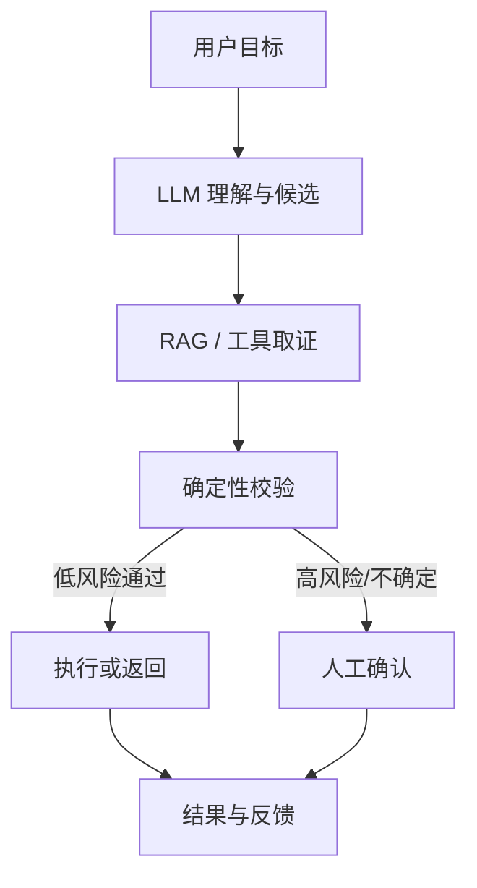
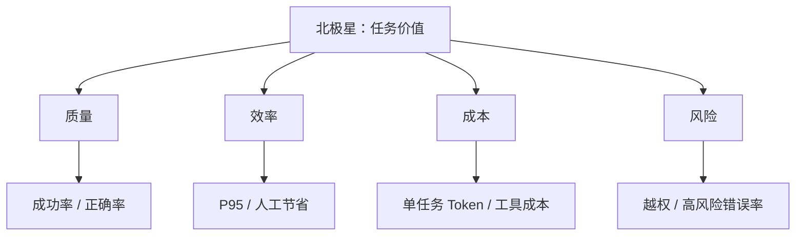

# 01｜第一性原理与业务 AI 化

> 核心问题：**为什么这个问题应该用 AI？怎样把“看起来聪明”变成可验证的业务价值？**

---

## 0. 分层记忆

**关键词**：用户任务、业务基线、概率能力、确定性边界、闭环、指标树、风险预算、ROI。

**一句话**：AI 应用的核心不是生成内容，而是在成本和风险约束下，提高一个真实任务从输入到结果的成功率。

**60 秒面试回答**：

> 我会先定义用户、任务、现有流程和成功标准，再判断瓶颈是否来自非结构化理解、开放式推理或动态决策，这些才适合交给模型。确定性校验、金额计算、权限和高风险写操作仍由程序与人工负责。系统按“理解—检索—决策—执行—验证—反馈”闭环设计，并同时衡量任务成功率、人工节省、P95 延迟、单任务成本和高风险错误率。如果规则程序已经能稳定低成本解决，或结果不可验证且风险很高，我不会使用 Agent。

---

## 1. 从目标函数出发

### 1.1 企业购买的不是 Token

企业真正购买的是一种结果：更快完成任务、更少错误、更低人工成本或新的产品体验。

一个实用的价值表达：

$$\text{Net Value} = \text{任务量} \times \Delta\text{成功价值} - \text{模型与基础设施成本} - \text{错误与治理成本}$$
AI 应用价值评估框架：**净价值 = 任务量 × Δ单次成功价值 − 模型与基础设施成本 − 错误与治理成本**

所以“准确率提高 3%”只有在能映射到业务后才有意义。例如：

- NL2SQL 的价值不是 SQL 相似度，而是正确回答业务问题且没有越权扫描；
- 客服 Agent 的价值不是回复流畅，而是解决率提升且误操作不增加；
- 规则审查的价值不是报告更长，而是高风险遗漏下降且审查时间缩短。

### 1.2 先问五个问题

| 问题 | 必须得到的答案 |
| --- | --- |
| 谁在什么场景使用？ | 用户、触发时机、频率、环境 |
| 现在如何完成？ | 人工/规则/搜索/脚本基线及成本 |
| 最难的认知步骤是什么？ | 理解、检索、生成、判断、规划 |
| 什么叫成功？ | 可观测的任务与业务指标 |
| 错了会怎样？ | 可逆性、损失、权限、人工兜底 |

---

## 2. AI、程序与人工的边界

### 2.1 按任务性质分配责任

| 任务              | 优先承担者       | 原因         |
| --------------- | ----------- | ---------- |
| 模糊意图理解、非结构化抽取   | LLM         | 输入开放、规则难穷举 |
| 语义检索、候选生成       | LLM/RAG     | 需要语义近似与泛化  |
| 金额、权限、状态转换、约束验证 | 确定性程序       | 必须可复现、可证明  |
| 高风险批准、价值冲突      | 人           | 需要责任与判断    |
| 动态选择工具和步骤       | Agent       | 路径无法预先完全枚举 |
| 稳定、固定、可枚举流程     | Workflow/代码 | 更便宜、可测、可控  |

### 2.2 最稳健的组合



关键洞见：**让模型负责扩大可解决问题的边界，让程序负责收紧错误的影响半径。**

---

## 3. 何时应该使用 Agent

Agent 的本质不是“会聊天”，而是模型在循环中根据环境反馈动态决定下一步动作。

适合 Agent 的三个条件：

1. 路径不固定，无法用有限分支可靠枚举；
2. 需要跨多个工具或信息源迭代取证；
3. 每一步结果可观察，最终结果可验证或可安全回退。

不适合 Agent：

- 单次分类、抽取、改写即可完成；
- 固定审批流，分支清楚；
- 工具权限很大但结果不可验证；
- 延迟和成本预算极低；
- 失败会造成不可逆损失且没有人工确认。

复杂度升级顺序：

> 普通代码 → 单次 LLM → LLM + RAG → Workflow → 单 Agent Loop → 多 Agent。

每升一级，都必须能说明新增复杂度换来了什么可测收益。

---

## 4. 从业务链路到系统组件

### 4.1 六步闭环

| 业务步骤 | 工程问题 | 典型组件 |
| --- | --- | --- |
| 理解 | 用户真正想做什么？ | Intent、结构化输出 |
| 取证 | 需要什么事实？ | RAG、搜索、数据库、MCP |
| 决策 | 下一步是什么？ | Workflow、Planner、Policy |
| 执行 | 如何安全改变状态？ | Tool、API、事务、幂等 |
| 验证 | 结果是否正确？ | 规则校验、测试、Judge、人工 |
| 学习 | 失败如何反哺？ | Trace、Eval、反馈、版本实验 |

### 4.2 指标树



离线模型指标只能说明局部能力，不能替代端到端任务指标。

---

## 5. 需求分析模板

```markdown
## AI 功能卡

- 用户/场景：
- 任务输入与期望输出：
- 当前基线与耗时：
- 为什么需要模型：
- 哪些步骤必须确定性：
- 权威数据源：
- 允许调用的工具：
- 失败影响与可逆性：
- 质量/延迟/成本/风险指标：
- 无法完成时的降级：
- 上线前 Eval 与灰度门槛：
```

这张卡应先于技术选型。没有它，Agent 很容易退化成“技术演示”。

---

## 6. 分层面试题与回答

### Q1：什么是 AI 应用开发？和传统后端有什么不同？

**15 秒**：传统后端主要把确定性业务规则变成服务；AI 应用还要管理模型的概率输出、上下文、工具执行、评测与风险，但最终仍由后端承担状态、权限和可靠性。

**深入结构**：

1. 输入从结构化参数扩展到自然语言、多模态和开放任务；
2. 输出从确定函数变成概率候选，因此需要验证和降级；
3. 执行路径可能由模型动态选择，因此需要状态机、预算和审计；
4. 测试从断言固定输出扩展到数据集、grader 和统计分布；
5. 系统仍需 API、数据库、缓存、队列、SLO 和安全治理。

### Q2：怎样判断一个场景是否值得用 LLM/Agent？

**回答框架**：

- 先看认知复杂度：是否需要理解非结构化信息或开放推理；
- 再看流程动态性：是否需要根据反馈选择不同路径；
- 再看可验证性：是否能用证据、规则、工具结果或人工验证；
- 最后比较收益、成本和风险；
- 若一次模型调用或固定工作流已足够，不上 Agent。

### Q3：为什么不能让 LLM 直接决定一切？

因为模型优化的是下一个 Token 的概率，不天然理解企业权限、事务、责任和不可逆后果。它可以提出候选决策，但金额计算、权限判断、状态变更、唯一约束和审批必须由确定性系统执行。

### Q4：怎么定义 Agent 的成功？

按四层：

1. 结果：任务是否完成，答案/动作是否正确；
2. 过程：工具选择、参数、步骤、引用是否正确；
3. 工程：P95、超时率、恢复率、成本；
4. 业务：人工节省、转化、解决率、风险损失。

### Q5：效果、延迟、成本冲突时怎么取舍？

先按业务风险分层而不是全局统一：高价值/高风险任务可用强模型、更多检索和人工确认；低风险高频任务用小模型、缓存和固定 Workflow。通过离线 Eval 找帕累托前沿，再用灰度/A-B 验证业务指标。

### Q6：什么情况下不用 RAG？

- 知识小且稳定，可完整放进上下文；
- 任务不依赖外部事实；
- 目标是改变模型行为或格式，而不是补知识；
- 检索噪声大于收益；
- 数据权限和更新机制尚未建立。

### Q7：如何把一个“AI 想法”变成系统设计？

顺序是：任务与指标 → 风险分级 → AI/程序/人工边界 → 数据与工具 → 主链路和状态 → 失败矩阵 → Eval → SLO/成本 → 灰度与反馈。模型和框架是中间选项，不是起点。

### Q8：为什么企业 AI 的核心是闭环？

因为模型上线后数据、知识、用户表达和工具都会变化。没有 Trace 就看不到失败，没有 Eval 就无法判断版本变化，没有反馈回流就无法持续改善。一次性 Demo 没有这个循环。

---

## 7. 项目迁移

### EnergyOps

- 核心任务：从数据接入到异常处置的运营闭环；
- AI 负责：理解运维意图、汇总证据、建议动作；
- 程序负责：计费、阈值、权限、状态变更、对账；
- 指标：告警准确率、平均恢复时间、重复动作率、人工节省。

### 数驭穹图

- AI 负责：意图、Schema Linking、候选查询与解释；
- 程序负责：AST 安全、权限、资源预算、执行和证据；
- 指标：执行正确率、受权召回率、不可回答识别率、P95。

### RuleArena

- AI 负责：规则理解、多视角审查、修复建议；
- 程序负责：可执行状态模型和非法状态判定；
- 指标：高风险规则召回、误报、审查耗时、证据完整率。

---

## 8. M3 / M4 实践验收

### M3

- 为任一项目写完整 AI 功能卡；
- 画出 AI/程序/人工边界图；
- 给出至少一个“不该用 Agent”的替代设计；
- 用 60 秒回答 Q2、Q4、Q5。

### M4

- 建立基线并记录至少一轮版本前后数据；
- 做一次高风险失败演练和降级；
- 留下需求卡、Eval 结果、指标图或复盘链接。

---

## 9. 知识 Patch：5 + 2 + 3

### 5 个关键点

1. AI 应用优化的是任务价值，不是生成长度或主观聪明度；
2. 模型、程序、人工应按概率性、可验证性和责任边界分工；
3. Agent 只在路径动态且反馈可用时值得增加；
4. 指标必须覆盖质量、效率、成本、风险；
5. Trace—Eval—反馈构成上线后的学习闭环。

### 2 个反例

1. 固定审批流却用多 Agent，自由度增加但质量与延迟更差；
2. 只测回答相似度，却忽略越权、错误执行和用户任务是否完成。

### 3 个迁移

1. 项目：所有 README 第一屏增加用户任务、基线、指标和边界；
2. 面试：任何技术回答最后落到风险、指标和项目证据；
3. 学习：看到新框架先问它解决闭环的哪一环，而不是先学 API。

---

## 10. 主要资料

- [Anthropic：Building effective agents](https://www.anthropic.com/engineering/building-effective-agents)
- [OpenAI：A practical guide to building AI agents](https://openai.com/business/guides-and-resources/a-practical-guide-to-building-ai-agents/)
- [Anthropic：Trustworthy AI agents](https://www.anthropic.com/research/trustworthy-agents)
- [阿里 Higress：AI Native 应用架构](https://higress.ai/blog/higress-gvr7dx_awbbpb_ksx4ge93i5zcflry/)
- [Vercel：How we made v0 an effective coding agent](https://vercel.com/blog/how-we-made-v0-an-effective-coding-agent)

