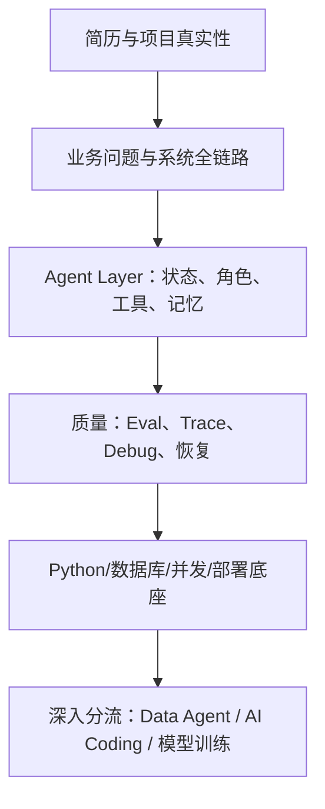
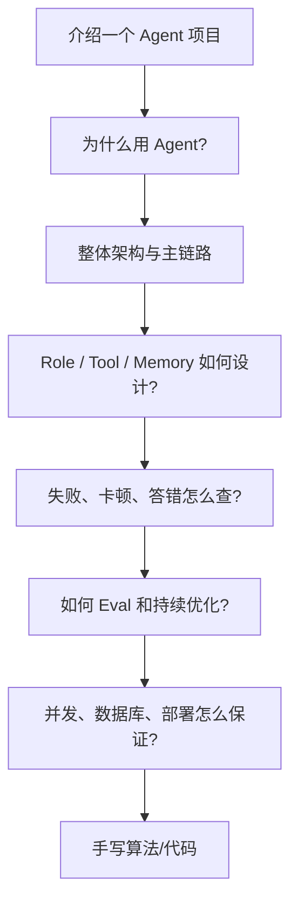
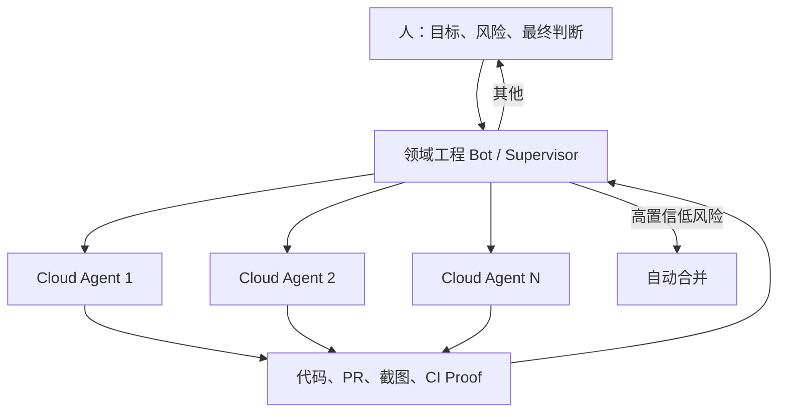

# 12｜字节 × Grok Bot × 多来源 AI Agent 融合面经

> 定位：面向 AI 应用开发 / Agent 后端岗位的去重面经。  
> 输入：用户提供的字节面试截图、`others.md`、懂车帝 Agent 一面、Grok Bot for Engineering，以及公开可检索的补充面经。  
> 调研日期：2026-09-01。

---

## 0. 结论先行

这些面经表面上涉及 Agent、微调、RAG、数据库、算法等大量内容，实际可以归纳为一条考察链：

面试官真正想确认的不是“术语是否听过”，而是：

1. 项目是否真的做过，能否从业务目标讲到失败和指标；
2. 是否理解 Agent 不等于一次模型调用，而是带状态、工具、反馈和终止的运行系统；
3. 多 Agent 是否有必要，角色是否由职责、权限和上下文边界定义；
4. 出错时能否沿 Trace 区分模型、上下文、检索、工具和后端问题；
5. 能否把概率模型放进可靠的数据库、队列、权限和发布体系；
6. 简历若写了微调/算法创新，是否真的理解数据、训练策略与推理有效性。

### 对你的岗位主线

| 级别 | 范围 | 学习策略 |
| --- | --- | --- |
| P0 | 项目深挖、Agent Layer、Role、Context/Memory、Tool/Workflow、Eval/Debug、后端 | 必须达到 M3，主项目争取 M4 |
| P1 | Data Agent/NL2SQL、RAG、AI Coding、Grok Bot 式监督与长期任务 | 与现有项目结合形成差异化 |
| P2 | LoRA、MATH Dataset、Curriculum Learning、Process Supervision | 知道原理；只有目标 JD/简历命中才深挖 |
| P3 | 自称训练算法创新、Dynamic Full-LoRA 等无项目证据内容 | 不写进简历，不主动展开 |

最重要的取舍：截图中第 4–18 题明显由候选人的“数学数据集微调”经历触发，不代表所有 Agent 应用岗都要求训练大模型。你当前应吸收其中的“如何证明推理可靠、如何用过程反馈”，但不应把主线改成模型算法岗。

---

## 1. 来源边界与可信度

| 来源 | 主要内容 | 使用方式 |
| --- | --- | --- |
| 字节面试截图 | Agent Layer、Role 调优、Math 微调、LoRA、推理过程、历史决策、Memory 更新 | 候选人定制追问，题目真实但不代表统一题库 |
| `others.md` | 模型选择、Tool 排障、卡顿、评测、部署、数据库、Data Agent、长期记忆、RAG、AI Coding、算法 | 多份面经汇总，按主题去重 |
| 懂车帝 27 秋招一面 | 多 Agent、状态终止、Eval、Tool/Skill/Workflow、Context、RAG、Vibe Coding、AGENTS.md、LC11 | 字节系 Agent 应用岗高相关样本 |
| Grok Bot 官方与工程文章 | 持久 Bot、领域角色、层级 Agent、云 Worker、监督、Proof、外部任务状态、日常回顾、Playbook | 产品机制反推面试系统设计题 |
| 公开补充面经 | 飞连 Agent、大疆 Agent 等项目/后端追问 | 只用于验证共同信号，不当作官方标准 |

注意：面经是个体样本，岗位、候选人简历和面试官关注点都会改变问题。下面的“高频”表示在这些样本中反复出现，不代表精确统计概率。

### 截图识别说明

- 第 11、12 题图片中显示为 `lord`，结合上下文应为 `LoRA`；
- `Dynamic Full-LoRA` 未找到明确通用算法定义，可能是候选人项目内命名或截图转写；面试时应先向面试官澄清具体实现；
- 第 20 题被界面遮挡，只能确认主题是“用户信息变化后如何更新 Agent Memory”，不补造原题后半句。

---

## 2. 高频雷达：面试准备优先级

| 能力簇 | 热度 | 面试官验证目标 | 你的主证据 |
| --- | --- | --- | --- |
| 项目全链路与个人贡献 | 极高 | 是否真做过、能否落业务 | EnergyOps / RuleArena / 数驭穹图 |
| Agent Layer / Runtime | 极高 | 状态、循环、终止、恢复 | RuleArena |
| 多 Agent / Role | 极高 | 是否合理拆分、如何协作 | RuleArena |
| Context / Memory | 高 | 长会话、更新冲突、权威状态 | RuleArena |
| Tool / Skill / Workflow | 极高 | 能力边界与可靠执行 | EnergyOps 25 MCP Tools |
| Eval / Trace / Debug | 极高 | 是否能测、能查、能改 | RuleArena + EnergyOps |
| RAG / 知识库 | 高 | 召回、匹配、引用、更新 | 数驭穹图 |
| Data Agent / NL2SQL | 高，岗位定向 | Schema、语义层、SQL 可信 | 数驭穹图 |
| Python/Java/Go 后端 | 高 | 并发、队列、数据库、部署 | EnergyOps / Ovanta |
| AI Coding 工程流 | 中高 | 不是“让 AI 写完”，而是受控交付 | RuleArena 开发流程 |
| 数据结构与算法 | 稳定必考 | 校招基本盘 | Hot100 |
| 微调与推理训练 | 岗位/简历触发 | 算法真实性和实验严谨性 | 当前无强项目证据，P2 |

---

## 3. 面试官的典型追问树

面试不会平均问所有知识。通常抓住简历中的一个强声明连续下钻：

- 写“多 Agent” → 为什么不是单 Agent → 角色边界 → 传什么 → 冲突/终止 → 如何证明更好；
- 写“长期记忆” → 存什么 → 怎么写/读 → 冲突/过期 → 用户能否修改 → 如何评测；
- 写“RAG 优化” → baseline → Chunk/Hybrid/Rerank → 指标 → Bad Case；
- 写“高并发” → 规模 → async/线程/队列 → 连接池/背压 → 压测证据；
- 写“微调提升推理” → 数据 → baseline → 对照实验 → 泛化 → 过程是否可信。

---

## 4. 融合题库 A：自我介绍与项目真实性

### A1｜开场与定位

1. 请做一下自我介绍，为什么选择 AI Agent / AI 应用方向？
2. 你如何定位自己：模型算法、Agent 应用，还是后端工程？
3. 介绍一个你最熟悉的 Agent 项目，它解决了什么真实问题？
4. 这个项目的用户、输入、输出和业务基线分别是什么？
5. 为什么这里需要 AI/Agent，哪些部分没有交给模型？
6. 你个人负责了哪部分？最关键的代码和设计是什么？
7. 项目目前是 Demo、离线验证，还是真实落地？
8. 最困难的问题是什么？第一次方案为什么不行？
9. 项目如何验证效果？有哪些测试、指标和失败复盘？
10. 如果重新做一次，你会删除或重构什么？

### A2｜项目深挖判据

合格回答必须能落到：

> 业务问题 → 方案 → 状态/数据流 → 失败 → 指标 → 个人证据。

危险回答：只列 LangChain/LangGraph/MCP 等框架名，无法说明为什么使用、出错在哪里、如何证明有效。

---

## 5. 融合题库 B：Agent / Agent Layer / Harness

1. 你如何理解 AI Agent？Agent Layer 的整体架构是什么？
2. Agent 与普通 LLM 调用、Workflow、RPA 有什么区别？
3. 一个企业级 Agent 系统必须有哪些核心能力？
4. Agent Loop 如何运行？观察、决策、行动、验证和终止分别在哪里？
5. Harness 包含哪些部分？为什么模型之外的层越来越重要？
6. Agent 的 Thread、Run、Turn、Step 如何建模？
7. 任务怎样正常结束、异常退出、暂停和取消？
8. 如何防止无限循环、重复工具调用和无进展推理？
9. 长任务进程重启后怎样恢复？Checkpoint 应保存什么？
10. Replay 和 Resume 有什么区别？怎样避免 Replay 重做副作用？
11. 如何设计 Agent 的预算：步骤、Token、时间、工具和成本？
12. Agent 任务如何支持流式进度、断线重连和异步完成？
13. 模型、Runtime、能力和治理层之间怎样解耦？
14. 框架升级或更换模型时，哪些状态必须保持框架无关？

### Grok Bot 追加追问

15. 为什么 Grok Bot 不是普通聊天机器人，而是一个持久 Agent Runtime？
16. 为什么用一个 Bot 管理 Cursor Cloud Agents，而不是直接让用户管理全部 Agent？
17. 这种“两级 Agent”架构的收益和新风险是什么？
18. 怎样让监督 Agent 读取 transcript、检查 artifact，并追加/中断任务？
19. 怎样跨越单次 Context 限制管理 200 个并行任务？
20. 用 Notion/数据库保存任务状态与把聊天历史塞进 Context 有什么区别？

---

## 6. 融合题库 C：Role 与多 Agent

1. 你是否做过 Agent Role 调优？角色怎样定义？
2. Role 是一段 persona Prompt，还是一个运行时边界？
3. 角色的目标、职责、工具、数据、记忆和审批边界如何配置？
4. 多 Agent 为什么这样拆？为什么不是单 Agent + Tools？
5. 各子 Agent 分别负责什么，输入输出契约是什么？
6. Agent 间如何传递信息、任务和 Artifact？
7. 如何防止 Agent 之间口径不一致、瞎传字段或上下文污染？
8. 谁拥有共享状态？谁能修改业务权威状态？
9. 并行子任务怎样聚合？结果冲突怎么解决？
10. 一个子 Agent 失败或超时，父任务如何降级？
11. 怎样评估多 Agent 比单 Agent 更好，而不是成本更高？
12. 如何对 Role 做调优和消融？评价指标是什么？

### Grok Bot 追加追问

13. 五个工程 Bot 为什么按 iOS、Desktop、Infra、Android、Harness 划分？
14. 为什么领域聚焦能改善有限 Context 下的表现？
15. 运维 Bot Jenny 为什么不写代码？它提供了什么控制面能力？
16. 每日 1:1、Onboarding、Postmortem、Playbook 更新分别对应什么工程机制？
17. Bot 可跨领域工作，但为什么仍要设置长期 owner？
18. 多 Bot 共用一台云电脑时，角色隔离为何不等于安全隔离？

---

## 7. 融合题库 D：Context、State 与 Memory

1. 什么是 Agent 上下文工程？与 Prompt Engineering 有何不同？
2. Context、Agent State、Business State、Short-term Memory、Long-term Memory 如何区分？
3. 上下文窗口短的小模型如何完成复杂任务？
4. 长会话怎样裁剪、摘要、外置 Artifact 和按步骤检索？
5. Compaction 后如何确保关键约束和副作用记录不丢失？
6. Branch/Fork 后怎样合并状态和结果？
7. 长期记忆应该存什么、不应该存什么？
8. Memory 的写入、检索、压缩、去重、合并和删除如何设计？
9. 为什么拆成可读 Markdown 层和语义检索层？各自适用什么？
10. 用户能否查看、修改和删除 Memory？
11. 用户信息发生变化时，旧记忆如何过期、冲突和更新？
12. 如果旧事实是“去 B”，新事实是“去 C”，应覆盖、追加事件还是保留版本？
13. Memory 检索准确如何评测？错误写入如何发现？
14. 怎样避免把模型推测当成用户事实写入长期记忆？
15. 多 Agent 的记忆应该完全共享、按域隔离，还是分层共享？
16. Grok Bot 的 role-specific context 与共享电脑状态如何区分？

---

## 8. 融合题库 E：Tool、Skill、Workflow 与真实执行

1. Tool、Skill、Workflow、Agent 分别承担什么职责？
2. 什么场景用 Skill，什么场景必须使用 Workflow？
3. Tool Calling 的完整生命周期是什么？
4. Tool Schema 怎样设计才能减少选错和参数错误？
5. 工具很多时怎样路由、动态暴露和控制 Context？
6. Agent 如何编排工具并保证调用效果？
7. Tool 调用失败应怎样排查？
8. 哪些错误可重试，哪些必须澄清、降级或人工？
9. ToolCallID 和业务幂等键有什么区别？
10. 写操作超时、结果未知时能否直接重试？
11. 高风险动作如何确认、授权、审计和补偿？
12. MCP 解决什么问题，又不解决什么？
13. Browser/Computer Use 与 API/Connector 如何选择？
14. 生成代码或执行命令时如何做沙盒和资源隔离？

### Grok Bot 追加追问

15. 为什么一次成功任务应先保存成 Skill，再配置 Routine？
16. Teach-by-demonstration 为什么还需要补决策、失败和审批规则？
17. 为什么 Connector 通常比浏览器点击可靠？什么时候仍需要 Computer Use？
18. 多个 Bot 共享登录态有什么便利和风险？

---

## 9. 融合题库 F：RAG、知识库与 Data Agent

### F1｜通用 RAG

1. 请讲 RAG 的离线入库和在线查询完整流程。
2. Embedding 解决什么问题？如何选择和版本化？
3. Chunk 如何设计，怎样通过 Eval 选择大小？
4. 如何提升召回准确性和上下文匹配？
5. BM25、向量检索、Hybrid、RRF、Rerank 分别有什么作用？
6. Query Rewrite 和 HyDE 什么时候有效，什么时候引入偏差？
7. 如何处理权限、时效、冲突和删除传播？
8. Retrieval Eval 和 Answer Eval 如何分开？
9. 检索正确但回答错误时怎样定位？

### F2｜Data Agent / NL2BI / NL2SQL

10. 数据分析 Agent 的完整业务流程是什么？
11. 如何识别用户真正的数据需求，并处理口径不明确？
12. 如何发现数据库中的表、字段、类型、关系和注释？
13. 语义层解决什么问题？指标口径如何定义和版本化？
14. Schema Linking 如何召回和评测？
15. 如何从用户消息生成可靠 SQL？
16. 为什么需要 IR/SemQL，而不是直接生成 SQL？
17. SQL 如何做 AST、只读、权限、扫描量、Join、导出限制？
18. SQL 执行成功但业务语义错误怎样发现？
19. 多 Agent 之间如何只传实体 ID/字段 ID，而不是瞎传自然语言字段？
20. 最终图表、分析和建议如何绑定 SQL 与数据证据？

---

## 10. 融合题库 G：Eval、Trace、Debug 与性能

### G1｜评测

1. 是否做过 Agent 评测？数据从哪里来？
2. 如何设计 Golden、Bad Case、Holdout 和对抗样本？
3. 评测要覆盖结果、过程、工程、成本和安全中的哪些指标？
4. Tool 选择、参数、步骤和终止如何评测？
5. RAG 召回、答案忠实和引用如何评测？
6. Code/Rule Grader、LLM Judge 和人工怎样组合？
7. Trace/Replay 如何帮助失败归因？
8. Eval 如何进入 CI，怎样设置回归门禁？
9. 线上用户反馈如何转成评测集？
10. 如何用 Eval 证明 Role、多 Agent、HyDE 或 Prompt 确实有提升？

### G2｜故障排查

11. Tool 调用报错时怎样排查？
12. Agent 答非所问时怎样区分意图、上下文、检索和模型问题？
13. Agent 把 A、B 两项混淆时怎样定位？
14. 对话进行到中途才卡顿，怎样排查？
15. 从第一轮就卡顿，怎样排查？
16. Agent 偶发停在等待状态，怎样区分外部依赖、状态机和前端问题？
17. 模型响应正常但用户看不到 Token，检查哪些代理/SSE 配置？
18. 任务完成但最终状态仍 Running，可能是哪类事务/事件问题？
19. 怎样定位 P95/P99 突然升高？
20. 单机 Agent 迁移到服务器后为什么可能更卡？

### G3｜Grok Bot 监督循环

21. 如何检查 Cloud Agent 的 transcript、CI、冲突和 Artifact？
22. 截图“看起来变化了”怎样转成可验证 Proof？
23. 何时自动追加消息、何时中断、何时交给人工？
24. 为什么高置信度 + 低爆炸半径才适合自动合并？
25. P0 每五分钟检查一次为什么变快，又为什么烧 Token？
26. Postmortem → Playbook 更新是否可能把错误经验固化？如何验证？

---

## 11. 融合题库 H：模型选择、服务端与数据库

### H1｜模型选择

1. 项目如何选择不同型号、规模和提供商的模型？
2. 为什么不用一个最强模型处理全部任务？
3. 小模型 + 短上下文怎样保证复杂任务完成？
4. 如何按任务难度、风险、延迟和成本做 Model Routing？
5. 模型故障、限流和版本变化怎样降级？
6. 模型替换如何用同一 Eval 比较？

### H2｜Python/服务端

7. asyncio 为什么适合 AI 后端？哪些调用会阻塞 Event Loop？
8. 如何做超时、取消、并发限制、Queue 和背压？
9. SSE/WebSocket 如何选择？断线后如何恢复？
10. 长任务为何不能只使用 FastAPI BackgroundTasks？
11. 单机如何迁移到多 Worker/服务器？状态怎样外置？
12. 如何部署模型网关并做智能降级？

### H3｜数据库

13. 你使用过哪些数据库？为什么选 PostgreSQL/Redis/SQLite？
14. 关系型和非关系型数据库分别适合什么？
15. SQLite 为什么适合单机个人 Agent，何时必须迁移？
16. SQLite/pgvector 做向量检索的过程是什么？
17. 数据库出现慢、错、连接失败时如何排查？
18. Agent State、Memory、Trace、Artifact 分别怎样存储？
19. 事务、乐观锁、唯一约束怎样保证任务状态正确？
20. 消息至少一次时怎样保证副作用效果一次？

---

## 12. 融合题库 I：AI Coding 与工程交付

1. 如何理解 Vibe Coding？它的价值和风险是什么？
2. 怎样搭建安全可靠的 AI Coding 流程？
3. 拿到新需求后，测试之前还要做什么？
4. 如何让 AI 先理解需求、设计、实施再编码？
5. AI 生成代码准确性如何评估？
6. 人工 Code Review 应重点看什么？
7. AGENTS.md 应包含哪些规范和约束？
8. 如何要求 Agent 提供 Proof，而不是只说“完成了”？
9. 怎样用 CI、截图、端到端测试验证跨端功能？
10. 怎样把重复经验沉淀为 Skill/Playbook？
11. Nightly Audit 适合哪些范围，如何防止自动制造无价值 PR？
12. 自动合并如何按置信度、影响范围和回滚能力分级？

---

## 13. 融合题库 J：计算机基础与算法

1. 数组和链表的结构、优缺点和使用场景？
2. Java 执行 `System.out.println` 时，从源码到操作系统经历什么？
3. 进程、线程、协程有什么区别？
4. TCP、HTTP、连接池与 SSE 长连接如何影响 Agent 服务？
5. 数据库索引和 B+Tree 为什么适合范围查询？
6. 事务隔离、MVCC、锁如何处理并发状态更新？
7. 手写 LC11 盛最多水的容器，并解释双指针不变量；
8. 分析时间复杂度和空间复杂度；
9. 高频补充：LRU、TopK、BFS/DFS、滑动窗口、生产者消费者；
10. 现场代码如何处理空输入、重复、溢出和异常？

---

## 14. 分流题库 K：微调、数据与 Reasoning

> 只对算法岗或简历明确写了微调项目的人进行深挖。你的目标是能理解和判断，不伪造项目经验。

1. 模型微调项目与实际业务场景是什么关系？
2. 为什么使用 MATH Dataset？是否有领域外测试？
3. LoRA 与 Full Fine-tuning 的参数、显存、能力和遗忘取舍？
4. 训练提升来自算法本身，还是数据分布、采样和训练策略？如何消融？
5. 训练中使用了哪些稳定性/效率策略？
6. 数据如何清洗、去重、分桶和防污染？
7. 是否做 Curriculum Learning、难例采样或 Active Learning？
8. Curriculum 的 difficulty 如何定义？随机顺序 baseline 是什么？
9. 数学任务表现来自真实组合泛化，还是记忆和 Token Pattern？
10. LoRA 是提升一般推理能力，还是加强特定分布映射？
11. 结果正确但中间步骤错误，应该怎样评价？
12. Outcome Supervision 与 Process Supervision 有什么区别？
13. 如何引入 Multi-step Reasoning 并避免只学单一路径？
14. Training 与推理过程怎样形成可验证反馈？
15. 企业只有历史结论，没有推理过程，AI 怎样学习和复用？
16. 只用最终结论训练会不会过拟合、泛化差或形成捷径？
17. 能否从结论反向恢复可能推理？恢复结果能否视作历史真相？
18. 如何证明生成的 Reasoning 不是事后合理化？
19. 如何从最终状态反推原因、决策过程或状态链？
20. 训练数据、过程标签、验证器和线上业务 Eval 如何闭环？

### 这一组的核心判断

- 最终答案只能验证结果，不能唯一确定真实历史推理；
- 可以生成“候选解释/候选路径”，但必须用日志、事件、约束或可执行验证器筛选；
- LoRA 改变模型在特定数据分布下的行为，不应未经领域外/组合泛化测试就宣称获得本质推理能力；
- 数据质量、采样与评价设计经常比参数高效算法名字更决定最终效果；
- `Dynamic Full-LoRA` 含义不明确时，应先澄清其可训练参数、动态机制和 baseline。

---

## 15. Grok Bot 产品反推：八个高价值考点

### 15.1 不是更多 Agent，而是分层控制

领域 Bot 不一定亲自写全部代码，它管理 Worker、读取轨迹、检查证据、补充指令并决定升级。这对应 Agent Runtime 中的 supervisor/orchestrator。

### 15.2 Role 是运营契约

官方文档建议按长期结果、工具/来源、工作方式、审批边界和周期建立 Bot。好的 Role 不是“你是一名资深工程师”，而是：

> 拥有哪个可重复结果、读什么、能做什么、何时停下、什么必须审批。

### 15.3 有限 Context → 外部任务状态

工程文章中使用共享任务数据库，每 30 分钟检查 PR、CI、冲突与安全结果。它把“任务真相”放在外部结构化状态，而不是依赖 Bot 永远记住聊天历史。

### 15.4 质量来自可执行反馈

Cloud Agent 可以启动 Dev 环境、运行测试、操作应用并返回截图；Supervisor 用多模态验证前后变化。核心不是更长 Prompt，而是完整的 `act → observe → verify → correct` 循环。

### 15.5 知识通过 Skill 和 Playbook 沉淀

重复成功路径保存为 Skill；事故经 root cause/postmortem 后更新 Playbook；新 Bot 通过 onboarding 获取规则。它类似组织知识，但仍必须经过 Eval，避免把偶然经验固化。

### 15.6 自治按风险分层

高置信 + 低 blast radius 可自动合并；其他留给人。官方文档还强调先做只读/准备工作，再增加经批准的动作。

### 15.7 规模引入调度与成本问题

200 个 Agent 并不等于 200 个工程师。真正问题变成：队列、优先级、并发上限、Worker 隔离、配额、无进展检测、Proof 质量、重复工作和 Token 成本。

### 15.8 角色隔离不等于权限隔离

官方文档说明同一账户下多个 Bot 共用一台持久云电脑、文件和登录态；各 Bot 的独立屏幕不是安全边界。这是产品便利与最小权限之间的关键取舍。

---

## 16. 一场 60 分钟字节系 Agent 面试的可能结构

| 时间 | 内容 | 你要交付什么 |
| --- | --- | --- |
| 0–5 分钟 | 自我介绍与方向 | AI 应用 + Python 后端定位 |
| 5–20 分钟 | 主项目深挖 | 业务、架构、个人贡献、失败、指标 |
| 20–32 分钟 | Agent Layer | Role、State、Memory、Tool、终止与恢复 |
| 32–42 分钟 | Eval/排障 | Trace、Bad Case、卡顿/答错/Tool 故障 |
| 42–50 分钟 | 定向专题 | Data Agent、AI Coding 或模型训练 |
| 50–58 分钟 | 算法/后端 | LC11/数据结构/数据库/并发 |
| 58–60 分钟 | 反问 | 团队场景、评测、职责边界 |

---

## 17. 你的项目与题库映射

| 项目 | 主打问题 | 不应夸大的内容 |
| --- | --- | --- |
| RuleArena | Agent Runtime、多 Agent Role、状态模型、证据、Eval/Replay、审批 | 真实大规模生产流量尚未验证 |
| EnergyOps | Python/FastAPI、数据质量、任务恢复、25 MCP Tool、风险分级、账单对账 | 不要把规则/调度包装成全部由 Agent 自主完成 |
| 数驭穹图 | Data Agent、意图/领域路由、Schema Linking、SQL 安全、权限、证据 | Retrieval Eval 和真实线上指标仍需补 |
| Ovanta | 鉴权、订单、支付、权益、版本和国际化 | AI Agent 不是项目原生主线，作为后端补充 |

### 推荐回答项目顺序

- Agent/Harness 岗：RuleArena → EnergyOps → 数驭穹图；
- Data Agent 岗：数驭穹图 → EnergyOps → RuleArena；
- Python/Agent 后端岗：EnergyOps → RuleArena → Ovanta；
- AI 全栈/产品工程：RuleArena → 数驭穹图 → Ovanta。

---

## 18. 简历高风险声明

以下词一旦出现，面试官很可能连续追问：

| 声明 | 必须能拿出的证据 |
| --- | --- |
| 多 Agent | 单 Agent baseline、角色契约、协作协议、消融指标 |
| 长期记忆 | 数据模型、写入/冲突/删除、Memory Eval |
| RAG 优化 | 数据集、Recall@K/MRR、答案指标、Bad Case |
| 高并发 | 并发规模、压测方法、P95/P99、瓶颈和优化 |
| 高可用/自愈 | 故障注入、恢复协议、恢复率、重复副作用 |
| 微调提升推理 | baseline、数据、对照实验、领域外泛化、过程验证 |
| AI Coding 提效 | 需求/设计/实现/Review/Proof 链与质量门禁 |

没有证据时，改成“实现/探索/验证过”，不要写“显著提升、生产级、精通”。

---

## 19. 5 + 2 + 3 知识补丁

### 5 个关键点

1. 字节系 Agent 面试以项目为入口，持续追问系统边界、失败和证据；
2. Role 是目标、上下文、工具、权限、记忆和审批的运行契约；
3. Grok Bot 的关键不是 Bot 数量，而是两级监督、外部状态和 Proof 闭环；
4. Eval、Trace 和 Debug 已是 Agent 开发的共同硬门槛；
5. 微调/Reasoning 是简历触发的算法分流，不应占用应用后端 P0 主线。

### 2 个反例

1. 为了回答面经强学 LoRA，并把 Runtime、asyncio、数据库和项目证据放到后面；
2. 把五个相同模型换成不同人设，称为“Role 调优和多 Agent 架构”。

### 3 个迁移

1. RuleArena：引入 Supervisor → Worker → Proof → 风险门禁的 Grok Bot 式闭环；
2. EnergyOps：把 Tool/任务排障整理成 Trace 决策树和故障演练；
3. 数驭穹图：用稳定字段 ID、Schema 版本和 IR 契约解决多 Agent 口径漂移。

---

## 20. 主要来源

- [Grok Bot for Engineering（作者镜像）](https://www.linkedin.com/pulse/grok-bot-engineering-lingxi-li-reigc)
- [Grok Bot 官方介绍](https://x.ai/news/introducing-grok-bot)
- [Grok Bot 官方 Overview](https://docs.x.ai/grok-bot/overview)
- [Create and manage Bots](https://docs.x.ai/grok-bot/bots)
- [Skills and routines](https://docs.x.ai/grok-bot/skills-routines-and-automations)
- [Approvals, security, and privacy](https://docs.x.ai/grok-bot/approvals-security-and-privacy)
- [Use the computer and apps](https://docs.x.ai/grok-bot/computer-and-apps)
- [27 秋招懂车帝 AI Agent 一面](https://www.nowcoder.com/feed/main/detail/69e209d77a4647b7896ef3fd835239b6)
- [OpenAI：Process supervision for mathematical reasoning](https://openai.com/index/improving-mathematical-reasoning-with-process-supervision/)
- [LoRA 论文](https://arxiv.org/abs/2106.09685)

