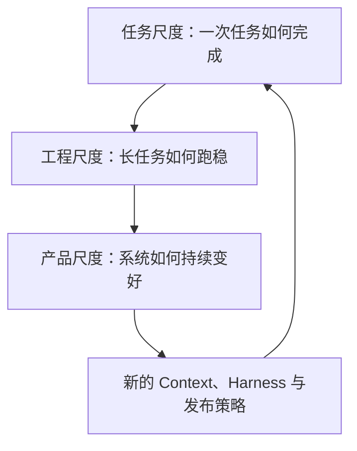
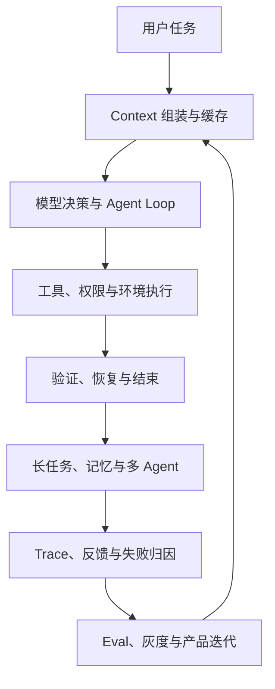
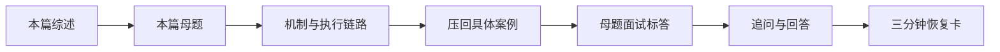

# 拆开 Claude Code：系列导读与三篇详细目录

> 版本说明：本系列依据 2026 年 8 月 2 日可访问的 Claude Code 官方文档与 Anthropic 工程文章撰写。源码只引用锁定版本的非官方还原快照作为实现旁证；社区教学项目用于解释设计模式，不代表 Anthropic 当前内部实现。

## 系列综述

学习 Claude Code 最容易走向两个极端：一种是停留在 `CLAUDE.md`、Skill、Hook、MCP 等功能名词上，知道很多，却无法解释一次任务如何真正运行；另一种是直接钻进源码和文档细节，投入很大，却难以形成面试时能够恢复的主线。

本系列不按功能菜单组织，而按 Agent 工程的三个尺度展开：一次任务如何执行，一个复杂工程如何持续推进，一套 Agent 产品如何评测和迭代。最终目标不是记住 Claude Code 的全部配置，而是能够回答三个问题：它为什么这样设计，真实执行链路是什么，这套机制如何迁移到新的 Agent 项目。

三篇文章共同采用同一个恢复脚本：

> 结论 → 执行链路 → 关键机制 → 收益与代价 → 实现证据 → 项目迁移

## 系列统一主线

Claude Code 的全部知识可以挂到一条闭环上：

第一篇关注从 A 到 E：一次编码任务如何从用户输入走到可验证结果。第二篇把视角扩展到 B、E、F：当 Context 不够、工具很多、任务跨会话时，系统如何保持进度。第三篇关注 G、H，并重新回到 B：生产失败如何改变评测集、Prompt、Harness 和发布策略。

系列以 EnergyOps 告警系统作为主要迁移案例。第一篇修复“同一统计小时被重复评估，产生重复告警”的问题；第二篇把任务扩展到规则、告警、通知、25 个 MCP 工具和跨 Context 开发；第三篇则把线上误报还原成 Trace，进入失败归因、Eval、灰度和回归闭环。Anthropic 的官方案例用于验证设计结论，不取代这条具体业务主线。

## 第一篇详细目录：Claude Code 如何完成一次真实编码任务

### 本篇综述

第一篇回答最基础也最重要的问题：用户按下回车后，Claude Code 到底经历了什么。文章不会把 Coding Agent 简化成“模型会调用工具”，而是完整拆开 Context 组装、模型决策、工具准入、环境执行、结果回填、验证和结束判定。

### 本篇母题

1. Claude Code 和普通 Chatbot 的本质区别是什么？
2. Model、Agent Harness 与 Environment 分别控制什么？
3. 用户提交任务后，Claude Code 经历了什么完整链路？
4. 为什么 Claude Code 强调 Gather → Act → Verify？

### 正文目录

1. **从 Chatbot 到 Coding Agent**：解释一次文本回答和一条环境执行轨迹的区别，建立 `Model × Harness × Environment` 的系统视角。
2. **任务进入系统后如何形成 Context**：说明 System Prompt、工具定义、项目指令、会话历史、环境状态和工具结果如何影响本轮判断。
3. **Gather 如何建立故障证据链**：从重复短信逆向追踪 Notification、Alarm、去重键、统计窗口和调度入口，说明为什么不能一上来改代码。
4. **Tool Call 如何真正落到环境**：拆开工具发现、Schema 校验、`PreToolUse`、权限判断、Sandbox、真实执行、`PostToolUse` 和结果回填。
5. **Verify 如何判断任务是否完成**：区分模型完成声明、测试通过、用户验收和外部副作用，建立可执行的结束条件。
6. **Session、Context、Checkpoint 与仓库状态**：说明不同状态保存什么、能够恢复什么，以及为什么 Resume 后仍要重新读取环境。
7. **完整案例复盘**：把所有机制压回 EnergyOps 重复告警修复，形成可复述的执行轨迹。
8. **母题标答与追问**：为四道题提供 60～90 秒标答、常见追问、边界回答和项目迁移。

## 第二篇详细目录：Claude Code 如何跑稳长任务与复杂工程

### 本篇综述

第二篇回答工程规模扩大后的问题：单轮 Context 放不下全部信息，工具越来越多，任务跨越多个会话，甚至需要多个 Agent 并行时，系统如何避免上下文膨胀、状态丢失和写入冲突。

### 本篇母题

1. Session、当前 Context、历史、Memory 和 Compaction 有什么区别？
2. Prefix Cache 缓存了什么，哪些变化会导致失效？
3. `CLAUDE.md`、Skill、Hook、Subagent、MCP 和 Plugin 如何分工？
4. 长任务和多 Agent 系统如何保持状态、隔离执行并持续验证？

### 正文目录

1. **Context Engineering 的真正目标**：不是尽可能多地塞入信息，而是在每次决策时提供最小、充分、可信的 Context。
2. **扩展机制如何分层**：根据规则是否常驻、是否强制、是否需要外部能力、是否需要独立 Context，选择 `CLAUDE.md`、Skill、Hook、Subagent、MCP 或 Plugin。
3. **Prefix Cache 如何降低成本和延迟**：解释缓存对象、稳定前缀、精确匹配、缓存失效和应监控的指标。
4. **Session、Compaction 与 Memory**：区分完整历史、当前工作记忆、语义压缩、跨会话知识和外部任务状态。
5. **工具数量增长后的渐进式加载**：以 EnergyOps 的 25 个工具为例，讨论 Tool Search、Schema 延迟加载、命名分组和 Artifact 引用。
6. **长任务如何跨 Context 推进**：使用目标与验收、任务清单、进度文件、Git 检查点和每轮最小闭环保存可恢复状态。
7. **Subagent、Team 与 Worktree**：根据任务独立性、Context 隔离需求和文件冲突决定是否并行。
8. **完整案例复盘**：把一次告警修复扩展成规则、告警、通知和 MCP 接入的跨模块任务。
9. **母题标答与追问**：回答缓存、压缩、扩展分层、长任务 Harness 和多 Agent 取舍。

## 第三篇详细目录：Claude Code 如何通过 Eval 与反馈持续变好

### 本篇综述

第三篇从单次任务和单个工程上升到产品质量：为什么离线 Eval 已经通过，用户仍可能觉得 Agent 变笨；为什么一次生产失败不能只修 Prompt，而应进入 Trace、归因、数据集、回归和发布闭环。

### 本篇母题

1. 生产失败如何从用户反馈进入 Eval Case？
2. Capability Eval、Regression Eval 和不同 Grader 如何组合？
3. 为什么离线 Eval 通过，生产环境仍可能明显退化？
4. 怎样在自主性、安全、效果、成本和延迟之间做工程权衡？

### 正文目录

1. **Agent 质量由什么共同决定**：建立 `Model × Prompt × Harness × Environment × Task Distribution` 的产品视角。
2. **从模糊反馈还原真实失败**：利用配置版本、Context、工具轨迹、权限、缓存、延迟、用户中断和最终环境状态完成归因。
3. **生产失败如何进入 Eval 数据集**：从 Trace 提炼最小复现，进行失败分类、Case 去重、难度分层和回归沉淀。
4. **Capability Eval 与 Regression Eval**：分别衡量新能力边界和已有能力防退化，避免只看一个总分。
5. **Grader 如何组合**：用单测、编译、规则评分检查客观结果，用 LLM Judge 判断指令遵循和过度设计，用人工评审校准未知问题。
6. **为什么 Agent Eval 容易测错**：讨论环境噪声、运行方差、超时、依赖差异、测试泄漏和长尾任务。
7. **从离线 Eval 到生产发布**：形成 Baseline/Challenger、Dogfooding、Shadow/A-B、灰度、监控和回滚阶梯。
8. **自主性与安全共同设计**：用风险分级、确定性策略、Sandbox、自动审批、凭据隔离和安全回归集控制爆炸半径。
9. **完整案例复盘**：把 EnergyOps 误报转化为 Trace、最小复现、Regression Case、修复和灰度验证。
10. **母题标答与追问**：回答生产回流、评测组合、线上线下差异和多目标权衡。

## 每篇文章的固定结构

三篇正文都采用相同顺序：

母题放在正文之前，用来建立阅读目标；正文负责真正理解，不在每节提前塞入完整答案；文末再将机制压缩成可直接口述的标答，并通过追问检查边界。流程图用于执行顺序、状态变化和系统关系；表格只用于确有必要的职责或概念对比。

## 证据边界

证据优先级固定为：当前官方文档与 Anthropic 工程文章，其次是官方 Changelog 和可观察行为，再次是锁定版本的还原源码，最后才是教学实现和社区文章。

因此，正文中的官方资料用于说明当前机制和设计动机；`claude-code-sourcemap` 只能证明 `2.1.88` 快照中存在过怎样的实现路径；`learn-claude-code` 用于展示最小 Harness；Claude Code Hub 和中文教程只承担覆盖检查与辅助解释。不同证据不会混写成“官方当前内部源码”。

