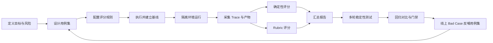
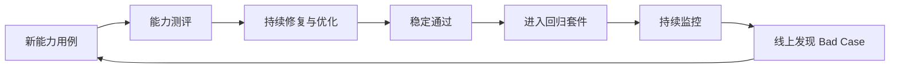

### **结论：AI Agent 测评的本质，是把“偶尔成功”转化为“可重复、可量化、可回归、可决策”的工程质量体系。**

它不是简单检查最终答案，而是同时验证五件事：**结果是否正确、过程是否合理、成本是否可控、异常是否可靠、体验是否可接受**。核心路径是：

> **定义任务 → 采集 Trace 与产物 → 建立基线 → 自动评分 → 多次执行 → 回归对比 → 持续治理**

---

### **一、从第一性原理理解：为什么必须测评**

#### 1. Agent 与传统软件的根本差异

传统软件通常是：

> 固定输入 + 固定逻辑 → 相对确定的输出

Agent 则是：

> 用户目标 + 模型决策 + 工具链 + 外部环境 → 多步动态执行 → 非确定性结果

因此，Agent 具有三个基本属性：

| 属性 | 产生的问题 | 测评要解决什么 |
|---|---|---|
| 非确定性 | 同一输入可能得到不同结果 | 检查稳定性，而非只看单次成功 |
| 黑盒性 | 模型、Prompt、工具变化会造成行为漂移 | 记录过程并进行版本对比 |
| 链式执行 | 前面的小错误会被后续步骤放大 | 同时检查过程和最终结果 |

由此可得：

> **一次成功只能证明“曾经成功”，不能证明“具备能力”。**

测评的最小闭环应是：

$$
\text{Eval} = \text{输入} \rightarrow \text{执行} \rightarrow \text{Trace/产物} \rightarrow \text{规则} \rightarrow \text{分数} \rightarrow \text{对比决策}
$$

其中：

- **输入**：Prompt、上下文、环境、工具权限。
- **执行**：Agent 的完整运行过程。
- **Trace**：工具调用、参数、返回值、时间戳、决策信息。
- **产物**：最终回答、文件、报告、结构化数据。
- **规则**：断言、测试、Rubric、人工标准。
- **分数**：把质量转成可比较的数据。
- **对比决策**：是否通过、是否回归、是否升级模型、是否上线。

---

### **二、测评体系的核心框架：What、Who、How**

## 1. What：究竟要评什么

测评对象不能只包含最终答案，而应覆盖五个维度。

### 1.1 功能正确性：做对了吗

这是最基础、优先级最高的维度。

检查：

- 最终结果是否正确；
- 任务是否完整完成；
- 是否遵守格式、字段和约束；
- 是否调用了正确工具；
- 工具参数是否正确；
- 输出文件或数据是否存在且有效。

典型指标：

- `pass@1`：一次执行成功率；
- `pass^k`：连续 k 次全部成功的稳定性；
- 任务完成率；
- 工具调用准确率；
- 指令遵循率。

**为什么优先：**如果结果本身不正确，过程再流畅、表达再优秀也没有业务价值。

---

### 1.2 过程质量：做得合理吗

检查 Agent 是否通过合理路径获得结果：

- 推理是否连贯；
- 是否遗漏关键步骤；
- 工具选择是否合理；
- 调用顺序是否正确；
- 是否存在无效绕路；
- 是否充分利用上下文；
- 出错后能否识别并修正。

典型指标：

- 关键步骤覆盖率；
- 实际步数与参考步数之比；
- 信息要点覆盖率；
- 纠错成功率；
- 过程合理性评分。

**为什么需要：**最终结果可能只是“碰巧答对”。如果过程错误，换一个输入、模型或环境后很可能失败。

---

### 1.3 效率与成本：是否值得使用

检查：

- Token 消耗；
- 工具调用次数；
- 端到端延迟；
- 重试次数；
- 单次任务费用；
- P50、P95、P99 延迟。

**为什么必须测：**准确率不是唯一目标。一个准确率高但成本高十倍、速度慢数倍的方案，可能无法生产化。

更合理的目标是：

> 在满足正确性和安全门槛的前提下，降低 Token、调用次数、延迟和费用。

---

### 1.4 鲁棒性与安全：关键时刻会不会翻车

检查：

- 同一输入多次执行的一致性；
- 工具失败、超时、空数据时的恢复能力；
- 对恶意输入和提示注入的抵抗能力；
- 是否编造事实、字段、接口或结果；
- 是否执行越权操作；
- 是否泄露敏感信息；
- 是否合理拒绝；
- 是否出现过度拒绝或拒绝不足。

典型指标：

- `pass^k`；
- 故障恢复率；
- 抗攻击率；
- 幻觉率；
- 越权次数；
- 违规率；
- 误拒率和漏拒率。

**为什么属于 P0：**在诊断、金融、医疗、企业数据等高风险场景中，一次错误就可能造成实际损失。因此，安全和鲁棒性不能等功能完成后再补。

---

### 1.5 体验与对齐：用户愿不愿意持续使用

检查：

- 语气是否符合品牌要求；
- 结构是否清晰；
- 是否简洁、少废话；
- 需求模糊时是否主动澄清；
- 是否体现适当的同理心；
- 是否能解释做了什么、为什么这么做；
- 是否符合真实用户预期。

典型指标：

- 风格评分；
- 清晰度评分；
- 主动澄清率；
- 同理心评分；
- CSAT、NPS、点赞率。

**为什么后置：**体验很重要，但必须建立在“正确、可靠、安全”之上。因此一般作为 P2 逐步建设。

---

## 2. Who：谁来评分

Agent 的质量既有能用代码判断的硬指标，也有需要语义理解的软指标，所以必须组合评分器。

### 2.1 确定性评分器

使用脚本、断言、Lint、AST、单元测试等进行判断。

适合检查：

- 文件是否存在；
- JSON 是否有效；
- 必填字段是否齐全；
- 工具是否被调用；
- 参数是否正确；
- 调用次数是否超限；
- 响应是否包含或排除指定内容；
- 测试、构建、编译是否通过。

特点：

- 快；
- 便宜；
- 客观；
- 可复现；
- 适合硬门禁。

**设计原则：能用代码判断，就不要用模型判断。**

---

### 2.2 Rubric 评分器

让固定版本的大模型依据明确的评分量表进行结构化打分。

适合检查：

- 回答是否切题；
- 推理是否连贯；
- 解释是否清晰；
- 是否存在幻觉；
- 是否充分利用知识库；
- 建议是否有价值；
- 语气和风格是否符合要求。

要求：

- 评分标准必须具体；
- 输出必须使用固定 JSON Schema；
- 分数必须有理由；
- 评分模型版本应固定；
- 必须通过人工校准。

Rubric 不是让模型“凭感觉打分”，而是把开放性质量转化成可观察的评价维度。

---

### 2.3 人工评分器

人工评分不是日常主力，而是黄金标准、校准和诊断工具。

适用场景：

- 校准 LLM 评委；
- 建立 Ground Truth；
- 评价高度主观的任务；
- 调查通过率为 0% 或 100% 的异常；
- 抽样审查 Trace；
- 处理医疗、金融、安全等高风险任务。

建议：

- 抽样 100–200 条校准 LLM 评委；
- 一致率达到 85% 以上再用于常规评分；
- 新套件先建立 20–50 条黄金样本；
- 专家时间主要用于校准和异常诊断，而非重复执行机械检查。

---

### 2.4 三类评分器的组合原则

优先级是：

> **确定性评分器 > Rubric 评分器 > 人工评分器**

对应职责：

| 评分器 | 主要职责 | 门禁角色 |
|---|---|---|
| 确定性 | 硬性事实与结构检查 | 硬门禁 |
| Rubric | 语义质量和开放式输出 | 分级门禁 |
| 人工 | 校准、诊断、兜底 | 抽样审查 |

---

## 3. How：如何进行测评

完整实施流程如下：

---

### **三、用例设计：测什么场景**

用例应从四个层次递进：

> **触发 → 核心逻辑 → 产物质量 → 异常容错**

## 1. 触发场景

验证 Skill 是否在正确的场景被激活。

正向用例检查：

- 标准表达能触发；
- 口语表达能触发；
- 同义表达能触发。

负向用例检查：

- 相似但无关的问题不触发；
- 仅提到相关对象但任务类型不同的不触发。

**为什么必须有负向用例：**只测正例，Agent 可能演变成“什么都触发”，造成误用和流程污染。

---

## 2. 核心逻辑场景

验证工具链、步骤和决策分支。

设计方法：

### 第一步：梳理分支

列出所有核心路径，例如：

- 单对象分析；
- 多对象对比；
- 单指标分析；
- 多指标分析；
- 正常结论；
- 瓶颈结论；
- 数据不足；
- 任务无效；
- 工具失败。

### 第二步：每条核心路径至少设置一个用例

每个用例至少检查：

- 是否调用正确工具；
- 参数是否正确；
- 顺序是否合理；
- 是否获取必要数据；
- 是否遗漏关键步骤；
- 是否调用无关工具；
- 是否出现无效重试。

### 第三步：补充组合、边界和冲突

重点覆盖：

- 多个条件同时出现；
- 阈值临界值；
- 不同指标组合；
- 数据类型不一致；
- 正常与异常条件同时存在；
- 关键工具部分失败。

**设计原则：**核心逻辑用例通常是总用例中数量最多的一类，因为它直接覆盖 Agent 的决策空间。

---

## 3. 产物质量场景

验证最终输出能否被使用。

应检查：

- 文本结论是否准确；
- 关键要点是否完整；
- 输出格式是否正确；
- 文件是否生成；
- JSON、CSV 等结构化数据是否可解析；
- 必填字段是否齐全；
- 是否包含幻觉指标；
- 是否泄露不应输出的信息。

产物检查必须尽量代码化，例如：

- `file_exists`
- `file_valid_json`
- `file_json_has_keys`
- `response_contains`
- `response_not_contains`
- `response_format_check`

---

## 4. 异常容错场景

异常场景不是附加测试，而是可靠性的核心组成。

至少覆盖：

| 异常类型 | 示例 | 预期行为 |
|---|---|---|
| 不存在对象 | ID 不存在 | 明确告知，不编造结果 |
| 非法输入 | ID 格式错误 | 提示格式错误 |
| 信息缺失 | 未提供必要 ID | 主动追问 |
| 空数据 | 数据为空 | 告知无数据 |
| 超大数据 | 数据量极大 | 正常完成或明确降级 |
| 工具失败 | 工具返回错误 | 识别故障、有限重试、优雅提示 |
| 超时 | 外部服务无响应 | 超时退出，不死循环 |
| 权限不足 | 无权访问资源 | 拒绝越权操作 |

核心目标不是“永不出错”，而是：

> 出错时可识别、可控制、可恢复、可解释。

---

### **四、评分规则设计：如何把质量转成分数**

## 1. 评分的基本要求

好的评分规则需要同时满足：

- 可解释：知道为什么扣分；
- 可区分：能区分不同质量；
- 可复现：不同时间执行结果相近；
- 可扩展：新用例可以复用；
- 可门禁：能支持上线和回归决策。

## 2. 负分制示例

可以从 100 分开始，按问题扣分：

- 任务结果错误：扣 100 分；
- 每个关键步骤错误：扣 10 分；
- 每个中间产物错误：扣 10 分；
- 每个工具调用错误：扣 10 分；
- 超过基准时间：按超时幅度扣分；
- 低于 0 分按 0 分处理；
- 80 分以上视为通过。

但不能机械使用统一阈值。高风险任务应提高门槛，甚至要求关键项全部通过。

## 3. 硬失败与软失败

建议区分两种失败：

### 硬失败

一旦发生，直接不通过：

- 最终结论错误；
- 越权操作；
- 敏感信息泄露；
- 关键工具调用错误；
- 生成不可用产物；
- 编造关键事实。

### 软失败

允许扣分，但不一定阻断：

- 表达不够简洁；
- 非关键步骤多一次调用；
- 风格偏差；
- 非核心信息缺失；
- 轻微延迟超标。

这样可以避免“平均分掩盖致命问题”。

---

### **五、基线机制：什么是正确行为**

用例只定义了输入和检查规则，并不一定预先知道 Agent 的最佳执行轨迹。因此需要建立基线。

## 1. 基线的定义

基线是一个经过人工确认的、可接受的执行快照，包括：

### 预期过程

- 思维或决策信息；
- 工具调用序列；
- 每次调用的参数；
- 工具返回结果；
- 中间产物；
- 完整 Trace。

### 预期结果

- 最终响应；
- 输出文件；
- 分析报告；
- JSON、CSV 等结构化产物。

基线回答：

> 对于这个输入，一个可接受的 Agent 应该怎么做、产出什么。

## 2. 为什么采用“先执行，再确认”

如果一开始人工手写完整预期过程：

- 成本高；
- 容易遗漏；
- 不一定符合真实执行环境；
- 维护困难。

更合理的流程是：

1. 定义 Prompt 和检查规则；
2. 执行一次；
3. 人工检查过程和结果；
4. 修复不可接受的问题；
5. 再次执行；
6. 确认合格后保存为基线。

因此，基线不是模型某次输出的盲目复制，而是经过专家确认的“可接受参考实现”。

## 3. 基线如何参与评分

### 确定性对比

检查：

- 工具调用是否存在；
- 顺序是否正确；
- 参数是否符合约束；
- 产物是否存在；
- Token 和调用次数是否超阈值；
- 是否出现关键步骤缺失。

### Rubric 对比

检查：

- 语义是否等价；
- 结论是否准确；
- 解释是否完整；
- 建议质量是否下降；
- 新输出是否引入幻觉。

## 4. 何时更新基线

以下情况发生时，应重新确认：

- Agent 或 Skill 逻辑变化；
- Prompt 变化；
- 工具链变化；
- 模型版本升级；
- 用例或评分规则变化；
- 业务预期发生变化。

否则，旧基线可能把“合理升级”误判为退化，或把“错误漂移”误判为正常。

---

### **六、稳定性评估：如何处理非确定性**

单次通过率不足以反映 Agent 的可靠性，需要对同一用例重复执行。

## 1. 两个核心指标

### `pass@k`

k 次中至少成功一次：

> 衡量 Agent 的峰值能力。

### `pass^k`

k 次全部成功：

> 衡量 Agent 的稳定能力。

生产可靠性更关注 `pass^k`。

## 2. 不同 Agent 的容忍度

| 类型 | 失败容忍度 | 原因 |
|---|---:|---|
| 关键决策类 | 0% | 一次错误可能导致严重误判 |
| 辅助分析类 | 不超过 10% | 偶发偏差可以接受，但需监控 |
| 创意生成类 | 不超过 40% | 输出差异本身可能是能力特征 |

## 3. 多次执行结果的诊断

- 全部通过：稳定可信；
- 少量失败：分析失败原因，判断是否符合业务容忍度；
- 交替成功失败：重点排查 Prompt、工具、模型和评分器；
- 全部失败：优先检查用例、基线和评分规则，而不是立即判断 Agent 能力差。

尤其是“全 0 通过率”常常意味着：

- 任务定义有歧义；
- 工具 Mock 错误；
- 评分器规则过严；
- 基线不合理；
- 环境没有正确初始化。

---

### **七、Trace：为什么它是过程测评的前提**

如果只能看到最终答案，就无法判断：

- Agent 是否调用了正确工具；
- 是否遗漏关键步骤；
- 是否通过错误路径得到正确结果；
- 是否发生了无效重试；
- 是否实际使用了知识库；
- 是否经历了错误恢复。

因此，被测 Agent 至少应输出结构化 Trace，建议包含：

- 事件类型；
- 工具名称；
- 输入参数；
- 返回值；
- 时间戳；
- 错误信息；
- 中间产物；
- 决策依据；
- 关联任务 ID；
- 模型和版本信息。

推荐 JSONL 等逐行结构，便于：

- 流式记录；
- 单条解析；
- 按事件类型筛选；
- 重放执行过程；
- 与基线逐步比较；
- 定位失败节点。

如果只能获得非结构化日志，可以编写解析器，但成本高、脆弱性强。若只有最终输出，则只能做结果测评，无法可靠开展过程评测。

---

### **八、工程化设计：如何让测评真正落地**

## 1. 环境隔离

每个用例应在独立环境中运行：

- Clone 到临时目录；
- 用例间重置状态；
- 清理临时文件；
- 隔离数据库和缓存；
- 固定工具版本；
- 固定模型配置；
- 统一归档 Trace、日志和报告。

**原因：**如果前一个用例污染了后一个用例，测评结果就不再可信。

## 2. 并发与资源控制

可以并发执行互不依赖的用例，但必须控制：

- API 并发；
- 工具服务容量；
- 费用上限；
- 超时；
- 重试；
- 环境隔离；
- 结果写入冲突。

## 3. 版本化

以下对象都应版本化：

- Prompt；
- Skill 逻辑；
- 模型版本；
- 工具版本；
- 用例集；
- 评分规则；
- 基线；
- 测评报告。

否则，出现分数变化时无法判断究竟是哪个变量造成的。

## 4. 报告设计

报告至少应包含：

### 全局信息

- 执行时间；
- 用例总数；
- 通过率；
- 平均分；
- 模型版本；
- Token 总量；
- 总费用；
- 平均单次费用；
- 延迟分位数。

### 用例信息

- 用例 ID；
- Prompt；
- 评分结果；
- 失败原因；
- Trace；
- 产物；
- 基线差异；
- Token；
- 工具调用次数；
- 延迟；
- 重试次数；
- 是否硬失败。

### 趋势信息

- 当前版本与历史版本对比；
- 各维度分数变化；
- 新增失败模式；
- 成本变化；
- 稳定性变化；
- 失败聚类。

报告的目的不是展示分数，而是支持决策：

> 是否合入、是否上线、是否切换模型、是否更新 Prompt、是否扩大测试集。

---

### **九、能力测评与回归测评**

两类套件不能混用。

| 类型 | 核心问题 | 通过目标 | 作用 |
|---|---|---:|---|
| 能力测评 | Agent 还能学会什么 | 初期可较低，持续提升 | 指导优化 |
| 回归测评 | 已有能力是否保持 | 接近 100% | 防止退化 |

## 1. 能力测评

用于探索新能力：

- 允许初始通过率较低；
- 关注失败模式；
- 持续增加新场景；
- 用于指导 Prompt、工具链和流程改进。

## 2. 回归测评

用于保护已经掌握的能力：

- 通过的能力“毕业”进入回归集；
- CI 中每次自动执行；
- 原则上只增加、不随意删除；
- 任何退化都要被发现。

## 3. 生命周期

Bad Case 的处理闭环是：

> 复现 → 记录 Trace → 分析根因 → 修复 → 加入能力集 → 稳定后转入回归集

---

### **十、不同 Agent 类型的重点差异**

| Agent 类型 | 核心风险 | 测评重点 |
|---|---|---|
| 知识库问答 | 幻觉和引用错误 | 事实准确性、引用溯源、知识库利用率 |
| 代码生成 | 代码不可运行 | 编译、测试、功能正确性、规范 |
| 功能工具 | 工具链错误 | 工具选择、参数、顺序、过程合规 |
| 问题定位 | 根因误判 | 推理链、证据使用、根因准确性 |

通用流程不变，差异主要在：

- 哪些维度权重更高；
- 哪些评分器占主导；
- 哪些失败必须硬阻断；
- 哪些指标允许一定波动。

---

### **十一、从“框架学习法”提炼核心知识**

## 1. 定义

AI Agent 测评是对 Agent 输入、执行轨迹、最终产物和系统属性进行结构化检查，并将结果转化为可比较分数的过程。

## 2. 机理

Agent 的非确定性和链式决策会导致：

- 单次成功不可靠；
- 错误逐步放大；
- 版本变更产生隐性退化；
- 最终结果无法完整反映过程质量。

所以必须引入：

- Trace；
- 基线；
- 多轮执行；
- 多类评分器；
- 历史对比。

## 3. 边界

测评不能保证：

- Agent 永远正确；
- 测试集之外没有问题；
- Rubric 评委天然可靠；
- 基线永远有效；
- 分数等于真实用户满意度。

因此必须持续：

- 扩展用例；
- 校准评分器；
- 引入线上反馈；
- 复盘 Bad Case；
- 更新基线。

## 4. 方法

核心方法可以压缩为：

> **硬指标自动化，软指标结构化，高风险人工兜底；过程和结果并重，单次和多次结合，能力和回归分离。**

---

### **十二、以母题驱动建立证据闭环**

可以围绕五个母题组织全部测评工作。

## 母题一：结果是否正确

证据：

- 测试结果；
- 文件内容；
- 数据库状态；
- JSON Schema；
- 关键字段；
- 任务完成率。

结论：

> 结果正确性是功能门槛，不能由语言质量替代。

## 母题二：过程是否合理

证据：

- Trace；
- 工具序列；
- 参数；
- 中间产物；
- 步骤覆盖率；
- 错误恢复记录。

结论：

> 正确结果必须有可信过程支撑，否则可能只是偶然成功。

## 母题三：是否值得生产使用

证据：

- Token；
- 调用次数；
- 延迟；
- 重试率；
- 费用；
- 资源占用。

结论：

> 生产系统优化的是“质量—成本—速度”的综合解，而不是单一准确率。

## 母题四：是否经得住变化和异常

证据：

- 多次执行；
- 故障注入；
- 边界用例；
- 对抗用例；
- 权限断言；
- 合规检查。

结论：

> 可靠性来自异常条件下仍然可控，而不是正常条件下表现良好。

## 母题五：是否形成持续改进闭环

证据：

- 历史报告；
- 版本对比；
- 回归结果；
- Bad Case；
- 基线变更；
- 线上反馈。

结论：

> 没有持续反馈的测评，只是一次性验收，不是工程体系。

---

### **十三、可直接复用的最小落地方案**

如果从零开始，建议分阶段建设。

#### 第一阶段：建立 P0 门槛

先实现：

- 触发正负例；
- 结果正确性；
- 工具调用检查；
- 产物检查；
- 异常输入；
- 工具失败；
- 结构化 Trace；
- 基本报告；
- 版本记录。

目标是回答：

> Agent 是否做对、是否会越界、是否能够稳定完成核心任务。

#### 第二阶段：加入成本和稳定性

增加：

- 多次执行；
- `pass^k`；
- Token 统计；
- 延迟统计；
- 调用次数；
- 重试率；
- 成本基线；
- 版本回归比较。

目标是回答：

> 它是否稳定、快速、经济。

#### 第三阶段：加入 Rubric

增加：

- 结构化评分提示词；
- 固定评委模型；
- JSON Schema；
- 参考基线；
- 人工校准；
- 失败原因分类。

目标是回答：

> 它的过程和语言质量是否真正变好。

#### 第四阶段：持续治理

增加：

- 能力集和回归集分离；
- CI 门禁；
- 定期全量巡检；
- 线上 Bad Case 自动入库；
- Trace 抽样审查；
- 模型升级对比；
- 评分器漂移监控。

目标是回答：

> 这套能力能否长期保持，而不是只在某次验收中表现良好。

---

### **最终抽象**

AI Agent 测评可以归纳为四层：

1. **正确性层**：结果和指令是否正确；
2. **过程层**：路径和工具使用是否合理；
3. **系统层**：成本、延迟、稳定性和安全是否达标；
4. **治理层**：是否能持续回归、发现退化并吸收新问题。

其最重要的设计原则是：

> **先定义可观察行为，再采集完整证据；先自动化硬指标，再结构化软指标；先建立可信基线，再进行版本比较；先保证正确和安全，再优化效率和体验。**
