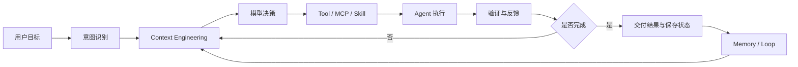
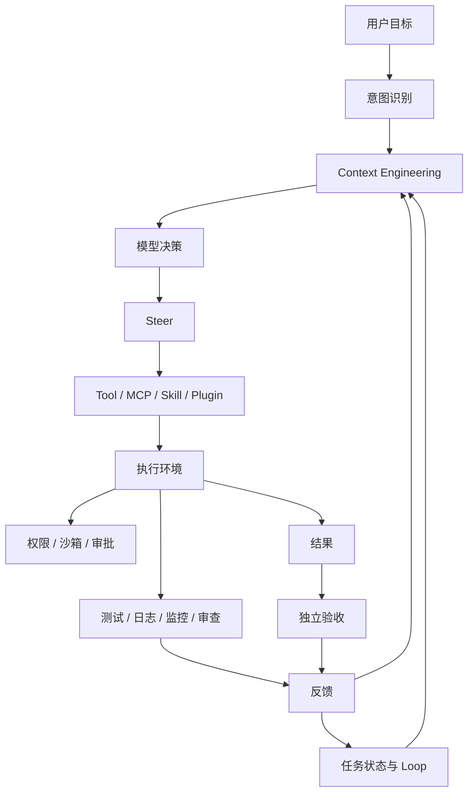

### **结论：WorkBuddy 的核心不是“让模型更聪明”，而是用 Context、Harness 和 Loop 把无状态、会犯错的模型，改造成能够稳定完成复杂任务的产品。**

其完整逻辑可以概括为：

> **模型提供理解与生成能力；Context 决定模型此刻看到什么；Harness 决定模型如何行动、受到什么约束以及如何纠错；Loop 决定任务如何跨步骤、跨会话持续推进。**



---

### **一、问题本质：为什么“更强模型 + 更长提示词”仍然不够**

#### **1. 模型本质上是无状态函数**

从产品角度，可以把一次模型调用抽象为：

$$
输出 = 模型（系统提示词 + 工具 + 会话历史 + 其他上下文 + 用户指令）
$$

模型具有三项基本限制：

| 限制 | 直接后果 | 产品补偿机制 |
|---|---|---|
| 无状态 | 不会自动记住上一次调用 | 会话历史、Memory、数据库、任务状态 |
| 知识有截止时间 | 不知道训练后发生的事实 | 搜索、数据库、实时 API、MCP |
| 只能生成文本或结构化请求 | 不会自动读文件、改数据、执行命令 | Tool、Function Call、执行环境 |

因此，Agent 的可靠性不是模型单变量问题，而是一个系统问题：

> **Agent = Model + Context + Tools + Execution Environment + Verification + State**

#### **2. 模型只是“提出下一步”，不是实际执行者**

模型可以生成：

```text
调用 create_issue，参数为……
```

但真正拥有权限、调用 API、修改文件和提交数据的是 Agent 执行层。

因此必须把以下能力放在模型外部：

- 参数校验；
- 权限检查；
- 审批；
- 沙箱隔离；
- 操作审计；
- 失败重试；
- 结果验证；
- 回滚。

**原因：**如果把安全和执行完全交给模型，模型的概率性输出就会直接转化为不可控的现实动作。

---

## **二、基础能力的分层：Tool、MCP、Skill、Plugin**

这些概念不是同义词，而是解决不同层次的问题。

| 概念 | 定义 | 解决的问题 | 驱动者 |
|---|---|---|---|
| Function Call / Tool | 模型请求执行一个动作 | 模型如何调用能力 | 模型 |
| MCP | 外部系统接入 Agent 的标准协议 | 外部能力如何统一接入 | Agent / Server |
| Skill | 一类任务的标准工作流程 | 任务应该如何完成 | Agent |
| Plugin | 一组能力的安装与分发包 | 能力如何组合、部署和复用 | 用户 / 团队 / 产品 |

### **1. Tool：完成一个动作**

#### What

Tool 是一个具有名称、描述和参数 Schema 的可调用函数。

#### How

完整过程是：

1. 产品向模型提供工具定义；
2. 模型生成结构化调用请求；
3. Agent 校验参数和权限；
4. Agent 执行 API、脚本或本地函数；
5. 工具结果回到上下文；
6. 模型决定回答、修正或继续调用。

#### Why

模型只负责“提出动作”，Agent 负责“执行动作”。这种分离便于：

- 控制权限；
- 拦截危险参数；
- 统一错误处理；
- 记录审计日志；
- 替换底层实现。

#### 边界

Tool 只描述**一个动作**，不适合承载完整工作流。

例如：

- `read_file`：适合做 Tool；
- “读取规则、修改代码、运行测试、生成 PR”：不应压缩成一个模糊 Tool，应由 Skill 编排多个 Tool。

---

### **2. MCP：解决外部系统接入问题**

#### What

MCP 是 Agent 与外部数据源、工具和提示模板之间的标准连接协议。

MCP Server 通常提供三类原语：

| 原语 | 内容 | 谁决定使用 | 典型用途 |
|---|---|---|---|
| Resources | 可读取的只读资源 | Agent 或用户 | 文件、记录、实时数据 |
| Tools | 可执行动作 | 模型 | 查询、创建、修改 |
| Prompts | 可复用提示模板 | 用户 | 斜杠命令、固定任务模板 |

#### Why

如果每个外部系统都单独适配认证、接口和返回格式，Agent 产品会形成大量专用集成，维护成本高、复用性差。

MCP 的价值是：

- 统一连接方式；
- 隔离外部系统差异；
- 降低接入成本；
- 复用认证与调用机制；
- 让外部能力可发现、可组合。

#### How

MCP 的运行结构是：

```text
Agent 产品
   ↓
MCP Client
   ↓
MCP Server
   ↓
REST / SDK / 数据库 / 内部服务
```

#### 设计原则

不要照搬底层 API，而要按照用户意图设计 Agent 能理解的能力。

底层可能有：

```text
创建 Issue
添加描述
添加标签
上传附件
```

Agent 更适合看到：

```text
create_issue(
  title,
  description,
  labels,
  attachments
)
```

**核心原则：**

> MCP 暴露的是“用户目标级能力”，而不是“底层接口集合”。

---

### **3. Skill：解决复杂任务的执行方法**

#### What

Skill 是对某类任务的可复用工作方法，通常包括：

- 适用场景；
- 执行步骤；
- 所需工具；
- 使用规则；
- 判断标准；
- 失败分支；
- 验收条件；
- 脚本和命令。

#### Why

复杂任务不是一次工具调用，而是多个动作和判断的组合。

例如创建 PR 通常需要：

1. 读取仓库规则；
2. 检查当前分支；
3. 理解代码；
4. 修改文件；
5. 运行测试；
6. 处理失败；
7. 生成变更说明；
8. 创建 PR；
9. 保存结果。

如果只提供工具，模型仍需要临时规划全部流程，容易：

- 漏步骤；
- 顺序错误；
- 忽略失败分支；
- 过早结束；
- 不符合团队规范。

Skill 把经过验证的方法沉淀下来。

#### 边界

> **Tool 负责“做一个动作”；Skill 负责“完成一类任务”。**

Skill 不是长期记忆。经验证的工作方法应当进入 Skill，而不是自动写入用户 Memory，因为 Skill 可以：

- 版本化；
- 评审；
- 测试；
- 回滚；
- 按需加载；
- 按项目或团队生效。

---

### **4. Plugin：解决能力组合与分发**

#### What

Plugin 是产品层面的能力安装包，可以组合：

- MCP；
- Skills；
- Rules；
- Hooks；
- 模板；
- 权限配置。

#### Why

真实能力通常不是一个 Tool 或一个 Skill，而是完整工作体系。

例如团队研发插件可能包含：

```text
代码仓库 MCP
Issue MCP
流水线 MCP
提 PR Skill
查构建 Skill
代码规范 Rules
提交前 Hook
命令执行审批
```

#### 边界

MCP 是跨产品协议；Plugin 是产品层打包方式。二者不能互相替代。

---

## **三、能力形态如何选择**

选择接入形态时，应同时考虑：

- 能力边界；
- 更新频率；
- 权限风险；
- 上下文成本；
- 执行延迟；
- 跨产品复用价值。

| 需求 | 优先形态 | 原因 |
|---|---|---|
| 读文件、执行命令等稳定底层能力 | 内置 Tool | 延迟低，权限和界面可深度集成 |
| 文档、知识库、网盘等外部系统 | MCP / Skill / Plugin | 便于统一接入和维护 |
| 团队高频固定流程 | Skill | 可沉淀步骤、标准和失败处理 |
| 连接、流程、规则、Hook 的组合 | Plugin | 便于安装和分发 |

---

# **四、一次完整任务的系统运行机制**

以“调研多个对象并输出带引用的大纲”为例，完整流程不是简单地“搜索—总结”，而是：

```text
用户目标
→ 意图识别
→ 检查 Workspace
→ 读取规则和 Memory
→ 加载相关 Skill
→ 连接内部数据源
→ 拆分子任务
→ Sub-agent 并行调研
→ 汇总证据
→ 识别冲突和缺口
→ 补充调研
→ 生成结构化结果
→ 保存文件与任务状态
→ 验证交付结果
```

### **1. 先检查 Workspace**

#### Why

避免：

- 重复调研；
- 忽略已有结论；
- 使用错误模板；
- 把文件保存到错误位置；
- 违反项目约定。

Workspace 是 Agent 的项目级外部记忆和工作环境。

### **2. 读取相关 Memory**

Memory 用来提供：

- 用户表达偏好；
- 用户知识背景；
- 项目历史；
- 当前进度；
- 已有决策；
- 未完成事项。

但 Memory 不应替代事实验证，也不应作为绝对正确的系统指令。

### **3. 加载 Skill 和规则**

“调研”不是普通问答，而是一类任务。调研 Skill 可以规定：

- 优先查一手资料；
- 为结论记录证据；
- 区分原作者观点和自己的推论；
- 标注信息适用范围；
- 检查引用完整性。

### **4. 使用 Sub-agent 隔离并行任务**

将不同对象交给不同 Sub-agent，可实现：

- 并行处理；
- 降低主上下文压力；
- 减少不同主题之间的干扰；
- 统一输出格式；
- 方便主 Agent 汇总。

关键不是“多 Agent 越多越好”，而是：

> 只把子任务所需的上下文提供给子 Agent，只把结论、证据和未解决问题带回主线。

### **5. 主 Agent 负责整合而非盲目拼接**

主 Agent 应执行：

- 去重；
- 归类；
- 发现冲突；
- 补齐缺口；
- 区分事实与推论；
- 统一评价框架；
- 检查引用与适用边界。

---

# **五、Context Engineering：管理模型此刻应该看到什么**

## **1. 定义**

Context Engineering 是：

> 在模型每次决策前，设计哪些信息进入上下文、以什么形式进入、放在什么位置、何时更新或移除，从而提高下一步决策正确率。

它不是简单地“提供更多信息”，而是优化：

- 相关性；
- 准确性；
- 时效性；
- 顺序；
- 信息密度；
- 成本；
- 可验证性。

## **2. 五类基本动作**

| 动作 | 含义 | 解决的问题 |
|---|---|---|
| Write | 显式写入目标、规则、环境和状态 | 防止模型靠猜 |
| Select | 从已有候选信息中筛选当前所需内容 | 减少无关信息 |
| Retrieve | 从历史、资料库、工具目录按需取回 | 获取当前缺失信息 |
| Compress | 外置长内容，只保留结论和证据位置 | 控制上下文长度 |
| Isolate | 用独立会话或 Sub-agent 处理旁支任务 | 防止主上下文污染 |

### **Write：显式写入**

应写入模型无法自行可靠推断的信息，例如：

- 操作系统；
- Shell；
- 当前时间与时区；
- 当前目录；
- 当前打开文件；
- 项目规则；
- 用户语言；
- 已完成步骤；
- 未完成任务；
- 已连接工具。

**改进原因：**隐含信息如果不写入，模型会自行假设；错误假设往往比信息缺失更危险。

### **Select：只放当前需要的信息**

上下文窗口大，不代表应该全部放入。

无关信息会：

- 增加成本；
- 稀释重点；
- 降低工具选择准确率；
- 增大冲突概率；
- 影响模型对任务边界的判断。

### **Retrieve：需要时再取**

不要提前注入所有历史和资料，而应根据当前任务检索：

- 相关会话；
- 项目文档；
- 工具定义；
- 记忆卡片；
- 原始证据。

### **Compress：压缩但不丢证据**

长结果可：

- 保存到文件；
- 保留核心结论；
- 保留来源；
- 保留行号、链接或证据位置；
- 记录未读取部分；
- 提供继续读取方法。

压缩不是简单截断，而是：

> **减少正文长度，同时保留可追溯性和继续访问能力。**

### **Isolate：隔离旁支任务**

适合隔离的内容包括：

- 大规模资料检索；
- 独立代码分析；
- 多对象并行调研；
- 低相关性的探索；
- 需要大量工具结果的工作。

---

# **六、Prompt Cache 与渐进式加载**

## **1. Prompt Cache 的基本机理**

多轮对话通常会重复发送前缀。模型供应商可以缓存已经计算过的前缀，只计算新增内容。

因此，WorkBuddy 的上下文组织应遵循：

- System Prompt 放前面；
- 基础工具定义放前面；
- 长期规则保持稳定；
- 对话历史采用追加，不修改旧消息；
- 动态文件、时间、任务进度和工具结果放后面；
- 工具和 Skill 按需加载；
- 仅在必要时压缩或纠正前缀。

### **为什么这样设计**

缓存依赖前缀稳定。如果频繁重排或修改前面的内容，会导致：

- 缓存命中率下降；
- 计算成本上升；
- 延迟增加；
- 多轮行为不稳定。

## **2. 渐进式加载**

当工具和 Skill 数量增加时，将全部定义一次性放入上下文会造成：

- 上下文膨胀；
- 工具语义重叠；
- 模型选择困难；
- 工具误调用；
- 成本和延迟上升。

因此采用三阶段：

```text
名称和简介
→ 判断是否相关
→ 加载完整定义、参考资料和脚本
```

工具结果也应采用：

- 分页；
- 截断；
- 写入文件；
- 提供继续读取方法；
- 明确总量和未展示范围。

错误返回不能只有：

```text
error
```

更好的错误结果应包含：

- 失败原因；
- 可修正参数；
- 是否可重试；
- 建议下一步；
- 需要用户确认的事项。

---

# **七、Memory：让正确的过去在正确的时候出现**

## **1. Memory 的真正目标**

Memory 不是“让 AI 越用越像人”，而是：

> 减少用户重复交代背景，并让相关历史在合适的任务中继续生效。

模型本身没有长期记忆，Memory 由产品在模型外部维护，再按需注入。

## **2. 三种相关状态**

| 类型 | 作用 |
|---|---|
| 聊天历史 | 记录过去发生过什么，可作为检索源 |
| Workspace 工作记忆 | 保存项目进度、决策和当前状态 |
| 长期 Memory | 在新请求前默认提供，影响理解和表达 |

## **3. 五类长期记忆**

| 类型 | 作用 | 示例 |
|---|---|---|
| 稳定事实 | 提供长期推理前提 | 所在城市、常用工作语言 |
| 知识背景 | 调整解释深度 | 熟悉某技术领域 |
| 行为信号 | 反映稳定使用模式 | 通常先查看工作区 |
| 表达偏好 | 控制表达方式 | 先给结论、减少空话 |
| 会话延续 | 维持当前目标和进度 | 已完成步骤、下一步计划 |

### **关键边界**

- 事实影响“判断前提”；
- 知识背景影响“解释深度”；
- 表达偏好影响“怎么说”；
- 行为信号只能谨慎使用；
- 会话延续影响“接着做什么”。

Memory 不应改变已验证的事实结论，也不应无条件决定执行流程。

---

## **4. 为什么不把 Procedural Memory 自动放入长期记忆**

程序性记忆记录的是“怎么做事”，例如：

```text
遇到所有调试任务，先重启服务，再查日志。
```

它不应被自动提升为长期规则，原因包括：

1. **局部经验可能被误认为通用策略**；
2. **可能干扰模型根据当前证据规划路径**；
3. **实质上接近动态 System Prompt，却没有版本和评测机制**；
4. **可能形成错误的固定流程，降低泛化能力**；
5. **缺乏回滚、审批和可解释性**。

因此应当区分：

```text
用户事实和历史状态 → Memory
经过验证的工作方法 → Skill
```

---

## **5. Memory 的作用域**

作用域越大，影响越强，写入门槛也应越高。

| 作用域 | 典型内容 | 生命周期 |
|---|---|---|
| 当前轮 | 当前选中的代码、文件 | 本轮 |
| 会话 / Thread | 工具调用和任务进度 | 当前任务 |
| 项目 / Workspace | 架构约定、项目决策 | 项目周期 |
| 用户级 | 长期偏好、职业背景 | 长期 |
| 团队 / 组织级 | 团队流程、术语和边界 | 组织范围 |

## **6. Memory 的注入流程**

```text
冷启动：注入少量高置信摘要
→ 理解任务：检索相关候选记忆
→ 执行任务：需要证据时回查原始内容
→ 任务结束：提取候选记忆
→ 去重、冲突检查、作用域判断
→ 用户可查看、纠正、删除或回滚
```

成熟 Memory 系统必须支持：

- 来源查看；
- 用户纠正；
- 冲突替换；
- 时间衰减；
- 降权；
- 删除；
- 回滚；
- 临时停用。

核心目标是：

> **正确的过去，在正确的时间，以正确的范围和方式重新出现。**

---

# **八、Harness Engineering：让 Agent 可控地行动**

## **1. 定义**

Harness 是围绕模型构建的运行与控制系统。它不负责替代模型，而是负责：

- 提供执行环境；
- 引导行动方向；
- 约束危险行为；
- 组织工具和状态；
- 反馈执行结果；
- 触发验证和纠正。

可以概括为：

> **Harness = Steer + Constrain + Integrate**

## **2. 三类核心能力**

### **Steer：驾驭**

控制：

- 执行方向；
- 执行顺序；
- 执行速度；
- 停止时机。

主要机制：

- System Prompt；
- 项目规则；
- Skill；
- Task / Todo；
- 错误修正提示；
- 模型适配；
- 任务拆分。

### **Constrain：约束**

防止 Agent 超出安全边界：

- 权限控制；
- Sandbox；
- Approval Gate；
- Allowlist / Denylist；
- 参数校验；
- 测试验证；
- 回滚；
- 审计日志。

### **Integrate：整合**

让能力和状态协同工作：

- Tools；
- MCP；
- Browser；
- Filesystem；
- Memory；
- Logs；
- Sub-agent；
- Hooks；
- CI；
- 定时任务；
- Connectors。

### **三者不能互相替代**

- 只有引导，没有约束：可能执行危险动作；
- 只有约束，没有反馈：出错后无法修正；
- 工具很多，没有编排：复杂任务无法稳定完成。

---

# **九、业界实践揭示的共同规律**

## **1. OpenAI：把代码环境变成 Agent 的可操作系统**

主要做法：

- 允许 Agent 操作浏览器；
- 读取 DOM、日志和监控指标；
- 使用 linter 和结构测试；
- 用目录级规则文件提供入口；
- 将详细知识放入文档，按需查询；
- 用后台任务扫描代码漂移并创建重构 PR。

### **改进原因**

模型不应只“生成代码”，而应拥有：

- 观察环境的能力；
- 修改代码的能力；
- 检查质量的能力；
- 持续发现问题的能力。

### **边界**

这套 Harness 对代码结构和可维护性较强，但业务功能是否正确，还需要独立的需求验收和端到端验证。

---

## **2. Anthropic：用任务拆分和跨会话交接解决长任务**

### 第一阶段：初始化 Agent + Coding Agent

解决两个问题：

- 一次承担过多工作，导致上下文耗尽；
- 看到局部成果后过早判定完成。

主要方法：

- 将需求拆成大量具体行为描述；
- 用 JSON 保存功能清单；
- 每项标记 Pass / Fail；
- 不允许删除条目或降低标准；
- 一次只处理一项任务；
- 使用统一启动脚本；
- 用浏览器自动化验证；
- 用进度文件和 Git 历史交接、恢复和回滚。

### 第二阶段：Planner + Generator + Evaluator

进一步解决：

- 接近上下文上限时质量下降；
- Agent 自我评价不可靠；
- 前端和体验类结果难以靠单元测试验证。

角色分工：

| 角色 | 责任 |
|---|---|
| Planner | 把需求展开成完整规格 |
| Generator | 分阶段实现、提交和自检 |
| Evaluator | 独立运行、操作、验收并反馈缺陷 |

### 核心原则

> **执行者和验收者必须尽可能分离。**

因为 Agent 自己评价自己时，容易把“已经做了一部分”误判成“已经完成”。

---

## **3. LangChain：Agent 是 Model + Harness**

LangChain 的核心观点是：

- Agent 需要持久状态；
- Agent 应该拥有一台可操作的计算机；
- 代码必须能够安全执行；
- Agent 必须能自我验证；
- 需要 Compaction 应对上下文衰减；
- 需要 Tool Call Offloading 减少上下文负担；
- 需要 Skill 渐进式加载；
- 可以用 Ralph Loop 防止 Agent 过早结束。

### 重要推论

评估对象不能只有模型：

> **真正应该评估的是 Model + Harness 的组合。**

同一个模型如果更换：

- 工具名称；
- Patch 格式；
- 错误返回；
- 压缩策略；
- 上下文布局；
- 验证机制；

最终表现可能显著不同。

---

# **十、WorkBuddy 的五层 Harness**

## **1. 运行环境层**

Agent 在哪里执行：

- 文件系统；
- Shell / Bash；
- Sandbox；
- Browser；
- MCP / Connector；
- 权限边界；
- Approval Gate；
- Allowlist / Denylist。

这是基础层。没有稳定环境，上层的提示词、规则和验证都难以生效。

## **2. 引导层：行动前提供什么**

需要提供：

- 项目概况；
- 目录结构；
- 关键依赖；
- 操作系统和 Shell；
- 时间、时区和语言；
- 已安装 Skill；
- 已连接 Connector；
- 规则和编码风格；
- 工具使用规范；
- 当前任务和目标；
- 文件读取与修改要求。

### 关键规则示例

- 修改前先读取文件；
- 路径不明确先搜索；
- 独立搜索和读取任务可以并行；
- 长任务先拆 Todo；
- 修改后运行测试；
- 不确定时不要猜。

## **3. 反馈层：行动后如何纠错**

反馈应包括：

- 完整错误信息；
- stderr；
- 文件未找到时的搜索方向；
- 编辑失败时要求重新读取；
- 权限不足时提示申请确认；
- 可重试参数；
- 是否允许自动重试；
- 下一步建议。

### 时间戳校验

修改文件前，比较：

```text
上次读取时间
vs.
文件最后修改时间
```

如果文件在读取后被用户改过，应拒绝覆盖并要求重新读取。

### 为什么重要

Agent 可能基于过时状态修改文件。时间戳校验可以避免：

- 覆盖用户最新修改；
- 使用旧代码作判断；
- 将并发编辑误认为不存在；
- 产生难以恢复的文件损坏。

## **4. 编排层**

编排负责决定：

- 哪个 Agent 执行；
- 哪个 Tool 先调用；
- 哪些任务并行；
- 哪些任务必须串行；
- 何时触发验证；
- 如何处理失败；
- 何时暂停并请求审批；
- 如何保存和恢复状态。

复杂任务不能只依靠模型临时决定全部流程，需要系统级编排。

## **5. 可观测与治理层**

必须记录：

- 调用了什么工具；
- 使用了什么参数；
- 修改了什么文件；
- 谁批准了高风险动作；
- 哪一步失败；
- 如何重试；
- 最终结果是什么；
- 是否通过验证。

这使系统具备：

- 审计；
- 回放；
- 调试；
- 责任追踪；
- 质量评估；
- 失败归因；
- 版本比较。

---

# **十一、前馈与反馈：Harness 的控制论基础**

## **1. 前馈 Feedforward**

前馈发生在 Agent 行动之前，提供：

- 目标；
- 规则；
- 环境；
- 工具；
- 权限；
- 任务状态；
- 验收标准。

作用是提高“一次做对”的概率。

## **2. 反馈 Feedback**

反馈发生在 Agent 行动之后，观察：

- 执行结果；
- 错误；
- 测试；
- 构建；
- 日志；
- 运行时指标；
- 用户纠正；
- 审查意见。

作用是让 Agent 自动发现并纠正常见问题。

## **3. 计算型反馈与推断型反馈**

| 类型 | 示例 | 优点 | 局限 |
|---|---|---|---|
| 计算型 | Linter、类型检查、单测、构建 | 快、便宜、稳定、可重复 | 难判断复杂语义 |
| 推断型 | Review Agent、架构审查、AI Judge | 能判断意图和体验 | 慢、贵、不确定 |

### 使用原则

> 能用确定性程序判断的问题，优先交给程序；必须做语义判断的问题，再使用审查 Agent。

## **4. 反馈时机分层**

```text
编辑后：快速语法和格式检查
提交前：类型、单测、结构检查
集成前后：架构审查、端到端验证
运行期间：日志、错误率、延迟、SLO
周期任务：依赖风险、死代码、代码漂移
```

这种设计把低成本反馈前移，把高成本反馈放在更适合的阶段。

---

# **十二、Loop Engineering：把一次任务变成持续系统**

## **1. 为什么需要 Loop**

复杂任务往往：

- 无法一次完成；
- 需要多轮工具调用；
- 可能跨会话；
- 需要等待外部事件；
- 需要持续验证；
- 需要周期性维护。

因此，Agent 不应只追求“这一轮回答结束”，而要能持续推进目标。

## **2. 基本循环**

```text
观察状态
→ 判断下一步
→ 执行动作
→ 获取反馈
→ 更新任务状态
→ 再次判断
```

## **3. 长任务的关键机制**

- 显式任务清单；
- 进度文件；
- Git 历史；
- 可恢复启动脚本；
- 失败重试；
- 验证状态；
- 回滚点；
- 停止条件；
- 未解决问题清单。

## **4. 防止过早结束**

可以设置：

- 完成条件；
- 验收清单；
- 独立 Evaluator；
- Hook 拦截提前结束；
- 未通过验证不得标记完成；
- 在新上下文中重新注入目标继续执行。

### 关键原则

> “模型说完成”不等于“任务已完成”；完成必须由可验证条件定义。

---

# **十三、从第一性原理推导出的完整设计方法**

## **Step 1：先定义最终结果，而不是先选模型**

明确：

- 用户真正想得到什么；
- 什么叫完成；
- 什么错误不能接受；
- 哪些动作需要审批；
- 哪些结果必须可追溯；
- 是否需要跨会话继续。

## **Step 2：拆分模型能力与系统能力**

模型负责：

- 理解自然语言；
- 生成计划；
- 选择工具；
- 进行推理；
- 解释结果。

系统负责：

- 保存状态；
- 提供工具；
- 执行动作；
- 控制权限；
- 验证结果；
- 记录审计；
- 处理回滚。

## **Step 3：按用户意图设计工具**

不要从已有 API 出发，而要从任务出发：

```text
用户目标
→ 需要哪些动作
→ 哪些动作应该组合
→ 哪些参数必须校验
→ 哪些动作需要审批
```

## **Step 4：将重复流程沉淀为 Skill**

如果某类任务频繁出现，并且有稳定步骤，就将其整理为：

- 适用场景；
- 输入要求；
- 执行步骤；
- 工具组合；
- 失败处理；
- 验收标准；
- 输出格式。

## **Step 5：按需组织 Context**

每次决策前只注入：

- 当前目标；
- 相关规则；
- 当前环境；
- 必要工具；
- 相关记忆；
- 当前进度；
- 必需证据。

## **Step 6：把危险行为交给外部控制**

任何涉及以下动作，都不应只依赖 Prompt：

- 删除；
- 发送；
- 支付；
- 发布；
- 修改生产数据；
- 执行未知命令；
- 访问敏感资源。

应配置：

- 权限；
- 审批；
- 沙箱；
- Allowlist；
- 审计；
- 回滚。

## **Step 7：先确定性验证，再语义验证**

优先顺序：

```text
格式 / 语法
→ 类型 / 单元测试
→ 构建 / 集成测试
→ 端到端测试
→ 架构 / 体验 / 需求审查
```

## **Step 8：将任务状态外置**

不要把任务进度只留在对话上下文中，应保存：

- Todo；
- 进度；
- 决策；
- 证据；
- 失败记录；
- 未解决问题；
- 验收状态。

## **Step 9：把经验变成可治理资产**

稳定经验应进入：

- Skill；
- Rule；
- Plugin；
- 测试；
- 评估集；
- 审计规则。

而不是未经验证地自动变成长期 Memory。

---

# **十四、母题驱动的证据闭环**

可以用五个母题理解全文。

## **母题一：模型为什么需要外部系统**

### 观点

模型无状态、知识有截止时间、不能直接执行现实动作。

### 证据链

```text
无状态
→ 需要会话、Memory、Workspace
知识过时
→ 需要搜索、数据库、MCP
不能行动
→ 需要 Tool 和执行环境
```

### 结论

Agent 不是单独的模型，而是模型与外部系统的组合。

---

## **母题二：信息越多为什么不一定越好**

### 观点

上下文的价值取决于相关性，而不是长度。

### 证据链

```text
工具和历史增加
→ 上下文膨胀
→ 重点被稀释
→ 选择困难和成本上升
→ 需要 Select、Retrieve、Compress、Isolate
```

### 结论

Context Engineering 的目标是“正确的信息在正确的时刻出现”。

---

## **母题三：为什么需要 Harness**

### 观点

模型能提出行动，但不能独立保证方向、安全和结果。

### 证据链

```text
概率性决策
→ 可能偏航
→ 需要规则和任务拆分
可能执行危险动作
→ 需要权限、审批和沙箱
执行结果可能错误
→ 需要测试、反馈和回滚
```

### 结论

Harness 是把模型能力转化为产品可靠性的控制系统。

---

## **母题四：为什么执行与验收要分离**

### 观点

执行者容易高估自己的结果，尤其是开放式任务。

### 证据链

```text
同一 Agent 实现
→ 同一 Agent 自评
→ 容易把局部完成判为整体完成
→ 需要独立 Evaluator
```

### 结论

高质量 Agent 系统必须包含独立的验证角色或确定性验证机制。

---

## **母题五：为什么任务状态必须外置**

### 观点

长任务不能依赖单次上下文。

### 证据链

```text
任务变长
→ 上下文接近上限
→ 模型遗忘、降标或提前结束
→ 需要任务清单、进度文件、Git、Loop
```

### 结论

跨会话状态和可恢复机制，是长期 Agent 的基础设施。

---

# **十五、最终抽象模型**

WorkBuddy 的产品设计可以抽象为一个控制系统：



其核心闭环是：

$$
可靠性
=
正确上下文
+
合适工具
+
明确流程
+
安全约束
+
可验证反馈
+
持久状态
$$

更完整地说：

> **模型负责生成候选行动，Context 负责提供决策依据，Harness 负责控制行动过程，Loop 负责维持长期目标，验证系统负责判断是否真的完成。**

这也是从“模型中心”转向“系统中心”的根本变化：真正需要持续优化和评估的，不是某一次模型输出，而是从用户目标到最终结果之间的完整执行链路。
