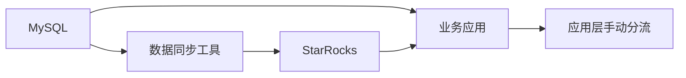
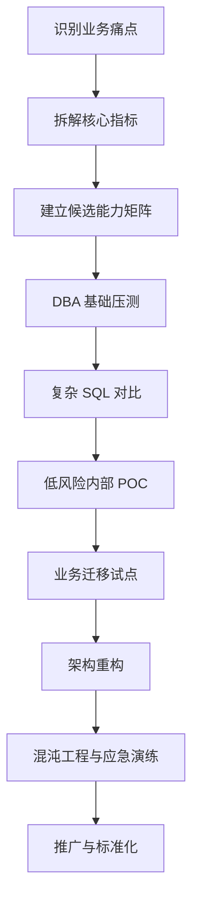

### **结论：这篇文章的核心不是“把 MySQL 换成 OceanBase”，而是通过数据库底座的一体化重构，同时解决性能、成本、可用性、架构复杂度和运维效率问题。**

得物的实践路径可以概括为：

> **多数据库并存带来复杂性 → OceanBase 多模能力与业务痛点匹配 → DBA 压测和 POC 验证 → 低风险业务迁移 → TP/AP 一体化重构 → 运维体系和团队能力同步升级 → 向统一多模、AI 数据底座演进。**

---

### **一、背景：为什么需要重新选择数据库**

#### **1. 现状是什么**

得物在线数据库体系包含：

- MySQL：核心交易和传统业务
- TiDB：分布式业务
- MongoDB、HBase：非关系型和大数据场景
- DuckDB、ClickHouse、StarRocks：分析型场景
- 向量数据库：AI 和检索场景

这种架构本质上是“按场景采购数据库”。每类数据库可能在单一场景中表现较好，但整体会产生系统性问题。

#### **2. 根本矛盾是什么**

数据库选型的核心目标通常包括：

$$
\text{数据库价值} =
\text{性能} + \text{可用性} + \text{成本效率} + \text{运维效率} + \text{扩展能力}
$$

而多数据库架构会带来：

- **运维复杂**：不同数据库需要不同的监控、备份、迁移和故障处理方法。
- **研发选型困难**：业务需要判断什么数据放在哪类数据库中。
- **架构链路复杂**：主库、异构从库、同步工具、应用层分流相互依赖。
- **数据一致性风险**：不同系统之间通常是异步同步，存在延迟。
- **资源利用率低**：低 QPS 实例仍需维持最低资源配置。
- **成本较高**：重复存储、重复计算和冗余系统增加整体 TCO。
- **TP 与 AP 互相影响**：在线事务和复杂分析查询争夺 CPU、IO、锁和缓存资源。

因此，问题并不是某一条 SQL 慢，而是原有数据库体系无法同时满足：

> **事务处理、分析查询、实时性、成本和运维简洁性。**

---

### **二、OceanBase 选型：为什么是它**

#### **1. OceanBase 的核心定位**

OceanBase 在本文中被作为一种**多模数据库底座**使用，目标是让同一套数据库同时承载：

- TP：在线事务处理
- AP：聚合、报表和分析查询
- 行存和列存混合访问
- 高可用和多活部署
- 多租户资源隔离
- 大规模数据压缩和弹性扩展

其关键思想是：

> **尽量减少数据库品类和异构链路，让不同访问模式在同一个分布式数据库体系内完成。**

#### **2. 选型逻辑**

可以用“需求—能力—收益”表示：

| 业务需求 | OceanBase 能力 | 预期收益 |
|---|---|---|
| 高可用和容灾 | Paxos 多副本强同步、多活 | RPO = 0，RTO < 8 秒 |
| 小业务逐步增长 | 单机分布式一体化、弹性扩展 | 避免频繁迁移和切换 |
| 多业务共存 | 多租户资源隔离 | 降低实例数量，提高资源利用率 |
| TP/AP 混合访问 | 行存、列存、行列混存 | 减少异构数据库依赖 |
| 存储成本高 | 分层转储、增量合并、两层压缩 | 降低存储空间和写放大 |
| 跨地域部署 | 多活、单元化、跨云扩展 | 提高容灾和部署灵活性 |
| 复杂 SQL 性能不足 | 分区裁剪、并行执行、计划缓存、Hint | 降低复杂查询耗时 |

---

### **三、底层机理：OceanBase 为什么可能带来收益**

#### **1. 分布式高可用机制**

OceanBase 基于 Paxos 实现多副本强同步。

其逻辑是：

1. 数据写入多个副本。
2. 通过多数派协议确认提交。
3. 某个副本或节点故障时，其他副本可以接管。
4. 因为数据已经同步提交，所以无需依赖异步恢复。

因此可以达到：

- **RPO = 0**：故障后不丢已提交数据。
- **RTO < 8 秒**：故障切换时间较短。
- 支持从单机房到三地五中心的部署模式。
- 支持跨地域多活写入。

本质收益是：

> **把高可用从“主备切换后的恢复”提升为“多副本之间的实时接管”。**

#### **2. 分层转储**

内存数据不会一次性直接写入最终存储层，而是经过：

$$
L0 \rightarrow L1 \rightarrow L2
$$

逐层下沉为 SSTable。

这样做的原因是：

- 避免内存数据积压。
- 减少单次大规模写盘压力。
- 让写入持续进行。
- 降低合并操作对在线业务的影响。

#### **3. 增量合并**

传统合并可能需要扫描和重写大量数据。OceanBase 只合并发生变化的热点宏块，未修改的数据直接复用。

收益是：

- 减少无效数据重写。
- 降低写放大。
- 降低磁盘 IO。
- 降低合并对业务的影响。

#### **4. 两层压缩**

OceanBase 先通过行列混存编码和字典压缩处理结构化数据，再通过通用压缩算法进行二次压缩。

可以抽象为：

$$
\text{原始数据}
\rightarrow \text{结构化编码压缩}
\rightarrow \text{通用算法压缩}
$$

这样兼顾：

- 结构化数据的高压缩率。
- 通用压缩算法的进一步压缩。
- 读写性能与存储成本之间的平衡。

#### **5. 行存、列存和行列混存**

三种存储方式分别适合不同访问模式：

- **行存**：适合点查、整行读取和事务处理。
- **列存**：适合少量列的大范围扫描和聚合。
- **行列混存**：同时兼顾事务和分析访问。

这使数据库可以在一个系统内完成：

> **点查走行存，聚合走列存，混合查询根据数据访问方式自动选择。**

---

### **四、验证方法：为什么不是直接迁移**

得物没有直接把 OceanBase 投入核心生产，而是采用了逐层验证策略：

#### **1. DBA 验证：验证数据库本身**

验证维度包括：

- 不同并发度
- 读写混合
- 只读和只写
- 行存、列存、行列混存
- TPS、QPS
- CPU 使用率
- 复杂查询
- 聚合查询
- 分页排序查询

部分结果：

- 200 并发下，行列混存 TPS 达到 13076.91。
- 100 QPS 场景下，TPS 约为 7230。
- 200 并发下，行存表 CPU 使用率约 63.73%。

这一步解决的问题是：

> **OceanBase 是否具备承载目标业务的基础性能和资源效率。**

#### **2. 复杂 SQL 验证：验证优化器和执行引擎**

两类典型 SQL：

- 周期性统计和去重聚合。
- 多表关联、条件聚合、分页排序。

在 MySQL 中，即使执行计划已经调优：

- SQL1 耗时约 1.3 秒。
- SQL2 耗时约 3.9 秒。

OceanBase 通过五个方向优化：

1. 计划缓存复用。
2. 分区裁剪。
3. 列存索引突破最左前缀限制。
4. 多核并行执行。
5. Hint 指定执行算法。

结果：

- SQL1：1.3 秒降至 0.01 秒，提升约 130 倍。
- SQL2：4 秒降至 0.02 秒，提升约 200 倍。

这些优化并不是单点技巧，而是对完整执行链路进行压缩：

> **计划生成 → 数据扫描 → 索引选择 → 执行调度 → 算法决策。**

#### **3. Hint 的定位**

Hint 并不是日常首选调优手段，而是优化器出现偏差时的人工兜底机制。

适用场景包括：

- 统计信息失准。
- 关联条件复杂。
- 生产环境执行计划突发劣化。
- 优化器选择了不合适的连接算法或访问路径。

其价值在于：

> **不改写业务 SQL，也可以直接干预执行计划。**

---

### **五、第一阶段 POC：为什么先迁移 DBA 报表**

DBA 内部报表是一个低风险、高收益的试点。

#### **1. 原有问题**

- 大部分复杂 SQL 超过 1 秒。
- 部分 SQL 超过 30 秒。
- TP 和 AP 资源互相争夺。
- 存在资源互斥和锁等待。
- MySQL 不适合同时承担复杂分析查询。

#### **2. 方案**

将报表业务迁移到 OceanBase，并使用：

- 物化视图
- 行列混存
- 执行计划优化
- 混沌工程验证
- 运维 SOP 沉淀

#### **3. 结果**

SQL 执行速度平均提升 10～30 倍。

更重要的收益并不只是性能，而是形成了：

- 异常场景处理经验。
- 故障止血方案。
- 运维流程。
- 团队信心。
- 面向业务迁移的标准方法。

因此，POC 的真正作用是：

> **同时验证技术、流程和团队，而不是只验证数据库跑分。**

---

### **六、第一个业务迁移：为什么能实现降本增效**

#### **1. 业务原有痛点**

该业务管理多套 MySQL 集群，规模达到百核 CPU 和 TB 级存储，主要问题包括：

##### **TP/AP 混查**

复杂聚合查询直接运行在 MySQL 主库上，导致：

- CPU 频繁告警。
- 在线事务受到影响。
- 查询和写入资源互相争抢。

##### **存储膨胀**

AI 相关数据增长迅速，MySQL B+Tree 存储存在：

- 碎片较多。
- 大表 DDL 需要额外预留空间。
- 磁盘容量压力大。
- 存储成本高。

##### **资源浪费**

很多实例 QPS 较低，但即使采用最低配置，也存在资源闲置。

##### **运维复杂**

空长事务和异常 DML 难以及时排查，常规管控平台处理效率不足。

#### **2. 架构设计**

迁移计划覆盖：

- 平台接入
- 资源规划
- 架构设计
- 集群配置
- 数据迁移
- 业务变更
- 监控和应急

最终架构的关键设计是：

- 多套 MySQL 合并为一套 OceanBase 集群。
- 使用多租户隔离不同业务。
- 采用三个 Zone。
- 两个可用区承担读写业务。
- 另一个可用区承担只读业务。
- 预留冗余 CPU。
- 租户出现 CPU 告警时，可快速扩容。

这种设计解决了三个层次的问题：

| 层次 | 原有问题 | 设计改进 |
|---|---|---|
| 数据库数量 | 多套实例、资源分散 | 多租户统一承载 |
| 业务负载 | TP/AP 互相干扰 | 租户和存储模式隔离 |
| 故障与扩容 | 主备切换、扩容复杂 | 多副本和冗余资源快速接管 |

#### **3. 结果**

- SQL 平均耗时下降 88.3%。
- 性能提升约 8.6 倍。
- 业务超时接口清零。
- 总体成本下降 43%。
- 多套 MySQL 收敛为一套 OceanBase 集群。
- 三台主机承载整体业务。
- 聚合和范围查询耗时降至 MySQL 的 1% 以内。

以研发效能平台为例：

- AP SQL 平均耗时：6.87 秒 → 0.8 秒。
- 性能提升约 8.6 倍。
- 耗时下降约 88%。

#### **4. 成本下降的原因**

主要来自三方面：

##### **存储压缩**

OceanBase 压缩率超过 80%，简单字段场景压缩比超过 10:1。

##### **资源整合**

多套 MySQL 集群整合为统一集群，减少了：

- 实例级冗余。
- 主备资源浪费。
- 重复部署成本。

##### **资源利用率提升**

通过多租户 Primary Zone 打散和 CPU 超卖，将 ECS CPU 利用率提高到接近 100%，而 MySQL 主备架构约为 50%。

---

### **七、第二个业务重构：为什么要消除 StarRocks 和应用层分流**

#### **1. 原有架构**

原系统大致是：

不同查询路径分别使用不同数据库：

- 点查走 MySQL。
- 大活动聚合查询走 StarRocks。
- 小活动查询可能走 MySQL。
- 数据通过同步工具复制到异构系统。

#### **2. 根本问题**

##### **手动分流不可靠**

业务代码需要判断查询类型。一旦分流错误，聚合查询走到 MySQL，就会影响在线业务。

##### **数据存在延迟**

StarRocks 依赖同步链路，数据不是完全实时可见。

##### **架构重复**

MySQL 和 StarRocks 同时存储相同或相近数据，导致：

- 存储重复。
- 同步工具复杂。
- 数据一致性依赖外部系统。

##### **查询能力割裂**

点查和聚合查询分别依赖不同数据库，业务逻辑和运维复杂度均较高。

#### **3. 重构方案**

将原架构：

> MySQL + StarRocks + 同步工具 + 应用手动分流

升级为：

> OceanBase 行列混存一体化架构

核心变化：

- 点查与聚合查询统一进入 OceanBase。
- 由数据库内部完成访问路径选择。
- 删除异构同步链路。
- 通过行存、列存和混合执行支持多种查询。
- 直接读取最新数据。

#### **4. 结果**

- 运营 B 端已经全部切换到 OceanBase。
- 存储从 TB 级降至百 GB 级。
- 相对 MySQL 压缩率达到 94%。
- 相对 StarRocks 压缩率达到 30%。
- 聚合和范围查询平均比 StarRocks 快 65%。
- 相对 MySQL，部分查询耗时降至 1% 以内。
- 高 QPS 点查与 MySQL 相当，并显著优于 StarRocks。
- 查询完全实时，消除秒级写入到读取延迟。

这次迁移本质上不是数据库替换，而是：

> **删除同步系统、删除应用分流、删除重复存储，重新设计数据访问架构。**

---

### **八、迁移挑战：为什么迁移不是简单兼容**

#### **1. SQL 和语义兼容**

MySQL 与 OceanBase 在以下方面可能存在差异：

- SQL 语法。
- 事务隔离级别。
- 自增列实现。
- 连接字符串和转义规则。
- 部分函数和行为语义。

因此需要：

- 业务适配。
- 数据库参数调整。
- SQL 重新验证。
- 执行计划重新评估。
- 迁移前后的结果一致性校验。

#### **2. 新特性存在边界**

新特性并不代表可以无条件启用。

例如：

- 实时物化视图与 DDL 存在冲突。
- 某些功能之间存在互斥关系。
- 新版本能力可能仍有限制。
- 特定数据规模和负载下可能出现稳定性问题。

因此新特性的准入原则应是：

> **先验证，再上线；先隔离，再扩大；先建立回滚，再使用。**

#### **3. AP 查询可能走偏**

即使数据库具备更强的执行引擎，优化器仍可能因：

- 统计信息不准确。
- 查询条件复杂。
- 数据分布变化。
- 执行计划缓存不适合当前负载。

而选择错误的执行计划。

解决方式包括：

- 绑定执行计划。
- 使用 Hint。
- 更新统计信息。
- 调整索引和分区。
- 重新设计 SQL。
- 监控执行计划变化。

#### **4. 物化视图可能影响 DDL**

物化视图提高查询性能，但实时刷新可能与 DDL 操作产生冲突。

解决方式包括：

- 错峰刷新。
- 严格控制刷新策略。
- 对 DDL 建立审批和准入机制。
- 监控物化视图状态。
- 为异常情况准备恢复流程。

---

### **九、运维体系转型：为什么不能沿用 MySQL 的方法**

MySQL 主要以实例为管理单位，而 OceanBase 更强调：

- 集群级管理。
- 租户级管理。
- 分区和副本管理。
- 资源池管理。
- 分布式故障处理。

因此运维模式由：

> **实例级运维**

转向：

> **集群级 + 租户级运维。**

工具体系也发生变化：

| 原 MySQL 体系 | OceanBase 体系 |
|---|---|
| 云 MySQL 控制台 | OCP |
| 数据同步工具 | OMS |
| 数据库诊断工具 | diag |
| DBA 管控平台 | ODC / 自研平台 |
| 实例监控 | 集群、租户、分区和资源监控 |

需要同步改造的领域包括：

- 监控指标。
- 告警规则。
- 备份恢复。
- 容量规划。
- 故障定位。
- 租户资源管理。
- 数据迁移。
- 变更流程。
- 应急演练。

如果只迁移数据库，而不迁移运维体系，最终会出现：

> **数据库能力升级了，但团队无法稳定使用。**

---

### **十、团队能力建设：为什么技术迁移必须伴随组织升级**

OceanBase 的运维复杂度和知识结构与 MySQL 不同，因此采用三层能力建设路径：

#### **第一层：基础培训**

掌握：

- 分布式架构。
- Paxos。
- 多副本。
- 租户。
- 分区。
- 行列存储。
- 合并机制。
- 资源管理。

#### **第二层：深度实践**

通过真实项目掌握：

- 压测。
- SQL 调优。
- 执行计划分析。
- 故障处理。
- 迁移变更。
- 混沌工程。
- 运维 SOP。

#### **第三层：认证培养**

通过 OBCP 等认证建立系统化知识框架，并培养专项运维人员。

整体形成：

> **培训 → 实战 → 分享 → 沉淀 → 再实践**

这使知识不只停留在个人经验，而是转化为团队资产。

---

### **十一、未来规划：从数据库迁移到数据基础设施重构**

规划分为三个阶段。

#### **短期：0.5～1 年，夯实基础**

重点是：

- 建立技术支撑体系。
- 完善标准 SOP。
- 建立应急演练机制。
- 扩大报表和部分 TP 业务迁移。

目标是降低迁移和运维风险。

#### **中期：1～2 年，扩大场景**

重点是：

- 引入 OBKV。
- 上线向量检索。
- 完成多云、多可用区建设。
- 承载更多核心新增业务。

目标是从传统数据库替换，扩展到 AI 和多模数据场景。

#### **长期：2～3 年，统一多模平台**

目标是：

- 覆盖约 90% 的数据场景。
- 建立统一多模数据平台。
- 支持交易、分析、向量和 AI Agent 数据需求。
- 减少数据库品类和数据同步链路。

---

### **十二、AIOps 方向：数据库如何进一步智能化**

未来规划并不止于数据库基础设施，还包括：

- 异常检测。
- 根因分析。
- 容量预测。
- 自动调参。
- 性能预警。
- 故障自愈。
- 资源规划自动化。

其闭环可以表示为：

最终希望实现：

- 3 年内 TCO 降低 50%。
- 业务上线准备时间缩短至 1 天以内。
- 覆盖实时分析和个性化推荐。
- 秒级故障恢复。
- 数据零丢失。
- 支持 AI Agent 的多模、多态数据基础设施。

---

### **十三、用第一性原理重新抽象这次实践**

#### **原理一：数据库选型的本质是资源和访问模式匹配**

不同业务访问方式不同：

- 点查关注低延迟。
- 聚合关注扫描效率。
- 事务关注一致性和锁竞争。
- 分析关注并行执行和列式访问。
- AI 场景关注向量和实时数据。

OceanBase 的价值在于尽量让这些访问模式共享一套底座，而不是分别建设多个系统。

#### **原理二：性能提升来自减少无效工作**

本文中的性能优化主要减少了以下无效工作：

- 减少不必要的数据扫描。
- 减少不必要的合并和写放大。
- 减少重复同步。
- 减少错误的执行计划。
- 减少应用层手动分流。
- 减少重复存储。
- 减少跨系统数据搬运。

因此，性能提升并非只来自硬件更强，而是来自：

> **让系统少做错误的、重复的和无效的工作。**

#### **原理三：成本优化的本质是提高资源复用率**

成本下降主要来自：

$$
\text{成本下降}
=
\text{存储压缩}
+
\text{资源整合}
+
\text{计算复用}
+
\text{同步链路减少}
$$

多租户、CPU 超卖、压缩存储和异构系统收敛，共同提升了资源利用率。

#### **原理四：架构越长，故障点越多**

原有链路包含：

> MySQL → 同步工具 → StarRocks → 应用分流

链路越长，越容易出现：

- 数据延迟。
- 同步失败。
- 数据不一致。
- 分流错误。
- 多系统监控盲区。

改造后的架构减少中间环节，因此提升了实时性、可观测性和可维护性。

#### **原理五：技术迁移的最大风险不是性能，而是系统性适配**

真正影响迁移成功率的因素包括：

- 语法兼容。
- 事务语义。
- 执行计划。
- 新特性边界。
- 工具链。
- 监控体系。
- 故障流程。
- 团队能力。

所以迁移必须同时完成：

> **数据库迁移、架构迁移、运维迁移和能力迁移。**

---

### **十四、边界与适用条件**

这篇实践不能简单推导出“OceanBase 在所有场景都优于其他数据库”。

#### **1. 不同数据库仍有优势差异**

文章明确提到：

- DuckDB 在纯列存大列表过滤场景略有优势，约 1.3 倍。
- 与 HBase 的对比结果不如预期，部分原因是磁盘类型和 IO 条件不同。
- OceanBase 在高 QPS 点查上与 MySQL 互有优势，并非绝对领先。
- StarRocks 在特定分析场景仍可能具有竞争力。

因此结论应是：

> **OceanBase 更适合综合 TP/AP、实时性、统一架构和成本优化场景，而不是替代所有专用数据库。**

#### **2. 性能结论依赖测试条件**

性能结果会受到以下因素影响：

- 数据规模。
- 数据分布。
- SQL 写法。
- 索引和分区。
- 并发度。
- 磁盘类型。
- 节点配置。
- 统计信息。
- 执行计划。
- 是否采用物化视图。

因此，文章中的倍数只能作为参考，不能直接复制到其他环境。

#### **3. 新特性需要审慎使用**

实时物化视图、自动路由、列存索引等能力虽然有价值，但必须考虑：

- 功能成熟度。
- 与 DDL 的兼容性。
- 运维复杂度。
- 回滚能力。
- 监控和告警能力。
- 业务对实时性的真实要求。

---

### **十五、可复用的方法论**

#### **数据库迁移的标准闭环**

#### **每个阶段应回答的问题**

| 阶段 | 关键问题 |
|---|---|
| 痛点识别 | 当前最严重的问题是性能、成本、可用性还是复杂度？ |
| 能力匹配 | 候选数据库是否真正解决这些问题？ |
| DBA 压测 | 基础性能和资源效率是否达标？ |
| SQL 对比 | 真实复杂查询是否改善？ |
| POC | 是否能在低风险环境中稳定运行？ |
| 业务迁移 | 迁移后是否产生可量化收益？ |
| 架构重构 | 是否能减少同步链路和系统数量？ |
| 运维转型 | 团队是否具备长期维护能力？ |
| 规模推广 | 是否形成标准化流程和边界？ |

---

### **十六、证据闭环：文章结论如何被证明**

| 结论 | 证据 |
|---|---|
| OceanBase 适合 TP/AP 混合场景 | 行存、列存、行列混存；复杂聚合查询显著提速 |
| OceanBase 能提升复杂 SQL 性能 | SQL1 提升约 130 倍，SQL2 提升约 200 倍 |
| OceanBase 能降低成本 | 第一个业务总体降本 43%，第二个业务存储降至百 GB 级 |
| OceanBase 能简化架构 | 多套 MySQL 收敛为一套集群；MySQL + StarRocks 改为一体化 |
| OceanBase 能提升实时性 | 消除异构同步，查询完全实时 |
| OceanBase 迁移存在风险 | SQL 兼容、DDL 与实时物化视图冲突、执行计划走偏 |
| 成功迁移依赖组织能力 | 建立 OCP、OMS、diag、ODC 和培训认证体系 |
| 未来方向是统一数据底座 | OBKV、向量检索、多云多活、AI Agent 数据基础设施 |

**最终可以把这篇文章压缩成一句工程判断：**

> **当企业同时面临数据库品类过多、TP/AP 互相干扰、数据同步复杂、存储成本高和高可用要求提升时，应优先评估具备分布式、多租户、行列混存和多模能力的一体化数据库；但必须通过真实负载压测、业务 POC、兼容性验证、运维改造和团队建设，才能把单纯的数据库替换转化为可持续的架构升级。**
