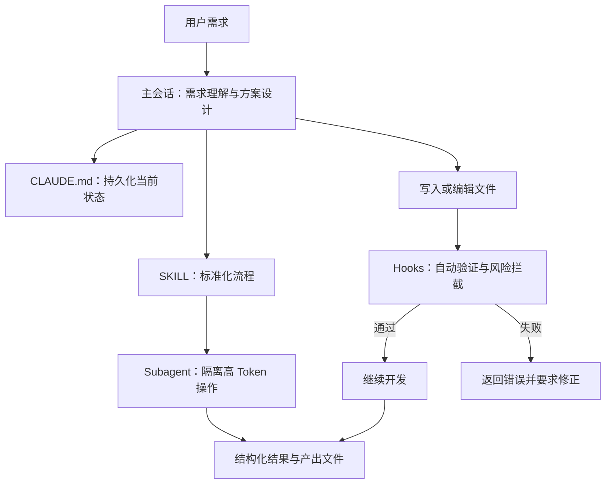

### **核心结论**

这篇文章的核心不是“让 Claude Code 写出更多 SQL”，而是用 Harness 工程把数仓 AI 开发从**依赖模型记忆的对话式辅助**，改造成**规则可持久化、执行可验证、复杂任务可隔离的研发流水线**。

其底层逻辑可以概括为：

> **业务语义由人和模型共同确认，确定性规范由 Harness 强制执行，高消耗操作由 Subagent 隔离，关键状态由文件持久化。**

最终目标是稳定提升准确率、规范遵守率和复杂任务的可持续性，而不是单纯提升单次生成速度。

---

## 一、问题定义：为什么需要 Harness

### 1. 定义

数仓 AI 开发中的 Harness，可以理解为 Claude Code 外部的**宿主与控制框架**。它不负责替代模型进行业务判断，而负责管理模型无法稳定完成的事情：

- 持久化上下文；
- 自动执行检查；
- 拦截危险操作；
- 隔离高 Token 任务；
- 协调多个 Subagent；
- 管理会话和上下文生命周期。

因此，Harness 解决的不是“模型不会写 SQL”，而是：

> 模型在长流程中会遗忘、会遗漏、会超载，也无法可靠地执行需要确定性的规则。


![[Pasted image 20260808165004.png]]

### 2. 三类结构性痛点

#### 痛点一：上下文压缩导致约束遗忘

Claude Code 接近上下文上限时会触发 compact，将历史对话压缩成摘要。压缩后容易丢失：

- 字段单位；
- 指标口径；
- 临时业务约束；
- 当前迭代决策；
- 已完成步骤；
- SKILL 中前置步骤的细节。

例如，用户说明 `amount` 的单位是千元，压缩后模型遗忘这一事实，就可能按元计算，造成数量级错误。

**本质原因：**

临时对话内容属于短期记忆，而复杂数仓开发需要长期、稳定、可恢复的状态。

---

#### 痛点二：规范依赖模型记忆，执行不稳定

常见数仓规范包括：

- OneData 命名规范；
- 三段式注释；
- `INSERT` 必须带 `PARTITION`；
- 禁止 `SELECT *`；
- 金额字段使用指定精度；
- 分区字段使用固定类型和格式；
- 避免无关跨库 JOIN；
- 拦截危险 DDL。

这些规则如果只写在 Prompt 或规范文档中，模型可能：

- 没有读取；
- 读取后遗忘；
- 理解不完整；
- 生成后没有主动检查；
- 在上下文压缩后失去约束。

**本质原因：**

规范执行是确定性任务，却被交给了概率性模型。

---

#### 痛点三：复杂任务撑满主上下文

以下操作通常会产生大量内容：

- 血缘查询；
- 多层 DDL 读取；
- 大量字段结构分析；
- 23 项自测；
- 数据样本比对；
- 多轮 SQL 执行结果；
- 完整 SKILL 文件加载。

这些内容对模型的过程推理有用，但主会话往往只需要最终结论，例如：

- 是否通过；
- 有哪些问题；
- 哪些字段存在差异；
- 推荐怎样优化；
- 最终生成了哪些文件。

**本质原因：**

过程数据和决策结果没有分离，导致主上下文被低价值细节占满。

---

## 二、第一性原理：数仓 AI 准确率由什么决定

文章给出了一个核心抽象：

> **准确率 = 语义理解深度 × 数据规范覆盖度**

这个公式可以进一步拆解。

### 1. 语义理解深度

包括：

- 业务指标的真实口径；
- 字段单位；
- 空值含义；
- 状态字段的业务语义；
- 数据来源和使用边界；
- 当前版本的特殊约束；
- 上下游依赖关系；
- 需求文档中的隐含条件。

语义问题无法完全靠静态规则解决，仍需要人和模型共同判断。

### 2. 数据规范覆盖度

包括：

- 表和字段命名；
- 类型和精度；
- 分区规则；
- SQL 编写规范；
- DDL 安全规则；
- 注释格式；
- 任务完整性；
- SLA/DQC 规则。

规范可以被形式化，因此适合由 Hook 和脚本强制执行。

### 3. 为什么必须采用分层机制

如果把所有问题交给模型：

- 语义判断依赖模型；
- 规范检查也依赖模型；
- 任务状态依赖模型记忆；
- 大量数据也塞进模型上下文。

这样会造成职责混乱。

更合理的分工是：

| 问题类型 | 最适合的机制 | 原因 |
|---|---|---|
| 需求理解与方案设计 | LLM + 人 | 需要语义判断 |
| 规则检查 | Hook | 需要确定性执行 |
| 当前状态保存 | CLAUDE.md | 需要跨压缩、跨会话恢复 |
| 经验沉淀 | Auto Memory | 需要长期积累 |
| 大量查询与验证 | Subagent | 需要隔离上下文 |
| 流程标准化 | SKILL | 需要固定步骤和产出 |

这就是 Harness 架构的第一性原理：**让每类问题由最合适的机制处理。**

---

## 三、核心机理：Context Compact 为什么会造成问题

### 1. Compact 的作用

Compact 的目标是：

- 压缩历史对话；
- 降低上下文占用；
- 让模型继续工作；
- 将原始过程信息转换为摘要。

它解决的是上下文容量问题，但会牺牲部分细节保真度。

### 2. 它容易丢失什么

通常容易丢失：

- 口头约束；
- 临时决策；
- 具体数值；
- 未写入文件的状态；
- 过程中的异常结果；
- 已经确认但未结构化记录的信息；
- 长文档中尚未处理的前置内容。

### 3. 不能依赖 Compact 自动恢复全部信息

Compact 不是数据库快照，而是摘要重建。它可能保留“做了什么”，却不一定保留：

- 为什么这样做；
- 哪些条件不能改变；
- 某字段的特殊含义；
- 哪些问题尚未确认；
- 哪些规则需要优先执行。

因此，重要信息必须从对话迁移到外部持久化介质。

---

## 四、五层防御体系

五层机制不是五个相互替代的方案，而是从“保存信息”到“强制执行”再到“隔离复杂度”的逐层增强。

---

### 第一层：CLAUDE.md——持久化当前状态

#### What：是什么

在项目目录下维护 `.claude/CLAUDE.md`，写入每次迭代的关键状态和长期规范。

#### Why：为什么需要

因为文件不会随着对话 compact 消失，重新注入后可以恢复关键上下文。

#### How：怎么做

建议分为三类内容：

```text
# 全局规范
长期有效的命名、字段、SQL、分区规则

# 当前迭代
正在开发的表、任务、版本

# 本次迭代约束
字段口径、禁止修改范围、待确认事项、技术决策
```

#### 边界

适合保存：

- 少量；
- 稳定；
- 高价值；
- 必须反复恢复的信息。

不适合保存：

- 大量查询结果；
- 完整血缘；
- 临时日志；
- 全部 SQL 内容；
- 不再有效的历史约束。

文章建议全局规范控制在约 100 行以内，并在迭代结束后清理临时约束。

---

### 第二层：Auto Memory——沉淀跨会话经验

#### What

Claude 自动将跨会话发现写入项目记忆文件，例如：

```text
~/.claude/projects/<project>/memory/MEMORY.md
```

#### Why

某些信息不是单次迭代状态，而是项目长期经验，例如：

- 某字段的真实单位；
- 某个业务场景的空值规律；
- 曾经发生过的口径错误；
- 某张表的特殊使用限制；
- 某次版本变更的关键逻辑。

#### How

可以主动表达需要长期记忆的信息，例如：

```text
这张表的 amount 字段单位是千元，请记住。
```

或：

```text
field_a 在特定场景下允许为空，请记住这个约束。
```

#### 与 CLAUDE.md 的区别

| 机制 | 主要内容 | 维护方式 |
|---|---|---|
| CLAUDE.md | 当前迭代状态、明确规范 | 人工维护 |
| Auto Memory | 跨会话经验、踩坑记录 | 模型自动积累 |

简单来说：

- `CLAUDE.md` 更像项目运行配置；
- `MEMORY.md` 更像项目经验库。

---

### 第三层：Hooks——把规则变成自动护栏

这是文章中最关键的改进。

#### What：是什么

Hook 是由 Harness 在特定事件发生时自动执行的脚本或检查，不依赖模型“想起来要不要检查”。

#### Why：为什么需要

“每次写完 SQL 都检查”是一项重复、确定、容易遗漏的任务，应该从模型职责中移除。

#### How：核心 Hook 类型

##### 1. PostToolUse

在模型执行写入或编辑操作后触发。

适合：

- SQL 规范检查；
- 文件格式检查；
- 表名和字段名检查；
- 分区检查；
- 注释检查；
- 禁止 `SELECT *`；
- 类型精度检查。

典型流程：

```text
模型写入 SQL
    ↓
PostToolUse Hook 自动触发
    ↓
执行 validate_sql.sh
    ↓
通过：继续
失败：返回错误并阻断
    ↓
模型修正 SQL
```

##### 2. PreToolUse

在危险操作执行前触发。

适合：

- 拦截危险 DDL；
- 阻止删除表；
- 阻止未授权生产变更；
- 检查高风险 Bash 命令；
- 检查操作环境。

##### 3. SessionStart

会话开始或 compact 后触发。

适合：

- 重新注入数仓规范；
- 重新读取迭代状态；
- 恢复关键约束；
- 输出当前项目上下文。

##### 4. Stop

模型准备停止时触发。

适合：

- 检查任务是否完成；
- 检查是否存在未解决问题；
- 检查待确认事项；
- 防止模型过早结束。

#### 关键设计原则

Hook 适用于具有明确判断标准的规则，例如：

```text
如果 SQL 包含 SELECT *，则失败。
如果 INSERT 没有 PARTITION，则失败。
如果执行危险 DDL，则阻断。
```

Hook 不适合处理：

- 模糊业务判断；
- 指标口径选择；
- 需求优先级；
- 复杂方案权衡；
- 需要常识和业务背景的推理。

#### 关键边界

文章特别强调：阻断必须使用 `exit 2`，而不是 `exit 1`。

原因是：

- `exit 2` 表示需要阻断模型后续执行；
- `exit 1` 可能只表示脚本异常，但不一定阻止流程继续。

因此，Hook 的退出码本身是 Harness 控制链路的一部分。

---

### 第四层：Subagent——隔离高 Token 操作

#### What

Subagent 是拥有独立上下文的专用代理，用来执行某一类高消耗任务。

#### Why

主会话需要的是结果，而不是全部过程。

把高 Token 工作放到独立上下文中，可以：

- 防止主上下文膨胀；
- 降低 compact 频率；
- 保留主会话的决策信息；
- 让专用代理采用固定工作方式；
- 提升复杂任务的稳定性。

#### How

典型 Subagent 包括：

| Subagent | 负责内容 | 主会话接收 |
|---|---|---|
| `dw-explorer` | 表结构、DDL、血缘查询 | 结构摘要、关键依赖 |
| `sql-validator` | SQL 语法和规范验证 | PASS/FAIL、问题列表 |
| `data-quality-checker` | 多项数据质量自测 | 通过率、失败项 |
| `data-comparator` | 两表数据比对 | 差异字段、差异结论 |

#### 推荐输出格式

Subagent 不应把所有原始结果倾倒回主会话，而应返回结构化摘要：

```text
状态：PASS / FAIL
关键发现：
- ...
问题列表：
- ...
建议：
- ...
产出文件：
- ...
```

#### 适合下放的任务

- 查询量大；
- 结果重复；
- 需要读取大量文件；
- 需要运行多条 SQL；
- 只需要结论；
- 不需要主会话持续参与推理。

#### 不适合下放的任务

- 需求澄清；
- 关键业务取舍；
- 最终技术决策；
- 需要用户即时确认的操作；
- 影响范围尚未明确的变更。

---

### 第五层：SKILL——把流程封装成标准能力

![[Pasted image 20260808165020.png]]

#### What

SKILL 是把规范、步骤、产出格式和工具调用方式封装起来的标准化执行单元。

#### Why

重复依赖 Prompt 会产生三个问题：

- 每次都要重新描述；
- 不同人使用方式不一致；
- 关键检查点容易遗漏。

SKILL 将“怎么做”固化为标准流程。

#### How

以 `/dw-etl` 为例，可以封装：

- 建表 DDL 规范；
- 分区字段规范；
- 金额字段精度；
- `INSERT OVERWRITE` 要求；
- 禁止 `SELECT *`；
- 输出文件路径；
- SQL 验证步骤；
- Hook 配合方式；
- 最终报告格式。

#### 关键改造

文章不是建议删除 SKILL，而是改变其加载方式：

```text
传统方式：
主会话直接读取完整 SKILL
    ↓
大量规范和步骤进入主 context

改造方式：
Subagent 读取完整 SKILL 并执行
    ↓
主会话只接收最终结论和文件路径
```

这样既保留了完整规范，又降低了主上下文消耗。

---

## 五、整体架构：四层职责分工

可以抽象成以下架构：



四层职责如下：

| 层次 | 解决的问题 | 典型机制 |
|---|---|---|
| LLM | 语义理解和方案生成 | Claude Code |
| 持久化层 | 上下文遗忘 | CLAUDE.md、Auto Memory |
| Harness 层 | 规范和安全 | Hooks |
| 隔离层 | 上下文膨胀 | Subagents |
| 流程层 | 执行一致性 | SKILL |

更准确地说，SKILL 是流程封装层，CLAUDE.md 和 Memory 是状态层，Hooks 是确定性控制层，Subagent 是上下文隔离层。

---

## 六、数仓八步工作流如何设计

### Step 1：需求分析

#### 目标

确认业务目标、指标口径、数据范围和待确认事项。

#### 推荐方式

使用 `dw-explorer` 查询上游结构和血缘，但只返回摘要。

#### 产出

- 需求口径；
- 上游表；
- 关键字段；
- 待确认问题；
- 当前迭代约束。

#### 原因

需求分析需要语义判断，但表结构查询可能产生大量信息，因此采用“主会话判断 + Subagent 探查”。

---

### Step 2：技术设计

#### 目标

将业务需求转换为：

- 目标表设计；
- 字段和类型；
- 分区策略；
- 计算逻辑；
- 上下游依赖；
- 性能和存储方案。

#### 产出

技术设计完成后，把关键决策写入 `CLAUDE.md`。

#### 原因

技术决策必须跨 compact 保留，否则后续生成 SQL 时可能改变已确认方案。

---

### Step 3：ETL 开发

这是 Harness 价值最高的一步。

#### 目标

生成：

- 建表 DDL；
- Insert SQL；
- 字段注释；
- 分区逻辑；
- 依赖关系。

#### 自动护栏

每次写入 `.sql` 后，由 PostToolUse 自动检查：

- 是否使用 `SELECT *`；
- 是否缺少 `PARTITION`；
- 分区字段是否正确；
- 金额字段精度是否正确；
- 是否违反命名规范；
- 是否出现不允许的跨库 JOIN。

#### 原因

SQL 规范属于规则执行，不应依赖模型自觉检查。

---

### Step 4：自测

#### 目标

执行标准数据质量检查，例如：

- 行数；
- 空值；
- 唯一性；
- 主键重复；
- 分区完整性；
- 数据范围；
- 指标波动；
- 关联完整性。

#### 推荐方式

交给 `data-quality-checker`。

#### 主会话只接收

- PASS/FAIL；
- 失败规则；
- 关键异常；
- 建议修复方式。

#### 原因

大量自测结果是过程数据，不应占用主会话上下文。

---

### Step 5：数据比对

#### 目标

比较新旧表、源表和目标表，确认：

- 行数变化；
- 字段差异；
- 指标差异；
- 空值变化；
- 边界样本；
- 业务结果是否一致。

#### 推荐方式

交给 `data-comparator`。

#### 输出

- 差异字段；
- 差异比例；
- 影响范围；
- 是否符合预期；
- 是否需要人工确认。

---

### Step 6：SR 数据库导入

#### 目标

生成数据库建表或导入任务，并确定合适的参数。

#### 推荐方式

先通过 Subagent 查询：

- 目标表 DDL；
- 一层上下游血缘；
- 数据规模；
- 相关索引或存储约束。

然后调用 `dw-sr` SKILL 执行标准化生成。

---

### Step 7：性能优化

#### 目标

识别：

- 无效扫描；
- 不合理 JOIN；
- 分区裁剪失效；
- 数据倾斜；
- 重复计算；
- 上下游放大效应；
- 不必要的宽表读取。

#### 推荐方式

让 `dw-explorer` 获取：

- 一层上下游血缘；
- 相关 DDL；
- 关键依赖；
- 影响范围。

主会话根据摘要进行优化决策。

---

### Step 8：SLA/DQC

#### 目标

为目标表生成完整的数据质量和稳定性规则，例如：

- 表级行数；
- 字段非空；
- 唯一性；
- 枚举值；
- 数据延迟；
- 分区完整；
- 波动范围；
- 上下游一致性；
- 业务指标异常。

#### 推荐方式

使用固定 SKILL 生成规则，避免临时遗漏。

---

## 七、为什么这些改进能够提升效果

### 1. 从“提醒模型”改为“系统强制”

传统方式：

```text
规范写在文档里
    ↓
人提醒模型
    ↓
模型记住并执行
    ↓
偶尔漏检
```

Harness 方式：

```text
规范写进 Hook
    ↓
文件变更自动触发
    ↓
违规自动阻断
    ↓
模型修正后继续
```

变化的本质是：

> 从概率性遵守转为确定性执行。

---

### 2. 从“上下文记忆”改为“外部状态”

传统方式依赖：

- 口头说明；
- 历史对话；
- 模型记忆；
- 人工重复提醒。

改进后依赖：

- `CLAUDE.md`；
- Memory；
- 结构化迭代状态；
- SessionStart 自动重注入。

变化的本质是：

> 从短期上下文管理转为外部状态管理。

---

### 3. 从“过程全部返回”改为“结果摘要返回”

传统方式：

```text
血缘原始结果
+ 完整 DDL
+ 全部自测结果
+ 多轮日志
→ 主上下文
```

改进后：

```text
独立 Subagent 执行全部过程
→ 主会话只接收摘要
```

变化的本质是：

> 让过程计算和决策信息解耦。

---

### 4. 从“临时 Prompt”改为“标准化能力”

传统方式每次重新描述：

- 规范；
- 步骤；
- 输出格式；
- 验证要求；
- 文件位置。

改进后用 `/dw-etl`、`/dw-自测` 等命令统一入口。

变化的本质是：

> 将个人经验产品化、流程化和可复用化。

---

## 八、边界：Harness 能解决什么，不能解决什么

### 能解决的问题

#### 1. 约束遗忘

通过 `CLAUDE.md` 和 SessionStart 重注入恢复。

#### 2. 规范执行不一致

通过 Hooks 自动检查和阻断。

#### 3. 高 Token 操作拖垮上下文

通过 Subagent 隔离。

#### 4. 流程标准不统一

通过 SKILL 固化步骤、输出和验证方式。

#### 5. 高风险操作缺少护栏

通过 PreToolUse 拦截危险命令和 DDL。

---

### 不能完全解决的问题

#### 1. 业务口径本身不清楚

如果人没有确认“GMV”究竟是交易口径还是用户口径，系统无法凭空确定正确答案。

#### 2. 错误的规则

Hook 只能可靠执行已配置的规则。如果规则本身错误，系统会稳定地产生错误结果。

#### 3. 不可形式化的判断

例如：

- 这个指标是否符合业务直觉；
- 这个方案是否便于未来扩展；
- 两种统计口径哪个更合理；
- 需求方真正想解决什么问题。

这些仍需要人参与。

#### 4. 自动检查覆盖范围之外的问题

没有写进脚本、SKILL 或持久化文件的约束，系统仍然可能遗漏。

#### 5. 数据源本身不可靠

如果源数据存在延迟、脏数据或业务变更，Harness 只能发现部分异常，不能替代数据治理。

---

## 九、母题驱动的证据闭环

这篇文章可以围绕四个母题理解。

### 母题一：为什么 AI 会“失忆”？

#### 证据

- Compact 会替换历史对话；
- 临时口头约束不一定进入摘要；
- SKILL 前置步骤可能被压缩掉；
- 复杂查询会快速触发上下文上限。

#### 结论

关键状态不能只放在对话中，必须外置到文件和记忆系统。

#### 对应方案

- `CLAUDE.md`；
- Auto Memory；
- SessionStart 重注入。

---

### 母题二：为什么规范不能靠模型记忆？

#### 证据

- 规范执行有明确判断条件；
- 模型可能漏检；
- 上下文压缩会丢失规范；
- 人工执行在高压力下也会下降。

#### 结论

确定性规则应交给确定性机制执行。

#### 对应方案

- PostToolUse Hook；
- PreToolUse Hook；
- `exit 2` 强制阻断。

---

### 母题三：为什么复杂需求反而更容易失败？

#### 证据

- 复杂需求更依赖血缘、DDL、自测和数据比对；
- 这些过程会产生大量 Token；
- 主上下文越满，compact 越频繁；
- Compact 后关键决策可能遗失。

#### 结论

复杂度必须被隔离，而不是全部堆在主会话中。

#### 对应方案

- `dw-explorer`；
- `data-quality-checker`；
- `data-comparator`；
- SQL 验证 Subagent。

---

### 母题四：为什么要把 SKILL 改造成命令体系？

#### 证据

- 重复 Prompt 容易遗漏；
- 不同开发者执行方式不同；
- 规范、产出和检查点需要统一；
- 全文加载会增加主上下文压力。

#### 结论

标准流程应被封装成可重复调用的能力，但执行过程不应全部进入主上下文。

#### 对应方案

- `/dw-etl`；
- `/dw-自测`；
- `/dw-数据比对`；
- SKILL + Subagent + Hook 的组合。

---

## 十、落地顺序：为什么要分三步实施

文章建议的落地顺序是合理的，因为它遵循了“先保存状态，再强制规则，最后隔离复杂度”的递进关系。

### 第一步：建立项目级上下文

先创建：

```text
.claude/CLAUDE.md
```

写入：

- 全局规范；
- 当前迭代；
- 当前约束；
- 技术设计决策；
- 待确认事项。

**原因：**

这是成本最低、收益最直接的改进，先解决“忘记关键信息”。

---

### 第二步：配置 Hooks

创建：

```text
.claude/settings.json
.claude/hooks/
```

优先实现：

- SQL 自动检查；
- 危险 DDL 拦截；
- compact 后规范重注入；
- 任务完成性检查。

**原因：**

Hooks 能直接把最容易遗漏的规范变成自动护栏，收益稳定且容易验证。

---

### 第三步：创建 Subagents

优先创建：

```text
.claude/agents/sql-validator.md
.claude/agents/dw-explorer.md
.claude/agents/data-quality-checker.md
.claude/agents/data-comparator.md
```

**原因：**

上下文隔离的改造复杂度高于前两步，应在状态和规则体系稳定后实施。

---

## 十一、如何衡量落地效果

文章给出了若干预期指标，但其中部分属于方案估计，实际落地时应通过基线验证。

建议关注以下指标：

| 指标 | 衡量内容 |
|---|---|
| 规范通过率 | SQL 是否符合固定规则 |
| 首次交付通过率 | 是否减少需求返工 |
| 需求口径确认率 | 待确认问题是否闭环 |
| Compact 频率 | 主上下文是否更稳定 |
| 单任务返工次数 | 生成结果是否更可靠 |
| Hook 拦截问题数 | 自动发现了多少违规 |
| Subagent 摘要有效率 | 摘要是否足够支持决策 |
| 自测发现率 | 自动验证是否覆盖真实问题 |
| 高风险操作拦截率 | 是否减少误操作 |

需要特别注意：规范通过率提升，并不等于业务正确率自动提升。因为业务正确率还取决于语义理解、需求确认和数据源质量。

---

## 十二、最终抽象

这套方案可以压缩成一个通用模型：

```text
语义任务 → LLM + 人确认
确定性规则 → Hook 强制执行
高消耗过程 → Subagent 隔离
关键状态 → 文件持久化
重复流程 → SKILL 标准化
最终结果 → 主会话结构化汇总
```

进一步表达为：

> **LLM 负责判断，Harness 负责约束，Subagent 负责隔离，文件负责记忆，SKILL 负责复用。**

因此，Harness 工程的真正价值不在于让模型“更聪明”，而在于减少模型需要承担的非优势工作：

- 不让模型负责记住所有历史约束；
- 不让模型负责重复检查所有规范；
- 不让模型承载所有原始过程数据；
- 不让每个人重复描述同一套流程。

最终，数仓 AI 开发从：

```text
人不断提醒模型
```

转变为：

```text
系统持续约束模型
```

这也是文章最核心的设计思想。
