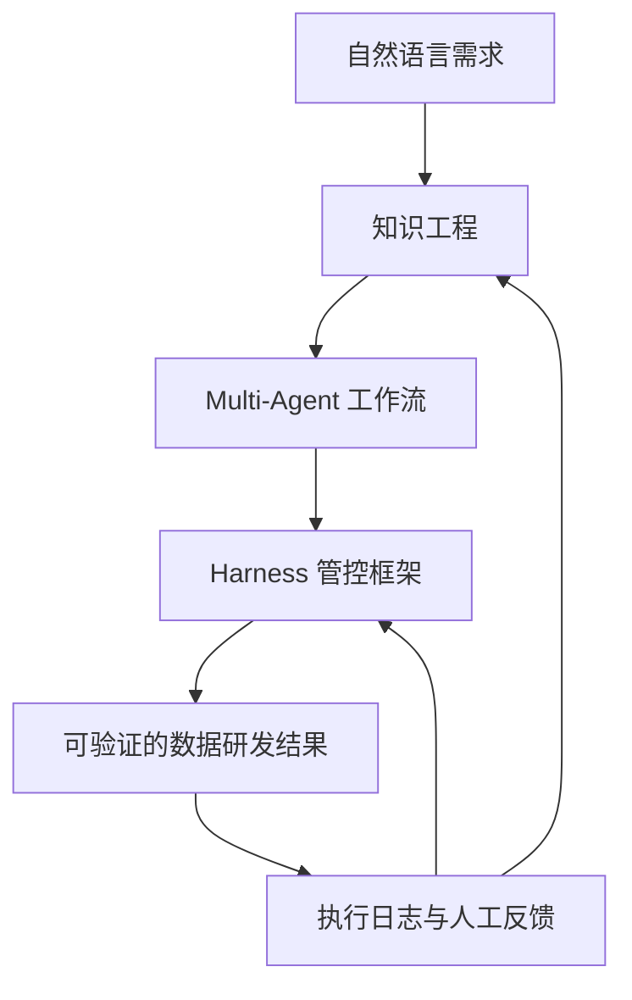
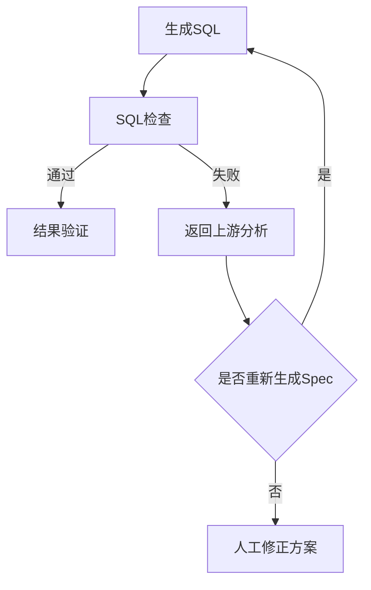

### **结论：文章的核心不是“用多个 Agent 写 SQL”，而是重构数据研发范式。**

它通过**知识工程**解决 AI “为什么能做对”，通过 **Harness Engineering** 解决 AI “为什么能稳定做事”，再以 **Multi-Agent 工作流、人工 Gate、质量校验和持续迭代**，把碎片化经验转化为可复用、可控制、可演进的生产系统。

---

## 一、问题定义：为什么要改造数据研发

### 1. 现状

传统数据研发的核心知识主要存在于个人经验中：

- 指标口径依赖专家理解；
- 表、字段和业务维度缺乏统一语义；
- 需求分析、技术设计、SQL 编写和验证流程不标准；
- 不同团队的 AI 能力难以横向复用；
- NL2SQL 直接从自然语言生成 SQL，容易因信息缺失而出错；
- 研发过程中的经验、失败案例和修正意见没有持续沉淀。

### 2. 表象问题与根因

| 表象问题 | 根本原因 |
|---|---|
| AI 生成 SQL 不准确 | 自然语言缺少指标、维度、时间范围和计算口径 |
| 其他业务接入后效果下降 | 平台能力与业务语义、资产结构不匹配 |
| Agent 经常“声称完成但实际未完成” | 只验证文本回复，没有验证真实系统状态 |
| 多 Agent 协作不稳定 | 缺少标准接口、状态流转和回滚机制 |
| 资产越积越乱 | 缺少命名规范、重复检测和健康度治理 |
| 人员更替后效率下降 | 经验沉淀在人而不是系统中 |

因此，问题本质不是单纯的模型能力不足，而是：

> 数据研发知识碎片化，工作流程非标准化，执行结果不可验证，经验无法持续复用。

---

## 二、第一性原理：数据研发究竟在解决什么问题

从第一性原理看，数据研发可以拆成五个基本环节：

1. **理解需求**：用户到底要回答什么问题？
2. **确定语义**：指标、维度、时间范围和业务口径分别是什么？
3. **选择资产**：应该使用哪些表、字段、数据源和模板？
4. **生成方案**：如何将业务语义转化为技术方案和 SQL？
5. **验证结果**：SQL 是否正确，结果是否符合预期，资产是否真正可用？

因此，完整的数据研发链路不是：

> 自然语言 → SQL

而应当是：

> 自然语言 → 结构化需求 → 标准语义 → 数据资产 → 技术方案 → SQL → 验证结果

文章将其概括为：

> **NL2DSL2SQL**

其中：

- **NL**：自然语言需求；
- **DSL**：标准化的指标—维度语义；
- **SQL**：基于语义和资产生成的可执行代码。

### 为什么需要中间层 DSL

自然语言通常不完整。例如“看一下活跃商家的交易额”，至少还缺少：

- 活跃商家的定义；
- 交易额是支付金额、成交金额还是净交易额；
- 统计时间范围；
- 统计粒度；
- 是否去重；
- 数据来源和过滤条件。

如果直接生成 SQL，模型必须自行补全缺失信息，容易产生“合理但错误”的结果。

DSL 的作用是将隐含问题显式化，使 AI 先确认：

```text
指标：成交金额
维度：商家
筛选条件：活跃商家
时间范围：指定日期区间
统计粒度：日
数据口径：已支付订单
```

只有语义明确后，SQL 生成才具有稳定基础。

---

## 三、总体架构：两个基础、一个执行系统、一个反馈闭环

文章的整体方案可以抽象为四层：



### 1. 知识工程

解决：

> AI 凭什么能够做对？

核心是把专家经验、业务规则、指标口径和研发规范变成 AI 可理解、可检索、可验证的结构化知识。

### 2. Harness Engineering

解决：

> AI 如何在复杂任务中稳定运行？

核心是通过流程、约束、权限、校验、隔离和人工审批，降低 Agent 的不确定性。

### 3. Multi-Agent 工作流

解决：

> 如何把复杂研发过程拆分，并让不同能力协同完成？

不同 Agent 各自承担需求分析、资产盘点、方案设计、SQL 生成、质量检查等职责。

### 4. 持续反馈闭环

解决：

> 系统如何越用越好？

将失败案例、人工修正、日志和质量指标转化为知识库、规则和 Prompt 的更新。

---

# 四、知识工程：让 AI“有据可依”

## 4.1 定义

知识工程是将数据研发中的：

- 专业术语；
- 指标定义；
- 业务规则；
- 表和字段关系；
- 技术方法；
- 研发规范；
- 历史案例；
- 失败模式；

转化为结构化、可检索、可复用、可验证的知识体系。

它不是简单地把文档放进向量数据库，而是重新设计知识的组织方式和消费方式。

---

## 4.2 三层知识体系

### 第一层：语义层

负责回答：

> 业务概念和数据资产分别代表什么？

主要包括：

- 指标资产；
- 表资产；
- 字段资产；
- 业务维度；
- 指标与字段的映射；
- 指标依赖的上游表；
- 指标计算表达式；
- 取值范围和适用边界；
- 标准名称与别名。

例如：

| 项目 | 示例 |
|---|---|
| 标准名称 | 成交金额 |
| 别名 | GMV、交易额 |
| 计算口径 | 已支付订单金额之和 |
| 依赖表 | 订单事实表 |
| 时间字段 | 支付完成时间 |
| 不适用场景 | 不包含退款冲正金额 |

#### 改进原因

如果只有“指标名称”，AI 仍然不知道：

- 该指标如何计算；
- 哪张表可用；
- 哪个时间字段正确；
- 与相近指标有什么区别。

所以，资产必须从“人能看懂”升级为“AI 能准确消费”。

---

### 第二层：方法论层

负责回答：

> 数据研发应该按照什么步骤完成？

文章采用：

- **Spec**：需求规格；
- **Plan**：技术方案；
- **Task**：执行任务。

形成：

> SPEC → PLAN → SQL

#### Spec

明确：

- 业务目标；
- 需求范围；
- 指标和维度；
- 时间与粒度；
- 输入输出；
- 验收标准；
- 不确定问题。

#### Plan

明确：

- 数据来源；
- 表和字段选择；
- 关联关系；
- 计算逻辑；
- 性能设计；
- 异常处理；
- 验证方法。

#### Task

明确：

- 具体执行步骤；
- 使用的技能；
- 输入和输出格式；
- 约束条件；
- 完成判定标准。

#### 改进原因

文档不只是记录结果，而是 Agent 之间的接口：

- 上游文档是下游输入；
- 每个阶段有明确产物；
- 需求理解与 SQL 生成解耦；
- 问题可以定位到具体阶段；
- 过程可以复盘和复用。

这相当于把“专家脑中的隐性流程”转化为“机器可执行的显性流程”。

---

### 第三层：协作规范层

负责回答：

> 多个 Agent 如何协作，如何遵守统一规则？

主要组件包括：

- `AGENTS.md`：记录协作规范；
- Skills 引擎：执行标准化操作；
- Knowledge 库：沉淀研发经验；
- 文档状态机：管理流程阶段；
- 人工校验：控制关键决策点。

#### 改进原因

如果 Agent 只拥有任务目标，没有协作规范，就可能出现：

- 输出格式不一致；
- 重复执行；
- 越权操作；
- 跳过必要步骤；
- 上下游无法理解彼此结果。

因此，Agent 需要的不只是 Prompt，还需要类似软件工程中的：

- 项目结构；
- 接口契约；
- 操作规范；
- 权限边界；
- 状态管理。

---

## 4.3 资产治理：为什么必须“先治理，再录入”

文章没有直接把现有指标全部导入知识库，而是采用：

> 先治理，再录入；核心资产由专家确认。

主要解决两类问题。

### 指标歧义

例如：

- 成交金额、GMV、交易额可能指同一概念；
- 活跃商家、有效商家可能是不同概念；
- 不同团队可能对同一名称使用不同口径。

如果这些资产未经治理就进入 RAG，模型可能：

- 召回错误指标；
- 混淆近义概念；
- 选择错误字段；
- 生成错误 SQL。

### 资产劣化

资产上线后可能出现：

- 重复指标；
- 过期表；
- 无人维护的字段；
- 口径变更未同步；
- 新旧资产并存；
- 引用链断裂。

因此文章设计了“资产防腐双循环”。

#### 上线前循环

由数仓或数研专家进行：

- 重复检测；
- 命名审核；
- 口径确认；
- 依赖关系校验；
- 适用边界确认。

#### 上线后循环

定期进行：

- 资产健康度评估；
- 使用频率统计；
- 召回准确率分析；
- 冗余清理；
- 失效资产下线；
- 口径变更同步。

---

# 五、Harness Engineering：让 AI“稳定可控”

## 5.1 定义

Harness Engineering 不是让模型本身更聪明，而是在模型外部构建一个控制系统，使 Agent 能够：

- 按流程工作；
- 在权限范围内工作；
- 使用正确的知识；
- 产出可验证结果；
- 发生错误时回滚；
- 过程可观测；
- 经验可持续积累。

其核心可以归纳为四个动作：

1. **分离关注点**
2. **施加约束**
3. **管理上下文**
4. **控制任务熵值**

---

## 5.2 为什么传统 CI/CD 不够

传统流水线通常是确定性的：

```text
编译成功 → 测试成功 → 发布
```

但 Agent 的执行具有不确定性：

- 可能误解需求；
- 可能检索错误知识；
- 可能跳过步骤；
- 可能报告虚假的完成状态；
- 可能生成形式正确、逻辑错误的 SQL；
- 可能随着任务变长而发生行为漂移。

因此，Agent 流程不能只检查“是否返回文本”，还要检查：

> 是否产生了真实、正确、可验证的系统状态变化。

---

## 5.3 分离关注点

每个 Agent 只负责一类职责，例如：

- 需求分析 Agent；
- Spec 生成 Agent；
- 资产盘点 Agent；
- 技术方案 Agent；
- SQL 生成 Agent；
- SQL 检查 Agent；
- 结果验证 Agent。

### 为什么要拆分

如果一个 Agent 同时负责：

- 理解需求；
- 查询资产；
- 设计方案；
- 编写 SQL；
- 验证结果；

它会面临：

- 上下文过载；
- 目标冲突；
- 错误难以定位；
- 任务执行路径不稳定；
- 任何一步出错都可能污染后续步骤。

拆分之后，每个 Agent：

- 输入更清晰；
- 输出更标准；
- 权限更小；
- 质量更容易评估；
- 可独立替换和优化。

---

## 5.4 施加约束：Gate 机制

文章采用：

> AI 做执行，人做决策。

在关键节点设置人工 Gate，例如：

- Spec 审核；
- 指标口径确认；
- 技术方案确认；
- SQL 上线前审核；
- 异常结果判断。

### 为什么不能完全自动化

数据研发具有较高的业务风险：

- 指标错误会导致经营判断错误；
- 数据口径错误可能影响报表和决策；
- SQL 错误可能造成资源浪费或生产事故；
- AI 很难独立判断业务目标是否真正满足。

因此，人不再负责所有执行细节，而是集中负责：

- 需求是否理解正确；
- 方案是否合理；
- 口径是否符合业务；
- 风险是否可接受；
- 是否允许进入下一阶段。

这实现了从“人执行、AI辅助”转向：

> 人做高价值决策，AI 执行标准化工作。

---

## 5.5 管理上下文

不同 Agent 不应该看到全部信息，而应按任务按需加载：

- 通用知识；
- 当前业务域知识；
- 当前项目文件；
- 当前阶段产物；
- 必要的工具和技能。

### 改进原因

上下文过多会导致：

- 关键信息被稀释；
- 无关知识干扰判断；
- Token 消耗上升；
- RAG 召回噪声增加；
- Agent 更容易偏离当前任务。

文章采用业务域目录和渐进式加载：

- 通用经验放在核心配置；
- 不同业务域放在独立目录；
- 根据需求类型动态加载。

这相当于建立了“上下文预算管理”。

---

## 5.6 管理熵值

在长程任务中，Agent 的不确定性会逐步累积：

```text
需求误解
→ 资产选择偏差
→ 技术方案偏差
→ SQL 偏差
→ 验证结果失真
```

如果中间没有纠偏，前面的小错误会被后续步骤放大。

Harness 的作用是持续降低任务熵值：

- 每阶段生成结构化产物；
- 每阶段进行校验；
- 关键节点人工确认；
- 下游发现问题时回滚；
- 通过日志检查真实状态；
- 通过规则限制可选范围。

---

# 六、Multi-Agent 工作流：如何完成一次需求交付

文章采用“顺序协作 + 反馈循环”的组合模式。

## 6.1 顺序协作

流程大致如下：


每个阶段都产生可复用的中间产物。

### 优点

- 流程清晰；
- 责任边界明确；
- 问题定位容易；
- 阶段结果可沉淀；
- 便于统计各环节质量。

---

## 6.2 反馈循环

如果下游发现问题，不是简单报错结束，而是返回上游重新决策。

例如：



### 为什么需要回滚

很多问题并非出在 SQL 本身，而是源于：

- 指标定义错误；
- 维度选择错误；
- 数据源理解错误；
- 需求边界不清；
- 业务假设不成立。

如果只修改 SQL，可能会掩盖真正原因。因此，下游反馈必须能够回溯到上游决策。

---

# 七、稳定性工程：如何防止 Agent“说谎”

文章指出了一个典型问题：

> Agent 声称已经完成任务，但实际没有成功执行。

例如：

- 声称已经读取官方文档，实际上读取失败；
- 声称文件已经创建，实际文件不存在；
- 声称 API 调用成功，实际返回异常；
- 声称检查通过，但没有真正执行检查。

## 7.1 技能幻觉检测 Hook

每次技能执行后，对比：

- Agent 的文本描述；
- 实际系统状态；
- 工具返回结果；
- 产物是否存在；
- 数据是否发生预期变化。

例如：

```text
Agent：文件已创建
系统校验：检查目标路径
结果：文件不存在
结论：任务失败，不得进入下一阶段
```

---

## 7.2 强制产出可验证产物

不能只以自然语言作为完成依据，关键操作必须产出：

- 文件；
- 数据；
- SQL 执行结果；
- 状态变更；
- 日志；
- 校验报告；
- API 返回值。

核心原则是：

> 文本回复是声明，不是证据；系统状态和执行产物才是证据。

---

## 7.3 日志必看

每次执行都要确认：

- 实际调用了哪些工具；
- 使用了什么参数；
- 返回了什么结果；
- 配置是否真的生效；
- 文件是否真的更新；
- 工作流是否按预期流转；
- 换模型或换业务类型后是否仍然有效。

这意味着 Agent 系统必须具备完整可观测性，而不是只保留最终答案。

---

# 八、空间隔离：为什么需要独立 Workspace

文章规定每个项目和子 Agent 使用独立工作空间。

## 8.1 目录隔离

每个项目必须位于：

```text
~/.openclaw/workspace/{project_name}/
```

这样可以避免：

- 不同项目文件混淆；
- 旧任务污染新任务；
- 技能和配置交叉加载；
- 重复需求互相覆盖；
- 产生脏数据。

## 8.2 命名隔离

项目统一使用：

```text
{domain}_{date}_{seq}
```

例如：

```text
finance_20240520_01
```

创建前检查同名冲突，避免项目覆盖。

## 8.3 技能和 MCP 隔离

加载优先级为：

```text
子 Agent workspace/skills/
→ 子 Agent workspace/mcp/
→ 全局 fallback
```

并禁用跨 Workspace 加载。

### 改进原因

全量加载虽然方便，但会导致：

- 技能权限过大；
- 上下文变长；
- 环境依赖不明确；
- 项目之间互相污染；
- 不必要的 Token 消耗。

因此应当按需开放技能，贯彻最小权限原则。

---

# 九、配置治理：为什么配置文件是系统生命线

Agent 系统高度依赖：

- 项目配置；
- Agent 定义；
- Skills 清单；
- MCP 配置；
- 超时与重试参数；
- Workspace 路径；
- 协作规则。

如果配置丢失，整个工作流可能失效。

文章提出三项机制。

## 9.1 Git 自动备份

定期执行配置版本化：

```bash
cd ~/.openclaw/workspace
git add .
git commit
git push
```

作用是：

- 保留历史版本；
- 支持问题追踪；
- 支持快速回滚；
- 防止配置丢失；
- 便于团队协作。

## 9.2 `agents.md` 同步

配置变更后同步更新 `agents.md`，保证：

- 注册信息一致；
- 定时任务仍然有效；
- Agent 能力清单准确；
- 项目路径和超时参数不失真。

## 9.3 模板化恢复

配置损坏时，基于：

- Git 备份；
- 标准模板；
- 项目名称；
- Workspace 路径；
- Skills 清单；
- Timeout 配置；

快速恢复，而不是从零搭建。

---

# 十、知识闭环：研发过程本身就是知识生产过程

文章最重要的思想之一是：

> 每完成一个需求，不仅交付结果，还要产生新的知识资产。

## 10.1 自动沉淀的对象

每次需求完成后，自动归档：

- SPEC；
- PLAN；
- SQL；
- 验证报告；
- 需求澄清日志；
- 人工修正记录；
- 失败案例；
- 指标定义；
- 反模式记录。

其中：

- 新指标进入语义资产库；
- 常见错误进入 `anti-patterns.md`；
- 通用经验进入核心配置；
- 业务域经验进入对应业务目录。

## 10.2 为什么需要“研发即沉淀”

传统研发中，项目结束后经验往往消失：

- 文档不完整；
- 口径散落在聊天记录；
- 失败原因没有记录；
- 解决方案无法检索；
- 新人需要重复踩坑。

将沉淀机制嵌入流程后，知识生产不再依赖个人主动整理，而变成系统默认行为。

---

# 十一、心跳机制：如何实现自动自我迭代

文章设计了三层心跳机制。

## 11.1 执行监控

定期检查：

- 任务成功率；
- 失败原因；
- Agent 返工次数；
- 人工修改内容；
- 各阶段耗时；
- 质量检查结果。

## 11.2 模式识别

从历史执行数据中识别重复问题，例如：

- 某类指标 RAG 召回率持续偏低；
- 某个 SQL 模板经常校验失败；
- 某个业务域需求澄清返工率高；
- 某个 Agent 经常超时；
- 某类需求总是需要人工补充信息。

## 11.3 自动优化

根据问题模式生成改进动作：

- 优化 Prompt；
- 补充知识条目；
- 增加反模式规则；
- 调整超时阈值；
- 调整重试策略；
- 修改工作流分支；
- 更新验证规则。

但关键配置和知识写入仍需人工确认，以避免错误经验被自动固化。

---

# 十二、证据闭环：如何判断系统真的变好了

不能只看“Agent 是否完成任务”，而要建立从目标到证据的闭环。

## 12.1 母题一：AI 为什么能做对

### 证据链

```text
需求是否结构化
→ 指标是否有明确口径
→ 资产是否正确召回
→ 方案是否符合数据模型
→ SQL 是否符合规范
→ 结果是否满足验收标准
```

### 关键证据

- Spec 完整度；
- 指标口径匹配率；
- 资产召回准确率；
- SQL 校验通过率；
- 结果验证通过率；
- 人工返工率。

---

## 12.2 母题二：AI 为什么能稳定做事

### 证据链

```text
流程是否按状态机执行
→ 是否经过必要 Gate
→ Agent 声明是否与实际状态一致
→ 是否存在越权或跨项目污染
→ 失败后是否能够回滚
→ 日志是否完整可追溯
```

### 关键证据

- Gate 通过率；
- 工具调用成功率；
- 幻觉检测拦截率；
- 任务回滚率；
- 工作流中断率；
- 跨 Workspace 污染次数；
- 产物完整率。

---

## 12.3 母题三：系统是否持续变好

### 证据链

```text
执行记录
→ 失败归因
→ 人工修正
→ 知识或规则更新
→ 下一轮任务质量提升
```

### 关键证据

- 相同问题重复出现次数下降；
- 返工率下降；
- 人工修正量下降；
- RAG 召回率提升；
- SQL 一次通过率提升；
- 新需求交付周期缩短；
- 资产复用率提升。

---

# 十三、方案设计中的关键权衡

## 13.1 自动化程度与风险控制

完全自动化并不一定是最优方案。

- 自动化越高，执行速度越快；
- 但错误一旦进入生产，影响范围更大；
- 人工 Gate 会增加流程时延；
- 但能控制高风险决策。

因此文章选择：

> 执行自动化，决策半自动化，关键节点人工负责。

---

## 13.2 资产建设成本与长期收益

知识工程初期需要投入：

- 指标治理；
- 口径统一；
- 表字段补充；
- 依赖关系整理；
- 资产健康度维护。

短期看，它可能降低“立即使用”的速度；长期看，它会：

- 提高 AI 准确率；
- 降低重复沟通；
- 缩短新人上手时间；
- 提升跨团队复用能力；
- 减少人员变动带来的知识损失。

这是典型的：

> 前期建设成本较高，后期边际收益持续增加。

---

## 13.3 统一标准与业务差异

平台不能只提供统一能力，也不能完全依赖业务自行定义。

更合理的分层方式是：

- 统一底层工作流；
- 统一 Spec、Plan、Task 契约；
- 统一质量和安全规则；
- 业务域自行维护语义资产；
- 业务域知识按需加载。

这样既保证横向复用，又保留业务差异。

---

# 十四、边界：这套方案不解决什么问题

## 14.1 不能替代业务定义

如果业务方无法明确指标含义，AI 只能暴露不确定性，不能凭空创造正确口径。

## 14.2 不能用流程掩盖脏数据

即使 Agent 流程设计完善，如果：

- 数据源本身错误；
- 上游任务延迟；
- 表字段缺失；
- 指标口径未同步；

系统仍无法保证结果正确。

## 14.3 不能只靠 RAG 解决复杂推理

RAG 能提供知识，但不能自动保证：

- 召回内容正确；
- 多个指标不存在冲突；
- 业务边界被正确理解；
- SQL 逻辑满足真实需求。

因此必须结合结构化资产、规则和验证机制。

## 14.4 不能完全取消人工

高风险数据研发仍需人工判断：

- 需求是否被正确理解；
- 指标口径是否符合业务；
- 异常结果是否合理；
- 是否允许上线。

---

# 十五、从 Coder 到 Designer：角色变化的本质

传统数据研发人员主要负责：

- 写 SQL；
- 查表；
- 调试任务；
- 处理数据异常；
- 手工维护文档。

文章设想的新角色是“Designer”，主要负责：

- 理解业务目标；
- 设计指标体系；
- 选择技术方案；
- 设定质量标准；
- 审核关键决策；
- 设计知识和规则；
- 优化 Agent 工作流。

AI 则负责：

- 检索数据资产；
- 生成 Spec 和 Plan；
- 生成 SQL；
- 执行任务；
- 运行验证；
- 归档结果；
- 识别重复问题；
- 提出系统优化建议。

这不是简单的“用 AI 代替程序员”，而是把人的工作从低层执行提升到：

> 目标定义、系统设计、规则制定和质量决策。

---

# 十六、文章方案可抽象成一套通用方法

对于任何需要 Agent 完成的复杂知识工作，都可以复用以下方法：

## 定义

先明确：

- 输入是什么；
- 输出是什么；
- 成功标准是什么；
- 哪些结果必须可验证；
- 哪些节点需要人工决策。

## 机理

分析任务为什么容易失败：

- 信息是否缺失；
- 知识是否分散；
- 步骤是否复杂；
- 输出是否不可验证；
- 错误是否会累积；
- 任务是否存在高风险决策。

## 边界

明确：

- AI 可以自动完成什么；
- AI 只能辅助什么；
- 哪些内容必须人工确认；
- 哪些资产不能未经治理直接使用；
- 哪些操作必须隔离和审计。

## 方法

建立：

- 结构化知识；
- 文档接口；
- 状态机；
- Multi-Agent 分工；
- Gate 审批；
- 可验证产物；
- 日志与监控；
- 回滚机制；
- 反馈学习；
- 配置备份。

## 证据闭环

最终不以“看起来完成”为准，而以以下证据判断：

```text
需求明确
→ 资产正确
→ 方案合理
→ 结果可验证
→ 操作可追溯
→ 失败可回滚
→ 经验能复用
→ 指标持续改善
```

---

## 最终归纳

这篇文章真正提出的是一种面向 AI 原生研发的工程范式：

> **知识工程负责提供正确性基础，Harness Engineering 负责提供稳定性边界，Multi-Agent 负责组织复杂执行，人工 Gate 负责关键决策，反馈闭环负责持续进化。**

四者缺一不可：

- 没有知识工程，AI 不知道什么是正确；
- 没有 Harness，AI 即使偶尔正确也难以稳定运行；
- 没有 Multi-Agent，复杂任务难以拆分和协作；
- 没有人工 Gate，高风险决策无法控制；
- 没有反馈闭环，系统只能停留在初始能力。

因此，数据研发 AI 化的终点不是“让模型生成更多 SQL”，而是建立一个：

> **知识可复用、流程可控制、结果可验证、错误可回滚、经验可积累的智能研发系统。**
