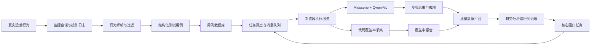

### **结论：这是一套将“真实运营行为”转化为“可执行 E2E 用例”，再通过 AI 回放、代码覆盖率和数据看板形成质量闭环的测试体系。**

它要解决的不是单纯“让 AI 点击页面”，而是把测试从人工编写、静态维护、结果孤立，升级为：

> **真实行为采集 → 用例自动生成 → AI 自适应执行 → 覆盖率评估 → 数据运营决策 → 核心用例持续回归**

---

### **一、问题本质：为什么需要这套方案**

#### **1. 业务和技术变化带来的测试压力**

得物后台系统持续经历 Vue、React、全栈等技术栈迁移，页面重构和功能迭代频繁发生。由此产生四个根本问题：

| 问题 | 本质 |
|---|---|
| 用例覆盖不足 | 测试资产无法同步真实业务行为 |
| 用例维护成本高 | 页面 DOM 和元素结构变化会使定位失效 |
| 回归效率低 | 人工操作或手工编写脚本难以支持快速迭代 |
| 测试价值难衡量 | 只有成功或失败，缺少覆盖率、业务热度等指标 |

因此，传统测试方式的核心矛盾是：

> **业务变化速度 > 用例生产和维护速度。**

---

### **二、目标定义：这套系统到底要做什么**

#### **What：系统目标**

系统围绕四个目标设计：

1. **自动生成用例**：从线上内部运营行为中提取真实业务流程。
2. **降低维护成本**：页面 UI 发生变化时，尽可能通过视觉和语义理解自动适应。
3. **提高执行效率**：支持人工、定时任务和 CI/CD 事件触发。
4. **形成质量闭环**：通过执行结果、代码覆盖率和页面访问热度衡量测试价值。

其核心不是追求“AI 自动化”本身，而是建立一套：

> **来源可信、执行稳定、结果可解释、价值可衡量的自动化测试资产体系。**

#### **Why：为什么选择真实运营行为**

传统用例通常来自测试人员对需求的理解，存在三个偏差：

- 可能遗漏真实业务中的高频操作；
- 可能过度关注理想流程，忽略实际使用路径；
- 用例优先级依赖人工判断，难以与页面真实访问热度对应。

运营日志具有更强的业务真实性，能够反映：

- 用户实际访问了哪些页面；
- 哪些操作经常发生；
- 哪些页面承担关键业务链路；
- 真实操作的顺序、输入和交互关系。

因此，系统采用：

> **线上行为负责提供场景，AI 负责转化与执行，覆盖率负责衡量价值。**

---

### **三、核心概念：系统中的关键对象**

#### **1. E2E 测试**

E2E，即端到端测试，从用户视角验证完整业务流程，而不是只验证单个函数或组件。

例如：

> 登录 → 进入订单列表 → 点击新建 → 填写表单 → 选择商品 → 提交订单

它能够验证页面、接口、状态管理、权限和业务流程之间是否协同正常。

#### **2. AI E2E**

AI E2E 在传统浏览器自动化之上增加了：

- 视觉识别；
- 语义理解；
- 动态元素定位；
- 智能等待；
- 异常判断；
- 多轮重试；
- 对 UI 变化的适应能力。

传统方式回答的是：

> “这个元素的 XPath 是什么？”

AI E2E 回答的是：

> “当前页面上哪个元素符合‘提交订单按钮’这一意图？”

#### **3. 代码覆盖率**

代码覆盖率用于判断用例执行是否真正触达页面代码：

$$
页面代码覆盖率 =
\frac{用例执行过程中运行的代码行数}
{页面关联的全部代码行数}
\times 100\%
$$

它弥补了“步骤执行成功”这一指标的不足。

一个用例即使所有点击都成功，也可能没有覆盖关键逻辑。因此需要同时关注：

- **步骤执行成功率**：操作是否完成；
- **代码覆盖率**：是否触达足够多的代码；
- **页面访问热度**：是否覆盖重要业务页面。

---

### **四、方案演进：为什么从传统 DOM 测试转向 AI E2E**

#### **1. 传统 DOM E2E 的工作机理**

传统方式依赖：

- XPath；
- CSS Selector；
- DOM 层级；
- 固定文本；
- 录制或手写脚本。

典型脚本逻辑是：

```text
找到 XPath=/button[3]
点击
找到 CSS=.form-item:nth-child(2) input
输入内容
```

#### **2. 传统方式的根本缺陷**

它依赖的是页面结构，而不是用户意图。

当页面发生以下变化时，脚本可能失效：

- 元素层级调整；
- CSS 类名变化；
- Vue 重构为 React；
- 组件封装方式变化；
- 按钮位置调整；
- 页面增加弹窗或加载状态。

因此，传统方式存在明显的脆弱性：

> **UI 结构发生微小变化，测试资产就需要人工维护。**

#### **3. AI E2E 的改进机理**

AI E2E 使用多种信号识别目标元素：

- 截图中的视觉位置；
- DOM 结构；
- 元素文本；
- 按钮和图标语义；
- 当前页面上下文；
- 操作步骤描述。

例如，将“点击提交按钮”转化为：

```text
读取当前页面
识别所有可能的提交控件
结合文本、位置、样式和上下文判断目标
执行点击
确认页面状态是否发生预期变化
```

这使定位逻辑从“结构绑定”转向“意图绑定”。

#### **4. AI E2E 并非全面替代传统自动化**

AI 方案也存在边界：

- 模型决策存在不确定性；
- 视觉分析会产生 Token 和算力成本；
- 失败原因可能不如确定性脚本直观；
- 复杂业务逻辑仍需要代码控制；
- 模型输出需要重试、兜底和校验。

因此更合理的原则是：

> **AI 负责不确定的感知和定位，规则与代码负责确定的控制和验证。**

---

### **五、工具选型：为什么选择 Midscene + Qwen2.5-VL-72B**

#### **1. Midscene 的定位**

Midscene 是 AI 驱动的 UI 自动化工具，提供：

- JavaScript 技术栈；
- WebExtensions API；
- Playwright 和 Puppeteer 支持；
- DOM 分析；
- 视觉分析；
- 多模态模型接入能力。
![[Pasted image 20260808163933.png]]

#### **2. 与 browser-use 的比较**

| 维度 | Midscene | browser-use |
|---|---|---|
| 主要技术栈 | JavaScript | Python |
| 浏览器基础 | Playwright、Puppeteer | Playwright |
| 页面理解 | DOM、视觉 | DOM、视觉 |
| 工程适配 | 更适合前端团队 | 需要 Python 能力 |
| 定制方式 | 便于前端扩展 | 能力较完整 |
| 主要成本 | 模型调用和 Token | 模型调用和 Token、语言栈迁移 |

#### **3. 选型结论**

选择 Midscene 的原因不是单一的模型效果，而是整体工程适配性：

- 与现有 JavaScript 技术栈一致；
- 更容易接入前端工程和既有工具链；
- 支持 Playwright、Puppeteer 进行确定性控制；
- 同时支持 DOM 和视觉输入；
- 便于增加重试、兜底和业务规则；
- 更利于平台化和长期维护。

Qwen2.5-VL-72B 主要负责：

- 识别页面视觉元素；
- 理解操作指令；
- 结合截图和上下文定位目标；
- 判断弹窗、加载、错误等页面状态。

---

### **六、总体架构：系统如何形成闭环**

![[Pasted image 20260808163843.png]]

核心流程可以概括为：将运营真实操作记录转化为可执行的测试用例，并通过智能化的方式在测试环境中回放验证。具体实现链路分为四个阶段：
![[Pasted image 20260808164047.png]]

系统可以拆分为五层：



其中，每一层解决一个独立问题：

| 层次 | 解决的问题 |
|---|---|
| 行为采集层 | 测试场景从哪里来 |
| 用例生产层 | 如何从日志生成脚本 |
| 调度层 | 什么时候执行、执行哪些用例 |
| AI 执行层 | 如何适应页面并完成操作 |
| 数据运营层 | 如何判断质量和用例价值 |

---

### **七、阶段一：从行为记录生成可执行用例**

#### **What：输入是什么**

输入是监控系统中的会话级链接或日志数据，包含运营人员在真实环境中的：

- 页面访问；
- 点击行为；
- 输入行为；
- 选择行为；
- 页面跳转；
- 操作顺序；
- 会话上下文。

#### **Why：为什么需要行为解析**

原始操作日志通常包含大量噪声，例如：

- 快速连续点击；
- 心跳事件；
- 无业务含义的页面刷新；
- 重复操作；
- 异常中断；
- 与核心流程无关的辅助动作。

如果直接将日志转换成脚本，会造成：

- 用例步骤冗余；
- 执行不稳定；
- 用例数量膨胀；
- 业务流程不清晰；
- 后续维护困难。

因此必须先进行行为清洗和语义抽象。

#### **How：处理过程**

##### **第一步：数据接入**

系统接收监控系统中的会话链接，并通过接口拉取完整操作日志。

##### **第二步：行为过滤**

过滤无效事件，保留具备业务意义的原子操作：

```text
访问页面
点击按钮
输入内容
选择选项
打开弹窗
提交表单
页面跳转
```

##### **第三步：流程识别**

将离散事件组合成业务流程：

```text
访问订单列表页
→ 点击“新建”
→ 在商品名称输入框输入“X”
→ 在商品类型下拉框选择“Y”
→ 点击“提交”
```

##### **第四步：脚本转换**

将流程转换为结构化用例，每个步骤包括：

| 字段 | 作用 |
|---|---|
| 操作类型 | click、input、select 等 |
| 元素描述 | 提交按钮、商品名称输入框 |
| 操作值 | 输入文本或选择值 |
| 上下文断言 | 页面状态或结果验证 |
| 页面信息 | 页面地址、业务域等 |
| 来源信息 | 原始运营会话 |

##### **第五步：用例入库**

系统为用例生成唯一 ID，并记录：

- 来源会话；
- 所属页面；
- 业务域；
- 负责人；
- 生成时间；
- 当前状态；
- 标签；
- 执行历史。

初始状态为“已生成”。

#### **阶段一的改进价值**

它实现了三项转变：

1. **从人工设计场景转向真实行为驱动。**
2. **从原始操作记录转向结构化业务流程。**
3. **从一次性脚本转向可管理的测试资产。**

---

### **八、阶段二：从静态用例转化为动态执行任务**

#### **What：调度层做什么**

用例本身只是静态资产，必须根据触发条件转化为执行任务。

#### **Why：为什么需要独立调度层**

如果直接执行用例，会出现：

- 测试执行与业务系统耦合；
- 无法支持批量运行；
- 高峰时资源竞争；
- 无法进行优先级控制；
- 难以接入 CI/CD。

因此需要任务调度和队列机制。

#### **How：三种触发方式**

##### **1. 人工触发**

测试或开发人员在用例列表中选择一个或多个用例并执行，适合：

- 问题复现；
- 单用例调试；
- 临时回归；
- 重构验证。

##### **2. 定时触发**

针对核心场景执行每日或每个构建周期的回归，适合：

- 稳定性巡检；
- 夜间回归；
- 高频业务链路验证。

##### **3. 事件触发**

接入 CI/CD，在以下事件发生后自动执行：

- 代码合并；
- 特定分支构建；
- 页面发布；
- 生产环境变更。

#### **队列机制的作用**

任务触发后：

```text
用例状态：已生成
→ 待执行
→ 执行中
→ 执行成功 / 执行失败
```

任务进入执行队列，由后台服务异步消费。

队列解决了：

- 流量削峰；
- 异步执行；
- 并发调度；
- 失败重试；
- 任务状态追踪；
- 执行资源隔离。

---

### **九、阶段三：AI 如何在浏览器中执行用例**

这是整套方案的技术核心。

#### **1. 环境初始化**

执行服务消费任务后：

1. 启动无头浏览器；
2. 注入 Midscene；
3. 加载 Qwen2.5-VL-72B；
4. 初始化测试环境；
5. 加载代码覆盖率插桩工具；
6. 读取用例步骤。

#### **2. 感知—理解—行动闭环**

AI 执行过程可以抽象为：

```text
当前页面截图 + DOM 状态 + 操作指令
→ 识别页面元素
→ 理解用户意图
→ 定位目标元素
→ 执行点击、输入、选择或滚动
→ 判断执行结果
→ 继续下一步或进入异常处理
```

例如：

```text
指令：点击登录按钮

AI 输入：
- 当前页面截图
- DOM 信息
- 页面 URL
- 当前步骤语义

AI 判断：
- 哪个控件最符合“登录按钮”
- 是否被弹窗遮挡
- 是否需要等待页面加载
- 点击后是否发生跳转

执行：
- 点击目标控件
- 记录结果
- 截图
- 进入下一步骤
```

#### **3. 自适应机制**

系统重点设计了四种适应能力：

##### **智能等待**

不使用固定的机械等待，而是等待：

- 元素出现；
- 页面加载完成；
- 弹窗稳定；
- 网络请求结束；
- 页面状态满足条件。

##### **多轮定位**

首次找不到目标时，系统可以：

- 重新分析页面；
- 使用 DOM 方式定位；
- 使用视觉方式定位；
- 基于语义重新匹配；
- 调整定位范围。

##### **滚动查找**

如果元素不在当前视口：

1. 分析当前页面；
2. 执行滚动；
3. 重新截图；
4. 重新定位；
5. 继续执行。

##### **异常判断与重试**

识别并处理：

- 弹窗；
- 网络错误；
- 页面加载异常；
- 元素暂时不可见；
- 操作未生效；
- 页面状态不符合预期。

#### **4. 为什么需要规则引擎和 AI 结合**

完全依赖 AI 会增加不确定性，完全依赖规则又无法适应 UI 变化。因此采用混合机制：

| 场景 | 更适合的方式 |
|---|---|
| 固定 URL、权限、环境初始化 | 规则和代码 |
| 精确接口调用 | 规则和代码 |
| 页面元素定位 | AI 视觉和语义 |
| 复杂交互流程 | AI + Playwright/Puppeteer |
| 结果校验 | 断言规则优先，AI 辅助 |
| 异常重试 | 规则策略 + AI 判断 |

核心原则是：

> **把 AI 用在高不确定性环节，把代码用在高确定性环节。**

#### **5. 执行结果记录**

每一步都记录：

- 操作类型；
- 执行状态；
- 错误信息；
- 页面截图；
- 当前 URL；
- 执行耗时；
- 单步代码覆盖率；
- AI 定位结果；
- 重试次数。

最终记录：

- 用例成功或失败；
- 总执行时长；
- 所有步骤结果；
- 截图证据链；
- 整体代码覆盖率；
- 原始运营会话链接。

这样可以将失败从“黑盒状态”转化为“可复盘证据”。

---

### **十、代码覆盖率为什么是硬指标**

#### **1. 仅看成功率存在误导**

“步骤执行成功”只说明：

- 点击动作完成；
- 输入动作完成；
- 页面没有明显阻塞。

但它不能证明：

- 关键业务逻辑被触发；
- 页面核心代码被执行；
- 不同状态分支被覆盖；
- 用例对回归真正有价值。

#### **2. 覆盖率的作用**

代码覆盖率可以用于：

- 评估用例有效性；
- 识别低价值用例；
- 发现覆盖薄弱页面；
- 筛选核心回归用例；
- 指导新增测试场景。

#### **3. 覆盖率采集过程**

```text
执行前加载插桩工具
→ 每一步收集运行代码信息
→ 执行结束后合并数据
→ 生成页面级覆盖率
→ 与用例、页面和历史结果关联
```

#### **4. 覆盖率的边界**

代码覆盖率不是质量的充分条件：

- 覆盖到代码不代表断言正确；
- 行覆盖率高不代表分支覆盖率高；
- 页面覆盖率高不代表接口和数据质量高；
- AI 操作成功不代表业务结果正确。

因此，它更适合成为“用例价值指标”，而不是唯一质量标准。

---

### **十一、阶段四：从执行结果到质量决策**

#### **1. 页面维度看板**

页面看板整合：

- PV/UV；
- 用例数量；
- 历史成功率；
- 步骤成功率；
- 代码覆盖率；
- 业务域；
- 负责人。

它将业务热度和测试质量放在一起分析。

#### **2. 风险识别逻辑**

可以建立以下判断：

| 现象 | 可能结论 |
|---|---|
| UV 高、成功率低 | 高业务风险页面 |
| UV 高、覆盖率低 | 覆盖不足页面 |
| UV 低、覆盖率高 | 可能投入过度 |
| 成功率高、覆盖率低 | 可能是低价值用例 |
| 成功率持续下降 | 页面稳定性退化 |
| 偶发失败增多 | 环境、时序或定位策略存在问题 |

#### **3. 用例列表管理**

用例列表支持：

- 按业务域筛选；
- 按负责人筛选；
- 按成功率筛选；
- 按标签筛选；
- 查看来源会话；
- 查看执行历史；
- 执行和删除用例；
- 添加备注与人工标签。

标签可以包括：

- 稳定用例；
- 偶发失败；
- 需重构；
- 核心回归；
- 低价值用例。

#### **4. 执行详情下钻**

失败步骤需要展示：

- 失败位置；
- 错误堆栈；
- 错误描述；
- 页面截图；
- 当前页面地址；
- 单步覆盖率；
- 原始监控链接；
- AI 执行上下文。

这形成了：

> **线上行为 → 自动化步骤 → 执行结果 → 页面证据 → 覆盖率数据**

的完整证据链。

#### **5. 资产治理**

系统可以识别：

- 执行成功但覆盖代码很少的用例；
- 长期失败且无人维护的用例；
- 重复覆盖相同代码的用例；
- 高频页面但缺少用例的场景；
- 成功率持续下降的页面。

经过人工复核后：

- 稳定且高价值的用例进入核心回归集；
- 低价值用例被清理或合并；
- 偶发失败用例进入稳定性治理；
- 覆盖不足页面补充场景。

---

### **十二、方案中的主要改进及其原因**

| 改进 | 原有问题 | 改进原因 | 产生结果 |
|---|---|---|---|
| 运营行为生成用例 | 手工设计易遗漏 | 真实行为更接近实际业务 | 提高场景真实性 |
| 行为过滤与抽象 | 原始日志噪声多 | 避免生成冗余步骤 | 提升执行稳定性 |
| AI 语义和视觉定位 | DOM 变化导致失效 | 从结构定位转向意图定位 | 降低维护成本 |
| Midscene + 规则代码 | 完全 AI 不稳定 | 让确定性逻辑由代码控制 | 平衡灵活性与可靠性 |
| 异步任务队列 | 执行资源容易拥堵 | 解耦触发和执行 | 支持并发和削峰 |
| 智能等待与多轮重试 | 页面时序不稳定 | 应对加载、弹窗和网络异常 | 提高执行成功率 |
| 代码覆盖率 | 成功率无法衡量价值 | 检查是否真正触达代码 | 识别低价值用例 |
| 页面数据看板 | 结果孤立难决策 | 关联业务热度和质量指标 | 指导资源优先级 |
| 截图和步骤证据 | AI 失败难调试 | 将黑盒失败证据化 | 降低问题定位成本 |
| 核心用例沉淀 | 用例越积越多 | 通过数据筛选高价值资产 | 形成持续回归防线 |

---

### **十三、方案的核心学习框架**

#### **1. 定义**

这是一套 AI 驱动的、基于真实运营行为的端到端测试平台。

#### **2. 机理**

通过视觉、语义、DOM 和代码控制共同完成：

```text
理解页面
→ 定位元素
→ 执行操作
→ 判断状态
→ 记录证据
```

#### **3. 边界**

它适合：

- 页面交互回归；
- 后台系统重构验证；
- 高频业务流程；
- UI 变化较多的页面；
- 需要真实操作链路的场景。

它不适合单独承担：

- 精确单元测试；
- 高复杂度后端逻辑验证；
- 强确定性的金融计算校验；
- 全部接口和数据一致性测试；
- 仅依靠视觉判断的关键安全决策。

#### **4. 方法**

完整方法是：

```text
采集真实行为
→ 清洗与抽象流程
→ 生成结构化用例
→ 任务化调度
→ AI 自适应执行
→ 采集截图、错误和覆盖率
→ 看板分析
→ 人工复核
→ 沉淀核心回归集
```

---

### **十四、以母题驱动的证据闭环理解**

#### **母题一：如何降低测试资产维护成本**

证据链：

```text
技术栈迁移和 UI 重构频繁
→ XPath/CSS 选择器易失效
→ 视觉和语义定位增强适应性
→ Midscene + Qwen-VL 处理动态元素
→ 规则代码承担确定性操作
→ 降低维护成本
```

#### **母题二：如何让用例更贴近真实业务**

证据链：

```text
手工用例可能遗漏真实高频路径
→ 运营日志记录真实访问和交互
→ 行为解析提取业务原子操作
→ 自动生成回归用例
→ 提升场景真实性和覆盖范围
```

#### **母题三：如何让 AI 测试可解释**

证据链：

```text
AI 决策具有黑盒性
→ 每一步记录截图、错误、URL 和覆盖率
→ 执行详情保留完整步骤证据
→ 失败能够回放和下钻
→ 黑盒结果转化为可复盘证据链
```

#### **母题四：如何衡量用例真正有价值**

证据链：

```text
操作成功不代表覆盖充分
→ 增加代码覆盖率指标
→ 结合页面 PV/UV 和成功率
→ 识别高风险页面及低价值用例
→ 筛选核心回归资产
```

#### **母题五：如何让自动化测试持续运行**

证据链：

```text
静态脚本无法自动产生持续价值
→ 支持人工、定时、CI/CD 事件触发
→ 任务进入异步队列
→ 后台服务持续消费执行
→ 结果进入质量平台
→ 核心用例形成自动巡检
```

---

### **十五、方案的关键指标体系**

建议将指标分为四类：

#### **业务覆盖指标**

- 页面覆盖数；
- 高 PV 页面覆盖率；
- 核心业务流程覆盖率；
- 运营行为转化为用例的比例。

#### **执行质量指标**

- 用例成功率；
- 步骤执行成功率；
- AI 元素定位成功率；
- 平均重试次数；
- 平均执行耗时；
- 并发执行能力。

#### **代码与测试价值指标**

- 页面代码覆盖率；
- 分支覆盖率；
- 单用例新增覆盖率；
- 低覆盖成功用例比例；
- 重复覆盖用例比例。

#### **工程效率指标**

- 用例生成耗时；
- 用例维护耗时；
- 失败定位耗时；
- UI 重构后的用例修复量；
- 自动化回归节省的人力；
- 核心用例长期稳定率。

---

### **十六、仍需改进的方向**

文章已经完成了从采集到执行的闭环，但从工程化角度仍有几个需要加强的地方。

#### **1. 增加明确的断言体系**

目前描述重点集中在“是否完成操作”，还应强化：

- 页面结果断言；
- 数据状态断言；
- 接口响应断言；
- 权限断言；
- 业务规则断言；
- 前后状态对比。

否则可能出现“点击成功，但业务实际失败”的误判。

#### **2. 增加环境和数据治理**

E2E 稳定性不仅取决于定位能力，还取决于：

- 测试账号；
- 测试数据；
- 数据清理；
- 权限状态；
- 外部依赖；
- 网络环境；
- 服务版本。

需要建立可重复的测试数据和环境初始化机制。

#### **3. 建立模型评估体系**

不能只看最终用例成功率，还应评估：

- 元素定位准确率；
- 错误定位率；
- 重试后成功率；
- 误操作率；
- Token 消耗；
- 单用例成本；
- 不同页面类型的模型效果。

#### **4. 建立风险分级策略**

并非所有操作都应该交给 AI 自主完成。应根据风险划分：

- 低风险页面：AI 自主执行；
- 中风险页面：AI 执行、规则校验；
- 高风险操作：人工确认或固定脚本；
- 关键数据变更：禁止模型自由探索。

#### **5. 加强用例去重和版本管理**

真实日志可能生成大量相似用例，需要支持：

- 行为序列相似度去重；
- 页面和业务域聚类；
- 用例版本管理；
- 页面变更影响分析；
- 用例失效自动识别。

#### **6. 进一步利用覆盖率做场景推荐**

覆盖率不应只用于事后统计，还可以反向驱动用例生成：

```text
发现未覆盖代码分支
→ 结合真实行为和页面结构寻找缺口
→ 推荐新的输入或操作路径
→ 生成补充用例
→ 再次执行并验证覆盖提升
```

这样可以从“覆盖率统计”升级到“覆盖率驱动测试生成”。

---

### **十七、最终抽象**

这套方案的第一性原理可以压缩为四句话：

1. **测试场景必须来自真实业务，而不是只来自测试人员的想象。**
2. **UI 自动化应理解用户意图，而不是绑定脆弱的页面结构。**
3. **AI 负责感知和适应，代码负责确定性控制和验证。**
4. **测试结果必须转化为覆盖率、风险和资产治理决策。**

因此，方案的真正创新点不是单独使用 Midscene 或 Qwen-VL，而是完成了测试体系的四次升级：

```text
从手工编写到行为生成
从 DOM 绑定到语义定位
从脚本执行到任务调度
从结果记录到质量运营
```

其最终目标是让 E2E 测试不再只是一次性的自动化脚本，而成为能够持续吸收真实业务行为、自动执行、自动评估并持续优化的质量基础设施。
