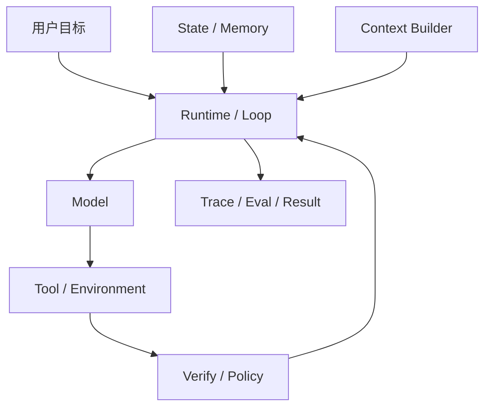
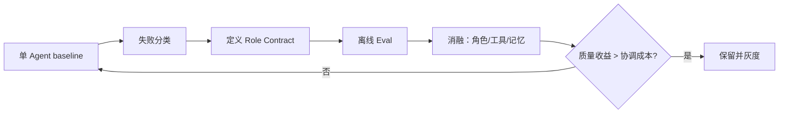
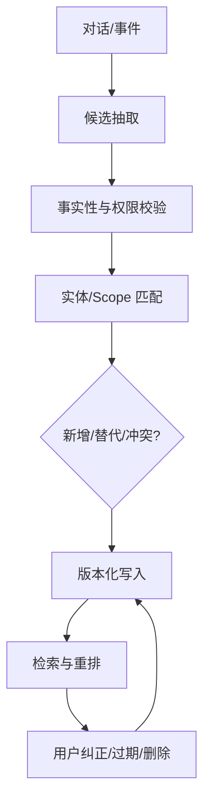
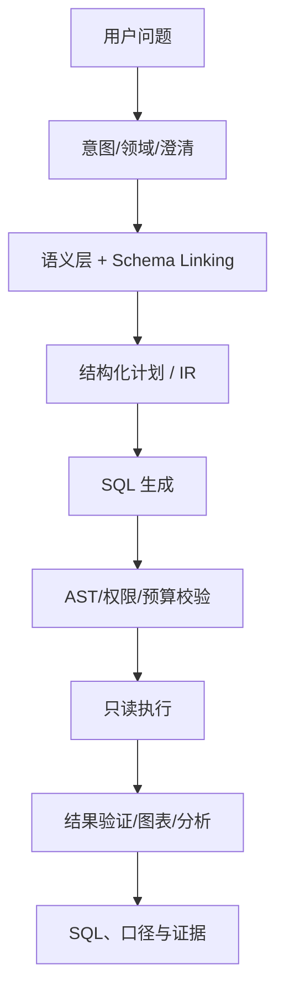
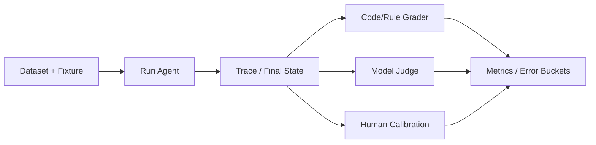
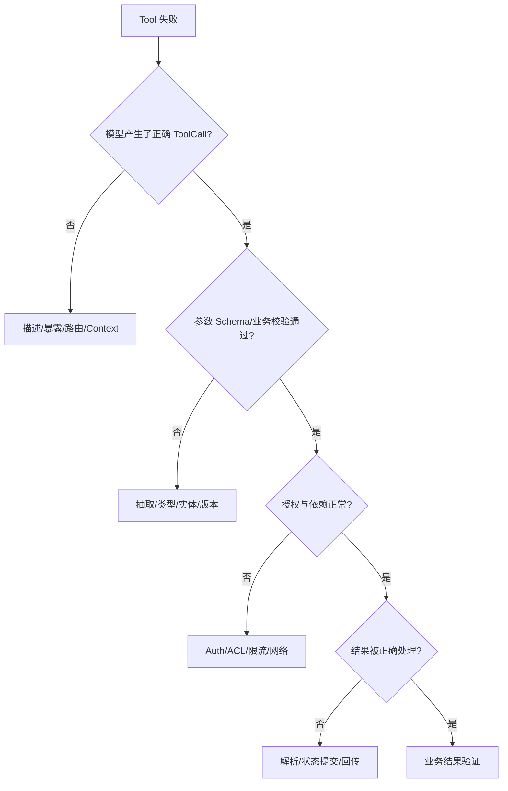
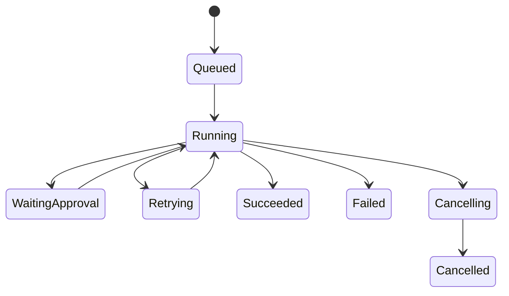
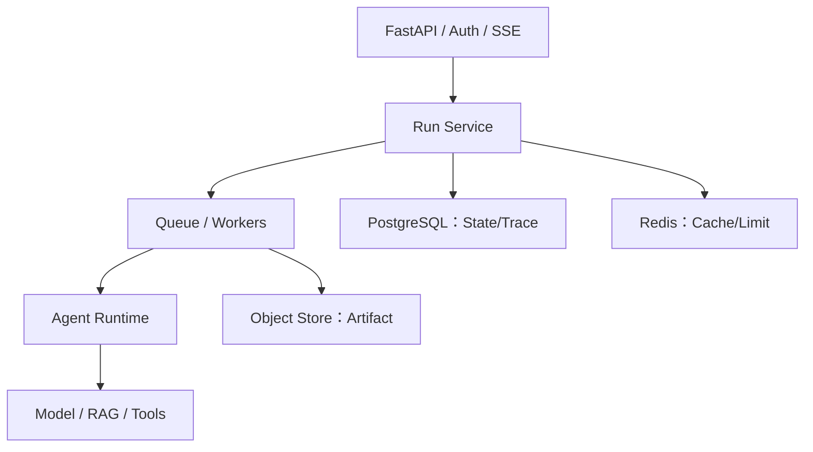
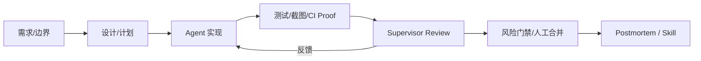

# 13｜字节 AI Agent 面试：知识点与分层回答手册

> 配套：[12｜字节 × Grok Bot × 多来源融合面经](12-字节与GrokBot-多来源融合面经.md)  
> 目标：不背 100 道散题，用 18 个母题覆盖项目深挖、Agent Layer、Data Agent、排障、后端和条件性算法分流。

---

## 0. 使用方式与学习边界

### 0.1 三轮学习

1. **第一轮建图**：只读每题的关键词、15 秒和 60 秒回答；
2. **第二轮补证**：把母题分别迁移到 RuleArena、EnergyOps、数驭穹图；
3. **第三轮面试**：随机追问，直到暴露“知识缺、组织差、无证据”。

### 0.2 回答统一结构

```text
问题是什么 → 第一性原理 → 主设计/主链路 → 失败与边界
→ 指标与验证 → 我的项目证据
```

### 0.3 诚实边界

- 微调、LoRA、MATH Dataset：可以讲原理和实验设计，不声称自己做过；
- 多 Agent、长期记忆、高并发：没有 baseline/Eval/压测就不说“显著提升”；
- Grok Bot 文章中的 200+ Agent、2000+ PR 是作者陈述，不作为通用生产性能结论；
- 不可访问的模型内部隐式推理不能假装完整审计，工程上关注可观察的决策摘要、Tool/State/Artifact 与验证证据。

---

## 1. 开场：自我介绍与项目选择

### 关键词

AI 应用开发、Python 后端、真实业务、可信执行、数据/规则、Agent Runtime、RAG、Eval。

### 60 秒版本

> 面试官您好，我是刘宇广，27 届数据科学与大数据技术专业，方向是 AI 应用开发和 Agent 后端。我的优势不是单纯做 Prompt Demo，而是把模型接入真实数据、工具和后端系统。实习中我用 FastAPI、PostgreSQL、Redis 等完成园区 EnergyOps，从能耗数据质量、异常告警到月度账单对账，并设计了 30 个 MCP 工具和风险分级。个人项目 RuleArena 聚焦多 Agent 规则审查与可执行状态验证，用确定性程序检查非法状态，并补充 checkpoint、Eval、Trace 和人工审批。数驭穹图则解决可信 NL2SQL/NL2BI，包括领域路由、Schema Linking、SQL 安全、权限和证据绑定。我希望继续深入 Agent Runtime、评测和高可靠 Python 后端，把 AI 能力真正落进业务闭环。

### 选择哪个项目回答

| 面试官问题 | 首选项目 |
| --- | --- |
| Agent Layer / Role / Multi-Agent | RuleArena |
| Tool / MCP / 任务恢复 / 后端 | EnergyOps |
| RAG / Data Agent / SQL | 数驭穹图 |
| 鉴权 / 订单 / 支付 / 一致性 | Ovanta |

### 追问保护

项目介绍主动限定：哪些已实现、哪些是当前升级、哪些只做了离线/模拟验证。这样比被追问后承认夸大更可信。

---

## 2. 母题 01：如何理解 Agent / Agent Layer？

### 关键词

Model、Context、State、Tools、Loop、Policy、Verify、Runtime、Eval。

### 15 秒

> Agent 是模型根据环境反馈动态选择下一动作的闭环；Agent Layer 是模型之外负责上下文、状态、工具执行、约束、验证、恢复和观测的运行系统。

### 60 秒标准回答

> 我把 Agent 分成四层。第一层是模型决策；第二层是 Context 和 State，负责每一步给模型正确目标、权威状态、证据和工具；第三层是 Runtime，运行 observe—decide—act—verify 循环，管理预算、终止、暂停、checkpoint 和恢复；第四层是 Assurance，包括权限、人工审批、Eval、Trace、灰度和成本治理。与 Workflow 的区别是 Workflow 的路径由代码预定义，Agent 的下一步由模型根据反馈动态决定。生产中通常外层用状态机保证业务阶段，内部只在动态节点运行 Agent。

### 架构图



### 深入知识

| 层 | 典型问题 | 工程机制 |
| --- | --- | --- |
| Model | 选什么模型、输出不稳定 | 路由、Schema、版本 |
| Context | 信息缺失、冲突、过长 | 选择、压缩、隔离、检索 |
| State | 进程重启、状态错乱 | DB、version、checkpoint |
| Tool | 选错、参数错、重复执行 | Contract、授权、幂等 |
| Runtime | 循环、卡死、无法取消 | 预算、状态机、deadline |
| Assurance | 不知道好坏、无法追责 | Eval、Trace、HITL、审计 |

### 高频追问

**为什么不是所有流程都用 Agent？**  
固定且可枚举路径用程序更便宜、更可测；动态取证和开放任务才使用 Agent。

**什么是 Harness？**  
Harness 是包围模型的上下文、工具、环境、约束、验证与纠正机制，是 Agent Layer 的核心实现形态。

### 项目证据

RuleArena：外层规则审查状态机；内层不同角色做动态取证；确定性状态验证作为 oracle；发布修复进入审批。

---

## 3. 母题 02：怎样定义和调优 Agent Role？

### 第一性原理

Role 的目的不是让模型“更像某种人”，而是降低决策空间、上下文噪声和权限风险，让一个长期 owner 对可重复结果负责。

### Role Contract

```yaml
role: state_validator
owns: executable_rule_validation
goal: find reachable illegal states with reproducible traces
inputs: rule_version, evidence_refs, state_model
tools: [read_rule, run_sandbox_validator]
memory_scope: validation_patterns
output: finding_schema_v2
must_not: [publish_rule, modify_source]
stop_when: tests_complete_or_budget_exhausted
approval: none_read_only
metrics: [high_risk_recall, false_positive_rate, reproducibility]
```

### 60 秒标准回答

> 我不会只用 persona Prompt 定义角色，而是把 Role 设计为运行契约：长期负责什么结果、输入输出 Schema、可见上下文、可用工具、记忆范围、禁止动作、终止条件、审批边界和指标。调优从单 Agent baseline 开始，按失败类型判断是职责重叠、上下文噪声、工具误选还是交接丢失，再调整边界、Prompt、工具或记忆。每次只改一个变量，用任务成功率、角色路由准确率、重复工作、冲突率、P95 和成本做消融。没有可测收益就合回单 Agent。

### Role 调优流程



### Grok Bot 洞见

- iOS、Desktop、Infra、Android、Harness Bot 按长期领域 owner 划分；
- 每个 Bot 有不同工作上下文和记忆，有限 Context 反而推动专注；
- 官方文档建议 Role 同时定义目标/领域、工具/来源、工作方式、审批边界和周期；
- 多 Bot 共享云电脑，说明组织上的 Role 并不是权限安全边界。

### 面试陷阱

> “让三个 Agent 分别扮演产品、开发、测试，所以效果更好。”

缺少 Role Contract、不同信息/工具、baseline 和消融，无法证明。

### 项目迁移

RuleArena 应把角色写成 `Evidence Worker / State Validator / Risk Reviewer / Merger / Publisher`，其中 Publisher 单独持有 R2 权限。

---

## 4. 母题 03：多 Agent 如何协作和对齐？

### 关键词

Orchestrator、Handoff、Artifact、Shared State、Owner、Merge、Conflict、Budget。

### 60 秒标准回答

> 多 Agent 只在上下文隔离、权限隔离、并行或能力差异有收益时使用。我会用 Orchestrator 生成结构化子任务，每个 Worker 只拿必要 Context，通过 Handoff Schema 接收任务，并返回结论、证据、未知项和 Artifact 引用。共享的是结构化任务状态和稳定 ID，不共享无限聊天历史；业务数据库仍是权威。聚合阶段按确定性规则、证据权威和新鲜度处理冲突，高风险冲突交人工。一个 Worker 失败时局部重试或返回部分结果，父 Run 有最大 fan-out、deadline 和成本预算。最后用单 Agent baseline 比较成功率、P95、Token、重复率和冲突率。

### Handoff Schema

```json
{
  "task_id": "review:rule-17:permission",
  "owner_role": "permission_reviewer",
  "input_refs": ["rule://17/v4", "evidence://case-22"],
  "required_output_schema": "finding_v2",
  "acceptance": ["evidence_required", "severity_required"],
  "deadline": "...",
  "budget": {"steps": 6},
  "allowed_tools": ["read_rule", "search_case"]
}
```

### Data Agent 怎样避免瞎传字段

不要传 `“销售额字段”` 这类自由文本，传稳定契约：

```json
{
  "metric_id": "gmv_v3",
  "table_id": "fact_order_v5",
  "column_ids": ["paid_amount", "paid_at"],
  "grain": "shop_day",
  "filters": [{"field_id": "status", "op": "=", "value": "paid"}],
  "schema_version": 18
}
```

执行前校验 ID、版本、类型、粒度和权限；不认识的字段 fail fast，不让模型猜。

### Grok Bot 两级架构

工程 Bot 是 Supervisor，Cursor Cloud Agent 是 Worker。Supervisor 不只派任务，还持续读取 transcript、CI、截图等 Proof，追加提示或中断。这比一次性分派多了运行时监督闭环。

---

## 5. 母题 04：Context、State、Memory 怎样分层？

### 对照表

| 对象 | 定义 | 权威性 | 生命周期 |
| --- | --- | --- | --- |
| Context | 本次模型调用可见 Token | 临时投影 | 一次调用 |
| Run State | 节点、计划、预算、产物、终止 | 运行权威 | 一次 Run |
| Business State | 订单、规则、权限、账单 | 最高权威 | 业务长期 |
| Short-term Memory | 当前 Thread 需延续的内容 | 派生 | 会话 |
| Long-term Memory | 跨会话稳定且获准复用的信息 | 派生/可治理 | 用户/组织长期 |

### 60 秒标准回答

> Context 是一次模型调用看到的视图，State 是结构化运行事实，Memory 是跨步骤或会话复用的信息，业务数据库则保存最高权威状态。我会把系统规则、当前目标、权威状态、RAG 证据、Tool Schema、近期轨迹和长期记忆按相关性与可信度动态装配，而不是塞全部历史。长会话用滑窗、摘要、Artifact 外置和按步骤检索；恢复时从 checkpoint 和业务状态重建 Context。长期记忆只保存稳定、有来源、获授权、能删除的信息，不能把模型猜测自动写成用户事实。

### 小模型/短 Context 如何完成复杂任务

1. 外层 Workflow 分阶段，每次只解决一个子问题；
2. Context Builder 只加载当前步骤所需工具和证据；
3. 大结果写 Artifact，只返回摘要与引用；
4. 状态放数据库，不靠模型记住；
5. 子任务隔离，返回结构化结果；
6. 使用摘要/压缩与稳定前缀缓存；
7. 复杂/高风险任务再路由强模型。

### Grok Bot 为什么使用外部 Notion 状态

Bot 每 30 分钟检查任务库中的 PR 状态、CI 和冲突。数据库承担“任务现在怎样”的真相，聊天只用于当前决策，使任务规模不受单个 Context 窗口直接限制。

---

## 6. 母题 05：Memory 变化、冲突和过期怎么办？

### 核心判断

“用户原来去 B，现在改去 C”不是简单文本覆盖问题，而是要先判断语义：

- 新计划替代旧计划；
- 历史事件仍然真实，只是当前状态变化；
- 两条信息属于不同时间/场景；
- 新信息只是模型推测，不能更新；
- 用户在纠正错误记忆。

### 记忆记录

```json
{
  "memory_id": "m_12",
  "subject": "user",
  "predicate": "travel_destination",
  "value": "C",
  "scope": "trip_2026_10",
  "valid_from": "...",
  "valid_to": null,
  "status": "active",
  "source_event_id": "msg_88",
  "supersedes": "m_09",
  "confidence": 1.0,
  "confirmed_by_user": true
}
```

### 60 秒标准回答

> Memory 不应是一个不断覆盖的摘要。我会把用户明确陈述保存成带主体、谓词、作用域、有效期、来源和版本的记录。新信息到来时先做实体和作用域匹配：若是明确纠正，就把旧记录标为 superseded；若是状态变化，保留旧事件并生成新的 current state；若场景不同则并存；低置信推断不进入长期记忆。读取时优先 active、同 scope、更新且已确认的记录；冲突仍无法判断就询问用户。用户应能查看、修改和删除，所有更新进入审计与 Memory Eval。

### Memory Pipeline



### 评测

- write precision：不该写的是否被写；
- update/conflict accuracy；
- retrieval recall/precision；
- temporal correctness；
- cross-user isolation；
- user correction propagation；
- stale memory usage rate。

---

## 7. 母题 06：Tool、Skill、Workflow、Agent 有何区别？

### 15 秒

> Tool 是动作，Skill 是可复用方法，Workflow 是预定义路径，Agent 是动态决策者，MCP 是连接能力的协议。

### 60 秒标准回答

> Tool 封装一次查询或业务动作，要有 Schema、权限、错误、幂等和审计；Skill 保存完成一类任务的方法、步骤、验证和安全边界，可能组合多个 Tool；Workflow 用代码固定控制流，适合审批、发布和确定性业务；Agent 在路径无法完全预先枚举时，根据环境反馈动态选择 Skill/Tool。MCP 标准化 Client 与 Server 的能力发现和调用，但不替代授权和幂等。生产系统通常是 Workflow 管业务阶段，Agent 处理开放节点，Skill 复用经验，Tool 执行真实动作。

### 选型表

| 需求 | 首选 |
| --- | --- |
| 查询一张账单 | Tool |
| 复用每周审查方法 | Skill |
| 支付/发布审批 | Workflow |
| 跨多源动态排障 | Agent |
| 标准化连接外部系统 | MCP |

### Grok Bot 的正确顺序

一次真实任务 → 验证可靠 → 保存为 Skill → 安全样本测试 → 配置 Routine。不能先把未验证操作直接定时化。

---

## 8. 母题 07：怎样选模型？小模型如何保证效果？

### 第一性原理

选择目标不是“模型分最高”，而是约束下的成功任务成本：

\[
\max Quality \quad s.t.\quad P95 \le L,\ Cost \le C,\ Risk \le R
\]

### 60 秒标准回答

> 我先按任务分桶：结构化抽取、意图路由、复杂规划、代码、视觉和高风险决策需要的能力不同。用代表性 Eval 比较任务成功率、Tool 正确率、P95、Token、价格和稳定性，再按难度与风险路由。小模型不靠塞更多 Prompt，而靠外层 Workflow 分解、动态工具暴露、权威状态外置、结构化输出、RAG 和确定性验证。遇到低置信、连续失败或高风险任务升级强模型；Provider 故障时按能力降级，而不是返回伪成功。

### Model Router 输入

- task type / modality；
- context length；
- risk level；
- tool complexity；
- latency deadline；
- tenant budget；
- historical success by bucket；
- provider health。

### 面试追问：如何证明小模型可用？

同一数据集比较大模型 baseline 与小模型 + Harness，报告分桶成功率、P95、成本、升级率和严重错误；不能只比较 Token 单价。

---

## 9. 母题 08：如何设计生产级 RAG？

### 60 秒标准回答

> 我把 RAG 拆成离线摄取与在线查询。离线负责解析、结构化 Chunk、元数据、ACL、版本、Embedding 和关键词索引；在线带用户身份做 Query 理解，在权限过滤下进行 BM25 + Vector 混合召回，必要时 Query Rewrite/HyDE，再用 RRF 融合、Rerank、去重并按 Token 预算组装，最后生成逐项引用答案。证据不足或冲突时拒答。评测要拆开：检索用 Recall@K、MRR、nDCG，生成用 correctness、faithfulness、引用和拒答，线上再看任务成功、P95 和成本。

### Query Rewrite、HyDE、RRF

| 技术 | 作用 | 风险 |
| --- | --- | --- |
| Rewrite | 补全意图、拆子问题 | 改写偏离原问 |
| HyDE | 先生成假想答案，再用其向量召回 | 假想内容引入错误实体 |
| BM25 | 专名、编号、关键词 | 同义泛化弱 |
| Vector | 语义相似 | 稀有词/编号可能弱 |
| RRF | 用排名融合不同检索器 | 不直接利用绝对相关度 |
| Rerank | 精细判断候选相关性 | 增加延迟和成本 |

### 回答 HyDE 为什么使用

> 当短查询与文档表达差异大时，假想文档能把查询映射到更接近文档的语义空间；但它可能生成错误假设，所以要保留原 Query，与 BM25/Vector baseline 做分桶 Eval，而不是默认全量开启。

---

## 10. 母题 09：Data Agent 怎样生成可靠 SQL？

### 端到端链路



### 60 秒标准回答

> 我不会让模型拿全库 DDL 直接生成 SQL。先识别用户意图、业务域和指标口径，缺时间、粒度或主体就澄清；再从 Catalog/语义层召回受权限控制的表、字段、关系、指标和示例。模型先生成带稳定 ID 的结构化计划或 IR，再编译/约束成 SQL。执行前做 AST 只读、表列权限、Join、扫描量、行数、导出和函数白名单；在只读账号和超时预算下运行。执行成功后还要验证结果范围、聚合口径和证据，并返回 SQL、Schema 版本和 Run ID。评测覆盖 Schema Linking、执行正确、语义正确、安全和成本。

### 如何发现表和字段

- DB metadata：information_schema / catalog；
- DDL、注释、主外键、采样统计；
- ETL/查询血缘和历史 SQL；
- Owner 与业务术语；
- 定期快照和增量版本；
- 不自动把敏感样本值放入 Prompt。

### SQL 可靠性的四层

1. **语义层**：指标口径、粒度、实体关系；
2. **生成层**：受限 Schema、IR、示例；
3. **静态层**：Parser/AST/权限/资源预算；
4. **运行层**：只读事务、timeout、limit、结果验证与审计。

### 项目证据

数驭穹图可用“领域路由 → Schema Linking → SemQL/SQL → AST → 权限/扫描/导出 → 证据”回答。

---

## 11. 母题 10：如何搭建 Agent Eval？

### 60 秒标准回答

> 我从真实任务和 Bad Case 构造可重置环境，分为 dev、golden、holdout 和 adversarial。结果层测任务成功和最终业务状态，过程层测路由、检索、Tool 选择/参数、步骤和终止，工程层测 P95、成本、恢复率，安全层测越权、注入和重复副作用。能用代码和规则判断的先用确定性 grader，语义质量再用经过人工校准的模型 Judge。每次 Run 保存模型、Prompt、知识、Tool 版本和完整 Step Trace，支持固定工具结果或沙盒 Replay。变更先跑 CI Eval，再 shadow/canary，线上纠正经治理后回流数据集。

### Eval 架构



### Role 调优怎样测

- route accuracy；
- completion rate by role；
- cross-role conflict；
- duplicate work；
- handoff loss；
- task success；
- P95/Token；
- 单 Agent 消融。

### Grok Bot 式 Proof

任务完成定义不能是“Agent 说 done”，而是 CI 通过、截图符合前后对比、测试产物存在、PR 无合法阻断。视觉 Proof 可用多模态 Judge 初筛，但高风险仍需人工/确定性测试。

---

## 12. 母题 11：Tool 调用失败如何排查？

### 排障树



### 60 秒标准回答

> 我先用 trace_id 定位具体 Run/Step，不会先改 Prompt。第一层看模型是否选对 Tool、暴露的工具集合和描述；第二层看 JSON Schema、实体、版本和业务前置条件；第三层看授权、网络、超时、限流和下游错误；第四层看 Tool Result 是否正确解析、持久化并回到模型；最后查询权威业务状态确认真实结果。错误按 invalid、forbidden、retryable、conflict、unknown outcome 分类。读操作可有限重试，写超时先按业务幂等键查状态，不能盲重试。修复后把 Case 加入契约测试和 Eval。

### Trace 必须记录

- Tool 名称/版本和候选工具；
- 原始/校验后参数（敏感字段脱敏）；
- actor、tenant、scope、policy decision；
- timeout/retry/latency；
- business idempotency key；
- response/error/unknown outcome；
- final business state。

---

## 13. 母题 12：答非所问、A/B 混淆如何排查？

### 失败分层

| 层 | 典型问题 | 证据 |
| --- | --- | --- |
| Input | 用户表达歧义、指代不清 | 原始请求、澄清记录 |
| Intent/Route | 分错场景/领域 | route score、候选 |
| Context | A/B 文档混入、顺序冲突 | rendered context |
| Retrieval | 候选错、ACL/metadata 错 | topK、分数、版本 |
| State/Memory | 旧状态污染、新旧事实冲突 | state/memory version |
| Model | 未遵循 Schema/证据 | model span/output |
| Merge | 多 Agent 结果错配 | task_id、artifact refs |
| UI | 展示绑定错 run/stream | event sequence、run_id |

### 60 秒标准回答

> 我先确定错误从哪一步首次出现：原始意图是否明确、路由是否把 A/B 分到正确域、检索候选是否混入另一实体、Context 中是否有冲突/过期信息、Memory 是否污染、模型输出是否违反 Schema、聚合和前端是否绑定错 task_id。对实体相关任务全链路使用稳定 entity_id 和 source/version，不依赖名称；Context 给不同实体加显式边界，结构化结果包含引用。修复后用最小复现做单层测试，再跑端到端回归。

### 快速实验

1. 固定模型，用干净 Context 重放；
2. 固定 Context，替换检索结果；
3. 关闭 Memory；
4. 单独运行每个 Agent；
5. 检查 Handoff/task/entity ID；
6. 用同一 Case 比较版本。

---

## 14. 母题 13：对话卡顿如何排查？

### 中途卡顿 vs 一开始卡顿

| 现象 | 优先怀疑 |
| --- | --- |
| 从第一轮就慢 | 冷启动、DNS/TLS、模型 TTFT、代理缓冲、连接池、服务容量 |
| 越聊越慢 | Context 增长、摘要未触发、Tool Result 过大、State/DB 膨胀 |
| 特定 Tool 后慢 | 下游 timeout/retry、锁、长 SQL、大返回 |
| 只前端不动 | SSE buffering、event flush、断线、sequence/UI 状态 |
| 偶发尾延迟 | Provider 排队、GC、pool wait、队列积压、重试 |

### 60 秒标准回答

> 我先用端到端 Trace 把耗时拆成入口排队、Context 构建、检索、模型 TTFT/生成、Tool、数据库、事件传输和前端渲染。从一开始就慢，先看冷启动、连接复用、Provider TTFT、Nginx SSE buffering 和容量；中途变慢，重点看 Token/历史增长、Compaction、Tool Result 大小、重复重试和数据库状态。再看 event-loop lag、连接池等待、queue age、CPU/内存和下游限流。优化必须给前后 P50/P95/P99、错误率和成本，不能只凭体感。

### 服务器迁移为什么可能更慢

- 地域离模型/数据库更远；
- Nginx/网关缓冲 SSE；
- 单 Worker 或同步 SDK 阻塞 event loop；
- 冷启动/镜像和依赖加载；
- 连接池/文件描述符/CPU 内存不足；
- Run State 仍在内存，多 Worker 粘性失败；
- DNS、代理、TLS、容器网络；
- 日志同步写、Trace 采样过重。

---

## 15. 母题 14：长任务怎样终止、取消和恢复？

### 状态机



### 60 秒标准回答

> 长任务拆成输入输出可序列化、单独可验证的 Step。Run/Step/Artifact/Event 持久化，关键节点和副作用前后 checkpoint。Worker 用 lease/version 抢占，崩溃后新 Worker 读取 checkpoint，先查询业务权威状态和已完成副作用，再从安全节点继续。终止原因结构化为完成、待澄清、待审批、预算耗尽、依赖失败、策略阻断、取消等。取消通过 token 向模型和工具传播，已开始的外部动作标 unknown 并查询最终状态。SSE 只展示事件，数据库才是任务真相。

### Grok Bot 映射

- Cloud Agent 是长任务 Worker；
- Engineer Bot 监控 transcript/artifact；
- Notion DB 是外部任务状态；
- Routine 是定时监督；
- queue message / interrupt 是运行中控制；
- Ready for Review / Working 是显式状态转换。

### 关键区别

- Retry：重做失败步骤；
- Resume：完成原任务；
- Replay：安全复现/比较，默认不执行真实副作用；
- Fork：从历史节点产生新分支。

---

## 16. 母题 15：Agent 后端与数据库怎样设计？

### 组件图



### 60 秒标准回答

> FastAPI 负责鉴权、Run API、SSE 和错误映射；长 Agent 进入持久队列，由 Worker 执行，不能依赖进程内 BackgroundTasks。PostgreSQL 保存 Thread/Run/Step/Checkpoint、业务状态和唯一幂等记录；Redis 做缓存、限流和短期状态，不作为最终真相；大文件、截图和日志放对象存储。I/O 使用 asyncio，但用 TaskGroup 管理生命周期，timeout/cancel 传播，Semaphore、Queue 和连接池提供背压。多 Worker 通过 lease/version 防重复和迟到写。监控 P95、event-loop lag、pool wait、queue age、Tool 错误和成本。

### SQLite 什么时候合适

- 本地、单用户、低并发、嵌入式个人 Agent；
- 事务简单、部署零运维；
- 可以配 FTS/向量扩展做小规模检索。

迁移条件：多实例写、多人协作、高可用、复杂权限、大规模向量/并发。此时优先 PostgreSQL/pgvector 或专用服务。

### 数据库排障顺序

1. 用户影响、时间范围和错误类型；
2. 连接/DNS/认证/池等待；
3. 慢 SQL 与 EXPLAIN ANALYZE/BUFFERS；
4. 锁、长事务、死锁、MVCC 膨胀；
5. CPU、内存、磁盘 I/O、缓存命中；
6. 索引/统计、N+1、连接泄漏；
7. 先止血：限流、取消重查询、只读降级；
8. 修复、对账、回归和监控。

---

## 17. 母题 16：如何理解 AI Coding 和 Grok Bot 工程系统？

### 不是 Vibe-only，而是 Evidence-driven



### 60 秒标准回答

> Vibe Coding 适合快速探索，但生产交付不能只靠自然语言和主观感觉。我会先澄清需求、验收和不能破坏的约束，再让 AI 输出设计与实施计划；编码前先构造能暴露问题的测试，编码后运行单元、集成、类型、安全和端到端验证，并检查实际 diff。Agent 必须提交 Proof，如测试、截图、日志和前后对比。高置信且低影响的变更可自动化，权限、交易、迁移和大范围架构必须人工 Review。失败进入 Trace/Postmortem，稳定方法沉淀为 Skill/AGENTS.md，再用 Eval 防止错误规则扩散。

### Grok Bot 最值得学习的机制

| 产品做法 | 工程抽象 | 对你的迁移 |
| --- | --- | --- |
| 领域 Engineer Bot | 持久 Supervisor/Owner | RuleArena Role Contract |
| Cursor Cloud Agent | 弹性 Worker | Agent 子任务执行 |
| 读 transcript/截图 | Trace + Artifact | Replay/Proof |
| Notion PR DB | 外部 Run State | runs/steps 表 |
| 每 30 分钟巡检 | Scheduler/Monitor | 任务 watchdog |
| 高置信低影响自动 merge | Risk Gate | R0/R1/R2 |
| Jenny Postmortem | AgentOps Control Plane | Bad Case → Patch/Eval |
| Nightly Audit | Routine | 有界、只读/小范围维护 |

### 对 Grok Bot 的逆向批判

1. Bot 数量多可能产生任务重复、审查噪声和 Token 浪费；
2. 日常重复 Playbook 只是运行时提醒，不等于可靠长期学习；
3. 用模型分析“思考轨迹”可能事后合理化，需结合可观察状态和 Proof；
4. 多 Bot 共用云电脑使登录和文件共享，但不提供 Bot 级安全隔离；
5. 自动合并的置信度需要可校准数据，不能只让模型自报；
6. Nightly Audit 必须限定范围、预算、无价值 PR 指标和回滚。

---

## 18. 母题 17：LoRA、数据与推理过程怎么回答？（P2）

### 18.1 LoRA vs Full Fine-tuning

| 维度 | LoRA | Full Fine-tuning |
| --- | --- | --- |
| 参数 | 冻结主体，训练低秩增量 | 更新全部/大部分参数 |
| 显存/存储 | 低，可多 Adapter | 高 |
| 适用 | 领域行为/格式、快速实验 | 大规模能力迁移、充分资源 |
| 风险 | rank/target modules 限制、领域过拟合 | 灾难性遗忘、成本高 |

### 18.2 60 秒标准回答：LoRA 是否提升本质推理？

> LoRA 改变模型在训练分布附近的条件生成行为，可能提高数学任务准确率，但仅凭域内分数不能证明获得了通用推理能力。提升可能来自记住模板、强化局部 Token 关联、输出格式更好，或真正学到可迁移策略。要用严格去重和污染检查、难度/题型分桶、领域外与组合泛化集、扰动和反事实题、不同推理长度、可执行验证器以及 LoRA/全参/仅数据策略消融来判断。结论应该限定为“在哪些分布和指标上提升”，不宣称本质能力改变。

### 18.3 数据和训练策略

- 清洗、去重、泄漏/污染检查；
- 题型、难度、长度和来源分桶；
- 类别平衡与领域混合；
- hard example / uncertainty sampling；
- Curriculum 与随机顺序 baseline；
- 多解路径与负例；
- 学习率、warmup、gradient clipping、mixed precision、early stopping；
- train/dev/test/holdout 和重复 seed；
- 单变量消融。

### 18.4 Curriculum Learning 怎样回答

> Curriculum 是按难度或学习价值改变样本顺序/概率，但“从易到难一定更好”不是定律。难度可用基础模型成功率、loss、推理步数或专家标签定义；严格排序可能损失多样性。我会以随机采样为 baseline，比较 easy-to-hard、hard mining 和自适应采样，并报告不同题型/难度的泛化、训练稳定性和成本。若没有稳定增益就不保留。

### 18.5 结果正确不等于过程正确

最终答案可能靠猜测、捷径或错误步骤抵消得到。验证层次：

1. 最终答案/执行结果；
2. 中间可检查状态、公式、程序或工具；
3. Process Reward/Verifier；
4. 反事实与扰动测试；
5. 多路径一致性；
6. 人工抽检。

OpenAI 的过程监督研究表明，在其 MATH 设置中，对每一步提供反馈可优于只看结果；这说明过程信号有价值，但不能直接外推到所有任务。

### 18.6 能否从结论恢复历史推理？

> 通常不能唯一恢复。相同结论可能来自多条原因链，模型生成的是候选解释，不是历史事实。企业场景应优先保存事件日志、版本、状态转换、证据和决策记录；只有结论时，可用领域约束/因果图生成候选路径，再用日志、时间、反事实和可执行模拟排除，不确定部分明确标注。不能把最流畅的解释写回审计记录。

这可以迁移到：EnergyOps 从最终账单反推输入/规则必须依赖黄金对账与血缘，而不是让模型编一个合理过程。

---

## 19. 母题 18：计算机基础与算法怎样准备？

### 19.1 `System.out.println` 经历什么

简化主线：

1. Java 源码经 `javac` 编译为字节码；
2. JVM 加载、验证、解释执行或 JIT 编译；
3. 访问 `System.out` 的 `PrintStream`；
4. `println` 做类型转换/字符编码并写到底层流，追加换行，可能触发 flush；
5. JVM/标准库通过 native 接口进入操作系统写调用；
6. 内核把字节写入终端/管道/重定向文件的缓冲；
7. 终端模拟器读取并渲染字符。

面试时主动说明：具体缓冲/flush 和实现随 JVM、OS、输出目标而不同，不要把简化链路说成唯一实现。

### 19.2 数组 vs 链表

| 维度 | 数组 | 链表 |
| --- | --- | --- |
| 内存 | 连续/局部性好 | 节点分散、指针开销 |
| 随机访问 | O(1) | O(n) |
| 已知节点插删 | 搬移 O(n) | 改指针 O(1) |
| CPU cache | 友好 | 较差 |
| 场景 | 索引、遍历、批量 | 频繁局部插删、LRU 节点 |

### 19.3 LC11 盛最多水的容器

```python
def max_area(height: list[int]) -> int:
    left, right = 0, len(height) - 1
    best = 0

    while left < right:
        width = right - left
        best = max(best, width * min(height[left], height[right]))
        if height[left] <= height[right]:
            left += 1
        else:
            right -= 1

    return best
```

**不变量**：面积由短板决定。固定短板，向内移动长板只会使宽度变小且短板不变，不可能更优；因此必须移动短板，才可能用更高边界补偿宽度损失。时间 O(n)，空间 O(1)。

### 19.4 现场编码表达

先澄清输入/边界 → 说暴力法 → 推导优化不变量 → 写代码 → 手推样例 → 复杂度 → 异常边界。

---

## 20. 三个项目的定向回答卡

### 20.1 RuleArena：Agent Layer 版

**核心主线**：规则输入 → 权限/版本 → 证据检索 → 多角色审查 → 可执行状态验证 → 合并冲突 → 修复建议 → 人工审批/发布 → Eval/Trace。

**重点回答**：

- 多 Agent 价值是风险视角、权限和上下文隔离；
- State Validator 用确定性程序而非模型自我反思；
- Handoff 使用规则/字段/证据稳定 ID；
- 修复发布是 R2；
- Run/Step/Checkpoint/Artifact/Replay；
- 单 Agent baseline 与质量/成本消融。

### 20.2 EnergyOps：Agent 后端版

**核心主线**：智能表累计读数 → 差分/质量 → 聚合 → 异常规则 → 告警通知 → 账单分摊/黄金对账 → MCP 查询与处置。

**重点回答**：

- AI 负责理解和建议，计费/质量/权限由程序保证；
- 30 个 Tool 动态暴露、R0/R1/R2；
- checkpoint、自愈、乱序补数、partial 透明；
- Tool 超时/通知状态查询/业务幂等；
- PostgreSQL/Redis/调度/测试/部署；
- 对账是可执行 oracle。

### 20.3 数驭穹图：Data Agent 版

**核心主线**：问题 → 意图/领域 → Schema Linking → IR/SemQL → SQL → AST/权限/预算 → 执行 → 图表/解释/证据。

**重点回答**：

- 数据不汇聚也可使用只读连接/快照，明确边界；
- 权限先于检索和执行；
- 语义层管理指标、粒度和口径；
- 稳定 Schema ID 与版本防 Agent 瞎传字段；
- SQL 执行成功不等于语义正确；
- Retrieval/Execution/Answer 分层 Eval。

---

## 21. 三轮模拟面试

### 第一轮：主线（30 分钟）

1. 自我介绍；
2. RuleArena 全链路；
3. Agent Layer；
4. Role 和多 Agent；
5. Context/State/Memory；
6. Eval；
7. LC11。

### 第二轮：故障（40 分钟）

1. Tool 超时且结果未知；
2. A/B 实体混淆；
3. 第 20 轮对话卡顿；
4. Worker 崩溃和重复执行；
5. RAG Recall 高但答案错；
6. 多 Agent 结果冲突；
7. DB pool 耗尽。

### 第三轮：系统设计（45 分钟）

> 设计一个 Grok Bot 风格的企业工程 Agent 平台：领域 Bot 管理弹性 Coding Workers；支持私有 Worker、任务状态、Skill、Routine、Proof、自动 Review、风险分级合并、长期记忆、Trace/Eval、并发和成本治理。

回答必须包含：

- 用户/任务/SLO；
- Bot/Worker/Runtime 分层；
- Run/Step/Artifact/Playbook 数据模型；
- Context/Memory；
- 调度、队列、Worker lease；
- Tool/电脑沙盒/权限；
- Proof 和合并门禁；
- 故障、取消、恢复；
- Eval/Trace/Replay；
- 成本、降级、灰度和回滚。

---

## 22. M3 / M4 验收清单

| 能力 | M3 | M4 项目证据 |
| --- | --- | --- |
| Agent Layer | 能画图、手写 Loop、解释终止恢复 | RuleArena Runtime + 故障测试 |
| Role/Multi-Agent | Contract、Handoff、消融 | 单/多 Agent 指标报告 |
| Context/Memory | 分层、更新冲突、检索 | Memory Case/Eval/用户纠正 |
| Tool | Schema、授权、幂等、unknown | EnergyOps Tool Catalog + 注入测试 |
| RAG | Hybrid/Rerank/ACL/Eval | 数驭穹图 Retrieval/Answer 指标 |
| Data Agent | 语义层、IR、AST、证据 | SQL Golden/权限/扫描测试 |
| Eval/Trace | Dataset/Grader/Replay/CI | RuleArena CI Eval Dashboard |
| Async/Backend | timeout/cancel/backpressure/queue | EnergyOps 压测与恢复报告 |
| AI Coding | 设计→实现→Proof→Review | RuleArena 开发记录/CI/复盘 |
| 算法 | 现场写出并讲不变量 | Hot100 定期模拟 |

---

## 23. 最终复习卡：5 + 2 + 3

### 5 个关键点

1. Agent Layer 的核心是模型之外的状态、工具、控制、验证和恢复；
2. Role 是长期 outcome + context/tool/memory/approval contract；
3. 多 Agent 通过结构化 Handoff 与外部 State 协作，不共享无限聊天；
4. 排障先找错误首次出现的层，Eval 和 Trace 决定是否能持续优化；
5. Grok Bot 的价值在 Supervisor—Worker—Proof—Playbook 闭环，而非 200 这个数字。

### 2 个反例

1. 用模型生成一条合理推理，就宣称恢复了企业历史决策过程；
2. Agent 说“已经完成”，没有测试、状态查询、截图或业务结果验证就标成功。

### 3 个迁移

1. RuleArena：实现工程 Bot 式 Supervisor 和 Risk Gate；
2. EnergyOps：建立 Tool/卡顿/任务恢复的 Trace 排障树；
3. 数驭穹图：建立 ID 化语义契约与分层 SQL Eval。

---

## 24. 精选学习资料

### Agent / Context / Eval

- [Anthropic：Building effective agents](https://www.anthropic.com/engineering/building-effective-agents)
- [Anthropic：Effective context engineering](https://www.anthropic.com/engineering/effective-context-engineering-for-ai-agents)
- [Anthropic：Demystifying evals for AI agents](https://www.anthropic.com/engineering/demystifying-evals-for-ai-agents)
- [OpenAI：A practical guide to building AI agents](https://openai.com/business/guides-and-resources/a-practical-guide-to-building-ai-agents/)
- [LangGraph：Persistence](https://docs.langchain.com/oss/python/langgraph/persistence)

### Grok Bot / AI Coding

- [Grok Bot for Engineering](https://www.linkedin.com/pulse/grok-bot-engineering-lingxi-li-reigc)
- [Grok Bot 官方 Overview](https://docs.x.ai/grok-bot/overview)
- [Create and manage Bots](https://docs.x.ai/grok-bot/bots)
- [Skills and routines](https://docs.x.ai/grok-bot/skills-routines-and-automations)
- [Approvals, security, and privacy](https://docs.x.ai/grok-bot/approvals-security-and-privacy)
- [Use the computer and apps](https://docs.x.ai/grok-bot/computer-and-apps)

### RAG / Data Agent / 后端

- [Anthropic：Contextual Retrieval](https://www.anthropic.com/engineering/contextual-retrieval)
- [得物：AI 驱动的数据研发新范式](https://tech.dewu.com/article?id=217)
- [Python asyncio Tasks](https://docs.python.org/3/library/asyncio-task.html)
- [PostgreSQL Transaction Isolation](https://www.postgresql.org/docs/current/transaction-iso.html)
- [OpenTelemetry](https://opentelemetry.io/)

### 条件性训练与 Reasoning

- [LoRA: Low-Rank Adaptation](https://arxiv.org/abs/2106.09685)
- [OpenAI：Improving mathematical reasoning with process supervision](https://openai.com/index/improving-mathematical-reasoning-with-process-supervision/)
- [Let's Verify Step by Step](https://arxiv.org/abs/2305.20050)
- [Curriculum Learning for LLM fine-tuning: difficulty and utility](https://ojs.aaai.org/index.php/AAAI/article/view/40400/44361)
