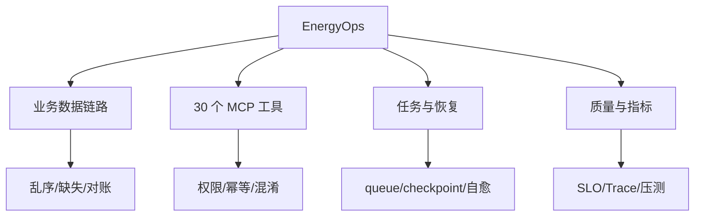

# 11｜面试回答与复习验收手册

> 目标：把前 10 个知识节点转化为“能迅速组织、能被追问、能落项目、能留下证据”的面试能力。

---

## 0. 使用规则

不要背整篇答案。每个问题按五层记忆：

| 层       | 目标      | 产物                       |
| ------- | ------- | ------------------------ |
| L0 关键词  | 5 秒唤起   | 5–8 个词                   |
| L1 一句话  | 15 秒定性  | 定义 + 价值                  |
| L2 标准回答 | 60 秒闭环  | 问题—原理—设计—边界—验证           |
| L3 深入   | 3 分钟系统化 | 流程/架构 + 失败 + 取舍          |
| L4 证据   | 追问可落地   | 代码/SQL/Test/Metric/Trace |

面试训练顺序：先独立回答，再看本手册；不要边看边觉得自己会了。

---

## 1. 万能回答骨架：P-D-F-M-E

| 字母 | 含义 | 要说什么 |
| --- | --- | --- |
| P — Problem | 核心问题 | 它解决什么，最大矛盾是什么 |
| D — Design | 主设计 | 组件和数据/状态主链路 |
| F — Failure | 失败与边界 | 错在哪里、怎样降级/替代 |
| M — Measure | 验证 | 质量、延迟、成本、风险指标 |
| E — Evidence | 证据 | 项目、代码、测试、指标、复盘 |

标准话术：

> 这个问题的本质是【P】。我会把系统拆成【D】，主链路是【…】。主要风险是【F】，所以加入【控制】；若【边界】成立，我改用【替代】。效果用【M】验证。在【E】里我通过【具体证据】验证过。

面试官继续追问时，从架构层下钻到状态/数据结构，再下钻到故障和代码。

---

## 2. 12 个必须熟练的标准答案

### 2.1 什么是生产级 AI 应用？

**关键词**：业务任务、概率模型、确定性约束、工具、后端、Eval、恢复、治理。

**60 秒**：

> 生产级 AI 应用围绕真实任务，把模型的理解和推理能力接入数据与工具，但由后端管理权威状态、权限、事务和可靠性。它不只返回一次好看的答案，还要有结构化输出、证据、Tool 契约、风险确认、任务状态、失败恢复、Eval/Trace、SLO 和版本灰度。最终用任务成功率、P95、单成功任务成本和高风险错误率验证，而不是只看 Prompt Demo。

**追问入口**：为什么不用传统程序？怎样定义成功？如何上线？

### 2.2 什么是 Agent？和 Workflow 的区别？

**关键词**：目标、观察、动态决策、工具、反馈、Loop、固定路径。

**60 秒**：

> Agent 是模型在循环中根据当前状态和环境反馈动态选择下一动作，直到完成或终止；Workflow 的控制流由代码预定义。固定可枚举流程优先 Workflow，开放式跨工具任务才用 Agent。生产 Agent 还需要状态、预算、checkpoint、验证、取消和审计。多 Agent 只在隔离、并行或权限差异能带来可测收益时使用。

### 2.3 Context、State、Memory 有何区别？

**关键词**：调用视图、运行事实、业务权威、短期、长期、重建。

**60 秒**：

> Context 是一次模型调用实际看到的 Token；Agent State 是 Run 当前节点、预算、产物等结构化事实；Business State 是数据库里的订单、权限等权威状态；Memory 是跨步骤或会话复用的信息。恢复时从 checkpoint 和业务状态重建 Context，而不是把聊天记录当真相。长期记忆还要有来源、作用域、TTL 和删除机制。

### 2.4 设计生产级 RAG。

**关键词**：摄取、结构化 Chunk、ACL、混合检索、重排、引用、拒答、分层 Eval。

**60 秒**：

> 离线链路解析文档、按结构切分、补元数据/ACL/版本，并建向量与关键词索引；在线链路带身份做 query 理解，在权限过滤下混合召回、重排去重、按 Token 预算组装，生成逐项引用的答案。证据不足或冲突则拒答/澄清。检索用 Recall@K/MRR/nDCG，生成测正确性、faithfulness、引用和拒答，线上再看任务成功、P95 和成本。

### 2.5 如何设计 Tool/MCP？

**关键词**：单一职责、Schema、授权、风险、幂等、错误、审计、连接标准。

**60 秒**：

> Tool 是受治理业务 API，要定义职责、输入输出 Schema、权限 scope、风险等级、幂等、超时、错误码、返回上限和审计。模型只提出调用，执行层独立校验与授权，高风险动作确认，写超时先查权威状态。MCP 标准化 Host/Client/Server 的能力发现和调用，但不自动提供最小权限、沙盒和业务幂等。

### 2.6 如何保证 Agent 写操作不重复？

**关键词**：业务幂等键、唯一约束、intent、unknown outcome、状态查询、checkpoint。

**60 秒**：

> ToolCallID 只关联一次协议调用，不是稳定业务意图。我用 tenant + business entity + operation 生成幂等键，副作用前记录 intent，服务端用唯一约束/条件更新，完成后保存外部结果并 checkpoint。超时进入 unknown outcome，先按业务键查询权威状态，证明未执行后才重试；无法确认则人工或补偿。

### 2.7 如何评测 Agent？

**关键词**：真实任务、环境、Golden/Holdout、结果/过程/工程/安全、grader、Trace、Replay、CI。

**60 秒**：

> 从真实任务和 Bad Case 构造可重置环境，分 dev/golden/holdout/adversarial。结果测任务成功，过程测路由、检索、工具和步骤，工程测 P95/成本/恢复，安全测越权与副作用。精确约束用代码 grader，语义用校准过的模型 Judge。每次 Run 保存版本和轨迹，支持 mock/sandbox Replay；变更进 CI 门禁后再 shadow/灰度。

### 2.8 asyncio 如何支撑 AI 后端？

**关键词**：I/O、event loop、TaskGroup、timeout、cancel、Semaphore、Queue、背压。

**60 秒**：

> 模型、检索和工具多是慢 I/O，asyncio 在 await 时让出 event loop，可承载大量在途请求。async 路由里不能做同步阻塞。并发用 TaskGroup 管生命周期，deadline/timeout 和取消向下传播，Semaphore/连接池限制资源，bounded Queue 做背压。CPU 密集工作放进程/独立服务，持久长任务进入外部队列。

### 2.9 消息队列如何保证一致性？

**关键词**：至少一次、ack after commit、业务幂等、Outbox、DLQ、lease。

**60 秒**：

> 队列通常至少一次，因此允许重复投递；消费者在事务内用事件 ID/业务键、唯一约束和状态机保证效果幂等，业务提交后再 ack。数据库状态和待发事件通过 Outbox 同事务写入，Publisher 可重复发送但消费者安全。Worker 用 lease/version 防迟到写入，永久失败进入可治理 DLQ。

### 2.10 如何做 Agent 长任务恢复？

**关键词**：Run/Step、checkpoint、artifact、lease、state query、resume、cancel。

**60 秒**：

> 把任务拆成可序列化、幂等的离散 Step，每个关键节点和副作用前后 checkpoint，大结果写 Artifact。Worker 通过 lease 执行，崩溃后新 Worker 读取 checkpoint，先查询业务权威状态和已完成副作用，再从安全节点 resume。事件有 sequence，支持断线；人工等待持久化而不占进程；取消能传播且迟到结果用版本拒绝。

### 2.11 如何做生产可靠性与降级？

**关键词**：SLO、deadline、retry budget、jitter、limit、breaker、bulkhead、degrade、rollback。

**60 秒**：

> 先按任务定义成功、P95、成本和风险 SLO；端到端 deadline 分给各下游。入口按租户限流/并发，调用只对暂时且幂等错误有限重试并加 jitter，熔断和 bulkhead 隔离失败。过载时减少步骤、换小模型、只读 Workflow、异步或转人工。组合版本经离线、shadow、canary，越过 guardrail 自动停止和回滚。

### 2.12 请介绍一个最有代表性的项目。

**结构**：业务问题 15 秒 → 架构与个人工作 30 秒 → 最难失败 30 秒 → 指标/证据 30 秒 → 反思 15 秒。

示例骨架：

> RuleArena 解决【谁的什么审查问题】，基线是【人工/规则】。我负责【核心模块】，架构按【取证—多视角审查—确定性状态验证—合并—审批】。最难的是【状态/副作用/Eval】，我用【checkpoint/幂等/Trace】处理。通过【样本、测试、指标】验证。当前不足是【真实用户/规模】，下一步用【具体实验】补齐。

---

## 3. 题库索引：从基础到系统设计

### A. 第一性原理与产品

| 级别 | 问题 | 回答命中点 |
| --- | --- | --- |
| L1 | AI 应用开发是什么？ | 概率模型 + 确定性后端 + 闭环 |
| L1 | 什么任务适合 LLM？ | 非结构化、泛化、可验证 |
| L2 | 何时不用 Agent？ | 固定路径、低预算、高风险不可验证 |
| L2 | 怎样定义 AI 功能成功？ | 基线、质量/效率/成本/风险 |
| L3 | 效果与成本如何取舍？ | 分层路由、Pareto、A/B |
| L3 | 如何从需求到架构？ | 任务→边界→状态→失败→Eval |
| L4 | 设计企业规则审查产品 | 用户旅程、HITL、证据、指标 |

### B. LLM 与 Context

| 级别 | 问题 | 回答命中点 |
| --- | --- | --- |
| L1 | Token、Temperature、Top-p 是什么？ | 工程意义而非公式背诵 |
| L1 | 为什么会幻觉？ | 概率生成、缺证据、目标错配 |
| L2 | Context 与 Memory 区别？ | 调用视图 vs 跨时信息 |
| L2 | 长上下文为什么可能变差？ | 噪声、冲突、注意力、成本 |
| L2 | 如何做结构化输出？ | Schema + 语义校验 + 有限修复 |
| L3 | 如何设计 Context Builder？ | 指令/状态/证据/工具/历史排序 |
| L3 | 会话压缩如何恢复？ | 摘要 + 原始引用 + 权威重查 |
| L4 | 如何做 Prompt 消融？ | 固定 Eval、单变量、版本比较 |

### C. RAG

| 级别 | 问题 | 回答命中点 |
| --- | --- | --- |
| L1 | RAG 完整链路？ | 摄取 + 查询 + 生成 + 反馈 |
| L1 | Embedding/向量检索？ | 语义表示、相似度、版本 |
| L2 | Chunk 如何选？ | 结构/问题粒度/Eval |
| L2 | BM25 vs Vector？ | 精确 vs 语义，Hybrid |
| L2 | Rerank 何时用？ | 质量收益 vs P95/成本 |
| L3 | ACL 如何实现？ | 身份→filter→受权召回 |
| L3 | RAG 如何评测？ | Retrieval 与 Answer 分层 |
| L3 | 知识如何增量更新？ | 版本、删除、双轨、回滚 |
| L4 | RAG 好但答案差怎么查？ | Trace 分层归因 |
| L4 | GraphRAG 何时值得？ | 多跳关系与维护成本 |

### D. Agent Runtime / Workflow

| 级别 | 问题 | 回答命中点 |
| --- | --- | --- |
| L1 | Agent Loop 是什么？ | observe/decide/act/verify/stop |
| L2 | Harness 包含什么？ | context/tools/policy/verify/runtime |
| L2 | 如何终止和防循环？ | 预算、进展、结构化原因 |
| L2 | Workflow vs Agent？ | 代码路径 vs 模型路径 |
| L3 | Checkpoint 存什么？ | state/version/artifact/effect/budget |
| L3 | Resume vs Replay？ | 完成原任务 vs 安全复现 |
| L3 | HITL 如何设计？ | 风险、影响、动作 hash、过期 |
| L3 | 多 Agent 何时有价值？ | 隔离/并行/权限/能力 |
| L4 | 设计长任务 Runtime | state/queue/lease/events/cancel |
| L4 | Reflection 局限？ | 同源盲点、成本、外部 oracle |

### E. Tool / MCP / Security

| 级别 | 问题 | 回答命中点 |
| --- | --- | --- |
| L1 | Tool Calling 生命周期？ | 提出→校验→执行→结果→继续 |
| L1 | MCP 解决什么？ | 标准连接，不替代安全 |
| L2 | Skill 和 Tool 区别？ | 方法复用 vs 外部动作 |
| L2 | 怎样设计 Tool Schema？ | 收窄、职责、错误、返回 |
| L3 | 幂等键怎么选？ | 稳定业务意图 + 唯一约束 |
| L3 | 写超时怎么办？ | unknown outcome + state query |
| L3 | Prompt Injection 防御？ | 不可信数据 + 执行层控制 |
| L3 | Tool 太多怎么办？ | 动态暴露、路由、混淆 Eval |
| L4 | 设计代码执行沙盒 | 网络/FS/资源/凭证/产物 |
| L4 | MCP OAuth 风险？ | scope、audience、confused deputy |

### F. Eval / AgentOps

| 级别 | 问题 | 回答命中点 |
| --- | --- | --- |
| L1 | Eval 是什么？ | 输入/环境 + grader + 指标 |
| L2 | Golden/Holdout 区别？ | 回归 vs 防过拟合 |
| L2 | Judge 有何风险？ | 偏差、漂移、人工校准 |
| L2 | Trace/Log/Metric 区别？ | 因果链/事件/聚合 |
| L3 | Agent 过程测什么？ | tool、step、evidence、policy |
| L3 | 如何设计 Replay？ | mock/sandbox/shadow、副作用隔离 |
| L3 | CI Eval 如何门禁？ | smoke/golden/safety/阈值 |
| L3 | 用户反馈如何回流？ | 修正+原因→治理→dataset |
| L4 | 新模型如何对比？ | 同集分桶、成本/P95/安全/shadow |

### G. Python / FastAPI / 并发

| 级别 | 问题 | 回答命中点 |
| --- | --- | --- |
| L1 | coroutine 和 Task？ | 对象 vs 调度执行 |
| L1 | GIL 与并发？ | I/O/线程/CPU/进程 |
| L2 | TaskGroup vs gather？ | 结构化失败/取消 |
| L2 | async handler 被阻塞？ | 同步 I/O/CPU 占 loop |
| L2 | 如何 timeout/cancel？ | deadline、finally、re-raise |
| L3 | 如何做背压？ | queue/semaphore/pool/rate limit |
| L3 | SSE 断线恢复？ | sequence + state store |
| L3 | BackgroundTasks 边界？ | 短任务，不持久 |
| L4 | 定位 P99？ | trace + loop lag + pool/queue |

### H. 数据库 / Redis / MQ

| 级别 | 问题 | 回答命中点 |
| --- | --- | --- |
| L1 | ACID/MVCC？ | 业务不变量与快照 |
| L2 | 隔离级别怎么选？ | 冲突、abort、重试 |
| L2 | 乐观/悲观锁？ | 长外部操作 vs 短事务 |
| L2 | 联合/Partial Index？ | 查询模式与成本 |
| L2 | Cache Aside？ | DB 权威、失效窗口 |
| L3 | 缓存击穿/雪崩？ | single-flight/jitter/limit |
| L3 | 至少一次如何幂等？ | unique/state/ack after commit |
| L3 | Outbox 解决什么？ | DB + event 双写 |
| L3 | 双 Worker 怎么办？ | lease/version/fencing |
| L4 | Exactly-once 怎么理解？ | 业务效果、多层协作 |

### I. 生产系统设计

| 级别 | 问题 | 回答命中点 |
| --- | --- | --- |
| L2 | SLI/SLO 如何定义？ | 任务成功 + P95 + 风险 |
| L2 | 重试如何设计？ | temporary/idempotent/budget/jitter |
| L2 | 熔断和限流区别？ | 失败隔离 vs 容量控制 |
| L3 | 降级阶梯？ | 减步骤→小模型→Workflow→人工 |
| L3 | 模型路由怎么做？ | 难度/风险/历史/成本 |
| L3 | 多租户隔离？ | identity 全链路、配额、ACL |
| L3 | Prompt/模型如何灰度？ | 组合版本、shadow、guardrail |
| L3 | 成本怎么优化？ | cost/success、先减无价值 |
| L4 | 设计企业 Agent 平台 | gateway/runtime/tools/eval/ops/security |
| L4 | 级联故障如何处理？ | bounded/retry budget/bulkhead/shedding |

### J. 计算机基础与工程交付

| 级别 | 问题 | 回答命中点 |
| --- | --- | --- |
| L1 | 进程、线程、协程区别？ | 隔离/共享/调度/成本 |
| L1 | TCP 三次握手解决什么？ | 双向能力、初始序列、旧连接 |
| L2 | HTTP/1.1 与 HTTP/2？ | 连接复用、多路复用、队头阻塞边界 |
| L2 | Cookie/Session/JWT？ | 状态位置、撤销、安全属性 |
| L2 | OAuth2 与 OIDC？ | 授权框架 vs 身份层 |
| L2 | Linux 如何查端口/连接/CPU/内存？ | 工具 + 假设驱动排障 |
| L2 | Docker 容器与虚拟机？ | 共享内核、namespace/cgroup、边界 |
| L3 | API 如何版本兼容？ | expand/migrate/contract、Schema |
| L3 | 优雅停机如何做？ | readiness、停止接流量、lease/checkpoint |
| L3 | CI/CD 如何覆盖 AI 变更？ | code tests + Eval + artifact/version/canary |

---

## 4. 四个项目的追问树

### 4.1 EnergyOps



必答：

- 为什么用 AI，哪些逻辑不交给模型？
- 30 个 Tool 如何分组和动态暴露？
- 写工具超时/重复如何处理？
- APScheduler 与持久队列的边界？
- 数据乱序和补齐怎样保证一致？
- 金账对账如何定义 oracle？
- 100 并发下瓶颈在哪里？

### 4.2 数驭穹图

必答：

- Intent/Domain routing 为什么需要？错误如何 fallback？
- Schema Linking 如何召回、重排和评测？
- SemQL/SQL 的中间表示解决什么？
- AST/read-only/scan/export/join 限制在哪层？
- 权限为何在检索/执行前？
- SQL 执行成功但语义错误怎样发现？
- 结果证据如何绑定 Schema/SQL/Run？

### 4.3 RuleArena

必答：

- 为什么多 Agent，而不是单 Agent？消融基线是什么？
- 可执行状态模型如何与 LLM 审查互补？
- Context/State/Memory 如何分层？
- Checkpoint 在哪些节点？
- 角色如何隔离工具和权限？
- 冲突 Finding 如何合并？
- Eval 数据集如何构建？
- 修复发布为何是高风险副作用？

### 4.4 Ovanta

必答：

- Access/Refresh Token 与权限模型；
- 会员、订单、支付、权益状态机；
- 支付回调验签、重放和幂等；
- 交易与权益消息双写如何处理；
- AI 功能怎样嵌入但不破坏交易确定性；
- 国际化与多租户数据怎样治理。

---

## 5. 系统设计答题顺序

遇到“设计一个企业 Agent/RAG/AI 平台”，按 12 步：

1. 用户、任务、规模、基线；
2. 质量、P95、成本、风险目标；
3. AI/程序/人工边界；
4. 主请求/任务链路；
5. 核心组件和部署边界；
6. State/Context/Memory；
7. 数据模型、事务、缓存、队列；
8. RAG 与 Tool 契约；
9. 并发、流式、长任务和恢复；
10. 安全、权限、副作用；
11. Eval/Trace/SLO；
12. 容量、降级、灰度、回滚和取舍。

先说假设再估算。信息不全时给两个场景，不要静默臆测。

---

## 6. 现场编码最低集合

### Python

- LRU/TTL cache；
- async producer-consumer；
- Semaphore 有界并发；
- timeout/cancel 清理；
- retry with exponential backoff + jitter；
- 状态机/幂等处理；
- 树、图 BFS/DFS、堆 TopK、二分、常见 DP。

### SQL

- 聚合、窗口函数、CTE；
- keyset pagination；
- 条件更新/乐观锁；
- unique + upsert 幂等；
- Outbox 查询与抢占；
- EXPLAIN 诊断。

### 系统伪代码

- Agent Loop；
- Context Builder；
- RAG hybrid + rerank；
- Tool policy gate；
- checkpoint/resume；
- code/model grader pipeline。

---

## 7. 飞书“已掌握能力”文档模板

每个能力单独一行，多维表管理；点开后使用下列详情模板：

```markdown
# <能力 ID> <核心问题>

- 优先级：P0/P1/P2
- 层级：事实/原理/决策
- 掌握度：M0/M1/M2/M3/M4
- 最后口述验证：
- 下次复习：

## L0 关键词

## L1 一句话

## L2 60 秒回答

## L3 架构/流程

## 失败、边界与替代

## 项目证据
- 代码/Commit：
- 测试：
- 指标/Trace：
- 复盘：

## 追问题
1.
2.
3.

## Patch 记录
- 来源：
- 5 个关键点：
- 2 个反例：
- 3 个迁移：
- 与旧结论：一致/补充/冲突/替换
```

### 升级规则

- M1 → M2：完成最小代码实验；
- M2 → M3：无资料实现 + 60 秒口述 + 三个追问；
- M3 → M4：项目证据 + 指标/测试 + 失败复盘；
- 超过 30 天未验证、框架/模型变化或追问失败，可主动降级。

---

## 8. 间隔复习与模拟面试

### 单节点复习节奏

| 时间 | 动作 |
| --- | --- |
| D0 | 阅读主线，写 5+2+3，完成最小实验 |
| D1 | 不看资料录 60 秒，修正缺口 |
| D3 | 回答 3 个深入追问，画架构 |
| D7 | 现场代码/SQL + 项目迁移 |
| D14 | 与相邻节点组合做系统设计 |
| D30 | 随机抽问；通过则保持，失败则降级回补 |

不是每个节点都机械复习；M4 且长期稳定的节点降低频率，近期 JD 命中与模拟暴露的缺口提高频率。

### 一次 60 分钟模拟

| 时间 | 内容 |
| --- | --- |
| 0–5 | 自我介绍与目标岗位 |
| 5–20 | 项目深挖 |
| 20–32 | Agent/RAG 原理与边界 |
| 32–45 | Python/DB/队列/并发 |
| 45–55 | 系统设计 |
| 55–60 | 反问与复盘 |

录音后只记三类缺口：知识缺、组织差、无证据。分别对应补资料、练表达、改项目。

---

## 9. 面试评分表

每项 0–2 分，总分 20：

| 维度 | 0 | 1 | 2 |
| --- | --- | --- | --- |
| 问题定义 | 跑题 | 能定义 | 有约束和基线 |
| 原理 | 术语堆叠 | 基本正确 | 能从机制推导 |
| 架构 | 无主线 | 有组件 | 状态/数据流清晰 |
| 失败 | 不提 | 提常见错 | 有故障语义和恢复 |
| 取舍 | 只有唯一答案 | 有替代 | 有适用条件和指标 |
| 安全 | 忽略 | 泛泛而谈 | 权限/副作用/审计具体 |
| 后端 | 只讲模型 | 提 API/DB | 并发/事务/队列落地 |
| Eval | 凭感觉 | 有指标 | 数据集/Trace/门禁完整 |
| 证据 | 无项目 | 说用过 | 代码/测试/指标/复盘 |
| 表达 | 散乱超时 | 基本完整 | 60 秒先结论后展开 |

- 16–20：可进入公司定向模拟；
- 12–15：知识基本盘有，但追问或证据不足；
- 8–11：回对应模块补 M2/M3；
- <8：先重建全图，不继续堆新资料。

---

## 10. 高频错误话术替换

| 不建议 | 更好的表达 |
| --- | --- |
| “用了 LangChain，所以是 Agent” | “路径由模型根据 Tool Result 动态决定，并有 Loop/状态/终止” |
| “Temperature=0 保证确定” | “用 Schema、校验、固定版本和 Eval 控制稳定性” |
| “向量库解决幻觉” | “检索提高证据可达性，生成仍需 faithfulness 与引用评测” |
| “MQ 保证 exactly-once” | “至少一次 + 幂等 + 事务/状态机实现效果一次” |
| “超时就重试” | “只重试暂时、幂等且仍有预算的错误；写操作先查状态” |
| “多 Agent 更智能” | “只有隔离/并行/权限收益经消融验证才保留” |
| “会 Python 异步” | “能解释阻塞、取消、背压、池耗尽并给压测证据” |
| “准确率 90%” | “说明数据集、样本量、分桶、grader、基线和置信/严重错误” |

---

## 11. 投递前 15 分钟抽查

- 目标公司的 5 个硬门槛能否各指向一个证据？
- 60 秒定位与项目介绍是否针对岗位簇？
- 主项目业务问题和个人贡献是否清楚？
- Agent/Workflow、Context/State/Memory、ToolCallID/幂等键能否区分？
- RAG 是否能画完整链路和分层 Eval？
- async、事务、缓存、消息队列能否回答一个故障场景？
- 能否给出一次失败、排查和量化改进？
- 简历中的每个“熟悉/优化/高并发”是否达到 M3/M4？

---

## 12. 本手册的完成定义

完成不是读完 11 篇，而是：

1. 12 个标准答案能在 60 秒内完成；
2. 题库中 P0/L1–L3 随机 80% 能通过追问；
3. 三个主项目各有架构、测试、指标、Trace 和失败复盘；
4. 能在 45 分钟完成“企业 Agent 平台”系统设计；
5. 飞书能力台账中所有 P0 至少 M3，最核心 8–10 项达到 M4。
