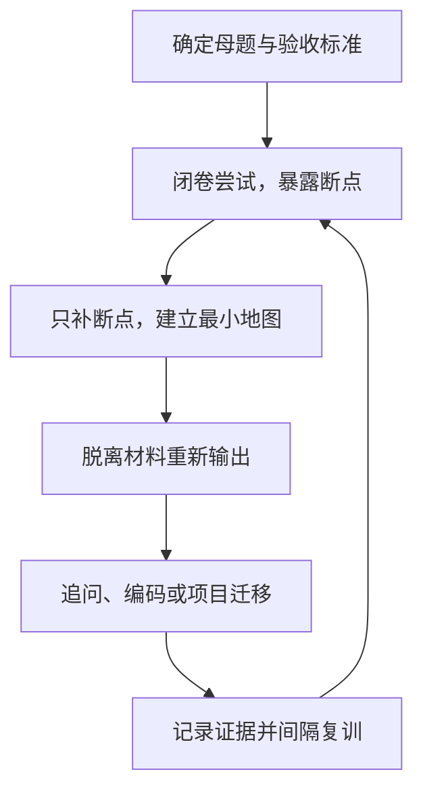

# 母题驱动证据闭环学习法

> 来源正本：`raw/gpt-学习方法.md`（GPT 结合经典学习方法与本人情况制定）。
> 2026-09-08 起为**学习执行内核**：所有学习（Pi / Claude Code / 八股 / 算法 / 项目补课）统一走这套流程。至少连续执行 8 周，中途只调内容优先级和训练量，不换方法。

## 一句话内核

> 以高价值母题组织知识，先闭卷暴露断点，只补不会的部分，再用面试、编码和项目证据完成验收，通过间隔复训获得稳定调用能力。

目标不是"看完、理解、记住"，而是：**面对一个问题，能脱离材料独立讲清、回答追问、完成操作，并迁移到真实项目。**

## 在系统中的定位（与已有规则的关系）

| 文档 | 回答的问题 | 关系 |
|---|---|---|
| [[面试准备第一性原理]] | 面试准备**做什么**：挖决策链 + 口述输出 | 面试域总操作系统，优先级不变。知识层缺口的学习按本法的闭环执行 |
| [[学习方法]] | 学习的**认知原则**：生成压倒消费 | 本法是它的执行内核：闭卷=检索，复训=间隔，费曼=生成，AI 教练=判别式 |
| `questions.md` 问题台账 | 加工**由什么驱动** | 闭环产出（母题卡）是台账认可的复用资产形式；复训通过 ≠ 问题闭环，两者分开记账 |
| [[行动规则]] | 每天**怎么启动** | 1+1+1 每日结构即为"保底三件事"的具体化 |

## 一、唯一的学习闭环

无论学什么，都走同一条路径：



1. **确定母题**：最小学习单位是"一个需要解决的问题"，不是一篇文章或一章。例：Redis 分布式锁为什么不能只用 `SETNX`？看到什么信号该想到滑动窗口？每次只推进一个母题。
2. **先闭卷尝试**（3–5 分钟）：不看材料讲已知、画主线、写伪代码、标记卡点。卡点写成事实（"能说 X，说不清为什么 Y"），不写"这部分不会"——非评判观察。
3. **只补断点**：回看对应段落/源码/题解，不重读全部材料。新领域入门可先要"一个故事 + 一张主线图"，此阶段 ≤ 学习时间 30%，最终必须切回准确术语。
4. **费曼式重建**（关材料）：20 秒一句话结论 → 5–7 个恢复关键词 → 3 分钟完整讲解。回答骨架：**场景 → 核心问题 → 设计机制 → 运行过程 → 取舍 → 项目迁移**。
5. **证据验收**：见下表。"感觉理解"不算完成。
6. **间隔复训**：高频母题第 1、3、7、14、30 天闭卷复述；中优先级只做 3、14、30；低优先级不进复训池。每周一次"全量快速召回"（空白纸画本周知识树），只深练暴露的红色断点。

## 二、证据验收标准

| 类型 | 通过标准 |
|---|---|
| Agent、八股、系统设计 | 闭卷讲 3 分钟 + 回答两层追问 + 给出一个项目案例 |
| 算法 | 识别题型 + 说出不变量 + 独立编码通过 + 解释边界条件 |
| 项目开发 | 代码/测试/日志可复现 + 能解释两个设计取舍 |
| 技术文章 | 能转化为母题并通过以上验收；只摘录不算完成 |
| 博客 | 是已掌握知识的包装产物，不作为独立学习任务 |

汇报语言：不说"今天读完了 X"，说"今天通过了「Y」母题的面试验收"。

## 三、每日结构：1+1+1

- 一个**项目交付**：活跃三项目（EnergyOps / 数驭穹图 / RuleArena）任一，或实习项目复盘（对接 Q-2026-008 决策链开采）；
- 一个**算法母题**；
- 一个**面试知识母题**：Pi、Claude Code、八股、系统设计轮换；
- 额外 15–20 分钟处理到期复训。

博客阅读不单独占主线，只作为当前母题的定向输入；个人博客等母题通过验收后再整理。

一次知识训练 = 50 分钟：5 闭卷 / 15 定向补缺 / 15 重新讲解或画图 / 10 追问迁移或编码 / 5 记录母题卡与下次复训日期。

## 四、母题卡模板

```text
母题：
为什么它重要：

一句话结论：
恢复关键词：

主线 / 核心不变量：
完整回答骨架：

两个递进追问：
项目迁移案例：

本次断点：
通过证据：
下次复训：
```

落点规则：不同来源讲同一个问题，进**同一张母题卡**；母题卡按主题放 `wiki/interview/`（面试表达）或 `wiki/topics/`（技术知识），不按文章建笔记。

## 五、AI 严格教练模式（学习场景默认指令）

```text
进入严格教练模式，不要先给我答案。

围绕母题「___」：
1. 先让我闭卷回答；
2. 根据我的回答连续追问两层；
3. 按准确性、结构、因果、取舍、迁移能力评分；
4. 只讲我暴露出的知识断点；
5. 讲解后要求我重新回答；
6. 未通过前不要用鼓励性语言模糊评价。
```

AI 负责解释、出题、追问、纠错；第一次答案必须由本人生成。这与 [[学习方法]] 的判别式一致：AI 用在生成之后 = 陪练。

## 六、8 周锁定与改版条件

- 锁定期内看到新学习方法 → 只进**方法停车场**，不当天采用（对冲方法论库存过剩）。
- 8 周后才评估；平时只允许调：母题优先级、每日训练量、复训间隔密度、证据类型。
- 改版门槛：认真执行率 ≥ 80%，但连续两周闭卷通过率和模面表现仍无改善 → 一次只改一个环节，不整体推翻。

## 关联页面

- [[学习方法]] · [[面试准备第一性原理]] · [[行动规则]]
- `questions.md`：母题来源与闭环记账（Q-2026-008 决策链开采为当前主落地问题）
